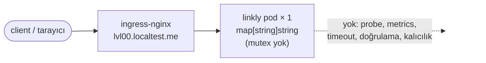

# 00 — naive · "Tek dosya, tek pod, bellek"

> **Bu seviyede ne yaşayacaksın?**
> - 50 eşzamanlı kullanıcıda sürecin çökmesi (P00-01) ve her çöküşte bütün linklerin gitmesi (P00-02)
> - İkinci replikada rastgele 404 (P00-03) ve her dağıtımda bir hata dalgası (P00-04)
> - Çakışan kısa kodlar (P00-05) ve denetlenmeyen girdi: `javascript:`, iç ağ adresi, 5 MB gövde (P00-06)
> - Yavaş istemciye karşı korumasız sunucu (P00-07) ve sınırsız büyüyüp OOMKilled olan bellek (P00-08)
> - Bunların hiçbirini göstermeyen metrikler (P00-09) ve tıklamaları tarayıcıda yutan 301 (P00-10)
>
> **Bu seviye olmasa ne olur?** Sonraki seviyelerin her parçası (kilit, probe, veritabanı, önbellek, kuyruk) bir cevaptır; 00 soruları üretir. Sorunu görmeden öğrenilen çözüm ezberdir.
>
> **Yeni gelen teknolojiler:** Go `net/http`, Kubernetes (Deployment, Service, Ingress), ingress-nginx, k6, Prometheus + Grafana — bu seviyede yalnızca konteyner düzeyinde ([her biri tek cümleyle](../README.md#kullanılan-teknolojiler)).

## 1. Bu seviye ne?

Bir URL kısaltıcının en kısa hali: tek `main.go`, bellekte bir `map`, hiçbir koruma yok. Kubernetes'te tek
pod olarak çalışır ve gerçekten link kısaltır. Burada hiçbir şey düzeltilmez; amaç, "çalışan" bir servisin kaç
yoldan kırıldığını kendi gözünle görmek.

## 2. Mimari



Tek bileşen, tek replika, veri süreç belleğinde. Uygulamanın metrik ucu yok; Prometheus pod'u yalnızca dışarıdan
(CPU, bellek, restart) görür.

## 3. Önceki seviyeden çözülenler

Yok — bu ilk basamak. `problems/SOLVES` boş.

## 4. Ayağa kaldırma

İlk kez mi? Önce kök README'deki [Sıfırdan başlangıç](../README.md#sıfırdan-başlangıç): platform bir kez kurulur ve
`LADDER` (repo kökü) tanımlanır. Her komut bloğu `cd "$LADDER/…"` ile başlar; olduğu gibi yapıştır.
Bu seviyenin platformdan istediği: **temel yığın (kind, ingress, Prometheus, Grafana)**; `make up` açar.

Hızlı başvuru (komutları tek tek kullan; satır sonu açıklamaları için zsh'da `setopt interactivecomments` gerekir):

```bash
cd "$LADDER/00-naive"
make up            # profil → Grafana'yı temizle → build → push → deploy → rollout wait → smoke
code=$(curl -s -XPOST http://lvl00.localtest.me/api/links -H 'Content-Type: application/json' -d '{"url":"https://example.com"}' | jq -r .code); echo "$code"
curl -s -o /dev/null -w '%{http_code} → %{redirect_url}\n' http://lvl00.localtest.me/$code   # 301 → https://example.com (01'den itibaren 302 — neden: P00-10)
make grafana       # Ladder klasörü, level=lvl00 — giriş: admin / ladder
make load S=mixed  # aynı senaryolar her seviyede: create redirect mixed hot-key burst abuser read-your-writes stairs scan
make repro P=P00-01   # §6'daki bir sorunu otomatik üret → REPRODUCED / NOT-REPRODUCED
make env           # açık ayar/tuzaklar · değiştir: make set E="KEY=değer" · hepsini geri al: make reset (§7)
make down          # seviyeyi kaldır · kümeyi durdurmak için: cd "$LADDER/platform" && make stop
```

**Rehber — bu seviyeyi baştan sona, sırayla.**

1. Kur. Başka bir seviye açıksa önce onu kapat (aynı anda tek seviye: `cd "$LADDER/NN-ad" && make down`).
   `make up` Grafana'yı da temizler; sonunda `✔ lvl00 ayakta` yazar:
```bash
cd "$LADDER/00-naive"
make up
```

**Verileri temizleyip sıfırdan koşmak istersen** 1. adımın yerine bunu kullan: bütün seviyelerin verisi
(linkler, veritabanı, önbellek, kuyruk) ve Grafana'nın gösterdiği metrik, trace, log silinir; küme ve kurulum
kalır (~2-3 dk). Ardından bu seviye temiz kurulur. Yalnızca Grafana çizgilerini temizlemek için (veri kalır)
seviye klasöründe `make fresh` yeter; her deneyin ilk komutu zaten bu.
```bash
cd "$LADDER"
make wipe CONFIRM=1
cd "$LADDER/00-naive"
make up
```
2. §6'daki sorunları sırayla yaşa (P00-01 → P00-10): adımları yapıştır → **Terminalde ne görmelisin** ile
   karşılaştır → **Grafana'da gör** linklerini aç. 00'da iki eşzamanlı istek süreci çökertebildiği için P00-01
   dışındaki yükler tek kullanıcıyla (`--vus 1`) ya da sıralı `curl` ile verilir.
3. Bitince ayarları geri al ve seviyeyi kapat:
```bash
cd "$LADDER/00-naive"
make reset
make down
```

## 5. API

Her seviyede aynı: [docs/API.md](../docs/API.md).

Bu seviyenin farkları: `GET /{code}` **301** döner (01'den itibaren 302); `/healthz`, `/readyz`, `/metrics` **yok**.

## 6. Reproduce edilebilir sorunlar

Her sorun aynı düzende: **Ne deniyoruz** (deneyin sorusu) → **Neden** → adımlar (her adım ne yaptığını söyler)
→ **Terminalde ne görmelisin** → **Grafana'da gör** (giriş: admin / ladder) → **Nerede çözülüyor**.
`make repro` hükmü: `REPRODUCED` = sorun var · `NOT-REPRODUCED` = yok · `SKIPPED` = ölçülemedi.

| ID | Sorun | Reproduce | Grafana'da | Çözüm |
|---|---|---|---|---|
| P00-01 | Eşzamanlı map yazımı → süreç çöker | `make repro P=P00-01` | [01 · Pods & Resources](http://grafana.localtest.me/d/ladder-pods?var-level=lvl00&from=now-15m&to=now&refresh=10s) · [15 · k6](http://grafana.localtest.me/d/ladder-k6?var-level=lvl00&from=now-15m&to=now&refresh=10s) → "Yeniden başlatma sayısı" | 01 |
| P00-02 | Restart = tüm linkler kaybolur | `CONFIRM=1 make repro P=P00-02` | [01 · Pods & Resources](http://grafana.localtest.me/d/ladder-pods?var-level=lvl00&from=now-15m&to=now&refresh=10s) · [03 · App Business](http://grafana.localtest.me/d/ladder-app-business?var-level=lvl00&from=now-15m&to=now&refresh=10s) → "Bellek kullanımı" | 02 |
| P00-03 | `replicas>1` → rastgele 404 | `CONFIRM=1 make repro P=P00-03` | [01 · Pods & Resources](http://grafana.localtest.me/d/ladder-pods?var-level=lvl00&from=now-15m&to=now&refresh=10s) · [03 · App Business](http://grafana.localtest.me/d/ladder-app-business?var-level=lvl00&from=now-15m&to=now&refresh=10s) → "Hazır pod adresi (endpoint) sayısı" | 02 |
| P00-04 | Rollout sırasında hata dalgası | `make repro P=P00-04` | [15 · k6](http://grafana.localtest.me/d/ladder-k6?var-level=lvl00&from=now-15m&to=now&refresh=10s) · [01 · Pods & Resources](http://grafana.localtest.me/d/ladder-pods?var-level=lvl00&from=now-15m&to=now&refresh=10s) → "Dönen durum kodları" | 01 |
| P00-05 | 4 karakter kod, çakışma kontrolü yok | `make repro P=P00-05` | görünmez — kanıt terminalde ↓ | 01 |
| P00-06 | Giriş doğrulaması yok | `make repro P=P00-06` | [14 · Security](http://grafana.localtest.me/d/ladder-security?var-level=lvl00&from=now-15m&to=now&refresh=10s) · [01 · Pods & Resources](http://grafana.localtest.me/d/ladder-pods?var-level=lvl00&from=now-15m&to=now&refresh=10s) → "Tehlikeli URL reddi (sebebe göre)" | 01 |
| P00-07 | Sunucu timeout'u yok (slowloris) | `make repro P=P00-07` | görünmez — kanıt terminalde ↓ | 01 |
| P00-08 | Bellek sınırsız → OOMKilled | `make repro P=P00-08` | [01 · Pods & Resources](http://grafana.localtest.me/d/ladder-pods?var-level=lvl00&from=now-15m&to=now&refresh=10s) → "Son sonlanma nedeni" | 01 (ölçüm) · 02 (asıl) |
| P00-09 | Gözlemlenebilirlik sıfır | `make repro P=P00-09` | [02 · App RED](http://grafana.localtest.me/d/ladder-app-red?var-level=lvl00&from=now-15m&to=now&refresh=10s) · [03 · App Business](http://grafana.localtest.me/d/ladder-app-business?var-level=lvl00&from=now-15m&to=now&refresh=10s) → "Saniyedeki istek" | 01 |
| P00-10 | 301 + Cache-Control yok | `make repro P=P00-10` | görünmez — kanıt terminalde ↓ | 01 |

---

### P00-01 · Eşzamanlı map yazımı → süreç çöker

**Ne deniyoruz:** Aynı anda gelen yazma istekleri süreci öldürür mü?
**Neden:** Linkler kilitsiz Go map'lerinde; Go, iki isteğin aynı map'e aynı anda yazdığını görünce süreci kendisi
durdurur (`fatal error: concurrent map writes`, yakalanamaz).

**Reproduce (adım adım):** Otomatik: `make repro P=P00-01` (taze pod, 50 kullanıcıyla 15 sn yazma, pod'un önceki
logunda Go'nun ölüm mesajını arar). Elle:

1. Temiz başla: Grafana'yı temizle, pod'u yenile (çökmüş bir pod'un restart sayacı donar), adını al:
```bash
cd "$LADDER/00-naive"
make fresh
kubectl -n lvl00 delete pod -l app.kubernetes.io/name=linkly
kubectl -n lvl00 wait --for=condition=Ready pod -l app.kubernetes.io/name=linkly --timeout=90s
pod=$(kubectl -n lvl00 get pod -l app.kubernetes.io/name=linkly -o json | jq -r '[.items[] | select(.metadata.deletionTimestamp == null) | select(any(.status.containerStatuses[]?; .ready)) | .metadata.name][0]'); echo "pod: $pod"
kubectl -n lvl00 get pods
```
2. İkinci bir terminalde pod'u izle, açık bırak:
```bash
cd "$LADDER/00-naive"
kubectl -n lvl00 get pods -w
```
3. İlk terminalde 50 kullanıcıyla 30 sn link oluştur, sonra pod'un neden öldüğüne bak:
```bash
cd "$LADDER/00-naive"
make load S=create K6_ARGS="--vus 50 --duration 30s"
kubectl -n lvl00 get pods
kubectl -n lvl00 logs "$pod" --previous | grep -m1 'concurrent map'
kubectl -n lvl00 get pod "$pod" -o jsonpath='{.status.containerStatuses[0].lastState.terminated.reason}'; echo
```
4. Pod'u yenile; sonraki deney sağlam pod'la başlasın (ikinci terminali Ctrl+C ile kapatabilirsin):
```bash
cd "$LADDER/00-naive"
kubectl -n lvl00 delete pod -l app.kubernetes.io/name=linkly
kubectl -n lvl00 wait --for=condition=Ready pod -l app.kubernetes.io/name=linkly --timeout=90s
```
5. Karşılaştırma: aynı pod'a tek kullanıcıyla 90 sn yük — hızlı ama hiçbir istek bir diğeriyle aynı anda değil:
```bash
cd "$LADDER/00-naive"
make load S=redirect K6_ARGS="--vus 1 --duration 90s"
kubectl -n lvl00 get pods
```

**Terminalde ne görmelisin:** 1. adımda `RESTARTS 0`. Yük başlayınca ikinci terminalde pod `Error` →
`CrashLoopBackOff` → `Running` arasında gidip gelir, `RESTARTS` birkaç saniyede bir artar. k6 özetinde
(`k6 lvl00: reqs=… 5xx=…`) büyük bir `5xx`: pod ölüyken ingress `503`, istek ortasında ölünce `502` döner. Log
`fatal error: concurrent map writes`, sonlanma nedeni `Error` — süreci Go kendisi durdurdu. 5. adımda `5xx=0` ve
`RESTARTS` sabit: sorun yük değil, eşzamanlılık.

**Grafana'da gör:** [`01 · Pods & Resources`](http://grafana.localtest.me/d/ladder-pods?var-level=lvl00&from=now-15m&to=now&refresh=10s) ve [`15 · k6`](http://grafana.localtest.me/d/ladder-k6?var-level=lvl00&from=now-15m&to=now&refresh=10s) — yükten sonra aç
- "Yeniden başlatma sayısı" → basamak basamak artar; her basamak bir çöküş.
- "Son sonlanma nedeni" → turuncu `<pod>: Error`: süreç kendi kendine öldü (bellek sınırı öldürseydi `OOMKilled` olurdu).
- "CPU kullanımı (bir çekirdeğin %'si)" → sakin kalır: çöküşün sebebi kaynak değil mantık hatası. Sakin bir kaynak grafiği "sağlıklı" demek değildir.
- "Hazır pod adresi (endpoint) sayısı" → çöküş anlarında 0'a iner (trafiği alacak pod yok); metrikler 30 sn'de bir toplandığı için her çöküş görünmez.
- "Dönen durum kodları" → `503` ve `502` çizgileri `201`'i (başarılı oluşturma) ezer.

**Nerede çözülüyor:** 01 (`sync.RWMutex`); kalıcı çözüm veriyi süreçten çıkarmak (02).

---

### P00-02 · Restart = tüm linkler kaybolur

**Ne deniyoruz:** Pod yenilenince önceden oluşturulan linkler yaşıyor mu?
**Neden:** Tek veri kaynağı süreç belleği; konteyner giderse (dağıtım, OOM, çöküş, düğüm boşaltma) veri de gider.

**Reproduce (adım adım):** Otomatik: `CONFIRM=1 make repro P=P00-02` (link oluşturur, pod'u siler, aynı kodu
tekrar ister; `CONFIRM=1` pod silme onayıdır). Elle:

1. Temiz başla; bir link oluştur ve çalıştığını gör:
```bash
cd "$LADDER/00-naive"
make fresh
code=$(curl -s -XPOST http://lvl00.localtest.me/api/links -H 'Content-Type: application/json' -d '{"url":"https://example.com/p0002"}' | jq -r .code); echo "kod: $code"
curl -s -o /dev/null -w 'restart öncesi: %{http_code}\n' http://lvl00.localtest.me/$code
```
2. Pod'u sil (Deployment yenisini açar), yeni pod hazır olunca aynı kodu tekrar iste:
```bash
cd "$LADDER/00-naive"
kubectl -n lvl00 delete pod -l app.kubernetes.io/name=linkly
kubectl -n lvl00 wait --for=condition=Ready pod -l app.kubernetes.io/name=linkly --timeout=90s
sleep 5
curl -s -o /dev/null -w 'restart sonrası: %{http_code}\n' http://lvl00.localtest.me/$code
kubectl -n lvl00 get pods
```

**Terminalde ne görmelisin:** `restart öncesi: 301`, ardından `restart sonrası: 404`. `get pods` yeni bir pod adı
ve `RESTARTS 0` gösterir: pod yeniden başlamadı, yenisiyle değişti — link eski pod'un belleğiyle gitti.

**Grafana'da gör:** [`01 · Pods & Resources`](http://grafana.localtest.me/d/ladder-pods?var-level=lvl00&from=now-15m&to=now&refresh=10s) ve [`03 · App Business`](http://grafana.localtest.me/d/ladder-app-business?var-level=lvl00&from=now-15m&to=now&refresh=10s) — pod'u sildikten sonra aç
- "Bellek kullanımı" → eski pod'un çizgisi biter, yeni pod adıyla yenisi başlar: bellek (ve içindeki linkler) boş başladı.
- "Yeniden başlatma sayısı" → değişmez: pod yeniden başlamadı, değiştirildi. Veri kaybı bu sayaçta görünmez.
- "Kayıtlı link sayısı" → **No data**: 00 bu metriği üretmiyor (P00-09); kaybı ölçemezsin bile. 01'de sıfıra düşüşü görürsün.

**Nerede çözülüyor:** 02 (Postgres).

---

### P00-03 · `replicas>1` → rastgele 404

**Ne deniyoruz:** 3 replikada aynı kısa link her istekte bulunuyor mu?
**Neden:** Her pod'un kendi map'i var ve Service istekleri pod'lara dağıtır; link yalnızca onu oluşturan pod'da.
N replikada bulma olasılığı 1/N.

**Reproduce (adım adım):** Otomatik: `CONFIRM=1 make repro P=P00-03` (3 replikaya çıkar, bir linki 60 kez okur,
eski replika sayısına döner). Elle:

1. Temiz başla, 3 replikaya çık; ingress'in üç pod'u da görmesini bekle (beklemezsen istekler tek pod'a gider ve 404
   çıkmaz):
```bash
cd "$LADDER/00-naive"
make fresh
kubectl -n lvl00 scale deploy/linkly --replicas=3
kubectl -n lvl00 rollout status deploy/linkly
sleep 10
kubectl -n lvl00 get endpointslice -l kubernetes.io/service-name=linkly
```
2. Bir link oluştur (yalnızca onu alan pod'un belleğine yazılır), aynı kodu 60 kez iste:
```bash
cd "$LADDER/00-naive"
code=$(curl -s -XPOST http://lvl00.localtest.me/api/links -H 'Content-Type: application/json' -d '{"url":"https://example.com/p0003"}' | jq -r .code); echo "kod: $code"
for i in $(seq 1 60); do curl -s -o /dev/null -w '%{http_code} ' http://lvl00.localtest.me/$code; done; echo
```
3. Geri al:
```bash
cd "$LADDER/00-naive"
kubectl -n lvl00 scale deploy/linkly --replicas=1
kubectl -n lvl00 rollout status deploy/linkly
```

**Terminalde ne görmelisin:** `ENDPOINTS` sütununda üç pod adresi. 60 cevabın ~1/3'ü `301`, ~2/3'ü `404` (ölçülen:
60'ta 40 tane 404). Link tek pod'un belleğinde; istekler üç pod'a dağılıyor.

**Grafana'da gör:** [`01 · Pods & Resources`](http://grafana.localtest.me/d/ladder-pods?var-level=lvl00&from=now-15m&to=now&refresh=10s) ve [`03 · App Business`](http://grafana.localtest.me/d/ladder-app-business?var-level=lvl00&from=now-15m&to=now&refresh=10s) — deney sırasında ya da hemen sonra aç
- "Hazır pod adresi (endpoint) sayısı" → 1'den **3**'e çıkar: istekler artık üç ayrı belleğe dağılıyor; geri alınca 1'e döner.
- "404 (pod'a göre)" → **No data**: 00'da redirect metriği yok (P00-09); 01'de (P01-02) pod başına ayrı çizgi çizer.

**Nerede çözülüyor:** 02 — ölçeklenebilirlik, durumu pod'da tutmayan (stateless) servisle başlar.

---

### P00-04 · Rollout sırasında hata dalgası

**Ne deniyoruz:** Yeni sürüm dağıtılırken (rollout) istekler düşüyor mu?
**Neden:** readinessProbe yok (yeni pod hazır olmadan trafik alır); graceful shutdown ve preStop yok (eski pod
elindeki istekleri bırakıp ölür, ingress listesinden düşmeden kapanır).

**Reproduce (adım adım):** Otomatik: `make repro P=P00-04` (tek kullanıcılı yük altında 3 kez rollout, 5xx ve 404'ü
ayrı sayar; yarışı kaçırırsa `ROLLOUTS=6 make repro P=P00-04`). Elle:

1. Temiz başla; pod'un hazır olduğunu ve kapanırken ne yapacağını söyleyen bir ayar var mı bak:
```bash
cd "$LADDER/00-naive"
make fresh
kubectl -n lvl00 get deploy linkly -o yaml | grep -cE 'readinessProbe|livenessProbe|preStop'
```
2. İkinci bir terminalde **tek kullanıcılı** yükü başlat (paralel yük P00-01 çökmesini tetikler ve iki sorunu karıştırır):
```bash
cd "$LADDER/00-naive"
make load S=redirect K6_ARGS="--vus 1 --duration 90s"
```
3. Yük başladıktan ~15 sn sonra ilk terminalde üç kez art arda dağıtım yap:
```bash
cd "$LADDER/00-naive"
for i in 1 2 3; do kubectl -n lvl00 rollout restart deploy/linkly; kubectl -n lvl00 rollout status deploy/linkly; sleep 5; done
```

**Terminalde ne görmelisin:** 1. adımda `0`: probe da preStop da yok. İkinci terminalde k6 özetinde
(`k6 lvl00: reqs=… 5xx=… 404=…`) `5xx` sıfırdan büyük (ölçülen: 142) — dağıtım penceresi, bu sorun. `404` çok daha
büyük: yeni pod'un belleği boş (P00-02, ayrı sorun). `5xx=0` ise yarışı kaçırdın; 3. adımı yeni bir yükle tekrarla.

**Grafana'da gör:** [`15 · k6`](http://grafana.localtest.me/d/ladder-k6?var-level=lvl00&from=now-15m&to=now&refresh=10s) ve [`01 · Pods & Resources`](http://grafana.localtest.me/d/ladder-pods?var-level=lvl00&from=now-15m&to=now&refresh=10s) — yük başlayınca aç; ~1 dk sürer
- "Dönen durum kodları" → ilk rollout'tan sonra `301`'in yerini `404` alır (P00-02); her rollout anında küçük bir `502`/`503` çizgisi belirir — bu sorun. Lejantta `502`'ye tıklayıp tek başına bak.
- "Başarısız oran (zaman içinde)" → ilk rollout'ta yükselir ve inmez: k6 404'ü de hata sayar; bu panel iki sorunu karıştırır.
- "Bellek kullanımı" → her rollout'ta eski pod'un çizgisi biter, yenisi başlar; bu anlar 5xx anlarıyla çakışır.

**Nerede çözülüyor:** 01 (probe'lar + `preStop` + düzgün kapanma sırası).

---

### P00-05 · 4 karakterlik kod, çakışma kontrolü yok

**Ne deniyoruz:** İki link aynı kısa kodu alırsa ne olur?
**Neden:** Kod 4 karakter (62⁴ ≈ 14.8 M ihtimal) ve yeni kayıt eskisinin üzerine kontrolsüz yazılıyor. Doğum günü
paradoksu: ~4.5 bin linkte çakışma ihtimali %50.

**Reproduce (adım adım):** Otomatik: `make repro P=P00-05` (10.000 link üretir, ~2 dk; çakışmaları sayar ve çakışan
kodun şu an kime ait olduğunu gösterir). Elle:

1. Temiz başla; 10.000 link oluştur — **sıralı** (paralel P00-01 çökmesini tetikler), birkaç dakika sürer:
```bash
cd "$LADDER/00-naive"
make fresh
for i in $(seq 1 10000); do curl -s -XPOST http://lvl00.localtest.me/api/links -H 'Content-Type: application/json' -d "{\"url\":\"https://example.com/u/$i\"}"; done > /tmp/p0005.json
```
2. Kodları say, çakışan birini bul ve şu an nereye gittiğine bak:
```bash
cd "$LADDER/00-naive"
jq -r .code /tmp/p0005.json | wc -l
jq -r .code /tmp/p0005.json | sort -u | wc -l
dupe=$(jq -r .code /tmp/p0005.json | sort | uniq -d | head -1); echo "çakışan kod: $dupe"
grep -F "\"code\":\"$dupe\"" /tmp/p0005.json
curl -s http://lvl00.localtest.me/api/links/$dupe | jq .
```

**Terminalde ne görmelisin:** `10000`, sonra birkaç eksiği (ölçülen: 9997 benzersiz → 3 çakışma). `grep` aynı kodla
iki farklı `url` basar: iki kullanıcıya da `201` ve aynı kısa link verildi. `GET` yalnızca sonrakini döner — ilk
link hatasız yok oldu. `çakışan kod:` boşsa (~%4 ihtimal) 1. adımı `seq 1 20000` ile tekrarla.

**Grafana'da gör:** Grafana'da görünmez — 00'da çakışmayı sayan metrik yok; bu, sessiz veri kaybı. Kanıt terminalde:
- `make repro P=P00-05` → `10000 üretim, 9997 benzersiz kod → 3 çakışma` ve çakışan kodun son sahibi.

**Nerede çözülüyor:** 01 (`crypto/rand`, 7 karakter, çakışmada yeniden dene, `collision` sayacı).

---

### P00-06 · Giriş doğrulaması yok

**Ne deniyoruz:** Uygulama tehlikeli ya da anlamsız girdiyi reddediyor mu?
**Neden:** Tek kontrol JSON'u çözmek; şema, hedef adres ve gövde boyutu denetlenmiyor. Güvenilir görünen bir kısa
link tarayıcıyı `javascript:`'e ya da iç ağa yollayabilir (open redirect).

**Reproduce (adım adım):** Otomatik: `make repro P=P00-06` (`javascript:`, metadata adresi, boş/bozuk URL ve 5 MB
gövdeyi dener; gövdeyi önce ingress'ten, sonra doğrudan pod'a yollar). Elle:

1. Temiz başla; `javascript:` hedefli bir link oluştur, yönlendirmenin nereye gittiğine bak:
```bash
cd "$LADDER/00-naive"
make fresh
code=$(curl -s -XPOST http://lvl00.localtest.me/api/links -H 'Content-Type: application/json' -d '{"url":"javascript:alert(1)"}' | jq -r .code); echo "kod: $code"
curl -sI http://lvl00.localtest.me/$code | grep -i '^location'
```
2. Aynısını bulut metadata adresiyle (iç ağ) dene:
```bash
cd "$LADDER/00-naive"
code=$(curl -s -XPOST http://lvl00.localtest.me/api/links -H 'Content-Type: application/json' -d '{"url":"http://169.254.169.254/latest/meta-data/"}' | jq -r .code); echo "kod: $code"
curl -sI http://lvl00.localtest.me/$code | grep -i '^location'
```
3. Boş ve bozuk URL'ler:
```bash
cd "$LADDER/00-naive"
for u in '' 'not-a-url' '   '; do curl -s -o /dev/null -w "[$u] → %{http_code}\n" -XPOST http://lvl00.localtest.me/api/links -H 'Content-Type: application/json' -d "{\"url\":\"$u\"}"; done
```
4. 5 MB gövde: önce ingress'ten, sonra ingress'i atlayıp doğrudan pod'a (port-forward) — korumayı kimin verdiğini
   ayırmak için:
```bash
cd "$LADDER/00-naive"
{ printf '{"url":"https://e.com/'; head -c 5000000 /dev/zero | tr '\0' 'a'; printf '"}'; } > /tmp/p0006-big.json
curl -s -o /dev/null -w 'ingress üzerinden: %{http_code}\n' -XPOST http://lvl00.localtest.me/api/links -H 'Content-Type: application/json' --data-binary @/tmp/p0006-big.json
pod=$(kubectl -n lvl00 get pod -l app.kubernetes.io/name=linkly -o json | jq -r '[.items[] | select(.metadata.deletionTimestamp == null) | select(any(.status.containerStatuses[]?; .ready)) | .metadata.name][0]'); echo "pod: $pod"
kubectl -n lvl00 port-forward "pod/$pod" 18080:8080 >/dev/null 2>&1 &
pf=$!
sleep 3
curl -s -o /dev/null -w 'doğrudan pod: %{http_code}\n' --max-time 60 -XPOST http://127.0.0.1:18080/api/links -H 'Content-Type: application/json' --data-binary @/tmp/p0006-big.json
kill $pf
rm -f /tmp/p0006-big.json
```

**Terminalde ne görmelisin:** 1. adımda `Location: javascript:alert(1)`, 2. adımda
`Location: http://169.254.169.254/latest/meta-data/`: ikisi de kabul edildi. 3. adımda üçü de `201`. 4. adımda
`ingress üzerinden: 413` ama `doğrudan pod: 201`: 413'ü ingress-nginx'in 1 MB sınırı verdi, uygulama değil —
başka bir katmanın tesadüfen verdiği korumaya güvenemezsin.

**Grafana'da gör:** [`14 · Security`](http://grafana.localtest.me/d/ladder-security?var-level=lvl00&from=now-15m&to=now&refresh=10s) ve [`01 · Pods & Resources`](http://grafana.localtest.me/d/ladder-pods?var-level=lvl00&from=now-15m&to=now&refresh=10s) — deneyden sonra aç
- "Tehlikeli URL reddi (sebebe göre)" → **No data** (sıfır değil): 00 hiçbir şeyi reddetmiyor ve reddi sayacak metrik de yok. 01'de `scheme` ve `private_address` çizgileri belirir.
- "Bellek kullanımı" → 5 MB gövde pod'a gidince çizgi sıçrar ve inmez: uygulama gövdeyi kabul edip sakladı.

**Nerede çözülüyor:** 01 (şema listesi, adres kontrolü, `MaxBytesReader`) · 13 (DNS çözümüyle özel IP reddi).

---

### P00-07 · Sunucu timeout'u yok (slowloris)

**Ne deniyoruz:** İsteğini hiç bitirmeyen bir istemciyi sunucu sonunda kapatıyor mu?
**Neden:** Sunucuda hiçbir timeout yok; yarım kalan her bağlantı bir goroutine ve bir dosya tanımlayıcısı (FD) tutar.

**Reproduce (adım adım):** Otomatik: `make repro P=P00-07` (doğrudan pod'a yarım istek gönderir, 20 sn sonra
bağlantının hâlâ açık olup olmadığını sorar, sonra 300 yarım bağlantı açar). Elle:

1. Temiz başla; ingress'i atlamak için pod'a port-forward aç (ingress yarım bağlantıları kendi timeout'uyla keser,
   uygulamayı ölçemezsin):
```bash
cd "$LADDER/00-naive"
make fresh
pod=$(kubectl -n lvl00 get pod -l app.kubernetes.io/name=linkly -o json | jq -r '[.items[] | select(.metadata.deletionTimestamp == null) | select(any(.status.containerStatuses[]?; .ready)) | .metadata.name][0]'); echo "pod: $pod"
kubectl -n lvl00 port-forward "pod/$pod" 18081:8080 >/dev/null 2>&1 &
pf=$!
sleep 3
```
2. Yarım bir istek gönder, 20 sn bekle ve bağlantı hâlâ açık mı bak; sonra 300 yarım bağlantı aç (~30 sn):
```bash
cd "$LADDER/00-naive"
python3 - <<'PY'
import socket, time
s = socket.create_connection(("127.0.0.1", 18081), timeout=5)
s.sendall(b"POST /api/links HTTP/1.1\r\nHost: x\r\nContent-Type: application/json\r\nContent-Length: 500\r\n\r\n{")
time.sleep(20)
s.settimeout(3)
try:
    s.recv(1024)
    print("20 sn sonra: sunucu bağlantıyı KAPATTI ya da cevap verdi (koruma var)")
except socket.timeout:
    print("20 sn sonra: bağlantı hâlâ AÇIK, sunucu yarım isteği bekliyor (koruma yok)")
except OSError:
    print("20 sn sonra: sunucu bağlantıyı KAPATTI (koruma var)")
s.close()
held = []
for _ in range(300):
    try:
        c = socket.create_connection(("127.0.0.1", 18081), timeout=3)
        c.sendall(b"GET / HTTP/1.1\r\nHost: x\r\n")
        held.append(c)
    except OSError:
        break
print("aynı anda tutulan yarım bağlantı:", len(held))
time.sleep(5)
PY
```
3. port-forward'u kapat:
```bash
cd "$LADDER/00-naive"
kill $pf
```

**Terminalde ne görmelisin:** `20 sn sonra: bağlantı hâlâ AÇIK, sunucu yarım isteği bekliyor (koruma yok)` ve
`aynı anda tutulan yarım bağlantı: 300`. Go'da yeni istekler yavaşlamaz; sorun birikmedir (goroutine, FD, bellek).
01'de aynı adımlar `(koruma var)` der.

**Grafana'da gör:** Grafana'da görünmez — birikimi gösterecek "Goroutine" paneli 01'de dolar, 00'da `/metrics` yok. Kanıt terminalde:
- `make repro P=P00-07` → `sunucu yarım bağlantıyı 20 sn boyunca kapatmadı — hiçbir timeout yok, 300 bağlantı birikti`

**Nerede çözülüyor:** 01 (`ReadHeaderTimeout`, `IdleTimeout`, istek başına timeout).

---

### P00-08 · Bellek sınırsız büyür → OOMKilled

**Ne deniyoruz:** Link eklendikçe bellek sınırsız büyüyüp konteyneri öldürüyor mu?
**Neden:** Depoda üst sınır, süre (TTL) ya da atma yok; konteynerin bellek sınırı 128 Mi.

**Reproduce (adım adım):** Otomatik: `make repro P=P00-08` (taze pod, tek akışla 2 dk boyunca 4 KB'lık URL'ler,
sonlanma nedenini okur; OOM gelmezse `DURATION=240s URL_SIZE=8000 make repro P=P00-08`). Elle:

1. Temiz başla; pod'u yenile, adını ve bellek sınırını al:
```bash
cd "$LADDER/00-naive"
make fresh
kubectl -n lvl00 delete pod -l app.kubernetes.io/name=linkly
kubectl -n lvl00 wait --for=condition=Ready pod -l app.kubernetes.io/name=linkly --timeout=90s
pod=$(kubectl -n lvl00 get pod -l app.kubernetes.io/name=linkly -o json | jq -r '[.items[] | select(.metadata.deletionTimestamp == null) | select(any(.status.containerStatuses[]?; .ready)) | .metadata.name][0]'); echo "pod: $pod"
kubectl -n lvl00 get deploy linkly -o jsonpath='{.spec.template.spec.containers[0].resources.limits.memory}'; echo
```
2. İkinci bir terminalde pod'u izle:
```bash
cd "$LADDER/00-naive"
kubectl -n lvl00 get pods -w
```
3. İlk terminalde **tek kullanıcıyla** (paralel yük OOM yerine P00-01 çökmesi üretir) 2 dk boyunca 4 KB'lık linkler
   üret, sonra konteynerin neden öldüğüne bak:
```bash
cd "$LADDER/00-naive"
URL_SIZE=4000 make load S=create K6_ARGS="--vus 1 --duration 120s"
kubectl -n lvl00 get pods
kubectl -n lvl00 describe pod "$pod" | grep -A4 'Last State'
```
4. Pod'u yenile (ikinci terminali Ctrl+C ile kapatabilirsin):
```bash
cd "$LADDER/00-naive"
kubectl -n lvl00 delete pod -l app.kubernetes.io/name=linkly
kubectl -n lvl00 wait --for=condition=Ready pod -l app.kubernetes.io/name=linkly --timeout=90s
```

**Terminalde ne görmelisin:** 1. adımda `128Mi`. Yük sürerken pod `OOMKilled` olup yeniden `Running` olur,
`RESTARTS` artar. `describe`'da `Reason: OOMKilled`, `Exit Code: 137` (ölçülen: restart 0 → 3). Her OOM bütün
linkleri de götürür (P00-02). `Error` çıkarsa bu OOM değil P00-01 çökmesidir; OOM gelmezse 3. adımı
`URL_SIZE=8000` ve `--duration 240s` ile tekrarla.

**Grafana'da gör:** [`01 · Pods & Resources`](http://grafana.localtest.me/d/ladder-pods?var-level=lvl00&from=now-15m&to=now&refresh=10s) — yük başlayınca aç; 2 dk sürer
- "Son sonlanma nedeni" → kırmızı `<pod>: OOMKilled`: konteyneri bellek sınırı öldürdü (P00-01'deki turuncu `Error` sürecin kendi çöküşüydü).
- "Yeniden başlatma sayısı" → basamak basamak artar; her basamak bir OOM ve bütün linklerin kaybı.
- "Bellek: sınırın yüzde kaçı" → %100'e değmeyebilir: konteyner iki ölçüm arasında dolup ölüyor. Grafik olayı kaçırabilir; kanıt yukarıdaki iki panel.

**Nerede çözülüyor:** 01 ölçer, 02 çözer (veri DB'de) · 03 (sınırlı önbellek).

---

### P00-09 · Gözlemlenebilirlik sıfır

**Ne deniyoruz:** "Son 5 dakikada kaç 404 döndük?" sorusunu cevaplayabiliyor muyuz?
**Neden:** Uygulamanın `/metrics` ucu yok; Prometheus pod'u yalnızca dışarıdan görür (CPU, bellek, restart) —
bunlar altyapı metrikleri, uygulama hakkında bir şey söylemez.

**Reproduce (adım adım):** Otomatik: `make repro P=P00-09` (30 başarılı + 10 başarısız istek üretir, sonra
`/metrics`'e ve Prometheus'a "kaç 404?" diye sorar). Elle:

1. Temiz başla; 30 başarılı yönlendirme ve 10 tane `404` üret:
```bash
cd "$LADDER/00-naive"
make fresh
code=$(curl -s -XPOST http://lvl00.localtest.me/api/links -H 'Content-Type: application/json' -d '{"url":"https://example.com/p0009"}' | jq -r .code); echo "kod: $code"
for i in $(seq 1 30); do curl -s -o /dev/null http://lvl00.localtest.me/$code; done
for i in $(seq 1 10); do curl -s -o /dev/null http://lvl00.localtest.me/yoxxxxx; done
```
2. Uygulamaya ve Prometheus'a sor; karşılaştırma için Kubernetes'in bu pod hakkında bildiğine bak:
```bash
cd "$LADDER/00-naive"
curl -s -o /dev/null -w '/metrics → %{http_code}\n' http://lvl00.localtest.me/metrics
curl -s 'http://prometheus.localtest.me/api/v1/query' --data-urlencode 'query=http_requests_total{namespace="lvl00"}' | jq '.data.result | length'
curl -s 'http://prometheus.localtest.me/api/v1/query' --data-urlencode 'query=kube_pod_info{namespace="lvl00"}' | jq '.data.result | length'
```

**Terminalde ne görmelisin:** `/metrics → 404` (00'da `/metrics` var olmayan bir kısa kod sayılır). Uygulama serisi
sayısı `0`: az önceki 10 tane 404'ü kimse saymadı. Pod bilgisi `1`: altyapı metriği var, uygulama metriği yok.

**Grafana'da gör:** [`02 · App RED`](http://grafana.localtest.me/d/ladder-app-red?var-level=lvl00&from=now-15m&to=now&refresh=10s), [`03 · App Business`](http://grafana.localtest.me/d/ladder-app-business?var-level=lvl00&from=now-15m&to=now&refresh=10s) ve [`01 · Pods & Resources`](http://grafana.localtest.me/d/ladder-pods?var-level=lvl00&from=now-15m&to=now&refresh=10s) — boş olmaları kanıtın kendisi
- "Saniyedeki istek" → **No data**, oysa az önce 40 istek gönderdin.
- "Bulunamayan link / sn (404)" → **No data**: 10 tane 404'ün sayısını soramıyorsun.
- "CPU kullanımı (bir çekirdeğin %'si)" → **dolu**: pod'un çalıştığını söyler ama kaç isteğin 404 olduğunu söylemez.
- Explore'da: `http_requests_total{namespace="lvl00"}` → boş sonuç: bu seviyenin tek bir uygulama serisi yok.

**Nerede çözülüyor:** 01 (Prometheus metrikleri, JSON log, request-id, ServiceMonitor).

---

### P00-10 · 301 + `Cache-Control` yok

**Ne deniyoruz:** Silinen bir link tarayıcıda gerçekten ölüyor mu?
**Neden:** Yönlendirme `301` (kalıcı) ve önbellek başlığı yok; tarayıcı eşlemeyi saklar, bir daha sunucuya sormaz.
Kısa link silinebildiği için "kalıcı" yanlış bir söz.

**Reproduce (adım adım):** Otomatik: `make repro P=P00-10` (durum kodunu ve `Cache-Control`'ü gösterir, linki silip
önbelleksiz bir istemcinin ne gördüğünü basar; tarayıcı kısmı yalnızca elle). Elle:

1. Temiz başla; bir link oluştur, yönlendirmenin durum satırına ve başlıklarına bak:
```bash
cd "$LADDER/00-naive"
make fresh
code=$(curl -s -XPOST http://lvl00.localtest.me/api/links -H 'Content-Type: application/json' -d '{"url":"https://example.com/p0010"}' | jq -r .code); echo "kod: $code"
curl -sI http://lvl00.localtest.me/$code | grep -iE '^(HTTP|location|cache-control)'
```
2. Linki tarayıcıda aç (Chrome'da DevTools → Network sekmesi açıkken en net görünür):
```bash
cd "$LADDER/00-naive"
open "http://lvl00.localtest.me/$code"
```
3. Linki sil ve önbelleksiz bir istemciyle (curl) tekrar iste:
```bash
cd "$LADDER/00-naive"
curl -s -o /dev/null -w 'DELETE → %{http_code}\n' -XDELETE http://lvl00.localtest.me/api/links/$code
curl -s -o /dev/null -w 'silindikten sonra curl: %{http_code}\n' http://lvl00.localtest.me/$code
```
4. Aynı adresi tarayıcıda yeniden aç:
```bash
cd "$LADDER/00-naive"
open "http://lvl00.localtest.me/$code"
```

**Terminalde ne görmelisin:** `HTTP/1.1 301 Moved Permanently`, `Location: https://example.com/p0010`,
`Cache-Control` satırı **yok**. `DELETE → 204`, `silindikten sonra curl: 404` — sunucu linkin gittiğini biliyor. Ama
tarayıcı 4. adımda yine hedefe gider: Network'te `301 … (disk cache)`, sunucuya hiç uğramadı. Bu tıklama hiçbir
yerde sayılmaz.

**Grafana'da gör:** Grafana'da görünmez — tarayıcı yönlendirmeyi önbellekten uygular, istek sunucuya hiç gelmez. 05'te analitiğin eksik saymasının kökü olarak geri döner (P05-06). Kanıt terminalde:
- `make repro P=P00-10` → `GET /<code> → HTTP 301 ; Cache-Control: '<yok>'`

**Nerede çözülüyor:** 01 (`302` + `Cache-Control: no-store`).

## 7. Seviye içi alıştırmalar (TRAP_ bayrakları)

> **Nasıl uygulanır:** aç `make set E="TRAP_X=true"` · ne açık? `make env` · hepsini geri al `make reset` (`make unset E=TRAP_X` yalnızca siler). Diğer ayarlar da aynı yolla (`make set E="CACHE_TTL=1h"`). Pod'lar yeni değerle yeniden başlar, komut hazır olunca döner; tek servis için `W=redirect`. `make repro` tuzakları kendisi açıp kapatır. Bitirince `make reset`: açık kalan bir tuzak sonraki deneyi sessizce bozar.

Bu seviyede TRAP bayrağı **yok**: 00'ın tamamı zaten bir tuzak. İlk bayraklar 01'de gelir.

Elle denemeye değer:
- `kubectl -n lvl00 scale deploy/linkly --replicas=5` → P00-03'ü sertleştir: 404 oranı ~4/5'e çıkar.
- `make load S=scan` → var olmayan kodlara tarama; 00'da bunu metrikte göremezsin (P00-09).
- `make load S=hot-key` → tek koda yoğun trafik; `clicks[code]++` bir veri yarışı daha (P00-01).

## 8. Gözlemlenebilirlik: hangi paneller dolu, hangileri boş

| Dashboard | Durum | Neden |
|---|---|---|
| [`00 · Overview`](http://grafana.localtest.me/d/ladder-overview?var-level=lvl00&from=now-15m&to=now) | Kısmen | Pod/restart satırları dolu; erişilebilirlik ve p99 boş (uygulama metriği yok) |
| [`01 · Pods & Resources`](http://grafana.localtest.me/d/ladder-pods?var-level=lvl00&from=now-15m&to=now) | **Dolu** | Konteyner metrikleri; Go runtime satırları 01'de dolar |
| [`15 · k6`](http://grafana.localtest.me/d/ladder-k6?var-level=lvl00&from=now-15m&to=now) | **Dolu** | Yükü istemci tarafından görürsün, sunucudan değil |
| [`02 · App RED`](http://grafana.localtest.me/d/ladder-app-red?var-level=lvl00&from=now-15m&to=now) · [`03 · App Business`](http://grafana.localtest.me/d/ladder-app-business?var-level=lvl00&from=now-15m&to=now) | Boş | `/metrics` yok (P00-09) |
| [`04 · Cache`](http://grafana.localtest.me/d/ladder-cache?var-level=lvl00&from=now-15m&to=now) … [`14 · Security`](http://grafana.localtest.me/d/ladder-security?var-level=lvl00&from=now-15m&to=now) | Boş | Bu seviyede o bileşenler yok |

Ana fikir: **panel boşsa sorunu göremezsin; göremediğin sorunu çözemezsin.**

## 9. Bilerek bırakılanlar

Her şey — bu seviye sorun kataloğu üretir. Özellikle:
- Kalıcılık ve paylaşılan durum yok, ölçeklenemez (02).
- Kimlik/kiracı yok; `X-Tenant-ID` etkisiz (13).
- Hız sınırı yok: tek istemci bütün kapasiteyi alabilir (01 süreç içi, 08 dağıtık).
- Analitik yok: `clicks` bellekte, yarışlı, restartta sıfırlanır (05).
- Test yok; 01'den itibaren her seviye kendi testleriyle gelir.

## 10. `make diff-prev` okuma rehberi

00'ın önceki seviyesi yok. **01'e geçtiğinde** `cd "$LADDER/01-hardened" && make diff-prev` çalıştır ve şunlara bak:

1. `cmd/linkly/main.go` küçülür, `internal/` doğar: tek dosya katmanlara ayrılır.
2. `deploy/deployment.yaml`: probe'lar, `terminationGracePeriodSeconds`, `preStop`, ServiceMonitor — her satır
   yukarıdaki bir P00 sorununa cevap.
3. `problems/SOLVES`: 01'in kapattığı sorunların listesi; `make verify-prev` bunu doğrular.
