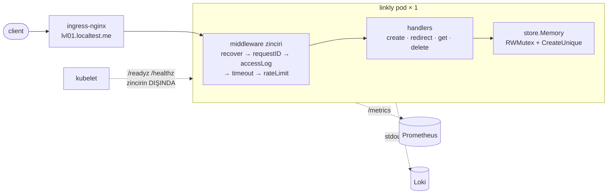

# 01 — hardened · "Tek süreç ama düzgün"

> **Bu seviyede ne yaşayacaksın?**
> - 00'ın çöküşünün, dağıtım hatalarının ve slowloris'in kapanması — `make verify-prev` 00'ın sorunlarını burada koşup gösterir
> - Restart'ta linklerin hâlâ gitmesi, ama artık panelde görünmesi (P01-01); ölçeklenememenin pod bazında görünmesi (P01-02)
> - Tek replika + PodDisruptionBudget'ın koruma sağlamaması (P01-03); belleğin OOM'dan önce görünmesi (P01-04)
> - Süreç içi hız sınırının N replikada N katına çıkması (P01-05); tıklama sayacının hâlâ istek yolunda olması (P01-08)
> - Tuzaklar: kısa kodu metrik etiketi yapmak (P01-06); sağlık uçlarını iş zincirinin arkasına koymak (P01-07)
>
> **Bu seviye olmasa ne olur?** 00'ın çöküşleri ve dağıtım hataları sürer; sonraki seviyelerin her sorunu 01'in eklediği metriklerle ölçülür — metrik yoksa "sorun var mı?" sorusunun cevabı tahmindir.
>
> **Yeni gelen teknolojiler:** `sync.RWMutex`, readiness/liveness probe, graceful shutdown, `log/slog` (JSON log), `/metrics` (client_golang), ServiceMonitor, PodDisruptionBudget ([her biri tek cümleyle](../README.md#kullanılan-teknolojiler)).

## 1. Bu seviye ne?

00 ile aynı tek süreç ve aynı bellek içi depo, ama disiplinle: kilit, probe, düzgün kapanma, timeout'lar, giriş
doğrulama, hız sınırı, metrikler ve JSON log. Kalıcılık ve ölçek hâlâ yok; o sorunlar burada ilk kez ölçülebilir
hale gelir, çözümü 02'de.

## 2. Mimari



Her istek sırayla ara katmanlardan (middleware) geçer: panik yakalama en dışta, hız sınırı en sonda. Sağlık ve
metrik uçları bu zincirin **dışında**, yük altında probe düşmesin diye (bozmak bir alıştırma: P01-07).

## 3. Önceki seviyeden çözülenler

| ID | Sorun | Nasıl çözüldü |
|---|---|---|
| P00-01 | Eşzamanlı map yazımı → çökme | `sync.RWMutex` ile korunan depo |
| P00-04 | Rollout'ta hata dalgası | Probe'lar, `maxUnavailable: 0`, `preStop`, kapanma sırası: önce readiness düşer, sonra `Shutdown` |
| P00-05 | 4 karakter kod, sessiz üzerine yazma | `crypto/rand`, 7 karakter, koşullu ekleme + çakışmada yeniden dene |
| P00-06 | Doğrulama yok | Yalnızca `http`/`https`, özel adres reddi, 8 KB gövde sınırı |
| P00-07 | Sunucu timeout'u yok | Sunucu timeout'ları + istek başına 5 sn |
| P00-09 | Gözlemlenebilirlik sıfır | `/metrics`, JSON log + request-id, ServiceMonitor |
| P00-10 | 301 + önbellek kontrolü yok | `302` + `Cache-Control: no-store` |

Açık kalanlar: P00-02, P00-03, P00-08 → burada P01-01, P01-02, P01-04 olarak ölçülebilir; çözümü 02/03.

## 4. Ayağa kaldırma

İlk kez mi? Önce kök README'deki [Sıfırdan başlangıç](../README.md#sıfırdan-başlangıç): platform bir kez kurulur ve
`LADDER` (repo kökü) tanımlanır. Her komut bloğu `cd "$LADDER/…"` ile başlar; olduğu gibi yapıştır.
Bu seviyenin platformdan istediği: **temel yığın (kind, ingress, Prometheus, Grafana)**; `make up` açar.

Hızlı başvuru (komutları tek tek kullan; satır sonu açıklamaları için zsh'da `setopt interactivecomments` gerekir):

```bash
cd "$LADDER/01-hardened"
make up            # profil → Grafana'yı temizle → build → push → deploy → rollout wait → smoke
code=$(curl -s -XPOST http://lvl01.localtest.me/api/links -H 'Content-Type: application/json' -d '{"url":"https://example.com"}' | jq -r .code); echo "$code"
curl -s -o /dev/null -w '%{http_code} → %{redirect_url}\n' http://lvl01.localtest.me/$code   # 302 → https://example.com
make grafana       # Ladder klasörü, level=lvl01 — giriş: admin / ladder
make load S=mixed  # aynı senaryolar her seviyede: create redirect mixed hot-key burst abuser read-your-writes stairs scan
make repro P=P01-01   # §6'daki bir sorunu otomatik üret → REPRODUCED / NOT-REPRODUCED
make env           # açık ayar/tuzaklar · değiştir: make set E="KEY=değer" · hepsini geri al: make reset (§7)
make down          # seviyeyi kaldır · kümeyi durdurmak için: cd "$LADDER/platform" && make stop
```

**Rehber — bu seviyeyi baştan sona, sırayla.**

1. Önceki seviyeyi kapat (aynı anda tek seviye), bu seviyeyi kur. `make up` Grafana'yı da temizler; sonunda
   `✔ lvl01 ayakta` yazar:
```bash
cd "$LADDER/00-naive"
make down
cd "$LADDER/01-hardened"
make up
```

**Verileri temizleyip sıfırdan koşmak istersen** 1. adımın yerine bunu kullan: bütün seviyelerin verisi
(linkler, veritabanı, önbellek, kuyruk) ve Grafana'nın gösterdiği metrik, trace, log silinir; küme ve kurulum
kalır (~2-3 dk). Ardından bu seviye temiz kurulur. Yalnızca Grafana çizgilerini temizlemek için (veri kalır)
seviye klasöründe `make fresh` yeter; her deneyin ilk komutu zaten bu.
```bash
cd "$LADDER"
make wipe CONFIRM=1
cd "$LADDER/01-hardened"
make up
```
2. 00'ın sorunlarını burada koş (~15 dk; koşarken başka komut çalıştırma). `BEKLENEN` sütunu `NOT-REPRODUCED` olan
   satırlar bu seviyenin çözdüğünü iddia ettikleri; sonuç uymazsa satır `✘` alır:
```bash
cd "$LADDER/01-hardened"
make verify-prev
```
3. §6'daki sorunları sırayla yaşa (P01-01 → P01-08): adımları yapıştır → **Terminalde ne görmelisin** ile
   karşılaştır → **Grafana'da gör** linklerini aç.
4. Bitince ayarları geri al ve seviyeyi kapat:
```bash
cd "$LADDER/01-hardened"
make reset
make down
```

## 5. API

Her seviyede aynı: [docs/API.md](../docs/API.md).

Bu seviyede yeni: `GET /{code}` **302** + `Cache-Control: no-store`; `/healthz`, `/readyz`, `/metrics` var; güvensiz
hedef `400 unsafe_url:<sebep>`, büyük gövde `413`, limit aşımı `429 + Retry-After`.

## 6. Reproduce edilebilir sorunlar

Her sorun aynı düzende: **Ne deniyoruz** (deneyin sorusu) → **Neden** → adımlar (her adım ne yaptığını söyler)
→ **Terminalde ne görmelisin** → **Grafana'da gör** (giriş: admin / ladder) → **Nerede çözülüyor**.
`make repro` hükmü: `REPRODUCED` = sorun var · `NOT-REPRODUCED` = yok · `SKIPPED` = ölçülemedi.

| ID | Sorun | Reproduce | Grafana'da | Çözüm |
|---|---|---|---|---|
| P01-01 | Restart = tüm linkler gider (artık görünür) | `CONFIRM=1 make repro P=P01-01` | [03 · App Business](http://grafana.localtest.me/d/ladder-app-business?var-level=lvl01&from=now-15m&to=now&refresh=10s) → "Kayıtlı link sayısı (pod'a göre)" | 02 |
| P01-02 | Ölçeklenemez (artık pod bazında görünür) | `CONFIRM=1 make repro P=P01-02` | [03 · App Business](http://grafana.localtest.me/d/ladder-app-business?var-level=lvl01&from=now-15m&to=now&refresh=10s) · [01 · Pods & Resources](http://grafana.localtest.me/d/ladder-pods?var-level=lvl01&from=now-15m&to=now&refresh=10s) → "404 (pod'a göre)" | 02 |
| P01-03 | Tek replika + PDB = güvenlik yanılsaması | `CONFIRM=1 make repro P=P01-03` | [01 · Pods & Resources](http://grafana.localtest.me/d/ladder-pods?var-level=lvl01&from=now-15m&to=now&refresh=10s) · [15 · k6](http://grafana.localtest.me/d/ladder-k6?var-level=lvl01&from=now-15m&to=now&refresh=10s) → "Hazır pod adresi (endpoint) sayısı" | 02 |
| P01-04 | Bellek sınırsız (artık önceden görülür) | `make repro P=P01-04` | [01 · Pods & Resources](http://grafana.localtest.me/d/ladder-pods?var-level=lvl01&from=now-15m&to=now&refresh=10s) · [03 · App Business](http://grafana.localtest.me/d/ladder-app-business?var-level=lvl01&from=now-15m&to=now&refresh=10s) → "Heap bellek (Go)" | 02 · 03 |
| P01-05 | Süreç içi limit N replikada N katı | `CONFIRM=1 make repro P=P01-05` | [10 · Rate limit](http://grafana.localtest.me/d/ladder-ratelimit?var-level=lvl01&from=now-15m&to=now&refresh=10s) → "İzin verilen (pod'a göre)" | 08 |
| P01-06 | **TRAP** kısa kod label → kardinalite patlaması | `make repro P=P01-06` | [02 · App RED](http://grafana.localtest.me/d/ladder-app-red?var-level=lvl01&from=now-15m&to=now&refresh=10s) → "İstek / saniye (uç noktaya göre)" | seviye içi |
| P01-07 | **TRAP** sağlık ucu zincirin arkasında → restart fırtınası | `make repro P=P01-07` | [01 · Pods & Resources](http://grafana.localtest.me/d/ladder-pods?var-level=lvl01&from=now-15m&to=now&refresh=10s) · [10 · Rate limit](http://grafana.localtest.me/d/ladder-ratelimit?var-level=lvl01&from=now-15m&to=now&refresh=10s) → "Hazır pod adresi (endpoint) sayısı" | seviye içi |
| P01-08 | Tıklama sayacı istek yolunda ve bellekte | `CONFIRM=1 make repro P=P01-08` | [02 · App RED](http://grafana.localtest.me/d/ladder-app-red?var-level=lvl01&from=now-15m&to=now&refresh=10s) · [03 · App Business](http://grafana.localtest.me/d/ladder-app-business?var-level=lvl01&from=now-15m&to=now&refresh=10s) → "p99 süre (uç noktaya göre)" | 05 · 06 |

---

### P01-01 · Restart = tüm linkler gider — ama artık görünür

**Ne deniyoruz:** Pod yenilenince kaybolan linkleri artık bir grafikte görebiliyor muyuz?
**Neden:** Kilit çökmeyi durdurdu ama kalıcılık getirmedi: tek veri kaynağı hâlâ süreç belleği. Fark, `links_total`
metriğinin kaybı gösterebilmesi.

**Reproduce (adım adım):** Otomatik: `CONFIRM=1 make repro P=P01-01` (25 link oluşturur, pod'u siler, sayacı ve
kanarya kodu yeniden okur). Elle:

1. Temiz başla; bir kanarya link ve 25 link daha oluştur, pod'un kaç link bildiğine bak:
```bash
cd "$LADDER/01-hardened"
make fresh
code=$(curl -s -XPOST http://lvl01.localtest.me/api/links -H 'Content-Type: application/json' -d '{"url":"https://example.com/p0101"}' | jq -r .code); echo "kanarya kodu: $code"
for i in $(seq 1 25); do curl -s -o /dev/null -XPOST http://lvl01.localtest.me/api/links -H 'Content-Type: application/json' -d "{\"url\":\"https://example.com/$i\"}"; done
curl -s http://lvl01.localtest.me/metrics | grep '^links_total'
curl -s -o /dev/null -w 'restart öncesi: %{http_code}\n' http://lvl01.localtest.me/$code
```
2. Pod'u yenile, aynı kodu ve sayacı tekrar oku:
```bash
cd "$LADDER/01-hardened"
kubectl -n lvl01 delete pod -l app.kubernetes.io/name=linkly
kubectl -n lvl01 wait --for=condition=Ready pod -l app.kubernetes.io/name=linkly --timeout=90s
curl -s -o /dev/null -w 'restart sonrası: %{http_code}\n' http://lvl01.localtest.me/$code
curl -s http://lvl01.localtest.me/metrics | grep '^links_total'
```

**Terminalde ne görmelisin:** önce `links_total 26` (önceki denemelerden kalanlarla daha fazla olabilir) ve
`restart öncesi: 302`; sonra `restart sonrası: 404` ve `links_total 0`: yeni pod boş başladı.

**Grafana'da gör:** [`03 · App Business`](http://grafana.localtest.me/d/ladder-app-business?var-level=lvl01&from=now-15m&to=now&refresh=10s) — pod'u sildikten sonra aç
- "Kayıtlı link sayısı (pod'a göre)" → eski pod'un çizgisi 25+ seviyesinde biter, yeni pod adıyla 0'dan bir çizgi başlar: dikey düşüş kaybın büyüklüğüdür.
- "Kayıtlı link sayısı" → restarttan sonra `0`.
- "Yönlendirme sonuçları" → restarttan sonra `not_found` serisinde küçük bir tümsek (kanarya kodu bulunamadı).

**Nerede çözülüyor:** 02 (Postgres). 01'in kazancı kaybı ölçebilmek.

---

### P01-02 · Ölçeklenemez — ama artık pod bazında görünür

**Ne deniyoruz:** 3 replikada 404'leri hangi pod'ların verdiğini görebiliyor muyuz?
**Neden:** Her pod'un kendi belleği var ve Service istekleri pod'lara dağıtır; link yalnızca onu oluşturan pod'da.

**Reproduce (adım adım):** Otomatik: `CONFIRM=1 make repro P=P01-02` (3 replikaya çıkar, 60 kez okur, hangi pod'un
kaç 404 saydığını basar, geri alır). Elle:

1. Temiz başla; tek pod varken bir link oluştur:
```bash
cd "$LADDER/01-hardened"
make fresh
code=$(curl -s -XPOST http://lvl01.localtest.me/api/links -H 'Content-Type: application/json' -d '{"url":"https://example.com/p0102"}' | jq -r .code); echo "kod: $code"
```
2. 3 replikaya çık, ingress'in yeni pod'ları görmesini bekle (beklemezsen hepsi tek pod'a gider), kodu 30 kez iste:
```bash
cd "$LADDER/01-hardened"
kubectl -n lvl01 scale deploy/linkly --replicas=3
kubectl -n lvl01 rollout status deploy/linkly
sleep 10
for i in $(seq 1 30); do curl -s -o /dev/null -w '%{http_code} ' http://lvl01.localtest.me/$code; done; echo
```
3. Geri al:
```bash
cd "$LADDER/01-hardened"
kubectl -n lvl01 scale deploy/linkly --replicas=1
```

**Terminalde ne görmelisin:** 30 cevabın ~1/3'ü `302`, ~2/3'ü `404`: diğer iki pod linki hiç görmedi.

**Grafana'da gör:** [`03 · App Business`](http://grafana.localtest.me/d/ladder-app-business?var-level=lvl01&from=now-15m&to=now&refresh=10s) ve [`01 · Pods & Resources`](http://grafana.localtest.me/d/ladder-pods?var-level=lvl01&from=now-15m&to=now&refresh=10s) — deney sırasında ya da hemen sonra aç
- "404 (pod'a göre)" → linkin yazıldığı pod'un çizgisi 0'da kalır, **diğer ikisi** yükselir: 404'ü linki hiç görmemiş pod'lar veriyor.
- "Yönlendirme sonuçları" → `ok` ile `not_found` yan yana; `not_found` kabaca iki katı.
- "Hazır pod adresi (endpoint) sayısı" → 1'den **3**'e çıkar, geri alınca 1'e döner: 404'ler pod sayısı arttığı an başlar.

**Nerede çözülüyor:** 02.

---

### P01-03 · Tek replika + PDB = güvenlik yanılsaması

**Ne deniyoruz:** Tek replikalı bir servisi PodDisruptionBudget (PDB) düğüm bakımında koruyor mu?
**Neden:** PDB, gönüllü kapatmalarda "en az 1 pod ayakta kalsın" der. Tek replikada kapatılabilecek pod yok
(`ALLOWED DISRUPTIONS 0`): normal tahliye hep reddedilir, bakım kilitlenir; zorlarsan servis kesilir. PDB yedeklilik
üretmez, yalnızca var olanı korur.

**Reproduce (adım adım):** Otomatik: `CONFIRM=1 make repro P=P01-03` (yük altında iki ucu gösterir: normal
`kubectl drain` reddedilip timeout'a düşer; zorla silme 5xx üretir; sonunda düğümü `uncordon` eder). Elle (yalnızca
uygulama pod'una dokunan sürüm):

1. Temiz başla; PDB'nin neye izin verdiğine bak ve trafiği alan (hazır) pod'u seç:
```bash
cd "$LADDER/01-hardened"
make fresh
kubectl -n lvl01 rollout status deploy/linkly
kubectl -n lvl01 get pdb linkly
pod=$(kubectl -n lvl01 get endpointslice -l kubernetes.io/service-name=linkly -o jsonpath='{.items[*].endpoints[?(@.conditions.ready==true)].targetRef.name}'); echo "pod: $pod"
```
2. Kibar yol: `kubectl drain`'in her pod için gönderdiği tahliye isteğini bu pod için gönder:
```bash
cd "$LADDER/01-hardened"
printf '{"apiVersion":"policy/v1","kind":"Eviction","metadata":{"name":"%s","namespace":"lvl01"}}' "$pod" | kubectl create --raw "/api/v1/namespaces/lvl01/pods/$pod/eviction" -f -
```
3. Zorla yol, önce yük: ikinci bir terminalde 90 sn'lik yükü başlat:
```bash
cd "$LADDER/01-hardened"
make load S=redirect K6_ARGS="--vus 5 --duration 90s"
```
4. Yük başladıktan ~20 sn sonra ilk terminalde pod'u zorla sil ve yenisini bekle:
```bash
cd "$LADDER/01-hardened"
kubectl -n lvl01 delete pod "$pod" --force --grace-period=0
kubectl -n lvl01 wait --for=condition=Ready pod -l app.kubernetes.io/name=linkly --timeout=90s
```

**Terminalde ne görmelisin:** `get pdb`'de `MIN AVAILABLE 1 · ALLOWED DISRUPTIONS 0`. Tahliye
`Cannot evict pod as it would violate the pod's disruption budget.` ile reddedilir (`kubectl drain` tekrar dener ve
timeout'a düşer: bakım kilitli). Zorla silmede k6 bir süre donar, sonunda `request timeout` uyarıları çıkar; özet
(ölçülen) `k6 lvl01: reqs=188628 failed=43.03% 5xx=5 404=62109 429=19054 …`: `5xx` asılı kalan istekler, `404`'ler
yeni pod'un boş belleği (P01-01), `429`'lar hızlı dönen 404'lerin pod'un IP başına sınırını aşması.

**Grafana'da gör:** [`01 · Pods & Resources`](http://grafana.localtest.me/d/ladder-pods?var-level=lvl01&from=now-15m&to=now&refresh=10s), [`15 · k6`](http://grafana.localtest.me/d/ladder-k6?var-level=lvl01&from=now-15m&to=now&refresh=10s) ve [`02 · App RED`](http://grafana.localtest.me/d/ladder-app-red?var-level=lvl01&from=now-15m&to=now&refresh=10s) — deney başlayınca aç; ~2 dk sürer
- "Hazır pod adresi (endpoint) sayısı" → kibar yolda 1'de kalır (kimse ölmüyor); zorla silmede **0'a iner**, yeni pod hazır olunca 1'e döner.
- "Pod durumları" → zorla silmeden hemen sonra kısa bir sarı `Pending`: yeni pod açılıyor (kısa sürerse örneklemeye yakalanmayabilir).
- "Dönen durum kodları" → boşluk anında `503` (ingress: gönderilecek pod yok); ardından `302`'nin yerini `404` alır.
- "İstek / saniye (durum koduna göre)" → `503` görmezsin: kesintiyi uygulama değil ingress yaşadı; iki panel arasındaki fark aradaki katmandır.

**Nerede çözülüyor:** 02 (3 replika + farklı düğümlere yayma); PDB orada anlam kazanır.

---

### P01-04 · Bellek hâlâ sınırsız — ama artık önceden görülür

**Ne deniyoruz:** Belleğin sınıra tırmandığını OOM'dan önce görebiliyor muyuz?
**Neden:** Depoda üst sınır, süre (TTL) ya da atma yok; fark, heap metriğinin artık görünmesi.

**Reproduce (adım adım):** Otomatik: `make repro P=P01-04` (90 sn link üretir; tepe heap, tepe `links_total` ve tepe
bellek okur; uzun sürüm `DURATION=240s URL_SIZE=8000 make repro P=P01-04` OOMKilled üretir). Elle:

1. Temiz başla; başlangıç değerlerini oku:
```bash
cd "$LADDER/01-hardened"
make fresh
curl -s http://lvl01.localtest.me/metrics | grep -E '^(links_total|go_memstats_heap_alloc_bytes) '
```
2. Tek kullanıcıyla (çökme yok, yalnızca büyüme) 90 sn boyunca 2 KB'lık linkler üret, tekrar oku:
```bash
cd "$LADDER/01-hardened"
URL_SIZE=2000 make load S=create K6_ARGS="--vus 1 --duration 90s"
curl -s http://lvl01.localtest.me/metrics | grep -E '^(links_total|go_memstats_heap_alloc_bytes) '
kubectl -n lvl01 top pod
```
3. İstersen sınıra kadar götür (4 dk), sonra pod'un neden öldüğüne bak:
```bash
cd "$LADDER/01-hardened"
URL_SIZE=8000 make load S=create K6_ARGS="--vus 1 --duration 240s"
kubectl -n lvl01 get pod -l app.kubernetes.io/name=linkly -o jsonpath='{.items[0].status.containerStatuses[0].lastState.terminated.reason}'; echo
```

**Terminalde ne görmelisin:** 1. adımda `links_total 0`, heap ~3 MB. 2. adımdan sonra (ölçülen) `links_total 64474`
ve heap `1.51e+08` (~150 MB); `top pod` ~143Mi — 256Mi sınırın yarısından fazlası, ve geri düşmez. 3. adımın sonunda
`OOMKilled`: konteyner sınıra çarptı, linklerle birlikte öldü.

**Grafana'da gör:** [`01 · Pods & Resources`](http://grafana.localtest.me/d/ladder-pods?var-level=lvl01&from=now-15m&to=now&refresh=10s) ve [`03 · App Business`](http://grafana.localtest.me/d/ladder-app-business?var-level=lvl01&from=now-15m&to=now&refresh=10s) — yük başlayınca aç; 90 sn sürer
- "Heap bellek (Go)" → yük boyunca tırmanır, yük bitince inmez: depo hiçbir şeyi bırakmıyor. Eğriyi çarpmadan önce görmek 01'in kazancı.
- "Bellek: sınırın yüzde kaçı" → aynı büyüme 256 MiB sınırın yüzdesi olarak %100'e gider; uzun sürümde "Son sonlanma nedeni" panelinde `OOMKilled` belirir.
- "Kayıtlı link sayısı (pod'a göre)" → heap ile aynı biçimde tırmanır: bellek = link sayısı × link boyutu.

**Nerede çözülüyor:** 02 (veri DB'de) · 03 (sınırlı önbellek). 01'in kazancı: çarpmadan önce alarm yazabilmek.

---

### P01-05 · Süreç içi hız sınırı N replikada N katına çıkar

**Ne deniyoruz:** "Saniyede 50" sınırı 3 pod'da hâlâ 50 mi?
**Neden:** Sınır sayacı (token bucket) her pod'un kendi belleğinde; her pod ayrı sayar, toplam sınır replika sayısıyla
çarpılır.

**Reproduce (adım adım):** Otomatik: `CONFIRM=1 make repro P=P01-05` (sınırı pod başına 50/s yapar, aynı yükü önce 1
sonra 3 pod'a verir, kabul edilen istekleri karşılaştırır, geri alır). Elle:

1. Temiz başla; sınırı pod başına saniyede 50'ye çek, eski pod trafikten çıkana kadar bekle (kendi sayacıyla ölçümü
   şişirmesin):
```bash
cd "$LADDER/01-hardened"
make fresh
make set E="RATE_LIMIT_PER_SEC=50 RATE_LIMIT_BURST=50"
sleep 20
```
2. Tek pod'a 20 sn yük ver:
```bash
cd "$LADDER/01-hardened"
make load S=redirect K6_ARGS="--vus 20 --duration 20s"
```
3. 3 pod'a çık, aynı yükü ver:
```bash
cd "$LADDER/01-hardened"
kubectl -n lvl01 scale deploy/linkly --replicas=3
kubectl -n lvl01 rollout status deploy/linkly
sleep 10
make load S=redirect K6_ARGS="--vus 20 --duration 20s"
```
4. Geri al:
```bash
cd "$LADDER/01-hardened"
kubectl -n lvl01 scale deploy/linkly --replicas=1
make reset
```

**Terminalde ne görmelisin:** her yükün sonunda `k6 lvl01: reqs=… 404=… 429=…`; kabul edilen = `reqs − 429`. Tek pod'da
~1000 (ölçülen 1059 = 50/s × 20 sn), 3 pod'da ~3000 (ölçülen 3171): "50" yazdın, sistem 150 geçirdi. (3 pod'daki
404'ler P01-02'dendir.)

**Grafana'da gör:** [`10 · Rate limit`](http://grafana.localtest.me/d/ladder-ratelimit?var-level=lvl01&from=now-15m&to=now&refresh=10s) — deney başlayınca aç; iki faz 20'şer sn
- "İzin verilen (pod'a göre)" → ilk fazda tek çizgi (~50/s), ikinci fazda **üç ayrı** çizgi, her biri ~50/s: üç ayrı sayaç, toplam 3 katı.
- "Kararlar (anahtar türüne göre)" → `ip allow` ikinci fazda ~3 katına çıkar; yük aynı, değişen yalnızca pod sayısı.

**Nerede çözülüyor:** 08 (Redis'te paylaşılan sınır).

---

### P01-06 · TRAP · Kısa kodu metrik label'ı yapmak

**Ne deniyoruz:** Metriğe kısa kodu etiket (label) olarak eklemek Prometheus'a ne yapar?
**Neden:** Her farklı etiket değeri yeni bir zaman serisi demek; sınırsız değerli alanlar (kısa kod, URL, IP,
kullanıcı) etiket olursa seri sayısı link sayısıyla büyür (kardinalite patlaması).

**Reproduce (adım adım):** Otomatik: `make repro P=P01-06` (`TRAP_METRIC_LABEL_CODE=true` açar, 400 kodu ziyaret eder,
`short_code` seri sayısını ve Prometheus'un toplam seri farkını basar, tuzağı kapatır). Elle:

1. Temiz başla; tuzağı aç (pod yeniden başlar):
```bash
cd "$LADDER/01-hardened"
make fresh
make set E="TRAP_METRIC_LABEL_CODE=true"
```
2. 200 link oluşturup her birini bir kez aç, pod'un kaç ayrı seri ürettiğini say:
```bash
cd "$LADDER/01-hardened"
for i in $(seq 1 200); do c=$(curl -s -XPOST http://lvl01.localtest.me/api/links -H 'Content-Type: application/json' -d "{\"url\":\"https://example.com/card/$i\"}" | jq -r .code); curl -s -o /dev/null http://lvl01.localtest.me/$c; done
curl -s http://lvl01.localtest.me/metrics | grep -c 'short_code='
```
3. Tuzağı kapat, eski pod trafikten çıkınca tekrar say:
```bash
cd "$LADDER/01-hardened"
make reset
sleep 10
curl -s http://lvl01.localtest.me/metrics | grep -c 'short_code='
```

**Terminalde ne görmelisin:** tuzak açıkken `201` (ölçülen): her kod ayrı bir seri — 1 milyon linkte 1 milyon seri.
Kapanınca `0`, ama Prometheus eski serileri bir süre daha bellekte taşır.

**Grafana'da gör:** [`02 · App RED`](http://grafana.localtest.me/d/ladder-app-red?var-level=lvl01&from=now-15m&to=now&refresh=10s) — ziyaretler sürerken aç
- "İstek / saniye (uç noktaya göre)" → yine birkaç çizgi: panel uç noktaya göre topladığı için patlama ekranda görünmez. Kardinaliteyi dashboard'dan göremezsin.
- Explore'da: `count(count by (short_code) (http_requests_total{namespace="lvl01"}))` → tuzak açıkken ziyaret edilen kod sayısı kadar (yüzlerce).
- Explore'da: `prometheus_tsdb_head_series` → yüzlerce serilik bir basamak yapar ve tuzak kapansa da hemen inmez.

**Nerede çözülüyor:** seviye içi tuzak — bayrağı kapat; tekil kimlikler metriğe değil log'a ve trace'e gider (11).

---

### P01-07 · TRAP · Sağlık uçlarını iş zincirinin arkasına koymak

**Ne deniyoruz:** Sağlık kontrolleri (probe) hız sınırının arkasına girerse yük altında ne olur?
**Neden:** Probe'lar da sınıra takılıp `429` alır; Kubernetes sağlıklı pod'u trafikten çıkarır (readiness), yeterince
sürerse yeniden başlatır (liveness). Tuzakta sınır tek bir ortak kova olduğu için istemcinin yükü probe'un payını da
tüketir.

**Reproduce (adım adım):** Otomatik: `make repro P=P01-07` (`TRAP_LIVENESS_STRICT=true` + 30/s sınır, 150 sn yük;
`Unhealthy` olaylarını ve restart'ları sayar, tuzağı kapatır). Elle:

1. Temiz başla; tuzağı aç ve sınırı düşür (pod yeniden başlar):
```bash
cd "$LADDER/01-hardened"
make fresh
make set E="TRAP_LIVENESS_STRICT=true RATE_LIMIT_PER_SEC=30 RATE_LIMIT_BURST=30"
```
2. İkinci bir terminalde probe hatalarını canlı izle:
```bash
cd "$LADDER/01-hardened"
kubectl -n lvl01 get events -w --field-selector reason=Unhealthy
```
3. İlk terminalde sınırın çok üstünde 150 sn yük ver (liveness'ın 60 sn toleransından uzun olmalı), sonucu oku:
```bash
cd "$LADDER/01-hardened"
make load S=redirect K6_ARGS="--vus 10 --duration 150s"
kubectl -n lvl01 get events --field-selector reason=Unhealthy
kubectl -n lvl01 get pods
```
4. Tuzağı kapat (ikinci terminali Ctrl+C ile kapat):
```bash
cd "$LADDER/01-hardened"
make reset
```

**Terminalde ne görmelisin:** ~8 sn'de bir `Readiness probe failed: … statuscode: 429`, arada `Liveness probe failed:
… 429`. Ölçülen: 21 readiness ve 3 liveness hatası, restart 0; k6 `reqs=959985 … 5xx=564313 … 429=392232` — `5xx`'in
tamamı pod trafikten düştüğü anlarda ingress'in 503'ü. Baskın etki restart değil readiness: pod ölmeden trafikten
çıkar; birden çok replikada yük diğerlerine biner ve onlar da düşer. (Tuzağı açan rollout'taki `connection refused`
olayları ilgisiz.)

**Grafana'da gör:** [`01 · Pods & Resources`](http://grafana.localtest.me/d/ladder-pods?var-level=lvl01&from=now-15m&to=now&refresh=10s), [`10 · Rate limit`](http://grafana.localtest.me/d/ladder-ratelimit?var-level=lvl01&from=now-15m&to=now&refresh=10s) ve [`15 · k6`](http://grafana.localtest.me/d/ladder-k6?var-level=lvl01&from=now-15m&to=now&refresh=10s) — yük başlayınca aç; 150 sn sürer
- "Hazır pod adresi (endpoint) sayısı" → 1 ile 0 arasında gidip gelir: her 0 tek replikada bir kesinti.
- "Yeniden başlatma sayısı" → çoğu turda kıpırdamaz: en görünür belirti en geç gelendir; "restart yok" sorun yok demek değil.
- "Reddedilen / sn" → yük boyunca yüksek: sınırın üstü reddediliyor.
- "Dönen durum kodları" → `429` baskın; pod trafikten düştüğü anlarda `503`.

**Nerede çözülüyor:** seviye içi tuzak — varsayılanda sağlık uçları zincirin dışında; bağımlılık kontrolü liveness'a
girmez (aynı tuzağın büyüğü: P10-02).

---

### P01-08 · Tıklama sayacı hâlâ istek yolunda ve bellekte

**Ne deniyoruz:** Tıklama sayacı yönlendirmeyi yavaşlatıyor mu ve restart'tan sağ çıkıyor mu?
**Neden:** Her yönlendirme cevap dönmeden önce ortak bir sayacı kilit altında artırır; sayaç süreç belleğinde.

**Reproduce (adım adım):** Otomatik: `CONFIRM=1 make repro P=P01-08` (300 tıklama yapar, sayacı okur, sıcak linkte
p99'u ölçer, pod'u yenileyip sayacın gittiğini gösterir). Elle:

1. Temiz başla; bir link oluştur, 300 kez aç, sayacı oku:
```bash
cd "$LADDER/01-hardened"
make fresh
code=$(curl -s -XPOST http://lvl01.localtest.me/api/links -H 'Content-Type: application/json' -d '{"url":"https://example.com/p0108"}' | jq -r .code); echo "kod: $code"
for i in $(seq 1 300); do curl -s -o /dev/null http://lvl01.localtest.me/$code; done
curl -s http://lvl01.localtest.me/api/links/$code | jq .clicks
```
2. Aynı sıcak linke 50 kullanıcıyla 30 sn yük ver (her yönlendirme aynı kilidi bekler):
```bash
cd "$LADDER/01-hardened"
make load S=hot-key K6_ARGS="--vus 50 --duration 30s"
```
3. Pod'u yenile, linke tekrar bak:
```bash
cd "$LADDER/01-hardened"
kubectl -n lvl01 delete pod -l app.kubernetes.io/name=linkly
kubectl -n lvl01 wait --for=condition=Ready pod -l app.kubernetes.io/name=linkly --timeout=90s
curl -s -o /dev/null -w '%{http_code}\n' http://lvl01.localtest.me/api/links/$code
```

**Terminalde ne görmelisin:** önce `300`. k6 özetinde `p99` düşük (bu ölçekte kilit ucuz; bedeli 02'de satır kilidine
dönüşünce görünür). Restart sonrası `404`: link de 300 tıklama da gitti.

**Grafana'da gör:** [`02 · App RED`](http://grafana.localtest.me/d/ladder-app-red?var-level=lvl01&from=now-15m&to=now&refresh=10s) ve [`03 · App Business`](http://grafana.localtest.me/d/ladder-app-business?var-level=lvl01&from=now-15m&to=now&refresh=10s) — deney başlayınca aç; sıcak link yükü 30 sn sürer
- "p99 süre (uç noktaya göre)" → sıcak link yükünde `/{code}` çizgisi yükselir: her yönlendirme aynı sayaç kilidini bekliyor.
- "Başarılı yönlendirme / sn" → tıklamalar burada görünür: Prometheus onları hatırlıyor, uygulamanın kendi sayacı restartta yok oluyor.
- "Kayıtlı link sayısı (pod'a göre)" → restartta eski pod'un çizgisi biter, yenisi 0'dan başlar.

**Nerede çözülüyor:** 05 (kuyruk + toplu yazıcı ile istek yolundan çıkar) · 06 (olay akışıyla dayanıklı). 02'de bu
kilit bir DB satır kilidine dönüşür (P02-08).

## 7. Seviye içi alıştırmalar (TRAP_ bayrakları)

> **Nasıl uygulanır:** aç `make set E="TRAP_X=true"` · ne açık? `make env` · hepsini geri al `make reset` (`make unset E=TRAP_X` yalnızca siler). Diğer ayarlar da aynı yolla (`make set E="CACHE_TTL=1h"`). Pod'lar yeni değerle yeniden başlar, komut hazır olunca döner; tek servis için `W=redirect`. `make repro` tuzakları kendisi açıp kapatır. Bitirince `make reset`: açık kalan bir tuzak sonraki deneyi sessizce bozar.

| Bayrak | Ne yapar | Reproduce | Düzeltme |
|---|---|---|---|
| `TRAP_METRIC_LABEL_CODE` | Kısa kodu `http_requests_total`'a label olarak ekler | `make repro P=P01-06` | Bayrağı kapat; tekil kimlik log/trace'e |
| `TRAP_LIVENESS_STRICT` | `/healthz` ve `/readyz`'i iş zincirine (limit + timeout) sokar | `make repro P=P01-07` | Bayrağı kapat; sağlık uçları zincirin dışında |

Elle denemeye değer:
- `make set E="SHUTDOWN_GRACE=1s"` sonra `make repro P=P00-04` → kapanmadaki bekleme gidince 5xx geri gelir.
- `make set E="HANDLER_TIMEOUT=1ms"` → her istek 503; istek timeout'unun nerede devreye girdiğini logda izle.
- `make load S=abuser` → tek kötü istemcinin normal istemcinin p99'una etkisi (08'in ön provası).

## 8. Gözlemlenebilirlik: hangi paneller dolu, hangileri boş

| Dashboard | Durum | Neden |
|---|---|---|
| [`00 · Overview`](http://grafana.localtest.me/d/ladder-overview?var-level=lvl01&from=now-15m&to=now) | **Dolu** | Erişilebilirlik ve p99 artık hesaplanıyor |
| [`01 · Pods & Resources`](http://grafana.localtest.me/d/ladder-pods?var-level=lvl01&from=now-15m&to=now) | **Dolu** | Konteyner + Go runtime (goroutine, heap, GC) |
| [`02 · App RED`](http://grafana.localtest.me/d/ladder-app-red?var-level=lvl01&from=now-15m&to=now) · [`03 · App Business`](http://grafana.localtest.me/d/ladder-app-business?var-level=lvl01&from=now-15m&to=now) | **Dolu** | Uygulama artık `/metrics` yayınlıyor |
| [`10 · Rate limit`](http://grafana.localtest.me/d/ladder-ratelimit?var-level=lvl01&from=now-15m&to=now) | Kısmen | Süreç içi sınır; tek anahtar türü (`ip`) |
| [`14 · Security`](http://grafana.localtest.me/d/ladder-security?var-level=lvl01&from=now-15m&to=now) | Kısmen | Güvensiz URL reddi dolu; 401/403 yok (13) |
| [`15 · k6`](http://grafana.localtest.me/d/ladder-k6?var-level=lvl01&from=now-15m&to=now) | Dolu | İstemci tarafı |
| Diğerleri (04–09, 11–13) | Boş | Önbellek, DB, Redis, kuyruk, ölçekleyici, SLO, rollout yok |

## 9. Bilerek bırakılanlar

- Depo hâlâ bellekte ve tek pod'da: kalıcılık, ölçek, yedeklilik yok (P01-01/02/03 → 02).
- Hız sınırı süreç içi ve IP kayıtları sınırsız birikir (08).
- URL güvenliği bir azaltma: özel bir adrese çözülen alan adı geçer (13).
- Kiracı yok; `X-Tenant-ID` etkisiz (13).
- Analitik istek yolunda ve kalıcı değil (P01-08 → 05/06).
- İstemci IP'si `X-Forwarded-For`'dan körü körüne alınır, taklit edilebilir (08).
- Log seviyesi sabit `info`, örnekleme yok (11).

## 10. `make diff-prev` okuma rehberi

1. `cmd/linkly/main.go`: iş mantığı `internal/`'a taşındı; son satırlardaki kapanma sırasına bak (önce readiness düşer,
   sonra `Shutdown`).
2. `internal/store/memory.go`: kilitli depo ve `CreateUnique` (02'de SQL `UNIQUE`'e dönüşür).
3. `internal/httpapi/middleware.go`: zincirin sırası ve gerekçesi.
4. `deploy/deployment.yaml`: probe'lar, `maxUnavailable: 0`, `preStop` — her satır bir P00 sorununa cevap.
5. `deploy/servicemonitor.yaml` ve `deploy/pdb.yaml` (yeni): metriğin toplanması; bilerek işe yaramayan PDB (P01-03).
