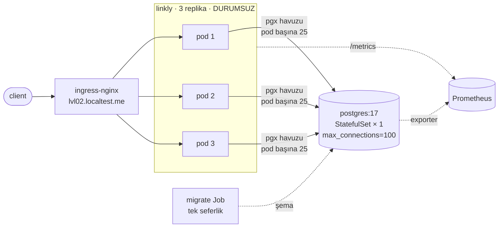

# 02 — postgres · "Kalıcılık ve yatay ölçek"

> **Bu seviyede ne yaşayacaksın?**
> - Durum süreçten çıkınca 3 replikanın, temiz rollout'un ve düğüm boşaltmanın bedava gelmesi — 00/01'in kalıcılık ve ölçek sorunlarının kapanması
> - Her redirect'in bir DB sorgusu olması (P02-01) ve bağlantı havuzunun taşması (P02-02)
> - Tek Postgres ölünce her şeyin durması (P02-03); süreç içi hız sınırının 3 replikada 3 katı olması (P02-04)
> - İndeks yokken seq scan (P02-05); Chaos Mesh ile DB'ye gecikme verince sunucu timeout'u olmayan havuzun tıkanması (P02-06)
> - Migration'ı her pod kendisi koşunca yarış (P02-07), sıcak linkte satır kilidi kuyruğu (P02-08), git'teki düz metin sırlar (P02-09), readiness'ın DB'ye bakınca bütün pod'ları trafikten düşürmesi (P02-10)
>
> **Bu seviye olmasa ne olur?** Her restart bütün linkleri siler ve ikinci bir replika açılamaz — çünkü veri sürecin içinde yaşar (P00-02, P00-03, P01-01, P01-02).
>
> **Yeni gelen teknolojiler:** PostgreSQL 17, pgx (bağlantı havuzu), goose (migration Job'ı), postgres-exporter, Chaos Mesh ([her biri tek cümleyle](../README.md#kullanılan-teknolojiler)).

## 1. Bu seviye ne?

Durum süreçten çıktı: linkler artık Postgres'te, uygulama **durumsuz**. Bu tek kelime N replikayı,
temiz rollout'u, node drain'i ve yatay ölçeklenmeyi satın alıyor — hiçbiri 01'de yoktu, Kubernetes
özelliği eksik olduğu için değil, veri sürecin içinde yaşadığı için. Bedeli şu: artık **her istek**
ağ üzerinden, bu seviyenin hep ayakta ve sonsuz hızlı varsaydığı bir veritabanına gidiyor.

## 2. Mimari



Kritik asimetri: **uygulama yedekli, veritabanı değil.** Üç pod da aynı tek Postgres'e bağlı;
yedeklilik zincirin en zayıf halkası kadardır (P02-03).

## 3. Önceki seviyeden çözülenler

| ID | Sorun | Nasıl çözüldü |
|---|---|---|
| P00-02 / P01-01 | Restart = tüm linkler gider | Durum Postgres'te; pod'lar silinip yeniden doğsa da veri PVC'de |
| P00-03 / P01-02 | `replicas>1` → rastgele 404 | Tek paylaşılan kaynak; 3 replikanın üçü de aynı veriyi görüyor |
| P01-03 | Tek replika + PDB = yanılsama | 3 replika + `topologySpreadConstraints` + `minAvailable: 2` → drain artık gerçekten güvenli |
| P01-04 | Bellek sınırsız büyür | Uygulama artık veri tutmuyor; bellek istek sayısıyla değil, eşzamanlılıkla ölçekleniyor |

Ayrıca **kısmen**: P01-08 (tıklama sayacı) hâlâ istek yolunda ama artık en azından **kalıcı** —
tam çözümü 05'te. `problems/SOLVES` makine-okunur listeyi tutuyor; `make verify-prev` doğruluyor.

**Çözülmeyenler (bilerek):** P00-08 bellek tavanı artık uygulamada yok ama **Postgres'te var**
(disk, bağlantı, kilit). P01-05 süreç içi limit hâlâ yanlış ve artık gerçekten 3 katı (P02-04).

## 4. Ayağa kaldırma

İlk kez mi? Önce kök README'deki [Sıfırdan başlangıç](../README.md#sıfırdan-başlangıç) — platform bir kez kurulur (`cd platform && make full`).
Bu seviyenin platformdan istediği: **temel yığın (kind, ingress, Prometheus, Grafana) + Chaos Mesh**. `make up` ilk adımda (profil) bunları açar ve kullanılmayanları kapatır; bir bileşen kurulu değilse hangi komutla kurulacağını söyleyip durur.

```bash
make up            # profil → Grafana'yı temizle → build → push → deploy → rollout wait → smoke
code=$(curl -s -XPOST http://lvl02.localtest.me/api/links -H 'Content-Type: application/json' -d '{"url":"https://example.com"}' | jq -r .code); echo "$code"
curl -s -o /dev/null -w '%{http_code} → %{redirect_url}\n' http://lvl02.localtest.me/$code   # 302 → https://example.com
make grafana       # Ladder klasörü, level=lvl02 — giriş: admin / ladder
make load S=mixed  # aynı senaryolar her seviyede: create redirect mixed hot-key burst abuser read-your-writes stairs scan
make repro P=P02-01   # §6'daki bir sorunu otomatik üret → REPRODUCED / NOT-REPRODUCED
make env           # açık ayar/tuzaklar · değiştir: make set E="KEY=değer" · hepsini geri al: make reset (§7)
make down          # seviyeyi kaldır · kümeyi durdurmak için: make -C ../platform stop
```

Veritabanına bakmak için:
```bash
kubectl -n lvl02 exec -it $(kubectl -n lvl02 get pod -l app.kubernetes.io/name=postgres -o name) -c postgres -- psql -U linkly -d linkly
```

**Rehber — bu seviyeyi baştan sona, sırayla.** Komut bloklarında açıklama yok; her bloğu olduğu gibi yapıştırabilirsin.

1. Önceki seviye açıksa kapat (aynı anda tek seviye çalışır), bu seviyeyi kur. `make up` Grafana'yı da temizler:
```bash
make -C ../01-hardened down
make up
```
2. 01'in sorunlarını bu seviyede koş. Koşarken başka komut çalıştırma: aynı pod'lara dokunurlar.
   `CONFIRM=1` şart: 02'nin çözdüğü sorunların çoğunun scripti pod siler ya da replika sayısını değiştirir ve onaysız
   `SKIPPED` der. Çıktıdaki `BEKLENEN` sütunu `NOT-REPRODUCED` diyen satırlar (P01-01, P01-02, P01-03, P01-04, P01-08)
   02'nin çözdüğünü iddia ettikleridir:
```bash
CONFIRM=1 make verify-prev
```
3. §6'daki sorunları sırayla yaşa (P02-01 → P02-10). Her sorunda aynı düzen:
   **Elle** bloklarını sırayla yapıştır (ilk komut `make fresh`: Grafana bu deneye boş başlar) →
   **Terminalde ne görmelisin** ile karşılaştır → **Grafana'da gör** linklerini aç, her madde hangi panelde neyi
   göreceğini söyler. İstersen aynı deneyi `make repro P=…` ile otomatik koş: ölçer ve hükmünü basar.
4. Bitince açık kalan ayarları geri al ve seviyeyi kapat:
```bash
make reset
make down
```

## 5. API

Her seviyede aynı: [docs/API.md](../docs/API.md).

Bu seviyede yeni: `GET /api/links` (kiracıya göre listeler) ve `X-Tenant-ID` artık **gerçekten iş
yapıyor** — silme ve listeleme kiracıyla sınırlı. Uyarı: bu bir **kimlik doğrulama değildir**,
header'ı herkes gönderebilir; 13'te gerçek kimliğe bağlanacak.

## 6. Reproduce edilebilir sorunlar

| ID | Sorun | Reproduce | Grafana'da | Çözüm |
|---|---|---|---|---|
| P02-01 | Her redirect = DB sorgusu | `make repro P=P02-01` | [05 · Postgres](http://grafana.localtest.me/d/ladder-postgres?var-level=lvl02&from=now-15m&to=now&refresh=10s) · [02 · App RED](http://grafana.localtest.me/d/ladder-app-red?var-level=lvl02&from=now-15m&to=now&refresh=10s) → "Veritabanı sorguları (türe göre)" | 03 · 04 |
| P02-02 | Havuz taşması: replika × pool > max_connections | `CONFIRM=1 make repro P=P02-02` | [05 · Postgres](http://grafana.localtest.me/d/ladder-postgres?var-level=lvl02&from=now-15m&to=now&refresh=10s) · [02 · App RED](http://grafana.localtest.me/d/ladder-app-red?var-level=lvl02&from=now-15m&to=now&refresh=10s) → "Bağlantılar ve üst sınır" | 09 |
| P02-03 | DB tek nokta; failover yok | `CONFIRM=1 make repro P=P02-03` | [01 · Pods & Resources](http://grafana.localtest.me/d/ladder-pods?var-level=lvl02&from=now-15m&to=now&refresh=10s) · [02 · App RED](http://grafana.localtest.me/d/ladder-app-red?var-level=lvl02&from=now-15m&to=now&refresh=10s) → "Hazır pod adresi (endpoint) sayısı" | 09 |
| P02-04 | Süreç içi limit 3 replikada 3 katı | `CONFIRM=1 make repro P=P02-04` | [10 · Rate limit](http://grafana.localtest.me/d/ladder-ratelimit?var-level=lvl02&from=now-15m&to=now&refresh=10s) → "İzin verilen (pod'a göre)" | 08 |
| P02-05 | Index yok → seq scan | `make repro P=P02-05` | [05 · Postgres](http://grafana.localtest.me/d/ladder-postgres?var-level=lvl02&from=now-15m&to=now&refresh=10s) → "Tablo tarama: tam tarama / indeksli" | seviye içi (002) |
| P02-06 | Yavaş DB + timeout yok → havuz tıkanır | `make repro P=P02-06` | [05 · Postgres](http://grafana.localtest.me/d/ladder-postgres?var-level=lvl02&from=now-15m&to=now&refresh=10s) · [02 · App RED](http://grafana.localtest.me/d/ladder-app-red?var-level=lvl02&from=now-15m&to=now&refresh=10s) → "Sorgu süresi p99 (türe göre)" | seviye içi · 10 |
| P02-07 | **TRAP** migration her pod'da → yarış | `make repro P=P02-07` | [01 · Pods & Resources](http://grafana.localtest.me/d/ladder-pods?var-level=lvl02&from=now-15m&to=now&refresh=10s) · [05 · Postgres](http://grafana.localtest.me/d/ladder-postgres?var-level=lvl02&from=now-15m&to=now&refresh=10s) → "Yeniden başlatma sayısı" | seviye içi (Job) |
| P02-08 | Sıcak link → satır kilidi kuyruğu | `make repro P=P02-08` | [05 · Postgres](http://grafana.localtest.me/d/ladder-postgres?var-level=lvl02&from=now-15m&to=now&refresh=10s) · [02 · App RED](http://grafana.localtest.me/d/ladder-app-red?var-level=lvl02&from=now-15m&to=now&refresh=10s) → "Sorgu süresi p99 (türe göre)" | 05 · 06 |
| P02-09 | Sır düz metin (git + Secret + env) | `make repro P=P02-09` | görünmez — kanıt terminalde ↓ | 13 |
| P02-10 | **TRAP** readiness DB'ye bakar → tam kesinti | `CONFIRM=1 make repro P=P02-10` | [01 · Pods & Resources](http://grafana.localtest.me/d/ladder-pods?var-level=lvl02&from=now-15m&to=now&refresh=10s) · [02 · App RED](http://grafana.localtest.me/d/ladder-app-red?var-level=lvl02&from=now-15m&to=now&refresh=10s) → "Hazır pod adresi (endpoint) sayısı" | seviye içi · 10 |

---

### P02-01 · Her redirect bir DB sorgusu

**Belirti:** Redirect gecikmesi 01'e göre iki-üç kat arttı; Postgres CPU'su trafikle doğru orantılı
tırmanıyor. Uygulama pod'ları ise büyük ölçüde boşta.
**Neden:** 01'de redirect bir map aramasıydı (nanosaniye). Şimdi **istek başına iki sorgu**: `SELECT`
(linki bul) + `UPDATE` (tıklamayı say). Okuma ağırlıklı bir sistemde (1 yazma : 100–1000 okuma) bu,
yükün tamamını tek bir paylaşılan kaynağa taşımak demek. [Topic · Konu: Okuma yolu, cache-aside gerekçesi]

**Reproduce (adım adım):**

Otomatik — ölçer ve hüküm basar: `make repro P=P02-01` (60 sn redirect yükü verir; redirect başına DB okumasını, Postgres CPU'sunu ve p99'u Prometheus'tan hesaplar).

Elle — `02-postgres` klasöründe, sırayla yapıştır:

1. Grafana'yı temizle, 30 kullanıcıyla 60 sn redirect yükü ver:
```bash
make fresh
make load S=redirect K6_ARGS="--vus 30 --duration 60s"
```
2. Son kazımanın gelmesini bekle; saniyedeki redirect sayısını, sorgu türüne göre saniyedeki DB sorgusunu, Postgres
   CPU'sunu (bir çekirdeğin %'si) ve redirect p99'unu (saniye) Prometheus'a sor:
```bash
sleep 15
curl -s 'http://prometheus.localtest.me/api/v1/query' --data-urlencode 'query=sum(rate(http_requests_total{namespace="lvl02",route="/{code}"}[2m]))' | jq -r '.data.result[0].value[1]'
curl -s 'http://prometheus.localtest.me/api/v1/query' --data-urlencode 'query=sum by (op) (rate(db_queries_total{namespace="lvl02"}[2m]))' | jq -r '.data.result[] | "\(.metric.op) \(.value[1])"'
curl -s 'http://prometheus.localtest.me/api/v1/query' --data-urlencode 'query=sum(rate(container_cpu_usage_seconds_total{namespace="lvl02",pod=~"postgres.*",image!="",image!~".*pause.*"}[2m])) * 100' | jq -r '.data.result[0].value[1]'
curl -s 'http://prometheus.localtest.me/api/v1/query' --data-urlencode 'query=histogram_quantile(0.99, sum(rate(http_request_duration_seconds_bucket{namespace="lvl02",route="/{code}"}[2m])) by (le))' | jq -r '.data.result[0].value[1]'
```

**Terminalde ne görmelisin:** ilk sayı saniyedeki redirect; ikinci komutta `get` ve `increment_clicks` satırları **o
sayıya yakın ve birbirine eşit** (her redirect bir SELECT + bir UPDATE), yanında küçük bir `create` (k6'nın ısınma
linkleri) — toplam, redirect sayısının ~2 katı. Ölçülen turda sırasıyla ~563, get + increment_clicks ≈ 1114,
Postgres CPU'su ~31 (bir çekirdeğin %31'i) ve p99 ~0.097 (96.7 ms).

**Ölçülen tur:** `563 redirect/s → 1114 DB sorgu/s (istek başına 2.0) · PG CPU 0.31 çekirdek ·
redirect p99 96.7 ms (DB get p99 49.6 ms)`.

**Grafana'da gör:** [`05 · Postgres`](http://grafana.localtest.me/d/ladder-postgres?var-level=lvl02&from=now-15m&to=now&refresh=10s) ve [`02 · App RED`](http://grafana.localtest.me/d/ladder-app-red?var-level=lvl02&from=now-15m&to=now&refresh=10s) — scripti başlatınca aç; yük 60 sn sürer (giriş: admin / ladder)
- "Veritabanı sorguları (türe göre)" → yükle birlikte `get` ve `increment_clicks` katmanları **eşit kalınlıkta** yükselir (panel üst üste yığar): her redirect bir SELECT + bir UPDATE. Yığının toplam yüksekliği redirect rps'inin ~2 katı (ölçülen tur: 563 redirect/s → 1114 sorgu/s).
- "Veritabanı CPU" → `postgres-0` çizgisi trafikle doğru orantılı tırmanır (ölçülen: ~%31, yani çekirdeğin üçte biri) — yük tek bir paylaşılan kaynakta toplanıyor.
- "Sorgu süresi p99 (türe göre)" → `get` p99'u (ölçülen: 49.6 ms) redirect p99'unun yaklaşık yarısı: sürenin büyük kısmı DB'de geçiyor.
- "p99 süre (uç noktaya göre)" → `/{code}` çizgisi yük altında yükselir (ölçülen: 96.7 ms); 01'de aynı çizgi bir map aramasıydı.

**Nerede çözülüyor:** `UPDATE`'i 05 (asenkron analitik), `SELECT`'i 03/04 (önbellek) kaldıracak.
Zarf arkası: 10k rps redirect = 20k sorgu/s. Tek Postgres bunu taşımaz — bu yüzden bir URL
kısaltıcıda **önbellek bir optimizasyon değil, mimarinin kendisidir.**

---

### P02-02 · Bağlantı havuzu taşması

**Belirti:** Replika sayısını artırdığında uygulama 503 döner; Postgres logunda
`FATAL: sorry, too many clients already`.
**Neden:** Her pod havuzunu *tek başınaymış gibi* boyutlar. 3 × 25 = 75 < 100 iken sorun yok;
10 × 25 = 250 > 100 olduğu anda Postgres yeni bağlantıları reddeder. Havuz boyutu **yerel** bir karar
gibi görünür ama **global** bir kaynağı tüketir. [Topic · Konu: Bağlantı yönetimi, paylaşılan kaynak]

**Reproduce (adım adım):**

Otomatik: `CONFIRM=1 make repro P=P02-02` (matematiği basar, 10 replikaya çıkar, 80 kullanıcıyla 60 sn yük verir; bağlantıları, DB hatalarını, 5xx'i ve en dolu pod havuzunu sayar, sonra replika sayısını geri alır).

Elle — sırayla yapıştır:

1. Grafana'yı temizle; önce matematik: Postgres'in bağlantı tavanı ve pod başına havuz boyutu:
```bash
make fresh
kubectl -n lvl02 exec postgres-0 -c postgres -- psql -U linkly -d linkly -tAc 'SHOW max_connections'
kubectl -n lvl02 get deploy linkly -o jsonpath='{.spec.template.spec.containers[0].env[?(@.name=="DB_MAX_CONNS")].value}'; echo
```
2. 10 replikaya çık (10 × havuz > tavan):
```bash
kubectl -n lvl02 scale deploy/linkly --replicas=10
kubectl -n lvl02 rollout status deploy/linkly --timeout=180s
sleep 10
```
3. 80 kullanıcıyla 60 sn karışık yük ver, sonra açık bağlantıları, hatalı sorguları ve uygulama logundaki reddi say:
```bash
make load S=mixed K6_ARGS="--vus 80 --duration 60s"
sleep 12
curl -s 'http://prometheus.localtest.me/api/v1/query' --data-urlencode 'query=sum(pg_stat_activity_count{namespace="lvl02"})' | jq -r '.data.result[0].value[1]'
curl -s 'http://prometheus.localtest.me/api/v1/query' --data-urlencode 'query=sum(increase(db_queries_total{namespace="lvl02",result="error"}[5m]))' | jq -r '.data.result[0].value[1]'
kubectl -n lvl02 logs -l app.kubernetes.io/name=linkly --tail=300 | grep -c 'too many clients'
```
4. Geri al:
```bash
kubectl -n lvl02 scale deploy/linkly --replicas=3
kubectl -n lvl02 rollout status deploy/linkly
```

**Terminalde ne görmelisin:** `100` ve `25`: 3 × 25 = 75 sığıyor, 10 × 25 = 250 sığmıyor. k6 çıktısının sonundaki özet
satırında (`k6 lvl02: reqs=… 5xx=…`) `5xx` sıfırdan büyük. Açık bağlantı sayısı tavana (100) yakın, hatalı sorgu sayısı
sıfırdan büyük, `grep -c` de sıfırdan büyük: Postgres yeni bağlantıları `FATAL: sorry, too many clients already` ile
reddediyor, uygulama bunu `503 store_error` olarak dönüyor.

**Grafana'da gör:** [`05 · Postgres`](http://grafana.localtest.me/d/ladder-postgres?var-level=lvl02&from=now-15m&to=now&refresh=10s) ve [`02 · App RED`](http://grafana.localtest.me/d/ladder-app-red?var-level=lvl02&from=now-15m&to=now&refresh=10s) — script 10 replikaya çıkıp yükü başlattığında aç; yük 60 sn sürer (giriş: admin / ladder)
- "Bağlantılar ve üst sınır" → `üst sınır` çizgisi 100'de düz; bağlantı çizgileri (`active`, `idle` …) yükle tırmanır ve toplamları bu **tavana yapışır** — yanındaki "Açık bağlantı" kutusu toplamı tek sayı olarak gösterir.
- "İstek / saniye (durum koduna göre)" → `503` çizgisi belirir: havuz yeni bağlantı açmak isterken Postgres `too many clients` diyor, uygulama `store_error` dönüyor.
- "Uygulama havuzu: boş bağlantı bulunamadı / sn" → **sıfırda düz kalır**: bu sayaç yalnızca bir pod kendi 25'lik havuzunun tamamı doluyken artar. 80 VU 10 pod'a bölününce pod başına ~8 eşzamanlı istek düşer; hiçbir havuz tavana yaklaşmaz (script en dolu havuzu `en dolu pod havuzu: …/25` diye basar). Hatayı havuz değil Postgres veriyor: yeni bağlantıyı reddediyor. Yerel havuz iyi görünürken sistem hata veriyorsa sebep global limittir — P02-02'nin dersi tam olarak bu.
- Explore'da: `sum by (op) (rate(db_queries_total{namespace="lvl02",result="error"}[1m]))` → bağlantılar tavana çarptığı anlarda hatalı sorgu çizgileri sıfırdan kalkar (panel sorguları sonuca göre ayırmıyor).

**Nerede çözülüyor:** 09 (PgBouncer/Pooler). Dikkat: doğru cevap havuzu küçültmek **değildir** —
o zaman da uygulama tarafında kuyruk oluşur (P02-06'nın aynısı). Doğru cevap araya bir havuz
yöneticisi koymaktır: yüzlerce uygulama bağlantısı, onlarca gerçek DB bağlantısına eşlenir.

---

### P02-03 · Veritabanı tek nokta

**Belirti:** Postgres pod'u ölünce hem yazma hem **okuma** durur. Uygulamanın üç replikası da ayakta,
hazır ve hiçbir şey yapamıyor.
**Neden:** Yedeklilik zincirin en zayıf halkası kadardır. "3 replika" uygulamanın yedekli olduğunu
söyler, sistemin değil. [Topic · Konu: Tek nokta arıza, yedeklilik sınırı]

**Reproduce (adım adım):**

Otomatik: `CONFIRM=1 make repro P=P02-03` (yük altında Postgres pod'unu siler, kesinti penceresini ve 5xx'i ölçer; uygulama pod'larına dokunmaz).

Elle — sırayla yapıştır:

1. Grafana'yı temizle, pod'lara bak:
```bash
make fresh
kubectl -n lvl02 get pods
```
2. İKİNCİ bir terminalde `02-postgres` klasöründe yükü başlat:
```bash
make load S=redirect K6_ARGS="--vus 5 --duration 120s"
```
3. Yük başladıktan ~15 sn sonra İLK terminalde — **yıkıcı adım: tek veritabanı pod'unu siler** (veri PVC'de kalır,
   StatefulSet pod'u yeniden açar) — pod'lara bak ve 60 sn boyunca 2 sn'de bir link oluşturmayı dene:
```bash
kubectl -n lvl02 delete pod postgres-0 --wait=false
kubectl -n lvl02 get pods
for i in $(seq 1 30); do printf '%s ' "$(curl -s -o /dev/null -w '%{http_code}' --max-time 5 -XPOST http://lvl02.localtest.me/api/links -H 'Content-Type: application/json' -d '{"url":"https://example.com/p0203"}')"; sleep 2; done; echo
```
4. Veritabanının tamamen döndüğünü doğrula (sonraki deney hazır bir DB bulmalı):
```bash
kubectl -n lvl02 rollout status statefulset/postgres --timeout=180s
```

**Terminalde ne görmelisin:** silmeden hemen sonra `postgres-0` `Terminating` ya da `0/2`, üç `linkly-…` pod'u ise
`1/1 Running`: uygulama hazır ve trafiği alıyor. Döngü önce art arda `503` basar — bu 503'ü uygulamanın kendisi veriyor
(`store_error`), DB dönünce `201`'e geçer. İkinci terminalde k6 çıktısının sonundaki özet satırında `5xx` sıfırdan
büyük: 3 replika hiçbir şeyi kurtarmadı.

**Grafana'da gör:** [`01 · Pods & Resources`](http://grafana.localtest.me/d/ladder-pods?var-level=lvl02&from=now-15m&to=now&refresh=10s), [`02 · App RED`](http://grafana.localtest.me/d/ladder-app-red?var-level=lvl02&from=now-15m&to=now&refresh=10s) ve [`05 · Postgres`](http://grafana.localtest.me/d/ladder-postgres?var-level=lvl02&from=now-15m&to=now&refresh=10s) — scripti başlatınca aç; yük 2 dk sürer (giriş: admin / ladder)
- "Hazır pod adresi (endpoint) sayısı" → `linkly-…` çizgisi **3'te düz kalır** (bu deneyde düşmez — karşılaştır: P02-10'da sıfıra iner); yanındaki `postgres-…` çizgisi DB silinince **0'a iner** ve pod hazır olunca 1'e döner. Uygulama hazır, bağımlılığı yok.
- "5xx (uç noktaya göre)" → kesinti penceresi boyunca `/{code}` çizgisi kalkar: bu kez 503'ü **uygulamanın kendisi** veriyor (`store_error`), çünkü pod'lar hazır ve trafiği alıyor ama DB yok.
- "Bağlantılar ve üst sınır" → çizgiler kesilir: exporter DB ile aynı pod'da, onunla birlikte ölüyor. Yeni pod açılınca bağlantılar yeniden kurulur.
- Explore'da: `pg_up{namespace="lvl02"}` → 1'den düşer (pod yokken seri kesilir, exporter DB'den önce açılırsa kısa bir `0`), DB dönünce yeniden 1.

**Nerede çözülüyor:** 09 (CNPG: primary + 2 replica + otomatik failover). Failover da anlık
değildir; 09 o pencereyi ve `read-your-writes` ihlallerini ölçecek.

---

### P02-04 · Süreç içi hız sınırı 3 replikada 3 katı

**Belirti:** `RATE_LIMIT_PER_SEC=5000` yazıyor ama sistem 15 000 rps geçiriyor.
**Neden:** Token bucket her pod'un belleğinde (P01-05'in aynısı). 01'de bunu görmek için elle
ölçeklemek gerekiyordu; 02'de **zaten 3 replika var**, yani bu artık teorik bir uyarı değil,
üretimdeki mevcut durum. [Topic · Konu: Dağıtık durum, hız sınırlama]

**Reproduce (adım adım):**

Otomatik: `CONFIRM=1 make repro P=P02-04` (limiti pod başına 40 rps'e çeker, önce 1 pod sonra 3 pod ile aynı yükü verir, kabul edilen istek sayısını karşılaştırır, sonra her şeyi geri alır).

Elle — sırayla yapıştır:

1. Grafana'yı temizle, limiti pod başına saniyede 40 isteğe çek (pod'lar yeniden başlar):
```bash
make fresh
make set E="RATE_LIMIT_PER_SEC=40 RATE_LIMIT_BURST=40"
```
2. Tek pod'a in, 20 kullanıcıyla 20 sn yük ver:
```bash
kubectl -n lvl02 scale deploy/linkly --replicas=1
kubectl -n lvl02 rollout status deploy/linkly
sleep 10
make load S=redirect K6_ARGS="--vus 20 --duration 20s"
```
3. Seviyenin gerçek replika sayısına (3) dön, aynı yükü ver:
```bash
kubectl -n lvl02 scale deploy/linkly --replicas=3
kubectl -n lvl02 rollout status deploy/linkly
sleep 10
make load S=redirect K6_ARGS="--vus 20 --duration 20s"
```
4. Limiti geri al (replika sayısı zaten 3):
```bash
make reset
```

**Terminalde ne görmelisin:** her yükün k6 özet satırı `k6 lvl02: reqs=… 429=…`. Kabul edilen istek = `reqs − 429`.
Tek pod'da kabul ~800 (40 rps × 20 sn); 3 pod'da ~2400. "Saniyede 40" yazdın, sistem ~120 geçirdi: her pod kendi
kovasını tutuyor.

**Grafana'da gör:** [`10 · Rate limit`](http://grafana.localtest.me/d/ladder-ratelimit?var-level=lvl02&from=now-15m&to=now&refresh=10s) — scripti başlatınca aç; iki faz 20'şer sn, panellerin 1 dk'lık ortalaması yüzünden geçiş yumuşak görünür (giriş: admin / ladder)
- "İzin verilen (pod'a göre)" → ilk fazda (1 pod) **tek** çizgi, limit civarında (~40/s); ikinci fazda üç pod'un her biri kendi çizgisini çizer, her biri yine ~40/s: toplam ~3 katı. Panelin adı bu sorunun kendisi.
- "Kararlar (anahtar türüne göre)" → `ip allow` ikinci fazda yaklaşık üç katına çıkar; yük aynı, değişen yalnızca pod sayısı.

**Nerede çözülüyor:** 08 (Redis'te Lua ile atomik paylaşılan limiter). İroni şu: limitin amacı
**DB'yi** korumaktı; korunacak kaynak tek, koruma ise pod başına — yani tam korunması gereken yerde
replika sayısıyla gevşiyor.

---

### P02-05 · Index yok → seq scan

**Belirti:** `GET /api/links` küçük veride anında, 300 bin satırda saniyeler sürüyor.
**Neden:** `migrations/001` tenant üzerinde index oluşturmuyor (bilerek). `ORDER BY created_at DESC`
ile birlikte sorgu tüm tabloyu tarayıp sıralıyor. "Index unutmak" üretimde tam olarak böyle görünür:
küçük veride fark edilmez, büyük veride olay olur. [Topic · Konu: Index, sorgu planı]

**Reproduce (adım adım):**

Otomatik: `make repro P=P02-05` (`generate_series` ile 300 bin satır ekler, `EXPLAIN ANALYZE` planını ve list çağrısının süresini basar).

Elle — sırayla yapıştır:

1. Grafana'yı temizle, tabloda kaç satır olduğuna bak:
```bash
make fresh
kubectl -n lvl02 exec postgres-0 -c postgres -- psql -U linkly -d linkly -tAc 'SELECT count(*) FROM links'
```
2. Tabloya 300 bin satır ekle (her 100 satırdan biri `acme` kiracısına) ve istatistikleri güncelle:
```bash
kubectl -n lvl02 exec postgres-0 -c postgres -- psql -U linkly -d linkly -c "INSERT INTO links (code, url, tenant, created_at) SELECT substr(md5(random()::text), 1, 7) || i, 'https://example.com/seed/' || i, CASE WHEN i % 100 = 0 THEN 'acme' ELSE 'tenant-' || (i % 50) END, now() - (i || ' seconds')::interval FROM generate_series(1, 300000) i ON CONFLICT DO NOTHING" -c 'ANALYZE links'
```
3. Listeleme sorgusunun planına bak, sonra aynı listeyi API'den iste ve süresini ölç:
```bash
kubectl -n lvl02 exec postgres-0 -c postgres -- psql -U linkly -d linkly -c "EXPLAIN (ANALYZE, BUFFERS) SELECT code FROM links WHERE tenant='acme' ORDER BY created_at DESC LIMIT 100"
curl -s -o /dev/null -w 'GET /api/links: %{time_total} sn\n' -H 'X-Tenant-ID: acme' http://lvl02.localtest.me/api/links
```
4. İstersen Grafana'da belirginleştir: aynı listeyi 20 kez iste:
```bash
for i in $(seq 1 20); do curl -s -o /dev/null -H 'X-Tenant-ID: acme' http://lvl02.localtest.me/api/links; done
```
5. İstersen çözümü dene: `migrations/002_tenant_index.sql`'in yaptığı index'i aynı komutla kur, planı ve süreyi yeniden
   ölç, sonra index'i 002'nin geri alma komutuyla kaldır (P02-07 ve bu deneyin tekrarı index'siz tabloya ihtiyaç duyar):
```bash
kubectl -n lvl02 exec postgres-0 -c postgres -- psql -U linkly -d linkly -c 'CREATE INDEX CONCURRENTLY IF NOT EXISTS links_tenant_created_idx ON links (tenant, created_at DESC)'
kubectl -n lvl02 exec postgres-0 -c postgres -- psql -U linkly -d linkly -c "EXPLAIN (ANALYZE, BUFFERS) SELECT code FROM links WHERE tenant='acme' ORDER BY created_at DESC LIMIT 100"
curl -s -o /dev/null -w 'GET /api/links: %{time_total} sn\n' -H 'X-Tenant-ID: acme' http://lvl02.localtest.me/api/links
kubectl -n lvl02 exec postgres-0 -c postgres -- psql -U linkly -d linkly -c 'DROP INDEX CONCURRENTLY IF EXISTS links_tenant_created_idx'
```

**Terminalde ne görmelisin:** 2. adımda `INSERT 0 300000` ve `ANALYZE`. 3. adımdaki planda `Seq Scan on links` (ya da
`Parallel Seq Scan on links`), altında `Filter: (tenant = 'acme'::text)` ve büyük bir `Rows Removed by Filter`
sayısı: ~3000 `acme` satırı için bütün tablo okundu. 5. adımda plan `Index Scan using links_tenant_created_idx on links` olur,
`Rows Removed by Filter` satırı kaybolur ve `Execution Time` belirgin biçimde düşer.

**Grafana'da gör:** [`05 · Postgres`](http://grafana.localtest.me/d/ladder-postgres?var-level=lvl02&from=now-15m&to=now&refresh=10s) — scripti koştuktan hemen sonra aç (giriş: admin / ladder)
- "Tablo tarama: tam tarama / indeksli" → `tam tarama: links` çizgisinde scriptin `EXPLAIN ANALYZE`'ı ve list çağrısı anında bir tepe; redirect'lerin birincil anahtar araması `indeksli: links`'te kalır. 002'yi uyguladıktan sonra aynı list çağrısı `indeksli: links`'e geçer.
- "Sorgu süresi p99 (türe göre)" → `list` çizgisi belirir ve diğer op'ların (`get`, `create` …) çok üstünde durur: tüm tabloyu tarayıp sıralamanın bedeli. 002'den sonra aşağı iner.
- Script list'i **bir kez** çağırdığı için iki tepe de kısa sürer; belirginleştirmek için birkaç kez tekrarla: `for i in $(seq 20); do curl -s -o /dev/null -H 'X-Tenant-ID: acme' http://lvl02.localtest.me/api/links; done`

**Nerede çözülüyor:** Seviye içi (`migrations/002_tenant_index.sql`). İkinci ders orada:
`CREATE INDEX CONCURRENTLY` — düz `CREATE INDEX` tabloya ACCESS EXCLUSIVE kilidi koyar ve süre
boyunca **her yazmayı bloklar**; canlı tabloda bu bir kesintidir.

---

### P02-06 · Yavaş DB + sunucu tarafı timeout yok → havuz tıkanır

**Belirti:** Veritabanı yavaşladığında (ölmedi, sadece yavaşladı) uygulama p99'u patlar, in-flight
istek sayısı birikir, pod'lar hazır olmaktan çıkmaya başlar.
**Neden:** Client context'i 3 sn sonra vazgeçiyor ama `STATEMENT_TIMEOUT` boş olduğu için **Postgres
sorguyu çalıştırmaya devam ediyor**: bağlantı meşgul kalıyor, havuz doluyor, yeni istekler bekliyor.
**Vazgeçmek, işin durmasını sağlamaz — yalnızca beklemeyi bırakır.** [Topic · Konu: Timeout bütçesi, kaskad]

**Reproduce (adım adım):**

Otomatik: `make repro P=P02-06` (Postgres'e Chaos Mesh ile 2 sn gecikme enjekte eder, 40 kullanıcıyla 60 sn yük altında havuz beklemesini, boş havuz sayısını ve 5xx'i ölçer, sonra gecikmeyi kaldırır). Chaos Mesh kurulu değilse bir kez: `cd platform && make chaos`.

Elle — sırayla yapıştır:

1. Grafana'yı temizle; client ve sunucu tarafı timeout ayarlarına bak, sonra Postgres'e 2 sn gecikme ver:
```bash
make fresh
make env
make chaos C=pg-delay-2s
```
2. 40 kullanıcıyla 60 sn karışık yük ver; sonra havuz beklemesinin p99'unu (saniye), boş havuza çarpan istek sayısını
   ve aynı anda işlenen istek sayısının tepesini sor:
```bash
make load S=mixed K6_ARGS="--vus 40 --duration 60s"
sleep 12
curl -s 'http://prometheus.localtest.me/api/v1/query' --data-urlencode 'query=histogram_quantile(0.99, sum(rate(db_pool_acquire_duration_seconds_bucket{namespace="lvl02"}[2m])) by (le))' | jq -r '.data.result[0].value[1]'
curl -s 'http://prometheus.localtest.me/api/v1/query' --data-urlencode 'query=sum(increase(db_pool_empty_acquire_total{namespace="lvl02"}[5m]))' | jq -r '.data.result[0].value[1]'
curl -s 'http://prometheus.localtest.me/api/v1/query' --data-urlencode 'query=max_over_time(sum(http_in_flight_requests{namespace="lvl02"})[5m:15s])' | jq -r '.data.result[0].value[1]'
```
3. Gecikmeyi kaldır:
```bash
make unchaos C=pg-delay-2s
```
4. İstersen sunucu tarafı timeout'la karşılaştır: `STATEMENT_TIMEOUT=2s` ver (pod'lar yeniden başlar), aynı gecikme
   ve yükü tekrarla (istersen 2. adımdaki sorguları da), sonunda gecikmeyi kaldırıp ayarı geri al:
```bash
make set E="STATEMENT_TIMEOUT=2s"
sleep 10
make chaos C=pg-delay-2s
make load S=mixed K6_ARGS="--vus 40 --duration 60s"
make unchaos C=pg-delay-2s
make reset
```

**Terminalde ne görmelisin:** `make env` çıktısında `DB_QUERY_TIMEOUT=3s` ve boş bir `STATEMENT_TIMEOUT=`: client 3 sn
sonra vazgeçiyor, sunucu tarafında sınır yok. `make chaos` `networkchaos.chaos-mesh.org/pg-delay-2s created` der.
Yükün k6 özet satırında `5xx` sıfırdan büyük ve `p99` saniyeler mertebesinde (3 sn'lik client timeout'u dolan istekler
`503 store_error`). Havuz bekleme p99'u scriptin eşiği olan 0.05 sn'nin çok üstünde — saniyeler; aynı anda işlenen istek tepesi
onlarca. Boş havuz sayısı yalnızca bir pod'un 25 bağlantısının hepsi meşgulken artar; sıfır da olabilir, bekleme yine
de p99'da görünür (yeni bağlantı kurmak da gecikmeli ağda bekler). 4. adımda iki turun k6 özet satırlarını (`5xx`,
`p99`) yan yana koy.

**Ölçüm dersi — havuz beklemesi, alımın kendisinin etrafında ölçülür:** bağlantıyı asıl bekleyen
`QueryRow`/`Exec`'tir; her biri sorguyu göndermeden önce havuzdan bağlantı alır. Havuzu dışarıdan
ölçen bir sayaç (ör. `pool.Stat()` okumak) istekler kuyrukta beklerken ~0.1 ms gösterir ve scriptin
`havuz bekleme > 50 ms` kontrolü hiç tetiklenemez. Bu yüzden `db_pool_acquire_duration_seconds`,
pgx'in her bağlantı alımının etrafında ölçülür (`internal/store/postgres.go · acquireTracer`).
*Değeri değişemeyen bir metrik, ölçüm değildir — iddiam yanlış olsaydı ne gösterirdi? sorusu
metriğin kendisine de sorulmalı.*

**Grafana'da gör:** [`05 · Postgres`](http://grafana.localtest.me/d/ladder-postgres?var-level=lvl02&from=now-15m&to=now&refresh=10s), [`02 · App RED`](http://grafana.localtest.me/d/ladder-app-red?var-level=lvl02&from=now-15m&to=now&refresh=10s) ve [`11 · Resilience`](http://grafana.localtest.me/d/ladder-resilience?var-level=lvl02&from=now-15m&to=now&refresh=10s) — scripti başlatınca aç; yük 60 sn sürer (giriş: admin / ladder)
- "Sorgu süresi p99 (türe göre)" → bütün op'lar birden ~2 sn'nin üstüne sıçrar: enjekte edilen gecikme. DB ölmedi, sadece yavaşladı.
- "Uygulama havuzu: boş bağlantı bulunamadı / sn" → havuz dolduğu anlarda sıfırdan kalkar: bir pod'un 25 bağlantısının hepsi yavaş sorgularla meşgul (ya da yeniden açılıyor) ve gelen istek boş havuza çarpıyor.
- "Uygulama havuzu: bağlantı bekleme (p99)" → yük başlayınca düz çizgiden kalkıp saniyelere çıkar (tavanı 3 sn'lik client timeout'u): istek, sorgusuna başlamadan önce havuzdan bağlantı almak için bekliyor. Zaman aşımına uğrayan sorgunun bağlantısını pgx kapatır; yerine açılan her yeni bağlantı gecikmeli ağda birkaç gidiş-dönüş (TCP, oturum açma, parola) ister — yani bekleme hem havuz tavandayken hem yeni bağlantı kurulurken birikir. Bir önceki maddedeki sayaç yalnızca ilkini görür.
- "İstek / saniye (durum koduna göre)" (App RED) → `503` çizgisi belirir: 3 sn'lik client timeout'u dolan istekler `store_error` dönüyor; "Gecikme (p50 / p95 / p99)" aynı anda saniyelere fırlar.
- "Şu an işlenen istek (pod'a göre)" (Resilience) → her pod'da bekleyen istek sayısı birikir. Bu dashboard'un breaker, retry, load shed ve degrade panelleri 02'de boştur (10'da gelir).

**Nerede çözülüyor:** Seviye içi (`STATEMENT_TIMEOUT`) + 10 (devre kesici, bulkhead, load shedding).
İki önlem gerekiyor ve biri diğerinin yerini tutmaz: timeout işi **durdurur**, devre kesici işi
**göndermeyi bırakır**.

---

### P02-07 · TRAP · Migration'ı her pod kendi açılışında koşarsa

**Belirti:** Tuzak açıkken yeni bir migration getiren sürüm açıldığında aynı tek seferlik iş **birden
çok pod'da aynı anda** koşar: çakışan pod'lar migration hatasıyla (`deadlock detected`) düşüp yeniden
başlar, en yavaş pod en son hazır olur. Kötü turlarda şemanın sürüm tablosu (`goose_db_version`) aynı
migration'ı birden çok kez kaydeder ya da geride "uygulandı" diye kayıtlı ama **geçersiz (INVALID)**
bir index kalır.
**Neden:** Şema değişikliği **tek seferlik** bir iştir, uygulamanın açılış rutini değil. Bu seviyedeki
goose (`UpTo`) **kilit almaz**: aynı anda açılan her pod "şema 1'de" diye okur ve hepsi 002'yi
uygulamaya girişir. Onları sıraya sokmaya çalışan tek şey tablonun kendi kilidi; `CREATE INDEX
CONCURRENTLY`'de bu da yetmez: sırada bekleyen oturum eski bir snapshot tutar, index'i kuran oturum o
snapshot'ın bitmesini bekler ve Postgres ikisinden birini öldürür. Daha kötüsü: uygulamayı geri alırsan
(rollback) **şema geri gelmez**. [Topic · Konu: Şema göçü, dağıtım sırası]

**Reproduce (adım adım):**

Otomatik: `make repro P=P02-07` (tabloyu ~2 M satıra büyütür, 002'nin tek başına ne kadar sürdüğünü ölçer, uygulamayı 0'a indirip `TRAP_MIGRATE_IN_MAIN=true` + `MIGRATE_TARGET=2` ile üç pod'u **aynı anda** açar ve `pg_stat_activity`'yi örnekler; hükmü veritabanının kendi kaydından ve pod'ların önceki loglarından verir; bitince şemayı bulduğu yere döndürür — 002 geri alınır, eklenen satırlar silinir. Şema zaten 002'deyse ölçmeden çıkar (exit 2) ve geri alma komutunu basar).

Elle — sırayla yapıştır:

1. Grafana'yı temizle; şema hangi sürümde? (`2` çıkarsa önce 7. adımdaki `psql` komutuyla geri al — yapacak iş yoksa
   yarış da olmaz):
```bash
make fresh
kubectl -n lvl02 exec postgres-0 -c postgres -- psql -U linkly -d linkly -tAc 'SELECT max(version_id) FROM goose_db_version WHERE is_applied'
```
2. Tabloyu ~2 M satıra büyüt (migration pod'ların başlangıç farkından uzun sürmeli), sonra 002'nin index'ini başka adla
   bir kez kurup silerek yarış penceresinin genişliğini ölç:
```bash
kubectl -n lvl02 exec postgres-0 -c postgres -- psql -U linkly -d linkly -c "INSERT INTO links (code, url, tenant, created_at) SELECT 'p7-' || i, 'https://example.com/p0207/' || i, 'p02-07-bulk', now() - (i || ' seconds')::interval FROM generate_series(1, 2000000) i ON CONFLICT DO NOTHING"
kubectl -n lvl02 exec postgres-0 -c postgres -- psql -U linkly -d linkly -c '\timing on' -c 'CREATE INDEX CONCURRENTLY IF NOT EXISTS p0207_probe_idx ON links (tenant, created_at DESC)' -c 'DROP INDEX CONCURRENTLY IF EXISTS p0207_probe_idx'
```
3. Uygulamayı 0'a indir (rolling update ilk yeni pod'u tek başına açıp işi ona yaptırırdı — yarışı gizler), pod'lar
   gidince tuzağı aç. Burada `make set` yerine doğrudan `kubectl set env`: `make set` hizmet veren pod bekler, 0
   replikada beklemesi boşa gider:
```bash
kubectl -n lvl02 scale deploy/linkly --replicas=0
kubectl -n lvl02 wait --for=delete pod -l app.kubernetes.io/name=linkly --timeout=90s
kubectl -n lvl02 set env deploy/linkly TRAP_MIGRATE_IN_MAIN=true MIGRATE_TARGET=2
```
4. İKİNCİ bir terminalde `02-postgres` klasöründe migration oturumlarını örneklemeye başlat (her satır
   `kilit bekleyen|koşan`; ~30 sn sürer):
```bash
for i in $(seq 1 60); do kubectl -n lvl02 exec postgres-0 -c postgres -- psql -U linkly -d linkly -tAc "SELECT count(*) FILTER (WHERE wait_event_type = 'Lock'), count(*) FROM pg_stat_activity WHERE pid <> pg_backend_pid() AND state = 'active' AND query ILIKE '%links_tenant_created_idx%'"; sleep 0.3; done
```
5. Hemen ardından İLK terminalde üç pod'u **aynı anda** aç:
```bash
kubectl -n lvl02 scale deploy/linkly --replicas=3
kubectl -n lvl02 rollout status deploy/linkly --timeout=180s
```
6. Kanıtı oku: restart'lar, 002'nin sürüm tablosuna kaç kez yazıldığı, index'in geçerli olup olmadığı, çöken pod'ların
   önceki logu ve işi "kendisi yaptığını" sanan pod'lar:
```bash
kubectl -n lvl02 get pods -l app.kubernetes.io/name=linkly
kubectl -n lvl02 exec postgres-0 -c postgres -- psql -U linkly -d linkly -c 'SELECT version_id, count(*) FROM goose_db_version GROUP BY 1 ORDER BY 1'
kubectl -n lvl02 exec postgres-0 -c postgres -- psql -U linkly -d linkly -c "SELECT c.relname, i.indisvalid FROM pg_index i JOIN pg_class c ON c.oid = i.indexrelid WHERE c.relname = 'links_tenant_created_idx'"
for p in $(kubectl -n lvl02 get pods -l app.kubernetes.io/name=linkly -o name); do kubectl -n lvl02 logs "$p" --previous 2>/dev/null | grep 'migration başarısız'; done
kubectl -n lvl02 logs -l app.kubernetes.io/name=linkly --prefix --tail=300 | grep 'migration bitti'
```
7. Geri al — önce tuzağı kapat (pod'lar tuzaksız yeniden açılır), sonra şemayı ve eklenen satırları geri al; P02-05
   index'siz tabloyu ölçer:
```bash
make reset
kubectl -n lvl02 exec postgres-0 -c postgres -- psql -U linkly -d linkly -c 'DROP INDEX CONCURRENTLY IF EXISTS p0207_probe_idx' -c 'DROP INDEX CONCURRENTLY IF EXISTS links_tenant_created_idx' -c 'DELETE FROM goose_db_version WHERE version_id >= 2' -c "DELETE FROM links WHERE tenant = 'p02-07-bulk'"
```

**Terminalde ne görmelisin:** 1. adımda `1`. 2. adımda `INSERT 0 2000000`; ardından `CREATE INDEX` satırının altındaki
`Time: … ms` yarış penceresidir — pod'lar bundan daha yakın aralıkla başlarsa çakışırlar. İkinci terminaldeki
örneklerin çoğu `0|0`; pod'lar açılırken ikinci sütunun 1'den büyük olduğu (aynı anda birden çok migration oturumu) ve
birinci sütunun sıfırdan büyük olduğu (kilit bekleyen) satırlar belirir. 6. adımda: bazı pod'larda `RESTARTS 1`,
önceki logda `migration başarısız` ve içinde `deadlock detected`; kötü turlarda `version_id = 2` satırının sayısı 1'den
büyük ya da `indisvalid` `f` (geçersiz index "uygulandı" diye kayıtlı); ve `"from":1,"to":2` diyen birden çok
`migration bitti` satırı — her biri işi kendisinin yaptığını sanıyor. Hiçbiri yoksa pencere çakışmadı (script bunu
NOT-REPRODUCED der): 7. adımla geri al ve 2. adımdaki `2000000`'u büyütüp tekrar dene.

**Ölçüm dersi — yarış kendiliğinden olmaz:** Job da pod'lar da aynı hedefle (`MIGRATE_TARGET=1`)
koşarsa Job şemayı zaten 1'e getirmiştir ve her pod'un migration'ı bir no-op'tur. "migration koşuluyor"
log satırı yapacak işi olmayan pod'da da basılır; bu satırları sayan bir hüküm üç no-op'u "tek seferlik
iş üç kez yapıldı" diye okur. Yarışın gerçekten olması için üç şart var ve her biri ayrı bir tuzak:
pod'ların **yapacak bir işi** olmalı (Job'ın uygulamadığı bir hedef — yeni bir sürümün getirdiği
migration gibi), pod'lar **aynı anda** başlamalı (rolling update ilk yeni pod'u tek başına açar ve işi
ona yaptırır; sonrakiler hazır şemayı bulur) ve iş, pod'ların başlangıç farkından **uzun** sürmeli
(küçük tabloda `CREATE INDEX` milisaniyedir, pencere hiç çakışmaz). Kümenin dışında, aynı Postgres
17'de üç eşzamanlı `goose.UpTo` ile ölçülen: çakışan oturumlar çoğunlukla `deadlock detected` (40P01)
ile düşer, bazı turlarda 002 iki kez kaydedilir, bazılarında index'i kuran oturum ölür ve INVALID index
"uygulandı" olarak kalır; başlangıç farkı migration süresini aşınca (1 M satırda ~0.7 sn) hiçbiri olmaz.
Bu yüzden pod'lar `migration bitti from=… to=…` da yazar: `from=1 to=2` diyen her pod işi kendisinin
yaptığını sanıyor.

**Grafana'da gör:** [`01 · Pods & Resources`](http://grafana.localtest.me/d/ladder-pods?var-level=lvl02&from=now-15m&to=now&refresh=10s) ve [`05 · Postgres`](http://grafana.localtest.me/d/ladder-postgres?var-level=lvl02&from=now-15m&to=now&refresh=10s) — script "Tuzağı aç" adımına geldiğinde aç; tablo doldurma 1–2 dk, açılış 1 dk kadar sürer (giriş: admin / ladder)
- "Yeniden başlatma sayısı" → yeni pod adlarıyla 0'dan başlayan çizgiler belirir; migration'ı çakışan pod'ların çizgisi **basamak atlar**: migration `deadlock detected` ile düştü, pod yeniden açılınca hazır şemayı bulup geçti. Pencere çakışmadığı turda basamak görmezsin (script bunu NOT-REPRODUCED diye bildirir).
- "Hazır pod adresi (endpoint) sayısı" → `linkly-…` çizgisi **0'a iner** (script uygulamayı 0'a indiriyor) ve pod'lar migration'ı bitirdikçe tek tek geri gelir: düşüp yeniden başlayan pod en son hazır olur.
- "Kilitler (türe göre)" (Postgres) → index kurulurken `shareupdateexclusivelock` çizgisi belirebilir: bekleyen her migration tabloda aynı kilidi istiyor. İş birkaç saniye sürdüğü ve Postgres 10 sn'de bir kazındığı için bu tepe bir kazımaya denk gelmeyebilir; kanıtın kendisi terminalde.
- Asıl kanıt veritabanında ve önceki loglarda: script sonunda `aynı anda koşan migration oturumu (en çok): 3 · kilit beklerken yakalanan: 2` ve `migration hatası: 2` gibi satırlar ile ilk hatanın kendisi. Elle (tuzak açık bir açılıştan sonra): `kubectl -n lvl02 logs -l app.kubernetes.io/name=linkly --previous | grep 'migration başarısız'` → `deadlock detected`; `kubectl -n lvl02 exec postgres-0 -c postgres -- psql -U linkly -d linkly -c 'SELECT version_id, count(*) FROM goose_db_version GROUP BY 1'` → `version_id = 2` bazen birden çok kez; `kubectl -n lvl02 logs -l app.kubernetes.io/name=linkly --prefix | grep 'migration bitti'` → `"from":1,"to":2` diyen her pod işi kendisinin yaptığını sanıyor.
- Script yük vermez, bu yüzden `02 · App RED`'de 5xx bekleme. Kesintiyi görmek istersen deney sırasında ikinci terminalde `make load S=redirect` çalıştır: uygulama 0 pod'dayken gelen `503`'ü ingress verir ve yalnızca [`15 · k6`](http://grafana.localtest.me/d/ladder-k6?var-level=lvl02&from=now-15m&to=now&refresh=10s) → "Dönen durum kodları"nda görünür.

**Düzeltme (varsayılan):** `deploy/migrate-job.yaml` — tek seferlik Job; uygulama yalnızca şemanın
hazır olmasını bekler (`cmd/linkly/main.go · waitForSchema`) ve hazır değilse **açılmayı reddeder**:
500 döndüren bir pod, Endpoints'e hiç girmeyen bir pod'dan kötüdür. Açılışta migration bir gün
gerçekten şart olursa kilitsiz koşma: goose'un Provider API'si (`goose.WithSessionLocker`) bir Postgres
advisory lock alır ve pod'ları sıraya sokar — ama rollback'te şemanın geri gelmemesi sorunu yine
durur; Job bu yüzden hâlâ doğru cevap. Atomik olamayan değişiklikler için expand/contract deseni 12'de.

---

### P02-08 · Sıcak link → satır kilidi kuyruğu

**Belirti:** Trafiğin çoğu tek bir linke gittiğinde redirect p99'u fırlar. Sistemin **en popüler**
linki, en **yavaş** linki olur.
**Neden:** Her redirect aynı satıra `UPDATE links SET clicks = clicks + 1` atıyor. Postgres satır
kilidi tek sıralıdır: eşzamanlı tıklamalar CPU'ya değil **kilit kuyruğuna** girer. Bu, 01'deki
mutex'in veritabanındaki hâli. Üstelik her `UPDATE` yeni bir satır sürümü yazar (MVCC) → ölü satır
birikir, autovacuum yetişmek zorunda kalır. [Topic · Konu: Satır kilidi, MVCC, okuma/yazma yolu]

**Reproduce (adım adım):**

Otomatik: `make repro P=P02-08` (önce dağıtık yük — `mixed` —, sonra aynı yükün %90'ı tek linke — `hot-key` —; `increment_clicks` p99'unu `get` p99'uyla karşılaştırır, ölü satır sayısını okur).

Elle — sırayla yapıştır:

1. Grafana'yı temizle; referans: trafik linklere dağılmışken 60 kullanıcıyla 40 sn yük, sonra redirect p99'u (saniye):
```bash
make fresh
make load S=mixed K6_ARGS="--vus 60 --duration 40s"
sleep 10
curl -s 'http://prometheus.localtest.me/api/v1/query' --data-urlencode 'query=histogram_quantile(0.99, sum(rate(http_request_duration_seconds_bucket{namespace="lvl02",route="/{code}"}[1m])) by (le))' | jq -r '.data.result[0].value[1]'
```
2. Aynı yük, ama trafiğin %90'ı **tek** linke; sonra redirect p99'u, sorgu türüne göre p99 ve `links` tablosundaki ölü
   satırlar:
```bash
HOT_SHARE=0.9 make load S=hot-key K6_ARGS="--vus 60 --duration 40s"
sleep 12
curl -s 'http://prometheus.localtest.me/api/v1/query' --data-urlencode 'query=histogram_quantile(0.99, sum(rate(http_request_duration_seconds_bucket{namespace="lvl02",route="/{code}"}[1m])) by (le))' | jq -r '.data.result[0].value[1]'
curl -s 'http://prometheus.localtest.me/api/v1/query' --data-urlencode 'query=histogram_quantile(0.99, sum by (le, op) (rate(db_query_duration_seconds_bucket{namespace="lvl02",op=~"get|increment_clicks"}[1m])))' | jq -r '.data.result[] | "\(.metric.op) \(.value[1])"'
kubectl -n lvl02 exec postgres-0 -c postgres -- psql -U linkly -d linkly -tAc "SELECT n_dead_tup FROM pg_stat_user_tables WHERE relname = 'links'"
```

**Terminalde ne görmelisin:** 2. adımdaki redirect p99'u 1. adımdakinden büyük: en popüler link en yavaş link.
Sorgu türüne göre p99'da `increment_clicks` `get`'in **üstünde** — aynı satırı güncelleyenler kilit kuyruğunda
bekliyor, SELECT ise kilit beklemiyor; aradaki fark kilidin bedeli. Ölü satır sayısı sıfırdan büyük: her tıklama yeni bir
satır sürümü yazıyor (autovacuum geçtikçe düşer).

**Grafana'da gör:** [`05 · Postgres`](http://grafana.localtest.me/d/ladder-postgres?var-level=lvl02&from=now-15m&to=now&refresh=10s) ve [`02 · App RED`](http://grafana.localtest.me/d/ladder-app-red?var-level=lvl02&from=now-15m&to=now&refresh=10s) — scripti başlatınca aç; iki faz 40'ar sn: önce `mixed`, sonra `hot-key` (giriş: admin / ladder)
- "Sorgu süresi p99 (türe göre)" → `mixed` fazında `increment_clicks` ile `get` yakın; `hot-key` fazında `increment_clicks` belirgin şekilde **üste** ayrışır — aynı satırı güncelleyenler kilit kuyruğunda bekliyor. İki çizgi arasındaki açıklık kilidin bedeli.
- "Kilitler (türe göre)" → `hot-key` fazında kilit çizgileri `mixed` fazına göre yükselir: sırada bekleyen her UPDATE kilidini tutarak duruyor.
- "Ölü satırlar (vacuum bekleyen)" → `links` çizgisi tırmanır, autovacuum geçtikçe testere dişi gibi düşer: her tıklama yeni bir satır sürümü yazıyor.
- "p99 süre (uç noktaya göre)" → `/{code}` çizgisi `hot-key` fazında `mixed` fazına göre yükselir: en popüler link en yavaş link.

**Nerede çözülüyor:** 05 (tıklamayı istek yolundan çıkar: bounded kuyruk + batch writer) ·
06 (dayanıklı olay akışı). Sayaç yazımının okuma yolundan çıkması bu merdivendeki en büyük
tek kazançlardan biri olacak.

---

### P02-09 · Sır düz metin: git'te, Secret'ta, env'de

**Belirti:** Veritabanı parolası repoda düz metin, Kubernetes Secret'ında base64, pod'un ortam
değişkenlerinde açık.
**Neden:** Kubernetes Secret'ı **şifrelemez**, yalnızca base64'ler; etcd at-rest şifrelemesi ayrı bir
ayardır ve varsayılan değildir. [Topic · Konu: Sır yönetimi]

**Reproduce (adım adım):**

Otomatik: `make repro P=P02-09` (dört yerden okumayı dener: git, Secret, deployment env, RBAC). Ölçülen tur: `git: evet · kubectl get secret → base64 → 'linkly'`.

Elle — `02-postgres` klasöründe, sırayla yapıştır (yük yok, salt okuma):

1. Grafana'yı temizle; repodaki manifest'te parola ara:
```bash
make fresh
grep -n 'POSTGRES_PASSWORD\|linkly:linkly@' deploy/postgres.yaml
```
2. Kümedeki Secret'ı oku, base64'ü çöz:
```bash
kubectl -n lvl02 get secret postgres -o jsonpath='{.data.POSTGRES_PASSWORD}'; echo
kubectl -n lvl02 get secret postgres -o jsonpath='{.data.POSTGRES_PASSWORD}' | base64 -d; echo
kubectl -n lvl02 get secret postgres -o jsonpath='{.data.DATABASE_URL}' | base64 -d; echo
```
3. Parola uygulama sürecine nasıl giriyor, ve namespace'in varsayılan servis hesabı Secret okuyabiliyor mu:
```bash
kubectl -n lvl02 get deploy linkly -o jsonpath='{.spec.template.spec.containers[0].envFrom[*].secretRef.name}'; echo
kubectl -n lvl02 auth can-i get secrets --as=system:serviceaccount:lvl02:default
```

**Terminalde ne görmelisin:** `grep` üç satır bulur: `21:  POSTGRES_PASSWORD: linkly`,
`23:  DATABASE_URL: postgres://linkly:linkly@…` ve exporter'ın bağlantı dizesi — git'te düz metin, repoyu klonlayan
herkes görüyor.
Secret'ta `bGlua2x5` → `base64 -d` → `linkly`; `DATABASE_URL` da parolayı açıkça taşıyor: base64 şifreleme değil.
Deployment'ın `envFrom`'u `postgres`: parola sürecin ortam değişkenlerinde. `auth can-i` → `no`: varsayılan servis hesabı
okuyamıyor (iyi) — ama Secret okuma yetkisi olan herkes (sen dahil) düz metnine bir komutla ulaşıyor.

**Grafana'da gör:** Grafana'da görünmez — parola bir metrik değil, bir dosya ve bir nesne; sızıntı hiçbir sayaçta iz bırakmaz. `14 · Security` 13'ten itibaren dolacak. Kanıt terminalde:
- `grep -n POSTGRES_PASSWORD deploy/postgres.yaml` → `POSTGRES_PASSWORD: linkly` — git'te düz metin, repoyu klonlayan herkes görüyor.
- `kubectl -n lvl02 get secret postgres -o jsonpath='{.data.POSTGRES_PASSWORD}' | base64 -d` → `linkly` — base64 şifreleme değil.
- `make repro P=P02-09` → dört yeri (git, Secret, deployment env, RBAC) tek seferde dener ve `parola düz metin olarak erişilebilir` der.

**Nerede çözülüyor:** 13 — sealed-secrets (git'te şifreli, yalnızca cluster çözer), etcd at-rest
şifreleme, NetworkPolicy (her pod DB'ye erişemesin), kısa ömürlü kimlik bilgisi.

---

### P02-10 · TRAP · Readiness'ın bağımlılığı kontrol etmesi

**Belirti:** Tuzak açıkken DB kısa bir süre kesildiğinde **tüm** pod'lar aynı anda Endpoints'ten
düşer; hazır endpoint sayısı **sıfıra** iner ve ingress'in yönlendirecek hiçbir hedefi kalmaz.
**Neden:** "Pod DB'ye ulaşamıyorsa trafik almasın" çok makul görünür ve yanlıştır: **kısmi** bir
arızayı **tam** kesintiye çevirir. Dahası DB geri geldiğinde bütün pod'lar aynı anda geri gelip onu
ikinci kez devirir. [Topic · Konu: Probe semantiği, kaskad]

**Reproduce (adım adım):**

Otomatik: `CONFIRM=1 make repro P=P02-10` (`TRAP_READYZ_CHECKS_DB=true` açar, yük altında Postgres'i siler, hazır endpoint sayısını 2 sn'de bir izler, sonra tuzağı kapatır). **P02-03 ile karşılaştır:** aynı DB arızası, tuzak kapalıyken endpoint'ler 3'te kalır.

Elle — sırayla yapıştır:

1. Grafana'yı temizle, tuzağı aç (pod'lar yeniden başlar), eski pod'lar gidince hazır endpoint'lere bak:
```bash
make fresh
make set E="TRAP_READYZ_CHECKS_DB=true"
sleep 10
kubectl -n lvl02 get endpointslice -l kubernetes.io/service-name=linkly
```
2. İKİNCİ bir terminalde `02-postgres` klasöründe yükü başlat:
```bash
make load S=redirect K6_ARGS="--vus 5 --duration 100s"
```
3. Yük başladıktan ~10 sn sonra İLK terminalde — **yıkıcı adım: tek veritabanı pod'unu siler** (veri PVC'de kalır) —
   80 sn boyunca 2 sn'de bir hazır endpoint sayısını bas:
```bash
kubectl -n lvl02 delete pod postgres-0 --wait=false
for i in $(seq 1 40); do printf '%s ' "$(kubectl -n lvl02 get endpointslice -l kubernetes.io/service-name=linkly -o jsonpath='{range .items[*]}{range .endpoints[*]}{.conditions.ready}{"\n"}{end}{end}' | grep -c true)"; sleep 2; done; echo
```
4. Geri al: veritabanının döndüğünü doğrula, sonra tuzağı kapat:
```bash
kubectl -n lvl02 rollout status statefulset/postgres --timeout=180s
make reset
```

**Terminalde ne görmelisin:** 1. adımda `ENDPOINTS` sütununda üç adres. 3. adımdaki sayı dizisi `3 3 …` diye başlar, DB
gidince birkaç saniye içinde `0`'a iner ve DB yokken `0 0 0 …` kalır, DB dönünce üç pod birlikte `3`'e çıkar: kısmi
bir arıza (DB) tam kesintiye dönüştü. İkinci terminalde k6 özet satırında `5xx` sıfırdan büyük — bu kez `503`'ü
ingress veriyor, çünkü gönderecek hazır pod yok. P02-03'te aynı arızada endpoint sayısı 3'te kalmıştı.

**Grafana'da gör:** [`01 · Pods & Resources`](http://grafana.localtest.me/d/ladder-pods?var-level=lvl02&from=now-15m&to=now&refresh=10s), [`02 · App RED`](http://grafana.localtest.me/d/ladder-app-red?var-level=lvl02&from=now-15m&to=now&refresh=10s) ve [`15 · k6`](http://grafana.localtest.me/d/ladder-k6?var-level=lvl02&from=now-15m&to=now&refresh=10s) — Postgres silindiğinde aç; yük 100 sn sürer (giriş: admin / ladder)
- "Hazır pod adresi (endpoint) sayısı" → `linkly-…` çizgisi 3'ten **0'a iner** ve DB yokken 0'da kalır: hazır adres kalmadı. DB dönünce üç pod birlikte geri gelir. P02-03'te aynı arızada bu çizgi 3'te düz kalır.
- "İstek / saniye (durum koduna göre)" → önce kısa bir `503` (`store_error`) tepesi, sonra pod'lar trafikten düşünce uygulamanın gördüğü istek **neredeyse sıfıra** iner: 503'leri artık uygulama değil ingress veriyor, App RED onları göremez.
- "Dönen durum kodları" (k6) → DB kesintisi boyunca `503` çizgisi `302`'nin yerini alır: istemci kesintiyi eksiksiz görüyor. App RED ile aradaki fark ingress'in ürettiği cevaptır; bkz. [Grafana'yı okumak](../README.md#grafanayı-okumak).

**Düzeltme (varsayılan):** Readiness "**ben** hazır mıyım?" sorusudur. "Bağımlılığım iyi mi?"
sorusunun cevabı bir **metriktir**; buna verilecek tepki devre kesici ya da degrade moddur (10),
pod'u trafikten düşürmek değil. Birim test karşılığı: `TestReadyzIgnoresDatabaseByDefault`.

## 7. Seviye içi alıştırmalar (TRAP_ bayrakları)

> **Nasıl uygulanır:** aç `make set E="TRAP_X=true"` · ne açık? `make env` · hepsini geri al `make reset` (ortamı `deploy/`'daki hâline döndürür; `make unset E=TRAP_X` yalnızca siler). Tablodaki diğer ayarlar da aynı yolla (`make set E="CACHE_TTL=1h"`). Pod'lar yeni değerle yeniden başlar; komut hazır olunca döner. Varsayılan olarak seviyenin TÜM uygulama servislerine uygulanır (tek servis: `W=redirect`); 12'den itibaren Argo Rollout'larda da çalışır — `kubectl set env` orada çalışmaz. `make repro` scriptleri tuzağı KENDİLERİ açıp kapatır ve bitince ortamı eski hâline getirir (senin açtıkların dahil): elle alıştırma için `make set` + `make load`, otomatik ölçüm için `make repro`. Bitirince `make reset`: açık kalan bir tuzak sonraki deneyi sessizce bozar.

| Bayrak | Ne yapar | Reproduce | Düzeltme |
|---|---|---|---|
| `TRAP_MIGRATE_IN_MAIN` | Migration'ı her pod açılışta koşar | `make repro P=P02-07` | Bayrağı kapat; tek seferlik Job |
| `TRAP_READYZ_CHECKS_DB` | `/readyz` DB'ye ping atar | `CONFIRM=1 make repro P=P02-10` | Bayrağı kapat; readiness sadece kendi durumu |
| `TRAP_METRIC_LABEL_CODE` | (01'den devam) kısa kod label olur | `make repro P=P01-06` (01'de) | Tekil kimlik log/trace'e |
| `TRAP_LIVENESS_STRICT` | (01'den devam) sağlık uçları iş zincirinde | `make repro P=P01-07` (01'de) | Zincirin dışında tut |

Elle denemeye değer:
- `STATEMENT_TIMEOUT=2s` verip P02-06'yı tekrar koş — sunucu tarafı timeout'un farkını ölç.
- `MIGRATE_TARGET=2` ile index'i uygula, P02-05'i tekrar koş: `Seq Scan` → `Index Scan`.
- `DB_MAX_CONNS=5` yap ve `make load S=mixed` koş: havuz küçültmenin P02-02'yi çözmediğini,
  yalnızca kuyruğu uygulamaya taşıdığını gör (P02-06'nın belirtileri).
- `make load S=read-your-writes` — bu seviyede temiz geçer (tek DB). 09'da replikasyon gecikmesiyle
  bozulacak; şimdi koşup **temiz** sonucu kaydetmek, 09'daki farkı görmeni sağlar.

## 8. Gözlemlenebilirlik: hangi paneller dolu, hangileri boş

| Dashboard | Durum | Neden |
|---|---|---|
| [`05 · Postgres`](http://grafana.localtest.me/d/ladder-postgres?var-level=lvl02&from=now-15m&to=now) | **Dolu** ✨ | postgres_exporter + uygulamanın kendi `db_*` metrikleri |
| [`02 · App RED`](http://grafana.localtest.me/d/ladder-app-red?var-level=lvl02&from=now-15m&to=now) · [`03 · App Business`](http://grafana.localtest.me/d/ladder-app-business?var-level=lvl02&from=now-15m&to=now) | Dolu | 01'den beri |
| [`01 · Pods & Resources`](http://grafana.localtest.me/d/ladder-pods?var-level=lvl02&from=now-15m&to=now) | Dolu | 4 pod (3 app + 1 DB) |
| [`10 · Rate limit`](http://grafana.localtest.me/d/ladder-ratelimit?var-level=lvl02&from=now-15m&to=now) | Dolu | Hâlâ süreç içi (P02-04) |
| [`00 · Overview`](http://grafana.localtest.me/d/ladder-overview?var-level=lvl02&from=now-15m&to=now) · [`15 · k6`](http://grafana.localtest.me/d/ladder-k6?var-level=lvl02&from=now-15m&to=now) | Dolu | — |
| [`04 · Cache`](http://grafana.localtest.me/d/ladder-cache?var-level=lvl02&from=now-15m&to=now) | Boş | Önbellek yok (03) |
| [`06 · Redis`](http://grafana.localtest.me/d/ladder-redis?var-level=lvl02&from=now-15m&to=now) · [`07 · Analytics`](http://grafana.localtest.me/d/ladder-analytics?var-level=lvl02&from=now-15m&to=now) · [`08 · Stream`](http://grafana.localtest.me/d/ladder-stream?var-level=lvl02&from=now-15m&to=now) | Boş | O bileşenler yok |
| [`09 · Autoscaling`](http://grafana.localtest.me/d/ladder-autoscaling?var-level=lvl02&from=now-15m&to=now) | Boş | HPA yok (07) |
| [`11 · Resilience`](http://grafana.localtest.me/d/ladder-resilience?var-level=lvl02&from=now-15m&to=now) · [`12 · SLO`](http://grafana.localtest.me/d/ladder-slo?var-level=lvl02&from=now-15m&to=now) · [`13 · Rollout`](http://grafana.localtest.me/d/ladder-rollout?var-level=lvl02&from=now-15m&to=now) | Boş | 10/11/12'de |
| [`14 · Security`](http://grafana.localtest.me/d/ladder-security?var-level=lvl02&from=now-15m&to=now) | Kısmen | `create_rejected_unsafe_total` dolu; kimlik yok (13) |

Yeni metrik ailesi: `db_queries_total{op,result}`, `db_query_duration_seconds{op}`,
`db_pool_acquire_duration_seconds`, `db_pool_empty_acquire_total`, `db_pool_{acquired,idle,total,max}_conns`.
`db_pool_acquire_duration_seconds` havuzdan bağlantı almanın (tavanda beklemek ya da yeni bağlantı
kurmak dahil) süresidir ve pgx'in her alımının etrafında ölçülür (`internal/store/postgres.go ·
acquireTracer`). `db_query_duration_seconds` ise isteğin gördüğü süredir: **bekleme + sorgu**
(`track`). Havuz tıkandığında ikisi birlikte yükselir; aradaki fark sorgunun veritabanında
geçirdiği süredir.
**Sınırın iki tarafını da ölçüyoruz:** postgres_exporter veritabanının gördüğünü, uygulama
metrikleri isteğin gördüğünü söyler. İkisi farklı hikâyeler anlatabilir — P02-06 tam olarak o fark.

Not: `links_total` gauge'ı **kaldırıldı**. 01'de pod belleğindeki kayıt sayısıydı; artık anlamı yok
ve pod başına yanlış bir sayı üretirdi. Yanlış metriği silmek, yeni metrik eklemek kadar önemlidir.

## 9. Bilerek bırakılanlar

- **Postgres tek kopya**, operatör yok, yedek yok, PITR yok (P02-03 → 09).
- **`max_connections=100` varsayılanı** ve pod başına 25'lik havuz (P02-02 → 09).
- **`STATEMENT_TIMEOUT` boş** (P02-06 → seviye içi + 10).
- **Tenant index'i yok** — `migrations/002` var ama varsayılan olarak **uygulanmıyor** (P02-05).
- **Tıklama sayacı senkron ve istek yolunda** (P02-08 → 05).
- **Hız sınırı süreç içi** (P02-04 → 08).
- **Sırlar düz metin** (P02-09 → 13).
- **`X-Tenant-ID` kimlik değil** — silme/listeleme onunla sınırlı ama header'ı herkes gönderebilir (13).
- **Önbellek yok**: her okuma DB'ye (P02-01 → 03/04).

## 10. `make diff-prev` okuma rehberi

`make diff-prev` 01 ile farkı gösterir. Sırayla şuna bak:

1. **`internal/store/`**: `memory.go` gitti, `store.go` (arayüz) + `postgres.go` + `fake.go` geldi.
   Arayüzün neredeyse hiç değişmemesi tesadüf değil: `CreateUnique`'in koşullu ekleme semantiği
   01'de SQL'in `ON CONFLICT DO NOTHING`'ine otursun diye seçilmişti. **Dar ve dürüst arayüzü erken
   seçmek, değişimi baştan yazmak yerine tek dosyalık bir işe çevirir.**
2. **`internal/httpapi/handlers.go`**: her handler artık `context` taşıyor ve `dbCtx` ile süre sınırı
   koyuyor. `handleRedirect`'teki iki satır (SELECT + UPDATE) bu seviyenin bütün sorunlarının kaynağı.
3. **`cmd/migrate/`** (yeni): şema değişikliği ayrı bir binary ve ayrı bir Job.
4. **`deploy/postgres.yaml`** (yeni): tek replikalı StatefulSet — operatörün *yokluğu* bilinçli.
5. **`deploy/deployment.yaml`**: `replicas: 3`, `topologySpreadConstraints`, `envFrom: secretRef`.
   PDB `minAvailable: 2` oldu: 01'de aynı nesne yanılsamaydı, değişen PDB değil **yedeklilik**.
6. **`internal/metrics/metrics.go`**: `links_total` silindi, havuz gauge'ları `GaugeFunc` olarak
   eklendi — güncellemeyi hatırlaman gereken bir gauge, bayat kalacak bir gauge'dır.
