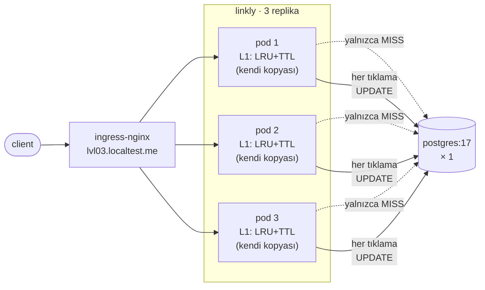

# 03 — local-cache · "Süreç içi önbellek"

> **Bu seviyede ne yaşayacaksın?**
> - Pod belleğindeki önbelleğin DB okuma yükünü neredeyse sıfıra indirmesi (`04 · Cache` → isabet oranı ~%100)
> - Silinen bir linkin diğer pod'larda TTL boyunca açılmaya devam etmesi (P03-01)
> - Her rollout'ta soğuk önbellek ve DB'de testere dişi (P03-02); aynı verinin N pod'da N kopya olması (P03-03) ve ıskanın replika sayısıyla artması (P03-04)
> - Tuzaklar: singleflight kapalıyken izdiham (P03-05), negatif önbellek kapalıyken "yok" cevaplarının DB'ye inmesi (P03-06), TTL jitter kapalıyken periyodik DB tepesi (P03-07)
>
> **Bu seviye olmasa ne olur?** Her redirect veritabanına gider (P02-01); trafik arttıkça bağlantı havuzu ve DB darboğaz olur.
>
> **Yeni gelen teknolojiler:** LRU + TTL önbellek, singleflight, negatif önbellek, TTL jitter — hepsi Go kodu, yeni altyapı yok ([her biri tek cümleyle](../README.md#kullanılan-teknolojiler)).

## 1. Bu seviye ne?

En ucuz önbellek: her pod'un belleğinde sınırlı bir LRU (+ TTL, singleflight, negatif önbellek). DB okuma yükünü
büyük ölçüde kaldırır, ama verinin N kopyasını yaratır ve hiçbir kopya ne zaman bayatladığını bilmez. Bu seviye o
takası ölçer.

## 2. Mimari



Okuma yolu çoğunlukla DB'ye gitmez; tıklama sayacı ise hâlâ her istekte DB'ye `UPDATE` yazar (P02-08 duruyor).

## 3. Önceki seviyeden çözülenler

| ID | Sorun | Nasıl çözüldü |
|---|---|---|
| P02-01 | Her redirect = DB sorgusu | Cache-aside önbellek: `internal/store/cached.go` + `internal/cache` (LRU + TTL + singleflight + negatif önbellek) |

Önbellek yalnızca tekrar tekrar okumayı çözer; havuz (P02-02), tek DB (P02-03), satır kilidi (P02-08) ve sırlar (P02-09) duruyor.

## 4. Ayağa kaldırma

İlk kez mi? Önce kök README'deki [Sıfırdan başlangıç](../README.md#sıfırdan-başlangıç): platform bir kez kurulur ve
`LADDER` (repo kökü) tanımlanır. Her komut bloğu `cd "$LADDER/…"` ile başlar; olduğu gibi yapıştır.
Bu seviyenin platformdan istediği: **temel yığın (kind, ingress, Prometheus, Grafana) + Chaos Mesh**; `make up` açar.

Hızlı başvuru (komutları tek tek kullan; satır sonu açıklamaları için zsh'da `setopt interactivecomments` gerekir):

```bash
cd "$LADDER/03-local-cache"
make up            # profil → Grafana'yı temizle → build → push → deploy → rollout wait → smoke
code=$(curl -s -XPOST http://lvl03.localtest.me/api/links -H 'Content-Type: application/json' -d '{"url":"https://example.com"}' | jq -r .code); echo "$code"
curl -s -o /dev/null -w '%{http_code} → %{redirect_url}\n' http://lvl03.localtest.me/$code   # 302 → https://example.com
make grafana       # Ladder klasörü, level=lvl03 — giriş: admin / ladder
make load S=mixed  # aynı senaryolar her seviyede: create redirect mixed hot-key burst abuser read-your-writes stairs scan
make repro P=P03-01   # §6'daki bir sorunu otomatik üret → REPRODUCED / NOT-REPRODUCED
make env           # açık ayar/tuzaklar · değiştir: make set E="KEY=değer" · hepsini geri al: make reset (§7)
make down          # seviyeyi kaldır · kümeyi durdurmak için: cd "$LADDER/platform" && make stop
```

**Rehber — bu seviyeyi baştan sona, sırayla.**

1. Önceki seviyeyi kapat (aynı anda tek seviye), bu seviyeyi kur. `make up` Grafana'yı da temizler; sonunda
   `✔ lvl03 ayakta` yazar:
```bash
cd "$LADDER/02-postgres"
make down
cd "$LADDER/03-local-cache"
make up
```

**Verileri temizleyip sıfırdan koşmak istersen** 1. adımın yerine bunu kullan: bütün seviyelerin verisi
(linkler, veritabanı, önbellek, kuyruk) ve Grafana'nın gösterdiği metrik, trace, log silinir; küme ve kurulum
kalır (~2-3 dk). Ardından bu seviye temiz kurulur. Yalnızca Grafana çizgilerini temizlemek için (veri kalır)
seviye klasöründe `make fresh` yeter; her deneyin ilk komutu zaten bu.
```bash
cd "$LADDER"
make wipe CONFIRM=1
cd "$LADDER/03-local-cache"
make up
```
2. 02'nin sorunlarını burada koş (koşarken başka komut çalıştırma). `BEKLENEN` sütunu `NOT-REPRODUCED` olan tek satır
   P02-01: 03'ün çözdüğü sorun; sonuç uymazsa satır `✘` alır. Onay isteyen scriptler (P02-02, P02-03, P02-04, P02-10)
   onaysız `SKIPPED` der; onları da koşmak için `CONFIRM=1 make verify-prev`:
```bash
cd "$LADDER/03-local-cache"
make verify-prev
```
3. §6'daki sorunları sırayla yaşa (P03-01 → P03-07): adımları yapıştır → **Terminalde ne görmelisin** ile
   karşılaştır → **Grafana'da gör** linklerini aç.
4. Bitince ayarları geri al ve seviyeyi kapat:
```bash
cd "$LADDER/03-local-cache"
make reset
make down
```

## 5. API

Her seviyede aynı: [docs/API.md](../docs/API.md).

Davranış aynı, garanti değişti: `GET /{code}` TTL kadar bayat bir kopyadan cevaplanabilir; önbellekten gelen
`clicks` da bayattır (tıklama sayısı önbellekte yetkili değil).

## 6. Reproduce edilebilir sorunlar

Her sorun aynı düzende: **Ne deniyoruz** (deneyin sorusu) → **Neden** → adımlar (her adım ne yaptığını söyler)
→ **Terminalde ne görmelisin** → **Grafana'da gör** (giriş: admin / ladder) → **Nerede çözülüyor**.
`make repro` hükmü: `REPRODUCED` = sorun var · `NOT-REPRODUCED` = yok · `SKIPPED` = ölçülemedi.

| ID | Sorun | Reproduce | Grafana'da | Çözüm |
|---|---|---|---|---|
| P03-01 | Silinen link diğer pod'larda yaşıyor | `make repro P=P03-01` | [03 · App Business](http://grafana.localtest.me/d/ladder-app-business?var-level=lvl03&from=now-15m&to=now&refresh=10s) · [04 · Cache](http://grafana.localtest.me/d/ladder-cache?var-level=lvl03&from=now-15m&to=now&refresh=10s) → "404 (pod'a göre)" | 04 |
| P03-02 | Rollout = soğuk önbellek = DB testere dişi | `make repro P=P03-02` | [05 · Postgres](http://grafana.localtest.me/d/ladder-postgres?var-level=lvl03&from=now-15m&to=now&refresh=10s) · [04 · Cache](http://grafana.localtest.me/d/ladder-cache?var-level=lvl03&from=now-15m&to=now&refresh=10s) → "Veritabanı sorguları (türe göre)" | 04 |
| P03-03 | Aynı veri N pod'da N kopya | `make repro P=P03-03` | [04 · Cache](http://grafana.localtest.me/d/ladder-cache?var-level=lvl03&from=now-15m&to=now&refresh=10s) · [01 · Pods & Resources](http://grafana.localtest.me/d/ladder-pods?var-level=lvl03&from=now-15m&to=now&refresh=10s) → "Önbellekteki kayıt (pod'a göre)" | 04 |
| P03-04 | Hit oranı replika sayısıyla düşer | `CONFIRM=1 make repro P=P03-04` | [04 · Cache](http://grafana.localtest.me/d/ladder-cache?var-level=lvl03&from=now-30m&to=now&refresh=10s) · [01 · Pods & Resources](http://grafana.localtest.me/d/ladder-pods?var-level=lvl03&from=now-30m&to=now&refresh=10s) → "Hazır pod adresi (endpoint) sayısı" | 04 |
| P03-05 | **TRAP** singleflight yok → stampede | `make repro P=P03-05` | [04 · Cache](http://grafana.localtest.me/d/ladder-cache?var-level=lvl03&from=now-15m&to=now&refresh=10s) · [05 · Postgres](http://grafana.localtest.me/d/ladder-postgres?var-level=lvl03&from=now-15m&to=now&refresh=10s) → "Bekletilen eşzamanlı ıska / sn" | seviye içi |
| P03-06 | **TRAP** negatif önbellek yok → tarama DB'ye | `make repro P=P03-06` | [04 · Cache](http://grafana.localtest.me/d/ladder-cache?var-level=lvl03&from=now-15m&to=now&refresh=10s) · [05 · Postgres](http://grafana.localtest.me/d/ladder-postgres?var-level=lvl03&from=now-15m&to=now&refresh=10s) → "Önbellek işlemleri (katman ve sonuca göre)" | seviye içi |
| P03-07 | **TRAP** jitter yok → periyodik DB tepesi | `make repro P=P03-07` | görünmez — kanıt terminalde ↓ | seviye içi |

---

### P03-01 · Silinen link diğer pod'larda TTL boyunca yaşıyor

**Ne deniyoruz:** Silinen bir link bütün pod'larda hemen ölüyor mu?
**Neden:** `DELETE` tek bir pod'a düşer; o pod yalnızca kendi kopyasını temizler, diğer pod'lar hiçbir şey duymaz ve
kopyayı TTL (60 sn) dolana kadar sunar.

**Reproduce (adım adım):** Otomatik: `make repro P=P03-01` (linki bütün pod'ların önbelleğine sokar, siler, 60 kez
okur ve kaçının hâlâ yönlendirdiğini sayar). Elle:

1. Temiz başla; bir link oluştur ve 36 kez okuyarak üç pod'un da önbelleğine sok (ingress istekleri pod'lara sırayla
   dağıtır):
```bash
cd "$LADDER/03-local-cache"
make fresh
code=$(curl -s -XPOST http://lvl03.localtest.me/api/links -H 'Content-Type: application/json' -d '{"url":"https://example.com/p0301"}' | jq -r .code); echo "kod: $code"
for i in $(seq 1 36); do curl -s -o /dev/null http://lvl03.localtest.me/$code; done
```
2. Linki sil (istek tek pod'a düşer) ve veritabanında kalmadığını gör:
```bash
cd "$LADDER/03-local-cache"
curl -s -o /dev/null -w 'DELETE → %{http_code}\n' -XDELETE http://lvl03.localtest.me/api/links/$code
kubectl -n lvl03 exec postgres-0 -c postgres -- psql -U linkly -d linkly -tAc "SELECT count(*) FROM links WHERE code = '$code'"
```
3. Silinmiş kodu 30 kez iste:
```bash
cd "$LADDER/03-local-cache"
for i in $(seq 1 30); do curl -s -o /dev/null -w '%{http_code} ' http://lvl03.localtest.me/$code; done; echo
```
4. İstersen bayatlığın sonunu gör: TTL (60 sn, ±%20 jitter) dolunca tekrar iste:
```bash
cd "$LADDER/03-local-cache"
sleep 75
for i in $(seq 1 30); do curl -s -o /dev/null -w '%{http_code} ' http://lvl03.localtest.me/$code; done; echo
```

**Terminalde ne görmelisin:** `DELETE → 204` ve veritabanında `0` satır. Yine de 30 cevabın ~2/3'ü `302`, ~1/3'ü
`404`: `404`'ler silmeyi alan pod'dan, `302`'ler hiçbir şey duymamış diğer iki pod'dan. 4. adımda hepsi `404`: kopyalar
TTL dolunca düştü; o ana kadar "silinen" link çalışmaya devam etti.

**Grafana'da gör:** [`03 · App Business`](http://grafana.localtest.me/d/ladder-app-business?var-level=lvl03&from=now-15m&to=now&refresh=10s) ve [`04 · Cache`](http://grafana.localtest.me/d/ladder-cache?var-level=lvl03&from=now-15m&to=now&refresh=10s) — deneyden sonra aç; az istekli bir deney, çizgiler 30–90 sn gecikmeyle küçük tümsekler olarak belirir
- "404 (pod'a göre)" → silmeden sonraki `404`'lerin neredeyse hepsi **tek** pod'dan gelir; diğer pod'ların çizgisi 0'da kalır — onlar silinmiş linki hâlâ yönlendiriyor.
- "Yönlendirme sonuçları" → silmeden sonra `ok` serisi sürer, yanında küçük bir `not_found` belirir: aynı kod aynı anda hem "var" hem "yok".
- "İsabet oranı (pod'a göre)" → yüksek kalır: bayat kopyayı sunmak önbellek için bir isabettir; hit oranı bu sorunu göstermez.

**Nerede çözülüyor:** 04 (tek paylaşılan önbellek: geçersiz kılma tek yerde). Kural: her kopya bir geçersiz kılma
kanalı ister; kanal yoksa bedeli kullanıcı bayat veriyle öder.

---

### P03-02 · Rollout = soğuk önbellek = DB'de testere dişi

**Ne deniyoruz:** Bir dağıtımdan sonra DB'ye inen okuma sayısı ne kadar sıçrıyor?
**Neden:** Önbellek pod'un belleğinde; pod ölünce önbellek de ölür. Her yeni pod boş doğar ve ilk istekleri DB'ye
iner.

**Reproduce (adım adım):** Otomatik: `make repro P=P03-02` (TTL'i 10 dk yapar, 2000 kodluk sürekli yük altında önce
kararlı hâli, sonra rollout penceresini ayrı ölçüp kıyaslar; ~5 dk). Elle:

1. Temiz başla; TTL dolmasını 10 dk yaparak sustur (60 sn'lik TTL'in kendi yeniden dolması aynı grafiği besler ve
   ölçmek istediğimiz darbeyi örter; pod'lar yeniden başlar):
```bash
cd "$LADDER/03-local-cache"
make fresh
make set E="CACHE_TTL=10m"
```
2. İkinci bir terminalde 2000 kodluk çalışma kümesiyle 4 dk sürecek yükü başlat:
```bash
cd "$LADDER/03-local-cache"
SEED=2000 SEED_BUDGET_MS=240000 make load S=redirect K6_ARGS="--vus 20 --duration 240s"
```
3. Yük başlar başlamaz ilk terminalde 2 dk bekle (ısınma + ölçüm penceresi) ve kararlı hâlde saniyedeki DB okumasını
   ölç:
```bash
cd "$LADDER/03-local-cache"
sleep 120
curl -s 'http://prometheus.localtest.me/api/v1/query' --data-urlencode 'query=sum(increase(db_queries_total{namespace="lvl03",op="get"}[45s])) / 45' | jq -r '.data.result[0].value[1]'
```
4. Hemen ardından dağıtım yap; yeni pod'lar ısınınca dağıtımın başından beri saniyedeki DB okumasını ölç (pencere
   dağıtıma hizalı: tüm koşunun tepesi yükün kendi ısınmasından gelir, kanıt olmaz):
```bash
cd "$LADDER/03-local-cache"
t0=$(date +%s)
kubectl -n lvl03 rollout restart deploy/linkly
kubectl -n lvl03 rollout status deploy/linkly
sleep 30
rw=$(( $(date +%s) - t0 )); echo "rollout penceresi: $rw sn"
curl -s 'http://prometheus.localtest.me/api/v1/query' --data-urlencode "query=sum(increase(db_queries_total{namespace=\"lvl03\",op=\"get\"}[${rw}s])) / $rw" | jq -r '.data.result[0].value[1]'
```
5. Yük bitince TTL'i geri al:
```bash
cd "$LADDER/03-local-cache"
make reset
```

**Terminalde ne görmelisin:** 3. adımdaki sayı sıfıra yakın: önbellek sıcak, okumalar DB'ye inmiyor. 4. adımdaki sayı
bunun birkaç katı (script en az 3 katını ve saniyede 5'ten fazlasını arar): her yeni pod 2000 kodu kendisi için
DB'den yeniden çekti. Testere dişinin bir dişi bu.

**Grafana'da gör:** [`05 · Postgres`](http://grafana.localtest.me/d/ladder-postgres?var-level=lvl03&from=now-15m&to=now&refresh=10s) ve [`04 · Cache`](http://grafana.localtest.me/d/ladder-cache?var-level=lvl03&from=now-15m&to=now&refresh=10s) — deney ~5 dk; bitince aç ki kararlı hâl ve rollout aynı ekranda olsun
- "Veritabanı sorguları (türe göre)" → `get` serisinde iki tümsek: ilki yükün kendi ısınması, ~2 dk sonraki ikincisi rollout — yere yakın kararlı hâlden dikey tepe, sonra iniş. `increment_clicks` baştan sona düz: tıklama UPDATE'ini önbellek korumuyor.
- "Önbellekteki kayıt (pod'a göre)" → rollout anında eski pod'ların çizgileri kesilir, yenileri **0**'dan tırmanır: her yeni pod boş doğar.
- "Önbellek ıskası ve veritabanı sorguları" → `önbellek ıskası` rollout anında sıçrar; `veritabanı sorgusu (hepsi)` az oynar çünkü tıklama UPDATE'leri ona yüksek bir taban ekler — soğuk başlangıcı `get` serisinde oku.

**Nerede çözülüyor:** 04 (önbellek pod'un dışında, pod ölse de yaşar). Veritabanı soğuk anı kaldırabilmeli: kapasite
ortalamaya değil en kötü ana göre planlanır.

---

### P03-03 · Aynı veri N pod'da N kopya

**Ne deniyoruz:** Aynı linkler için önbellek kaç kez bellek harcıyor?
**Neden:** Süreç içi önbellek pod başınadır; aynı link her pod'da ayrı ayrı tutulur, bellek replika sayısıyla çarpılır.

**Reproduce (adım adım):** Otomatik: `make repro P=P03-03` (3000 link oluşturur, aynı 3000 kodu her pod'a doğrudan
okutur, her pod'un `cache_entries`'ini önce ve sonra okur; ölçü: eklenen kayıt toplamı ÷ farklı kod sayısı). Elle:

1. Temiz başla; 3000 farklı link oluştur, kodları dosyada topla (1–2 dk) ve farklı kod sayısını say:
```bash
cd "$LADDER/03-local-cache"
make fresh
for i in $(seq 1 3000); do curl -s -XPOST http://lvl03.localtest.me/api/links -H 'Content-Type: application/json' -d "{\"url\":\"https://example.com/mem/$i\"}" | jq -r .code; done > /tmp/p0303-codes.txt
sort -u /tmp/p0303-codes.txt | wc -l
```
2. Aynı 3000 kodu **her pod'a doğrudan** (port-forward) okut — ingress'e bırakırsan hangi kodun hangi pod'a gittiği
   şansa kalır — ve her pod'un önbellek kayıt sayısını önce ve sonra oku:
```bash
cd "$LADDER/03-local-cache"
for pod in $(kubectl -n lvl03 get pods -l app.kubernetes.io/name=linkly -o json | jq -r '.items[] | select(.metadata.deletionTimestamp == null) | select(any(.status.containerStatuses[]?; .ready)) | .metadata.name'); do
  kubectl -n lvl03 port-forward "pod/$pod" 18093:8080 >/dev/null 2>&1 &
  pf=$!
  sleep 3
  before=$(curl -s http://127.0.0.1:18093/metrics | awk '$1 == "cache_entries" {print $2}')
  xargs -P 10 -I{} curl -s -o /dev/null --max-time 5 http://127.0.0.1:18093/{} < /tmp/p0303-codes.txt
  after=$(curl -s http://127.0.0.1:18093/metrics | awk '$1 == "cache_entries" {print $2}')
  echo "${pod}: önbellek kaydı $before → $after"
  kill $pf
  sleep 1
done
```

**Terminalde ne görmelisin:** `3000`, sonra her pod için bir satır: her birinde kayıt ~3000 artar (`… → …`). Toplam
~9000 kayıt, 3000 farklı kod: her kod ortalama 3 kez tutuluyor (script: `her kod ortalama 3.0 kez tutuluyor`). Aynı
veri için üç kez bellek ödüyorsun.

**Grafana'da gör:** [`04 · Cache`](http://grafana.localtest.me/d/ladder-cache?var-level=lvl03&from=now-15m&to=now&refresh=10s) ve [`01 · Pods & Resources`](http://grafana.localtest.me/d/ladder-pods?var-level=lvl03&from=now-15m&to=now&refresh=10s) — 2. adım başlayınca aç
- "Önbellekteki kayıt (pod'a göre)" → pod çizgileri **sırayla** ~3000 yukarı basamak atar ve üçü aynı seviyede durur: her pod aynı 3000 linkin kendi kopyasını tutuyor.
- "Önbellekteki kayıt" → toplam ~9000 artar: farklı link sayısının (3000) replika sayısı katı.
- "Heap bellek (Go)" → belirgin sıçrama bekleme: pod başına ~yarım MB, GC dalgalanmasında kaybolur. Çarpanı kayıt sayısında gör.

**Nerede çözülüyor:** 04. Hesap: 1M sıcak link × ~200 byte × 10 pod = 2 GB, aynı veri için on kez; paylaşılan
önbellekte bir kez ödenir, karşılığında her okumaya bir ağ gidiş-gelişi eklenir (P04-02).

---

### P03-04 · Hit oranı replika sayısıyla düşer

**Ne deniyoruz:** Replika sayısı artınca önbellek ıskası (DB'ye inen okuma) da artıyor mu?
**Neden:** Ingress istekleri pod'lara dağıtır; her pod aynı çalışma kümesini kendisi için ayrı ayrı ısıtır. Isınma
maliyeti pod sayısıyla çarpılır.

**Reproduce (adım adım):** Otomatik: `CONFIRM=1 make repro P=P03-04` (1 ve 6 replikayla aynı yükü koşup ıska
sayısını kıyaslar — 4000 kod, 20 kullanıcı × 60 sn; sonunda replika sayısını geri alır). Elle:

1. Temiz başla; tek pod'a in, pod'u boş önbellekle yeniden başlat, Prometheus eski pod'u unutana kadar bekle ve ıska
   sayacını oku:
```bash
cd "$LADDER/03-local-cache"
make fresh
kubectl -n lvl03 scale deploy/linkly --replicas=1
kubectl -n lvl03 rollout status deploy/linkly
kubectl -n lvl03 rollout restart deploy/linkly
kubectl -n lvl03 rollout status deploy/linkly
sleep 40
m0=$(curl -s 'http://prometheus.localtest.me/api/v1/query' --data-urlencode 'query=sum(cache_ops_total{namespace="lvl03",result="miss"})' | jq -r '.data.result[0].value[1] // "0"'); echo "ıska sayacı: $m0"
```
2. 4000 kodluk çalışma kümesiyle 20 kullanıcı × 60 sn yük ver, yükün yarattığı ıskayı hesapla (sayaç yükten önce ve
   sonra okunur; hit oranı değil ıska sayısı, çünkü iddia "kaç kez ısıtıldı"):
```bash
cd "$LADDER/03-local-cache"
SEED=4000 SEED_BUDGET_MS=240000 make load S=redirect K6_ARGS="--vus 20 --duration 60s"
sleep 20
m1=$(curl -s 'http://prometheus.localtest.me/api/v1/query' --data-urlencode 'query=sum(cache_ops_total{namespace="lvl03",result="miss"})' | jq -r '.data.result[0].value[1] // "0"')
echo "1 pod → ıska: $(awk -v a="$m0" -v b="$m1" 'BEGIN{print b - a}')"
```
3. Aynısını 6 pod'la yap:
```bash
cd "$LADDER/03-local-cache"
kubectl -n lvl03 scale deploy/linkly --replicas=6
kubectl -n lvl03 rollout status deploy/linkly
kubectl -n lvl03 rollout restart deploy/linkly
kubectl -n lvl03 rollout status deploy/linkly
sleep 40
m0=$(curl -s 'http://prometheus.localtest.me/api/v1/query' --data-urlencode 'query=sum(cache_ops_total{namespace="lvl03",result="miss"})' | jq -r '.data.result[0].value[1] // "0"'); echo "ıska sayacı: $m0"
SEED=4000 SEED_BUDGET_MS=240000 make load S=redirect K6_ARGS="--vus 20 --duration 60s"
sleep 20
m1=$(curl -s 'http://prometheus.localtest.me/api/v1/query' --data-urlencode 'query=sum(cache_ops_total{namespace="lvl03",result="miss"})' | jq -r '.data.result[0].value[1] // "0"')
echo "6 pod → ıska: $(awk -v a="$m0" -v b="$m1" 'BEGIN{print b - a}')"
```
4. Geri al:
```bash
cd "$LADDER/03-local-cache"
kubectl -n lvl03 scale deploy/linkly --replicas=3
kubectl -n lvl03 rollout status deploy/linkly
```

**Terminalde ne görmelisin:** 1 pod'da ıska kabaca çalışma kümesi kadar (en çok 4000: her kod bir kez ısınır). 6 pod'da
aynı yükle ıska bunun belirgin katı (script en az 1.8 katını arar; üst sınır 6): her pod aynı 4000 kodu kendisi için
çekiyor. Paylaşılan önbellekte (04) iki sayı yaklaşık aynı çıkar.

**Grafana'da gör:** [`04 · Cache`](http://grafana.localtest.me/d/ladder-cache?var-level=lvl03&from=now-30m&to=now&refresh=10s) ve [`01 · Pods & Resources`](http://grafana.localtest.me/d/ladder-pods?var-level=lvl03&from=now-30m&to=now&refresh=10s) — iki faz birkaç dakika sürer; bitince aç (son 30 dk iki fazı da kapsar)
- "Hazır pod adresi (endpoint) sayısı" → fazları ayırır: önce **1**, sonra **6** hazır adres; sonunda eski sayıya döner.
- "Önbellek ıskası ve veritabanı sorguları" → her fazın başında bir `önbellek ıskası` tümseği (ısınma maliyeti); 6 pod'lu fazda belirgin biçimde daha yüksek ve uzun.
- "İsabet oranı (pod'a göre)" → 1 pod'da tek çizgi hızla yükselir; 6 pod'da her çizgi daha yavaş ve aşağıda kalır. Oranı yalnızca şekil için oku: payı ve paydası birlikte oynar, asıl ölçü ıska sayısı.

**Nerede çözülüyor:** 04 (sorun tamamen kalkar). Ara çözüm consistent hashing (aynı anahtar hep aynı pod'a), ama
sıcak anahtarı tek pod'a bağlar ve ölçeklemede anahtarları taşır.

---

### P03-05 · TRAP · Singleflight olmadan izdiham (cache stampede)

**Ne deniyoruz:** Sıcak bir anahtarın TTL'i dolduğu anda kaç istek birden DB'ye koşuyor?
**Neden:** TTL dolunca o anahtarı isteyen **bütün** istekler aynı satır için DB'ye gider (izdiham). Singleflight bunları
tek sorguda birleştirir; tuzak onu kapatır.

**Reproduce (adım adım):** Otomatik: `make repro P=P03-05` (Postgres'e Chaos Mesh ile 200 ms gecikme ekler, TTL'i 5
sn'ye çeker, `hot-key` yüküyle önce korumalı sonra korumasız ölçer, sonunda geri alır). Chaos Mesh kurulu değilse bir kez: `cd "$LADDER/platform" && make chaos`. Elle:

1. Temiz başla; önbelleği doldurmayı pahalı yap (Postgres'e 200 ms — DB 1 ms'de cevap verirse izdiham deliği ölçülemeyecek
   kadar dar kalır), TTL'i 5 sn'ye çek (pod'lar yeniden başlar), DB `get` sayacını oku:
```bash
cd "$LADDER/03-local-cache"
make fresh
make chaos C=pg-delay-200ms
make set E="CACHE_TTL=5s"
sleep 40
g0=$(curl -s 'http://prometheus.localtest.me/api/v1/query' --data-urlencode 'query=sum(db_queries_total{namespace="lvl03",op="get"})' | jq -r '.data.result[0].value[1] // "0"'); echo "get sayacı: $g0"
```
2. Koruma açıkken (varsayılan) 60 kullanıcıyla 60 sn sıcak anahtar yükü; sonra DB'ye inen `get` sayısı ve
   singleflight'ta bekletilen çağrı sayısı:
```bash
cd "$LADDER/03-local-cache"
SEED=20 HOT_SHARE=0.99 make load S=hot-key K6_ARGS="--vus 60 --duration 60s"
sleep 20
g1=$(curl -s 'http://prometheus.localtest.me/api/v1/query' --data-urlencode 'query=sum(db_queries_total{namespace="lvl03",op="get"})' | jq -r '.data.result[0].value[1] // "0"')
echo "korumalı: yük boyunca DB get = $(awk -v a="$g0" -v b="$g1" 'BEGIN{print b - a}')"
curl -s 'http://prometheus.localtest.me/api/v1/query' --data-urlencode 'query=sum(increase(cache_stampede_wait_total{namespace="lvl03"}[5m]))' | jq -r '.data.result[0].value[1]'
```
3. Korumayı kapat (pod'lar yeniden başlar), aynı yükü tekrarla:
```bash
cd "$LADDER/03-local-cache"
make set E="TRAP_NO_SINGLEFLIGHT=true"
sleep 40
g0=$(curl -s 'http://prometheus.localtest.me/api/v1/query' --data-urlencode 'query=sum(db_queries_total{namespace="lvl03",op="get"})' | jq -r '.data.result[0].value[1] // "0"'); echo "get sayacı: $g0"
SEED=20 HOT_SHARE=0.99 make load S=hot-key K6_ARGS="--vus 60 --duration 60s"
sleep 20
g1=$(curl -s 'http://prometheus.localtest.me/api/v1/query' --data-urlencode 'query=sum(db_queries_total{namespace="lvl03",op="get"})' | jq -r '.data.result[0].value[1] // "0"')
echo "korumasız: yük boyunca DB get = $(awk -v a="$g0" -v b="$g1" 'BEGIN{print b - a}')"
```
4. Geri al: gecikmeyi kaldır, TTL'i ve tuzağı manifestteki hâline döndür:
```bash
cd "$LADDER/03-local-cache"
make unchaos C=pg-delay-200ms
make reset
```

**Terminalde ne görmelisin:** `make chaos` → `networkchaos.chaos-mesh.org/pg-delay-200ms created`. Korumalı turda DB
`get` küçük, bekletilen çağrı sıfırdan büyük: TTL dolunca gelenler tek sorguyu bekledi. Korumasız turda `get` belirgin
biçimde büyük (script en az 2 katını ve 100 fazlasını arar). Hit oranı iki turda da yüksek; farkı yalnızca DB'ye inen
sorgu gösterir. Singleflight'ın değeri doldurma pahalıyken ortaya çıkar.

**Grafana'da gör:** [`04 · Cache`](http://grafana.localtest.me/d/ladder-cache?var-level=lvl03&from=now-15m&to=now&refresh=10s) ve [`05 · Postgres`](http://grafana.localtest.me/d/ladder-postgres?var-level=lvl03&from=now-15m&to=now&refresh=10s) — iki faz (korumalı, korumasız) 60'ar sn; ikisi de bitince aç
- "Bekletilen eşzamanlı ıska / sn" → korumalı fazda tümsek (bekleyen çağrılar: koruma çalışıyor — bu sayının yükselmesi hata değil), korumasız fazda **0**. Büyük rakam son değeri gösterir, eğriye bak.
- "İsabet oranı (pod'a göre)" → iki fazda da yüksek ve neredeyse aynı: izdiham hit oranında görünmez.
- "Veritabanı sorguları (türe göre)" → `get` korumasız fazda belirgin yükselir; `increment_clicks` iki fazda aynı.
- "Sorgu süresi p99 (türe göre)" → iki fazda da eklenen ~200 ms gecikme (kova yüzünden ~250 ms çizilir): önbelleği doldurmanın maliyeti.

**Nerede çözülüyor:** Seviye içi — `TRAP_NO_SINGLEFLIGHT` kapalıyken (varsayılan) koruma açık.

---

### P03-06 · TRAP · Negatif önbellek yoksa "yok" cevabı hep DB'ye iner

**Ne deniyoruz:** Var olmayan kodlara gelen istekler (tarama, ölü link, yazım hatası) önbellekten mi dönüyor, DB'ye mi
iniyor?
**Neden:** Önbellek yalnızca var olanı tutar; "yok" cevabı da kısa süre (10 sn) önbelleklenmezse her biri DB'ye sorulur.

**Reproduce (adım adım):** Otomatik: `make repro P=P03-06` (`scan` senaryosuyla 60 kodluk "yok" havuzuna yük verir,
negatif önbellek açık/kapalı kıyaslar; negatif isabet hiç olmazsa ölçmeden çıkar). Elle:

1. Temiz başla; negatif önbellek açıkken (varsayılan) 60 var olmayan koddan oluşan havuza 30 kullanıcıyla 60 sn tarama
   yap (havuz sınırlı: aynı "yok" tekrarlanmazsa önbelleklenecek bir şey olmaz), sonra DB `get`/sn ve negatif isabet:
```bash
cd "$LADDER/03-local-cache"
make fresh
KEYS=60 CODE_LEN=7 make load S=scan K6_ARGS="--vus 30 --duration 60s"
sleep 18
curl -s 'http://prometheus.localtest.me/api/v1/query' --data-urlencode 'query=sum(rate(db_queries_total{namespace="lvl03",op="get"}[1m]))' | jq -r '.data.result[0].value[1]'
curl -s 'http://prometheus.localtest.me/api/v1/query' --data-urlencode 'query=sum(increase(cache_ops_total{namespace="lvl03",result="negative_hit"}[5m]))' | jq -r '.data.result[0].value[1]'
```
2. Negatif önbelleği kapat (pod'lar yeniden başlar), aynı taramayı yap:
```bash
cd "$LADDER/03-local-cache"
make set E="TRAP_NO_NEGATIVE_CACHE=true"
sleep 10
KEYS=60 CODE_LEN=7 make load S=scan K6_ARGS="--vus 30 --duration 60s"
sleep 18
curl -s 'http://prometheus.localtest.me/api/v1/query' --data-urlencode 'query=sum(rate(db_queries_total{namespace="lvl03",op="get"}[1m]))' | jq -r '.data.result[0].value[1]'
```
3. Geri al:
```bash
cd "$LADDER/03-local-cache"
make reset
```

**Terminalde ne görmelisin:** k6 özetinde isteklerin hepsi `404`. Açık turda negatif isabet sayısı büyük, DB `get`/sn
düşük: aynı "yok" cevabı 10 sn önbellekten dönüyor. Kapalı turda DB `get`/sn belirgin yüksek (script en az 1,5 katını
arar): her "yok" yeniden DB'ye soruluyor.

**Grafana'da gör:** [`04 · Cache`](http://grafana.localtest.me/d/ladder-cache?var-level=lvl03&from=now-15m&to=now&refresh=10s) ve [`05 · Postgres`](http://grafana.localtest.me/d/ladder-postgres?var-level=lvl03&from=now-15m&to=now&refresh=10s) — iki faz (açık, kapalı) 60'ar sn; ikisi de bitince aç
- "Önbellek işlemleri (katman ve sonuca göre)" → açık fazda taramanın çoğu `l1 negative_hit`; kapalı fazda `l1 negative_hit` **0**'a iner, yerini `l1 miss` alır.
- "İsabet oranı (pod'a göre)" → açık fazda yüksek (negatif isabet de isabet), kapalı fazda sıfıra yakın.
- "Veritabanı sorguları (türe göre)" → `get` kapalı fazda belirgin yükselir.

**Nerede çözülüyor:** Seviye içi — `TRAP_NO_NEGATIVE_CACHE` kapalıyken koruma açık. Negatif TTL kısa tutulur (10 sn) ki
yeni oluşturulan link eski "yok"un arkasında kalmasın; taramanın kendisi 08'de hız sınırıyla karşılanır.

---

### P03-07 · TRAP · TTL jitter yoksa periyodik DB tepesi

**Ne deniyoruz:** Aynı anda ısınan anahtarların TTL'i aynı saniyede dolup düzenli bir yük dalgası üretiyor mu?
**Neden:** Dağıtımdan sonra binlerce anahtar aynı saniyede yazılır; TTL'e rastgelelik (jitter) eklenmezse hepsi aynı
saniyede dolar. Jitter ±%20 bu dolmaları zamana yayar.

**Reproduce (adım adım):** Otomatik: `make repro P=P03-07` (TTL'i 30 sn'ye çeker, 300 kodu tek seferde ısıtır,
jitter açık/kapalı 150'şer sn yük verip **tepe/ortalama** oranını kıyaslar; ~8 dk; saniyelik seriler
`/tmp/p0307-jitter.txt` ve `/tmp/p0307-nojitter.txt`'te kalır). Elle — darbe 1-2 sn sürdüğü için Prometheus'tan değil,
pod'un kendi `/metrics` ucundan saniyede bir okunur:

1. Temiz başla; TTL'i 30 sn'ye çek (jitter açık, pod'lar yeniden başlar), hazır bir pod seç:
```bash
cd "$LADDER/03-local-cache"
make fresh
make set E="CACHE_TTL=30s"
sleep 10
pod=$(kubectl -n lvl03 get pod -l app.kubernetes.io/name=linkly -o json | jq -r '[.items[] | select(.metadata.deletionTimestamp == null) | select(any(.status.containerStatuses[]?; .ready)) | .metadata.name][0]'); echo "pod: $pod"
```
2. İkinci bir terminalde 300 kodluk kümeyle 150 sn okuma yükünü başlat:
```bash
cd "$LADDER/03-local-cache"
SEED=300 make load S=redirect K6_ARGS="--vus 20 --duration 150s"
```
3. Hemen ardından ilk terminalde 150 sn boyunca saniyede bir, o pod'da TTL'i dolan anahtar sayısını dosyaya yaz;
   sonra tepe/ortalama oranını hesapla:
```bash
cd "$LADDER/03-local-cache"
prev=""; for i in $(seq 1 150); do cur=$(kubectl -n lvl03 get --raw "/api/v1/namespaces/lvl03/pods/${pod}:8080/proxy/metrics" | awk -v pat='^cache_ops_total\{.*result="expired"' '$0 ~ pat {s += $2} END {print s + 0}'); [ -n "$prev" ] && awk -v a="$prev" -v b="$cur" 'BEGIN{print b - a}'; prev=$cur; sleep 1; done > /tmp/p0307-jitter.txt
awk '{n++; s+=$1; if ($1>p) p=$1} END{if (s==0) {print "veri yok"; exit} printf "jitterli: tepe=%d ortalama=%.1f tepe/ortalama=%.1f\n", p, s/n, p/(s/n)}' /tmp/p0307-jitter.txt
```
4. Jitter'ı kapat (pod'lar yeniden başlar), yeni bir pod seç:
```bash
cd "$LADDER/03-local-cache"
make set E="TRAP_NO_TTL_JITTER=true"
sleep 10
pod=$(kubectl -n lvl03 get pod -l app.kubernetes.io/name=linkly -o json | jq -r '[.items[] | select(.metadata.deletionTimestamp == null) | select(any(.status.containerStatuses[]?; .ready)) | .metadata.name][0]'); echo "pod: $pod"
```
5. İkinci terminalde aynı yükü yeniden başlat:
```bash
cd "$LADDER/03-local-cache"
SEED=300 make load S=redirect K6_ARGS="--vus 20 --duration 150s"
```
6. Hemen ardından ilk terminalde aynı örneklemeyi yap, sonra iki seriyi yan yana koy:
```bash
cd "$LADDER/03-local-cache"
prev=""; for i in $(seq 1 150); do cur=$(kubectl -n lvl03 get --raw "/api/v1/namespaces/lvl03/pods/${pod}:8080/proxy/metrics" | awk -v pat='^cache_ops_total\{.*result="expired"' '$0 ~ pat {s += $2} END {print s + 0}'); [ -n "$prev" ] && awk -v a="$prev" -v b="$cur" 'BEGIN{print b - a}'; prev=$cur; sleep 1; done > /tmp/p0307-nojitter.txt
awk '{n++; s+=$1; if ($1>p) p=$1} END{if (s==0) {print "veri yok"; exit} printf "jittersiz: tepe=%d ortalama=%.1f tepe/ortalama=%.1f\n", p, s/n, p/(s/n)}' /tmp/p0307-nojitter.txt
paste /tmp/p0307-jitter.txt /tmp/p0307-nojitter.txt | head -90
```
7. Geri al:
```bash
cd "$LADDER/03-local-cache"
make reset
```

**Terminalde ne görmelisin:** iki `tepe/ortalama` satırı; jitter'sızın oranı belirgin büyük (script en az 1,8 katını
ve 3'ten büyüğünü arar). `paste` çıktısında her satır bir saniyede dolan anahtar sayısı: sol sütun (jitter'lı) küçük,
dağınık sayılar; sağ sütun çoğunlukla `0` ve ~30 satırda bir büyük sayı — testere dişi. Toplamlar yakın: aynı sayıda
anahtar doluyor, fark zamana yayılıp yayılmamasında. Kapasite ortalamaya değil tepeye göre planlanır.

**Grafana'da gör:** Grafana'da görünmez — darbe 1-2 sn sürer, Prometheus uygulamayı 10 sn'de bir okur ve paneller 1 dk'lık `rate` çizer; tepe düzlenir. `04 · Cache` → "Önbellek işlemleri (katman ve sonuca göre)" panelindeki `l1 expired` iki fazda da benzer düz bir çizgidir. Kanıt terminalde:
- `make repro P=P03-07` → `jitter'lı: tepe=… ortalama=… → tepe/ortalama=…` ve `jitter'sız: …`; jitter'sız oran belirgin büyük
- `paste /tmp/p0307-jitter.txt /tmp/p0307-nojitter.txt | head -90` → sol sütun dağınık küçük sayılar, sağ sütun ~30 satırda bir büyük sayı

**Nerede çözülüyor:** Seviye içi — `TRAP_NO_TTL_JITTER` kapalıyken koruma açık. Aynı fikir retry'da (10) da karşına
çıkar.

## 7. Seviye içi alıştırmalar (TRAP_ bayrakları)

> **Nasıl uygulanır:** aç `make set E="TRAP_X=true"` · ne açık? `make env` · hepsini geri al `make reset` (`make unset E=TRAP_X` yalnızca siler). Diğer ayarlar da aynı yolla (`make set E="CACHE_TTL=1h"`). Pod'lar yeni değerle yeniden başlar, komut hazır olunca döner; tek servis için `W=redirect`. `make repro` tuzakları kendisi açıp kapatır. Bitirince `make reset`: açık kalan bir tuzak sonraki deneyi sessizce bozar.

| Bayrak | Ne yapar | Reproduce | Düzeltme |
|---|---|---|---|
| `TRAP_NO_SINGLEFLIGHT` | Eşzamanlı ıskaları birleştirmez | `make repro P=P03-05` | Bayrağı kapat |
| `TRAP_NO_NEGATIVE_CACHE` | "Yok" cevabını önbelleklemez | `make repro P=P03-06` | Bayrağı kapat |
| `TRAP_NO_TTL_JITTER` | TTL'e rastgelelik eklemez | `make repro P=P03-07` | Bayrağı kapat |
| `TRAP_READYZ_CHECKS_DB` · `TRAP_MIGRATE_IN_MAIN` | (02'den devam) | `make repro P=P02-10` (02'de) | — |

Elle denemeye değer:
- `make set E="CACHE_CAPACITY=100"` + `make load S=mixed` → kapasite çalışma kümesinden küçük: `cache_evictions_total{reason="capacity"}` tırmanır, hit oranı çöker.
- `make set E="CACHE_TTL=1h"` + P03-01 → bayatlık penceresi bir saate çıkar; TTL, tutarlılık ile DB yükü arasındaki tek ayar düğmesi.
- `make load S=hot-key` ile `make load S=redirect` hit oranlarını kıyasla: sıcak anahtar önbelleğin en iyi, tekdüze dağılım en kötü durumu.

## 8. Gözlemlenebilirlik: hangi paneller dolu, hangileri boş

| Dashboard | Durum | Neden |
|---|---|---|
| [`04 · Cache`](http://grafana.localtest.me/d/ladder-cache?var-level=lvl03&from=now-15m&to=now) | **Dolu** | `l1` işlemleri, izdiham, atma, kayıt sayısı; arama süresi (`cache_lookup_duration_seconds`) yalnızca Explore'da |
| [`05 · Postgres`](http://grafana.localtest.me/d/ladder-postgres?var-level=lvl03&from=now-15m&to=now) | Dolu | Çok daha az sorgu; `lvl02` ile kıyasla |
| [`02 · App RED`](http://grafana.localtest.me/d/ladder-app-red?var-level=lvl03&from=now-15m&to=now) · [`03 · App Business`](http://grafana.localtest.me/d/ladder-app-business?var-level=lvl03&from=now-15m&to=now) · [`01 · Pods`](http://grafana.localtest.me/d/ladder-pods?var-level=lvl03&from=now-15m&to=now) · [`10 · Rate limit`](http://grafana.localtest.me/d/ladder-ratelimit?var-level=lvl03&from=now-15m&to=now) | Dolu | — |
| [`06 · Redis`](http://grafana.localtest.me/d/ladder-redis?var-level=lvl03&from=now-15m&to=now) | Boş | Paylaşılan önbellek yok (04) |
| [`07 · Analytics`](http://grafana.localtest.me/d/ladder-analytics?var-level=lvl03&from=now-15m&to=now) · [`08 · Stream`](http://grafana.localtest.me/d/ladder-stream?var-level=lvl03&from=now-15m&to=now) · [`09 · Autoscaling`](http://grafana.localtest.me/d/ladder-autoscaling?var-level=lvl03&from=now-15m&to=now) · [`11 · Resilience`](http://grafana.localtest.me/d/ladder-resilience?var-level=lvl03&from=now-15m&to=now) · [`12 · SLO`](http://grafana.localtest.me/d/ladder-slo?var-level=lvl03&from=now-15m&to=now) · [`13 · Rollout`](http://grafana.localtest.me/d/ladder-rollout?var-level=lvl03&from=now-15m&to=now) | Boş | Bu seviyede o bileşenler yok |

En öğretici karşılaştırma: `level` seçicisini `lvl02` ↔ `lvl03` arasında değiştirip aynı yükte DB sorgularını kıyasla.

## 9. Bilerek bırakılanlar

- Önbellek pod başına: tutarsızlık, soğuk başlangıç, bellek çarpanı, artan ıska (P03-01…04 → 04).
- Geçersiz kılma yayını (pub/sub) yok: silme yalnızca yerel.
- Yazma yolu önbelleğe yazmıyor: 09'daki read-your-writes sorunu şanslı bir yerel isabetin arkasına saklanmasın diye.
- Tıklama sayacı hâlâ her istekte DB'ye (P02-08 → 05).
- Liste önbelleklenmiyor: her yazmada değişir, geçersiz kılması pahalı.
- Bağlantı havuzu, tek DB, sırlar, süreç içi hız sınırı: 02'den olduğu gibi.

## 10. `make diff-prev` okuma rehberi

`cd "$LADDER/03-local-cache" && make diff-prev` 02 ile farkı gösterir; şunlara bak:

1. `internal/cache/cache.go` (yeni): LRU + TTL + jitter + singleflight + negatif önbellek, ~200 satır; her TRAP bayrağı tek bir `if`.
2. `internal/store/cached.go` (yeni): bir dekoratör; handler'lar aynı arayüzle konuşur, önbellek kararı geri alınabilir kalır.
3. `IncrementClicks` önbelleğe dokunmuyor: her tıklamada geçersiz kılmak en sıcak anahtarları ıskaya çevirirdi.
4. `deploy/deployment.yaml`: bellek limiti 256Mi → 384Mi; önbelleğin bedeli manifestte görünür.
5. `cmd/linkly/main.go`: `cache.New` + `store.NewCached` — üç satır; P03-01…04'ün hepsi bu üç satırdan doğar.
