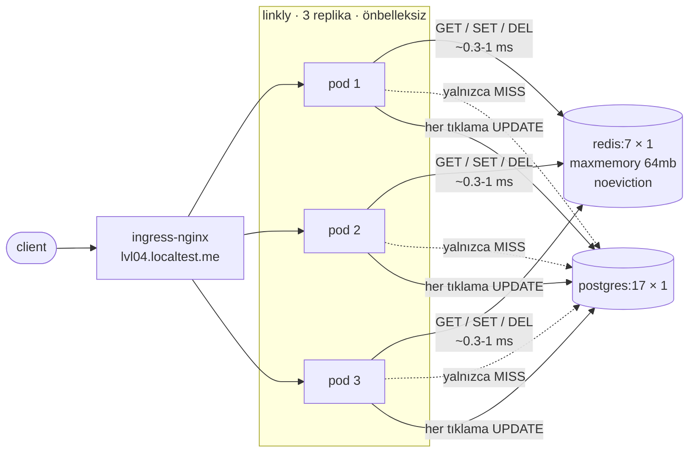

# 04 — redis-cache · "Paylaşılan önbellek"

> **Bu seviyede ne yaşayacaksın?**
> - 03'ün tutarsızlıklarının tek hamlede kapanması: tek kopya, tek geçersiz kılma, dağıtımlardan sağ çıkan sıcak önbellek
> - Redis ölünce bütün yükün DB'ye inmesi (P04-01); her okumaya bir ağ adımı eklenmesi (P04-02)
> - Tek sıcak linkin Redis'in tek çekirdeğine yığılması (P04-03); tuzak: jitter yokluğunun paylaşılan önbellekte daha kötü olması (P04-04)
> - Cache-aside yarışında bayat kaydın geri yazılması (P04-05); `maxmemory` + `noeviction` ile önbelleğin sessizce önbelleklemeyi bırakması (P04-06); tuzak: `KEYS *`'in tek komutla bütün Redis'i kilitlemesi (P04-07)
>
> **Bu seviye olmasa ne olur?** Silinen link pod'larda yaşamaya devam eder, her rollout önbelleği soğutup DB'yi yakar ve isabet oranı replika sayısıyla düşer (P03-01 … P03-04).
>
> **Yeni gelen teknolojiler:** Redis 7, go-redis, redis_exporter, Chaos Mesh ile Redis öldürme ve geciktirme ([her biri tek cümleyle](../README.md#kullanılan-teknolojiler)).

## 1. Bu seviye ne?

Önbellek pod'un dışına çıktı: tek bir Redis, tüm replikaların paylaştığı. 03'ün bütün tutarlılık
sorunları tek hamlede kapanıyor — tek kopya, tek geçersiz kılma, dağıtımlardan sağ çıkan sıcak bir
önbellek. Karşılığında sıcak yola bir **ağ adımı** ve yavaşlayabilen, dolabilen, ölebilen yeni bir
**bağımlılık** giriyor. Bu seviyenin kuralı: *bağımlı olduğun bir önbellek artık önbellek değil,
veritabanıdır — arızasını hayatta kalınabilir yapmadıkça.*

## 2. Mimari



Artık **iki** tek nokta arıza var: Postgres (P02-03) ve Redis (P04-01). İkincisi ölümcül değil
(fail-open ile DB'ye düşülüyor) — ama bu bir söz değil bir **bahis**: DB'nin, önbelleğin sakladığı
yükü aniden kaldırabileceğine bahse giriyorsun.

## 3. Önceki seviyeden çözülenler

| ID | Sorun | Nasıl çözüldü |
|---|---|---|
| P03-01 | Silinen link diğer pod'larda yaşıyor | Tek paylaşılan önbellek: `DEL` herkesi etkiler |
| P03-02 | Rollout = soğuk önbellek | Önbellek pod'un dışında; pod ölse de yaşar |
| P03-03 | Aynı veri N kopya | Bellek bir kez ödeniyor (pod bellek limiti 384Mi → 256Mi'ye **düştü**) |
| P03-04 | Hit oranı replika sayısıyla düşer | Tek önbellek; replika sayısı hit oranını etkilemiyor |

**Dikkat:** P03-05 (singleflight) listede **yok**. Pod içi singleflight L2'de de duruyor, ama
yalnızca pod başına birleştirir; süreçler arası birleştirme dağıtık kilit ister ve o kilit kira
süresi, yenileme ve kendi arıza senaryosunu getirir. Kalan izdiham, istek hızıyla değil **replika
sayısıyla** sınırlı — `internal/cache/redis.go` bunu gerekçesiyle yazıyor. *Kilit satın almadan
önce hangi izdihama sahip olduğunu bil.*

## 4. Ayağa kaldırma

İlk kez mi? Önce kök README'deki [Sıfırdan başlangıç](../README.md#sıfırdan-başlangıç) — platform bir kez kurulur (`cd platform && make full`).
Bu seviyenin platformdan istediği: **temel yığın (kind, ingress, Prometheus, Grafana) + Chaos Mesh**. `make up` ilk adımda (profil) bunları açar ve kullanılmayanları kapatır; bir bileşen kurulu değilse hangi komutla kurulacağını söyleyip durur.

```bash
make up            # profil → Grafana'yı temizle → build → push → deploy → rollout wait → smoke
code=$(curl -s -XPOST http://lvl04.localtest.me/api/links -H 'Content-Type: application/json' -d '{"url":"https://example.com"}' | jq -r .code); echo "$code"
curl -s -o /dev/null -w '%{http_code} → %{redirect_url}\n' http://lvl04.localtest.me/$code   # 302 → https://example.com
make grafana       # Ladder klasörü, level=lvl04 — giriş: admin / ladder
make load S=mixed  # aynı senaryolar her seviyede: create redirect mixed hot-key burst abuser read-your-writes stairs scan
make repro P=P04-01   # §6'daki bir sorunu otomatik üret → REPRODUCED / NOT-REPRODUCED
make env           # açık ayar/tuzaklar · değiştir: make set E="KEY=değer" · hepsini geri al: make reset (§7)
make down          # seviyeyi kaldır · kümeyi durdurmak için: make -C ../platform stop
```

Redis'e bakmak için:
```bash
kubectl -n lvl04 exec -it $(kubectl -n lvl04 get pod -l app.kubernetes.io/name=redis -o name) -c redis -- redis-cli
```

**Rehber — bu seviyeyi baştan sona, sırayla.** Komut bloklarında açıklama yok; her bloğu olduğu gibi yapıştırabilirsin.

1. Önceki seviye açıksa kapat (aynı anda tek seviye çalışır), bu seviyeyi kur. `make up` Grafana'yı da temizler:
```bash
make -C ../03-local-cache down
make up
```
2. 03'ün sorunlarını bu seviyede koş. Uzun sürer: 03'ün yedi scripti art arda koşar. Koşarken başka komut çalıştırma:
   aynı pod'lara dokunurlar. `CONFIRM=1`, replika sayısını değiştiren P03-04'ün de koşmasını sağlar (onaysız `SKIPPED` yazar).
   Çıktıdaki `BEKLENEN` sütunu `NOT-REPRODUCED` diyorsa (P03-01 … P03-04) 04 o sorunu çözmüş olmalı:
```bash
CONFIRM=1 make verify-prev
```
3. §6'daki sorunları sırayla yaşa (P04-01 → P04-07). Her sorunda aynı düzen:
   **Elle** bloklarını sırayla yapıştır (ilk komut `make fresh`: Grafana bu deneye boş başlar) →
   **Terminalde ne görmelisin** ile karşılaştır → **Grafana'da gör** linklerini aç, her madde hangi panelde neyi
   göreceğini söyler. İstersen aynı deneyi `make repro P=…` ile otomatik koş (yıkıcı olanlar `CONFIRM=1` ister):
   ölçer ve hükmünü basar.
4. Bitince açık kalan ayarları geri al ve seviyeyi kapat:
```bash
make reset
make down
```

## 5. API

Her seviyede aynı: [docs/API.md](../docs/API.md). Davranış değişikliği yok.

Yalnızca `TRAP_DEBUG_KEYS` açıkken ek bir uç belirir: `GET /debug/keys` (P04-07). Varsayılan kapalı.

## 6. Reproduce edilebilir sorunlar

| ID | Sorun | Reproduce | Grafana'da | Çözüm |
|---|---|---|---|---|
| P04-01 | Redis düşünce yük DB'ye iner | `CONFIRM=1 make repro P=P04-01` | [05 · Postgres](http://grafana.localtest.me/d/ladder-postgres?var-level=lvl04&from=now-15m&to=now&refresh=10s) · [04 · Cache](http://grafana.localtest.me/d/ladder-cache?var-level=lvl04&from=now-15m&to=now&refresh=10s) → "Veritabanı sorguları (türe göre)" | 10 · 14 |
| P04-02 | Önbellek isabeti artık ağ üzerinden | `make repro P=P04-02` | [06 · Redis](http://grafana.localtest.me/d/ladder-redis?var-level=lvl04&from=now-15m&to=now&refresh=10s) · [04 · Cache](http://grafana.localtest.me/d/ladder-cache?var-level=lvl04&from=now-15m&to=now&refresh=10s) → "Komut / sn" | 14 (L1+L2) |
| P04-03 | Sıcak anahtar = tek Redis çekirdeği | `make repro P=P04-03` | [06 · Redis](http://grafana.localtest.me/d/ladder-redis?var-level=lvl04&from=now-15m&to=now&refresh=10s) → "Komutlar (türe göre)" | 14 |
| P04-04 | **TRAP** jitter yok → dalga birleşiyor | `make repro P=P04-04` | görünmez — kanıt terminalde ↓ | seviye içi |
| P04-05 | Cache-aside yarışı: bayat kayıt geri yazılıyor | `make repro P=P04-05` | görünmez — kanıt terminalde ↓ | tartışma |
| P04-06 | maxmemory + noeviction → sessizce durur | `make repro P=P04-06` | [06 · Redis](http://grafana.localtest.me/d/ladder-redis?var-level=lvl04&from=now-15m&to=now&refresh=10s) · [04 · Cache](http://grafana.localtest.me/d/ladder-cache?var-level=lvl04&from=now-15m&to=now&refresh=10s) → "Bellek ve üst sınır" | seviye içi |
| P04-07 | **TRAP** `KEYS *` Redis'i kilitler | `make repro P=P04-07` | [06 · Redis](http://grafana.localtest.me/d/ladder-redis?var-level=lvl04&from=now-15m&to=now&refresh=10s) · [02 · App RED](http://grafana.localtest.me/d/ladder-app-red?var-level=lvl04&from=now-15m&to=now&refresh=10s) → "Komutlar (türe göre)" | seviye içi |

---

### P04-01 · Redis düşünce bütün yük DB'ye iner

**Belirti:** Redis pod'u ölünce hizmet **devam eder** (5xx yok) ama DB okuma yükü kat kat artar.
**Neden:** Fail-open doğru karardır: önbellek yoksa DB'ye düş, hizmeti kesme. Ama bu bir bahistir —
önbellek %95 hit oranıyla çalışıyorsa, kaybı DB için **20 kat** yük artışı demektir.
[Topic · Konu: Fail-open, bağımlılık arızası, degrade]

**Reproduce (adım adım):**

Otomatik — ölçer ve hüküm basar: `CONFIRM=1 make repro P=P04-01` (önbellek çalışırken 25 kullanıcıyla 40 sn yük verip DB
okuma hızını ve isabet oranını ölçer, Redis pod'unu siler, aynı yükü tekrar verir; DB okumasının tepesini, önbellek
hatalarını, 5xx'i ve p99'u basar).

Elle — `04-redis-cache` klasöründe, sırayla yapıştır:

1. Grafana'yı temizle, önbellek çalışırken 40 sn yük ver; sonra DB'nin saniyede kaç okuma (`get`) sorgusu aldığına ve
   önbellek isabet oranına bak:
```bash
make fresh
make load S=redirect K6_ARGS="--vus 25 --duration 40s"
sleep 12
curl -s 'http://prometheus.localtest.me/api/v1/query' --data-urlencode 'query=sum(rate(db_queries_total{namespace="lvl04",op="get"}[1m]))' | jq -r '.data.result[0].value[1]'
curl -s 'http://prometheus.localtest.me/api/v1/query' --data-urlencode 'query=sum(rate(cache_ops_total{namespace="lvl04",layer="l2",result="hit"}[1m])) / sum(rate(cache_ops_total{namespace="lvl04",layer="l2"}[1m]))' | jq -r '.data.result[0].value[1]'
```
2. **Yıkıcı adım:** Redis pod'unu sil ve hemen aynı yükü ver; sonra DB okumasının tepesini ve önbellek hatalarını oku:
```bash
kubectl -n lvl04 delete pod -l app.kubernetes.io/name=redis --wait=false
sleep 3
make load S=redirect K6_ARGS="--vus 25 --duration 40s"
sleep 12
curl -s 'http://prometheus.localtest.me/api/v1/query' --data-urlencode 'query=max_over_time(sum(rate(db_queries_total{namespace="lvl04",op="get"}[30s]))[3m:15s])' | jq -r '.data.result[0].value[1]'
curl -s 'http://prometheus.localtest.me/api/v1/query' --data-urlencode 'query=sum(increase(cache_errors_total{namespace="lvl04"}[5m]))' | jq -r '.data.result[0].value[1]'
```
3. Redis'in geri geldiğinden emin ol (sonraki deneyler onu arıyor):
```bash
kubectl -n lvl04 rollout status statefulset/redis --timeout=180s
```

**Terminalde ne görmelisin:** 1. adımda k6 çıktısının sonundaki özet satırı `k6 lvl04: reqs=… 5xx=0 …`; DB `get` hızı küçük bir sayı
(okumaların neredeyse hepsi Redis'ten dönüyor, DB'ye yalnızca ıskalar iniyor) ve isabet oranı 1'e yakın (`0.9…`).
2. adımda k6 özet satırında yine `5xx=0` — hizmet sürdü — ama DB `get` tepesi 1. adımdakinin kat kat üstünde (scriptin
hükmü için en az iki katı) ve önbellek hatası sıfırdan büyük: Redis'e ulaşamayan her okuma DB'ye düştü (fail-open).
Redis birkaç saniyede geri gelir ama boş doğar; DB yükü önbellek yeniden ısınana kadar yüksek kalır.

**Grafana'da gör:** [`05 · Postgres`](http://grafana.localtest.me/d/ladder-postgres?var-level=lvl04&from=now-15m&to=now&refresh=10s), [`04 · Cache`](http://grafana.localtest.me/d/ladder-cache?var-level=lvl04&from=now-15m&to=now&refresh=10s) ve [`15 · k6`](http://grafana.localtest.me/d/ladder-k6?var-level=lvl04&from=now-15m&to=now&refresh=10s) — script iki yük fazı koşar (önbellekli taban, sonra Redis silinmiş hâlde aynı yük); bitince aç (giriş: admin / ladder)
- "Veritabanı sorguları (türe göre)" → `get` serisi ilk fazda yere yakın; Redis silindiği anda kat kat yükselir. Redis kısa sürede geri gelir ama **boş** doğar (kalıcılık kapalı), bu yüzden `get` önbellek yeniden ısınana kadar yüksek kalır. `increment_clicks` iki fazda aynı: o yük zaten hiç önbelleklenmiyordu.
- "Önbellek yazma/okuma hatası" (Cache) → Redis yokken `get` ve `set` serileri belirir: uygulama Redis'e ulaşamıyor ve DB'ye düşüyor (fail-open). `load` 0'da kalır — DB sağlam. (`06 · Redis` → "Redis ayakta mı" bu kesintiyi 0 olarak göstermez: exporter Redis'le aynı pod'da yan konteyner, pod'la birlikte ölür; çizgide yalnızca kısa bir boşluk görürsün.)
- "Önbellek işlemleri (katman ve sonuca göre)" (Cache) → Redis ölünce `l2 hit` 0'a düşer, yerini `l2 miss` alır; Redis dönünce `l2 hit` yavaş yavaş geri gelir.
- "Dönen durum kodları" (k6) → `302` çizgisi kesintisiz sürer, `5xx` çıkmaz: hizmet devam etti, bedeli kullanıcı değil DB ödedi. Kodlar için bkz. [Grafana'yı okumak](../README.md#grafanayı-okumak).

**Nerede çözülüyor:** 10 (bulkhead: DB'ye giden eşzamanlılığı sınırla, fazlasını hızlıca reddet —
kısmi hizmet, tam çöküşten iyidir) · 14 (L1+L2: pod içinde küçük bir önbellek, Redis düşse de en
sıcak anahtarlar ayakta kalır).
**Asıl soru:** "Redis düşerse ne olur?" değil, **"DB o anki yükü kaldırabilir mi?"** Kaldıramazsa
fail-open kesintiyi ortadan kaldırmaz, yalnızca Redis'ten DB'ye **taşır**.

---

### P04-02 · Paylaşılan önbelleğin bedeli: bir ağ gidiş-gelişi

**Belirti:** Önbelleğe sormanın bedeli iki-üç büyüklük mertebesi arttı: 03'te bir isabet pod içi bir
map aramasıydı (~1 µs), 04'te her isabet bir Redis `GET`, yani bir ağ gidiş-gelişi (yüzlerce µs).
Hit oranı aynı, bedel farklı. Uçtan uca redirect p50'sinde bu fark zor görünür — asıl ölçü önbellek
aramasının kendi süresi.
**Neden:** Önbellek artık süreç dışında. Tutarlılığı kazandık, gecikmeyi ödedik.
[Topic · Konu: Takas, gecikme bütçesi]

**Reproduce (adım adım):**

Otomatik — ölçer ve hüküm basar: `make repro P=P04-02` (ısıtır, sabit yük altında önbelleğe sormanın süresini
`cache_lookup_duration_seconds{layer="l2"}` histogramından — 1 µs'den başlayan kovalar — ölçer ve aramaların ne
kadarının ağ katmanına gittiğini hesaplar. Hüküm: aramaların ≥%90'ı ağda **ve** p50 ≥ 50 µs, yani bellek içi bir
aramanın on katından fazla. 03 aynı histogramı `layer="l1"` için yayınlıyor: Prometheus'ta 03'ün bir koşusu duruyorsa
script onun p50'sini de yanına basar — `make fresh` ve `make up` o seriyi de siler).

Elle — sırayla yapıştır:

1. Grafana'yı temizle, önbelleği ısıt:
```bash
make fresh
make load S=redirect K6_ARGS="--vus 20 --duration 30s"
```
2. Sabit yük ver; sonra önbelleğe sormanın p50 ve p99'unu (mikrosaniye) ve aramaların ağ katmanına (`l2`) giden payını oku:
```bash
make load S=redirect K6_ARGS="--vus 20 --duration 45s"
sleep 12
curl -s 'http://prometheus.localtest.me/api/v1/query' --data-urlencode 'query=1e6 * histogram_quantile(0.50, sum(rate(cache_lookup_duration_seconds_bucket{namespace="lvl04",layer="l2"}[1m])) by (le))' | jq -r '.data.result[0].value[1]'
curl -s 'http://prometheus.localtest.me/api/v1/query' --data-urlencode 'query=1e6 * histogram_quantile(0.99, sum(rate(cache_lookup_duration_seconds_bucket{namespace="lvl04",layer="l2"}[1m])) by (le))' | jq -r '.data.result[0].value[1]'
curl -s 'http://prometheus.localtest.me/api/v1/query' --data-urlencode 'query=sum(rate(cache_lookup_duration_seconds_count{namespace="lvl04",layer="l2"}[1m])) / sum(rate(cache_lookup_duration_seconds_count{namespace="lvl04"}[1m]))' | jq -r '.data.result[0].value[1]'
```

**Terminalde ne görmelisin:** p50 yüzlerce mikrosaniye (scriptin eşiği 50 µs; 03'teki pod içi map araması ~1 µs),
p99 ondan büyük; pay `1`: 04'te tek önbellek katmanı var ve her arama Redis'e, yani ağa gidiyor. k6 özet satırındaki
`p95`/`p99` milisaniye cinsinden: bu fark orada görünmez (aşağıdaki ölçüm dersi).

**Ölçüm dersi — uçtan uca p50 hükmü 03'ü de "reproduce" eder:** "Uçtan uca redirect p50'si 0.5 ms'yi
geçiyor mu?" yanlış sorudur. HTTP histogramının en küçük kovası 1 ms — milisaniyenin altındaki bir fark
o kovadan okunamaz; üstelik 03'te de 04'te de her tıklama DB'ye bir UPDATE atıyor (P02-08), yani p50
iki seviyede de 0.5 ms'nin üstünde. Bu ölçü, iddia yanlışken de aynı sonucu verir. *Farkı ölçmek
istediğin şeyin çözünürlüğü, farkın kendisinden ince olmalı* — ve ölçtüğün şey iddianın kendisi olmalı,
onu içinde taşıyan daha büyük bir sayı değil.

**Grafana'da gör:** [`06 · Redis`](http://grafana.localtest.me/d/ladder-redis?var-level=lvl04&from=now-15m&to=now&refresh=10s), [`04 · Cache`](http://grafana.localtest.me/d/ladder-cache?var-level=lvl04&from=now-15m&to=now&refresh=10s) ve [`02 · App RED`](http://grafana.localtest.me/d/ladder-app-red?var-level=lvl04&from=now-15m&to=now&refresh=10s) — script bitince aç; asıl sayı hiçbir panelde yok, Explore'da (giriş: admin / ladder)
- Explore'da: `histogram_quantile(0.5, sum by (le, namespace, layer) (rate(cache_lookup_duration_seconds_bucket{namespace=~"lvl03|lvl04"}[1m])))` → `lvl04 l2` çizgisi yüzlerce µs'de; Prometheus'ta 03'ün bir koşusu duruyorsa (`make fresh` ve `make up` onu da siler) `lvl03 l1` çizgisi ~1 µs'de — aynı isabet, iki-üç büyüklük mertebesi farkı. Hiçbir panel bu metriği çizmiyor.
- "Komut / sn" (Redis) → redirect hızıyla birlikte artar: her isabet bir Redis `GET`, yani bir ağ çağrısı.
- "İsabet oranı (toplam)" (Cache) → yüksek: fark ıskadan gelmiyor, isabetin **nerede** olduğundan geliyor.
- "Gecikme (p50 / p95 / p99)" (App RED) → p50 çizgisi `lvl03` ile `lvl04` arasında ya hiç ya da ancak kabaca ayrışır: fark 1 ms'nin altında, histogramın en küçük kovası 1 ms ve p50'nin büyük kısmı iki seviyede de ortak olan tıklama UPDATE'i (P02-08). Bu panelden hüküm çıkmaz (yukarıdaki ölçüm dersi).
- "Uygulama → Redis gecikmesi (p99)" → bu seviyede **boştur**: o panel `dependency_request_duration_seconds`'ı çizer ve uygulama onu ancak 10'dan itibaren yayınlıyor. Redis'e sormanın süresi için yukarıdaki Explore sorgusu.

**Nerede çözülüyor:** 14 (L1+L2). Ama dikkat: L1'i geri getirmek P03-01'i de geri getirir — bu
yüzden 14'te pub/sub ile geçersiz kılma yayını da gelecek. **Her kopya bir kanal borçlanır.**

---

### P04-03 · Sıcak anahtar: tek link, tek çekirdek

**Belirti:** Trafiğin çoğu tek bir linke gittiğinde Redis CPU'su tek çekirdekte tıkanır.
**Neden:** Redis **tek iş parçacıklıdır**. Sıcak anahtarı hangi sunucuya koyarsan koy, o anahtara
erişim tek bir çekirdeğin sınırına dayanır. Ölçeklenemeyen şey anahtar değil, **erişimdir**.
[Topic · Konu: Hot key, sharding'in sınırı]

**Reproduce (adım adım):**

Otomatik — ölçer ve hüküm basar: `make repro P=P04-03` (Redis'in **tavanını doğrudan ölçer** — `redis-benchmark`: 100k
anahtara dağıtılmış GET ve **tek** anahtara GET, pod içinde, ağ dışı —, sonra trafiğin %95'i tek linke giden `hot-key`
yükünü verip uygulamanın o tavanın yüzde kaçını kullandığını basar. Hüküm: iki tavan birbirinin ±%30'u içinde).

Elle — sırayla yapıştır:

1. Grafana'yı temizle, Redis pod'unu bul ve tavanı iki kez ölç: 100 000 farklı anahtara dağıtılmış GET, sonra hep aynı
   anahtara GET:
```bash
make fresh
rpod=$(kubectl -n lvl04 get pod -l app.kubernetes.io/name=redis -o json | jq -r '[.items[] | select(.metadata.deletionTimestamp == null) | select(any(.status.containerStatuses[]?; .ready)) | .metadata.name][0]'); echo "redis pod: $rpod"
kubectl -n lvl04 exec "$rpod" -c redis -- redis-benchmark -q -t get -n 100000 -c 50 -r 100000
kubectl -n lvl04 exec "$rpod" -c redis -- redis-benchmark -q -t get -n 100000 -c 50 -r 0
```
2. Uygulamanın tarafı: trafiğin %95'ini tek linke gönder; sonra uygulamanın Redis'e yaptırdığı en yüksek komut hızını
   (komut/sn) ve Redis'in en yüksek CPU'sunu (bir çekirdeğin %'si) oku:
```bash
HOT_SHARE=0.95 make load S=hot-key K6_ARGS="--vus 60 --duration 40s"
sleep 12
curl -s 'http://prometheus.localtest.me/api/v1/query' --data-urlencode 'query=max_over_time(sum(rate(redis_commands_processed_total{namespace="lvl04"}[30s]))[3m:15s])' | jq -r '.data.result[0].value[1]'
curl -s 'http://prometheus.localtest.me/api/v1/query' --data-urlencode 'query=100 * max_over_time(sum(rate(container_cpu_usage_seconds_total{namespace="lvl04",pod=~"redis.*",image!="",image!~".*pause.*"}[30s]))[3m:15s])' | jq -r '.data.result[0].value[1]'
```

**Terminalde ne görmelisin:** 1. adımda iki `GET: … requests per second` satırı ve iki sayı birbirine yakın: sınır
anahtarda değil, instance'ta — anahtarları dağıtmak (sharding) sıcak anahtarı kurtarmaz. 2. adımda uygulamanın komut
hızı tek anahtar tavanının çok altında ve Redis CPU'su 100'ün (bir çekirdek) altında: bu kümede tavana çarpmıyoruz.
Sorun "şu an yavaşız" değil, "büyüyünce çare yok".

**Ölçüm dersi — "CPU arttı mı?" yanlış soru:** Dağıtık yük ile sıcak yükün Redis CPU'sunu kıyaslamak
işe yaramaz: ikisi de **aynı sayıda komut** üretir; CPU da aynı çıkar ve hüküm "sorun yok" olur.
Oysa sorun CPU'nun artması değil, **tavanın yeri**: tek anahtarın tavanı tek instance'ın tavanıdır
ve sharding onu yükseltmez. *Ölçemediğin bir sınırı, sınırın kendisini ölçerek göster.* Bu kümede
tavana çarpmıyoruz — ve bu dürüst bir sonuç: sorun "şu an yavaşız" değil, "büyüyünce çare yok".

**Grafana'da gör:** [`06 · Redis`](http://grafana.localtest.me/d/ladder-redis?var-level=lvl04&from=now-15m&to=now&refresh=10s) — script bitince aç; tavanın kendisi Grafana'da değil terminalde ölçülür (giriş: admin / ladder)
- "Komutlar (türe göre)" → hot-key yükü boyunca `get` serisinde bir plato: uygulamanın Redis'e yaptırdığı GET hızı. Bunu script'in terminalde bastığı `TEK anahtar GET tavanı` ile kıyasla — script bu oranı "tavanın %…'i kullanılıyor" diye basar. Platonun başında görebileceğin kısa tepe, script'in pod içinde koştuğu `redis-benchmark`'tır, uygulama değil.
- "Redis CPU" → sıcak yükte bile tek çekirdeğin %100'ünün altında kalır: bu kümede tavana çarpmıyoruz. Sorun "şu an yavaşız" değil, "büyüyünce çare yok".
- "Komut / sn" → panelin içindeki küçük eğri yük boyunca aynı platoyu çizer; büyük rakam yalnızca son değeri gösterir (script bitince düşük okursun).

**Nerede çözülüyor:** 14 (L1). **Redis cluster bu sorunu çözmez** — sıcak anahtar tek shard'a düşer.
Gerçek seçenekler: anahtarı çoğaltmak (`key:1..N`, tutarlılık maliyeti), pod içi L1 (en sıcak
anahtar hiç ağa çıkmaz) ya da CDN/edge (en popüler linkler uygulamaya hiç ulaşmaz).

---

### P04-04 · TRAP · Jitter yokluğu paylaşılan önbellekte daha kötü

**Belirti:** DB grafiğinde düzenli, keskin darbeler — 03'tekinden daha keskin.
**Neden:** 03'te her pod kendi dalgasını üretiyordu ve dalgalar birbirini kısmen örtüyordu. 04'te
**tek** önbellek var: tüm pod'lar aynı anahtarların aynı anda dolduğunu aynı anda görür. Dalga
bölünmez, **birleşir**. [Topic · Konu: Korelasyon, paylaşılan kaynak]

**Reproduce (adım adım):**

Otomatik — ölçer ve hüküm basar: `make repro P=P04-04` (TTL'i 30 sn'ye çeker, 300 kodluk kümeyi ısıtır, jitter
açık/kapalı 150'şer saniye yük verip **tepe/ortalama** oranını kıyaslar, ~8 dk. Saniyelik seriler
`/tmp/p0404-jitter.txt` ve `/tmp/p0404-nojitter.txt`. Hüküm: jitter'sız oran jitter'lının en az 1,8 katı ve 3'ten büyük).

Elle — iki terminal gerekir; ikisi de `04-redis-cache` klasöründe. Sırayla yapıştır:

1. Grafana'yı temizle, TTL'i 30 sn'ye çek (jitter açık, varsayılan ±%20; pod'lar yeniden başlar) ve örneklenecek hazır
   pod'u seç:
```bash
make fresh
make set E="CACHE_TTL=30s"
pod=$(kubectl -n lvl04 get pod -l app.kubernetes.io/name=linkly -o json | jq -r '[.items[] | select(.metadata.deletionTimestamp == null) | select(any(.status.containerStatuses[]?; .ready)) | .metadata.name][0]'); echo "örneklenen pod: $pod"
```
2. İKİNCİ bir terminalde 300 linklik kümeyle 150 sn yük başlat:
```bash
SEED=300 make load S=redirect K6_ARGS="--vus 20 --duration 150s"
```
   Hemen ardından İLK terminalde pod'un kendi `/metrics` ucunu 150 kez, saniyede bir oku (Prometheus bu darbeyi
   düzler); ıska sayacının saniyelik farkını dosyaya yaz ve ilk 35 sn'lik ısınmayı atlayıp tepe/ortalama oranını hesapla:
```bash
for i in $(seq 1 150); do kubectl -n lvl04 get --raw "/api/v1/namespaces/lvl04/pods/${pod}:8080/proxy/metrics" | awk '/^cache_ops_total\{.*result="miss"/ {s += $2} END {print s + 0}'; sleep 1; done > /tmp/p0404-jitter.raw
awk 'NR > 1 {d = $1 - p; print (d < 0 ? 0 : d)} {p = $1}' /tmp/p0404-jitter.raw > /tmp/p0404-jitter.txt
awk 'NR > 35 {n++; s += $1; if ($1 > m) m = $1} END {a = (n ? s / n : 0); printf "jitter açık: tepe=%d ort=%.1f tepe/ortalama=%.1f\n", m, a, (a ? m / a : 0)}' /tmp/p0404-jitter.txt
```
3. Jitter'ı kapat (tuzak; TTL 30 sn kalır, pod'lar yeniden başlar) ve yeni pod'u seç:
```bash
make set E="TRAP_NO_TTL_JITTER=true"
pod=$(kubectl -n lvl04 get pod -l app.kubernetes.io/name=linkly -o json | jq -r '[.items[] | select(.metadata.deletionTimestamp == null) | select(any(.status.containerStatuses[]?; .ready)) | .metadata.name][0]'); echo "örneklenen pod: $pod"
```
   İKİNCİ terminalde aynı yükü tekrar başlat:
```bash
SEED=300 make load S=redirect K6_ARGS="--vus 20 --duration 150s"
```
   Hemen ardından İLK terminalde aynı örneklemeyi başka dosyalara yaz:
```bash
for i in $(seq 1 150); do kubectl -n lvl04 get --raw "/api/v1/namespaces/lvl04/pods/${pod}:8080/proxy/metrics" | awk '/^cache_ops_total\{.*result="miss"/ {s += $2} END {print s + 0}'; sleep 1; done > /tmp/p0404-nojitter.raw
awk 'NR > 1 {d = $1 - p; print (d < 0 ? 0 : d)} {p = $1}' /tmp/p0404-nojitter.raw > /tmp/p0404-nojitter.txt
awk 'NR > 35 {n++; s += $1; if ($1 > m) m = $1} END {a = (n ? s / n : 0); printf "jitter kapalı: tepe=%d ort=%.1f tepe/ortalama=%.1f\n", m, a, (a ? m / a : 0)}' /tmp/p0404-nojitter.txt
```
4. İki seriyi yan yana gör, sonra TTL'i ve tuzağı geri al:
```bash
paste /tmp/p0404-jitter.txt /tmp/p0404-nojitter.txt | head -90
make reset
```

**Terminalde ne görmelisin:** `jitter kapalı` satırındaki tepe/ortalama oranı `jitter açık` satırındakinden belirgin
biçimde büyük (scriptin hükmü için en az 1,8 katı ve 3'ten büyük). `paste` çıktısında her satır bir saniye ve tek
pod'un ıska sayısı: sol sütun (jitter açık) küçük, dağınık sayılar; sağ sütun çoğunlukla 0 ve ~30 satırda bir büyük
bir sayı — testere dişi: aynı anda dolan anahtarlar aynı saniyede yeniden DB'den okunuyor.

**Ölçüm notu (P03-07 ile aynı):** Darbe 1-2 saniye sürüyor, Prometheus uygulamayı 10 sn'de bir kazıyor ve
`rate()` onu düzlüyor. Script pod'un `/metrics` ucunu **saniyede bir** kendisi örnekliyor. Sayaç
`cache_ops_total{result="miss"}`: TTL Redis tarafında dolduğu için uygulama "expired" değil **ıska**
görür; ilk ısınma saniyeleri atlanır.

**Grafana'da gör:** Grafana'da görünmez — darbe 1-2 saniye sürer; Prometheus seyrek kazır ve paneller 1 dakikalık `rate` çizer, yani tepe tam da düzlenen şeydir (yukarıdaki ölçüm notu). `05 · Postgres` → "Veritabanı sorguları (türe göre)" (`get`) ve `06 · Redis` → "Silinen / süresi dolan anahtar" (`süresi doldu`) iki fazda da benzer, düz çizgiler olur: aynı sayıda anahtar doluyor, fark yalnızca bunun aynı saniyeye yığılıp yığılmadığında. Kanıt terminalde:
- `make repro P=P04-04` → `jitter'lı: tepe=… ort=… → tepe/ortalama=…` ve `jitter'sız: …` satırları; jitter'sız tepe/ortalama oranı belirgin biçimde büyük
- `paste /tmp/p0404-jitter.txt /tmp/p0404-nojitter.txt | head -90` → her satır bir saniyedeki ıska sayısı (tek pod): soldaki sütun küçük, dağınık sayılar; sağdaki çoğunlukla 0 ve ~30 satırda bir büyük bir sayı — testere dişi

**Ders:** Paylaşmak, hizalanmayı da paylaşmaktır.

---

### P04-05 · Cache-aside yarışı: bayat kayıt geri yazılıyor

**Belirti:** Silinmiş bir link, silme işleminden sonra bile TTL boyunca yönlendirmeye devam ediyor —
**paylaşılan** önbellekte, yani P03-01'in çözülmüş olmasına rağmen.
**Neden:** Kalıcı bayatlık şu sıradan doğar:
1. bir **okuma** önbelleği ıskalar ve DB'den eski değeri alır,
2. tam o sırada başkası satırı **siler**: DB'den gider, önbellek geçersiz kılınır — ama anahtar
   önbellekte **henüz yok**, yani geçersiz kılma hiçbir şeyi silmez,
3. 1. adımdaki okuma nihayet önbelleğe **yazar**: silinmiş kayıt TTL boyunca yaşar.

Pencere normalde mikrosaniyeler; **küçük olması yok olduğu anlamına gelmez**, yeterli trafikte her
pencere er geç yakalanır. [Topic · Konu: Cache-aside'ın yapısal sınırı, yarış]

**Reproduce (adım adım):**

Otomatik — ölçer ve hüküm basar: `make repro P=P04-05` (`TRAP_READ_FILL_DELAY_MS=1500` ile **okuma yolundaki**
pencereyi — DB'den al → önbelleğe yaz — ölçülebilir hâle getirir, 6 kez tam ortasında siler ve kaçında silinmiş linkin
hâlâ yönlendirdiğini sayar).

Elle — sırayla yapıştır:

1. Grafana'yı temizle, okuma yolunda DB'den alma ile önbelleğe yazma arasına 1,5 sn koy (pod'lar yeniden başlar; eski
   pod'lar birkaç saniye daha cevap verebildiği için 10 sn bekle) ve Redis pod'unu bul:
```bash
make fresh
make set E="TRAP_READ_FILL_DELAY_MS=1500"
sleep 10
rpod=$(kubectl -n lvl04 get pod -l app.kubernetes.io/name=redis -o json | jq -r '[.items[] | select(.metadata.deletionTimestamp == null) | select(any(.status.containerStatuses[]?; .ready)) | .metadata.name][0]'); echo "redis pod: $rpod"
```
2. 6 kez: yeni bir link oluştur; onu ilk kez okuyan (önbelleği ıskalayıp DB'den alan, 1,5 sn bekleyip sonra önbelleğe
   yazacak) isteği arka planda başlat; 0,4 sn sonra linki sil; okumanın bitmesini bekle; linki tekrar iste ve Redis'teki
   anahtarın kalan ömrüne (TTL, saniye) bak:
```bash
for i in 1 2 3 4 5 6; do
  code=$(curl -s -XPOST http://lvl04.localtest.me/api/links -H 'Content-Type: application/json' -d "{\"url\":\"https://example.com/race/${i}/${RANDOM}\"}" | jq -r .code)
  curl -s -o /dev/null http://lvl04.localtest.me/${code} &
  sleep 0.4
  curl -s -o /dev/null -w "deneme ${i}: kod=${code} silme=%{http_code}" -XDELETE http://lvl04.localtest.me/api/links/${code}
  wait
  sleep 1
  curl -s -o /dev/null -w " sonra=%{http_code}" http://lvl04.localtest.me/${code}
  echo " TTL=$(kubectl -n lvl04 exec "$rpod" -c redis -- redis-cli TTL "linkly:link:${code}")"
done
```
3. Tuzağı kapat:
```bash
make reset
```

**Terminalde ne görmelisin:** çoğu satır `deneme 1: kod=… silme=204 sonra=302 TTL=…` biçiminde: `silme=204` link DB'den
silindi demek, `sonra=302` ise silinmiş link hâlâ yönlendiriyor; TTL pozitif bir sayı (60 sn civarı, ±%20 jitter):
okuma bayat kaydı geçersiz kılmadan SONRA önbelleğe yazdı ve kayıt TTL dolana kadar yaşayacak. `sonra=404` olan bir
deneme pencereyi kaçırmıştır; onun TTL'i 10 sn civarındadır: "yok" cevabı negatif olarak önbelleklendi. Arka plan işi
satırların arasına kabuğun iş (job) bildirimlerini de basar.

**Ölçüm dersi — yanlış pencereyi büyütmek:** Gecikmeyi *silme ile geçersiz kılma* arasına koymak
yanlış pencereyi büyütür (hele `defer` ile konursa ikisi de bittikten sonra çalışır). O pencerede anahtar
hâlâ önbellektedir: okuyanlar bayat değeri zaten hit olarak alır ve geçersiz kılmadan sonra iş
düzelir — **kalıcı** bayatlık üretmez. "Yarışı büyüttüm" demeden önce hangi iki olayın yarıştığını
yaz; yoksa bir şeyi ölçtüğünü sanarak başka bir şeyi ölçersin.

**Grafana'da gör:** Grafana'da görünmez — bayat bir isabet, geçerli bir isabetle aynı sayaçlara yazılır: `04 · Cache` → "Önbellek işlemleri (katman ve sonuca göre)" onu `l2 hit`, `03 · App Business` → "Yönlendirme sonuçları" onu `ok` sayar. Hiçbir metrik "bu kayıt DB'de artık yok" demez; üstelik deney yalnızca birkaç düzine istek atar. Kanıt terminalde:
- `make repro P=P04-05` → `deneme i: kod=… → 302 (SİLİNMİŞ ama hâlâ yönlendiriyor)` satırları
- `kubectl -n lvl04 exec redis-0 -c redis -- redis-cli TTL linkly:link:<kod>` (kodu script çıktısından al; TTL 60 sn, script bittikten sonraki ilk dakika içinde koş) → pozitif bir sayı: `DELETE` 204 döndüğü hâlde kayıt Redis'te TTL dolana kadar yaşıyor (`-2` olsaydı anahtar yoktu)

**Nerede çözülüyor:** Bu bir *tartışma* maddesi, çünkü bedava çözümü yok:
- **delayed double delete** — yazmadan sonra bir kez daha sil (pencereyi daraltır, kapatmaz),
- **sürümlü anahtar** (`link:v2:<code>`) — eski anahtar hiç okunmaz, yerine bellek maliyeti,
- **write-through + kısa TTL** — yazma yolu yavaşlar.
Sırayı ters çevirmek (önce önbelleği sil, sonra DB) yarışı yok etmez, **yerini değiştirir**.

---

### P04-06 · maxmemory + noeviction → önbellek sessizce önbelleklemeyi bırakır

**Belirti:** Redis ayakta, `PING` cevap veriyor, okumalar çalışıyor — ama yeni hiçbir şey önbelleğe
girmiyor. Uygulama logunda `OOM command not allowed when used memory > 'maxmemory'`.
**Neden:** `noeviction` politikası, bellek dolduğunda **yazmayı reddeder**. Önbellek "ayakta"dır ve
artık hiçbir işe yaramamaktadır — en sinsi arıza türü: görünürde sağlıklı, işlevsiz.
[Topic · Konu: Eviction politikası, sessiz bozulma]

**Reproduce (adım adım):**

Otomatik — ölçer ve hüküm basar: `make repro P=P04-06` (`maxmemory`'yi deney süresince **4 MB**'a çeker, 1200 link ×
~6 KB URL üretip okur (20 paralel), `cache_errors_total{op="set"}` ile `redis_evicted_keys_total`'ı karşılaştırır,
sonunda ayarı geri alıp önbelleği boşaltır).

Elle — sırayla yapıştır:

1. Grafana'yı temizle, Redis pod'unu bul ve mevcut ayarlara bak; sonra sınırı deney için 4 MB'a çek (politika
   değişmiyor: `noeviction`) ve önbelleği boşalt:
```bash
make fresh
rpod=$(kubectl -n lvl04 get pod -l app.kubernetes.io/name=redis -o json | jq -r '[.items[] | select(.metadata.deletionTimestamp == null) | select(any(.status.containerStatuses[]?; .ready)) | .metadata.name][0]'); echo "redis pod: $rpod"
kubectl -n lvl04 exec "$rpod" -c redis -- redis-cli CONFIG GET maxmemory
kubectl -n lvl04 exec "$rpod" -c redis -- redis-cli CONFIG GET maxmemory-policy
kubectl -n lvl04 exec "$rpod" -c redis -- redis-cli CONFIG SET maxmemory 4mb
kubectl -n lvl04 exec "$rpod" -c redis -- redis-cli FLUSHDB
```
2. Önbelleği doldur: 1200 link, her biri ~6 KB'lık bir URL; her linki oluştur ve bir kez oku (okuma onu önbelleğe
   yazar), 20 paralel:
```bash
export PAD=$(head -c 6000 /dev/zero | tr '\0' 'x')
seq 1 1200 | xargs -P 20 -n 1 sh -c 'c=$(curl -s -XPOST http://lvl04.localtest.me/api/links -H "Content-Type: application/json" -d "{\"url\":\"https://example.com/fill/$1?p=$PAD\"}" | jq -r .code); curl -s -o /dev/null --max-time 5 http://lvl04.localtest.me/$c' _
```
3. 15 sn bekle; Redis'in doluluğunu ve anahtar sayısını, önbellek SET hatalarını, Redis'in yer açmak için attığı
   anahtarları ve uygulama logundaki OOM satırlarını oku:
```bash
sleep 15
kubectl -n lvl04 exec "$rpod" -c redis -- redis-cli INFO memory | grep -E '^(used_memory|maxmemory):'
kubectl -n lvl04 exec "$rpod" -c redis -- redis-cli DBSIZE
curl -s 'http://prometheus.localtest.me/api/v1/query' --data-urlencode 'query=sum(increase(cache_errors_total{namespace="lvl04",op="set"}[10m]))' | jq -r '.data.result[0].value[1]'
curl -s 'http://prometheus.localtest.me/api/v1/query' --data-urlencode 'query=sum(increase(redis_evicted_keys_total{namespace="lvl04"}[10m]))' | jq -r '.data.result[0].value[1]'
kubectl -n lvl04 logs -l app.kubernetes.io/name=linkly --tail=400 | grep -ci 'OOM command not allowed'
```
4. Geri al: sınırı deploy/'daki 64 MB'a döndür ve önbelleği boşalt:
```bash
kubectl -n lvl04 exec "$rpod" -c redis -- redis-cli CONFIG SET maxmemory 64mb
kubectl -n lvl04 exec "$rpod" -c redis -- redis-cli FLUSHDB
```

**Terminalde ne görmelisin:** 1. adımda `maxmemory` → `67108864` (64 MB), politika `noeviction`, ardından iki `OK`.
3. adımda `used_memory` `maxmemory:4194304`'e dayanmış; `DBSIZE` 1200'ün altında (yalnızca sığanlar girdi); SET hatası
sıfırdan büyük, atılan anahtar `0`; logdaki `OOM command not allowed` sayısı sıfırdan büyük. `eviction = 0` ile
`SET hatası > 0` yan yana: politika `noeviction` — Redis dolu, yeni hiçbir şeyi kabul etmiyor ama ayakta ve okumaları
cevaplıyor. 4. adımda iki `OK`.

**Ölçüm dersi — deneyi ölçeğe uydur:** 6000 *küçük* link 64 MB'lık Redis'i dolduramaz: ~3 MB
yazılır ve "doldurma gözlenmedi" sonucu çıkar. Ya veriyi büyüt ya sınırı küçült — burada
ikisi de yapılıyor ki deney dakikalar değil saniyeler sürsün. Sınırı geçici olarak küçültmek
meşrudur, **değiştirdiğini söylediğin sürece**.

**Grafana'da gör:** [`06 · Redis`](http://grafana.localtest.me/d/ladder-redis?var-level=lvl04&from=now-15m&to=now&refresh=10s) ve [`04 · Cache`](http://grafana.localtest.me/d/ladder-cache?var-level=lvl04&from=now-15m&to=now&refresh=10s) — doldurma saniyeler sürer; script bitince aç (giriş: admin / ladder)
- "Bellek ve üst sınır" → `üst sınır` çizgisi deney süresince 64 MB'tan **4 MB**'a iner (script geçici olarak küçültüyor); `kullanılan` hızla ona dayanır ve orada **düz** kalır. Deney bitince script ayarı geri alıp önbelleği boşaltır: `üst sınır` 64 MB'a döner, `kullanılan` düşer.
- "Silinen / süresi dolan anahtar" → `yer açmak için silindi` **0**'da kalır: Redis dolu olduğu hâlde hiçbir şey atmıyor.
- "Önbellek yazma/okuma hatası" (Cache) → `set` serisi yükselir: her yeni kayıt `OOM command not allowed` ile reddediliyor. `evicted = 0` ile `set > 0` yan yana = `noeviction` imzası (aşağıdaki ayırt etme kuralı).
- "Redis ayakta mı" → deney boyunca **1**: Redis "sağlıklı". Bir sağlık kontrolü bu arızayı asla yakalamaz.

**Ayırt etme kuralı:** `eviction = 0` **ve** `SET hatası > 0` → politika `noeviction`.
`allkeys-lru` olsaydı eviction > 0 olur, SET hatası olmazdı.
**Çözüm:** `redis-cli CONFIG SET maxmemory-policy allkeys-lru`. Ama asıl karar şudur: önbelleğin
**boyutu** çalışma kümesini karşılıyor mu? Karşılamıyorsa hangi politikayı seçersen seç hit oranı
düşer — LRU yalnızca düşüşü kibarlaştırır.

---

### P04-07 · TRAP · `KEYS *` tek komutla tüm Redis'i kilitler

**Belirti:** "Sadece debug için" eklenmiş bir uç çağrıldığında **tüm** redirect'lerin gecikmesi
aynı anda sıçrar.
**Neden:** Redis tek iş parçacıklıdır: bir komut çalışırken diğerleri sırada bekler. `KEYS` O(N)'dir.
Bir milyon anahtarda bu, saniyelerce tam durma demektir. [Topic · Konu: Bloklayan komutlar]

**Reproduce (adım adım):**

Otomatik — ölçer ve hüküm basar: `make repro P=P04-07` (tuzağı açar, Redis'e üretim boyutunda 300 bin anahtar yazar —
sayı `FILL=` ile değişir —, aynı yükü iki kez 45'er sn verir — biri temiz, biri ortasında `/debug/keys` 20 sn boyunca
aralıksız çağrılarak (süre `KEYS_SECS=` ile değişir) — ve iki fazın pencere içi tepe p99'unu karşılaştırır; bitince doldurma
anahtarlarını siler. Hüküm: KEYS fazının tepesi tabanın 1,5 katından büyük. Neden aralıksız: 300 bin anahtarda tek bir
KEYS onlarca milisaniye sürer ve birkaç çağrı p99'a yansımaz; milyonlarca anahtarlık bir üretim önbelleğinde tek çağrı
saniyeler sürer ama bu laboratuvarın 64 MB'lık Redis'i o boyuta çıkamaz. Aynı kuyruklanmayı sıklık üretir — durmadan
"kaç anahtar var?" diye soran bir izleme betiği ya da debug paneli gibi).

Elle — iki terminal gerekir; ikisi de `04-redis-cache` klasöründe. Sırayla yapıştır:

1. Grafana'yı temizle, tuzağı aç (`GET /debug/keys` ucu `KEYS *` çalıştırır; pod'lar yeniden başlar):
```bash
make fresh
make set E="TRAP_DEBUG_KEYS=true"
```
2. Redis'i üretim boyutuna getir ve anahtar sayısına bak. Bu kümenin trafiği önbellekte yalnızca birkaç bin anahtar
   tutar ve anahtarlar 60 sn'de dolar; o boyutta `KEYS` milisaniyenin altında biter. `KEYS`'in bedelini gösteren,
   üretim önbelleğinin boyutudur: Redis'in içinde tek bir Lua komutuyla 300 bin süresiz anahtar yaz (~20 MB, 64 MB'lık
   sınırın altında; birkaç saniye sürer), sonra 200 gerçek link oluştur ve bir kez oku:
```bash
rpod=$(kubectl -n lvl04 get pod -l app.kubernetes.io/name=redis -o json | jq -r '[.items[] | select(.metadata.deletionTimestamp == null) | select(any(.status.containerStatuses[]?; .ready)) | .metadata.name][0]'); echo "redis pod: $rpod"
kubectl -n lvl04 exec "$rpod" -c redis -- redis-cli EVAL "for i=1,tonumber(ARGV[1]) do redis.call('SET','fill:'..i,'x') end return 1" 0 300000
seq 1 200 | xargs -P 20 -n 1 sh -c 'c=$(curl -s -XPOST http://lvl04.localtest.me/api/links -H "Content-Type: application/json" -d "{\"url\":\"https://example.com/k/$1\"}" | jq -r .code); curl -s -o /dev/null http://lvl04.localtest.me/$c' _
kubectl -n lvl04 exec "$rpod" -c redis -- redis-cli DBSIZE
```
3. Taban: 45 sn yük ver, 20 sn bekle (son kazıma yükü kapsasın), pencere içi tepe redirect p99'unu (ms) oku:
```bash
make load S=redirect K6_ARGS="--vus 20 --duration 45s"
sleep 20
curl -s 'http://prometheus.localtest.me/api/v1/query' --data-urlencode 'query=1000 * max_over_time(histogram_quantile(0.99, sum(rate(http_request_duration_seconds_bucket{namespace="lvl04",route="/{code}"}[30s])) by (le))[70s:15s])' | jq -r '.data.result[0].value[1]'
```
4. İKİNCİ terminalde aynı yükü başlat:
```bash
make load S=redirect K6_ARGS="--vus 20 --duration 45s"
```
   Yük başladıktan ~15 sn sonra İLK terminalde `/debug/keys`'i 20 sn boyunca aralıksız çağır (durmadan soran bir
   izleme betiği gibi; her satır o çağrıda Redis'in kilitli kaldığı milisaniye); yük bitip 20 sn geçince aynı tepe
   p99'u oku:
```bash
end=$((SECONDS + 20)); while [ $SECONDS -lt $end ]; do curl -s --max-time 30 http://lvl04.localtest.me/debug/keys | jq -r .took_ms; done
sleep 30
curl -s 'http://prometheus.localtest.me/api/v1/query' --data-urlencode 'query=1000 * max_over_time(histogram_quantile(0.99, sum(rate(http_request_duration_seconds_bucket{namespace="lvl04",route="/{code}"}[30s])) by (le))[70s:15s])' | jq -r '.data.result[0].value[1]'
```
5. Doldurma anahtarlarını sil ve tuzağı kapat:
```bash
kubectl -n lvl04 exec "$rpod" -c redis -- redis-cli EVAL "for i=1,tonumber(ARGV[1]) do redis.call('DEL','fill:'..i) end return 1" 0 300000
make reset
```

**Terminalde ne görmelisin:** 2. adımda `EVAL` `(integer) 1` döner, `DBSIZE` 300 binin biraz üstündedir. 4. adımdaki
döngü her çağrıda `took_ms`'i basar — Redis'in o süre boyunca başka hiçbir komut çalıştırmadığı süre: onlarca
milisaniye. Uç yalnızca `linkly:link:*` desenine uyanları döndürür (yüzlerce; anahtarların ömrü 60 sn), ama `KEYS`
desene uyanları değil **bütün** anahtar uzayını tarar: süre 300 bin anahtarın bedelidir (bir milyonda saniyeler).
Aralıksız çağrılar Redis'i 20 saniyenin büyük kısmında KEYS'le meşgul eder. Son tepe p99, 3. adımdaki tabanın üstünde (scriptin hükmü için 1,5 katından
fazla): tek iş parçacıklı Redis, `KEYS` sürerken GET'leri sıraya aldı.

**Grafana'da gör:** [`06 · Redis`](http://grafana.localtest.me/d/ladder-redis?var-level=lvl04&from=now-15m&to=now&refresh=10s) ve [`02 · App RED`](http://grafana.localtest.me/d/ladder-app-red?var-level=lvl04&from=now-15m&to=now&refresh=10s) — script iki fazı (temiz, sonra ortasında `KEYS *`) 45'er sn koşar; bitince aç (giriş: admin / ladder)
- "Komutlar (türe göre)" → `keys` serisi yalnızca ikinci fazda belirir. Hızı çok küçük (üç çağrı), `get`'in yanında çizgi görünmez; lejantta `keys`'e tıklayıp yalnız onu göster. Bu seri üretimde hiç var olmamalı — görünmesi alarmdır.
- "p99 süre (uç noktaya göre)" (App RED) → `/{code}` p99'u ikinci fazda, `KEYS` çağrılarının olduğu anda birinci fazın tepesinin üstüne çıkar: tek iş parçacıklı Redis o süre boyunca GET'leri sıraya aldı.
- "Uygulama → Redis gecikmesi (p99)" → bu seviyede **boştur** (bağımlılık gecikmesi 10'dan itibaren ölçülüyor); gecikmeyi uygulama tarafından, yukarıdaki p99'dan oku.
- Explore'da: `redis_commands_duration_seconds_total{namespace="lvl04",cmd="keys"} / redis_commands_total{namespace="lvl04",cmd="keys"}` → tek bir `KEYS` çağrısının ortalama süresi (saniye). Aynı sorguyu `cmd="get"` ile koş: `KEYS` kat kat uzun — ve o süre boyunca Redis başka hiçbir komut çalıştırmadı.

**Güvenli karşılığı:** `SCAN` (imleç tabanlı, çağrı başına sınırlı iş) ya da kendi tuttuğun bir sayaç.
**Akrabaları:** `FLUSHALL`, büyük bir hash'te `HGETALL`, sınırsız `SMEMBERS`, `DEBUG SLEEP`.
*"Sadece debug ucu" cümlesi, bunun üretime nasıl ulaştığının tam açıklamasıdır.*

## 7. Seviye içi alıştırmalar (TRAP_ bayrakları)

> **Nasıl uygulanır:** aç `make set E="TRAP_X=true"` · ne açık? `make env` · hepsini geri al `make reset` (ortamı `deploy/`'daki hâline döndürür; `make unset E=TRAP_X` yalnızca siler). Tablodaki diğer ayarlar da aynı yolla (`make set E="CACHE_TTL=1h"`). Pod'lar yeni değerle yeniden başlar; komut hazır olunca döner. Varsayılan olarak seviyenin TÜM uygulama servislerine uygulanır (tek servis: `W=redirect`); 12'den itibaren Argo Rollout'larda da çalışır — `kubectl set env` orada çalışmaz. `make repro` scriptleri tuzağı KENDİLERİ açıp kapatır ve bitince ortamı eski hâline getirir (senin açtıkların dahil): elle alıştırma için `make set` + `make load`, otomatik ölçüm için `make repro`. Bitirince `make reset`: açık kalan bir tuzak sonraki deneyi sessizce bozar.

| Bayrak | Ne yapar | Reproduce | Düzeltme |
|---|---|---|---|
| `TRAP_NO_TTL_JITTER` | TTL'e rastgelelik eklemez | `make repro P=P04-04` | Bayrağı kapat |
| `TRAP_READ_FILL_DELAY_MS` | Okuma yolunda DB'den alma ile önbelleğe yazma arasına gecikme koyar | `make repro P=P04-05` | Pencereyi daralt (yapısal olarak kapatılamaz) |
| `TRAP_DEBUG_KEYS` | `GET /debug/keys` ucunu açar (`KEYS *`) | `make repro P=P04-07` | Ucu kaldır; `SCAN` kullan |
| `TRAP_NO_NEGATIVE_CACHE` | (03'ten devam) "yok" cevabını önbelleklemez | `make repro P=P03-06` (03'te) | Bayrağı kapat |

Elle denemeye değer:
- `redis-cli CONFIG SET maxmemory-policy allkeys-lru` sonra P04-06'yı tekrar koş: SET hatası biter,
  eviction başlar. **Aynı dolu önbellek, tamamen farklı arıza davranışı.**
- `REDIS_TIMEOUT=5s` yap ve Redis'e `make chaos C=redis-delay-3s` uygula: uzun timeout'un neden
  yanlış olduğunu ölç — yavaş bir önbelleği beklemek, DB'ye gitmekten kötüdür.
- `make load S=scan` koş ve `06 · Redis` → "Redis'te bulundu / bulunamadı" panelini izle: negatif önbellek
  Redis'te de çalışıyor mu?
- `kubectl -n lvl04 scale statefulset redis --replicas=0` ile Redis'i kalıcı olarak kapat ve
  `make load S=mixed` koş: sistem tamamen 02 davranışına döner. **Önbellek bir katmandır, bir bağımlılık değil** — bunu koruyabildiğin sürece.

## 8. Gözlemlenebilirlik: hangi paneller dolu, hangileri boş

| Dashboard | Durum | Neden |
|---|---|---|
| [`06 · Redis`](http://grafana.localtest.me/d/ladder-redis?var-level=lvl04&from=now-15m&to=now) | **Dolu** ✨ | redis_exporter: ops, hit/miss, bellek, eviction, komut dağılımı |
| [`04 · Cache`](http://grafana.localtest.me/d/ladder-cache?var-level=lvl04&from=now-15m&to=now) | Dolu | `layer="l2"` (03'te `layer="l1"` idi — aynı panel, farklı katman) |
| [`05 · Postgres`](http://grafana.localtest.me/d/ladder-postgres?var-level=lvl04&from=now-15m&to=now) | Dolu | Artık çok daha az okuma görüyor |
| [`02 · App RED`](http://grafana.localtest.me/d/ladder-app-red?var-level=lvl04&from=now-15m&to=now) · [`03 · App Business`](http://grafana.localtest.me/d/ladder-app-business?var-level=lvl04&from=now-15m&to=now) · [`01 · Pods`](http://grafana.localtest.me/d/ladder-pods?var-level=lvl04&from=now-15m&to=now) · [`10 · Rate limit`](http://grafana.localtest.me/d/ladder-ratelimit?var-level=lvl04&from=now-15m&to=now) · [`15 · k6`](http://grafana.localtest.me/d/ladder-k6?var-level=lvl04&from=now-15m&to=now) | Dolu | — |
| [`07 · Analytics`](http://grafana.localtest.me/d/ladder-analytics?var-level=lvl04&from=now-15m&to=now) · [`08 · Stream`](http://grafana.localtest.me/d/ladder-stream?var-level=lvl04&from=now-15m&to=now) · [`09 · Autoscaling`](http://grafana.localtest.me/d/ladder-autoscaling?var-level=lvl04&from=now-15m&to=now) | Boş | — |
| [`11 · Resilience`](http://grafana.localtest.me/d/ladder-resilience?var-level=lvl04&from=now-15m&to=now) · [`12 · SLO`](http://grafana.localtest.me/d/ladder-slo?var-level=lvl04&from=now-15m&to=now) · [`13 · Rollout`](http://grafana.localtest.me/d/ladder-rollout?var-level=lvl04&from=now-15m&to=now) | Boş | — |

`cache_ops_total`'daki `layer` label'ı tam da bunun için var: 03 ve 04 aynı paneli kullanıyor,
yalnızca katman adı değişiyor. `level` dropdown'ı ile `lvl03` ↔ `lvl04` geçişi yapıp **aynı yük
altında** hit oranını ve DB qps'ini kıyaslamak bu seviyenin asıl egzersizi. İsabetin **bedeli** için
p50'ye değil `cache_lookup_duration_seconds{layer}`'a bak (panel yok, Explore — P04-02): uçtan uca
histogramın en küçük kovası 1 ms, fark ise mikrosaniyeler mertebesinde.

## 9. Bilerek bırakılanlar

- **Redis tek kopya**, Sentinel/cluster yok, kalıcılık kapalı (P04-01 → 14).
- **`maxmemory 64mb` + `noeviction`** (P04-06 → seviye içi).
- **Süreçler arası singleflight yok** — gerekçesi `internal/cache/redis.go`'da.
- **Cache-aside yarışı açık** (P04-05) — yapısal, azaltılabilir ama yok edilemez.
- **L1 yok**: her isabet ağ üzerinden (P04-02, P04-03 → 14).
- **Tıklama sayacı hâlâ istek yolunda ve DB'de** (P02-08 → 05). Bu seviyenin kaldırmadığı yük bu.
- **02'den devreden her şey**: tek Postgres, havuz limiti, düz metin sırlar, süreç içi hız sınırı.

## 10. `make diff-prev` okuma rehberi

`make diff-prev` 03 ile farkı gösterir:

1. **`internal/cache/redis.go`** (yeni) ve **`cache.go`** (duruyor ama artık kullanılmıyor):
   L1 kodu silinmedi — 14'te geri gelecek. Duran ama bağlanmamış kod, merdivende bir *niyet
   beyanıdır*.
2. **`internal/store/cached.go`**: dekoratörün gövdesi neredeyse aynı; değişen tek şey önbelleğin
   **nerede** durduğu ve `Invalidate`'in artık `ctx` alması. Arayüz doğru seçilmişse mimari
   değişiklik küçük bir diff üretir.
3. **`deploy/redis.yaml`** (yeni): tek replika, `maxmemory 64mb`, `noeviction`, kalıcılık kapalı —
   dördü de bilinçli ve her biri bir sorunun kaynağı.
4. **`deploy/deployment.yaml`**: pod bellek limiti **384Mi → 256Mi**. Önbelleği dışarı taşımanın
   ölçülebilir kazancı; P03-03'ün çarpanı ortadan kalktı.
5. **`internal/httpapi/handlers.go`**: `/debug/keys` ucu — yalnızca tuzak açıkken kayıtlı.
   Tehlikeli bir şeyi *varsayılan olarak kapalı* tutmanın nasıl göründüğüne dair bir örnek.
