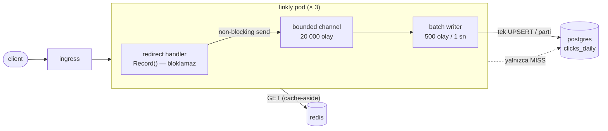

# 05 — async-analytics · "Yazmayı okuma yolundan çıkar"

> **Bu seviyede ne yaşayacaksın?**
> - Tıklama sayacı istek yolundan çıkınca sıcak satır kilidinin kalkması (P02-08 kapanır)
> - Pod sert öldürülünce tampondaki tıklamaların kaybolması (P05-01); kuyruk dolunca tıklamaların düşürülmesi — ve beklemenin neden daha kötü olduğu (P05-02)
> - Yazıcının okumayla aynı süreci ve bağlantı havuzunu paylaşması (P05-03); günlük toplamanın ölçeklenip ayrıntının ölçeklenmemesi (P05-04)
> - Kısa `terminationGracePeriodSeconds`'ın boşaltmayı yarıda kesmesi (P05-05); tuzak: 301'in tarayıcıda sayılamayan tıklama üretmesi (P05-06)
>
> **Bu seviye olmasa ne olur?** Popüler bir linkin her tıklaması aynı satırı kilitler ve her redirect bu yazmayı bekler (P02-08).
>
> **Yeni gelen teknolojiler:** Go channel ile sınırlı kuyruk, toplu (batch) yazıcı, `clicks_daily` toplama tablosu, `07 · Analytics` paneli ([her biri tek cümleyle](../README.md#kullanılan-teknolojiler)).

## 1. Bu seviye ne?

Tıklama sayacı redirect'in içinden çıktı. Artık her yönlendirme, sınırlı bir süreç içi kuyruğa bir
olay bırakıp dönüyor; ayrı bir goroutine olayları **toplayıp** toplu olarak `clicks_daily` tablosuna
yazıyor. P02-08'deki sıcak satır kilidi ortadan kalkıyor. Karşılığında bir **teslimat garantisi**
ödüyoruz: bu kuyruk **en fazla bir kez**. Dolu kuyruk tıklama düşürür, sert ölüm tampondakini
kaybeder. Sayaçlar için doğru, faturalama için yanlış — ve bunu açıkça söylüyoruz.

## 2. Mimari



Okuma yolu artık DB'ye **hiç yazmıyor**. Yazıcı geri kalsa bile kullanıcı beklemiyor — bu tasarımın
tek vaadi ve `TestRecordNeverBlocks` onu bir testle sabitliyor.

## 3. Önceki seviyeden çözülenler

| ID | Sorun | Nasıl çözüldü |
|---|---|---|
| P02-08 | Sıcak link → satır kilidi kuyruğu | Yazma istek yolundan çıktı; üstelik **toplanıyor**: aynı koda gelen 1000 tıklama tek satır güncellemesi oluyor. Anahtar ne kadar sıcaksa toplama oranı o kadar iyi — yani eski tasarımın en kötü durumu, yeni tasarımın en iyi durumu. |

Tek madde, ama etkisi büyük: `links.clicks` sütunu emekliye ayrıldı, yerine `clicks_daily`
`(code, day)` toplama tablosu geldi (`migrations/003`).

## 4. Ayağa kaldırma

İlk kez mi? Önce kök README'deki [Sıfırdan başlangıç](../README.md#sıfırdan-başlangıç) — platform bir kez kurulur (`cd platform && make full`).
Bu seviyenin platformdan istediği: **temel yığın (kind, ingress, Prometheus, Grafana) + Chaos Mesh**. `make up` ilk adımda (profil) bunları açar ve kullanılmayanları kapatır; bir bileşen kurulu değilse hangi komutla kurulacağını söyleyip durur.

```bash
make up            # profil → Grafana'yı temizle → build → push → deploy → rollout wait → smoke
code=$(curl -s -XPOST http://lvl05.localtest.me/api/links -H 'Content-Type: application/json' -d '{"url":"https://example.com"}' | jq -r .code); echo "$code"
curl -s -o /dev/null -w '%{http_code} → %{redirect_url}\n' http://lvl05.localtest.me/$code   # 302 → https://example.com
make grafana       # Ladder klasörü, level=lvl05 — giriş: admin / ladder
make load S=mixed  # aynı senaryolar her seviyede: create redirect mixed hot-key burst abuser read-your-writes stairs scan
make repro P=P05-01   # §6'daki bir sorunu otomatik üret → REPRODUCED / NOT-REPRODUCED
make env           # açık ayar/tuzaklar · değiştir: make set E="KEY=değer" · hepsini geri al: make reset (§7)
make down          # seviyeyi kaldır · kümeyi durdurmak için: make -C ../platform stop
```

**Rehber — bu seviyeyi baştan sona, sırayla.** Komut bloklarında açıklama yok; her bloğu olduğu gibi yapıştırabilirsin.

1. Önceki seviye açıksa kapat (aynı anda tek seviye çalışır), bu seviyeyi kur. `make up` Grafana'yı da temizler:
```bash
make -C ../04-redis-cache down
make up
```
2. 04'ün sorunlarını bu seviyede koş. Uzun sürer: 04'ün yedi scripti art arda koşar. Koşarken başka komut çalıştırma:
   aynı pod'lara dokunurlar. `CONFIRM=1`, Redis pod'unu silen P04-01'in de koşmasını sağlar (onaysız `SKIPPED` yazar).
   `BEKLENEN` sütunu burada hep `(açık kalabilir)` der: 05 04'ün önbellek sorunlarını değil tıklama yazımını (P02-08)
   değiştiriyor; `SONUÇ` sütunu 04'ün sorunlarından hangilerinin burada da sürdüğünü gösterir:
```bash
CONFIRM=1 make verify-prev
```
3. §6'daki sorunları sırayla yaşa (P05-01 → P05-06). Her sorunda aynı düzen:
   **Elle** bloklarını sırayla yapıştır (ilk komut `make fresh`: Grafana bu deneye boş başlar) →
   **Terminalde ne görmelisin** ile karşılaştır → **Grafana'da gör** linklerini aç, her madde hangi panelde neyi
   göreceğini söyler. İstersen aynı deneyi `make repro P=…` ile otomatik koş (yıkıcı olanlar `CONFIRM=1` ister):
   ölçer ve hükmünü basar.
4. Bitince açık kalan ayarları geri al ve seviyeyi kapat:
```bash
make reset
make down
```

## 5. API

Her seviyede aynı: [docs/API.md](../docs/API.md).

Bu seviyede yeni: **`GET /api/links/{code}/stats`** → `{"code","clicks","by_day":[…]}`.
Yanıt `X-Stats-Freshness: eventual` başlığı taşır — sayı **bayat olabilir**, kuyruk henüz
boşalmadıysa son saniyelerin tıklamaları görünmez. *Bir API'nin verdiği garantiyi söylemek,
garantinin kendisi kadar önemlidir.*

## 6. Reproduce edilebilir sorunlar

| ID | Sorun | Reproduce | Grafana'da | Çözüm |
|---|---|---|---|---|
| P05-01 | At-most-once: sert ölümde tampon kaybolur | `CONFIRM=1 make repro P=P05-01` | görünmez — kanıt terminalde ↓ | 06 |
| P05-02 | Kuyruk dolunca düşürme (ve sınırsızın daha kötü olması) | `make repro P=P05-02` | [07 · Analytics](http://grafana.localtest.me/d/ladder-analytics?var-level=lvl05&from=now-15m&to=now&refresh=10s) · [02 · App RED](http://grafana.localtest.me/d/ladder-app-red?var-level=lvl05&from=now-15m&to=now&refresh=10s) → "Kuyruk doluluğu (pod'a göre)" | 06 · 07 |
| P05-03 | Yazıcı, okumayla aynı süreç ve havuzu paylaşıyor | `make repro P=P05-03` | [05 · Postgres](http://grafana.localtest.me/d/ladder-postgres?var-level=lvl05&from=now-15m&to=now&refresh=10s) · [02 · App RED](http://grafana.localtest.me/d/ladder-app-red?var-level=lvl05&from=now-15m&to=now&refresh=10s) → "Veritabanı sorguları (türe göre)" | 06 · 07 |
| P05-04 | Toplama ölçeklenir, ayrıntı ölçeklenmez | `make repro P=P05-04` | [05 · Postgres](http://grafana.localtest.me/d/ladder-postgres?var-level=lvl05&from=now-15m&to=now&refresh=10s) · [02 · App RED](http://grafana.localtest.me/d/ladder-app-red?var-level=lvl05&from=now-15m&to=now&refresh=10s) → "Sorgu süresi p99 (türe göre)" | 09 (partition) |
| P05-05 | Kısa grace → drain yarıda kalır | `CONFIRM=1 make repro P=P05-05` | görünmez — kanıt terminalde ↓ | seviye içi |
| P05-06 | **TRAP** 301 → sayılamayan tıklama | `make repro P=P05-06` | görünmez — kanıt terminalde ↓ | seviye içi |

---

### P05-01 · At-most-once: sert ölümde tampondaki tıklamalar kaybolur

**Belirti:** Pod `--force` ile öldürüldüğünde son saniyelerin tıklamaları hiç yazılmaz. Graceful
kapanışta (rollout) kayıp olmaz.
**Neden:** Kuyruk **süreç belleğinde**. Graceful kapanışta `Stop()` kuyruğu boşaltır; SIGKILL'de
boşaltacak kimse kalmaz. [Topic · Konu: Teslimat garantisi, dayanıklılık]

**Reproduce (adım adım):**

Otomatik — ölçer ve hüküm basar: `CONFIRM=1 make repro P=P05-01` (flush aralığını 15 sn'ye açar ki tampon görünür
olsun, bir linke 400 tıklama üretir ve pod'ları `--force` ile öldürür; aynı senaryoyu `rollout restart` ile tekrarlar
ve iki kaybı karşılaştırır. Hüküm: sert ölümde kayıp %10'un üstünde — altı "uçuştaki istek", üstü "tampon kaybı").

Elle — `05-async-analytics` klasöründe, sırayla yapıştır:

1. Grafana'yı temizle, tamponu görünür yap: flush aralığı 15 sn, parti 5000 (erken flush olmasın). Pod'lar yeniden
   başlar; eski pod'lar birkaç saniye daha cevap verebildiği için 10 sn bekle:
```bash
make fresh
make set E="ANALYTICS_FLUSH_INTERVAL=15s ANALYTICS_BATCH_SIZE=5000"
sleep 10
```
2. **Yıkıcı adım:** bir link oluştur, 400 kez aç ve kuyruk boşalmadan bütün uygulama pod'larını **sert** öldür
   (`--force`: graceful kapanış yok; yeni pod'lar gelene kadar birkaç saniyelik kesinti). Yeni pod'lar hazır olunca
   sayaca bak:
```bash
code=$(curl -s -XPOST http://lvl05.localtest.me/api/links -H 'Content-Type: application/json' -d '{"url":"https://example.com/atmostonce"}' | jq -r .code); echo "kod: $code"
for i in $(seq 1 400); do curl -s -o /dev/null http://lvl05.localtest.me/$code; done
kubectl -n lvl05 delete pod -l app.kubernetes.io/name=linkly --force --grace-period=0
sleep 5
kubectl -n lvl05 wait --for=condition=Ready pod -l app.kubernetes.io/name=linkly --timeout=90s
sleep 6
curl -s http://lvl05.localtest.me/api/links/$code/stats | jq .clicks
```
3. Karşılaştırma: aynı senaryo graceful kapanışla (`rollout restart`: her pod önce kuyruğunu boşaltır, sonra çıkar):
```bash
code2=$(curl -s -XPOST http://lvl05.localtest.me/api/links -H 'Content-Type: application/json' -d '{"url":"https://example.com/graceful"}' | jq -r .code); echo "kod: $code2"
for i in $(seq 1 400); do curl -s -o /dev/null http://lvl05.localtest.me/$code2; done
kubectl -n lvl05 rollout restart deploy/linkly
kubectl -n lvl05 rollout status deploy/linkly --timeout=180s
sleep 8
curl -s http://lvl05.localtest.me/api/links/$code2/stats | jq .clicks
```
4. Ayarları geri al:
```bash
make reset
```

**Terminalde ne görmelisin:** 2. adımın sonunda 400'ün belirgin biçimde altında bir sayı (scriptin hükmü: kayıp
%10'dan fazla) ve bir dakika sonra tekrar sorsan da yükselmez: son flush'tan sonraki tıklamalar öldürülen pod'ların
belleğindeydi. 3. adımın sonunda `400` ya da ona çok yakın: kapanan her pod kuyruğunu yazıp çıktı. Drain planlı
kapanışı kurtarır, plansız ölümü kurtaramaz.

**Ölçüm notu:** Kaybedebileceğin şey, o an **tamponda olandır**. Varsayılan `ANALYTICS_FLUSH_INTERVAL=1s`
ile tampon en fazla 1 saniyelik tıklama tutar; yavaş üreten bir döngüyle öldürdüğünde tamponu çoğu
zaman boş yakalarsın ve deney "kayıp yok" der. Bu, tasarımın güvenli olduğunu değil **ölçümün şanslı**
olduğunu gösterir. Pencereyi bilerek açmak, olayı görünür kılmanın meşru yoludur — yeter ki neyi
değiştirdiğini söyleyesin.

**Grafana'da gör:** Grafana'da görünmez — kaybolan tıklamalar öldürülen pod'un belleğindeydi ve o pod'un sayaçları da onunla birlikte öldü: son kazımadan sonraki artışlar Prometheus'a hiç ulaşmaz. Tamponun kendisi de hiçbir panelde yok: `07 · Analytics` → "Kuyrukta bekleyen" yalnızca kanalda bekleyeni sayar, yazıcının topladığı ama henüz yazmadığı parti orada görünmez. Script tıklamaları k6 ile değil `curl` ile ürettiği için "Kaybolan tıklamalar: k6'nın gönderdiği − veritabanına yazılan" paneli de bu deneyi saymaz. Gerçeğin tek kaynağı DB. Kanıt terminalde:
- `CONFIRM=1 make repro P=P05-01` → `sert ölüm: 400 tıklama üretildi, kaydedilen … → KAYIP …` satırında büyük bir kayıp, `graceful: … → KAYIP …` satırında sıfır ya da sıfıra çok yakın
- `curl -s http://lvl05.localtest.me/api/links/<kod>/stats | jq .clicks` (kodu script çıktısından ya da kendi oluşturduğun linkten al) → sert ölümden sonra gönderdiğin tıklama sayısının altında kalır ve bir daha yükselmez

**Nerede çözülüyor:** 06 — olay süreç belleğinden çıkıp **dayanıklı bir loga** yazılacak
(en az bir kez) ve tüketici idempotent olacak. Orada yeni sorun **çift sayma** olacak:
*garanti seçmek, sorun seçmektir.*

---

### P05-02 · Kuyruk dolunca düşürme — ve alternatifinin neden daha kötü olduğu

**Belirti:** Yazıcı yavaşladığında `analytics_events_total{result="dropped"}` tırmanır. Redirect
gecikmesi **etkilenmez**.
**Neden:** Sınırlı kuyruk dolduğunda `Record()` düşürür ve sayar. Bu kasıtlı: bloklayan bir gönderim
redirect'i yine DB'ye bağlardı — görünmez biçimde, yalnızca yük altında.
[Topic · Konu: Back pressure, bounded queue]

**Reproduce (adım adım):**

Otomatik — ölçer ve hüküm basar: `make repro P=P05-02` (kuyruğu 500'e küçültür, **önce ısıtır**, sonra Postgres'e 2 sn
gecikme enjekte eder ve 80 kullanıcıyla 45 sn tek linke yük verir; düşürülen tıklamaları, tepe kuyruk derinliğini ve
redirect p99'unu basar. Hüküm: düşürülen > 0).

Elle — sırayla yapıştır:

1. Grafana'yı temizle, kuyruğu 500'e küçült (pod'lar yeniden başlar) ve gecikme yokken ısıt:
```bash
make fresh
make set E="ANALYTICS_QUEUE_SIZE=500"
make load S=hot-key K6_ARGS="--vus 20 --duration 20s"
```
2. Postgres'e giden trafiğe 2 sn gecikme enjekte et (yazıcı yetişemeyecek), sonra yoğun tıklama yükü ver. `SEED=1`:
   gecikme altında her link oluşturma 2 sn sürdüğü için k6 kurulumda tek link oluştursun; `HOT_SHARE=1`: bütün
   tıklamalar o linke. Sonra düşürülen ve kuyruğa alınan tıklamaları, tepe kuyruk derinliğini (üç pod'un toplamı) ve
   redirect p99'unu (ms) oku:
```bash
make chaos C=pg-delay-2s
SEED=1 HOT_SHARE=1 make load S=hot-key K6_ARGS="--vus 80 --duration 45s"
sleep 10
curl -s 'http://prometheus.localtest.me/api/v1/query' --data-urlencode 'query=sum(increase(analytics_events_total{namespace="lvl05",result="dropped"}[5m]))' | jq -r '.data.result[0].value[1]'
curl -s 'http://prometheus.localtest.me/api/v1/query' --data-urlencode 'query=sum(increase(analytics_events_total{namespace="lvl05",result="enqueued"}[5m]))' | jq -r '.data.result[0].value[1]'
curl -s 'http://prometheus.localtest.me/api/v1/query' --data-urlencode 'query=max_over_time(sum(analytics_queue_depth{namespace="lvl05"})[5m:15s])' | jq -r '.data.result[0].value[1]'
curl -s 'http://prometheus.localtest.me/api/v1/query' --data-urlencode 'query=1000 * histogram_quantile(0.99, sum(rate(http_request_duration_seconds_bucket{namespace="lvl05",route="/{code}"}[2m])) by (le))' | jq -r '.data.result[0].value[1]'
```
3. Gecikmeyi kaldır, kuyruk boyunu geri al:
```bash
make unchaos C=pg-delay-2s
make reset
```
4. İstersen alternatifi gör: aynı kuyruk ayarıyla kuyruğu sınırsız yap (`TRAP_UNBOUNDED_QUEUE=true`; pod'lar yeniden
   başlar), aynı gecikme ve yükle. Düşürme yerine bekleyen tıklamalar pod belleğinde birikir; sınırsız bir kuyruğun sonu OOMKilled'dir ve o
   an tampondaki her şey gider. Düşürme hızına, kuyruk derinliğine ve pod belleğine bak, sonra gecikmeyi ve ayarları
   geri al:
```bash
make set E="ANALYTICS_QUEUE_SIZE=500 TRAP_UNBOUNDED_QUEUE=true"
make chaos C=pg-delay-2s
SEED=1 HOT_SHARE=1 make load S=hot-key K6_ARGS="--vus 80 --duration 45s"
sleep 10
curl -s 'http://prometheus.localtest.me/api/v1/query' --data-urlencode 'query=sum(rate(analytics_events_total{namespace="lvl05",result="dropped"}[30s]))' | jq -r '.data.result[0].value[1]'
curl -s 'http://prometheus.localtest.me/api/v1/query' --data-urlencode 'query=max_over_time(max(analytics_queue_depth{namespace="lvl05"})[1m:5s])' | jq -r '.data.result[0].value[1]'
kubectl -n lvl05 top pod -l app.kubernetes.io/name=linkly
make unchaos C=pg-delay-2s
make reset
```

**Terminalde ne görmelisin:** 2. adımda k6 çıktısının sonundaki özet satırında `5xx=0`; düşürülen tıklama sıfırdan
büyük, kuyruğa alınan binlerle ölçülür, tepe derinlik kapasiteye dayanır (pod başına 500, toplam en fazla 1500) ve
redirect p99'u düşük kalır: yazıcı boğulurken okuma yolu etkilenmedi — tasarımın vaadi. 4. adımda düşürme hızı `0`
(sınırsız modda düşürme yolu yok) ve pod başına derinlik 500'de durmaz; fazlası pod belleğinde bekliyor
(`kubectl top pod`, sınır 256 MiB).

**Grafana'da gör:** [`07 · Analytics`](http://grafana.localtest.me/d/ladder-analytics?var-level=lvl05&from=now-15m&to=now&refresh=10s), [`02 · App RED`](http://grafana.localtest.me/d/ladder-app-red?var-level=lvl05&from=now-15m&to=now&refresh=10s) ve [`01 · Pods & Resources`](http://grafana.localtest.me/d/ladder-pods?var-level=lvl05&from=now-15m&to=now&refresh=10s) — script önce ısıtır, sonra Postgres'i yavaşlatıp 45 sn yük verir; bitince aç (giriş: admin / ladder)
- "Kuyruk doluluğu (pod'a göre)" → `kapasite` çizgisi deney süresince 20 000'den **500**'e iner (script kuyruğu küçültüyor) ve pod çizgileri ona dayanıp tavanda gezinir: kuyruk dolu. Eksen 20 000'e göre çizildiği için lejantta bir pod'a tıkla — eksen yeniden ölçeklenir.
- "Tıklama olayları (sonuca göre)" → `dropped` serisi belirir ve yük boyunca sürer; `written` yükle birlikte artmaz, yazıcının hızında (her parti ~2 sn) takılı kalır.
- "p99 süre (uç noktaya göre)" (App RED) → `/{code}` çizgisi düşük kalır: yazıcı boğulurken okuma yolu etkilenmedi — tasarımın vaadi. `/api/links` (link oluşturma) ise yükselir: yükün başında oluşturulan link DB'ye 2 sn gecikmeyle yazılıyor.
- "Bellek kullanımı" ve "Bellek: sınırın yüzde kaçı" (Pods) → yalnızca 4. adımda (`TRAP_UNBOUNDED_QUEUE=true`, yazıcı yine yavaşken): düşürme yerine bekleyen tıklamalar bellekte birikir ve yüzde çizgisi yükselir; %100'e değen konteyner öldürülür.
- "Son sonlanma nedeni" (Pods) → 4. adımda konteyner bellek sınırına çarparsa `OOMKilled` (kırmızı): tampondaki her şey gider.

**Ölçüm dersi — deneyin SIRASI da bir değişkendir:** Gecikme yükten önce enjekte edilirse k6'nın
`setup()` aşaması 100 link oluştururken her INSERT 2 sn sürer, setup zaman aşımına uğrar ve yük hiç
koşmaz. Script o zaman "düşürme olmadı" der — ölçtüğü şey kuyruk değil, kendi kurulum sırasıdır; bu
yüzden önce ısıtır, sonra gecikmeyi enjekte eder. Bir deney kurarken *hazırlık* adımlarının da
arızadan etkilendiğini unutma.

**Ders:** *Gördüğün bir düşüş bir karardır; göremediğin bir bloklama, trafiği bekleyen bir
kesintidir.* Sınırsız kuyruk bir emniyet ağı değil, **ertelenmiş bir çöküştür** — "hiç düşürmeyelim"
isteği sonunda her şeyi düşürmekle biter.

---

### P05-03 · Yazıcı, okumayla aynı süreci ve havuzu paylaşıyor

**Belirti:** Tıklamaları veritabanına yazan iş, redirect'i servis eden pod'ların **içinde** koşuyor:
`write_clicks` sorguları uygulama pod'larından, onların bağlantı havuzundan çıkıyor. Yazıcıyı ayrı
ölçekleyemez, ayrı sınırlayamaz, redirect'e dokunmadan yeniden başlatamazsın; yazıcının CPU'su,
bağlantısı ve veritabanı yükü redirect'i servis eden sürecin hesabına yazılır.
**Neden:** Yazma istek yolundan çıktı ama **süreçten** çıkmadı: aynı pod CPU'su, aynı `pgxpool`,
aynı veritabanı. İzolasyon kısmi. [Topic · Konu: Kaynak izolasyonu, bulkhead]

**Reproduce (adım adım):**

Otomatik — ölçer ve hüküm basar: `make repro P=P05-03` (**aynı** yükü — `hot-key`, 80 VU, 45 sn — iki kez, taze
pod'larla verir. Değişen tek şey yazıcının veritabanı işi: A fazında durdurulmuş (`ANALYTICS_FLUSH_INTERVAL=1h`,
`ANALYTICS_BATCH_SIZE=100000000` — tıklamalar yine kuyruğa girip toplanıyor, yalnızca yazılmıyor), B fazında
varsayılan. Hüküm: B'de `write_clicks` uygulama pod'larından çıkıyor mu, A'da sıfırlanıyor mu (A'da yazma sürüyorsa
script hüküm vermez, exit 2). İki fazın redirect p99'unu ve havuz bekleme p99'unu da yan yana basar — bedel, hükme bağlı
değil. Yükü, hazır pod'ların hepsi fazın ayarına geçmeden başlatmaz — rollout sürerken eski ayarla çalışan pod'lar da
hazırdır — ve ölçüyü o fazın ayarıyla çalışan pod'larla sınırlar).

Elle — sırayla yapıştır:

1. Grafana'yı temizle. A fazı: yazıcının veritabanı işini durdur (pod'lar yeniden başlar; eski pod'lar birkaç saniye
   daha cevap verebildiği için 10 sn bekle) ve yükü ver:
```bash
make fresh
make set E="ANALYTICS_FLUSH_INTERVAL=1h ANALYTICS_BATCH_SIZE=100000000"
sleep 10
make load S=hot-key K6_ARGS="--vus 80 --duration 45s"
sleep 12
```
2. A fazının ölçüsü: hangi pod saniyede kaç `write_clicks` sorgusu atıyor, redirect p99 ve havuzdan bağlantı alma
   beklemesinin p99'u (ms):
```bash
curl -s 'http://prometheus.localtest.me/api/v1/query' --data-urlencode 'query=sum by (pod) (rate(db_queries_total{namespace="lvl05",op="write_clicks"}[1m]))' | jq -r '.data.result[] | "\(.metric.pod) \(.value[1])"'
curl -s 'http://prometheus.localtest.me/api/v1/query' --data-urlencode 'query=1000 * histogram_quantile(0.99, sum(rate(http_request_duration_seconds_bucket{namespace="lvl05",route="/{code}"}[1m])) by (le))' | jq -r '.data.result[0].value[1]'
curl -s 'http://prometheus.localtest.me/api/v1/query' --data-urlencode 'query=1000 * histogram_quantile(0.99, sum(rate(db_pool_acquire_duration_seconds_bucket{namespace="lvl05"}[1m])) by (le))' | jq -r '.data.result[0].value[1]'
```
3. B fazı: yazıcıyı varsayılana döndür (`make reset`; pod'lar yeniden başlar), aynı yükü ver:
```bash
make reset
sleep 10
make load S=hot-key K6_ARGS="--vus 80 --duration 45s"
sleep 12
```
4. B fazının ölçüsü, aynı üç sorgu:
```bash
curl -s 'http://prometheus.localtest.me/api/v1/query' --data-urlencode 'query=sum by (pod) (rate(db_queries_total{namespace="lvl05",op="write_clicks"}[1m]))' | jq -r '.data.result[] | "\(.metric.pod) \(.value[1])"'
curl -s 'http://prometheus.localtest.me/api/v1/query' --data-urlencode 'query=1000 * histogram_quantile(0.99, sum(rate(http_request_duration_seconds_bucket{namespace="lvl05",route="/{code}"}[1m])) by (le))' | jq -r '.data.result[0].value[1]'
curl -s 'http://prometheus.localtest.me/api/v1/query' --data-urlencode 'query=1000 * histogram_quantile(0.99, sum(rate(db_pool_acquire_duration_seconds_bucket{namespace="lvl05"}[1m])) by (le))' | jq -r '.data.result[0].value[1]'
```

**Terminalde ne görmelisin:** 2. adımda ilk sorgu ya hiç satır basmaz ya da yalnızca `0` değerli satırlar: yazıcı
durunca uygulama pod'larından yazma çıkmıyor. 4. adımda her satır bir `linkly-…` pod'u ve değeri sıfırdan büyük:
tıklamaları veritabanına yazan sorgular redirect'i servis eden süreçlerden, onların havuzundan çıkıyor. İki fazın
redirect p99'u ve havuz bekleme p99'u birbirine yakın kalabilir: bu ölçekte bedel gürültü mertebesinde; hükmün yapıya
bakmasının sebebi bu.

**Ölçüm dersi — iki değişkenli karşılaştırma:** "Yalnız okuma" tabanını 30 VU `redirect` ile, yoğun
fazı 80 VU `hot-key` ile ölçmek iki fazda hem senaryoyu hem yükü değiştirir; üstelik taban da tıklama
yazar (her redirect bir tıklamadır). p99 artışı yazıcıdan mı, 2.7 kat yükten mi geldi — ayırt
edilemez. Bu yüzden script iki fazda aynı yükü verir ve yalnızca yazıcının veritabanı işini değiştirir.
*Tek değişkeni değiştir ve o değişkenin gerçekten değiştiğini de ölç.*

**Grafana'da gör:** [`05 · Postgres`](http://grafana.localtest.me/d/ladder-postgres?var-level=lvl05&from=now-15m&to=now&refresh=10s) ve [`02 · App RED`](http://grafana.localtest.me/d/ladder-app-red?var-level=lvl05&from=now-15m&to=now&refresh=10s) — script iki fazı (A: yazıcı durdu, B: yazıcı çalışıyor) aynı yükle 45'er sn koşar, fazlar arasında pod'lar yeniden başlar; bitince aç (giriş: admin / ladder)
- "Veritabanı sorguları (türe göre)" → `write_clicks` katmanı A fazında sıfıra iner (panel 1 dk'lık ortalama çizdiği için önceki pod'ların son yazmaları fazın başında sönümlenerek görünür) ve B fazında yeniden belirir: yazıcı açıkken bu sorgular redirect'i servis eden pod'lardan çıkıyor. `get` ve `create` iki fazda da yalnızca fazın başında, k6 yeni linklerini kurup önbelleğe alırken görünür.
- "Uygulama havuzu: bağlantı bekleme (p99)" → iki fazda benzer: fazın başında taze pod'ların havuzu yeni bağlantı açarken kısa bir tepe olabilir, sonra düşük ve düz (A'da havuza neredeyse hiç istek uğramadığı için çizgi kesilebilir). Bu panel her bağlantı alımının gerçek beklemesini ölçer (P02-06) ve söylediği şu: yazıcı pod başına tek bağlantı tutuyor, okumalar Redis'ten dönüyor — havuz paylaşılıyor ama bu ölçekte dar boğaz değil. Paylaşımın bedeli havuz beklemesinde değil, süreç ve veritabanında.
- "p99 süre (uç noktaya göre)" (App RED) → `/{code}` çizgisi iki fazda yakın kalabilir; fark varsa yazıcının aynı süreçteki bedelidir ve script iki p99'u yan yana basar. Bu ölçekte küçük bir fark gürültüden ayırt edilemez — hükmün p99'a değil yapıya bakmasının sebebi bu.
- Explore'da: `sum by (pod) (rate(db_queries_total{namespace="lvl05",op="write_clicks"}[1m]))` → B fazında her seri bir **uygulama** pod'u (`linkly-…`): yazma sorgularını redirect'i servis eden süreçler atıyor. 06'da yazıcı ayrı bir deployment olunca bu seriler uygulama pod'larından kalkar.

**Nerede çözülüyor:** 06 + 07 — tüketici ayrı bir **süreç** ve ayrı bir deployment olacak: kendi
havuzu, kendi CPU limiti, kendi ölçeklenmesi. *İzolasyon bir arayüz meselesi değil, bir süreç meselesidir.*

---

### P05-04 · Toplama ölçeklenir, ayrıntı ölçeklenmez

**Belirti:** `clicks_daily` 2 milyon tıklamayı tek satırda tutar ve `stats` anında döner. Ayrıntı
tablosu kursaydık aynı cevap için 2 milyon satır taranırdı.
**Neden:** Toplama, veriyi **yazarken** küçültür; ayrıntı **okurken** büyür.
[Topic · Konu: Toplama vs ayrıntı, yazma amplifikasyonu]

**Reproduce (adım adım):**

Otomatik — ölçer ve hüküm basar: `make repro P=P05-04` (bir linke 200 tıklama üretip `stats`'ın süresini ölçer; geçici bir
`clicks_detail` tablosu kurup aynı koda 2 M satır üretir, iki sorgunun planını ve süresini karşılaştırır, sonra tabloyu
düşürür. Hüküm: ayrıntı tablosunun planı tam tarama).

Elle — sırayla yapıştır:

1. Grafana'yı temizle, Postgres pod'unu bul; bir linke 200 tıklama üret, toplama tablosundan `stats`'ın süresini ve
   `clicks_daily`'nin satır sayısını oku:
```bash
make fresh
pgpod=$(kubectl -n lvl05 get pod -l app.kubernetes.io/name=postgres -o json | jq -r '[.items[] | select(.metadata.deletionTimestamp == null) | select(any(.status.containerStatuses[]?; .ready)) | .metadata.name][0]'); echo "postgres pod: $pgpod"
code=$(curl -s -XPOST http://lvl05.localtest.me/api/links -H 'Content-Type: application/json' -d '{"url":"https://example.com/stats-scale"}' | jq -r .code); echo "kod: $code"
for i in $(seq 1 200); do curl -s -o /dev/null http://lvl05.localtest.me/$code; done
sleep 4
curl -s -o /dev/null -w 'stats süresi: %{time_total} sn\n' http://lvl05.localtest.me/api/links/$code/stats
kubectl -n lvl05 exec "$pgpod" -c postgres -- psql -U linkly -d linkly -tAc 'SELECT count(*) FROM clicks_daily'
```
2. Karşı senaryo — ayrıntı tablosu kursaydık: aynı koda 2 milyon satırlık geçici bir `clicks_detail` tablosu kur
   (Postgres'i birkaç saniye meşgul eder):
```bash
kubectl -n lvl05 exec "$pgpod" -c postgres -- psql -U linkly -d linkly -c 'CREATE TABLE IF NOT EXISTS clicks_detail (id bigserial, code text, at timestamptz)'
kubectl -n lvl05 exec "$pgpod" -c postgres -- psql -U linkly -d linkly -c "INSERT INTO clicks_detail (code, at) SELECT '$code', now() - (i || ' seconds')::interval FROM generate_series(1, 2000000) i"
kubectl -n lvl05 exec "$pgpod" -c postgres -- psql -U linkly -d linkly -c 'ANALYZE clicks_detail'
```
3. Aynı soruyu ("bu kod kaç kez tıklandı?") iki tabloya sor; planları ve süreleri karşılaştır:
```bash
kubectl -n lvl05 exec "$pgpod" -c postgres -- psql -U linkly -d linkly -c "EXPLAIN ANALYZE SELECT count(*) FROM clicks_detail WHERE code='$code'"
kubectl -n lvl05 exec "$pgpod" -c postgres -- psql -U linkly -d linkly -c "EXPLAIN ANALYZE SELECT sum(count) FROM clicks_daily WHERE code='$code'"
```
4. Geçici tabloyu düşür:
```bash
kubectl -n lvl05 exec "$pgpod" -c postgres -- psql -U linkly -d linkly -c 'DROP TABLE clicks_detail'
```

**Terminalde ne görmelisin:** 1. adımda `stats süresi` milisaniyeler mertebesinde ve `clicks_daily` birkaç satır: kaç
tıklama olursa olsun kod başına gün başına tek satır. 2. adımda `INSERT 0 2000000`. 3. adımda `clicks_detail` planı
`Seq Scan` (çoğunlukla `Parallel Seq Scan`) ile 2 milyon satırı tarar; `clicks_daily` planı birkaç satır okur ve
`Execution Time`'ı kat kat kısadır. Toplama veriyi yazarken küçültür, ayrıntı okurken büyür. 4. adımda `DROP TABLE`.

**Grafana'da gör:** [`05 · Postgres`](http://grafana.localtest.me/d/ladder-postgres?var-level=lvl05&from=now-15m&to=now&refresh=10s), [`02 · App RED`](http://grafana.localtest.me/d/ladder-app-red?var-level=lvl05&from=now-15m&to=now&refresh=10s) ve [`07 · Analytics`](http://grafana.localtest.me/d/ladder-analytics?var-level=lvl05&from=now-15m&to=now&refresh=10s) — script bitince aç; asıl karşılaştırma terminalde, çünkü `clicks_detail`'i uygulama değil script (`psql`) sorguluyor ve hiçbir uygulama paneli o sorguyu görmez (giriş: admin / ladder)
- "Sorgu süresi p99 (türe göre)" → `stats` serisi düşük: kaç tıklama olursa olsun toplama tablosu kod başına gün başına tek satır okur. Script `stats`'ı yalnızca bir kez çağırdığı için değer bir dakika kadar görünür.
- "İstatistik ucu süresi (p99)" (Analytics) → scriptin tek `stats` çağrısı: düşük, bir dakika kadar görünür. Panel `route="/api/links/{code}/stats"` serisini okur; uygulama `stats` isteğine `/api/links/{code}`'dan ayrı kendi etiketini verir (`internal/httpapi/server.go · routeOf`). İki ucu tek etikette birleştirmek birini gizler, ikisinin gecikmesini de karıştırır.
- "p99 süre (uç noktaya göre)" (App RED) → aynı çağrı `/api/links/{code}/stats` çizgisi olarak görünür: düşük.
- "Veritabanı CPU" → deneyin ortasında postgres pod'unda belirgin bir tepe: 2 M satırlık `clicks_detail`'i üretmek ve taramak. Ayrıntının bedeli yazarken de ödenir.
- Terminalde, script çıktısındaki iki plan: `clicks_detail` için `Seq Scan` (çoğunlukla `Parallel Seq Scan`) 2 M satırı tarar; `clicks_daily` planı tek satır okur ve kat kat kısa sürer.

**Nerede çözülüyor:** Ayrıntı gerçekten gerekiyorsa 09 (RANGE partition by day + eski partition'ları
düşürme). **Ama asıl karar ürün kararıdır:** ayrıntıyı ancak birileri cevapladığı soruyu
adlandırabiliyorsa sakla. Ama iki yön simetrik değil: ayrıntıdan toplam her zaman sonradan türetilir,
yalnızca toplam yazılmışsa kaybolan ayrıntı geri gelmez — ayrıntıyı sonradan eklemek, toplamayı
sonradan eklemekten pahalıdır (veri zaten yazılmıştır).

---

### P05-05 · Kısa `terminationGracePeriodSeconds` → drain yarıda kalır

**Belirti:** Grace süresi kısaltıldığında rollout başına kaybedilen tıklama sayısı artar.
**Neden:** Drain kodu doğru olabilir; kubelet süreci bitirmesine izin vermezse hiçbir anlamı yok.
[Topic · Konu: Kapatma bütçesi]

**Reproduce (adım adım):**

Otomatik — ölçer ve hüküm basar: `CONFIRM=1 make repro P=P05-05` (flush aralığını 15 sn'ye açar; mevcut ayarla — grace
60 sn, preStop 5 sn, `SHUTDOWN_GRACE=20s` — ve `grace=3s` (+`preStop=1s`) ile birer linke 2000 tıklama üretip
`rollout restart` sonrası kaybı ölçer; sayım durulana kadar bekler, sonunda ayarları geri alır. Hüküm: kısa grace'te
kayıp daha büyük).

Elle — sırayla yapıştır:

1. Grafana'yı temizle, tamponu görünür yap: flush aralığı 15 sn, parti 5000 (P05-01 ile aynı sebep: varsayılan 1 sn'lik
   tampon neredeyse hep boş yakalanır). Pod'lar yeniden başlar; 10 sn bekle:
```bash
make fresh
make set E="ANALYTICS_FLUSH_INTERVAL=15s ANALYTICS_BATCH_SIZE=5000"
sleep 10
```
2. Mevcut ayarla (drain'e zaman var): bir linke 2000 tıklama üret (20 paralel), pod'ları yeniden başlat, sonra sayacı
   5 sn arayla 8 kez oku — sayı durulunca kaybı gör:
```bash
code=$(curl -s -XPOST http://lvl05.localtest.me/api/links -H 'Content-Type: application/json' -d '{"url":"https://example.com/grace/ok"}' | jq -r .code); echo "kod: $code"
seq 1 2000 | xargs -P 20 -I{} curl -s -o /dev/null --max-time 5 http://lvl05.localtest.me/$code
kubectl -n lvl05 rollout restart deploy/linkly
kubectl -n lvl05 rollout status deploy/linkly --timeout=200s
for i in $(seq 1 8); do curl -s http://lvl05.localtest.me/api/links/$code/stats | jq .clicks; sleep 5; done
```
3. **Riskli adım:** grace'i 3 sn'ye, preStop beklemesini 1 sn'ye indir — ikisi tek patch'te, çünkü Kubernetes preStop
   beklemesinin grace'ten kısa olmasını nesnenin son hâlinde doğrular ve ayrı patch'lerin ara hâlini reddeder.
   `SHUTDOWN_GRACE` hâlâ 20 sn: kubelet süreci drain'in ortasında öldürecek. Sonra aynı ölçümü tekrarla:
```bash
kubectl -n lvl05 patch deploy/linkly --type=json -p '[{"op":"replace","path":"/spec/template/spec/terminationGracePeriodSeconds","value":3},{"op":"replace","path":"/spec/template/spec/containers/0/lifecycle/preStop/sleep/seconds","value":1}]'
kubectl -n lvl05 rollout status deploy/linkly --timeout=200s
code2=$(curl -s -XPOST http://lvl05.localtest.me/api/links -H 'Content-Type: application/json' -d '{"url":"https://example.com/grace/short"}' | jq -r .code); echo "kod: $code2"
seq 1 2000 | xargs -P 20 -I{} curl -s -o /dev/null --max-time 5 http://lvl05.localtest.me/$code2
kubectl -n lvl05 rollout restart deploy/linkly
kubectl -n lvl05 rollout status deploy/linkly --timeout=200s
for i in $(seq 1 8); do curl -s http://lvl05.localtest.me/api/links/$code2/stats | jq .clicks; sleep 5; done
```
4. Geri al: grace 60 sn ve preStop 5 sn (deploy/'daki değerler, yine tek patch), sonra ortamı:
```bash
kubectl -n lvl05 patch deploy/linkly --type=json -p '[{"op":"replace","path":"/spec/template/spec/terminationGracePeriodSeconds","value":60},{"op":"replace","path":"/spec/template/spec/containers/0/lifecycle/preStop/sleep/seconds","value":5}]'
kubectl -n lvl05 rollout status deploy/linkly --timeout=200s
make reset
```

**Terminalde ne görmelisin:** 2. adımda sayı `2000`'de ya da ona çok yakın bir yerde durulur: kapanan her pod kuyruğunu
yazıp çıktı. 3. adımda `2000`'in belirgin biçimde altında durulur ve bir daha yükselmez: kubelet, `SHUTDOWN_GRACE`
beklenirken süreci SIGKILL ile bitirdi, drain hiç başlamadı. Aynı kod, aynı drain mantığı, farklı YAML → farklı veri kaybı.

**Grafana'da gör:** Grafana'da görünmez — drain sunucu kapandıktan **sonra** çalışır (doğru sıra, bkz. §10), yani drain'in yazdığı `written` artışları `/metrics` ucu çoktan kapanmışken sayılır ve Prometheus'a hiç ulaşmaz; SIGKILL'le kesilen drain'in eksiği de aynı yüzden görünmez. `01 · Pods & Resources` → "Son sonlanma nedeni" de bu deneyden bir şey göstermez: rollout eski pod'ları yeniden başlatmaz, siler — o panel yalnızca aynı pod içinde yeniden başlayan konteynerleri gösterir. Kanıt terminalde:
- `CONFIRM=1 make repro P=P05-05` → iki `kayıp: … tıklama` satırı; `grace=3s` fazındaki mevcut ayardakinden büyük
- `kubectl -n lvl05 logs -f -l app.kubernetes.io/name=linkly --prefix` (ikinci terminalde, script bir fazın tıklamalarını üretirken başlat) → mevcut ayarda kapanan her pod'un akışı `analitik kuyruğu boşaltılıyor` ve `temiz kapandı` ile biter; `grace=3s` fazında akış `readiness düşürüldü, endpoint yayılımı bekleniyor` satırında kesilir — drain hiç başlamadı

**Kural:** `terminationGracePeriodSeconds` > (preStop beklemesi + `SHUTDOWN_GRACE` + drain süresi).
Bu üç sayı birbirini tanımıyorsa, hangisinin kazandığını kubelet'in SIGKILL'i belirler.
*"Kod doğru" ile "sistem doğru" aynı şey değildir — aradaki fark bir YAML satırı.*

---

### P05-06 · TRAP · 301 tarayıcı önbelleği, sayılamayan tıklama üretir

**Belirti:** Tarayıcıda aynı linki beş kez açıyorsun, `stats` bir tıklama gösteriyor.
**Neden:** 301 kalıcı yönlendirmedir; tarayıcı sonraki istekleri **sunucuya hiç göndermez**.
01'de bu hatayı "önbellek kontrolü sende değil" diye çözmüştük (P00-10) — **aynı hata, farklı
seviyede farklı zarar**: artık tıklamaları ciddi ciddi sayıyoruz ve sayamıyoruz.
[Topic · Konu: HTTP önbellekleme, ölçüm bütünlüğü]

**Reproduce (adım adım):**

Otomatik — ölçer ve hüküm basar: `make repro P=P05-06` (302 modunda aynı istemciden 50 tıklamanın sayıldığını ölçer,
sonra tuzağı açar, art arda üç 301 görene kadar bekler — kapanmakta olan eski pod birkaç saniye daha 302 döner — ve
iki moddaki durum kodunu ve `Cache-Control` başlığını karşılaştırır; tarayıcı adımını — asıl ikna edici olanı — sana
bırakır).

Elle — sırayla yapıştır:

1. Grafana'yı temizle. Varsayılan modda (302 + `no-store`) bir linke curl ile 50 kez git — curl önbellek tutmaz,
   sunucu hepsini görür —, sonra sayaca ve yönlendirme başlıklarına bak:
```bash
make fresh
code=$(curl -s -XPOST http://lvl05.localtest.me/api/links -H 'Content-Type: application/json' -d '{"url":"https://example.com/counted"}' | jq -r .code); echo "kod: $code"
for i in $(seq 1 50); do curl -s -o /dev/null http://lvl05.localtest.me/$code; done
sleep 5
curl -s http://lvl05.localtest.me/api/links/$code/stats | jq .clicks
curl -sI http://lvl05.localtest.me/$code | grep -iE '^(HTTP|cache-control)'
```
2. Tuzağı aç (302 yerine 301; pod'lar yeniden başlar, eski pod'lar birkaç saniye daha 302 verebildiği için 10 sn bekle),
   yeni bir linkin başlıklarına bak:
```bash
make set E="TRAP_REDIRECT_301=true"
sleep 10
code2=$(curl -s -XPOST http://lvl05.localtest.me/api/links -H 'Content-Type: application/json' -d '{"url":"https://example.com/uncounted"}' | jq -r .code); echo "kod: $code2"
curl -sI http://lvl05.localtest.me/$code2 | grep -iE '^(HTTP|cache-control)'
```
3. Asıl ikna edici olan, tarayıcı: üçüncü bir linki varsayılan tarayıcında 5 kez aç (macOS'ta `open` her seferinde yeni
   bir sekme açar; Chrome'da DevTools → Network ile izleyebilirsin), sonra sayaca bak:
```bash
code3=$(curl -s -XPOST http://lvl05.localtest.me/api/links -H 'Content-Type: application/json' -d '{"url":"https://example.com/browser"}' | jq -r .code); echo "kod: $code3"
for i in 1 2 3 4 5; do open "http://lvl05.localtest.me/$code3"; sleep 2; done
sleep 5
curl -s http://lvl05.localtest.me/api/links/$code3/stats | jq .clicks
```
4. Tuzağı kapat:
```bash
make reset
```

**Terminalde ne görmelisin:** 1. adımda `50`, `HTTP/1.1 302 Found` ve `Cache-Control: no-store, max-age=0`. 2. adımda
`HTTP/1.1 301 Moved Permanently` ve `Cache-Control` satırı yok: saklamayı yasaklayan bir şey yok, tarayıcı 301'i
önbelleğe alır (hâlâ `302` görürsen birkaç saniye sonra son komutu tekrarla). 3. adımda `1`: yalnızca ilk açılış
sunucuya ulaştı, kalan dördünü tarayıcı kendi önbelleğinden açtı (DevTools'ta `(disk cache)`). 3. adım için ayrı bir
link kullanılıyor, çünkü 2. adımdaki `curl -sI` de bir tıklama sayılır.

**Grafana'da gör:** Grafana'da görünmez — sunucuya hiç ulaşmayan bir istek hiçbir sunucu metriğine yazılamaz. `03 · App Business` → "Başarılı yönlendirme / sn" tarayıcının kendi önbelleğinden açtığı tıklamaları saymaz, ama saymadığını da gösteremez: eksik olan bir çizgi değil, hiç gelmemiş bir istektir. (Script'in `curl` istekleri önbellek tutmadığı için orada hepsi sayılır.) Kanıt terminalde ve tarayıcıda:
- `curl -sI http://lvl05.localtest.me/<kod>` → tuzak kapalıyken `302` ve `Cache-Control: no-store, max-age=0`; `TRAP_REDIRECT_301=true` iken `301` ve saklamayı yasaklayan bir `Cache-Control` yok
- Chrome'da linki 5 kez aç, DevTools → Network: 2.–5. açılışlar `(disk cache)`; sonra `curl -s http://lvl05.localtest.me/api/links/<kod>/stats | jq .clicks` → `1`

**Zarar zinciri:** 301 → tarayıcı önbelleği → sunucuya ulaşmayan istek → sayılamayan tıklama →
yanlış analitik → yanlış iş kararı. *Düzeltilmiş bir hatanın geri gelmesi, ilk hâlinden pahalıya patlar.*

## 7. Seviye içi alıştırmalar (TRAP_ bayrakları)

> **Nasıl uygulanır:** aç `make set E="TRAP_X=true"` · ne açık? `make env` · hepsini geri al `make reset` (ortamı `deploy/`'daki hâline döndürür; `make unset E=TRAP_X` yalnızca siler). Tablodaki diğer ayarlar da aynı yolla (`make set E="CACHE_TTL=1h"`). Pod'lar yeni değerle yeniden başlar; komut hazır olunca döner. Varsayılan olarak seviyenin TÜM uygulama servislerine uygulanır (tek servis: `W=redirect`); 12'den itibaren Argo Rollout'larda da çalışır — `kubectl set env` orada çalışmaz. `make repro` scriptleri tuzağı KENDİLERİ açıp kapatır ve bitince ortamı eski hâline getirir (senin açtıkların dahil): elle alıştırma için `make set` + `make load`, otomatik ölçüm için `make repro`. Bitirince `make reset`: açık kalan bir tuzak sonraki deneyi sessizce bozar.

| Bayrak | Ne yapar | Reproduce | Düzeltme |
|---|---|---|---|
| `TRAP_UNBOUNDED_QUEUE` | Kuyruğu sınırsız yapar (düşürme yerine büyüme) | `make repro P=P05-02` | Bayrağı kapat |
| `TRAP_REDIRECT_301` | 302 yerine 301 döner | `make repro P=P05-06` | Bayrağı kapat |
| `TRAP_DEBUG_KEYS` · `TRAP_NO_TTL_JITTER` · `TRAP_UPDATE_DELAY_MS` | (04'ten devam) | 04'te | — |

Elle denemeye değer:
- `ANALYTICS_FLUSH_INTERVAL=30s` yap: stats tazeliği 30 saniyeye çıkar. **Tazelik ile yazma yükü
  arasındaki düğme budur** — ve bu düğmeyi çevirmek bir ürün kararıdır, bir ayar değil.
- `ANALYTICS_BATCH_SIZE=1` yap: toplama kapanır, `write_clicks` sorgu sayısı tıklama sayısına eşitlenir.
  02'nin davranışına geri dönersin — ama en azından okuma yolunun dışında.
- `make load S=hot-key` ile `make load S=redirect` altında `analytics_batch_size` histogramını
  karşılaştır: sıcak anahtar toplamanın en iyi çalıştığı durumdur.

## 8. Gözlemlenebilirlik: hangi paneller dolu, hangileri boş

| Dashboard | Durum | Neden |
|---|---|---|
| [`07 · Analytics`](http://grafana.localtest.me/d/ladder-analytics?var-level=lvl05&from=now-15m&to=now) | **Dolu** ✨ | enqueued/dropped/written, kuyruk derinliği, batch süresi/boyutu, `stats` ucu süresi (kendi route etiketiyle: `/api/links/{code}/stats`) |
| [`05 · Postgres`](http://grafana.localtest.me/d/ladder-postgres?var-level=lvl05&from=now-15m&to=now) | Dolu | `op=write_clicks` ve `op=stats` yeni; `increment_clicks` **kayboldu** |
| [`04 · Cache`](http://grafana.localtest.me/d/ladder-cache?var-level=lvl05&from=now-15m&to=now) · [`06 · Redis`](http://grafana.localtest.me/d/ladder-redis?var-level=lvl05&from=now-15m&to=now) · [`02 · App RED`](http://grafana.localtest.me/d/ladder-app-red?var-level=lvl05&from=now-15m&to=now) · [`03 · App Business`](http://grafana.localtest.me/d/ladder-app-business?var-level=lvl05&from=now-15m&to=now) | Dolu | — |
| [`08 · Stream`](http://grafana.localtest.me/d/ladder-stream?var-level=lvl05&from=now-15m&to=now) · [`09 · Autoscaling`](http://grafana.localtest.me/d/ladder-autoscaling?var-level=lvl05&from=now-15m&to=now) | Boş | — |
| [`11 · Resilience`](http://grafana.localtest.me/d/ladder-resilience?var-level=lvl05&from=now-15m&to=now) · [`12 · SLO`](http://grafana.localtest.me/d/ladder-slo?var-level=lvl05&from=now-15m&to=now) · [`13 · Rollout`](http://grafana.localtest.me/d/ladder-rollout?var-level=lvl05&from=now-15m&to=now) | Boş | — |

En öğretici panel: **"k6 tıklama − DB tıklama" farkı**. İdeal durumda sıfır olmalı; sıfır değilse
ya düşürme olmuştur (P05-02) ya kayıp (P05-01) ya da kuyruk henüz boşalmamıştır. Üçünü ayırt etmek
için "Atılan / sn" ve "Kuyrukta bekleyen" panellerine birlikte bakılır.

## 9. Bilerek bırakılanlar

- **At-most-once teslimat** — sert ölümde kayıp (P05-01 → 06).
- **Kuyruk süreç belleğinde**, pod başına (P05-01, P05-03 → 06/07).
- **Tüketici ayrı süreç değil**: aynı CPU, aynı havuz, aynı DB (P05-03 → 07).
- **Ayrıntı tablosu yok**, yalnızca günlük toplam (P05-04 → 09 gerekirse).
- **`WriteClicks` idempotent değil**: yeniden deneme çift sayar. 05'te yeniden deneme yok, o yüzden
  sorun çıkmıyor; 06'da en-az-bir-kez gelince bu bir sorun **olacak** ve orada çözülecek.
- **Stats önbelleklenmiyor** ve kiracı kontrolü yok — `/stats` herkese açık (13).
- **04'ten devreden her şey**: tek Redis, tek Postgres, düz metin sırlar, süreç içi hız limiti.

## 10. `make diff-prev` okuma rehberi

`make diff-prev` 04 ile farkı gösterir:

1. **`internal/analytics/analytics.go`** (yeni): `Record()`'un `select`/`default` bloğu bu seviyenin
   tamamı. Üç satır: gönderebilirsen gönder, gönderemezsen **düşür ve say**. Bloklamayan gönderim
   ile bloklayan gönderim arasındaki fark, kodda bir `default:` satırı; üretimde bir kesinti.
2. **`internal/httpapi/handlers.go`**: `IncrementClicks(ctx, code)` → `a.clicks.Record(code)`.
   Bir DB çağrısı bir kanal gönderimine dönüştü; `ctx` bile gerekmiyor çünkü beklemiyor.
3. **`internal/store/migrations/003_clicks.sql`**: `clicks_daily(code, day)`. `links.clicks`
   sütunu duruyor ama artık yazılmıyor — **kullanılmayan bir sütun, bir sonraki okuyucunun tuzağıdır**;
   12'de expand/contract ile nasıl düşürüleceği anlatılacak.
4. **`cmd/linkly/main.go`**: kapatma sırasına yeni bir adım girdi — `clicks.Stop()` sunucudan **sonra**.
   Önce boşaltmak, bir parti yazıp sonra kimsenin boşaltmadığı yeni tıklamalar kabul etmek olurdu.
5. **`deploy/deployment.yaml`**: `terminationGracePeriodSeconds: 40 → 60`. Yeni bir kapatma adımı
   eklediğinde kapatma bütçesini de büyütmen gerekir (P05-05 bunu ölçüyor).
6. **`internal/httpapi/server.go`**: `ClickRecorder` arayüzü tek metotlu. 06'da bu arayüzün arkasına
   bir Kafka producer'ı koymak tek satırlık bir iş olacak — **dar arayüz, ucuz değişim**.
