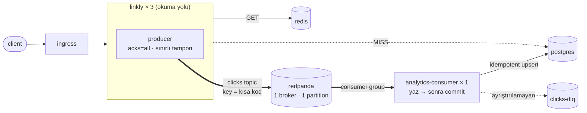

# 06 — event-stream · "Olay akışı, ayrı tüketici"

> **Bu seviyede ne yaşayacaksın?**
> - Pod sert ölse de tıklamaların kaybolmaması (olaylar dayanıklı logda) ve yazıcının ayrı bir servise taşınması — P05-01 ve P05-03 kapanır
> - En-az-bir-kez teslimatın tekrar teslim üretmesi ve idempotency ile emilmesi (P06-01)
> - Tüketici durunca verinin kaybolmayıp bayatlaması — lag (P06-02); tek partition'ın tek tüketici tavanı (P06-03)
> - Tuzaklar: zehirli bir mesajın DLQ olmadan bütün hattı rehin alması (P06-04); commit noktasının teslimat garantisini belirlemesi (P06-06)
> - Broker ölünce bloklamak mı düşürmek mi (P06-05); bilinmeyen bir şema sürümü geldiğinde tüketicinin çökmeden devam etmesi (P06-07)
>
> **Bu seviye olmasa ne olur?** Sert bir ölüm tampondaki tıklamaları siler ve yazıcı redirect ile aynı süreci, aynı bağlantı havuzunu paylaşır.
>
> **Yeni gelen teknolojiler:** Redpanda (Kafka API), franz-go, tüketici grubu, DLQ, `08 · Stream (Redpanda)` paneli ([her biri tek cümleyle](../README.md#kullanılan-teknolojiler)).

## 1. Bu seviye ne?

Tıklama olayları süreç belleğinden çıkıp dayanıklı bir loga (Redpanda, Kafka API) yazılır; ayrı bir deployment
(`analytics-consumer`) onları okuyup veritabanına işler. Sert ölümde kayıp (P05-01) ve paylaşılan süreç (P05-03)
kapanır. Bedeli: teslimat en az bir kez, yani tekrar teslim ve çift sayma riski — idempotency ile emilir.

## 2. Mimari



İki süreç, iki ölçeklenme kararı, iki arıza alanı. Redirect ne veritabanına ne broker'a bağlı: ikisi düşse de
yönlendirme çalışır, yalnızca analitik durur.

## 3. Önceki seviyeden çözülenler

| ID | Sorun | Nasıl çözüldü |
|---|---|---|
| P05-01 | Pod aniden öldürülünce bellekteki kuyrukta bekleyen tıklamalar kayboluyordu ("en fazla bir kez") | Tıklama olayı kalıcı bir olay loguna (Redpanda) yazılıyor ve broker'ın "aldım" demesi bekleniyor (`acks=all`); tüketici ölse de olay logda durur ve yeniden okunur |
| P05-03 | Tıklama yazıcısı yönlendirme yapan programın içindeydi; aynı CPU'yu ve veritabanı bağlantı havuzunu paylaşıyordu | Yazıcı ayrı bir program ve ayrı bir Kubernetes servisi (`analytics-consumer`): kendi CPU sınırı, kendi bağlantı havuzu (`pgxpool`, 10 bağlantı) |

P05-02 (kuyruk dolunca tıklama atma) listede yok, çünkü sorun bir kat aşağı taşındı: artık olayları loga gönderen tarafın (üretici) tamponu dolabilir; uygulama bu tampona sınır koyar ve aşanı atar (P06-05).

## 4. Ayağa kaldırma

İlk kez mi? Önce kök README'deki [Sıfırdan başlangıç](../README.md#sıfırdan-başlangıç): platform bir kez kurulur ve
`LADDER` (repo kökü) tanımlanır. Her komut bloğu `cd "$LADDER/…"` ile başlar; olduğu gibi yapıştır.
Bu seviyenin platformdan istediği: **temel yığın (kind, ingress, Prometheus, Grafana) + Chaos Mesh**; `make up` açar.

Hızlı başvuru (komutları tek tek kullan; satır sonu açıklamaları için zsh'da `setopt interactivecomments` gerekir):

```bash
cd "$LADDER/06-event-stream"
make up            # profil → Grafana'yı temizle → build → push → deploy → rollout wait → smoke
make link          # example.com'a kısa link oluştur, yönlendirmeyi dene → 302 · başka adres: make link URL=https://…
make grafana       # Ladder klasörü, level=lvl06 — giriş: admin / ladder
make load S=mixed  # aynı senaryolar her seviyede: create redirect mixed hot-key burst abuser read-your-writes stairs scan
make repro P=P06-01   # §6'daki bir sorunu otomatik üret → REPRODUCED / NOT-REPRODUCED
make env           # açık ayar/tuzaklar · değiştir: make set E="KEY=değer" · hepsini geri al: make reset (§7)
make down          # seviyeyi kaldır · kümeyi durdurmak için: cd "$LADDER/platform" && make stop
```

Akışa bakmak için (topic ayrıntısı, tüketici grubunun gecikmesi — lag —, ölü mektup kutusundaki ilk 5 kayıt):
```bash
cd "$LADDER/06-event-stream"
RP=$(kubectl -n lvl06 get pod -l app.kubernetes.io/name=redpanda -o name)
kubectl -n lvl06 exec -it $RP -- rpk topic describe clicks
kubectl -n lvl06 exec -it $RP -- rpk group describe analytics
kubectl -n lvl06 exec -it $RP -- rpk topic consume clicks-dlq -n 5
```

**Rehber — bu seviyeyi baştan sona, sırayla.**

1. Önceki seviyeyi kapat (aynı anda tek seviye), bu seviyeyi kur. `make up` Grafana'yı da temizler; sonunda
   `✔ lvl06 ayakta` yazar:
```bash
cd "$LADDER/05-async-analytics"
make down
cd "$LADDER/06-event-stream"
make up
```

**Verileri temizleyip sıfırdan koşmak istersen** 1. adımın yerine bunu kullan: bütün seviyelerin verisi
(linkler, veritabanı, önbellek, kuyruk) ve Grafana'nın gösterdiği metrik, trace, log silinir; küme ve kurulum
kalır (~2-3 dk). Ardından bu seviye temiz kurulur. Yalnızca Grafana çizgilerini temizlemek için (veri kalır)
seviye klasöründe `make fresh` yeter; her deneyin ilk komutu zaten bu.
```bash
cd "$LADDER"
make wipe CONFIRM=1
cd "$LADDER/06-event-stream"
make up
```
2. 05'in sorunlarını burada koş (altı script art arda, uzun sürer; koşarken başka komut çalıştırma). `CONFIRM=1`,
   yıkıcı P05-01 ve P05-05'in de koşmasını sağlar. `BEKLENEN` sütunu `NOT-REPRODUCED` olan satırlar (P05-01, P05-03)
   bu seviyenin çözdüğünü iddia ettikleri; sonuç uymazsa satır `✘` alır:
```bash
cd "$LADDER/06-event-stream"
CONFIRM=1 make verify-prev
```
3. §6'daki sorunları sırayla yaşa (P06-01 → P06-07): adımları yapıştır → **Terminalde ne görmelisin** ile
   karşılaştır → **Grafana'da gör** linklerini aç. Yıkıcı scriptler `CONFIRM=1` ister.
4. Bitince ayarları geri al ve seviyeyi kapat:
```bash
cd "$LADDER/06-event-stream"
make reset
make down
```

## 5. API

Her seviyede aynı: [docs/API.md](../docs/API.md). Dışarıdan davranış değişikliği yok.

`/stats` hâlâ `X-Stats-Freshness: eventual` der; ama artık tıklama kaybolmaz, yalnızca gecikir.

## 6. Reproduce edilebilir sorunlar

Bu seviyede yaşayacağın 7 sorun. Her birini iki yoldan görebilirsin: **Otomatik** — `make repro P=<ID>` deneyi
kendisi yapar, ölçer ve hükmünü basar (`REPRODUCED` = sorun var · `NOT-REPRODUCED` = yok · `SKIPPED` =
ölçülemedi); **Elle** — adımları sırayla yapıştırıp sonucu kendi gözünle görürsün. Her sorunun bölümü aynı
düzende: **Ne oluyor** → **Neden oluyor** → **Bu deney** → adımlar → **Terminalde ne görmelisin** →
**Grafana'da gör** (giriş: admin / ladder) → **Nasıl çözülüyor**.

**Kısa komut** deneyi otomatik başlatır; seviyenin klasöründe çalıştır (önce `cd "$LADDER/06-event-stream"`).
Başında `CONFIRM=1` olanlar yıkıcı bir adım içerir (pod silmek, yeniden başlatmak, arıza enjekte etmek gibi); bu
onay olmadan script o adımı yapmaz ve `SKIPPED` basar.

| ID | Kısa komut | Ne olur? | Neden olur? | Nasıl çözülür? |
|---|---|---|---|---|
| P06-01 | `CONFIRM=1 make repro P=P06-01` | Tüketici bir grup tıklamayı yazıp "buraya kadar okudum" diyemeden ölürse aynı tıklamalar tekrar gelir; önlem olmasa iki kez sayılırdı | Tüketici önce yazar, sonra nerede kaldığını (offset) kaydeder; aradaki her ölüm tekrar teslim demek ("en az bir kez") | **Bu seviyede:** tekrar gelen olay tanınıp atlanır (idempotent yazma) |
| P06-02 | `make repro P=P06-02` | Tüketici durunca istatistikler güncellenmez (bayatlar); tüketici dönünce sayı yakalar, veri kaybolmaz | Olaylar logda güvende bekler; tüketici yalnızca nerede kaldığını izler. Bekleyen olay sayısına "lag" denir ve kendiliğinden erimez | **07:** KEDA bekleyen olay sayısına göre tüketiciyi açar/büyütür |
| P06-03 | `CONFIRM=1 make repro P=P06-03` | Tüketiciyi 3 kopyaya çıkarmak işleme hızını artırmaz; iki kopya boşta oturur | Olay logunun tek bölümü (partition) var ve bir bölümü aynı anda yalnızca bir tüketici okuyabilir | **Bu seviyede:** bölüm sayısını artırmak (`rpk topic add-partitions`) |
| P06-04 | `make repro P=P06-04` | Okunamayan tek bir bozuk mesaj, arkasındaki bütün tıklamaların işlenmesini durdurur | Tuzak açıkken tüketici bozuk mesajı ayıramaz, sonsuza kadar yeniden dener | **Bu seviyenin tuzağı:** kapatınca bozuk mesaj ayrı bir kutuya (DLQ) taşınır, akış sürer |
| P06-05 | `CONFIRM=1 make repro P=P06-05` | Olay sunucusu (broker) tamamen durunca tıklamalar atılır ama yönlendirmeler hatasız çalışmaya devam eder | Uygulama broker'ı beklemez; gönderilmeyi bekleyen tıklamaların tamponu sınırlı, dolunca atılır | **Bu seviyede:** sınır + atma · **14:** 3 broker ve kopyalama |
| P06-06 | `CONFIRM=1 make repro P=P06-06` | "Nerede kaldım" kaydını tıklamaları yazmadan önce yapan bir tüketici ölürse o tıklamalar kalıcı olarak kaybolur | Kayıt yazmadan önce yapılınca yazılamayan olaylar bir daha gelmez ("en fazla bir kez"); sonra yapılınca yalnızca tekrar gelir ("en az bir kez") | **Seçim:** önce yaz, sonra kaydet + tekrarları yut (varsayılan) |
| P06-07 | `make repro P=P06-07` | Tüketicinin tanımadığı yeni sürüm bir olay gelir; tüketici çökseydi bütün analitik dururdu | Üretici ve tüketici ayrı dağıtılır; bir süre farklı sürümlerde çalışırlar | **Bu seviyede:** bilinmeyen sürüm sayılıp atlanır; şema kayıt defteri kapsam dışı |

---

### P06-01 · En az bir kez teslimat → tekrar teslim → idempotency

**Ne oluyor:** Tüketici bir grup tıklamayı veritabanına yazar ama "buraya kadar okudum" kaydını broker'a
bildiremeden ölürse, yerine gelen tüketici aynı tıklamaları tekrar alır. Önlem olmasa aynı tıklama iki kez sayılır ve
istatistik şişer.
**Neden oluyor:** Tüketici önce yazar, sonra nerede kaldığını (offset) broker'a kaydeder (commit). Bu iki adım
arasındaki her ölüm tekrar teslim demek — bu bir hata değil, seçilen garantinin kendisi ("en az bir kez" teslimat).
Çift saymayı `processed_events` tablosu engeller: her olayın kimliği bir kez kaydedilir, tekrar gelen olay atlanır
(`INSERT … ON CONFLICT DO NOTHING RETURNING`).
**Bu deney:** Yazma ile kayıt arasına 30 sn koyar, 2000 tıklamalık birikim kurar ve tüketici ilk grubu yazdığı an onu
sert öldürür; yeni tüketicinin tekrar gelen olayları saydığını ve toplamın yine tam 2000 kaldığını gösterir.

**Reproduce (adım adım):** Otomatik: `CONFIRM=1 make repro P=P06-01` (yazma ile commit arasına 30 sn koyar, 2000
tıklamalık birikim kurar, ilk parti yazılır yazılmaz tüketiciyi öldürür; yeni pod'da `duplicate > 0` ve sayım tam N
ise `REPRODUCED`, öldürme pencereyi kaçırırsa exit 2). Elle:

1. Temiz başla; yazma ile commit arasına 30 sn koy (`TRAP_COMMIT_DELAY_MS`; sıra aynı, yalnızca boşluk vurulabilecek
   kadar açılır — yalnızca `analytics` yeniden başlar):
```bash
cd "$LADDER/06-event-stream"
make fresh
make set W=analytics E="TRAP_COMMIT_DELAY_MS=30000"
```
2. Tüketiciyi durdur, pod gidene kadar bekle, bir linke 2000 tıklama üret — hepsi topic'te bekler:
```bash
cd "$LADDER/06-event-stream"
kubectl -n lvl06 scale deploy/analytics --replicas=0
kubectl -n lvl06 wait --for=delete pod -l app.kubernetes.io/name=analytics --timeout=90s
code=$(curl -s -XPOST http://lvl06.localtest.me/api/links -H 'Content-Type: application/json' -d '{"url":"https://example.com/dedup"}' | jq -r .code); echo "kod: $code"
seq 1 2000 | xargs -P 20 -I{} curl -s -o /dev/null --max-time 5 http://lvl06.localtest.me/$code
curl -s http://lvl06.localtest.me/api/links/$code/stats | jq .clicks
```
3. **Yıkıcı:** tüketiciyi aç; sayaç sıfırdan kalktığı an (yazıldı, henüz commit edilmedi) commit sayacına bak ve pod'u
   sert öldür (döngü takılırsa Ctrl+C):
```bash
cd "$LADDER/06-event-stream"
kubectl -n lvl06 scale deploy/analytics --replicas=1
until [ "$(curl -s http://lvl06.localtest.me/api/links/$code/stats | jq -r '.clicks // 0')" -gt 0 ]; do sleep 1; done
pod=$(kubectl -n lvl06 get pod -l app.kubernetes.io/name=analytics -o json | jq -r '[.items[] | select(.metadata.deletionTimestamp == null) | .metadata.name][0]'); echo "tüketici: $pod"
kubectl -n lvl06 get --raw "/api/v1/namespaces/lvl06/pods/${pod}:8080/proxy/metrics" | grep '^consumer_commits_total'
kubectl -n lvl06 delete pod "$pod" --force --grace-period=0
curl -s http://lvl06.localtest.me/api/links/$code/stats | jq .clicks
```
4. Yeni pod partition'ı ölen üyenin oturumu dolunca (~45 sn) alır; bir dakika bekle, yeni pod'un sayaçlarına ve sayıma
   bak (sayaçlar kıpırdamadıysa son iki komutu biraz sonra tekrarla):
```bash
cd "$LADDER/06-event-stream"
sleep 10
new=$(kubectl -n lvl06 get pod -l app.kubernetes.io/name=analytics -o json | jq -r '[.items[] | select(.metadata.deletionTimestamp == null) | .metadata.name][0]'); echo "yeni tüketici: $new"
sleep 60
kubectl -n lvl06 get --raw "/api/v1/namespaces/lvl06/pods/${new}:8080/proxy/metrics" | grep '^consumer_records_total'
curl -s http://lvl06.localtest.me/api/links/$code/stats | jq .clicks
```
5. Yeni pod'un da commit etmesini bekle (etmezse aynı parti sonraki deneye bir kez daha gelir), tuzağı kapat:
```bash
cd "$LADDER/06-event-stream"
sleep 30
kubectl -n lvl06 get --raw "/api/v1/namespaces/lvl06/pods/${new}:8080/proxy/metrics" | grep '^consumer_commits_total'
make reset
```

**Terminalde ne görmelisin:** 2. adımda `0` (tüketici kapalı). 3. adımda `consumer_commits_total 0` — yazdı, commit
etmedi — ve öldürmeden sonra sayaç sıfırdan büyük (çoğu zaman `2000`). 4. adımda
`consumer_records_total{result="duplicate"}` sıfırdan büyük (aynı olaylar ikinci kez geldi) ama sayaç yine tam `2000`:
idempotency tekrarı yuttu. 5. adımda `consumer_commits_total` sıfırdan büyük.

**Grafana'da gör:** [`08 · Stream (Redpanda)`](http://grafana.localtest.me/d/ladder-stream?var-level=lvl06&from=now-15m&to=now&refresh=10s) — deney başlayınca aç; ~4 dk sürer
- "Tüketici gecikmesi (bölüme göre)" → tüketici kapalıyken `bölüm 0` ≈2000'e çıkar; ilk pod commit etmeden öldüğü için inmez, yeni pod 30 sn sonra commit edince 0'a düşer.
- "Onaylama / sn ve tüketici pod sayısı" → `tüketici pod` 0'a iner, sonra 1'e döner; `onaylama / sn` ancak yeni pod'la belirir.
- "Tüketilen kayıtlar (sonuca göre)" → yeni pod devralınca bir `duplicate` tepesi: tekrar gelen olaylar sayılmadı.
- "Üretilen ve tüketilen olaylar (toplam)" → `tüketilen` (yalnızca `ok`) `üretilen`in üstüne çıkmaz: çift sayma yok. Kesin sayım DB'deki sayı.

**Nasıl çözülüyor:** **Bu seviyede:** "en az bir kez" teslimat + tekrarı yutan (idempotent) yazma. Olayın kimliğini kaydetmek ve sayacı artırmak aynı veritabanı işleminde (transaction) yapılır; aralarında bir çökme çift saymayı geri getirirdi. Bedeli: saklama süresi boyunca tıklama başına bir satır.

---

### P06-02 · Tüketici gecikmesi: veri kaybolmuyor, bayatlıyor

**Ne oluyor:** Tüketici durunca (arıza, dağıtım, sıfır kopya) istatistikler güncellenmez; `/stats` eski değeri
gösterir. Tüketici dönünce birikmiş tıklamalar işlenir ve sayı yakalar — 05'te aynı durum kalıcı kayıptı, burada
yalnızca gecikme.
**Neden oluyor:** Olaylar kalıcı logda güvende bekler; tüketici yalnızca nerede kaldığını (offset) izler. İşlenmeyi
bekleyen olay sayısına "lag" (gecikme) denir. Ama durmuş bir tüketiciyi kimse otomatik geri getirmez; lag kendiliğinden
erimez.
**Bu deney:** Tüketiciyi kapatıp 2000 tıklama üretir, 120 sn kimse müdahale etmeden bekler (sistem toparlanmıyor),
sonra tüketiciyi açıp sayının yakaladığını gösterir.

**Reproduce (adım adım):** Otomatik: `make repro P=P06-02` (tüketiciyi kapatır, 2000 tıklama üretir, 120 sn kendiliğinden
toparlanıp toparlanmadığına bakar, sonra tüketiciyi açıp verinin kaybolmadığını gösterir; bayat kaldı ve kendiliğinden
toparlanmadıysa `REPRODUCED`). Elle:

1. Temiz başla; bir link oluştur, tüketiciyi durdur, 2000 tıklama üret; sonra sayaca, üretilen olay sayısına ve grubun
   gecikmesine (`LAG` sütunu) bak:
```bash
cd "$LADDER/06-event-stream"
make fresh
code=$(curl -s -XPOST http://lvl06.localtest.me/api/links -H 'Content-Type: application/json' -d '{"url":"https://example.com/lag"}' | jq -r .code); echo "kod: $code"
kubectl -n lvl06 scale deploy/analytics --replicas=0
sleep 5
seq 1 2000 | xargs -P 20 -I{} curl -s -o /dev/null --max-time 5 http://lvl06.localtest.me/$code
sleep 8
curl -s http://lvl06.localtest.me/api/links/$code/stats | jq .clicks
curl -s 'http://prometheus.localtest.me/api/v1/query' --data-urlencode 'query=sum(increase(producer_records_total{namespace="lvl06",result="ok"}[10m]))' | jq -r '.data.result[0].value[1]'
rp=$(kubectl -n lvl06 get pod -l app.kubernetes.io/name=redpanda -o json | jq -r '[.items[] | select(.metadata.deletionTimestamp == null) | select(any(.status.containerStatuses[]?; .ready)) | .metadata.name][0]'); echo "redpanda pod: $rp"
kubectl -n lvl06 exec "$rp" -- rpk group describe analytics
```
2. Kimse müdahale etmeden 120 sn bekle: sistem kendiliğinden toparlanıyor mu?
```bash
cd "$LADDER/06-event-stream"
sleep 120
curl -s http://lvl06.localtest.me/api/links/$code/stats | jq .clicks
kubectl -n lvl06 get deploy/analytics
```
3. Tüketiciyi elle aç ve sayacın yetişmesini izle:
```bash
cd "$LADDER/06-event-stream"
kubectl -n lvl06 scale deploy/analytics --replicas=1
kubectl -n lvl06 rollout status deploy/analytics --timeout=120s
for i in $(seq 1 10); do curl -s http://lvl06.localtest.me/api/links/$code/stats | jq .clicks; sleep 3; done
```

**Terminalde ne görmelisin:** 1. adımda sayaç `0` (bayat), üretilen ≈2000 ve `clicks` satırının `LAG`'i ≈2000:
olaylar broker'da güvende ama işlenmedi. 2. adımda sayaç hâlâ `0`, `READY 0/0`: kimse tüketiciyi geri getirmiyor.
3. adımda sayı hızla `2000`'e çıkar: veri kaybolmadı, bekledi (05'te aynı senaryo kalıcı kayıptı).

**Grafana'da gör:** [`08 · Stream (Redpanda)`](http://grafana.localtest.me/d/ladder-stream?var-level=lvl06&from=now-15m&to=now&refresh=10s) — deney başlayınca aç; tüketici ~2 dk kapalı kalır
- "Tüketici gecikmesi (bölüme göre)" → `bölüm 0` ≈2000'e çıkar ve 120 sn yatay kalır; tüketici açılınca 0'a düşer.
- "Onaylama / sn ve tüketici pod sayısı" → `tüketici pod` 0, `onaylama / sn` yok: lag büyürken tüketiciyi geri getiren bir şey yok.
- "Üretilen ve tüketilen olaylar (toplam)" → `üretilen` yükselir, `tüketilen` yatay; aradaki açıklık lag'in kendisi. Tüketici açılınca `tüketilen` yetişir.

**Nasıl çözülüyor:** **07:** KEDA bekleyen olay sayısını (lag) izler ve tüketiciyi otomatik açar/büyütür. Tek bölümlü (partition) bir logda kopya eklemek hızlandırmaz (P06-03); lag bir hata değil bir ölçüdür, eşiği ürün kararıdır.

---

### P06-03 · Tek partition = tek tüketici tavanı

**Ne oluyor:** Tıklamalar birikince tüketiciyi 3 kopyaya çıkarıyorsun ama işleme hızı değişmiyor; kopyalardan
ikisi boşta oturuyor.
**Neden oluyor:** Kafka'da (ve Redpanda'da) bir konu (topic) bölümlere (partition) ayrılır ve bir bölümü aynı tüketici
grubunda yalnızca bir tüketici okuyabilir. Bu konunun tek bölümü var; paralelliğin tavanı bölüm sayısıdır.
**Bu deney:** Bölüm sayısını gösterir; aynı yükü 1 ve 3 tüketiciyle verip saniyedeki işleme hızını ve gerçekten iş
yapan pod sayısını karşılaştırır.

**Reproduce (adım adım):** Otomatik: `CONFIRM=1 make repro P=P06-03` (1 ve 3 tüketiciyle aynı yükü verip tepe işleme
hızını ve iş yapan pod sayısını karşılaştırır, sonra 1'e döner; 3 replika 1'in 1,5 katına ulaşmazsa `REPRODUCED`). Elle:

1. Temiz başla; topic'in partition sayısına bak:
```bash
cd "$LADDER/06-event-stream"
make fresh
rp=$(kubectl -n lvl06 get pod -l app.kubernetes.io/name=redpanda -o json | jq -r '[.items[] | select(.metadata.deletionTimestamp == null) | select(any(.status.containerStatuses[]?; .ready)) | .metadata.name][0]'); echo "redpanda pod: $rp"
kubectl -n lvl06 exec "$rp" -- rpk topic describe clicks
```
2. 1 tüketiciyle 40 kullanıcı 30 sn yük; birikim erisin diye 30 sn bekle, tepe işleme hızını (kayıt/sn) oku:
```bash
cd "$LADDER/06-event-stream"
make load S=hot-key K6_ARGS="--vus 40 --duration 30s"
sleep 30
curl -s 'http://prometheus.localtest.me/api/v1/query' --data-urlencode 'query=max_over_time(sum(rate(consumer_records_total{namespace="lvl06",result="ok"}[30s]))[90s:15s])' | jq -r '.data.result[0].value[1]'
```
3. 3 tüketiciye çık, aynı yük ve ölçü; ayrıca pod başına hız:
```bash
cd "$LADDER/06-event-stream"
kubectl -n lvl06 scale deploy/analytics --replicas=3
kubectl -n lvl06 rollout status deploy/analytics --timeout=120s
sleep 8
make load S=hot-key K6_ARGS="--vus 40 --duration 30s"
sleep 30
curl -s 'http://prometheus.localtest.me/api/v1/query' --data-urlencode 'query=max_over_time(sum(rate(consumer_records_total{namespace="lvl06",result="ok"}[30s]))[90s:15s])' | jq -r '.data.result[0].value[1]'
curl -s 'http://prometheus.localtest.me/api/v1/query' --data-urlencode 'query=sum by (pod) (rate(consumer_records_total{namespace="lvl06",result="ok"}[1m]))' | jq -r '.data.result[] | "\(.metric.pod) \(.value[1])"'
```
4. Tek tüketiciye dön:
```bash
cd "$LADDER/06-event-stream"
kubectl -n lvl06 scale deploy/analytics --replicas=1
```

**Terminalde ne görmelisin:** 1. adımda `PARTITIONS` 1. 2. ve 3. adımdaki tepe hızlar birbirine yakın: pod üç katına
çıktı, hız değişmedi. Pod başına sorguda üç `analytics-…` satırından yalnızca biri sıfırdan büyük; diğer ikisi
partition alamadığı için boşta.

**Grafana'da gör:** [`08 · Stream (Redpanda)`](http://grafana.localtest.me/d/ladder-stream?var-level=lvl06&from=now-15m&to=now&refresh=10s) — iki yük fazı var: önce 1, sonra 3 tüketici
- "Onaylama / sn ve tüketici pod sayısı" → `tüketici pod` 1'den 3'e çıkar ama `onaylama / sn` iki fazda aynı tepeye çıkar.
- "Tüketici gecikmesi (bölüme göre)" → tek çizgi (`bölüm 0`); iki fazda da benzer sürede erir.
- Explore'da: `sum by (pod) (rate(consumer_records_total{namespace="lvl06",result="ok"}[1m]))` → 3 replikalı fazda yalnızca biri sıfırdan büyük.

**Nasıl çözülüyor:** **Bu seviyede:** bölüm sayısını artırmak (`rpk topic add-partitions clicks -n 6`). Bedeli: sıra yalnızca bölüm içinde korunur; anahtar kısa kod olduğu için aynı linkin olayları sıralı kalır, ama çok popüler bir link tek bölüme yüklenir.

---

### P06-04 · TRAP · Poison message boru hattını rehin alır

**Ne oluyor:** Tuzak açıkken okunamayan (bozuk) tek bir mesaj, arkasındaki bütün tıklamaların işlenmesini
durdurur; bekleyen olay sayısı sınırsız büyür. Pod ise ayakta ve "sağlıklıyım" der; sorunu yalnızca biriken lag
gösterir.
**Neden oluyor:** Tüketici işleyemediği mesaj için bir çıkış yolu tanımlamazsa aynı mesajı sonsuza kadar yeniden dener
ve nerede kaldığını (offset) ilerletemez. Tuzak (`TRAP_NO_DLQ`), bozuk mesajları ayıran ölü mektup kutusunu (DLQ —
dead letter queue) kapatır.
**Bu deney:** Tuzağı açar, konuya 3 bozuk kayıt ve arkasından 200 tıklama gönderir; tıklamaların işlenmediğini ve aynı
kaydın yeniden denendiğini gösterir, tuzağı kapatınca 200 tıklamanın serbest kaldığını ölçer.

**Reproduce (adım adım):** Otomatik: `make repro P=P06-04` (DLQ kapalıyken 3 bozuk kaydın arkasındaki 200 tıklamanın
işlenip işlenmediğine, sonra DLQ açılınca serbest kalıp kalmadığına bakar; 1. fazda 0/200, 2. fazda 200/200 ise
`REPRODUCED`). Elle:

1. Temiz başla; DLQ'yu kapat (`TRAP_NO_DLQ=true`, yalnızca `analytics` yeniden başlar, 10 sn bekle); bir link oluştur
   ve 20 tıklamayla tüketicinin sağlam kayıtları işlediğini doğrula:
```bash
cd "$LADDER/06-event-stream"
make fresh
make set W=analytics E="TRAP_NO_DLQ=true"
sleep 10
code=$(curl -s -XPOST http://lvl06.localtest.me/api/links -H 'Content-Type: application/json' -d '{"url":"https://example.com/poison"}' | jq -r .code); echo "kod: $code"
for i in $(seq 1 20); do curl -s -o /dev/null http://lvl06.localtest.me/$code; done
sleep 10
curl -s http://lvl06.localtest.me/api/links/$code/stats | jq .clicks
```
2. Topic'e aynı anahtarla (aynı partition) 3 bozuk kayıt bas, arkasından 200 geçerli tıklama üret, 30 sn bekle:
```bash
cd "$LADDER/06-event-stream"
rp=$(kubectl -n lvl06 get pod -l app.kubernetes.io/name=redpanda -o json | jq -r '[.items[] | select(.metadata.deletionTimestamp == null) | select(any(.status.containerStatuses[]?; .ready)) | .metadata.name][0]'); echo "redpanda pod: $rp"
for i in 1 2 3; do kubectl -n lvl06 exec "$rp" -- sh -c "echo 'bu-json-degil-$i' | rpk topic produce clicks -k '$code'"; done
for i in $(seq 1 200); do curl -s -o /dev/null http://lvl06.localtest.me/$code; done
sleep 30
```
3. Kaç tıklama işlendi, grubun gecikmesi ne, tüketici aynı kaydı yeniden deniyor mu (hata sayacını 10 sn arayla iki
   kez oku):
```bash
cd "$LADDER/06-event-stream"
curl -s http://lvl06.localtest.me/api/links/$code/stats | jq .clicks
kubectl -n lvl06 exec "$rp" -- rpk group describe analytics
cpod=$(kubectl -n lvl06 get pod -l app.kubernetes.io/name=analytics -o json | jq -r '[.items[] | select(.metadata.deletionTimestamp == null) | .metadata.name][0]'); echo "tüketici: $cpod"
kubectl -n lvl06 get --raw "/api/v1/namespaces/lvl06/pods/${cpod}:8080/proxy/metrics" | grep 'result="error"'
sleep 10
kubectl -n lvl06 get --raw "/api/v1/namespaces/lvl06/pods/${cpod}:8080/proxy/metrics" | grep 'result="error"'
```
4. DLQ'yu geri aç (`make reset`), bekleyen tıklamaların işlenmesini izle; sonra gecikmeye ve ölü mektup kutusuna bak:
```bash
cd "$LADDER/06-event-stream"
make reset
for i in $(seq 1 10); do curl -s http://lvl06.localtest.me/api/links/$code/stats | jq .clicks; sleep 5; done
kubectl -n lvl06 exec "$rp" -- rpk group describe analytics
kubectl -n lvl06 exec "$rp" -- rpk topic consume clicks-dlq -n 3
```

**Terminalde ne görmelisin:** 1. adımda `20`. 2. adımda her bozuk kayıt için `Produced to partition 0 at offset …`.
3. adımda sayaç hâlâ `20` (200 tıklamanın hiçbiri işlenmedi), `LAG` 200'ün üstünde ve ikinci `result="error"` değeri
birincisinden büyük: aynı bozuk kayıt her saniye yeniden deneniyor — pod ise ayakta. 4. adımda sayaç `220`, `LAG` 0 ve
`clicks-dlq`'dan `bu-json-degil-…` kayıtları okunur (önceki koşulardan kalmış kayıtlar da olabilir).

**Grafana'da gör:** [`08 · Stream (Redpanda)`](http://grafana.localtest.me/d/ladder-stream?var-level=lvl06&from=now-15m&to=now&refresh=10s) — deneyden ~1 dk sonra aç; iki faz ~4 dk sürer
- "Tüketilen kayıtlar (sonuca göre)" → tuzak fazında `ok` sıfıra iner, yerine sabit bir `error` serisi akar (~3/sn); DLQ fazında küçük bir `dlq` tepesi, ardından bekleyen tıklamaların `ok` tepesi.
- "Tüketici gecikmesi (bölüme göre)" → tuzak fazında ~200'de kalır (offset ilerlemiyor); DLQ açılınca 0'a iner.
- "Onaylama / sn ve tüketici pod sayısı" → tuzak fazında `tüketici pod` 1, `onaylama / sn` 0: süreç ayakta ama iş ilerlemiyor.
- "Ölü mektup kutusuna giden / sn" → yalnızca ikinci fazda küçük bir tepe.

**Nasıl çözülüyor:** Bu seviyenin tuzağı: kapatınca (varsayılan) bozuk mesaj `clicks-dlq` kutusuna taşınır ve akış sürer. Kural: her tüketici işleyemediği mesaj için bir çıkış yolu tanımlamalı (atla ve say, DLQ'ya taşı ya da bilerek dur); ilerlemenin ölçüsü sağlık ucu değil, lag'dir.

---

### P06-05 · Broker düşünce: bloklamak mı düşürmek mi?

**Ne oluyor:** Olay sunucusu (Redpanda broker) tamamen durunca yönlendirmeler hatasız çalışmaya devam eder;
yalnızca tıklamalar gönderilemez, tampon dolar ve sınırı aşanlar atılır. Analitik durur, kullanıcı bir şey fark etmez.
**Neden oluyor:** Uygulama tıklamayı gönderirken broker'ı beklemez ve gönderilmeyi bekleyen tıklamaların tamponu sınırlı
(`PRODUCER_MAX_BUFFERED`); dolunca yeni tıklama atılır. Beklemek broker kesintisini site kesintisine, sınırsız tampon ise
belleği doldurup pod'u öldürmeye (OOM) çevirirdi. Kafka istemcisinin varsayılanı (10.000 kayıtta çağıranı beklet) bu
yüzden kullanılmıyor.
**Bu deney:** Tampon sınırını 500'e indirir, broker ayaktayken ve kapalıyken aynı yükü verir; iki durumda hata oranını,
yanıt süresini, tampon doluluğunu ve atılan tıklamaları karşılaştırır.

**Reproduce (adım adım):** Otomatik: `CONFIRM=1 make repro P=P06-05` (tampon sınırını 500'e indirir — varsayılan 50.000
kısa kesintide dolmaz —, broker ayaktayken ve kapalıyken aynı yükü verir; hata %1'in altında ve düşürülen > 0 ise
`REPRODUCED`). Elle:

1. Temiz başla; tampon sınırını 500'e indir (yalnızca `linkly`), broker ayaktayken taban yükü ver:
```bash
cd "$LADDER/06-event-stream"
make fresh
make set W=linkly E="PRODUCER_MAX_BUFFERED=500"
sleep 10
make load S=redirect K6_ARGS="--vus 20 --duration 30s"
```
2. **Yıkıcı:** broker'ı durdur, aynı yükü ver; sonra tampon tepesini ve düşürülen kayıt sayısını oku:
```bash
cd "$LADDER/06-event-stream"
kubectl -n lvl06 scale statefulset redpanda --replicas=0
sleep 10
make load S=redirect K6_ARGS="--vus 20 --duration 40s"
sleep 8
curl -s 'http://prometheus.localtest.me/api/v1/query' --data-urlencode 'query=max_over_time(max(producer_buffered_records{namespace="lvl06"})[3m:10s])' | jq -r '.data.result[0].value[1]'
curl -s 'http://prometheus.localtest.me/api/v1/query' --data-urlencode 'query=sum(increase(producer_records_total{namespace="lvl06",result="dropped"}[5m]))' | jq -r '.data.result[0].value[1]'
```
3. Broker'ı geri getir, tampon sınırını geri al:
```bash
cd "$LADDER/06-event-stream"
kubectl -n lvl06 scale statefulset redpanda --replicas=1
kubectl -n lvl06 rollout status statefulset/redpanda --timeout=180s
make reset
```

**Terminalde ne görmelisin:** İki yükün k6 özetinde de `5xx` sıfır ya da isteklerin %1'inin çok altında ve `p99`
benzer: redirect broker'ı beklemiyor. Tampon tepesi `500` (sınırda durdu), düşürülen sıfırdan büyük. Analitik durdu,
kullanıcı etkilenmedi.

**Grafana'da gör:** [`08 · Stream (Redpanda)`](http://grafana.localtest.me/d/ladder-stream?var-level=lvl06&from=now-15m&to=now&refresh=10s), [`02 · App RED`](http://grafana.localtest.me/d/ladder-app-red?var-level=lvl06&from=now-15m&to=now&refresh=10s) ve [`01 · Pods & Resources`](http://grafana.localtest.me/d/ladder-pods?var-level=lvl06&from=now-15m&to=now&refresh=10s) — iki faz: broker ayakta, sonra kapalı
- "Üretici tamponu ve atılanlar" → broker kapanınca `tamponda` çizgileri 500'e dayanır ve `atılan / sn` belirir; broker dönünce tampon 0'a iner.
- "Üretilen kayıt / sn" → broker kapalıyken 0'a düşer.
- "Broker ayakta mı" → çizgi 0'a inmez, kesilir: kazınacak pod yok (aynı sebeple lag paneli de boş).
- "Sunucu hatası oranı (5xx)" → iki fazda da 0 civarı.
- "Gecikme (p50 / p95 / p99)" → iki fazda benzer; sıçrama `Record()`'un istek yolunu bloklaması demek olurdu.
- "Bellek: sınırın yüzde kaçı" → `linkly-…` belleği biraz artar, %80'in altında kalır.

**Nasıl çözülüyor:** **Bu seviyede** kısmen: sınır + atma kullanıcıyı korur ama tıklama kaybettirir. **14:** 3 broker ve kopyalamayla tek broker'ın düşmesi kesinti olmaktan çıkar. Bir broker kesintisi analitiği bozabilir, yönlendirmeyi asla.

---

### P06-06 · TRAP · Commit noktası teslimat garantisidir

**Ne oluyor:** Tuzak açıkken tüketici "nerede kaldım" kaydını tıklamaları yazmadan önce yapar; tam bu arada
ölürse o tıklamalar hiç yazılmaz ve bir daha gelmez — kalıcı kayıp. Varsayılan sırada aynı ölüm yalnızca tekrar teslime
yol açar ve sayı eksilmez.
**Neden oluyor:** Tüketicinin iki adımı var: tıklamaları veritabanına yazmak ve nerede kaldığını (offset) broker'a
kaydetmek (commit). Bu iki adımın sırası teslimat garantisini belirler; üçüncü bir yol yok:

| Sıra | Sonuç | Riski |
|---|---|---|
| yaz → commit *(varsayılan)* | en az bir kez | tekrar teslim (idempotency emer) |
| commit → yaz *(TRAP)* | en fazla bir kez | yazma olmazsa veri kaybı |

**Bu deney:** Adımlar arasına 30 sn koyar ve iki sırayı da dener: her birinde 2000 tıklamalık birikim kurup tüketiciyi
iki adımın arasında öldürür, sonra kaç tıklamanın kaydedildiğini sayar.

**Reproduce (adım adım):** Otomatik: `CONFIRM=1 make repro P=P06-06` (her iki sırada 2000 tıklamalık birikim kurup
tüketiciyi iki adımın arasında öldürür; varsayılan tam N, TRAP N'in altındaysa `REPRODUCED`; öldürme araya denk
gelmezse exit 2). Elle:

1. Temiz başla; yazma ile commit arasına 30 sn koy (sıra aynı), broker pod'unu bul:
```bash
cd "$LADDER/06-event-stream"
make fresh
make set W=analytics E="TRAP_COMMIT_DELAY_MS=30000"
rp=$(kubectl -n lvl06 get pod -l app.kubernetes.io/name=redpanda -o json | jq -r '[.items[] | select(.metadata.deletionTimestamp == null) | select(any(.status.containerStatuses[]?; .ready)) | .metadata.name][0]'); echo "redpanda pod: $rp"
```
2. **Varsayılan faz (yaz → commit):** tüketiciyi durdur, bir linke 2000 tıklama üret — hepsi topic'te bekler:
```bash
cd "$LADDER/06-event-stream"
kubectl -n lvl06 scale deploy/analytics --replicas=0
kubectl -n lvl06 wait --for=delete pod -l app.kubernetes.io/name=analytics --timeout=90s
code=$(curl -s -XPOST http://lvl06.localtest.me/api/links -H 'Content-Type: application/json' -d '{"url":"https://example.com/eo/default"}' | jq -r .code); echo "kod: $code"
seq 1 2000 | xargs -P 20 -I{} curl -s -o /dev/null --max-time 5 http://lvl06.localtest.me/$code
```
3. **Yıkıcı:** tüketiciyi aç; sayaç kalktığı an (yazıldı, commit edilmedi) commit sayacına bak ve pod'u sert öldür:
```bash
cd "$LADDER/06-event-stream"
kubectl -n lvl06 scale deploy/analytics --replicas=1
until [ "$(curl -s http://lvl06.localtest.me/api/links/$code/stats | jq -r '.clicks // 0')" -gt 0 ]; do sleep 1; done
pod=$(kubectl -n lvl06 get pod -l app.kubernetes.io/name=analytics -o json | jq -r '[.items[] | select(.metadata.deletionTimestamp == null) | .metadata.name][0]'); echo "tüketici: $pod"
kubectl -n lvl06 get --raw "/api/v1/namespaces/lvl06/pods/${pod}:8080/proxy/metrics" | grep '^consumer_commits_total'
kubectl -n lvl06 delete pod "$pod" --force --grace-period=0
```
4. Yeni pod ~45 sn sonra partition'ı alır, partiyi yeniden işler ve commit eder; bekle, gecikmeye ve sayıma bak (`LAG`
   0 değilse 10 sn sonra tekrarla):
```bash
cd "$LADDER/06-event-stream"
sleep 90
kubectl -n lvl06 exec "$rp" -- rpk group describe analytics
curl -s http://lvl06.localtest.me/api/links/$code/stats | jq .clicks
```
5. **TRAP fazı (commit → yaz):** commit'i yazmadan önce yap (`TRAP_COMMIT_BEFORE_WRITE=true`, 30 sn ara korunur),
   tüketiciyi durdur, yeni bir linke aynı birikimi kur:
```bash
cd "$LADDER/06-event-stream"
make set W=analytics E="TRAP_COMMIT_DELAY_MS=30000 TRAP_COMMIT_BEFORE_WRITE=true"
kubectl -n lvl06 scale deploy/analytics --replicas=0
kubectl -n lvl06 wait --for=delete pod -l app.kubernetes.io/name=analytics --timeout=90s
code2=$(curl -s -XPOST http://lvl06.localtest.me/api/links -H 'Content-Type: application/json' -d '{"url":"https://example.com/eo/trap"}' | jq -r .code); echo "kod: $code2"
seq 1 2000 | xargs -P 20 -I{} curl -s -o /dev/null --max-time 5 http://lvl06.localtest.me/$code2
```
6. **Yıkıcı:** tüketiciyi aç; commit sayacı arttığı an (commit edildi, yazılmadı) sayaca bak ve pod'u sert öldür:
```bash
cd "$LADDER/06-event-stream"
kubectl -n lvl06 scale deploy/analytics --replicas=1
sleep 5
pod=$(kubectl -n lvl06 get pod -l app.kubernetes.io/name=analytics -o json | jq -r '[.items[] | select(.metadata.deletionTimestamp == null) | .metadata.name][0]'); echo "tüketici: $pod"
until kubectl -n lvl06 get --raw "/api/v1/namespaces/lvl06/pods/${pod}:8080/proxy/metrics" 2>/dev/null | grep -q '^consumer_commits_total [1-9]'; do sleep 1; done
curl -s http://lvl06.localtest.me/api/links/$code2/stats | jq .clicks
kubectl -n lvl06 delete pod "$pod" --force --grace-period=0
```
7. Yeni pod commit edilmiş offset'ten devam eder; bekle, gecikmeye ve sayıma bak, tuzakları kapat:
```bash
cd "$LADDER/06-event-stream"
sleep 90
kubectl -n lvl06 exec "$rp" -- rpk group describe analytics
curl -s http://lvl06.localtest.me/api/links/$code2/stats | jq .clicks
make reset
```

**Terminalde ne görmelisin:** 3. adımda `consumer_commits_total 0` (yazdı, commit etmedi). 4. adımda `LAG` 0 ve sayaç
tam `2000`: yeni pod partiyi yeniden aldı, idempotency tekrarı yuttu. 6. adımda sayaç `0` ve commit sayacı sıfırdan
büyük (offset ilerledi, parti yazılmadı). 7. adımda `LAG` yine 0 ama sayaç `2000`'in altında, çoğu zaman `0`: commit
edilip yazılamayan kayıtlar bir daha gelmez.

**Grafana'da gör:** [`08 · Stream (Redpanda)`](http://grafana.localtest.me/d/ladder-stream?var-level=lvl06&from=now-30m&to=now&refresh=10s) — iki faz, her biri ~3 dk; 30 dk'lık pencere ikisini kapsar
- "Tüketici gecikmesi (bölüme göre)" → her faz için bir tepe. Varsayılanda tepe yeni pod commit edene kadar inmez; TRAP'te ilk commit'le hemen 0'a iner — ama tıklamalar yazılmadı.
- "Tüketilen kayıtlar (sonuca göre)" → varsayılanda bir `duplicate` tepesi; TRAP'te `duplicate` yok (tekrar teslim yok).
- "Üretilen ve tüketilen olaylar (toplam)" → TRAP fazında `tüketilen`, `üretilen`in altında kalır. Kesin karşılaştırma DB'deki sayım.

**Nasıl çözülüyor:** Bir seçim meselesi: varsayılan sıra (önce yaz, sonra kaydet) + tekrarları yutan yazma, "tam bir kez" denen şeyin gerçekte nasıl elde edildiğidir. Otomatik (zamanlayıcıyla) kayıt bu yüzden kapalı: garantiyi sessizce kayıplı sıraya çevirirdi.

---

### P06-07 · Şema evrimi: bilinmeyen sürüm geldiğinde

**Ne oluyor:** Tüketicinin tanımadığı yeni sürüm bir olay (`v:99`) gelince tüketici çökmez; olayı atlar, sayar ve
arkasındaki tıklamaları işlemeye devam eder. Bu bölüm, bu davranışın gerçekten çalıştığını sınar.
**Neden oluyor:** Üretici (uygulama) ve tüketici ayrı dağıtılır; bir süre farklı sürümlerde çalışırlar. Tüketici
bilmediği sürümde çökseydi, üreticideki tek satırlık bir değişiklik bütün analitiği durdururdu.
**Bu deney:** Konuya `v:99` bir olay ve arkasından 150 normal tıklama gönderir; tıklamaların işlendiğini, bilinmeyen
sürümün sayıldığını ve tüketicinin yeniden başlamadığını gösterir.

**Reproduce (adım adım):** Otomatik: `make repro P=P06-07` (topic'e `v:99` bir olay basar, ardından 150 normal tıklama;
bilinmeyen sürüm sayıldı ve normal tıklamalar işlendiyse `REPRODUCED`). Elle:

1. Temiz başla; bir link oluştur, topic'e geleceğin sürümünden bir olay bas (`v:99`, bilinmeyen alanlarla):
```bash
cd "$LADDER/06-event-stream"
make fresh
rp=$(kubectl -n lvl06 get pod -l app.kubernetes.io/name=redpanda -o json | jq -r '[.items[] | select(.metadata.deletionTimestamp == null) | select(any(.status.containerStatuses[]?; .ready)) | .metadata.name][0]'); echo "redpanda pod: $rp"
code=$(curl -s -XPOST http://lvl06.localtest.me/api/links -H 'Content-Type: application/json' -d '{"url":"https://example.com/schema"}' | jq -r .code); echo "kod: $code"
future='{"v":99,"event_id":"future-1","code":"'"$code"'","at":"2030-01-01T00:00:00Z","new_field":{"nested":true},"another":42}'
kubectl -n lvl06 exec "$rp" -- sh -c "echo '$future' | rpk topic produce clicks"
```
2. Ardından 150 normal tıklama üret, 20 sn bekle; sayaca, tüketicinin sayaçlarına ve restart sayısına bak:
```bash
cd "$LADDER/06-event-stream"
for i in $(seq 1 150); do curl -s -o /dev/null http://lvl06.localtest.me/$code; done
sleep 20
curl -s http://lvl06.localtest.me/api/links/$code/stats | jq .clicks
cpod=$(kubectl -n lvl06 get pod -l app.kubernetes.io/name=analytics -o json | jq -r '[.items[] | select(.metadata.deletionTimestamp == null) | .metadata.name][0]'); echo "tüketici: $cpod"
kubectl -n lvl06 get --raw "/api/v1/namespaces/lvl06/pods/${cpod}:8080/proxy/metrics" | grep -E '^consumer_records_total.*result="(ok|unknown_version|dlq)"'
kubectl -n lvl06 get pod -l app.kubernetes.io/name=analytics
```

**Terminalde ne görmelisin:** 1. adımda `Produced to partition 0 at offset …`. 2. adımda sayaç `150`: akış durmadı.
`result="unknown_version"` en az `1` (v99 atlandı ve sayıldı); `result="dlq"` artmaz (v99 geçerli JSON, bozuk değil);
`RESTARTS` artmaz: tüketici çökmedi.

**Grafana'da gör:** [`08 · Stream (Redpanda)`](http://grafana.localtest.me/d/ladder-stream?var-level=lvl06&from=now-15m&to=now&refresh=10s) ve [`01 · Pods & Resources`](http://grafana.localtest.me/d/ladder-pods?var-level=lvl06&from=now-15m&to=now&refresh=10s) — deneyden ~1 dk sonra aç
- "Tüketilen kayıtlar (sonuca göre)" → `unknown_version`'da küçük bir tepe; `ok` kesilmeden sürer.
- "Ölü mektup kutusuna giden / sn" → 0 kalır: bu bir poison message (P06-04) değil.
- "Yeniden başlatma sayısı" → `analytics-…` çizgisi yatay: tüketici çökmedi.

**Nasıl çözülüyor:** **Bu seviyede:** tüketici bilmediği alanları yok sayar, bilmediği sürümü görünür biçimde atlar. Alan eklemek uyumludur, silmek ya da anlamını değiştirmek değildir; yeni sürüm üretilmeden önce tüketiciler hazırlanır. Daha güçlü çözüm olan şema kayıt defteri kapsam dışı (14'te opsiyonel).

## 7. Seviye içi alıştırmalar (TRAP_ bayrakları)

> **Nasıl uygulanır:** aç `make set E="TRAP_X=true"` · ne açık? `make env` · hepsini geri al `make reset` (`make unset E=TRAP_X` yalnızca siler). Diğer ayarlar da aynı yolla (`make set E="CACHE_TTL=1h"`). Pod'lar yeni değerle yeniden başlar, komut hazır olunca döner; tek servis için `W=redirect`. `make repro` tuzakları kendisi açıp kapatır. Bitirince `make reset`: açık kalan bir tuzak sonraki deneyi sessizce bozar.

| Bayrak | Ne yapar | Reproduce | Düzeltme |
|---|---|---|---|
| `TRAP_COMMIT_BEFORE_WRITE` | Offset'i yazmadan önce commit eder | `CONFIRM=1 make repro P=P06-06` | Bayrağı kapat (yaz → commit) |
| `TRAP_NO_DLQ` | Bozuk mesaj için çıkış yolu yok: aynı kayıt sonsuza kadar denenir, lag büyür | `make repro P=P06-04` | Bayrağı kapat (DLQ) |
| `TRAP_COMMIT_DELAY_MS` | Yazma ile commit arasına bekleme koyar; garantiyi değiştirmez, penceresini açar | `CONFIRM=1 make repro P=P06-01` · `P06-06` | Bayrağı kapat |
| `TRAP_REDIRECT_301` | (05'ten devam) | `make repro P=P05-06` (05'te) | — |

Elle denemeye değer:
- `rpk topic add-partitions clicks -n 6`, sonra P06-03'ü tekrar koş: tavan kalkar.
- `kubectl -n lvl06 exec $RP -- rpk group describe analytics` ile lag'i izlerken `make load S=hot-key` koş: sıcak anahtar tek partition'a yüklenir.
- `PRODUCER_MAX_BUFFERED=100` yap ve broker'ı durdur: düşürme hemen başlar — tampon boyutu "ne kadar kesintiye dayanmalıyım?" sorusunun cevabı.
- `SELECT count(*) FROM processed_events` ile idempotency tablosunun büyümesini izle (temizliği 09'da).

## 8. Gözlemlenebilirlik: hangi paneller dolu, hangileri boş

| Dashboard | Durum | Neden |
|---|---|---|
| [`08 · Stream`](http://grafana.localtest.me/d/ladder-stream?var-level=lvl06&from=now-15m&to=now) | **Dolu** ✨ | Üretim hızı, tampon, tüketici gecikmesi, commit, duplicate, DLQ |
| [`07 · Analytics`](http://grafana.localtest.me/d/ladder-analytics?var-level=lvl06&from=now-15m&to=now) | Kısmen | `analytics_*` metrikleri yok (kuyruk yok); yerine `consumer_*` |
| [`05 · Postgres`](http://grafana.localtest.me/d/ladder-postgres?var-level=lvl06&from=now-15m&to=now) | Dolu | `op=write_clicks_idem` yeni |
| [`04 · Cache`](http://grafana.localtest.me/d/ladder-cache?var-level=lvl06&from=now-15m&to=now) · [`06 · Redis`](http://grafana.localtest.me/d/ladder-redis?var-level=lvl06&from=now-15m&to=now) · [`02 · App RED`](http://grafana.localtest.me/d/ladder-app-red?var-level=lvl06&from=now-15m&to=now) · [`03 · App Business`](http://grafana.localtest.me/d/ladder-app-business?var-level=lvl06&from=now-15m&to=now) | Dolu | — |
| [`09 · Autoscaling`](http://grafana.localtest.me/d/ladder-autoscaling?var-level=lvl06&from=now-15m&to=now) | Boş | HPA/KEDA yok (07) |
| [`11 · Resilience`](http://grafana.localtest.me/d/ladder-resilience?var-level=lvl06&from=now-15m&to=now) · [`12 · SLO`](http://grafana.localtest.me/d/ladder-slo?var-level=lvl06&from=now-15m&to=now) · [`13 · Rollout`](http://grafana.localtest.me/d/ladder-rollout?var-level=lvl06&from=now-15m&to=now) | Boş | — |

En önemli panel "Üretilen ve tüketilen olaylar (toplam)": iki çizgi üst üste binmeli (`tüketilen` yalnızca ilk kez
yazılanları sayar). Üretilen > tüketilen → lag ya da yazma hatası; tüketilen > üretilen → çift sayma.

## 9. Bilerek bırakılanlar

- Tek broker, replikasyon 1: broker kaybı = topic kaybı (P06-05 → 14).
- Tek partition: tüketici paralelliği 1 (P06-03).
- Tüketici otomatik ölçeklenmiyor (P06-02 → 07, KEDA).
- `processed_events` temizlenmiyor (09).
- Şema kayıt defteri yok; sözleşme kodda, `Version` alanıyla (P06-07 → 14 opsiyonel).
- DLQ'yu kimse okumuyor; inceleme elle.
- 05'ten devreden: `stats` önbelleklenmiyor, kiracı kontrolü yok, tek Redis, tek Postgres.

## 10. `make diff-prev` okuma rehberi

`make diff-prev` 05 ile farkı gösterir:

1. `internal/analytics/` gitti, `internal/stream/` geldi; `ClickRecorder` arayüzü ve `a.clicks.Record(code)` aynı —
   istek yolunda tek satır değişmedi.
2. `cmd/analytics-consumer/` (yeni): ayrı binary, kendi `/metrics` ve `/healthz`'i.
3. `internal/store/migrations/004_event_dedup.sql`: `processed_events` — "bunu daha önce yaptım mı?" tablosu.
4. `WriteClicksIdempotent`: `ON CONFLICT DO NOTHING RETURNING` + transaction; bütün garanti tek SQL ifadesinde.
5. `deploy/consumer.yaml` (yeni): `DB_MAX_CONNS=10` — tüketicinin kendi havuzu (P05-03'ün çözümü bir süreç sınırı).
6. `deploy/redpanda.yaml`: tek partition ve tek broker — ikisi de bilerek bırakıldı (P06-03, P06-05).
