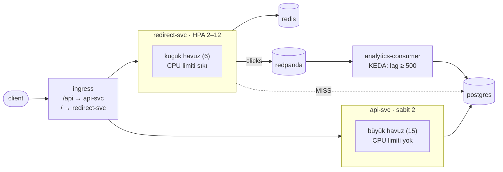

# 07 — services-autoscaling · "Servisleri ayır, otomatik ölçekle"

## 1. Bu seviye ne?

Tek uygulama üçe ayrıldı: **redirect-svc** (trafiğin ~%99'u, salt okuma), **api-svc** (yazma ve
yönetim) ve **analytics-consumer** (06'dan). Her birinin kendi replika sayısı, kendi bağlantı
havuzu, kendi kaynak limitleri ve kendi ölçekleme sinyali var: redirect CPU'ya göre (HPA),
tüketici **lag**'e göre (KEDA). Bu bir "mikroservis" tercihi değil — **her yük şekline kendi
düğmesini vermek**.

## 2. Mimari



Dışarıdan **hiçbir şey değişmedi**: aynı host, aynı URL uzayı, aynı sözleşme. *Servis sınırı
içeriye ait bir karardır; client'ları değiştirmeye zorluyorsa sınır yanlış yere çizilmiştir.*

## 3. Önceki seviyeden çözülenler

| ID | Sorun | Nasıl çözüldü |
|---|---|---|
| P06-02 | Tüketici gecikmesi (lag) elle yönetiliyordu | KEDA `ScaledObject`: tüketici **lag**'e göre 1→6 ölçekleniyor. CPU değil lag, çünkü CPU bir tüketici için yanlış sinyaldir — bir milyon olay beklerken boşta olabilir |

Bir madde daha var ama **listeye yazmıyorum** ve sebebi öğretici: P05-03'ü (yazıcının okumayla
aynı süreci paylaşması) 06 zaten çözmüştü. 07 onu **derinleştiriyor**: artık okuma ve yazma
YOLLARI da birbirinden ayrıldı. Çözülmüş bir sorunu tekrar sahiplenmek, merdivenin hesabını bozar.

## 4. Ayağa kaldırma

Platform bir kere kurulur (`cd platform && make minimal && make keda`). Sonra bu klasörde:

```bash
make up            # build → push → deploy → rollout wait → smoke
curl -s -XPOST http://lvl07.localtest.me/api/links -H 'Content-Type: application/json' -d '{"url":"https://example.com"}'
curl -I http://lvl07.localtest.me/<code>
make grafana       # Ladder klasörü, level=lvl07
make load S=mixed  # aynı senaryolar her seviyede: create redirect mixed hot-key burst abuser read-your-writes stairs scan
make down
```

Ölçeklemeyi izlemek için:
```bash
kubectl -n lvl07 get hpa,scaledobject -w
kubectl -n lvl07 get pods -l app.kubernetes.io/name=redirect -w
```

## 5. API

Her seviyede aynı: [docs/API.md](../docs/API.md). **Dışarıdan hiçbir fark yok** — ingress yol
tabanlı yönlendirme yapıyor (`/api` → api-svc, geri kalan → redirect-svc).

## 6. Reproduce edilebilir sorunlar

| ID | Sorun | Reproduce | Grafana'da | Çözüm |
|---|---|---|---|---|
| P07-01 | HPA gecikir: burst'te pod yok | `make repro P=P07-01` | Autoscaling → desired/current | seviye içi (tampon) |
| P07-02 | Ölçekleme darboğazı DB'ye taşır | `make repro P=P07-02` | Postgres → connections vs max | 09 |
| P07-03 | Yeni pod hazır ama soğuk | `make repro P=P07-03` | Autoscaling → pod yaşı vs p99 | seviye içi |
| P07-04 | CPU limiti = kota → throttling | `make repro P=P07-04` | Pods → CPU throttling (⚠ ortam) | seviye içi |
| P07-05 | Node kapasitesi bitti → Pending | `CONFIRM=1 make repro P=P07-05` | Autoscaling → Pending pod | (bulut: autoscaler) |
| P07-06 | **TRAP** N+1: maliyet sonuç kümesiyle orantılı | `make repro P=P07-06` | Postgres → DB queries by op | seviye içi · 14 |
| P07-07 | Node donunca yedeklilik işe yaramıyor | `CONFIRM=1 make repro P=P07-07` | Autoscaling → pod dağılımı | 10 |
| P07-08 | **TRAP** her zaman hazır diyen probe | `make repro P=P07-08` | Pods → hazır endpoint | seviye içi |

---

### P07-01 · HPA gecikir

**Belirti:** 5 rps'ten 1000 rps'e çıkan bir burst'te p99 fırlar; pod'lar yük **bittikten sonra** gelir.
**Neden:** Ölçekleme reaktiftir ve zincir uzundur: metrik toplama (15 sn) → HPA döngüsü (15 sn) →
schedule → imaj → süreç başlangıcı → readiness. [Topic · Konu: Reaktif ölçekleme, kapasite]

**Reproduce:** `make repro P=P07-01` — `burst` senaryosunu koşar, tepe p99 ile HPA'nın istediği ve
gerçekten hazır olan replika sayısını karşılaştırır.

**Grafana:** `09 · Autoscaling` → "HPA desired / current", "rps vs pod sayısı".
**Ders:** *Otomatik ölçekleme burst için değil, TREND için tasarlanmıştır.* Ani yük bir kapasite
sorunudur, bir otomasyon sorunu değil — `minReplicas`'ı tabanı karşılayacak kadar yüksek tutmak
"israf" değil, burst sigortasıdır.

---

### P07-02 · Ölçekleme darboğazı taşır, yok etmez

**Belirti:** HPA redirect'i 12 replikaya çıkarır; uygulama CPU'su rahatlar, **Postgres bağlantıları
tavana dayanır** ve havuz bekleme süresi büyür.
**Neden:** Her yeni pod kendi havuzunu açar. `12 × 6 + 2 × 15 + 10 = 112 > max_connections=100`.
[Topic · Konu: Paylaşılan kaynak, ölçeklenemeyen katman]

**Reproduce:** `make repro P=P07-02` — aritmetiği basar, `stairs` yükünü koşar, pod sayısı ile
DB bağlantılarını ve CPU'ları birlikte ölçer.

**Grafana:** `09 · Autoscaling` → "rps vs pod sayısı"; `05 · Postgres` → "connections vs max", "DB CPU".
**Nerede çözülüyor:** 09 (PgBouncer: yüzlerce uygulama bağlantısı → onlarca DB bağlantısı; okuma
replikaları). *Otomatik ölçekleme darboğazı görünmez yapmaz, taşır — ve taşıdığı yer genelde
ölçeklenemeyen yerdir.*

---

### P07-03 · Yeni pod "hazır" ama soğuk

**Belirti:** Ölçekleme anında p99 yükselir; en genç pod'lar en yavaştır.
**Neden:** readiness "süreç ayakta ve dinliyor" der; "havuzum açık, önbelleğim ısındı" demez.
[Topic · Konu: Soğuk başlangıç, readiness semantiği]

**Reproduce:** `make repro P=P07-03` — yük altında replika ekler ve pod bazında p99 dağılımını basar.

**Grafana:** `09 · Autoscaling` → "Pod yaşı vs p99"; `04 · Cache` → "hit ratio by pod".
**Bu seviyede maliyeti KÜÇÜK** — çünkü önbellek paylaşımlı (04). Aynı deney 03'te çok daha sert
olurdu: her yeni pod boş bellekle doğuyordu. *Mimarinin bir seviyede verdiği karar, üç seviye
sonraki bir sorunun şiddetini belirliyor.*
**Araçlar:** `startupProbe`, havuzda `MinConns`, ingress'te slow-start.

---

### P07-04 · CPU limiti bir kota'dır

**Belirti:** CPU kullanımı %50 görünürken p99 fırlar. Limit kaldırıldığında CPU artar ve p99 düşer.
**Neden:** CPU limiti, 100 ms'lik dilimlerde kullanılabilir çekirdek-zamanını sınırlar. Kota dilim
ortasında biterse süreç **bekler**. [Topic · Konu: CFS kotası, throttling]

**Reproduce:** `make repro P=P07-04` — aynı yükü limitli ve limitsiz koşup p99 ile CPU'yu karşılaştırır.

> **Ortam sınırı:** Bu kurulumdaki cAdvisor `container_cpu_cfs_throttled_*` metriğini **yayınlamıyor**
> (kind + Docker Desktop, cgroup v1). Throttling'i doğrudan okuyamıyoruz; bu yüzden script dolaylı
> kanıt kullanıyor: limitli/limitsiz p99 farkı. *Ölçemediğin şeyi, ölçebildiğin bir şeyle kuşatmak
> gözlemlenebilirliğin sık kullanılan bir tekniğidir* — ve bunu README'de yazmak, sessizce boş bir
> panele bakmaktan iyidir.

**Grafana:** `01 · Pods & Resources` → "CPU throttling" (bu ortamda boş), "CPU kullanımı".
**Kural:** Bellek limiti şarttır (OOM koruması). **CPU limiti çoğu zaman zarar verir**; `requests`
zaten planlamayı ve adil paylaşımı sağlar.

---

### P07-05 · Node kapasitesi bitince Pending

**Belirti:** HPA 10 replika ister, 4'ü çalışır, 6'sı Pending'de bekler. HPA bunu bilmez ve mutlu görünür.
**Neden:** HPA replika **sayısı** ister; yerleştirmek scheduler'ın işi. kind'da cluster autoscaler yok.
[Topic · Konu: Ölçekleme zinciri, kapasite]

**Reproduce:** `CONFIRM=1 make repro P=P07-05` — CPU isteğini büyütüp 10 replika ister, Pending
sayısını ve scheduler'ın mesajını basar.

**Grafana:** `09 · Autoscaling` → "Pending pod", "Node CPU allocatable vs requests".
**Ders:** Ölçekleme zinciri `metrik(15s) → HPA(15s) → scheduler → NODE(dakikalar) → imaj → başlangıç`.
*Kapasite planlaması bu zincirin en yavaş halkasına göre yapılır.*

---

### P07-06 · TRAP · N+1: maliyet sonuç kümesiyle orantılı

**Belirti:** 100 link listeleyen bir istek 101 sorgu yapar; süre beş katına çıkar.
**Neden:** Döngü içinde sorgu. Küçük veride görünmez; sayfa boyutunu büyüttüğün gün patlar.
[Topic · Konu: N+1, batch]

**Reproduce:** `make repro P=P07-06` — 100 link oluşturur, tuzak kapalı/açık süreyi ve DB sorgu
sayısını karşılaştırır.

**Grafana:** `05 · Postgres` → "DB queries by op"; `02 · App RED` → p99.
**Ders:** Sayfa boyutu bir ayar değil, bir **maliyet çarpanı** hâline gelir. Doğrusu tek toplu sorgu
(`WHERE code = ANY($1)`) ya da tek JOIN. **Servis ayrımı bunu kötüleştirir**: 101 fonksiyon çağrısı
101 **ağ** çağrısına dönebilir → 14'te gRPC + batch.

---

### P07-07 · Node donunca yedeklilik işe yaramıyor

**Belirti:** Bir worker `docker pause` ile dondurulduğunda istekler düşmeye başlar ve bu **dakikalarca** sürer.
**Neden:** Donmuş node'daki pod'lar Endpoints'te **kalır** — kubelet cevap vermiyor ama API server
pod'u hâlâ Ready sanıyor. `node-monitor-grace-period` (40 sn) + eviction timeout (5 dk) boyunca
trafik ölü pod'lara gider. [Topic · Konu: Düğüm arızası, sağlık algılama gecikmesi]

**Reproduce:** `CONFIRM=1 make repro P=P07-07` — node'u dondurur, NotReady süresini ve 5xx'i ölçer,

**Bu deney varsayılan olarak ATLANIR.** Node'un kubelet'ini donduruyor ve çözdükten sonra
containerd'nin PLEG'i ölü kalabiliyor — bir kez node 49 dakika `NotReady` kaldı, o node'daki
Chaos Mesh/Argo/KEDA pod'ları çürüdü ve sonraki bütün ölçümler bozuk bir kümede koştu.
Bilerek çalıştır: `FREEZE_NODE=1 CONFIRM=1 make repro P=P07-07`.
*Bir deneyin bedeli ortamın tamamıysa, onu varsayılan yapma.*
sonra çözer.

**Grafana:** `09 · Autoscaling` → "Pod dağılımı / node"; `02 · App RED` → 5xx.
**Nerede çözülüyor:** 10 (devre kesici + aktif sağlık kontrolü: *Kubernetes'in fark etmesini
beklemek yerine client'ın kendisi hızlı karar verir*). Ayrıca `topologySpread`'i `DoNotSchedule`
yapmak — ama o da kapasiteyi zorlar (P07-05).

---

### P07-08 · TRAP · Her zaman hazır diyen probe

**Belirti:** `TRAP_READY_ALWAYS` ile rollout sırasındaki 5xx sayısı artar.
**Neden:** Bir probe'un değeri **hayır diyebilmesindedir**. Sabit 200, Kubernetes'in elindeki tek
gerçek bilgiyi siler. [Topic · Konu: Probe semantiği]

**Reproduce:** `make repro P=P07-08` — aynı rollout'u varsayılan ve tuzaklı readiness ile koşup
5xx'leri karşılaştırır.

**Grafana:** `02 · App RED` → 5xx; `01 · Pods` → "hazır endpoint sayısı".
**Aynı kökten üç hata:** readiness'ı TCP kontrolüne indirgemek · `/healthz`'i readiness olarak
kullanmak (kapanışta hayır diyemez — 01'de ayırmıştık) · readiness'a bağımlılık koymak (P02-10).
Hepsi **probe'un ne sorduğunu tanımlamamaktan** doğuyor.

## 7. Seviye içi alıştırmalar (TRAP_ bayrakları)

| Bayrak | Ne yapar | Reproduce | Düzeltme |
|---|---|---|---|
| `TRAP_LIST_N_PLUS_ONE` | Liste yanıtında link başına stats sorgusu | `make repro P=P07-06` | Bayrağı kapat; toplu sorgu |
| `TRAP_READY_ALWAYS` | readiness sabit 200 | `make repro P=P07-08` | Bayrağı kapat |
| `TRAP_COMMIT_BEFORE_WRITE` · `TRAP_NO_DLQ` | (06'dan devam) | 06'da | — |

Elle denemeye değer:
- `kubectl -n lvl07 patch hpa redirect --type=json -p '[{"op":"replace","path":"/spec/behavior/scaleUp/stabilizationWindowSeconds","value":60}]'`
  sonra P07-01'i tekrar koş: ölçek-büyütmeyi yavaşlatmanın bedelini ölç.
- `rpk topic add-partitions clicks -n 6` sonra `make load S=hot-key` ile KEDA'nın tüketiciyi
  gerçekten ölçekleyebildiğini gör (P06-03 tavanı kalkınca KEDA anlam kazanır).
- api-svc'ye HPA ekle ve `make load S=create` koş: yazma yolunu ölçeklemenin DB'ye etkisi,
  okuma yolunu ölçeklemekten **farklıdır** (yazma replikaya dağıtılamaz).
- `DB_MAX_CONNS=2` yap ve `stairs` koş: havuzu küçültmek P07-02'yi çözmez, kuyruğu uygulamaya taşır
  (P02-06'nın aynısı). *Bir kaynağı paylaşan iki taraf varsa, sınırı tek taraftan koymak işe yaramaz.*

## 8. Gözlemlenebilirlik: hangi paneller dolu, hangileri boş

| Dashboard | Durum | Neden |
|---|---|---|
| `09 · Autoscaling` | **Dolu** ✨ | HPA desired/current, Pending pod, node kapasitesi, KEDA scaler değeri |
| `02 · App RED` | Dolu — **servis bazında** | Artık `redirect` ve `api` ayrı pod'lar; panelleri `pod` kırılımıyla oku |
| `08 · Stream` · `05 · Postgres` · `06 · Redis` · `04 · Cache` | Dolu | — |
| `01 · Pods` → "CPU throttling" | **Boş (ortam sınırı)** | cAdvisor bu kurulumda metriği yayınlamıyor — P07-04'teki nota bak |
| `11 · Resilience` · `12 · SLO` · `13 · Rollout` | Boş | — |

Bu seviyede dashboard okuma alışkanlığı değişiyor: tek bir "uygulama" yok artık. `app-red`'e
bakarken `pod` ya da `service` kırılımı olmadan bakmak, iki farklı yük şeklinin ortalamasını
almak demektir — ve ortalama, iki farklı dağılımı gizleyen en iyi araçtır.

## 9. Bilerek bırakılanlar

- **Postgres hâlâ tek ve havuz aritmetiği sınırda** (P07-02 → 09).
- **Redis hâlâ tek** (P04-01 → 14).
- **Tek partition** — KEDA 6 replikaya çıkabilir ama 1 partition tavanı var (P06-03).
- **api-svc'de HPA yok** — trafiği öngörülebilir kabul edildi; bu bir varsayımdır ve yanlış olabilir.
- **Servisler arası çağrı yok** (N+1 tuzağı hariç): 14'te gRPC ile gelecek.
- **Hız sınırı hâlâ süreç içi** ve artık **iki ayrı serviste** — yani P02-04 daha da kötüleşti (08).
- **Kaynak istekleri tahmini**: gerçek profil ölçülmedi; VPA önerileri 14'te.

## 10. `make diff-prev` okuma rehberi

`make diff-prev` 06 ile farkı gösterir:

1. **`cmd/linkly/` SİLİNDİ**, yerine `cmd/redirect-svc/` ve `cmd/api-svc/` geldi. İki `main.go`'nun
   büyük kısmı **aynı** — ve bu kasıtlı: ortak kod `internal/`'da, farklı olan yalnızca hangi
   handler'ın bağlandığı ve hangi ayarların verildiği.
2. **`internal/httpapi/split.go`** (yeni): `RedirectHandler` ve `APIHandler`. Ayrım bir **yönlendirme
   tablosu** meselesi; iş mantığı bölünmedi.
3. **`deploy/redirect-svc.yaml` vs `deploy/api-svc.yaml`**: asıl fark burada.
   Karşılaştırmalı oku — `DB_MAX_CONNS` 6 vs 15, replika 2–12 (HPA) vs sabit 2, CPU limiti var vs yok.
   **Aynı kod, zıt ayarlar.** Tek deployment bu iki ayarı aynı anda taşıyamazdı.
4. **`deploy/keda.yaml`** (yeni): tüketici CPU'ya değil **lag**'e göre ölçekleniyor.
   *Ölçeklemeyi, toplaması en kolay metriğe göre değil, kullanıcıya görünen sorunu kodlayan
   metriğe göre yap.*
5. **`deploy/ingress.yaml`**: yol tabanlı yönlendirme. Dışarıdan hiçbir şey değişmedi — servis
   sınırının doğru çizildiğinin kanıtı.
