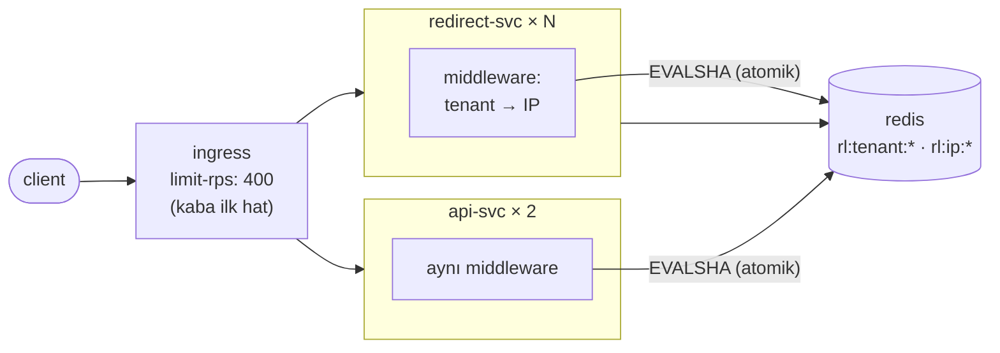

# 08 — rate-limiting · "Gürültülü komşu"

## 1. Bu seviye ne?

Hız sınırı süreç belleğinden çıktı: artık Redis'te, tek bir Lua betiğiyle atomik olarak
değerlendirilen **paylaşılan** bir sayaç. Limit, replika sayısından bağımsız hâle geldi (P01-05 →
P02-04 → P07: her seviyede kötüleşen borç burada kapanıyor). İki anahtar var — **kiracı** ve **IP** —
ve ingress'te kaba bir ilk hat. Karşılığında: her isteğe iki ağ çağrısı ve limiter'ın kendi
bağımlılığı.

## 2. Mimari



Katmanlı: ingress **kaba** (yalnızca IP'yi bilir), uygulama **ince** (kiracıyı, ucu, maliyeti bilir).
*Tek katmana güvenmek, ya çok gevşek ya çok sıkı olmak demektir.*

## 3. Önceki seviyeden çözülenler

| ID | Sorun | Nasıl çözüldü |
|---|---|---|
| P07-06 | N+1: liste maliyeti sonuç kümesiyle orantılı | **Çözülmüş SAYILMAZ:** bu bir `TRAP_` alıştırması ve tuzak 08'de de duruyor (varsayılan kapalı). Script tuzağı kendisi açtığı için her seviyede reproduce olur — bu yüzden `SOLVES` dosyasında YER ALMAZ. Kalıcı çözüm 14'te (toplu sorgu / gRPC batch). |

Ama asıl kapanan borç **listede görünmüyor**, çünkü üç seviye boyunca taşındı: P01-05 (süreç içi
limit yanlış), P02-04 (3 replikada 3 katı), P07 (iki serviste ayrı ayrı). Bir sorunu "bir sonraki
seviyede" diye ertelediğinde faizi replika sayısıyla birlikte büyür — `problems/SOLVES` yalnızca
bir önceki seviyeyi kapsadığı için bu borç orada görünmez; **README'nin görevi onu görünür tutmaktır.**

## 4. Ayağa kaldırma

İlk kez mi? Önce kök README'deki [Sıfırdan başlangıç](../README.md#sıfırdan-başlangıç) — platform bir kez kurulur (`cd platform && make full`).
Bu seviyenin platformdan istediği: **temel yığın (kind, ingress, Prometheus, Grafana) + Chaos Mesh, KEDA**. `make up` ilk adımda (profil) bunları açar ve kullanılmayanları kapatır; bir bileşen kurulu değilse hangi komutla kurulacağını söyleyip durur.

```bash
make up            # profil → build → push → deploy → rollout wait → smoke
code=$(curl -s -XPOST http://lvl08.localtest.me/api/links -H 'Content-Type: application/json' -d '{"url":"https://example.com"}' | jq -r .code); echo "$code"
curl -s -o /dev/null -w '%{http_code} → %{redirect_url}\n' http://lvl08.localtest.me/$code   # 302 → https://example.com
make grafana       # Ladder klasörü, level=lvl08 — giriş: admin / ladder
make load S=mixed  # aynı senaryolar her seviyede: create redirect mixed hot-key burst abuser read-your-writes stairs scan
make repro P=P08-01   # §6'daki bir sorunu otomatik üret → REPRODUCED / NOT-REPRODUCED
make env           # açık ayar/tuzaklar · değiştir: make set E="KEY=değer" · hepsini geri al: make reset (§7)
make down          # seviyeyi kaldır · kümeyi durdurmak için: make -C ../platform stop
```

Limit durumunu görmek için:
```bash
kubectl -n lvl08 exec -it $(kubectl -n lvl08 get pod -l app.kubernetes.io/name=redis -o name) -c redis -- redis-cli --scan --pattern 'rl:*' | head
```

## 5. API

Her seviyede aynı: [docs/API.md](../docs/API.md).

Yeni yanıt başlıkları: `429` durumunda `Retry-After`, `X-RateLimit-Limit` ve **`X-RateLimit-Scope`**
(`ip` mi `tenant` mı reddetti). *Bir client'a "ne zaman tekrar dene" demeyen bir limit, onu daha
agresif denemeye iter: sınırlama, iletişim kurmayı gerektirir.*

## 6. Reproduce edilebilir sorunlar

| ID | Sorun | Reproduce | Grafana'da | Çözüm |
|---|---|---|---|---|
| P08-01 | Limiter'ın kendi bağımlılığı: fail-open mı closed mı | `CONFIRM=1 make repro P=P08-01` | Rate limit → limiter hata/s | karar + alarm (11) |
| P08-02 | Her isteğe +2 Redis gidiş-gelişi | `make repro P=P08-02` | Rate limit → check duration | seviye içi (pipeline) |
| P08-03 | **TRAP** XFF: adaletsiz mi, etkisiz mi? | `make repro P=P08-03` | Rate limit → decisions by key | seviye içi |
| P08-04 | Sabit pencere sınırında 2× burst | `make repro P=P08-04` | Rate limit → kabul edilen rps | seviye içi (kayan pencere) |
| P08-05 | **TRAP** global anahtar = Redis hot key | `make repro P=P08-05` | Redis → CPU | seviye içi (parçalama) |
| P08-06 | Gürültülü komşu izole ediliyor mu? | `make repro P=P08-06` | Rate limit → normal vs abuser p99 | 13 (tier kotaları) |

---

### P08-01 · Limiter'ın kendi bağımlılığı

**Belirti:** Redis durdurulduğunda, `RATE_LIMIT_FAIL_OPEN=true` ile hizmet sürer ama **koruma
kalkar**; `false` ile koruma çalışır ama **herkes reddedilir**.
**Neden:** Korumayı paylaşılan duruma taşıdın; artık koruma da arızalanabilir.
[Topic · Konu: Fail-open/closed, bağımlılık zinciri]

**Reproduce:** `CONFIRM=1 make repro P=P08-01` — normal, fail-open ve fail-closed davranışını
sırayla ölçer.

**Grafana:** `10 · Rate limit` → "limiter backend hata/s"; `06 · Redis` → `redis_up`.
**Seçim ve gerekçesi:** fail-open **+ alarm**. Korumayı kaybetmek telafi edilebilir (kötü client
bir süre geçer); hizmeti kaybetmek edilemez. Ama bu seçim bir **borç** yaratır: *"limiter devre
dışı" alarmı olmak zorunda*, yoksa korumasız kaldığını fark etmezsin — 11'de bu alarm SLO'lardan
türeyecek. Azaltma: yerel, daha gevşek bir yedek limiter (koruma tamamen kalkmasın, gevşesin).
**Üçüncü seçenek "hiç düşünmemek"tir** ve o zaman kararı kütüphanenin varsayılanı verir.

---

### P08-02 · Her isteğe iki ağ çağrısı

**Belirti:** Limit kontrolü isteğin gecikmesinin ölçülebilir bir yüzdesini alıyor.
**Neden:** 07'de bellekteki bir map'ti (~100 ns); şimdi kiracı + IP için iki Redis çağrısı.
[Topic · Konu: Doğruluk/gecikme takası]

**Reproduce:** `make repro P=P08-02` — `ratelimit_check_duration_seconds` ile toplam istek süresini
ve istek başına Redis komut sayısını karşılaştırır (beklenen ~3: 1 önbellek + 2 limit).

**Grafana:** `10 · Rate limit` → "check duration"; `06 · Redis` → "ops/s".
**Azaltma:** pipeline ile tek gidiş-gelişte iki kontrol · pod'da kısa ömürlü token tamponu
(doğruluktan ödün) · ucuz reddi ingress'e bırakmak. *Sıcak yolda yapılan her "küçük" kontrol
p50'ye doğrudan eklenir.*

---

### P08-03 · TRAP · X-Forwarded-For'u yanlış okumanın iki yolu

| Yanlış | Sonuç |
|---|---|
| `TRAP_IGNORE_XFF` — soket adresini oku | Herkes ingress IP'sinde **tek kovada**: bir kötü client herkesi limitler → **adaletsiz** |
| `TRAP_TRUST_ANY_XFF` — ilk girdiye güven | Client kendi kovasını seçer → limit **isteğe bağlı**, yani **etkisiz** |
| **Doğru** — sağdan `TRUSTED_PROXY_HOPS` kadar geri say | Yalnızca kendi proxy'nin eklediğine güven |

**Neden:** XFF, client'ın başlatabildiği bir listedir. Güvenilir tek kısmı **senin** proxy'lerinin
eklediğidir. [Topic · Konu: Güven sınırı]

**Reproduce:** `make repro P=P08-03` — üç modu da `abuser` senaryosuyla koşup 429 sayılarını
karşılaştırır. Birim test: `internal/httpapi/clientip_test.go`.

**Grafana:** `10 · Rate limit` → "decisions by key type".
**Ders:** İki hata da *"XFF'i okuduk"* diye rapor edilir; fark **hangi girdiyi** okuduğundadır.
Güven sınırını yazıya dök: kaç proxy var, hangisi senin? Gerisi **veridir, kanıt değil**.

---

### P08-04 · Sabit pencere sınırında 2× burst

**Belirti:** Sabit pencere sayacıyla, iki pencerenin sınırında limitin iki katı geçer.
**Neden:** 10 sn'lik pencerede 300 limit varsa, 9.9. saniyede 300 ve 10.1. saniyede 300 daha →
0.2 saniyede 600. [Topic · Konu: Pencere algoritmaları]

**Reproduce:** `make repro P=P08-04` — pencere sınırına denk gelen burst'te kabul edilen tepe hızı ölçer.

**Grafana:** `10 · Rate limit` → "Kabul edilen rps (sınır testi)".
**Çözüm (uygulanmış):** kayan pencere sayacı — önceki pencerenin sayımı, mevcut pencerede ne kadar
ilerlediğine göre **ağırlıklandırılır** (`internal/ratelimit/redis.go`'daki Lua).
**Alternatifler:** sliding window **log** (her isteğin zaman damgası — kesin ama pahalı) ve
**token bucket** (patlamaya izin verir, ortalamayı korur). Seçim şu soruyla yapılır: *burst'e izin
var mı?*

---

### P08-05 · TRAP · Global anahtar = Redis hot key

**Belirti:** "Tüm sistem için saniyede N istek" kuralı açıldığında limit kontrolünün gecikmesi ve
Redis CPU'su yükselir.
**Neden:** Her istek **tek** bir Redis anahtarına yazar; Redis tek iş parçacıklıdır.
[Topic · Konu: Hot key, paylaşılan sayaç]

**Reproduce:** `make repro P=P08-05` — dağıtık anahtar ve global anahtar modlarını karşılaştırır.

**Grafana:** `06 · Redis` → "Redis CPU", "commands by type".
**Çözüm:** anahtarı **parçala** (`global:0..15`, rastgele seç, limiti 16'ya böl) — kesinlikten biraz
ödün, sıcak anahtardan kurtuluş.
**Aynı fizik, üçüncü kez:** 02'de DB satırı (P02-08), 04'te önbellek anahtarı (P04-03), şimdi limit
sayacı. *Paylaşılan durumda "tek sayaç" istemek, tek bir CPU çekirdeğine ölçeklenmek demektir.*

---

### P08-06 · Gürültülü komşu izole ediliyor mu?

**Belirti/Beklenti:** Kötü client 429 yer, normal client'ın p99'u bozulmaz.
**Neden bu seviyenin asıl sorusu:** Hız sınırının amacı kapasiteyi korumak **değil**, **adaleti**
korumaktır. [Topic · Konu: Adalet, izolasyon]

**Reproduce:** `make repro P=P08-06` — `abuser` senaryosu (1 açgözlü + N normal client), IP ve
kiracı bazlı retleri ve normal client p99'unu raporlar.

**Grafana:** `10 · Rate limit` → "normal client p99 vs abuser".
**İki anahtarın rolü farklı:** IP limiti tek bir saldırganı; kiracı limiti bir müşterinin **tüm
altyapısını** (birçok IP) sınırlar. Yalnızca IP'ye bakmak dağıtık bir client'ı görmez.
**Eksik kalan:** müşteriye göre farklı kotalar (tier). Onun için önce **kimlik** gerekir → 13.

## 7. Seviye içi alıştırmalar (TRAP_ bayrakları)

> **Nasıl uygulanır:** aç `make set E="TRAP_X=true"` · ne açık? `make env` · hepsini geri al `make reset` (ortamı `deploy/`'daki hâline döndürür; `make unset E=TRAP_X` yalnızca siler). Tablodaki diğer ayarlar da aynı yolla (`make set E="CACHE_TTL=1h"`). Pod'lar yeni değerle yeniden başlar; komut hazır olunca döner. Varsayılan olarak seviyenin TÜM uygulama servislerine uygulanır (tek servis: `W=redirect`); 12'den itibaren Argo Rollout'larda da çalışır — `kubectl set env` orada çalışmaz. `make repro` scriptleri tuzağı KENDİLERİ açıp kapatır ve bitince ortamı eski hâline getirir (senin açtıkların dahil): elle alıştırma için `make set` + `make load`, otomatik ölçüm için `make repro`. Bitirince `make reset`: açık kalan bir tuzak sonraki deneyi sessizce bozar.

| Bayrak | Ne yapar | Reproduce | Düzeltme |
|---|---|---|---|
| `TRAP_IGNORE_XFF` | XFF'i yok sayar (herkes tek kovada) | `make repro P=P08-03` | Bayrağı kapat |
| `TRAP_TRUST_ANY_XFF` | XFF'in ilk girdisine güvenir | `make repro P=P08-03` | Bayrağı kapat |
| `TRAP_GLOBAL_LIMIT` | Tek global anahtar kullanır | `make repro P=P08-05` | Bayrağı kapat / parçala |
| `TRAP_LIST_N_PLUS_ONE` · `TRAP_READY_ALWAYS` | (07'den devam) | 07'de | — |

Elle denemeye değer:
- `RATE_LIMIT_PER_IP=20` yap ve normal tarayıcıyla gez: kendi limitini yemek, limitin kullanıcıya
  nasıl hissettirdiğini anlamanın en hızlı yolu. `Retry-After` başlığına bak.
- `RATE_LIMIT_WINDOW=60s` yap: uzun pencere daha adil ama daha az tepkisel; kısa pencere tersi.
  **Pencere uzunluğu, "ne kadar hızlı tepki verelim" ile "ne kadar adil olalım" arasındaki düğmedir.**
- Ingress limitini kaldır (`limit-rps` annotasyonunu sil) ve `abuser` koş: uygulamaya ulaşan
  istek sayısındaki farkı ölç. *Reddedilen en ucuz istek, hiç gelmeyen istektir.*
- İki servisi karşılaştır: `make load S=create` ile api-svc'yi zorla. Aynı limitler her iki
  serviste de geçerli — çünkü sayaç paylaşımlı. 07'de olsaydı iki ayrı limit olurdu.

## 8. Gözlemlenebilirlik: hangi paneller dolu, hangileri boş

| Dashboard | Durum | Neden |
|---|---|---|
| `10 · Rate limit` | **Dolu** ✨ | `decision` × `key_type` kırılımı, limiter hataları, kontrol süresi |
| `06 · Redis` | Dolu | Artık hem önbellek hem limiter aynı Redis'te — **komut dağılımına bak** |
| `09 · Autoscaling` · `08 · Stream` · `05 · Postgres` · `04 · Cache` | Dolu | — |
| `11 · Resilience` · `12 · SLO` · `13 · Rollout` | Boş | — |

Yeni okuma alışkanlığı: `ratelimit_decisions_total`'a **yalnızca toplam** olarak bakmak yanıltır.
`key_type` kırılımı olmadan "çok 429 var" cümlesi eyleme dönüşmez — IP mi kiracı mı reddetti,
tamamen farklı iki sorun.

## 9. Bilerek bırakılanlar

- **Redis hem önbellek hem limiter** — tek arıza noktası iki işi birden düşürür (P08-01 → 14'te ayrı örnek).
- **Kimlik yok**: kiracı hâlâ `X-Tenant-ID` header'ından. Tier kotaları için gerçek kimlik şart (13).
- **Sabit kotalar**: her kiracıya aynı limit. Gerçekte müşteri planına göre değişir.
- **Ingress limiti kaba**: yol/metot ayrımı yok — `POST /api/links` ile `GET /{code}` aynı kovada.
- **404 taramasına özel limit yok**: enumeration için ayrı bir kural gerekir (13, P13-06).
- **Yerel yedek limiter yok**: Redis düşünce koruma tamamen kalkıyor (P08-01'in azaltması).
- **07'den devreden**: tek Postgres + havuz aritmetiği (09), tek partition (06), tek Redis (14).

## 10. `make diff-prev` okuma rehberi

`make diff-prev` 07 ile farkı gösterir:

1. **`internal/ratelimit/redis.go`** (yeni): asıl ders **Lua betiğinin kendisi**. Neden client
   tarafında `GET` + karar + `SET` değil? Çünkü hız sınırlama paylaşılan durumda bir
   oku-değiştir-yaz'dır ve client tarafındaki kontrol **yapısı gereği** bir yarıştır.
   *Limit, her pod'un ayrı ayrı sahip olduğu bir kanaat olmaktan çıkıp bir olgu hâline geliyor.*
2. **`internal/httpapi/clientip.go`** (yeni): 20 satır kod, üç farklı güvenlik sonucu. Yorumlarda
   üç seçeneğin tablosu var.
3. **`internal/ratelimit/ratelimit.go` DURUYOR**: süreç içi limiter silinmedi, **yedek** olarak
   kaldı. Bu kararsızlık değil — testlerin ve Redis'siz çalıştırmanın sürmesini sağlıyor ve
   dağıtık limiter'ın bir **yükseltme** olduğunu belgeliyor.
4. **`deploy/ingress.yaml`**: `limit-rps` + `use-forwarded-headers`. İki katmanlı savunmanın
   ucuz yarısı burada.
5. **`deploy/*-svc.yaml`**: `RATE_LIMIT_PER_IP` artık **pencere başına**, pod başına değil.
   Aynı ortam değişkeni adı, tamamen farklı bir anlam — bu yüzden yorumda açıkça yazıyor.
