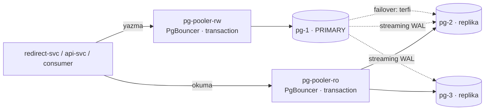

# 09 — database-scaling · "Veritabanı darboğazı"

## 1. Bu seviye ne?

Postgres artık bir operatörle yönetiliyor: **primary + 2 replika**, otomatik failover, önünde
**PgBouncer** (Pooler) ve arkasında partition'lı bir saklama politikası. Uygulama okumayı
replikalara, yazmayı primary'ye gönderiyor. 02'nin iki büyük açığı kapanıyor (bağlantı duvarı ve
tek nokta arıza) — ve yerine **ancak replikan olduğunda sahip olabileceğin** sorunlar geliyor:
replikasyon gecikmesi, read-your-writes, failover penceresi, havuzlama tuzakları.

## 2. Mimari



Çoğullama oranı 25:1 — 500 uygulama bağlantısı, 20 gerçek arka uç bağlantısı. `max_connections`
**bilerek 100'de bırakıldı**: Pooler'ın neden gerektiğini aynı sayıyla görmek için.

## 3. Önceki seviyeden çözülenler

| ID | Sorun | Nasıl çözüldü |
|---|---|---|
| P02-02 | Havuz taşması: replika × pool > max_connections | PgBouncer transaction pooling: uygulama tarafı bol (500), DB tarafı az (20). Replika sayısı artık `max_connections`'ı ilgilendirmiyor |
| P02-03 | DB tek nokta, failover yok | CNPG `Cluster{instances: 3}` + otomatik terfi. Kesinti **sıfırlanmadı**, süresi ve insan müdahalesi ortadan kalktı (P09-02 pencereyi ölçüyor) |

Ayrıca P07-02 (ölçeklemenin darboğazı DB'ye taşıması) büyük ölçüde kapandı: redirect artık 20
bağlantılık havuzla çalışabiliyor çünkü gerçek DB bağlantısı Pooler'da sabit.

## 4. Ayağa kaldırma

İlk kez mi? Önce kök README'deki [Sıfırdan başlangıç](../README.md#sıfırdan-başlangıç) — platform bir kez kurulur (`cd platform && make full`).
Bu seviyenin platformdan istediği: **temel yığın (kind, ingress, Prometheus, Grafana) + Chaos Mesh, KEDA, CloudNativePG**. `make up` ilk adımda (profil) bunları açar ve kullanılmayanları kapatır; bir bileşen kurulu değilse hangi komutla kurulacağını söyleyip durur.

```bash
make up            # profil → build → push → deploy → rollout wait → smoke
code=$(curl -s -XPOST http://lvl09.localtest.me/api/links -H 'Content-Type: application/json' -d '{"url":"https://example.com"}' | jq -r .code); echo "$code"
curl -s -o /dev/null -w '%{http_code} → %{redirect_url}\n' http://lvl09.localtest.me/$code   # 302 → https://example.com
make grafana       # Ladder klasörü, level=lvl09 — giriş: admin / ladder
make load S=mixed  # aynı senaryolar her seviyede: create redirect mixed hot-key burst abuser read-your-writes stairs scan
make repro P=P09-01   # §6'daki bir sorunu otomatik üret → REPRODUCED / NOT-REPRODUCED
make env           # açık ayar/tuzaklar · değiştir: make set E="KEY=değer" · hepsini geri al: make reset (§7)
make down          # seviyeyi kaldır · kümeyi durdurmak için: make -C ../platform stop
```

Kümeye bakmak için:
```bash
kubectl -n lvl09 get cluster,pooler,pods -l cnpg.io/cluster=pg
kubectl -n lvl09 get pods -l cnpg.io/cluster=pg -L cnpg.io/instanceRole   # kim primary?
```

## 5. API

Her seviyede aynı: [docs/API.md](../docs/API.md). Dışarıdan değişiklik yok.

**Ama garanti değişti**: `GET /{code}` artık bir replikadan cevaplanabilir, yani **birkaç yüz
milisaniye geçmişten** okuyor olabilir. Yazma sonrası `STICKY_WINDOW` (2 sn) boyunca okumalar
primary'ye yapışır — bu, read-your-writes'ı yaygın durumda korur (aynı pod, aynı client).

## 6. Reproduce edilebilir sorunlar

| ID | Sorun | Reproduce | Grafana'da | Çözüm |
|---|---|---|---|---|
| P09-01 | Read-your-writes ihlali | `make repro P=P09-01` | App Business → RYW ihlali | seviye içi (sticky) |
| P09-02 | Failover penceresi anlık değil | `CONFIRM=1 make repro P=P09-02` | Postgres → replication/roles | 10 (retry+idempotency) |
| P09-03 | **TRAP** prepared statement + transaction pooling | `make repro P=P09-03` | Postgres → result=error | seviye içi |
| P09-04 | Replikada uzun okuma ↔ WAL çakışması | `make repro P=P09-04` | Postgres → lag, dead tuples | pazarlık (feedback) |
| P09-05 | Silme pahalı: partition'sız retention | `make repro P=P09-05` | Postgres → dead tuples | seviye içi (partition) |
| P09-06 | Replikasyon yedek değildir | `CONFIRM=1 make repro P=P09-06` | Postgres → lag | 14 (game day) |

---

### P09-01 · Read-your-writes ihlali

**Belirti:** Kullanıcı link oluşturur, hemen tıklar ve **kendi yarattığı link için 404** alır.
**Neden:** Replika, primary'nin *daha önceki bir ana* ait kopyasıdır. Oraya gönderilen her okuma
geçmişten bir okumadır. [Topic · Konu: Replikasyon gecikmesi, tutarlılık]

**Reproduce:** `make repro P=P09-01` — `read-your-writes` senaryosunu yapışkan okuma açık/kapalı
koşar, ikinci turda replikaya gecikme enjekte eder.

**Grafana:** `03 · App Business` → "Read-your-writes ihlali"; `05 · Postgres` → "replication lag".
**Çözümler ve bedelleri:**

| Yaklaşım | Bedeli |
|---|---|
| Yapışkan okuma *(uygulanmış)* | Yazma sonrası N sn okuma ölçeklenmesinden ödün; yalnızca aynı pod'u kapsar |
| Senkron replikasyon | Yazma gecikmesi en yavaş replikaya bağlanır |
| LSN takibi | En doğru, en karmaşık: client yazmanın LSN'ini taşır |
| Yeni kaydı önbelleğe yaz | Ucuz ama yalnızca önbellek isabetinde — 03'te bunu **bilerek** yapmamıştık |

*"Eventual consistency" bir kullanıcıya yapılabilecek en kötü savunmadır: 404 gördüğü an sistem
onun için bozuktur.*

---

### P09-02 · Failover penceresi

**Belirti:** Primary öldürüldüğünde ~10–30 saniye yazma yapılamaz, sonra sistem kendini toparlar.
**Neden:** Terfi anlık değildir: WAL uygulaması, rol ilanı, istemcilerin yeni adrese yönlenmesi.
[Topic · Konu: HA, failover, SLO]

**Reproduce:** `CONFIRM=1 make repro P=P09-02` — yük altında primary'yi siler, terfi süresini ve
5xx'i ölçer.

**Grafana:** `05 · Postgres` → connections/roles; `02 · App RED` → 5xx.
**02 ile fark:** Orada kesinti **insan müdahalesine kadar** sürüyordu. Burada saniyeler — ama sıfır
değil ve olamaz.
**Uygulama tarafında gereken:** yazma hatalarında retry **+ idempotency**. Retry idempotent değilse
failover çift kayıt üretir — 06'daki `processed_events` deseninin yazma yolundaki karşılığı.
*SLO yazarken: "failover var" cümlesi "%100 erişilebilirlik" anlamına gelmez.*

---

### P09-03 · TRAP · Prepared statement + transaction pooling

**Belirti:** `prepared statement "stmtcache_..." does not exist` — **aralıklı**, yük arttıkça sıklaşan.
**Neden:** PgBouncer transaction modunda bağlantı sana yalnızca bir işlem süresince aittir. pgx bir
arka uç bağlantısında hazırlar, başka birinde çalıştırır. [Topic · Konu: Bağlantı çoğullama]

**Reproduce:** `make repro P=P09-03` — `QueryExecModeExec` (varsayılan) ve prepared modu karşılaştırır.

**Grafana:** `05 · Postgres` → "DB queries by op" (`result=error`).
**Genel ders:** *Bağlantıları çoğullayan bir proxy, "bağlantı"nın ne demek olduğunu değiştirir.*
Bağlantı kimliğine dayanan her özellik yeniden gözden geçirilmeli: prepared statement · oturum
değişkenleri (`SET`) · `LISTEN/NOTIFY` · geçici tablolar · advisory lock.
**Seçenekler:** client tarafı exec modu *(uygulanmış)* · PgBouncer'da `max_prepared_statements>0` ·
session pooling (çoğullama oranını, yani Pooler'ı almanın sebebini kaybedersin).

---

### P09-04 · Replikada uzun okuma ↔ WAL çakışması

**Belirti:** `canceling statement due to conflict with recovery` — ya da `hot_standby_feedback=on`
ile: çakışma yok, ama primary'de vacuum gecikir ve şişme artar.
**Neden:** Replika WAL'i uygulamak zorundadır; uzun bir okuma, silinmesi gereken satırları tutar.
[Topic · Konu: Replika çakışmaları, vacuum]

**Reproduce:** `make repro P=P09-04` — replikada uzun sorgu başlatıp primary'de yoğun yazma+vacuum
yapar, `pg_stat_database_conflicts`'i okur.

**Grafana:** `05 · Postgres` → "replication lag", "dead tuples".
**Ders:** *Bir replika "ücretsiz okuma kapasitesi" değildir.* Primary ile arasında bir pazarlık
vardır (`hot_standby_feedback`) ve pazarlığın hangi tarafını seçtiğini bilmezsen, seni o taraf bulur.

---

### P09-05 · Silme pahalı: partition'sız retention

**Belirti:** 500 bin satırlık `DELETE` uzun sürer, ölü satır bırakır ve **tablo küçülmez**.
Bir partition'ı `DROP` etmek milisaniyeler sürer ve borç bırakmaz.
**Neden:** MVCC'de silinen satır "ölü" olarak kalır; yeri vacuum sonrası kullanılabilir, diske geri
vermek `VACUUM FULL` (tam kilit) ister. [Topic · Konu: Partition, retention, MVCC]

**Reproduce:** `make repro P=P09-05` — düz tabloda DELETE maliyetini, partition'lı tabloda DROP
maliyetiyle karşılaştırır.

**Grafana:** `05 · Postgres` → "dead tuples".
**Ders:** *Saklama süresi bir şema kararıdır, bir zamanlanmış iş değil.* Tabloyu zamana göre
bölersen silmek ücretsizleşir; bölmezsen her gece koşan bir `DELETE` cron'uyla ve onun vacuum
borcuyla yaşarsın.

---

### P09-06 · Replikasyon yedek değildir

**Belirti:** Bir satır silindiğinde replikalarda da **saniyeler içinde** yok olur.
**Neden:** Replikasyon hatayı da kopyalar. [Topic · Konu: Yedekleme, PITR]

**Reproduce:** `CONFIRM=1 make repro P=P09-06` — test linkini siler ve replikada da kaybolduğunu gösterir.

**Grafana:** `05 · Postgres` → replication lag.
**Ders:** *Yedek, zamanda geri gitme yeteneğidir; replika ise zamanda ileri gitmenin kopyasıdır.*
Gerçek koruma üç ayaklıdır: (1) sürekli WAL arşivleme, (2) periyodik temel yedek, (3) **düzenli
geri yükleme tatbikatı**. Üçüncüsü olmadan ilk ikisi bir temennidir — bu yüzden bu seviyede nesne
deposu **bilerek yapılandırılmadı**: yedeklemeyi "açmak" bir YAML bloğu; asıl mesele tatbikat ve o
14'teki game day'de.

## 7. Seviye içi alıştırmalar (TRAP_ bayrakları)

> **Nasıl uygulanır:** aç `make set E="TRAP_X=true"` · ne açık? `make env` · hepsini geri al `make reset` (ortamı `deploy/`'daki hâline döndürür; `make unset E=TRAP_X` yalnızca siler). Tablodaki diğer ayarlar da aynı yolla (`make set E="CACHE_TTL=1h"`). Pod'lar yeni değerle yeniden başlar; komut hazır olunca döner. Varsayılan olarak seviyenin TÜM uygulama servislerine uygulanır (tek servis: `W=redirect`); 12'den itibaren Argo Rollout'larda da çalışır — `kubectl set env` orada çalışmaz. `make repro` scriptleri tuzağı KENDİLERİ açıp kapatır ve bitince ortamı eski hâline getirir (senin açtıkların dahil): elle alıştırma için `make set` + `make load`, otomatik ölçüm için `make repro`. Bitirince `make reset`: açık kalan bir tuzak sonraki deneyi sessizce bozar.

| Bayrak | Ne yapar | Reproduce | Düzeltme |
|---|---|---|---|
| `TRAP_NO_STICKY` | Yazma sonrası yapışkan okumayı kapatır | `make repro P=P09-01` | Bayrağı kapat |
| `TRAP_PREPARED_STATEMENTS` | pgx'i prepared moduna zorlar | `make repro P=P09-03` | Bayrağı kapat |
| `TRAP_GLOBAL_LIMIT` · `TRAP_IGNORE_XFF` · `TRAP_TRUST_ANY_XFF` | (08'den devam) | 08'de | — |

Elle denemeye değer:
- `DATABASE_URL_RO`'yu boşalt: okuma/yazma ayrımı kapanır, 09'un **tüm yeni sorunları kaybolur** —
  ve okuma ölçeklenmesi de. *Tek bir env değişkeni, bir mimari kararın tamamını geri alıyor;
  takasın bu kadar görünür olması iyi bir tasarım işaretidir.*
- `default_pool_size`'ı 2'ye düşür: çoğullama oranı artar, ama işlemler PgBouncer'da kuyruğa girer.
  P02-06'nın aynısını bu kez **proxy'de** görürsün. *Kuyruğu bir katman aşağı itmek, yok etmek değildir.*
- `kubectl -n lvl09 cnpg promote pg pg-2` (plugin varsa) ile planlı bir failover yap: plansız
  olanla süresini karşılaştır.
- `STICKY_WINDOW=30s` yap ve `make load S=mixed` koş: RYW ihlali biter, ama okumaların büyük kısmı
  primary'ye gider — replikalar boşta kalır. **Tutarlılık ile ölçeklenme arasındaki düğme budur.**

## 8. Gözlemlenebilirlik: hangi paneller dolu, hangileri boş

| Dashboard | Durum | Neden |
|---|---|---|
| `05 · Postgres` | **Zenginleşti** ✨ | CNPG PodMonitor: replication lag, roller, WAL; ayrıca `db_reads_routed_total` |
| `03 · App Business` | Dolu — **RYW ihlali artık gerçek** | 09'a kadar bu sayaç hep 0 idi |
| `10 · Rate limit` · `09 · Autoscaling` · `08 · Stream` · `04 · Cache` · `06 · Redis` | Dolu | — |
| `11 · Resilience` · `12 · SLO` · `13 · Rollout` | Boş | — |

Yeni okuma alışkanlığı: `db_reads_routed_total{target}`. Okumaların ne kadarı replikaya gidiyor?
Oran beklenenden düşükse ya sticky pencere çok uzun ya da replikalar sağlıksız — ve ikisi de
"DB yavaş" diye rapor edilir.

## 9. Bilerek bırakılanlar

- **Nesne deposu / PITR yapılandırılmadı** (P09-06 → 14 game day).
- **`max_connections` hâlâ 100** — Pooler olmasa duvar aynı yerde; sayıyı değiştirmemek bilinçli.
- **Sticky pencere pod başına**: başka bir pod'a düşen okuma korunmaz (kod yorumunda yazıyor).
- **Partition'lar elle oluşturuluyor** (migration 005, 9 günlük). Üretimde `pg_partman` ya da bir
  operatör gerekir — *"partition'lar kendiliğinden oluşmaz" dersi görünür kalsın diye elle.*
- **`clicks_daily` partition'sız**: satır sayısı kod×gün ile sınırlı olduğu için gerekmedi.
- **Okuma replikaları coğrafi değil**: aynı kümede, aynı bölgede. Çok bölgeli okuma 14'te tartışma.
- **08'den devreden**: tek Redis (hem önbellek hem limiter), kimlik yok, tek partition.

## 10. `make diff-prev` okuma rehberi

`make diff-prev` 08 ile farkı gösterir:

1. **`internal/store/readwrite.go`** (yeni): `Store` arayüzünü **üçüncü kez** sarmaladık
   (02: Postgres, 03/04: Cached, 09: ReadWrite). Aynı arayüz, üç farklı mimari karar — 01'de
   `CreateUnique`'i koşullu ekleme olarak tasarlamanın faturası burada da kesilmiyor.
2. **`internal/store/recent.go`**: 30 satırlık yapışkan okuma. Bilerek pod başına ve bilerek
   küçük; yorumu hangi durumu **kapsamadığını** söylüyor.
3. **`deploy/cnpg.yaml`**: `deploy/postgres.yaml`'ın yerini aldı. Karşılaştırmalı oku —
   7 satırlık `instances: 3` + `Pooler`, 02'deki 90 satırlık StatefulSet'in yapamadığı her şeyi
   yapıyor. **Operatörün değeri budur; ve tam da bu yüzden 02'de kullanmadık.**
4. **`internal/store/postgres.go` → `OpenWithMode`**: tek satırlık `QueryExecModeExec`, P09-03'ün
   tamamı. Bir proxy eklemek, client kütüphanesinin varsayımlarını geçersiz kılabilir.
5. **`migrations/005`**: `PARTITION BY RANGE` + `NO TRANSACTION`. Partition'lamanın sebebi sorgu
   hızı değil, **silmeyi ucuzlatmak**.
