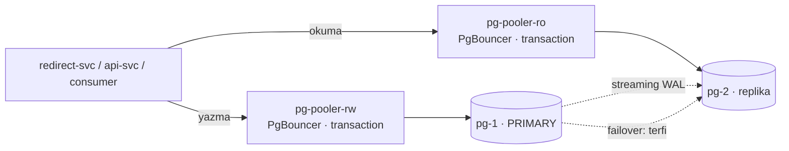

# 09 — database-scaling · "Veritabanı darboğazı"

> **Bu seviyede ne yaşayacaksın?**
> - Operatörle yönetilen Postgres: primary + 1 replika, otomatik failover, önünde PgBouncer; okumalar replikaya, yazmalar primary'ye
> - Yeni yazılan linkin replikada henüz olmaması — read-your-writes ihlali (P09-01)
> - Primary ölünce failover penceresi (P09-02); tuzak: transaction pooling'de prepared statement (P09-03)
> - Replikadaki uzun okumanın WAL ile çakışması (P09-04), partition'sız silmenin pahalılığı (P09-05), replikasyonun yedek olmaması (P09-06)
>
> **Bu seviye olmasa ne olur?** Tek Postgres tek arıza noktasıdır (P02-03) ve bağlantı sayısı replika × havuz ile duvara çarpar (P02-02).
>
> **Yeni gelen teknolojiler:** CloudNativePG, PgBouncer (Pooler), okuma/yazma ayrımı, tablo partition'ı ([her biri tek cümleyle](../README.md#kullanılan-teknolojiler)).

## 1. Bu seviye ne?

Postgres artık bir operatörle (CloudNativePG) yönetiliyor: primary + 1 replika, otomatik failover, önünde PgBouncer
ve partition'lı bir saklama tablosu. Okumalar replikaya, yazmalar primary'ye gider. 02'nin bağlantı duvarı ve tek
nokta arızası kapanır; yerine replikasyonun kendi sorunları gelir.

## 2. Mimari



Pooler 500 uygulama bağlantısını 20 gerçek DB bağlantısına indirir (25:1); `max_connections` bilerek 100'de. Küme
iki instance: failover ve replika çakışması tek replikayla ölçülür.

## 3. Önceki seviyeden çözülenler

| ID | Sorun | Nasıl çözüldü |
|---|---|---|
| P02-02 | Uygulama kopyası arttıkça veritabanına açılan bağlantılar veritabanının sınırını aşıyordu (kopya × havuz > `max_connections`) | Araya bir bağlantı havuzlayıcı girdi (PgBouncer, transaction modu): uygulama tarafında 500 bağlantı, veritabanı tarafında yalnızca 20 |
| P02-03 | Tek veritabanı vardı; çökünce birinin elle ayağa kaldırması gerekiyordu | Veritabanı operatörü (CloudNativePG) iki kopya tutar ve ana kopya çökünce yedeği otomatik terfi ettirir; saniyelik bir kesinti kalır (P09-02) |

P07-02 (servis büyütülünce darboğazın veritabanına kayması) da büyük ölçüde kapanır: veritabanına açılan gerçek bağlantı
sayısı havuzlayıcıda sabit.

## 4. Ayağa kaldırma

İlk kez mi? Önce kök README'deki [Sıfırdan başlangıç](../README.md#sıfırdan-başlangıç): platform bir kez kurulur ve
`LADDER` (repo kökü) tanımlanır. Her komut bloğu `cd "$LADDER/…"` ile başlar; olduğu gibi yapıştır.
Bu seviyenin platformdan istediği: **temel yığın (kind, ingress, Prometheus, Grafana) + Chaos Mesh, KEDA, CloudNativePG**; `make up` açar.

Hızlı başvuru (komutları tek tek kullan; satır sonu açıklamaları için zsh'da `setopt interactivecomments` gerekir):

```bash
cd "$LADDER/09-database-scaling"
make up            # profil → Grafana'yı temizle → build → push → deploy → rollout wait → smoke
make link          # example.com'a kısa link oluştur, yönlendirmeyi dene → 302 · başka adres: make link URL=https://…
make grafana       # Ladder klasörü, level=lvl09 — giriş: admin / ladder
make load S=mixed  # aynı senaryolar her seviyede: create redirect mixed hot-key burst abuser read-your-writes stairs scan
make repro P=P09-01   # §6'daki bir sorunu otomatik üret → REPRODUCED / NOT-REPRODUCED
make env           # açık ayar/tuzaklar · değiştir: make set E="KEY=değer" · hepsini geri al: make reset (§7)
make down          # seviyeyi kaldır · kümeyi durdurmak için: cd "$LADDER/platform" && make stop
```

Postgres kümesine ve kimin primary olduğuna bakmak için (son sütun `INSTANCEROLE`: `primary` / `replica`):
```bash
cd "$LADDER/09-database-scaling"
kubectl -n lvl09 get cluster,pooler,pods -l cnpg.io/cluster=pg
kubectl -n lvl09 get pods -l cnpg.io/cluster=pg -L cnpg.io/instanceRole
```

**Rehber — bu seviyeyi baştan sona, sırayla.**

1. Önceki seviyeyi kapat (aynı anda tek seviye), bu seviyeyi kur. `make up` Grafana'yı da temizler; CNPG kümesi ve
   Pooler'lar hazır olunca `✔ lvl09 ayakta` yazar:
```bash
cd "$LADDER/08-rate-limiting"
make down
cd "$LADDER/09-database-scaling"
make up
```

**Verileri temizleyip sıfırdan koşmak istersen** 1. adımın yerine bunu kullan: bütün seviyelerin verisi
(linkler, veritabanı, önbellek, kuyruk) ve Grafana'nın gösterdiği metrik, trace, log silinir; küme ve kurulum
kalır (~2-3 dk). Ardından bu seviye temiz kurulur. Yalnızca Grafana çizgilerini temizlemek için (veri kalır)
seviye klasöründe `make fresh` yeter; her deneyin ilk komutu zaten bu.
```bash
cd "$LADDER"
make wipe CONFIRM=1
cd "$LADDER/09-database-scaling"
make up
```
2. 08'in sorunlarını burada koş (koşarken başka komut çalıştırma). 09'un kapattığı sorunlar (P02-02, P02-03) 08'in
   scriptleri arasında değil; `BEKLENEN` sütununda `NOT-REPRODUCED` isteyen satır yok, `CONFIRM=1` isteyen P08-01
   `SKIPPED` görünür:
```bash
cd "$LADDER/09-database-scaling"
make verify-prev
```
3. §6'daki sorunları sırayla yaşa (P09-01 → P09-06): adımları yapıştır → **Terminalde ne görmelisin** ile
   karşılaştır → **Grafana'da gör** linklerini aç. P09-01 replikada WAL uygulamasını duraklatır, P09-02 primary'yi
   siler: ikisinde de son adımı atlama.
4. Bitince ayarları geri al ve seviyeyi kapat:
```bash
cd "$LADDER/09-database-scaling"
make reset
make down
```

## 5. API

Her seviyede aynı: [docs/API.md](../docs/API.md). Dışarıdan değişiklik yok.

Garanti değişti: `GET /{code}` artık replikadan cevaplanabilir, yani birkaç yüz milisaniye geçmişten okuyabilir.
Yazmadan sonra `STICKY_WINDOW` (2 sn) boyunca okumalar primary'ye yapışır (işaret Redis'te, iki servis de görür).

## 6. Reproduce edilebilir sorunlar

Bu seviyede yaşayacağın 6 sorun. Her birini iki yoldan görebilirsin: **Otomatik** — `make repro P=<ID>` deneyi
kendisi yapar, ölçer ve hükmünü basar (`REPRODUCED` = sorun var · `NOT-REPRODUCED` = yok · `SKIPPED` =
ölçülemedi); **Elle** — adımları sırayla yapıştırıp sonucu kendi gözünle görürsün. Her sorunun bölümü aynı
düzende: **Ne oluyor** → **Neden oluyor** → **Bu deney** → adımlar → **Terminalde ne görmelisin** →
**Grafana'da gör** (giriş: admin / ladder) → **Nasıl çözülüyor**.

**Kısa komut** deneyi otomatik başlatır; seviyenin klasöründe çalıştır (önce `cd "$LADDER/09-database-scaling"`).
Başında `CONFIRM=1` olanlar yıkıcı bir adım içerir (pod silmek, yeniden başlatmak, arıza enjekte etmek gibi); bu
onay olmadan script o adımı yapmaz ve `SKIPPED` basar.

| ID | Kısa komut | Ne olur? | Neden olur? | Nasıl çözülür? |
|---|---|---|---|---|
| P09-01 | `make repro P=P09-01` | Kullanıcı link oluşturup hemen açınca kendi linki için 404 alabilir | Okumalar veritabanının kopyasına (replika) gider; kopya ana veritabanının (primary) birkaç an gerisindedir, yeni link henüz orada yoktur | **Seviye içi:** yazmadan sonraki 2 sn okumalar ana veritabanına yönlendirilir |
| P09-02 | `CONFIRM=1 make repro P=P09-02` | Ana veritabanı çökünce yazmalar 10–30 sn hata verir ya da bekler | Kopyanın ana veritabanını devralması (failover) anlık değildir: arıza fark edilir, kopya terfi eder, bağlantılar yeni adrese geçer | Pencere saniyelere iner ama sıfırlanmaz · **10:** yazmayı yeniden deneme + tekrar edilse de tek kayıt üreten istek (idempotency) |
| P09-03 | `make repro P=P09-03` | Tuzak açıkken bazı yönlendirmeler aralıklı 503 hatası verir | Havuzlayıcı (PgBouncer) veritabanı bağlantısını her işlemde başkasına verir; bir bağlantıda hazırlanan sorgu (prepared statement) diğerinde yoktur | **Seviye içi:** sorgular hazırlanmadan gönderilir (exec modu); tuzak bunu kapatır |
| P09-04 | `make repro P=P09-04` | Kopyadaki uzun bir okuma, ana veritabanında silinen satırların temizlenmesini engeller; tablo şişer | Kopya, okuması sürerken ihtiyaç duyduğu eski satırları ana veritabanına "temizleme" diye bildirir (`hot_standby_feedback`) | Çözülmez, seçilir: ya kopyadaki okuma iptal edilir ya ana veritabanı şişer |
| P09-05 | `make repro P=P09-05` | Eski kayıtları `DELETE` ile silmek saniyeler sürer ve diskte yer açmaz | Postgres'te silinen satır "ölü" olarak kalır; yeri ancak temizlikle (vacuum) yeniden kullanılır | **Seviye içi:** tablo zamana göre bölümlere ayrılır (partition), eski bölüm tek hamlede atılır |
| P09-06 | `CONFIRM=1 make repro P=P09-06` | Yanlışlıkla silinen bir kayıt kopyadan da geri alınamaz | Kopyalama (replikasyon) hatayı da saniyeler içinde kopyalar; yedek yok | Kapsam dışı: sürekli yedek + belirli bir ana geri dönme (PITR) + geri yükleme tatbikatı (14 §9) |

---

### P09-01 · Read-your-writes ihlali

**Ne oluyor:** Kullanıcı bir link oluşturup hemen açtığında bazen 404 alır: az önce kendi yarattığı link "yok"
görünür. Kullanıcı için bu, linkin bozuk olması demek; üstelik 404 önbelleğe de yazılır ve bir süre devam edebilir.
**Neden oluyor:** Okumaları hızlandırmak için veritabanının bir kopyası (replika) tutulur ve okumalar oraya gider.
Kopya, ana veritabanındaki (primary) değişiklikleri birkaç an geriden uygular; yazmadan hemen sonraki okuma kopyaya
giderse yeni link henüz orada değildir. Kullanıcının "yazdığını hemen okuyabilme" beklentisine read-your-writes denir.
**Bu deney:** "Oluştur → hemen oku" yükünü iki kez verir: önce koruma açıkken, sonra koruma kapalı ve kopya bilerek
geride bırakılmışken; iki fazda kaç okumanın 404 döndüğünü karşılaştırır.

**Reproduce (adım adım):** Otomatik: `make repro P=P09-01` (`read-your-writes` senaryosunu iki kez koşar: önce
yapışkan okuma açık ve replika güncel; sonra yapışkan okuma kapalı ve replikada WAL uygulaması duraklatılmış — replika
gerçekten geride kalır; script sonunda her durumda devam ettirir). Elle — 3. adım replikayı duraklatır, 5. adımı
(devam ettirme) atlama:

1. Temiz başla; CNPG pod'larını bekle, replikayı bul, WAL uygulaması duraklatılmış mı bak:
```bash
cd "$LADDER/09-database-scaling"
make fresh
kubectl -n lvl09 wait --for=condition=Ready pod -l cnpg.io/cluster=pg,cnpg.io/instanceRole --timeout=180s
kubectl -n lvl09 get pods -l cnpg.io/cluster=pg -L cnpg.io/instanceRole
replica=$(kubectl -n lvl09 get pod -l cnpg.io/cluster=pg,cnpg.io/instanceRole=replica -o jsonpath='{.items[0].metadata.name}'); echo "replika: $replica"
kubectl -n lvl09 exec "$replica" -c postgres -- psql -U postgres -d linkly -tAc 'SELECT pg_is_wal_replay_paused()'
```
2. Koruma açıkken (yapışkan okuma varsayılan, replika güncel) 30 sn "oluştur → hemen oku", sonra sunucunun saydığı
   ihlali oku:
```bash
cd "$LADDER/09-database-scaling"
make load S=read-your-writes K6_ARGS="--vus 10 --duration 30s"
sleep 15
curl -s 'http://prometheus.localtest.me/api/v1/query' --data-urlencode 'query=sum(increase(ryw_violations_total{namespace="lvl09"}[1m]))' | jq -r '"ihlal (sunucu): " + .data.result[0].value[1]'
```
3. Korumayı kaldır: yapışkan okumayı redirect ve api'de kapat (pod'lar yeniden başlar), replikada WAL uygulamasını
   duraklat (replika geride kalsın):
```bash
cd "$LADDER/09-database-scaling"
make set E="TRAP_NO_STICKY=true" W=redirect
make set E="TRAP_NO_STICKY=true" W=api
sleep 10
kubectl -n lvl09 exec "$replica" -c postgres -- psql -U postgres -d linkly -tAc 'SELECT pg_wal_replay_pause()'
kubectl -n lvl09 exec "$replica" -c postgres -- psql -U postgres -d linkly -tAc 'SELECT pg_is_wal_replay_paused()'
```
4. Aynı yükü ver, ihlali oku, replikanın kaç saniye geride kaldığına bak:
```bash
cd "$LADDER/09-database-scaling"
make load S=read-your-writes K6_ARGS="--vus 10 --duration 30s"
sleep 15
curl -s 'http://prometheus.localtest.me/api/v1/query' --data-urlencode 'query=sum(increase(ryw_violations_total{namespace="lvl09"}[1m]))' | jq -r '"ihlal (sunucu): " + .data.result[0].value[1]'
kubectl -n lvl09 exec "$replica" -c postgres -- psql -U postgres -d linkly -tAc 'SELECT round(EXTRACT(EPOCH FROM now() - pg_last_xact_replay_timestamp()))'
```
5. Geri al — önce WAL uygulamasını devam ettir, sonra yapışkan okumayı aç:
```bash
cd "$LADDER/09-database-scaling"
kubectl -n lvl09 exec "$replica" -c postgres -- psql -U postgres -d linkly -tAc 'SELECT pg_wal_replay_resume()'
kubectl -n lvl09 exec "$replica" -c postgres -- psql -U postgres -d linkly -tAc 'SELECT pg_is_wal_replay_paused()'
make reset
```

**Terminalde ne görmelisin:** 1. adımda `f` (duraklatılmamış). 2. adımda k6 özetinde `ryw_violations=0` ve
`ihlal (sunucu): 0`: yazma sonrası okumalar primary'ye yapıştı. 3. adımda `t`. 4. adımda `404=`, `ryw_violations=` ve
`ihlal (sunucu)` sıfırdan büyük: kullanıcı kendi az önce yarattığı link için 404 aldı; son komut replikanın
duraklatmadan beri kaç saniye geride olduğunu basar (onlarca saniye). 5. adımda yeniden `f`. Bu 404'ler önbelleğe
negatif kayıt olarak da yazılır; replika yetişse bile o linkler `CACHE_NEGATIVE_TTL` boyunca 404 dönebilir.

**Grafana'da gör:** [`03 · App Business`](http://grafana.localtest.me/d/ladder-app-business?var-level=lvl09&from=now-15m&to=now&refresh=10s), [`15 · k6`](http://grafana.localtest.me/d/ladder-k6?var-level=lvl09&from=now-15m&to=now&refresh=10s) ve [`05 · Postgres`](http://grafana.localtest.me/d/ladder-postgres?var-level=lvl09&from=now-15m&to=now&refresh=10s) — deney başlayınca aç; iki faz 30'ar sn, arada rollout
- "Read-your-writes ihlali" → birinci fazda 0'da düz; ikinci fazda yükselir. Sunucu, replikaya giden okuma az önce yazılan kodu bulamadığında (404) sayar.
- "Senaryoya özel ölçüler" (k6) → `read-your-writes ihlali` aynı anda basamak yapar: aynı olayın istemci tarafı.
- "Dönen durum kodları" (k6) → ikinci fazda `302`'lerin yerini `404` alır.
- "Replikasyon gecikmesi" → replika çizgisi birinci fazda 0; duraklatma boyunca doğrusal tırmanır, devam ettirilince 0'a düşer (30 sn'de bir ölçüldüğü için bir-iki nokta).
- Explore'da: `sum(rate(db_reads_routed_total{namespace="lvl09"}[1m])) by (target)` → birinci fazda okumaların bir kısmı `primary`'ye yapışır; ikinci fazda hepsi `replica`'ya gider.

**Nasıl çözülüyor:** Bu seviyenin kendi koruması: bir kullanıcı yazdıktan sonraki 2 sn boyunca onun okumaları ana veritabanına
yönlendirilir ("yapışkan okuma"; bilgi Redis'te tutulur, Redis yoksa korumaz). Diğer yollar: yazmanın kopyaya da
ulaşmasını beklemek (senkron replikasyon; yazma en yavaş kopyayı bekler) ya da hangi değişikliğin kopyaya ulaştığını
izlemek (LSN takibi; en doğru ama en karmaşık).

---

### P09-02 · Failover penceresi

**Ne oluyor:** Ana veritabanı (primary) çökünce bir süre yazmalar durur: link oluşturmak ya hata verir (503) ya da
saniyelerce bekler. Sistem kendiliğinden toparlanır ama o pencere boyunca kullanıcılar etkilenir.
**Neden oluyor:** Kopyanın ana veritabanını devralması (failover) anlık değildir: veritabanı operatörü (CloudNativePG)
arızayı fark eder, kopyayı terfi ettirir, sonra bağlantılar yeni ana veritabanına yönlenir. Bu adımların her biri
zaman alır.
**Bu deney:** Karışık yük altında ana veritabanını zorla siler; yeni bir ana veritabanının hazır olmasına kadar
geçen saniyeleri, 5xx hatalarını ve yazma süresini ölçer.

**Reproduce (adım adım):** Otomatik: `CONFIRM=1 make repro P=P09-02` (karışık yük altında primary'yi zorla siler —
kapanış yok; düzgün silinen primary'yi CNPG kapanırken devreder ve pencere görünmez —, hazır yeni primary'ye kadar
geçen süreyi, 5xx'i ve yazma p99'unu ölçer; silinen pod replika olarak geri kurulana kadar bekler). Elle —
**yıkıcı:** 3. adım primary'yi siler; 4. adımda iki instance da hazır olmadan sonraki soruna geçme:

1. Temiz başla; CNPG pod'larını bekle, rollere bak, primary'yi not et:
```bash
cd "$LADDER/09-database-scaling"
make fresh
kubectl -n lvl09 wait --for=condition=Ready pod -l cnpg.io/cluster=pg,cnpg.io/instanceRole --timeout=180s
kubectl -n lvl09 get pods -l cnpg.io/cluster=pg -L cnpg.io/instanceRole
primary=$(kubectl -n lvl09 get pod -l cnpg.io/cluster=pg,cnpg.io/instanceRole=primary -o jsonpath='{.items[0].metadata.name}'); echo "primary: $primary"
```
2. İkinci bir terminalde karışık yükü (100 okumaya 1 yazma) 120 sn başlat:
```bash
cd "$LADDER/09-database-scaling"
make load S=mixed K6_ARGS="--vus 15 --duration 120s"
```
3. Yük başladıktan ~15 sn sonra ilk terminalde primary'yi zorla sil ve her saniye hazır yeni bir primary var mı bas;
   bulununca döngü durur:
```bash
cd "$LADDER/09-database-scaling"
uid0=$(kubectl -n lvl09 get pod "$primary" -o jsonpath='{.metadata.uid}')
kubectl -n lvl09 delete pod "$primary" --force --grace-period=0
t0=$(date +%s); for i in $(seq 1 120); do np=$(kubectl -n lvl09 get pods -l cnpg.io/cluster=pg,cnpg.io/instanceRole=primary -o json | jq -r --arg u "$uid0" '[.items[] | select(.metadata.uid != $u) | select(any(.status.containerStatuses[]?; .ready)) | .metadata.name][0] // empty'); echo "$(( $(date +%s) - t0 )) sn: hazır yeni primary=${np:-yok}"; [ -n "$np" ] && break; sleep 1; done
```
4. Yük bitince 15 sn bekle, yazma yolunun son 3 dakikadaki en kötü p99'unu (ms) oku, iki instance da hazır olana
   kadar bekle:
```bash
cd "$LADDER/09-database-scaling"
sleep 15
curl -s 'http://prometheus.localtest.me/api/v1/query' --data-urlencode 'query=1000 * max_over_time(histogram_quantile(0.99, sum(rate(http_request_duration_seconds_bucket{namespace="lvl09",route="/api/links"}[30s])) by (le))[3m:15s])' | jq -r '.data.result[0].value[1]'
kubectl -n lvl09 wait --for=condition=Ready pod -l cnpg.io/cluster=pg,cnpg.io/instanceRole --timeout=300s
kubectl -n lvl09 get pods -l cnpg.io/cluster=pg -L cnpg.io/instanceRole
kubectl -n lvl09 get cluster.postgresql.cnpg.io pg
```

**Terminalde ne görmelisin:** döngü önce `hazır yeni primary=yok`, sonra bir pod adı basar; pencere o satırdaki
saniyedir (~10–30 sn). Ad replikanınki (terfi) ya da silinenle aynı (CNPG aynı adla yeni pod kaldırdı) olabilir.
Pencere iki biçimde görünür: k6 özetinde `5xx` sıfırdan büyük (düşen istekler) ya da 4. adımdaki yazma p99'u saniyelerle
ölçülür (PgBouncer sorguları bekletti); script ikisinden birini görünce REPRODUCED der. Yük bitmeden sistem insan
müdahalesi olmadan toparlanır. 4. adımda iki instance da hazır; silinen pod'un replika olarak geri kurulması birkaç
dakika sürebilir.

**Grafana'da gör:** [`05 · Postgres`](http://grafana.localtest.me/d/ladder-postgres?var-level=lvl09&from=now-15m&to=now&refresh=10s) ve [`02 · App RED`](http://grafana.localtest.me/d/ladder-app-red?var-level=lvl09&from=now-15m&to=now&refresh=10s) — yük başlayınca aç; 120 sn, primary 15. saniyede silinir
- Explore'da: `max by (pod) (cnpg_pg_replication_in_recovery{namespace="lvl09"})` → roller: `0` = primary, `1` = replika. Terfi eden replikanın çizgisi 1'den 0'a iner; silinen pod bir süre kaybolup geri gelir.
- "Replikasyon gecikmesi" → 0 civarında; silinen pod'un çizgisi kopar ve replika olarak geri gelince başlar.
- "5xx (uç noktaya göre)" → primary silinince bir 5xx tepesi (başta `/api/links`: `503 store_error`), saniyeler sonra kendiliğinden 0'a döner; genişliği failover penceresidir. PgBouncer sorguları bekletirse tepe hiç çıkmayabilir.
- "p99 süre (uç noktaya göre)" → o zaman pencere burada: `/api/links` p99'u milisaniyelerden saniyelere sıçrar, `/{code}` neredeyse düz kalır. Hata vermeyen bekleme de kesintidir.
- "Bağlantılar ve üst sınır" → primary silinince bağlantı çizgileri kopar ve terfi eden pod'da yeniden kurulur; üst çizgi (100) sabit.

**Nasıl çözülüyor:** Bu seviye kesintiyi insan müdahalesinden saniyelere indirir ama sıfırlayamaz. 10'da uygulama başarısız yazmayı
yeniden dener; tekrarlanan isteğin çift kayıt üretmemesi (idempotency) de bu yüzden şarttır.

---

### P09-03 · TRAP · Prepared statement + transaction pooling

**Ne oluyor:** Tuzak (`TRAP_PREPARED_STATEMENTS`) açıkken bazı yönlendirmeler aralıklı olarak 503 hatası verir;
loglarda `prepared statement … does not exist` görünür. Hata rastgele gibidir, çünkü yalnızca veritabanına inen
isteklerde çıkar (önbellekten dönenler etkilenmez).
**Neden oluyor:** Veritabanı sürücüsü (pgx) sorguları bir kez "hazırlayıp" (prepared statement) tekrar kullanabilir;
hazırlık, o veritabanı bağlantısına bağlıdır. Havuzlayıcı PgBouncer ise transaction modunda bir bağlantıyı yalnızca
tek bir işlem boyunca verir; sonraki işlem başka bir bağlantıya düşer ve hazırlanan sorgu orada yoktur.
**Bu deney:** Aynı karışık yükü önce varsayılan ayarla (sorgular hazırlanmadan gönderilir), sonra tuzak açıkken
verir; iki fazda veritabanı hatalarını, 5xx'i ve loglardaki `prepared statement` satırlarını sayar.

**Reproduce (adım adım):** Otomatik: `make repro P=P09-03` (varsayılan exec modu ile prepared modunu aynı `mixed`
yüküyle karşılaştırır: DB hataları, 5xx ve loglardaki `prepared statement` satırları). Elle:

1. Temiz başla; yazma Pooler'ının modunu ve DB tarafı havuz boyunu gör:
```bash
cd "$LADDER/09-database-scaling"
make fresh
kubectl -n lvl09 get pooler pg-pooler-rw -o jsonpath='poolMode={.spec.pgbouncer.poolMode} default_pool_size={.spec.pgbouncer.parameters.default_pool_size}{"\n"}'
```
2. Varsayılan (prepared kapalı): 30 kullanıcıyla 40 sn karışık yük, sonra DB hatalarını say:
```bash
cd "$LADDER/09-database-scaling"
make load S=mixed K6_ARGS="--vus 30 --duration 40s"
sleep 10
curl -s 'http://prometheus.localtest.me/api/v1/query' --data-urlencode 'query=sum(increase(db_queries_total{namespace="lvl09",result="error"}[3m]))' | jq -r '"DB hatası: " + .data.result[0].value[1]'
```
3. Tuzağı redirect'te aç (pgx prepared moduna geçer, pod'lar yeniden başlar); aynı yük, aynı sayım, sonra loglar:
```bash
cd "$LADDER/09-database-scaling"
make set E="TRAP_PREPARED_STATEMENTS=true" W=redirect
sleep 10
make load S=mixed K6_ARGS="--vus 30 --duration 40s"
sleep 10
curl -s 'http://prometheus.localtest.me/api/v1/query' --data-urlencode 'query=sum(increase(db_queries_total{namespace="lvl09",result="error"}[3m]))' | jq -r '"DB hatası: " + .data.result[0].value[1]'
kubectl -n lvl09 logs -l app.kubernetes.io/name=redirect --tail=200 | grep -ci 'prepared statement'
kubectl -n lvl09 logs -l app.kubernetes.io/name=redirect --tail=200 | grep -i -m1 'prepared statement'
```
4. Tuzağı kapat:
```bash
cd "$LADDER/09-database-scaling"
make reset
```

**Terminalde ne görmelisin:** `poolMode=transaction default_pool_size=20`. Varsayılan fazda `DB hatası: 0` ve k6
özetinde `5xx=0`. Tuzak fazında `DB hatası` ve `5xx` (`503 store_error`) sıfırdan büyük ama aralıklı: önbellek
isabetleri DB'ye gitmez, hata yalnızca DB'ye inen okumalarda çıkar. Log sayımı sıfırdan büyük; örnek satır
`prepared statement "stmtcache_…" does not exist`.

**Grafana'da gör:** [`03 · App Business`](http://grafana.localtest.me/d/ladder-app-business?var-level=lvl09&from=now-15m&to=now&refresh=10s) ve [`02 · App RED`](http://grafana.localtest.me/d/ladder-app-red?var-level=lvl09&from=now-15m&to=now&refresh=10s) — deney başlayınca aç; iki faz 40'ar sn, arada redirect rollout'u
- "Yönlendirme sonuçları" → birinci fazda `error` serisi 0; ikinci fazda aralıklı sıfırdan ayrılır.
- "5xx (uç noktaya göre)" → ikinci fazda `/{code}` için düzensiz 5xx tepeleri: kullanıcı havuzlamanın bir protokol ayrıntısını görüyor.
- Explore'da: `sum(rate(db_queries_total{namespace="lvl09",result="error"}[1m])) by (op)` → birinci fazda 0, ikinci fazda dalgalanır (`05 · Postgres` sorgu paneli sonuçları ayırmaz).

**Nasıl çözülüyor:** Bu seviyenin kendi ayarı: sorgular hazırlanmadan doğrudan gönderilir (`QueryExecModeExec`); tuzak bunu
kapatınca sorun döner. Diğer yollar: PgBouncer'ın hazırlanmış sorguları taşıması (`max_prepared_statements>0`) ya da
bağlantıyı oturum boyunca vermesi (session pooling; havuzlamanın faydasını kaybettirir). Bağlantıya bağlı her özellik
(`SET`, `LISTEN/NOTIFY`, geçici tablo, advisory lock) aynı riski taşır.

---

### P09-04 · Replikada uzun okuma ↔ WAL çakışması

**Ne oluyor:** Veritabanı kopyasında (replika) uzun süren bir okuma, ana veritabanında silinen satırların
temizlenmesini engeller: silinen satırlar diskte "ölü" olarak birikir ve tablo şişer. Okuma iptal edilmez; bedeli
ana veritabanı öder.
**Neden oluyor:** Kopya, ana veritabanından gelen değişiklikleri (WAL) uygulamak zorundadır; uzun bir okuma ise
okuduğu eski satırlara ihtiyaç duyar. `hot_standby_feedback=on` ayarıyla kopya ana veritabanına "bu satırları henüz
temizleme" der: okuma iptal edilmez ama ana veritabanındaki temizlik (vacuum) bekler.
**Bu deney:** Kopyada 45 sn süren bir okuma başlatır; bu sırada ana veritabanında 50 bin satır yazıp siler ve
temizlik çalıştırır. Ölü satırları okumadan önce, okuma sürerken ve okuma bitince sayar.

**Reproduce (adım adım):** Otomatik: `make repro P=P09-04` (replikada 45 sn'lik sorgu başlatır, primary'de 50 bin
satır yazıp siler ve VACUUM eder; ölü satırları taban → rehinli → serbest diye üç kez sayar, çakışmaları okur). Elle:

1. Temiz başla; CNPG pod'larını bekle, primary ile replikayı bul, replikanın `hot_standby_feedback` ayarına bak:
```bash
cd "$LADDER/09-database-scaling"
make fresh
kubectl -n lvl09 wait --for=condition=Ready pod -l cnpg.io/cluster=pg,cnpg.io/instanceRole --timeout=180s
prim=$(kubectl -n lvl09 get pod -l cnpg.io/cluster=pg,cnpg.io/instanceRole=primary -o jsonpath='{.items[0].metadata.name}'); replica=$(kubectl -n lvl09 get pod -l cnpg.io/cluster=pg,cnpg.io/instanceRole=replica -o jsonpath='{.items[0].metadata.name}'); echo "primary: $prim replika: $replica"
kubectl -n lvl09 exec "$replica" -c postgres -- psql -U postgres -d linkly -tAc 'SHOW hot_standby_feedback'
```
2. Taban: primary'de `links`'i VACUUM et, ölü satır sayısını oku:
```bash
cd "$LADDER/09-database-scaling"
kubectl -n lvl09 exec "$prim" -c postgres -- psql -U postgres -d linkly -tAc 'VACUUM (ANALYZE) links'
kubectl -n lvl09 exec "$prim" -c postgres -- psql -U postgres -d linkly -tAc "SELECT n_dead_tup FROM pg_stat_user_tables WHERE relname='links'"
```
3. İkinci bir terminalde replikada 45 sn süren bir okuma başlat (primary'nin vacuum'unu rehin alır):
```bash
cd "$LADDER/09-database-scaling"
replica=$(kubectl -n lvl09 get pod -l cnpg.io/cluster=pg,cnpg.io/instanceRole=replica -o jsonpath='{.items[0].metadata.name}'); kubectl -n lvl09 exec "$replica" -c postgres -- psql -U postgres -d linkly -tAc 'SELECT count(*) FROM links, pg_sleep(45)'
```
4. 45 sn dolmadan ilk terminalde: rehin alınan xmin'in yaşı, sonra 50 bin satır çöp üret, VACUUM et, ölü satırları say:
```bash
cd "$LADDER/09-database-scaling"
kubectl -n lvl09 exec "$prim" -c postgres -- psql -U postgres -d linkly -tAc 'SELECT coalesce(max(age(backend_xmin)),0) FROM pg_stat_replication WHERE backend_xmin IS NOT NULL'
kubectl -n lvl09 exec "$prim" -c postgres -- psql -U postgres -d linkly -tAc "INSERT INTO links (code, url, tenant) SELECT substr(md5(random()::text),1,7)||i, 'https://e/'||i, 'vac' FROM generate_series(1,50000) i ON CONFLICT DO NOTHING"
kubectl -n lvl09 exec "$prim" -c postgres -- psql -U postgres -d linkly -tAc "DELETE FROM links WHERE tenant='vac'"
kubectl -n lvl09 exec "$prim" -c postgres -- psql -U postgres -d linkly -tAc 'VACUUM links'
kubectl -n lvl09 exec "$prim" -c postgres -- psql -U postgres -d linkly -tAc "SELECT n_dead_tup FROM pg_stat_user_tables WHERE relname='links'"
```
5. İkinci terminaldeki sorgu sonucunu basınca (rehin kalktı) tekrar VACUUM et, ölü satırları ve replikadaki
   çakışmaları say:
```bash
cd "$LADDER/09-database-scaling"
sleep 5
kubectl -n lvl09 exec "$prim" -c postgres -- psql -U postgres -d linkly -tAc 'VACUUM links'
kubectl -n lvl09 exec "$prim" -c postgres -- psql -U postgres -d linkly -tAc "SELECT n_dead_tup FROM pg_stat_user_tables WHERE relname='links'"
kubectl -n lvl09 exec "$replica" -c postgres -- psql -U postgres -d linkly -tAc "SELECT confl_snapshot + confl_bufferpin + confl_deadlock + confl_lock + confl_tablespace FROM pg_stat_database_conflicts WHERE datname='linkly'"
```

**Terminalde ne görmelisin:** `hot_standby_feedback` → `on`. Tabanda ölü satır ~0. Rehin varken `DELETE` sonrası
VACUUM ölü satırları temizleyemez: sayı ~50 bin kalır. İkinci terminal 45 sn sonra satır sayısını basar — sorgu iptal
edilmedi. Rehin kalkınca aynı VACUUM temizler (sayı tabana iner) ve çakışma sayısı `0`: iptal önlendi, bedeli
primary'deki şişmede ödendi. Deney kendi çöpünü siler.

**Grafana'da gör:** [`05 · Postgres`](http://grafana.localtest.me/d/ladder-postgres?var-level=lvl09&from=now-15m&to=now&refresh=10s) — deney başlayınca aç; uzun sorgu 45 sn sürer, yük yok
- Explore'da: `max by (application_name) (cnpg_pg_stat_replication_backend_xmin_age{namespace="lvl09"})` → replikanın rehin tuttuğu xmin'in yaşı: sorgu sürerken inmez, bitince düşer.
- Explore'da: `sum(increase(cnpg_pg_stat_database_tup_deleted{namespace="lvl09",datname="linkly"}[1m]))` → 50 bin satırlık `DELETE` bir tepe çizer: vacuum'un temizleyemediği çöp.
- Explore'da: `sum(cnpg_pg_stat_database_conflicts{namespace="lvl09",datname="linkly"})` → düz kalır: replikada iptal yok.
- "Ölü satırlar (vacuum bekleyen)" → bu seviyede boş (CNPG bu metriği yayınlamaz); ölü satır sayılarını script terminalde basar.

**Nasıl çözülüyor:** Çözülmez, seçilir: `hot_standby_feedback` kapalıysa kopyadaki uzun okuma iptal edilir, açıksa ana veritabanı
şişer. Kopya "bedava okuma kapasitesi" değildir.

---

### P09-05 · Silme pahalı: partition'sız retention

**Ne oluyor:** Eski kayıtları silmek (saklama süresini uygulamak) yüz binlerce satırda saniyeler sürer, veritabanı
CPU'sunu yükseltir ve silindikten sonra bile diskte yer açmaz.
**Neden oluyor:** Postgres'te `DELETE` edilen satır hemen kaybolmaz, "ölü" olarak kalır; yeri ancak temizlikten
(vacuum) sonra yeniden kullanılır, diske geri vermek ise tabloyu kilitlemeyi gerektirir. Tablo zamana göre bölümlere
ayrılırsa (partition) eski bölüm tek hamlede, dosyasıyla birlikte atılır.
**Bu deney:** Düz bir tabloya 500 bin satır ekleyip 1 saatten eskileri `DELETE` ile siler; süreyi, ölü satırları ve
boyutu ölçer. Sonra bölümlü tabloda en eski bölümü atar (`DROP`) ve iki süreyi karşılaştırır.

**Reproduce (adım adım):** Otomatik: `make repro P=P09-05` (düz `processed_events`'e 500 bin satır ekler — `ROWS` ile
değişir —, 1 saatten eskileri `DELETE` ile siler, ölü satır ve boyutu ölçer; sonra partition'lı `processed_events_p`'nin
en eski bölümünü `DROP` eder ve iki süreyi karşılaştırır). Elle — 3. adım `processed_events`'teki 1 saatten eski
bütün satırları, 4. adım en eski partition'ı kalıcı siler (9 partition var; biterse `make down` + `make up`):

1. Temiz başla; primary'yi bul, partition'lı tablonun kaç bölümü olduğuna bak:
```bash
cd "$LADDER/09-database-scaling"
make fresh
kubectl -n lvl09 wait --for=condition=Ready pod -l cnpg.io/cluster=pg,cnpg.io/instanceRole=primary --timeout=180s
prim=$(kubectl -n lvl09 get pod -l cnpg.io/cluster=pg,cnpg.io/instanceRole=primary -o jsonpath='{.items[0].metadata.name}'); echo "primary: $prim"
kubectl -n lvl09 exec "$prim" -c postgres -- psql -U postgres -d linkly -tAc "SELECT count(*) FROM pg_inherits WHERE inhparent = 'processed_events_p'::regclass"
```
2. Düz tabloya 500 bin satır ekle (her biri bir saniye daha eski), boyutuna bak:
```bash
cd "$LADDER/09-database-scaling"
kubectl -n lvl09 exec "$prim" -c postgres -- psql -U postgres -d linkly -tAc "INSERT INTO processed_events (event_id, processed_at) SELECT 'bulk-'||i, now() - (i||' seconds')::interval FROM generate_series(1,500000) i ON CONFLICT DO NOTHING"
kubectl -n lvl09 exec "$prim" -c postgres -- psql -U postgres -d linkly -tAc 'ANALYZE processed_events'
kubectl -n lvl09 exec "$prim" -c postgres -- psql -U postgres -d linkly -tAc "SELECT pg_size_pretty(pg_total_relation_size('processed_events'))"
```
3. Saklama süresini `DELETE` ile uygula (psql süreyi ölçer), ölü satırları ve boyutu tekrar oku:
```bash
cd "$LADDER/09-database-scaling"
kubectl -n lvl09 exec "$prim" -c postgres -- psql -U postgres -d linkly -c '\timing on' -c "DELETE FROM processed_events WHERE processed_at < now() - interval '1 hour'"
kubectl -n lvl09 exec "$prim" -c postgres -- psql -U postgres -d linkly -tAc "SELECT n_dead_tup FROM pg_stat_user_tables WHERE relname='processed_events'"
kubectl -n lvl09 exec "$prim" -c postgres -- psql -U postgres -d linkly -tAc "SELECT pg_size_pretty(pg_total_relation_size('processed_events'))"
```
4. Aynı temizliği partition'lı tabloda yap: en eski bölümü düşür:
```bash
cd "$LADDER/09-database-scaling"
oldpart=$(kubectl -n lvl09 exec "$prim" -c postgres -- psql -U postgres -d linkly -tAc "SELECT c.relname FROM pg_inherits i JOIN pg_class c ON c.oid=i.inhrelid WHERE i.inhparent='processed_events_p'::regclass ORDER BY c.relname LIMIT 1"); echo "en eski partition: $oldpart"
kubectl -n lvl09 exec "$prim" -c postgres -- psql -U postgres -d linkly -c '\timing on' -c "DROP TABLE $oldpart"
```

**Terminalde ne görmelisin:** 1. adımda bölüm sayısı (ilk koşuda 9). 2. adımda tablo onlarca MB. 3. adımda
`DELETE ~496000` ve `Time:` yüzlerce ms'den saniyelere; `n_dead_tup` yüz binlerce ve boyut **aynı kalır**: satırlar ölü
duruyor, yer diske dönmedi. 4. adımda `DROP TABLE` birkaç ms: bölüm düşürmek dosyayı atar, ölü satır ve vacuum borcu
bırakmaz.

**Grafana'da gör:** [`05 · Postgres`](http://grafana.localtest.me/d/ladder-postgres?var-level=lvl09&from=now-15m&to=now&refresh=10s) — deney başlayınca aç; yük yok
- "Veritabanı CPU" → primary pod'unda iki tepe: 500 bin satırlık `INSERT` ve `DELETE`. Partition `DROP`'u görünmez.
- "İşlem / sn" → kıpırdamaz: 500 bin satırlık `DELETE` tek bir işlemdir; maliyeti işlem sayısında değil, dokunduğu satırlarda.
- Explore'da: `max(cnpg_pg_database_size_bytes{namespace="lvl09",datname="linkly"})` → eklemede yükselir, `DELETE`'ten sonra inmez: yer diske geri verilmiyor.
- Explore'da: `sum(increase(cnpg_pg_stat_database_tup_deleted{namespace="lvl09",datname="linkly"}[1m]))` → `DELETE` yüz binlerce satırlık tepe çizer; `DROP` hiç görünmez.
- "Ölü satırlar (vacuum bekleyen)" → bu seviyede boş (CNPG bu metriği yayınlamaz); ölü satır ve boyutu script basar.

**Nasıl çözülüyor:** Bu seviyenin kendi çözümü: olay tablosu zamana göre bölümlenir (migration 005) ve eski veri bölüm düşürülerek
silinir — ölü satır ve temizlik borcu bırakmaz. Saklama süresi zamanlanmış bir silme işi değil, şema kararıdır.

---

### P09-06 · Replikasyon yedek değildir

**Ne oluyor:** Yanlışlıkla silinen bir kayıt veritabanı kopyasından da geri alınamaz: silme birkaç saniye içinde
kopyaya da ulaşır. Kopyanın olması, verinin yedeklendiği anlamına gelmez.
**Neden oluyor:** Kopyalama (replikasyon) ana veritabanında olan her şeyi — hatalı bir `DELETE` dahil — kopyaya
taşır. Geçmişe dönmek için ayrı bir yedek ve belirli bir ana geri dönebilme (PITR, point-in-time recovery) gerekir;
bu seviyede yedek yapılandırılmamış.
**Bu deney:** Yedekleme ayarına bakar, bir test linki oluşturup kopyada görür, ana veritabanında siler ve 3 sn sonra
kopyada da kaybolduğunu gösterir.

**Reproduce (adım adım):** Otomatik: `CONFIRM=1 make repro P=P09-06` (yedekleme ayarına bakar, bir test linki
oluşturur, primary'de siler ve replikada da kaybolduğunu gösterir). Elle — silinen tek satır bu deneyin kendi test
linkidir:

1. Temiz başla; primary ile replikayı bul, yedekleme ayarına ve WAL konumuna bak:
```bash
cd "$LADDER/09-database-scaling"
make fresh
kubectl -n lvl09 wait --for=condition=Ready pod -l cnpg.io/cluster=pg,cnpg.io/instanceRole --timeout=180s
prim=$(kubectl -n lvl09 get pod -l cnpg.io/cluster=pg,cnpg.io/instanceRole=primary -o jsonpath='{.items[0].metadata.name}'); repl=$(kubectl -n lvl09 get pod -l cnpg.io/cluster=pg,cnpg.io/instanceRole=replica -o jsonpath='{.items[0].metadata.name}'); echo "primary: $prim replika: $repl"
kubectl -n lvl09 get cluster pg -o jsonpath='{.spec.backup}'; echo
kubectl -n lvl09 exec "$prim" -c postgres -- psql -U postgres -d linkly -tAc 'SELECT pg_current_wal_lsn()'
kubectl -n lvl09 exec "$prim" -c postgres -- psql -U postgres -d linkly -tAc 'SHOW wal_keep_size'
```
2. Bir test linki oluştur, replikaya ulaşsın diye 3 sn bekle, replikada say:
```bash
cd "$LADDER/09-database-scaling"
code=$(curl -s -XPOST http://lvl09.localtest.me/api/links -H 'Content-Type: application/json' -d '{"url":"https://example.com/oops"}' | jq -r .code); echo "kod: $code"
sleep 3
kubectl -n lvl09 exec "$repl" -c postgres -- psql -U postgres -d linkly -tAc "SELECT count(*) FROM links WHERE code='$code'"
```
3. "Yanlışlıkla" primary'de sil, 3 sn bekle, replikada tekrar say:
```bash
cd "$LADDER/09-database-scaling"
kubectl -n lvl09 exec "$prim" -c postgres -- psql -U postgres -d linkly -tAc "DELETE FROM links WHERE code='$code'"
sleep 3
kubectl -n lvl09 exec "$repl" -c postgres -- psql -U postgres -d linkly -tAc "SELECT count(*) FROM links WHERE code='$code'"
```

**Terminalde ne görmelisin:** `spec.backup` satırı boş: nesne deposu yapılandırılmamış. WAL konumu (`0/…` biçiminde)
ve `wal_keep_size` basılır. Silmeden önce replikada `1`, 3 sn sonra `0`: replika hatayı da kopyaladı, dönülecek kopya yok.

**Grafana'da gör:** [`05 · Postgres`](http://grafana.localtest.me/d/ladder-postgres?var-level=lvl09&from=now-15m&to=now&refresh=10s) — deneyden sonra aç
- "Replikasyon gecikmesi" → 0 civarında düz: replika primary'yi saniyeler içinde yakalıyor — yanlış `DELETE`'i de. Düşük gecikme burada hatanın yayılma hızıdır.

**Nasıl çözülüyor:** Bu merdivenin kapsamı dışında (14 §9, yolun devamı): sürekli WAL arşivleme, periyodik yedek ve düzenli geri
yükleme tatbikatı. Kopya zamanda ileri gider; yedek geriye gitmeyi sağlar.

## 7. Seviye içi alıştırmalar (TRAP_ bayrakları)

> **Nasıl uygulanır:** aç `make set E="TRAP_X=true"` · ne açık? `make env` · hepsini geri al `make reset` (`make unset E=TRAP_X` yalnızca siler). Diğer ayarlar da aynı yolla (`make set E="CACHE_TTL=1h"`). Pod'lar yeni değerle yeniden başlar, komut hazır olunca döner; tek servis için `W=redirect`. `make repro` tuzakları kendisi açıp kapatır. Bitirince `make reset`: açık kalan bir tuzak sonraki deneyi sessizce bozar.

| Bayrak | Ne yapar | Reproduce | Düzeltme |
|---|---|---|---|
| `TRAP_NO_STICKY` | Yazma sonrası yapışkan okumayı kapatır | `make repro P=P09-01` | Bayrağı kapat |
| `TRAP_PREPARED_STATEMENTS` | pgx'i prepared moduna zorlar | `make repro P=P09-03` | Bayrağı kapat |
| `TRAP_GLOBAL_LIMIT` · `TRAP_IGNORE_XFF` · `TRAP_TRUST_ANY_XFF` | (08'den devam) | 08'de | — |

Elle denemeye değer:
- `DATABASE_URL_RO`'yu boşalt: okuma/yazma ayrımı kapanır, 09'un yeni sorunları da okuma ölçeklenmesi de kaybolur.
- `default_pool_size`'ı 2'ye düşür: işlemler PgBouncer'da kuyruğa girer — P02-06'nın aynısı bu kez proxy'de.
- `kubectl -n lvl09 cnpg promote pg pg-2` (plugin varsa): planlı failover'ın süresini plansızla karşılaştır.
- `STICKY_WINDOW=30s` + `make load S=mixed`: RYW ihlali biter ama okumaların çoğu primary'ye gider, replika boşta kalır.

## 8. Gözlemlenebilirlik: hangi paneller dolu, hangileri boş

| Dashboard | Durum | Neden |
|---|---|---|
| [`05 · Postgres`](http://grafana.localtest.me/d/ladder-postgres?var-level=lvl09&from=now-15m&to=now) | Kısmen | CNPG metrikleri: replikasyon gecikmesi, roller, bağlantı, işlem/sn. postgres_exporter yok: tablo tarama, kilitler, ölü satırlar boş |
| [`03 · App Business`](http://grafana.localtest.me/d/ladder-app-business?var-level=lvl09&from=now-15m&to=now) | Dolu | "Read-your-writes ihlali" ilk kez sıfırdan farklı olabilir |
| [`10 · Rate limit`](http://grafana.localtest.me/d/ladder-ratelimit?var-level=lvl09&from=now-15m&to=now) · [`09 · Autoscaling`](http://grafana.localtest.me/d/ladder-autoscaling?var-level=lvl09&from=now-15m&to=now) · [`08 · Stream`](http://grafana.localtest.me/d/ladder-stream?var-level=lvl09&from=now-15m&to=now) · [`04 · Cache`](http://grafana.localtest.me/d/ladder-cache?var-level=lvl09&from=now-15m&to=now) · [`06 · Redis`](http://grafana.localtest.me/d/ladder-redis?var-level=lvl09&from=now-15m&to=now) | Dolu | — |
| [`11 · Resilience`](http://grafana.localtest.me/d/ladder-resilience?var-level=lvl09&from=now-15m&to=now) · [`12 · SLO`](http://grafana.localtest.me/d/ladder-slo?var-level=lvl09&from=now-15m&to=now) · [`13 · Rollout`](http://grafana.localtest.me/d/ladder-rollout?var-level=lvl09&from=now-15m&to=now) | Boş | Bu seviyede o bileşenler yok |

Yeni metrik: `db_reads_routed_total{target}` — okumaların ne kadarı replikaya gidiyor.

## 9. Bilerek bırakılanlar

- Nesne deposu / PITR yok (P09-06; 14 §9).
- `max_connections` 100: Pooler olmasa duvar aynı yerde.
- Yapışkan işaret Redis'te ve fail-open: Redis yoksa okuma replikaya gider.
- Partition'lar elle (migration 005, 9 gün); üretimde `pg_partman` gibi bir araç gerekir.
- `clicks_daily` partition'sız: satır sayısı kod × gün ile sınırlı.
- Okuma replikası aynı bölgede; çok bölgeli okuma kapsam dışı (14 §9).
- 08'den devreden: tek Redis, kimlik yok, tek partition.

## 10. `make diff-prev` okuma rehberi

`make diff-prev` 08 ile farkı gösterir:

1. `internal/store/readwrite.go` (yeni): `Store` arayüzünün üçüncü sarmalayıcısı; okuma replikaya, yazma primary'ye.
2. `internal/store/recent.go` (yeni): yapışkan okumanın işareti; Redis'te, çünkü oluşturma api-svc'de, okuma redirect-svc'de.
3. `deploy/cnpg.yaml`: `postgres.yaml`'ın yerine `instances: 2` + `Pooler` — operatörün yaptığı iş.
4. `internal/store/postgres.go` → `OpenWithMode`: tek satırlık `QueryExecModeExec`, P09-03'ün çözümü.
5. `migrations/005`: `PARTITION BY RANGE`; amaç sorgu hızı değil, silmeyi ucuzlatmak.
