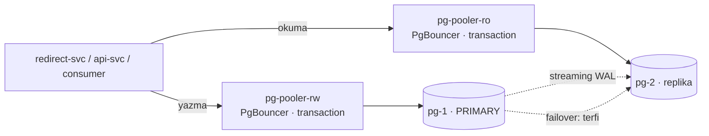

# 09 — database-scaling · "Veritabanı darboğazı"

> **Bu seviyede ne yaşayacaksın?**
> - Postgres'in operatörle yönetilmesi: primary + 1 replika, otomatik failover, önünde PgBouncer; okumalar replikaya, yazmalar primary'ye
> - Yeni yazılan linkin replikada henüz olmaması — read-your-writes ihlali (P09-01)
> - Primary ölünce failover penceresi (P09-02); tuzak: transaction pooling'de prepared statement (P09-03)
> - Replikadaki uzun okumanın WAL ile çakışması (P09-04); partition'sız silmenin pahalılığı (P09-05); replikasyonun yedek olmadığı — silinen satır replikadan da saniyeler içinde gider (P09-06)
>
> **Bu seviye olmasa ne olur?** Tek Postgres tek arıza noktasıdır (P02-03) ve bağlantı sayısı replika × havuz ile duvara çarpar (P02-02).
>
> **Yeni gelen teknolojiler:** CloudNativePG, PgBouncer (Pooler), okuma/yazma ayrımı, tablo partition'ı ([her biri tek cümleyle](../README.md#kullanılan-teknolojiler)).

## 1. Bu seviye ne?

Postgres artık bir operatörle yönetiliyor: **primary + 1 replika**, otomatik failover, önünde
**PgBouncer** (Pooler) ve arkasında partition'lı bir saklama politikası. Uygulama okumayı
replikalara, yazmayı primary'ye gönderiyor. 02'nin iki büyük açığı kapanıyor (bağlantı duvarı ve
tek nokta arıza) — ve yerine **ancak replikan olduğunda sahip olabileceğin** sorunlar geliyor:
replikasyon gecikmesi, read-your-writes, failover penceresi, havuzlama tuzakları.

## 2. Mimari



Çoğullama oranı 25:1 — 500 uygulama bağlantısı, 20 gerçek arka uç bağlantısı. `max_connections`
**bilerek 100'de bırakıldı**: Pooler'ın neden gerektiğini aynı sayıyla görmek için. Küme iki
instance'lık (`instances: 2`): failover (P09-02) ve replika çakışması (P09-04) tek replikayla
ölçülür; üçüncü kopya yalnızca daha fazla yedeklilik getirir ve bu kümenin belleğine sığmaz
(gerekçe `deploy/cnpg.yaml`'da).

## 3. Önceki seviyeden çözülenler

| ID | Sorun | Nasıl çözüldü |
|---|---|---|
| P02-02 | Havuz taşması: replika × pool > max_connections | PgBouncer transaction pooling: uygulama tarafı bol (500), DB tarafı az (20). Replika sayısı artık `max_connections`'ı ilgilendirmiyor |
| P02-03 | DB tek nokta, failover yok | CNPG `Cluster{instances: 2}` + otomatik terfi. Kesinti **sıfırlanmadı**, süresi ve insan müdahalesi ortadan kalktı (P09-02 pencereyi ölçüyor) |

Ayrıca P07-02 (ölçeklemenin darboğazı DB'ye taşıması) büyük ölçüde kapandı: redirect artık 20
bağlantılık havuzla çalışabiliyor çünkü gerçek DB bağlantısı Pooler'da sabit.

## 4. Ayağa kaldırma

İlk kez mi? Önce kök README'deki [Sıfırdan başlangıç](../README.md#sıfırdan-başlangıç) — platform bir kez kurulur (`cd platform && make full`).
Bu seviyenin platformdan istediği: **temel yığın (kind, ingress, Prometheus, Grafana) + Chaos Mesh, KEDA, CloudNativePG**. `make up` ilk adımda (profil) bunları açar ve kullanılmayanları kapatır; bir bileşen kurulu değilse hangi komutla kurulacağını söyleyip durur.

```bash
make up            # profil → build → push → deploy → rollout wait → smoke
code=$(curl -s -XPOST http://lvl09.localtest.me/api/links -H 'Content-Type: application/json' -d '{"url":"https://example.com"}' | jq -r .code); echo "$code"
curl -s -o /dev/null -w '%{http_code} → %{redirect_url}\n' http://lvl09.localtest.me/$code   # 302 → https://example.com
make grafana       # Ladder klasörü, level=lvl09 — giriş: admin / ladder
make load S=mixed  # aynı senaryolar her seviyede: create redirect mixed hot-key burst abuser read-your-writes stairs scan
make repro P=P09-01   # §6'daki bir sorunu otomatik üret → REPRODUCED / NOT-REPRODUCED
make env           # açık ayar/tuzaklar · değiştir: make set E="KEY=değer" · hepsini geri al: make reset (§7)
make down          # seviyeyi kaldır · kümeyi durdurmak için: make -C ../platform stop
```

Kümeye bakmak için:
```bash
kubectl -n lvl09 get cluster,pooler,pods -l cnpg.io/cluster=pg
kubectl -n lvl09 get pods -l cnpg.io/cluster=pg -L cnpg.io/instanceRole   # kim primary?
```

## 5. API

Her seviyede aynı: [docs/API.md](../docs/API.md). Dışarıdan değişiklik yok.

**Ama garanti değişti**: `GET /{code}` artık bir replikadan cevaplanabilir, yani **birkaç yüz
milisaniye geçmişten** okuyor olabilir. Yazma sonrası `STICKY_WINDOW` (2 sn) boyunca okumalar
primary'ye yapışır — bu, read-your-writes'ı yaygın durumda korur (işaret Redis'te: oluşturma
api-svc'de, okuma redirect-svc'de olsa da görünür).

## 6. Reproduce edilebilir sorunlar

| ID | Sorun | Reproduce | Grafana'da | Çözüm |
|---|---|---|---|---|
| P09-01 | Read-your-writes ihlali | `make repro P=P09-01` | [03 · App Business](http://grafana.localtest.me/d/ladder-app-business?var-level=lvl09&from=now-15m&to=now&refresh=10s) · [15 · k6](http://grafana.localtest.me/d/ladder-k6?var-level=lvl09&from=now-15m&to=now&refresh=10s) → "Read-your-writes ihlali" | seviye içi (sticky) |
| P09-02 | Failover penceresi anlık değil | `CONFIRM=1 make repro P=P09-02` | [05 · Postgres](http://grafana.localtest.me/d/ladder-postgres?var-level=lvl09&from=now-15m&to=now&refresh=10s) · [02 · App RED](http://grafana.localtest.me/d/ladder-app-red?var-level=lvl09&from=now-15m&to=now&refresh=10s) → "Replikasyon gecikmesi" | 10 (retry+idempotency) |
| P09-03 | **TRAP** prepared statement + transaction pooling | `make repro P=P09-03` | [03 · App Business](http://grafana.localtest.me/d/ladder-app-business?var-level=lvl09&from=now-15m&to=now&refresh=10s) · [02 · App RED](http://grafana.localtest.me/d/ladder-app-red?var-level=lvl09&from=now-15m&to=now&refresh=10s) → "Yönlendirme sonuçları" | seviye içi |
| P09-04 | Replikada uzun okuma ↔ WAL çakışması | `make repro P=P09-04` | [05 · Postgres](http://grafana.localtest.me/d/ladder-postgres?var-level=lvl09&from=now-15m&to=now&refresh=10s) → Explore ↓ | pazarlık (feedback) |
| P09-05 | Silme pahalı: partition'sız retention | `make repro P=P09-05` | [05 · Postgres](http://grafana.localtest.me/d/ladder-postgres?var-level=lvl09&from=now-15m&to=now&refresh=10s) → "Veritabanı CPU" | seviye içi (partition) |
| P09-06 | Replikasyon yedek değildir | `CONFIRM=1 make repro P=P09-06` | [05 · Postgres](http://grafana.localtest.me/d/ladder-postgres?var-level=lvl09&from=now-15m&to=now&refresh=10s) → "Replikasyon gecikmesi" | kapsam dışı (14 §9, yolun devamı) |

---

### P09-01 · Read-your-writes ihlali

**Belirti:** Kullanıcı link oluşturur, hemen tıklar ve **kendi yarattığı link için 404** alır.
**Neden:** Replika, primary'nin *daha önceki bir ana* ait kopyasıdır. Oraya gönderilen her okuma
geçmişten bir okumadır. [Topic · Konu: Replikasyon gecikmesi, tutarlılık]

**Reproduce:** `make repro P=P09-01` — `read-your-writes` senaryosunu (oluştur → hemen oku) iki kez
koşar: önce yapışkan okuma açık ve replika güncel; sonra yapışkan okuma kapalı ve replikada **WAL
uygulaması duraklatılmış** (`pg_wal_replay_pause()`, script sonunda ne olursa olsun devam ettirir).
WAL gelmeye devam eder ama uygulanmaz: replika gerçekten geçmişte kalır ve her saniye bir saniye
daha geride olur.

**Grafana'da gör:** [`03 · App Business`](http://grafana.localtest.me/d/ladder-app-business?var-level=lvl09&from=now-15m&to=now&refresh=10s), [`15 · k6`](http://grafana.localtest.me/d/ladder-k6?var-level=lvl09&from=now-15m&to=now&refresh=10s) ve [`05 · Postgres`](http://grafana.localtest.me/d/ladder-postgres?var-level=lvl09&from=now-15m&to=now&refresh=10s) — scripti başlatınca aç; iki faz 30'ar sn, arada rollout (giriş: admin / ladder)
- "Read-your-writes ihlali" → birinci fazda (yapışkan okuma açık) **0'da düz**; ikinci fazda sıfırdan ayrılıp yükselir. Bu sayaç sunucu tarafında, okuma replikaya gidip az önce yazılan kodu **bulamadığında** (404) artar — replikanın hata vermesi ya da zaman aşımı ihlal sayılmaz.
- "Senaryoya özel ölçüler" (k6) → `read-your-writes ihlali` aynı anda basamak yapar: istemcinin gözünden aynı olay — kendi yarattığı link için 404.
- "Dönen durum kodları" (k6) → ikinci fazda `302`'lerin yerini `404` alır; bkz. [Grafana'yı okumak](../README.md#grafanayı-okumak).
- "Replikasyon gecikmesi" → replika pod'unun çizgisi birinci fazda 0; duraklatma boyunca **doğrusal tırmanır** (alınan ama uygulanmayan WAL) ve devam ettirilince 0'a düşer. CNPG metrikleri 30 sn'de bir kazındığı için tırmanış bir-iki noktadan ibarettir; script duraklatmanın sonundaki gecikmeyi doğrudan replikadan okuyup basar.
- Explore'da: `sum(rate(db_reads_routed_total{namespace="lvl09"}[1m])) by (target)` → birinci fazda okumaların bir kısmı `primary`'ye yapışır; ikinci fazda hepsi `replica`'ya gider.

**Neden `replica-delay` chaos'u değil?** `platform/chaos/replica-delay.yaml` replikanın
**gönderdiği** paketleri geciktirir, aldığı WAL'i değil. Sonuç bayat değil **yavaş** bir replikadır:
sorgu cevapları ~3 sn geç gelir (3 sn'lik sorgu timeout'unda `503`), WAL onayları geç gittiği için
primary'nin gözünden gecikme ~3 sn görünür (`cnpg_pg_stat_replication_replay_lag_seconds`), ama
replikanın kendi gecikmesi ("Replikasyon gecikmesi" paneli) ~0 kalır ve kimse 404 almaz. Sunucu
sayacı zaman aşımlarını da ihlal saydığı için bu chaos'la deney, tek bir 404 olmadan "ihlal arttı"
derdi. *Yavaş replika ile bayat replika farklı arızalardır; birini ölçüp diğerini raporlama.*

**Çözümler ve bedelleri:**

| Yaklaşım | Bedeli |
|---|---|
| Yapışkan okuma *(uygulanmış)* | Yazma sonrası N sn okuma ölçeklenmesinden ödün; işaret Redis'te, iki servis de görür — Redis yoksa korunmaz |
| Senkron replikasyon | Yazma gecikmesi en yavaş replikaya bağlanır |
| LSN takibi | En doğru, en karmaşık: client yazmanın LSN'ini taşır |
| Yeni kaydı önbelleğe yaz | Ucuz ama yalnızca önbellek isabetinde — 03'te bunu **bilerek** yapmamıştık |

*"Eventual consistency" bir kullanıcıya yapılabilecek en kötü savunmadır: 404 gördüğü an sistem
onun için bozuktur.*

---

### P09-02 · Failover penceresi

**Belirti:** Primary öldürüldüğünde ~10–30 saniye yazma yapılamaz, sonra sistem kendini toparlar.
**Neden:** Terfi anlık değildir: WAL uygulaması, rol ilanı, istemcilerin yeni adrese yönlenmesi.
[Topic · Konu: HA, failover, SLO]

**Reproduce:** `CONFIRM=1 make repro P=P09-02` — yük altında primary'yi siler, terfi süresini ve
5xx'i ölçer.

**Grafana'da gör:** [`05 · Postgres`](http://grafana.localtest.me/d/ladder-postgres?var-level=lvl09&from=now-15m&to=now&refresh=10s) ve [`02 · App RED`](http://grafana.localtest.me/d/ladder-app-red?var-level=lvl09&from=now-15m&to=now&refresh=10s) — scripti başlatınca aç; yük 120 sn, primary 15. saniyede silinir (giriş: admin / ladder)
- Explore'da: `max by (pod) (cnpg_pg_replication_in_recovery{namespace="lvl09"})` → roller: `0` = primary, `1` = replika. Primary silinince replikanın çizgisi 1'den **0'a** iner (terfi); silinen pod bir süre kaybolur ve **1** olarak (yeni replika) geri gelir.
- "Replikasyon gecikmesi" → çizgiler 0 civarında; silinen pod'un çizgisi **kopar** ve pod replika olarak geri gelince yeniden başlar. Boşluk, o pod'un yeniden kurulma süresidir.
- "5xx (uç noktaya göre)" → primary silinince bir 5xx tepesi (başta yazma yolu `/api/links`: `503 store_error`), saniyeler sonra **kendiliğinden** 0'a döner — insan müdahalesi olmadan. Tepenin genişliği, failover penceresidir.
- "Bağlantılar ve üst sınır" → 09'dan itibaren CNPG'nin `cnpg_backends_total` metriğinden (postgres_exporter yok): primary silinince onun bağlantı çizgileri **kopar**, terfi eden pod'da yeniden kurulur — Pooler'lar yeni primary'ye bağlanıyor. Üst çizgi `max_connections` (100) sabit kalır.

**02 ile fark:** Orada kesinti **insan müdahalesine kadar** sürüyordu. Burada saniyeler — ama sıfır
değil ve olamaz.
**Uygulama tarafında gereken:** yazma hatalarında retry **+ idempotency**. Retry idempotent değilse
failover çift kayıt üretir — 06'daki `processed_events` deseninin yazma yolundaki karşılığı.
*SLO yazarken: "failover var" cümlesi "%100 erişilebilirlik" anlamına gelmez.*

---

### P09-03 · TRAP · Prepared statement + transaction pooling

**Belirti:** `prepared statement "stmtcache_..." does not exist` — **aralıklı**, yük arttıkça sıklaşan.
**Neden:** PgBouncer transaction modunda bağlantı sana yalnızca bir işlem süresince aittir. pgx bir
arka uç bağlantısında hazırlar, başka birinde çalıştırır. [Topic · Konu: Bağlantı çoğullama]

**Reproduce:** `make repro P=P09-03` — `QueryExecModeExec` (varsayılan) ve prepared modu karşılaştırır.

**Grafana'da gör:** [`03 · App Business`](http://grafana.localtest.me/d/ladder-app-business?var-level=lvl09&from=now-15m&to=now&refresh=10s) ve [`02 · App RED`](http://grafana.localtest.me/d/ladder-app-red?var-level=lvl09&from=now-15m&to=now&refresh=10s) — scripti başlatınca aç; iki faz 40'ar sn, arada redirect rollout'u (giriş: admin / ladder)
- "Yönlendirme sonuçları" → birinci fazda `error` serisi 0'da; ikinci fazda (prepared açık) **aralıklı** sıfırdan ayrılır. Önbellek isabetleri DB'ye gitmediği için hata her istekte değil, yalnızca DB'ye inen okumalarda çıkar.
- "5xx (uç noktaya göre)" → aynı anda `/{code}` için düzensiz 5xx tepeleri (`503 store_error`): kullanıcı, havuzlamanın bir protokol ayrıntısını görüyor.
- Explore'da: `sum(rate(db_queries_total{namespace="lvl09",result="error"}[1m])) by (op)` → birinci fazda 0, ikinci fazda sıfırdan ayrılır ve dalgalanır. (`05 · Postgres` → "DB queries by op" paneli sonuçları ayırmadan toplar; hatayı orada göremezsin.)

**Genel ders:** *Bağlantıları çoğullayan bir proxy, "bağlantı"nın ne demek olduğunu değiştirir.*
Bağlantı kimliğine dayanan her özellik yeniden gözden geçirilmeli: prepared statement · oturum
değişkenleri (`SET`) · `LISTEN/NOTIFY` · geçici tablolar · advisory lock.
**Seçenekler:** client tarafı exec modu *(uygulanmış)* · PgBouncer'da `max_prepared_statements>0` ·
session pooling (çoğullama oranını, yani Pooler'ı almanın sebebini kaybedersin).

---

### P09-04 · Replikada uzun okuma ↔ WAL çakışması

**Belirti:** `canceling statement due to conflict with recovery` — ya da `hot_standby_feedback=on`
ile: çakışma yok, ama primary'de vacuum gecikir ve şişme artar.
**Neden:** Replika WAL'i uygulamak zorundadır; uzun bir okuma, silinmesi gereken satırları tutar.
[Topic · Konu: Replika çakışmaları, vacuum]

**Reproduce:** `make repro P=P09-04` — replikada uzun sorgu başlatıp primary'de yoğun yazma+vacuum
yapar, `pg_stat_database_conflicts`'i okur.

**Grafana'da gör:** [`05 · Postgres`](http://grafana.localtest.me/d/ladder-postgres?var-level=lvl09&from=now-15m&to=now&refresh=10s) — scripti başlatınca aç; replikadaki uzun sorgu 45 sn sürer, yük yok (giriş: admin / ladder)
- Explore'da: `max by (application_name) (cnpg_pg_stat_replication_backend_xmin_age{namespace="lvl09"})` → primary'nin gözünden replikanın **rehin tuttuğu xmin'in yaşı**: uzun sorgu sürerken geri inmez, sorgu bitince düşer. Artış, o sürede primary'de işlenen işlem sayısı kadardır — yük yoksa küçük bir basamak.
- Explore'da: `sum(increase(cnpg_pg_stat_database_tup_deleted{namespace="lvl09",datname="linkly"}[1m]))` → script'in 50 bin satırlık `DELETE`'i bir tepe olarak görünür: vacuum'un temizleyemediği çöp bu.
- Explore'da: `sum(cnpg_pg_stat_database_conflicts{namespace="lvl09",datname="linkly"})` → **düz** kalır: `hot_standby_feedback=on` olduğu için replikada iptal yok — bedel primary'deki şişmede ödeniyor.
- Ölü satırlar (vacuum bekleyen) paneline bakma — bu seviyede **boştur**: postgres_exporter'ın tablo başına metriğini okur, CNPG bunu yayınlamaz. Ölü satır sayılarını (taban → rehinli → serbest) script terminalde basar; asıl kanıt o üç sayıdır.

**Ders:** *Bir replika "ücretsiz okuma kapasitesi" değildir.* Primary ile arasında bir pazarlık
vardır (`hot_standby_feedback`) ve pazarlığın hangi tarafını seçtiğini bilmezsen, seni o taraf bulur.

---

### P09-05 · Silme pahalı: partition'sız retention

**Belirti:** 500 bin satırlık `DELETE` uzun sürer, ölü satır bırakır ve **tablo küçülmez**.
Bir partition'ı `DROP` etmek milisaniyeler sürer ve borç bırakmaz.
**Neden:** MVCC'de silinen satır "ölü" olarak kalır; yeri vacuum sonrası kullanılabilir, diske geri
vermek `VACUUM FULL` (tam kilit) ister. [Topic · Konu: Partition, retention, MVCC]

**Reproduce:** `make repro P=P09-05` — düz tabloda DELETE maliyetini, partition'lı tabloda DROP
maliyetiyle karşılaştırır.

**Grafana'da gör:** [`05 · Postgres`](http://grafana.localtest.me/d/ladder-postgres?var-level=lvl09&from=now-15m&to=now&refresh=10s) — scripti başlatınca aç; 500 bin satır ekler, siler, sonra bir partition düşürür; yük yok (giriş: admin / ladder)
- "Veritabanı CPU" → `pg-…` primary pod'unda iki tepe: 500 bin satırlık `INSERT` ve ardından `DELETE`. Partition `DROP`'u bu panelde **görünmez** — satır satır silmiyor, dosyayı atıyor.
- "İşlem / sn" → **kıpırdamaz**: 500 bin satırlık `DELETE` tek bir işlemdir. Maliyeti işlem sayısında değil, dokunduğu satır sayısında ve bıraktığı çöptedir — işlem/sn'ye bakan biri onu hiç görmez.
- Explore'da: `max(cnpg_pg_database_size_bytes{namespace="lvl09",datname="linkly"})` → ekleme sırasında basamakla yükselir ve `DELETE`'ten sonra **inmez**: silinen satırların yeri diske geri verilmiyor.
- Explore'da: `sum(increase(cnpg_pg_stat_database_tup_deleted{namespace="lvl09",datname="linkly"}[1m]))` → `DELETE` yüz binlerce satırlık bir tepe çizer; partition `DROP`'u bu sayaçta **hiç** görünmez.
- "Ölü satırlar (vacuum bekleyen)" → bu seviyede **boştur**: panel postgres_exporter'ın tablo başına metriğini okur, CNPG bunu yayınlamaz. `DELETE`'in bıraktığı ölü satır sayısını ve tablo boyutunu (önce → sonra) script terminalde basar.

**Ders:** *Saklama süresi bir şema kararıdır, bir zamanlanmış iş değil.* Tabloyu zamana göre
bölersen silmek ücretsizleşir; bölmezsen her gece koşan bir `DELETE` cron'uyla ve onun vacuum
borcuyla yaşarsın.

---

### P09-06 · Replikasyon yedek değildir

**Belirti:** Bir satır silindiğinde replikada da **saniyeler içinde** yok olur.
**Neden:** Replikasyon hatayı da kopyalar. [Topic · Konu: Yedekleme, PITR]

**Reproduce:** `CONFIRM=1 make repro P=P09-06` — test linkini siler ve replikada da kaybolduğunu gösterir.

**Grafana'da gör:** [`05 · Postgres`](http://grafana.localtest.me/d/ladder-postgres?var-level=lvl09&from=now-15m&to=now&refresh=10s) — script bittikten sonra aç (giriş: admin / ladder)
- "Replikasyon gecikmesi" → her pod için 0 civarında düz çizgi: replika primary'yi saniyeler içinde yakalıyor — yanlış `DELETE`'i de aynı hızla kopyalıyor. Düşük gecikme burada iyi haber değil, hatanın yayılma hızıdır.
- Tek satırlık silmenin kendisi hiçbir panelde görünmez; kanıt script çıktısındaki `silme öncesi replikada: 1 satır · silme sonrası: 0 satır` satırıdır.

**Ders:** *Yedek, zamanda geri gitme yeteneğidir; replika ise zamanda ileri gitmenin kopyasıdır.*
Gerçek koruma üç ayaklıdır: (1) sürekli WAL arşivleme, (2) periyodik temel yedek, (3) **düzenli
geri yükleme tatbikatı**. Üçüncüsü olmadan ilk ikisi bir temennidir — bu yüzden bu seviyede nesne
deposu **bilerek yapılandırılmadı**: yedeklemeyi "açmak" bir YAML bloğu; asıl mesele tatbikat, ve
tatbikat bu merdivenin kapsamı dışında kalır (14 §9, "yolun devamı").

## 7. Seviye içi alıştırmalar (TRAP_ bayrakları)

> **Nasıl uygulanır:** aç `make set E="TRAP_X=true"` · ne açık? `make env` · hepsini geri al `make reset` (ortamı `deploy/`'daki hâline döndürür; `make unset E=TRAP_X` yalnızca siler). Tablodaki diğer ayarlar da aynı yolla (`make set E="CACHE_TTL=1h"`). Pod'lar yeni değerle yeniden başlar; komut hazır olunca döner. Varsayılan olarak seviyenin TÜM uygulama servislerine uygulanır (tek servis: `W=redirect`); 12'den itibaren Argo Rollout'larda da çalışır — `kubectl set env` orada çalışmaz. `make repro` scriptleri tuzağı KENDİLERİ açıp kapatır ve bitince ortamı eski hâline getirir (senin açtıkların dahil): elle alıştırma için `make set` + `make load`, otomatik ölçüm için `make repro`. Bitirince `make reset`: açık kalan bir tuzak sonraki deneyi sessizce bozar.

| Bayrak | Ne yapar | Reproduce | Düzeltme |
|---|---|---|---|
| `TRAP_NO_STICKY` | Yazma sonrası yapışkan okumayı kapatır | `make repro P=P09-01` | Bayrağı kapat |
| `TRAP_PREPARED_STATEMENTS` | pgx'i prepared moduna zorlar | `make repro P=P09-03` | Bayrağı kapat |
| `TRAP_GLOBAL_LIMIT` · `TRAP_IGNORE_XFF` · `TRAP_TRUST_ANY_XFF` | (08'den devam) | 08'de | — |

Elle denemeye değer:
- `DATABASE_URL_RO`'yu boşalt: okuma/yazma ayrımı kapanır, 09'un **tüm yeni sorunları kaybolur** —
  ve okuma ölçeklenmesi de. *Tek bir env değişkeni, bir mimari kararın tamamını geri alıyor;
  takasın bu kadar görünür olması iyi bir tasarım işaretidir.*
- `default_pool_size`'ı 2'ye düşür: çoğullama oranı artar, ama işlemler PgBouncer'da kuyruğa girer.
  P02-06'nın aynısını bu kez **proxy'de** görürsün. *Kuyruğu bir katman aşağı itmek, yok etmek değildir.*
- `kubectl -n lvl09 cnpg promote pg pg-2` (plugin varsa) ile planlı bir failover yap: plansız
  olanla süresini karşılaştır.
- `STICKY_WINDOW=30s` yap ve `make load S=mixed` koş: RYW ihlali biter, ama okumaların büyük kısmı
  primary'ye gider — replika boşta kalır. **Tutarlılık ile ölçeklenme arasındaki düğme budur.**

## 8. Gözlemlenebilirlik: hangi paneller dolu, hangileri boş

| Dashboard | Durum | Neden |
|---|---|---|
| [`05 · Postgres`](http://grafana.localtest.me/d/ladder-postgres?var-level=lvl09&from=now-15m&to=now) | **Zenginleşti** ✨ — kısmen | CNPG PodMonitor: replikasyon gecikmesi, roller, WAL; bağlantı / üst sınır / işlem/sn / bellekten okuma oranı panelleri CNPG metriklerine düşüyor. postgres_exporter olmadığı için **tablo tarama, kilitler ve ölü satırlar boş**. Ayrıca `db_reads_routed_total` |
| [`03 · App Business`](http://grafana.localtest.me/d/ladder-app-business?var-level=lvl09&from=now-15m&to=now) | Dolu — **RYW ihlali artık gerçek** | 09'a kadar bu sayaç hep 0 idi |
| [`10 · Rate limit`](http://grafana.localtest.me/d/ladder-ratelimit?var-level=lvl09&from=now-15m&to=now) · [`09 · Autoscaling`](http://grafana.localtest.me/d/ladder-autoscaling?var-level=lvl09&from=now-15m&to=now) · [`08 · Stream`](http://grafana.localtest.me/d/ladder-stream?var-level=lvl09&from=now-15m&to=now) · [`04 · Cache`](http://grafana.localtest.me/d/ladder-cache?var-level=lvl09&from=now-15m&to=now) · [`06 · Redis`](http://grafana.localtest.me/d/ladder-redis?var-level=lvl09&from=now-15m&to=now) | Dolu | — |
| [`11 · Resilience`](http://grafana.localtest.me/d/ladder-resilience?var-level=lvl09&from=now-15m&to=now) · [`12 · SLO`](http://grafana.localtest.me/d/ladder-slo?var-level=lvl09&from=now-15m&to=now) · [`13 · Rollout`](http://grafana.localtest.me/d/ladder-rollout?var-level=lvl09&from=now-15m&to=now) | Boş | — |

Yeni okuma alışkanlığı: `db_reads_routed_total{target}`. Okumaların ne kadarı replikaya gidiyor?
Oran beklenenden düşükse ya sticky pencere çok uzun ya da replika sağlıksız — ve ikisi de
"DB yavaş" diye rapor edilir.

## 9. Bilerek bırakılanlar

- **Nesne deposu / PITR yapılandırılmadı** (P09-06; yedek + geri yükleme tatbikatı 14 §9'da "yolun devamı").
- **`max_connections` hâlâ 100** — Pooler olmasa duvar aynı yerde; sayıyı değiştirmemek bilinçli.
- **Yapışkan işaret Redis'te ve fail-open**: Redis yoksa işaret okunamaz, okuma replikaya gider (bkz. `store/recent.go`) — tazelik, yazma yolunu Redis'e bağlamaktan ucuz bir kayıp sayıldı.
- **Partition'lar elle oluşturuluyor** (migration 005, 9 günlük). Üretimde `pg_partman` ya da bir
  operatör gerekir — *"partition'lar kendiliğinden oluşmaz" dersi görünür kalsın diye elle.*
- **`clicks_daily` partition'sız**: satır sayısı kod×gün ile sınırlı olduğu için gerekmedi.
- **Okuma replikası coğrafi değil**: aynı kümede, aynı bölgede. Çok bölgeli okuma kapsam dışı (14 §9, "yolun devamı").
- **08'den devreden**: tek Redis (hem önbellek hem limiter), kimlik yok, tek partition.

## 10. `make diff-prev` okuma rehberi

`make diff-prev` 08 ile farkı gösterir:

1. **`internal/store/readwrite.go`** (yeni): `Store` arayüzünü **üçüncü kez** sarmaladık
   (02: Postgres, 03/04: Cached, 09: ReadWrite). Aynı arayüz, üç farklı mimari karar — 01'de
   `CreateUnique`'i koşullu ekleme olarak tasarlamanın faturası burada da kesilmiyor.
2. **`internal/store/recent.go`** (yeni): yapışkan okumanın işareti. Redis'te, çünkü 07'den beri
   oluşturma api-svc'de, okuma redirect-svc'de: süreç içi bir işaret servisler arası hiç eşleşmez.
   Yorumu, bunun neden sessizce fark edilmeden kalacağını anlatıyor.
3. **`deploy/cnpg.yaml`**: `deploy/postgres.yaml`'ın yerini aldı. Karşılaştırmalı oku —
   birkaç satırlık `instances: 2` + `Pooler`, 02'deki 90 satırlık StatefulSet'in yapamadığı her şeyi
   yapıyor. **Operatörün değeri budur; ve tam da bu yüzden 02'de kullanmadık.**
4. **`internal/store/postgres.go` → `OpenWithMode`**: tek satırlık `QueryExecModeExec`, P09-03'ün
   tamamı. Bir proxy eklemek, client kütüphanesinin varsayımlarını geçersiz kılabilir.
5. **`migrations/005`**: `PARTITION BY RANGE` + `NO TRANSACTION`. Partition'lamanın sebebi sorgu
   hızı değil, **silmeyi ucuzlatmak**.
