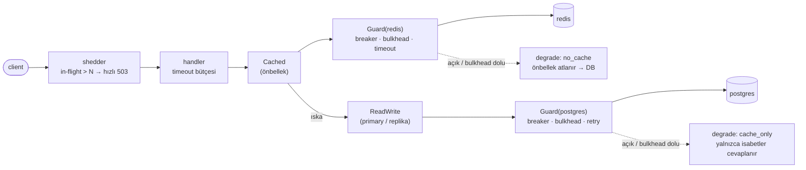

# 10 — resilience · "Hata izolasyonu"

> **Bu seviyede ne yaşayacaksın?**
> - Bir bağımlılık kısmen bozulunca sistemin tamamen değil kısmen bozulması: timeout bütçesi, bütçeli retry, devre kesici, bulkhead, yük atma — hepsi tek bir `Guard`'da
> - Tuzak: bütçesiz retry'ın arızalı bağımlılığa giden yükü katlaması (P10-01); tuzak: readiness'ın bağımlılığa bakınca bütün pod'ları birden düşürmesi (P10-02)
> - İç ve dış timeout'lar hizasızken işin boşa yapılması (P10-03); tuzak: devre kesicinin açılması, denemesi ve flapping (P10-04)
> - Tuzak: yavaş bir bağımlılığın ölü bir bağımlılıktan beter olması (P10-05); kapasite dolunca kabul edileni hızlı tutmak için yük atmak (P10-06)
>
> **Bu seviye olmasa ne olur?** Yavaşlayan tek bir Redis ya da DB bütün istek havuzunu doldurur; bir bağımlılığın arızası bütün servisin arızası olur.
>
> **Yeni gelen teknolojiler:** `internal/resilience` (timeout, retry, breaker, bulkhead, shedder), degrade modları, `11 · Resilience` paneli ([her biri tek cümleyle](../README.md#kullanılan-teknolojiler)).

## 1. Bu seviye ne?

Tek soru: bir bağımlılık **kısmen** bozulduğunda sistem tamamen bozulmak yerine nasıl **kısmen
çalışır** kalır? Beş mekanizma ekleniyor ve hiçbiri diğerinin yerine geçmiyor: timeout bütçesi,
bütçeli retry, devre kesici, bulkhead ve yük atma. Her biri `internal/resilience` içinde, hepsi
tek bir `Guard` ile birleşiyor ve `store.Guarded` dekoratörüyle veri yoluna uygulanıyor.

## 2. Mimari



Her bağımlılığın **kendi** guard'ı ve kendi `dep` etiketi var (`postgres`, `redis`). Postgres
guard'ı önbelleğin **altında** durur ve yalnızca veritabanı çağrılarını sarar: önbellek isabetleri
ona hiç uğramaz. Bu sıra bir tasarım kararıdır — guard'ın nerede durduğu neyi ölçtüğünü belirler
(bkz. `store/guarded.go`).

Her mekanizmanın işi farklı:

| Mekanizma | Sorusu | Neyi korur |
|---|---|---|
| timeout | ne kadar beklerim? | tek isteği |
| retry (+ bütçe, + jitter) | tekrar dener miyim? | geçici kayıptan kurtarır |
| breaker | sormaya devam eder miyim? | bağımlılığı **ve** beklemekten seni |
| bulkhead | aynı anda kaç kişi sorar? | diğer bağımlılıkların kapasitesini |
| shedding | kabul eder miyim? | kabul ettiklerinin gecikmesini |

## 3. Önceki seviyeden çözülenler

| ID | Sorun | Nasıl çözüldü |
|---|---|---|
| P04-01 | Redis düşünce tüm yük DB'ye iner | Bulkhead + devre kesici: DB'ye giden eşzamanlılık sınırlı, bağımlılık bozulunca hızlı reddediliyor. Kesinti **taşınmıyor**, sınırlanıyor |

Ayrıca P02-06 (yavaş sorgu → havuz tıkanması) ve P09-02 (failover penceresi) büyük ölçüde
emiliyor: timeout + retry + breaker üçlüsü, geçici arızaları kullanıcıya yansıtmadan yutuyor.

## 4. Ayağa kaldırma

İlk kez mi? Önce kök README'deki [Sıfırdan başlangıç](../README.md#sıfırdan-başlangıç) — platform bir kez kurulur (`cd platform && make full`).
Bu seviyenin platformdan istediği: **temel yığın (kind, ingress, Prometheus, Grafana) + Chaos Mesh, KEDA, CloudNativePG**. `make up` ilk adımda (profil) bunları açar ve kullanılmayanları kapatır; bir bileşen kurulu değilse hangi komutla kurulacağını söyleyip durur.

```bash
make up            # profil → build → push → deploy → rollout wait → smoke
code=$(curl -s -XPOST http://lvl10.localtest.me/api/links -H 'Content-Type: application/json' -d '{"url":"https://example.com"}' | jq -r .code); echo "$code"
curl -s -o /dev/null -w '%{http_code} → %{redirect_url}\n' http://lvl10.localtest.me/$code   # 302 → https://example.com
make grafana       # Ladder klasörü, level=lvl10 — giriş: admin / ladder
make load S=mixed  # aynı senaryolar her seviyede: create redirect mixed hot-key burst abuser read-your-writes stairs scan
make repro P=P10-01   # §6'daki bir sorunu otomatik üret → REPRODUCED / NOT-REPRODUCED
make env           # açık ayar/tuzaklar · değiştir: make set E="KEY=değer" · hepsini geri al: make reset (§7)
make chaos C=pg-loss-30   # bu seviyenin ana aracı
make unchaos
make down          # seviyeyi kaldır · kümeyi durdurmak için: make -C ../platform stop
```

## 5. API

Her seviyede aynı: [docs/API.md](../docs/API.md).

Yeni davranış: aşırı yükte `503 {"error":"overloaded"}` + `Retry-After`. Bu bir arıza değil bir
**karardır** — sunucu, kabul ettiği isteklere hızlı cevap verebilmek için fazlasını erken reddediyor.

## 6. Reproduce edilebilir sorunlar

| ID | Sorun | Reproduce | Grafana'da | Çözüm |
|---|---|---|---|---|
| P10-01 | **TRAP** bütçesiz retry = yükseltec | `make repro P=P10-01` | [11 · Resilience](http://grafana.localtest.me/d/ladder-resilience?var-level=lvl10&from=now-15m&to=now&refresh=10s) → "Yeniden deneme / sn" | seviye içi |
| P10-02 | **TRAP** readiness bağımlılığa bakar | `CONFIRM=1 make repro P=P10-02` | [11 · Resilience](http://grafana.localtest.me/d/ladder-resilience?var-level=lvl10&from=now-15m&to=now&refresh=10s) · [15 · k6](http://grafana.localtest.me/d/ladder-k6?var-level=lvl10&from=now-15m&to=now&refresh=10s) → "Hazır pod adresi (endpoint) sayısı" | seviye içi |
| P10-03 | Timeout hizasızlığı: boşa çalışan sunucu | `make repro P=P10-03` | [11 · Resilience](http://grafana.localtest.me/d/ladder-resilience?var-level=lvl10&from=now-15m&to=now&refresh=10s) · [15 · k6](http://grafana.localtest.me/d/ladder-k6?var-level=lvl10&from=now-15m&to=now&refresh=10s) → "Başarısız oran (zaman içinde)" | seviye içi |
| P10-04 | **TRAP** devre kesici yok / flapping | `make repro P=P10-04` | [11 · Resilience](http://grafana.localtest.me/d/ladder-resilience?var-level=lvl10&from=now-15m&to=now&refresh=10s) · [02 · App RED](http://grafana.localtest.me/d/ladder-app-red?var-level=lvl10&from=now-15m&to=now&refresh=10s) → "Devre kesici durumu (0 kapalı · 1 yarı açık · 2 açık)" | seviye içi |
| P10-05 | **TRAP** yavaş bağımlılık, ölüden beter | `make repro P=P10-05` | [01 · Pods & Resources](http://grafana.localtest.me/d/ladder-pods?var-level=lvl10&from=now-15m&to=now&refresh=10s) · [11 · Resilience](http://grafana.localtest.me/d/ladder-resilience?var-level=lvl10&from=now-15m&to=now&refresh=10s) → "Goroutine sayısı" | seviye içi |
| P10-06 | Yük atma: kabul edileni hızlı tut | `make repro P=P10-06` | [11 · Resilience](http://grafana.localtest.me/d/ladder-resilience?var-level=lvl10&from=now-30m&to=now&refresh=10s) · [15 · k6](http://grafana.localtest.me/d/ladder-k6?var-level=lvl10&from=now-30m&to=now&refresh=10s) → "Atılan yük / sn" | seviye içi |

---

### P10-01 · TRAP · Bütçesiz retry bir yükseltectir

**Belirti:** %30 hata oranında, bütçesiz "3 deneme" bağımlılık çağrılarını katlar — tam da
bağımlılık zaten hata verirken.
**Neden:** Retry bir **kurtarma** aracıdır, bir kapasite aracı değil. Bütçe olmadan, arızanın
hızlandırıcısına dönüşür. [Topic · Konu: Retry amplification, backoff, jitter]

**Reproduce:** `make repro P=P10-01` — `pg-loss-30` altında bütçeli ve bütçesiz modu karşılaştırır.

**Grafana'da gör:** [`11 · Resilience`](http://grafana.localtest.me/d/ladder-resilience?var-level=lvl10&from=now-15m&to=now&refresh=10s) — scripti başlatınca aç; `pg-loss-30` altında iki faz 45'er sn, arada redirect rollout'u (giriş: admin / ladder)
- "Yeniden deneme / sn" → `postgres` çizgisi birinci fazda (bütçeli) alçak kalır — bütçe, retry'ı trafiğin en fazla %10'uyla sınırlıyor; ikinci fazda (`TRAP_NAIVE_RETRY`) **belirgin** yükselir.
- "Bağımlılık hatası / sn" → `postgres` çizgisi kayıp boyunca iki fazda da sıfırın üstünde: retry'ların üstüne bindiği arıza bu. Zaman aşımına düşen denemeler bu panelde değil, `result="timeout"` serisinde sayılır.
- Explore'da: `sum(rate(dependency_requests_total{namespace="lvl10",dep="postgres"}[1m]))` → aynı k6 yüküyle ikinci fazda daha yüksek: bir kullanıcı isteği birden çok bağımlılık çağrısına dönüşüyor — script'in karşılaştırdığı sayı bu.

**Üçü birlikte olmalı:** üstel geri çekilme + **jitter** + **bütçe**. Jitter'sız retry'lar
senkronize olur (P03-07'deki TTL hizalanmasıyla aynı fizik); bütçesiz retry ikinci bir yük
kaynağıdır.
**Korumanın kendisi de sınanır:** bütçeyi harcayan `retCount++` satırı olmasa bütçe her zaman
"boş" görünür ve retry sınırsız kalır — kod derlenir, koruma "var" görünür. Bunu
`TestRetryBudgetCapsAmplification` birim testi yakalar.
*Bir korumanın var olması ile çalışıyor olması ayrı şeylerdir.*

---

### P10-02 · TRAP · Readiness'ın bağımlılığa bakması (ikinci kez)

**Belirti:** Redis 10 saniye kesildiğinde hazır endpoint sayısı **sıfıra** iner.
**Neden:** P02-10'un kardeşi, yeni bağımlılıkla. Fail-open sayesinde hizmet **çalışır** (DB'ye
düşülür) ama readiness Redis'e bakıyorsa tüm pod'lar aynı anda düşer.
[Topic · Konu: Probe semantiği, kaskad]

**Reproduce:** `CONFIRM=1 make repro P=P10-02` — Redis'i durdurup iki modda en düşük hazır
endpoint sayısını ölçer.

**Grafana'da gör:** [`11 · Resilience`](http://grafana.localtest.me/d/ladder-resilience?var-level=lvl10&from=now-15m&to=now&refresh=10s) ve [`15 · k6`](http://grafana.localtest.me/d/ladder-k6?var-level=lvl10&from=now-15m&to=now&refresh=10s) — scripti başlatınca aç; iki faz 90'ar sn, Redis her fazda ~40 sn durur (giriş: admin / ladder)
- "Hazır pod adresi (endpoint) sayısı" → `redirect-…` çizgisine bak. Birinci fazda Redis dururken **düz** kalır; ikinci fazda (`TRAP_READY_CHECKS_REDIS`) **0'a** iner ve Redis dönünce bütün pod'larla **aynı anda** geri gelir. (Aynı metrik `01 · Pods & Resources` → "Endpoint (hazır adres) sayısı" panelinde de var.)
- "Azaltılmış mod (degrade)" → birinci fazda Redis durunca `no_cache` **1'e çıkar**: Redis guard'ının devresi açıldı, önbellek atlanıyor ve okumalar DB'den cevaplanıyor. Redis dönünce ilk başarılı çağrıyla 0'a iner. Bağımlılığın durumu burada, bir METRİKTE görünüyor — pod ise trafik almaya devam ediyor. İkinci fazda da kısa bir süre 1 olabilir; ama pod'lar zaten trafikten düşmüştür.
- "Dönen durum kodları" (k6) → birinci fazda `302` kesintisiz sürer; ikinci fazda Redis kesintisi boyunca `503` (ingress: gönderilecek hazır pod yok). Bkz. [Grafana'yı okumak](../README.md#grafanayı-okumak).

**En sinsi tarafı:** bağımlılık **döndüğünde** tüm pod'lar aynı anda geri gelir ve onu ikinci kez
devirir — kurtarma da senkronize olur.
**Doğrusu kodda:** Redis kendi guard'ının arkasında; kesinti onun devresini açar ve `no_cache`
degrade modunu işaretler. Tepki pod'u öldürmek değil, önbelleksiz hizmet vermektir.
*Readiness "ben trafik alabilir miyim?" sorusudur. "Bağımlılığım iyi mi?" sorusunun cevabı bir
metriktir ve tepkisi degrade mod ya da devre kesicidir.*

---

### P10-03 · Timeout hizasızlığı

**Belirti:** Client 1 sn sonra vazgeçer; sunucu 30 sn daha çalışır ve cevabı kimseye teslim edemez.
**Neden:** Timeout bütçesi bir **zincirdir**: her katman, kendisini çağıranın kalan süresinden az
beklemeli. `handler > bağımlılık ≥ sorgu`. [Topic · Konu: Timeout bütçesi]

**Reproduce:** `make repro P=P10-03` — `pg-delay-2s` altında in-flight, goroutine, bağımlılık
timeout'u ve bulkhead reddini ölçer.

**Grafana'da gör:** [`11 · Resilience`](http://grafana.localtest.me/d/ladder-resilience?var-level=lvl10&from=now-15m&to=now&refresh=10s) ve [`15 · k6`](http://grafana.localtest.me/d/ladder-k6?var-level=lvl10&from=now-15m&to=now&refresh=10s) — scripti başlatınca aç; `pg-delay-2s` altında yük 45 sn sürer (giriş: admin / ladder)
- "Başarısız oran (zaman içinde)" (k6) → yük boyunca yüksek: client her isteği 1 sn'de bırakıp gidiyor.
- "Şu an işlenen istek (pod'a göre)" → aynı anda **yükselir**: client'ın bıraktığı istekleri sunucu hâlâ taşıyor. İki panel arasındaki fark, kimseye teslim edilmeyecek iştir.
- "Bağımlılık gecikmesi p99" → `postgres` tavan yapar ve orada düzleşir: bağımlılık timeout'u (2 sn) çağrıyı kesiyor. Histogram kovası 2,5 sn'de olduğu için çizgi 2–2,5 sn bandında görünür.
- Explore'da: `sum(rate(dependency_requests_total{namespace="lvl10",dep="postgres",result=~"timeout|bulkhead"}[1m])) by (result)` → `timeout` ve `bulkhead` serileri yükte sıfırdan ayrılır: koruma çalışıyor, yavaş bağımlılık kendisine ayrılan eşzamanlılıkla sınırlı kalıyor. Script'in REPRODUCED koşulu tam bu.

**Eksik kalan halka:** sunucu tarafı `statement_timeout` (P02-06). Client vazgeçse bile Postgres
sorguyu durdurmaz — *bunu yalnızca DB'nin kendisi yapabilir.*

---

### P10-04 · TRAP · Devre kesici: açılma, deneme, flapping

**Belirti:** Devre kesici kapalıyken (`TRAP_NO_BREAKER`) her istek bozuk bağımlılığa gider ve
p99 tavan yapar; açıkken istekler hızlıca reddedilir.
**Neden:** Devre kesicinin işi bağımlılığı **kurtarmak** değil, ona ve sana nefes aldırmaktır.
[Topic · Konu: Circuit breaker, yanlış pozitif]

**Reproduce:** `make repro P=P10-04` — `pg-loss-50` altında breaker açık/kapalı çağrı sayısını ve
p99'u karşılaştırır, tepe breaker durumunu raporlar.

**Grafana'da gör:** [`11 · Resilience`](http://grafana.localtest.me/d/ladder-resilience?var-level=lvl10&from=now-15m&to=now&refresh=10s) ve [`02 · App RED`](http://grafana.localtest.me/d/ladder-app-red?var-level=lvl10&from=now-15m&to=now&refresh=10s) — scripti başlatınca aç; `pg-loss-50` altında iki faz ~70'er sn, arada redirect rollout'u (giriş: admin / ladder)
- "Devre kesici durumu (0 kapalı · 1 yarı açık · 2 açık)" → birinci fazda `postgres` 0'dan **2'ye** çıkar ve 2 / 1 / 0 arasında gidip gelir (5 sn açık → yarı açık deneme → yine açık): testere dişi = flapping. Uygulama metrikleri 10 sn'de bir kazındığı için 5 sn'lik dişler düzensiz görünür. İkinci fazda (`TRAP_NO_BREAKER`) **düz 0**: devre hiç açılmıyor.
- "Azaltılmış mod (degrade)" → birinci fazda devre açıkken `cache_only` 1'e çıkar: önbellek isabetleri DB'ye hiç gitmeden cevaplanmaya devam ediyor, yalnızca ıskalar hızlıca 503 alıyor (Postgres guard'ı önbelleğin altında). İkinci fazda 0.
- "Gecikme (p50 / p95 / p99)" (App RED) → ikinci fazda p99 belirgin yükselir: her istek bozuk bağımlılığı bekliyor. Birinci fazda açık devre hızlı reddettiği için daha alçak.
- Explore'da: `sum(rate(dependency_requests_total{namespace="lvl10",dep="postgres",result="open"}[1m]))` → yalnızca birinci fazda sıfırdan ayrılır: DB'ye **hiç gitmeden** reddedilen çağrılar (script'in "devre-açık reddi").

**Ayar riski:** çok hassas → sağlıklı bağımlılığı bozuk ilan eder; çok tembel → arızayı fark etmez.
**Kritik ayrıntı (kodda):** `ErrNotFound` devre kesiciyi **tetiklemez**. 404 bir arıza değildir;
bunu ayırt etmemek, çok sayıda 404'ün sağlıklı bir bağımlılığı "bozuk" ilan etmesine yol açar —
en sık yapılan devre kesici hatası.
*Yavaş hata, hızlı hatadan kötüdür.*

---

### P10-05 · TRAP · Yavaş bağımlılık, ölüden beterdir

**Belirti:** Redis 3 sn gecikirse (ölmedi, yavaşladı) timeout'suz modda istekler birikir: goroutine,
in-flight ve bellek şişer.
**Neden:** Ölü bağımlılık hızlı hata verir; yavaş olan her isteği bekletir. **Timeout'suz bir
çağrı, sınırsız bir kuyruktur** (P05-02'nin bağımlılık hâli). Üstelik timeout yoksa devre kesici de
kördür: 3 sn'de gelen bir cevap **başarılıdır**, hata sayılmaz.
[Topic · Konu: Kaynak sızıntısı, timeout]

**Reproduce:** `make repro P=P10-05` — `redis-delay-3s` altında timeout'lu/timeout'suz goroutine,
in-flight, bellek ve Redis çağrı süresini karşılaştırır. `TRAP_NO_DEP_TIMEOUT` hem guard'ların
timeout'unu hem de **Redis istemcisinin kendi** 500 ms'lik soket süre sınırlarını kaldırır.
(Yalnızca guard'ınkini kaldırmak yetmez: istemcinin 500 ms'si her çağrıyı iki fazda da keser ve
"timeout'suz" yol hiç sınanmaz. Timeout, süre sınırının **uygulandığı** yerdedir.)

**Grafana'da gör:** [`01 · Pods & Resources`](http://grafana.localtest.me/d/ladder-pods?var-level=lvl10&from=now-15m&to=now&refresh=10s) ve [`11 · Resilience`](http://grafana.localtest.me/d/ladder-resilience?var-level=lvl10&from=now-15m&to=now&refresh=10s) — scripti başlatınca aç; `redis-delay-3s` altında iki faz 45'er sn, arada redirect rollout'u (giriş: admin / ladder)
- "Goroutine sayısı" → `redirect-…` pod'larına bak: ikinci fazda (`TRAP_NO_DEP_TIMEOUT`) tepe, birinci fazdakinden yüksek. Timeout'suz her bekleyen çağrı bir goroutine tutuyor.
- "Bağımlılık gecikmesi p99" (Resilience) → `redis` çizgisi birinci fazda ~0,5 sn'de (istemci timeout'u) düzleşir; ikinci fazda **~3 sn'ye** çıkar: çağrılar kesilmiyor, sonuna kadar bekleniyor. `postgres` çizgisi iki fazda da alçak.
- "Devre kesici durumu (0 kapalı · 1 yarı açık · 2 açık)" (Resilience) → `redis` birinci fazda 2'ye çıkar (timeout'lar hata sayılıyor, devre açılıyor, istekler önbelleği atlayıp DB'den dönüyor); ikinci fazda **0'da kalır**: yavaş cevap hata değil.
- "Şu an işlenen istek (pod'a göre)" (Resilience) → ikinci fazda belirgin yüksek: istekler bitmiyor, birikiyor. Birikimi sınırlayan artık yalnızca bulkhead (pod başına `DEP_MAX_CONCURRENT` eşzamanlı Redis çağrısı) ve istemcinin sabrı.
- "Bellek kullanımı" → aynı pod'larda goroutine'lerle aynı yönde: bekleyen her çağrı yığınıyla birlikte bellekte duruyor.

**Kural:** Bir bağımlılığa yapılan **her** çağrının süre sınırı olmalı. *"Genelde hızlıdır" bir
gerekçe değildir; sorun tam da "genelde" olmadığı anda başlar.*

---

### P10-06 · Yük atma: kabul ettiğini hızlı tut

**Belirti/Beklenti:** Shedding açıkken **kabul edilen** isteklerin p99'u korunur; kapalıyken herkes
yavaşlar.
**Neden:** Aşırı yüklü bir sunucu her şeyi kabul edip her şeyi yavaş servis ederse, herkes zaman
aşımına uğrar ve kimse cevap alamaz. [Topic · Konu: Load shedding, admission control]

**Reproduce:** `make repro P=P10-06` — `stairs` yükü altında shedding açık/kapalı, **kabul edilen**
isteklerin p99'unu karşılaştırır. Bu, uygulamanın kendi histogramıdır: shedder metrik katmanının
önünde durduğu için attığı 503'ler oraya hiç girmez. (`code!="503"` gibi bir süzgeç burada hiçbir
şey süzmez — histogramda `code` etiketi yok, yalnızca `route`.)

**Grafana'da gör:** [`11 · Resilience`](http://grafana.localtest.me/d/ladder-resilience?var-level=lvl10&from=now-30m&to=now&refresh=10s) ve [`15 · k6`](http://grafana.localtest.me/d/ladder-k6?var-level=lvl10&from=now-30m&to=now&refresh=10s) — scripti başlatınca aç; `redis-delay-200ms` altında iki `stairs` fazı (~3'er dk), toplam ~8 dk (giriş: admin / ladder)
- "Atılan yük / sn" → birinci fazda (yük atma açık, eşik 40) merdivenin üst basamaklarında sıfırdan ayrılır; ikinci fazda **düz 0**.
- "Kabul edilen isteklerin p99 süresi" → birinci fazda merdiven boyunca alçak kalır; ikinci fazda basamaklarla birlikte **tırmanır**: her şey kabul edildiği için herkes yavaşlıyor.
- "Şu an işlenen istek (pod'a göre)" → birinci fazda `redirect-…` pod'ları eşik (40) civarında tavan yapar; ikinci fazda sınırsız yükselir.
- "Dönen durum kodları" (k6) → birinci fazda hızlı `503`'ler (`{"error":"overloaded"}`): atılan istekler. `02 · App RED` bu 503'leri **saymaz** — shedder uygulamanın metrik katmanının önünde duruyor; atılanları yalnızca istemci ve "load shed/s" görür. Bkz. [Grafana'yı okumak](../README.md#grafanayı-okumak).

**Dikkat — iki koruma aynı yükü paylaşıyor:** Redis kendi guard'ının arkasında. Bulkhead'i (pod
başına `DEP_MAX_CONCURRENT` eşzamanlı Redis çağrısı) dolduğunda ya da devresi açıldığında fazla
istekler önbelleği atlayıp DB'den hızlıca döner; doygunluğu bazen shedder'dan (eşik 40) **önce**
bu karşılar. Hiçbir istek atılmadıysa script hüküm vermez (çıkış 2) — o durumda ölçülen şey yük
atma değil, bulkhead'dir.

**Doğru metrik:** Toplam p99'a bakarsan shedding kötü görünür (çok 503); **kabul edilenlere**
bakarsan iyi görünür. *Hangi soruyu sorduğun, hangi cevabı alacağını belirler.*
**Sınırı:** Yük atma bir **kalite** aracıdır, kapasite aracı değil — kapasite için ölçekleme (07).
Sağlık uçları asla atılmaz (kodda ayrık): yük altında probe düşerse pod öldürülür (P01-07).

## 7. Seviye içi alıştırmalar (TRAP_ bayrakları)

> **Nasıl uygulanır:** aç `make set E="TRAP_X=true"` · ne açık? `make env` · hepsini geri al `make reset` (ortamı `deploy/`'daki hâline döndürür; `make unset E=TRAP_X` yalnızca siler). Tablodaki diğer ayarlar da aynı yolla (`make set E="CACHE_TTL=1h"`). Pod'lar yeni değerle yeniden başlar; komut hazır olunca döner. Varsayılan olarak seviyenin TÜM uygulama servislerine uygulanır (tek servis: `W=redirect`); 12'den itibaren Argo Rollout'larda da çalışır — `kubectl set env` orada çalışmaz. `make repro` scriptleri tuzağı KENDİLERİ açıp kapatır ve bitince ortamı eski hâline getirir (senin açtıkların dahil): elle alıştırma için `make set` + `make load`, otomatik ölçüm için `make repro`. Bitirince `make reset`: açık kalan bir tuzak sonraki deneyi sessizce bozar.

| Bayrak | Ne yapar | Reproduce | Düzeltme |
|---|---|---|---|
| `TRAP_NAIVE_RETRY` | 3 deneme, bütçe ve jitter yok | `make repro P=P10-01` | Bayrağı kapat |
| `TRAP_READY_CHECKS_REDIS` | readiness Redis'e ping atar | `CONFIRM=1 make repro P=P10-02` | Bayrağı kapat |
| `TRAP_NO_BREAKER` | Devre kesiciyi etkisizleştirir | `make repro P=P10-04` | Bayrağı kapat |
| `TRAP_NO_DEP_TIMEOUT` | Bağımlılık timeout'unu kaldırır | `make repro P=P10-05` | Bayrağı kapat |

Elle denemeye değer:
- `BREAKER_OPEN=1s` + `BREAKER_THRESHOLD=2` yap ve `pg-loss-30` uygula: **flapping** üret.
  Grafana'da "Devre kesici durumu" testere dişi olur. Sonra `BREAKER_OPEN=30s` ile karşılaştır —
  *eşik ayarı bir tahmin değil, bir ölçüm işidir.*
- `DEP_MAX_CONCURRENT=2` yap: bulkhead çok dar olunca sağlıklı bağımlılıkta bile reddetmeye başlar.
  **Korumanın kendisi bir arıza kaynağı olabilir.**
- `make chaos C=redis-kill` + `make load S=mixed`: Redis guard'ının devresi açılır ve
  `degraded_mode{mode="no_cache"}` 1 olur (önbellek atlanır, okumalar DB'den); Redis dönünce 0.
  Karşılığını `make chaos C=pg-loss-50` ile gör: bu kez Postgres devresi açılır ve `cache_only`
  1 olur — isabetler cevaplanmaya devam eder, yalnızca ıskalar 503 alır. Degrade, bağımlılık
  başınadır: hangisinin gittiğine göre farklı bir "yarım hizmet".
- İki chaos'u birlikte uygula (`pg-delay-2s` + `redis-delay-200ms`): korumalar **birlikte**
  çalıştığında toplam etkinin parçaların toplamından farklı olduğunu gör.

## 8. Gözlemlenebilirlik: hangi paneller dolu, hangileri boş

| Dashboard | Durum | Neden |
|---|---|---|
| [`11 · Resilience`](http://grafana.localtest.me/d/ladder-resilience?var-level=lvl10&from=now-15m&to=now) | **Dolu** ✨ | devre kesici durumu, bağımlılık gecikmesi/hatası (`postgres` ve `redis` ayrı), retry, atılan yük, in-flight, degrade modu (`cache_only` / `no_cache`) |
| [`05 · Postgres`](http://grafana.localtest.me/d/ladder-postgres?var-level=lvl10&from=now-15m&to=now) · [`06 · Redis`](http://grafana.localtest.me/d/ladder-redis?var-level=lvl10&from=now-15m&to=now) · [`01 · Pods`](http://grafana.localtest.me/d/ladder-pods?var-level=lvl10&from=now-15m&to=now) | Dolu | Chaos deneylerinin etkisi burada okunur. `06 · Redis` → "Uygulama → Redis gecikmesi (p99)" bu seviyede **ilk kez dolu**: Redis kendi guard'ıyla (`dep="redis"`) ölçülüyor |
| [`12 · SLO`](http://grafana.localtest.me/d/ladder-slo?var-level=lvl10&from=now-15m&to=now) · [`13 · Rollout`](http://grafana.localtest.me/d/ladder-rollout?var-level=lvl10&from=now-15m&to=now) | Boş | 11 ve 12'de |

Bu seviyenin panel okuma kuralı: **breaker state ile dependency latency'yi birlikte oku.**
Breaker açık ve latency düşük → koruma çalışıyor. Breaker kapalı ve latency yüksek → eşik çok tembel.
Breaker testere dişi → eşik çok hassas. Tek başına hiçbiri bir şey söylemez.

## 9. Bilerek bırakılanlar

- **Kafka korumasız**: Postgres ve Redis'in (önbellek çağrıları) kendi `Guard`'ı var; Kafka üreticisi
  zaten asenkron ve sınırlı tamponlu (P05-02), ayrı bir guard kurulmadı. Redis'e giden diğer iki
  çağrı — hız sınırlayıcı ve yapışkan okuma işareti — da guard'sız: ikisinin de kendi kısa
  timeout'u ve fail-open'ı var.
- **Degrade modu sınırlı**: `cache_only` yalnızca önbellekte olanı sunar (ıska 503 alır); DB'siz
  **yazma** yolu için bir degrade yok (create 503 döner).
- **Adaptif shedding yok**: sabit in-flight eşiği. Gerçekte gecikmeye göre uyarlanır (CoDel, PID).
- **`statement_timeout` hâlâ boş** (P02-06): client tarafı timeout var, sunucu tarafı yok.
- **Chaos deneyleri elle**: otomatik chaos (sürekli, zamanlanmış) yok — game day 14'te.
- **09'dan devreden**: nesne deposu/PITR yok, tek Redis, kimlik yok.

## 10. `make diff-prev` okuma rehberi

`make diff-prev` 09 ile farkı gösterir:

1. **`internal/resilience/breaker.go`** (yeni): tek bir `Guard` beş mekanizmayı birleştiriyor.
   Yorumlarda her birinin **ayrı sorusu** yazıyor — birbirinin yerine geçmedikleri buradan okunur.
2. **`internal/resilience/shed.go`**: sağlık uçlarının atlanması 5 satır. *Bir korumanın hangi
   isteği kapsamadığını yazmak, kapsadığını yazmak kadar önemlidir.*
3. **`internal/store/guarded.go`**: aynı `Store` arayüzünün **dördüncü** sarmalaması
   (Cached → ReadWrite → Guarded → Postgres). Her katman diğerini bilmiyor — bu yüzden herhangi
   birini kapatıp ne satın aldığını ölçebiliyoruz. `GuardCall` aynı korumayı Redis'e de
   uyguluyor (`cache.Config.Guard`): her bağımlılığa kendi devresi, kendi degrade modu.
4. **`Guarded.Get` içindeki `ErrNotFound` ayrımı**: üç satır, ama olmadan devre kesici 404'lerle
   açılırdı.
5. **`Guarded.Ping` devre kesiciden geçmiyor**: sağlık kontrolleri ham gerçeği görmeli.
6. **`deploy/*-svc.yaml`**: sekiz yeni env değişkeni. Her biri bir **karar**, her karar bir takas —
   ve hepsi `make repro` ile ölçülebilir.
