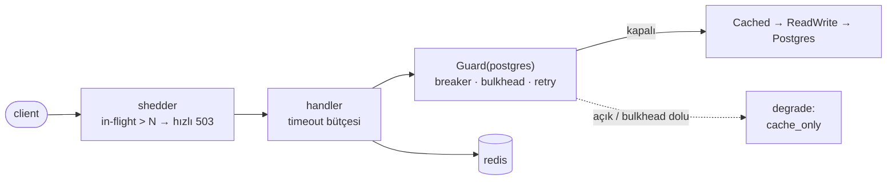

# 10 — resilience · "Hata izolasyonu"

## 1. Bu seviye ne?

Tek soru: bir bağımlılık **kısmen** bozulduğunda sistem tamamen bozulmak yerine nasıl **kısmen
çalışır** kalır? Beş mekanizma ekleniyor ve hiçbiri diğerinin yerine geçmiyor: timeout bütçesi,
bütçeli retry, devre kesici, bulkhead ve yük atma. Her biri `internal/resilience` içinde, hepsi
tek bir `Guard` ile birleşiyor ve `store.Guarded` dekoratörüyle veri yoluna uygulanıyor.

## 2. Mimari



Her mekanizmanın işi farklı:

| Mekanizma | Sorusu | Neyi korur |
|---|---|---|
| timeout | ne kadar beklerim? | tek isteği |
| retry (+ bütçe, + jitter) | tekrar dener miyim? | geçici kayıptan kurtarır |
| breaker | sormaya devam eder miyim? | bağımlılığı **ve** beklemekten seni |
| bulkhead | aynı anda kaç kişi sorar? | diğer bağımlılıkların kapasitesini |
| shedding | kabul eder miyim? | kabul ettiklerinin gecikmesini |

## 3. Önceki seviyeden çözülenler

| ID | Sorun | Nasıl çözüldü |
|---|---|---|
| P04-01 | Redis düşünce tüm yük DB'ye iner | Bulkhead + devre kesici: DB'ye giden eşzamanlılık sınırlı, bağımlılık bozulunca hızlı reddediliyor. Kesinti **taşınmıyor**, sınırlanıyor |

Ayrıca P02-06 (yavaş sorgu → havuz tıkanması) ve P09-02 (failover penceresi) büyük ölçüde
emiliyor: timeout + retry + breaker üçlüsü, geçici arızaları kullanıcıya yansıtmadan yutuyor.

## 4. Ayağa kaldırma

Platform bir kere kurulur (`cd platform && make minimal && make keda && make cnpg && make chaos`).

```bash
make up            # build → push → deploy → rollout wait → smoke
curl -s -XPOST http://lvl10.localtest.me/api/links -H 'Content-Type: application/json' -d '{"url":"https://example.com"}'
curl -I http://lvl10.localtest.me/<code>
make grafana       # Ladder klasörü, level=lvl10
make chaos C=pg-loss-30   # bu seviyenin ana aracı
make load S=mixed
make unchaos
make down
```

## 5. API

Her seviyede aynı: [docs/API.md](../docs/API.md).

Yeni davranış: aşırı yükte `503 {"error":"overloaded"}` + `Retry-After`. Bu bir arıza değil bir
**karardır** — sunucu, kabul ettiği isteklere hızlı cevap verebilmek için fazlasını erken reddediyor.

## 6. Reproduce edilebilir sorunlar

| ID | Sorun | Reproduce | Grafana'da | Çözüm |
|---|---|---|---|---|
| P10-01 | **TRAP** bütçesiz retry = yükseltec | `make repro P=P10-01` | Resilience → retry/s | seviye içi |
| P10-02 | **TRAP** readiness bağımlılığa bakar | `CONFIRM=1 make repro P=P10-02` | Pods → hazır endpoint | seviye içi |
| P10-03 | Timeout hizasızlığı: boşa çalışan sunucu | `make repro P=P10-03` | Resilience → in-flight | seviye içi |
| P10-04 | **TRAP** devre kesici yok / flapping | `make repro P=P10-04` | Resilience → breaker state | seviye içi |
| P10-05 | **TRAP** yavaş bağımlılık, ölüden beter | `make repro P=P10-05` | Pods → goroutine, bellek | seviye içi |
| P10-06 | Yük atma: kabul edileni hızlı tut | `make repro P=P10-06` | Resilience → shed, p99 | seviye içi |

---

### P10-01 · TRAP · Bütçesiz retry bir yükseltectir

**Belirti:** %30 hata oranında, bütçesiz "3 deneme" bağımlılık çağrılarını katlar — tam da
bağımlılık zaten hata verirken.
**Neden:** Retry bir **kurtarma** aracıdır, bir kapasite aracı değil. Bütçe olmadan, arızanın
hızlandırıcısına dönüşür. [Topic · Konu: Retry amplification, backoff, jitter]

**Reproduce:** `make repro P=P10-01` — `pg-loss-30` altında bütçeli ve bütçesiz modu karşılaştırır.

**Grafana:** `11 · Resilience` → "retry/s by dep", "dependency errors/s".
**Üçü birlikte olmalı:** üstel geri çekilme + **jitter** + **bütçe**. Jitter'sız retry'lar
senkronize olur (P03-07'deki TTL hizalanmasıyla aynı fizik); bütçesiz retry ikinci bir yük
kaynağıdır.
**Bu kodun kendi hatası:** ilk yazımda `retCount` hiç artmıyordu — bütçe her zaman "boş" görünüyor
ve sınırsız retry yapılıyordu. **Birim test yakaladı** (`TestRetryBudgetCapsAmplification`).
*Bir korumanın var olması ile çalışıyor olması ayrı şeylerdir.*

---

### P10-02 · TRAP · Readiness'ın bağımlılığa bakması (ikinci kez)

**Belirti:** Redis 10 saniye kesildiğinde hazır endpoint sayısı **sıfıra** iner.
**Neden:** P02-10'un kardeşi, yeni bağımlılıkla. Fail-open sayesinde hizmet **çalışır** (DB'ye
düşülür) ama readiness Redis'e bakıyorsa tüm pod'lar aynı anda düşer.
[Topic · Konu: Probe semantiği, kaskad]

**Reproduce:** `CONFIRM=1 make repro P=P10-02` — Redis'i durdurup iki modda en düşük hazır
endpoint sayısını ölçer.

**Grafana:** `01 · Pods` → "hazır endpoint sayısı"; `11 · Resilience` → "degrade modu".
**En sinsi tarafı:** bağımlılık **döndüğünde** tüm pod'lar aynı anda geri gelir ve onu ikinci kez
devirir — kurtarma da senkronize olur.
*Readiness "ben trafik alabilir miyim?" sorusudur. "Bağımlılığım iyi mi?" sorusunun cevabı bir
metriktir ve tepkisi degrade mod ya da devre kesicidir.*

---

### P10-03 · Timeout hizasızlığı

**Belirti:** Client 1 sn sonra vazgeçer; sunucu 30 sn daha çalışır ve cevabı kimseye teslim edemez.
**Neden:** Timeout bütçesi bir **zincirdir**: her katman, kendisini çağıranın kalan süresinden az
beklemeli. `handler > bağımlılık ≥ sorgu`. [Topic · Konu: Timeout bütçesi]

**Reproduce:** `make repro P=P10-03` — `pg-delay-2s` altında in-flight, goroutine, bağımlılık
timeout'u ve bulkhead reddini ölçer.

**Grafana:** `11 · Resilience` → "in-flight by pod", "dependency p99 by dep".
**Eksik kalan halka:** sunucu tarafı `statement_timeout` (P02-06). Client vazgeçse bile Postgres
sorguyu durdurmaz — *bunu yalnızca DB'nin kendisi yapabilir.*

---

### P10-04 · TRAP · Devre kesici: açılma, deneme, flapping

**Belirti:** Devre kesici kapalıyken (`TRAP_NO_BREAKER`) her istek bozuk bağımlılığa gider ve
p99 tavan yapar; açıkken istekler hızlıca reddedilir.
**Neden:** Devre kesicinin işi bağımlılığı **kurtarmak** değil, ona ve sana nefes aldırmaktır.
[Topic · Konu: Circuit breaker, yanlış pozitif]

**Reproduce:** `make repro P=P10-04` — `pg-loss-50` altında breaker açık/kapalı çağrı sayısını ve
p99'u karşılaştırır, tepe breaker durumunu raporlar.

**Grafana:** `11 · Resilience` → "breaker state by dep" (testere dişi = flapping).
**Ayar riski:** çok hassas → sağlıklı bağımlılığı bozuk ilan eder; çok tembel → arızayı fark etmez.
**Kritik ayrıntı (kodda):** `ErrNotFound` devre kesiciyi **tetiklemez**. 404 bir arıza değildir;
bunu ayırt etmemek, çok sayıda 404'ün sağlıklı bir bağımlılığı "bozuk" ilan etmesine yol açar —
en sık yapılan devre kesici hatası.
*Yavaş hata, hızlı hatadan kötüdür.*

---

### P10-05 · TRAP · Yavaş bağımlılık, ölüden beterdir

**Belirti:** Redis 3 sn gecikirse (ölmedi, yavaşladı) timeout'suz modda goroutine ve bellek şişer.
**Neden:** Ölü bağımlılık hızlı hata verir; yavaş olan her isteği bekletir. **Timeout'suz bir
çağrı, sınırsız bir kuyruktur** (P05-02'nin bağımlılık hâli).
[Topic · Konu: Kaynak sızıntısı, timeout]

**Reproduce:** `make repro P=P10-05` — `redis-delay-3s` altında timeout'lu/timeout'suz goroutine
ve bellek tepesini karşılaştırır.

**Grafana:** `01 · Pods` → "Goroutine", "Bellek working set".
**Kural:** Bir bağımlılığa yapılan **her** çağrının süre sınırı olmalı. *"Genelde hızlıdır" bir
gerekçe değildir; sorun tam da "genelde" olmadığı anda başlar.*

---

### P10-06 · Yük atma: kabul ettiğini hızlı tut

**Belirti/Beklenti:** Shedding açıkken **kabul edilen** isteklerin p99'u korunur; kapalıyken herkes
yavaşlar.
**Neden:** Aşırı yüklü bir sunucu her şeyi kabul edip her şeyi yavaş servis ederse, herkes zaman
aşımına uğrar ve kimse cevap alamaz. [Topic · Konu: Load shedding, admission control]

**Reproduce:** `make repro P=P10-06` — `stairs` yükü altında shedding açık/kapalı, **503 hariç**
p99'u karşılaştırır.

**Grafana:** `11 · Resilience` → "load shed/s", "kabul edilen isteklerin p99".
**Doğru metrik:** Toplam p99'a bakarsan shedding kötü görünür (çok 503); **kabul edilenlere**
bakarsan iyi görünür. *Hangi soruyu sorduğun, hangi cevabı alacağını belirler.*
**Sınırı:** Yük atma bir **kalite** aracıdır, kapasite aracı değil — kapasite için ölçekleme (07).
Sağlık uçları asla atılmaz (kodda ayrık): yük altında probe düşerse pod öldürülür (P01-07).

## 7. Seviye içi alıştırmalar (TRAP_ bayrakları)

| Bayrak | Ne yapar | Reproduce | Düzeltme |
|---|---|---|---|
| `TRAP_NAIVE_RETRY` | 3 deneme, bütçe ve jitter yok | `make repro P=P10-01` | Bayrağı kapat |
| `TRAP_READY_CHECKS_REDIS` | readiness Redis'e ping atar | `CONFIRM=1 make repro P=P10-02` | Bayrağı kapat |
| `TRAP_NO_BREAKER` | Devre kesiciyi etkisizleştirir | `make repro P=P10-04` | Bayrağı kapat |
| `TRAP_NO_DEP_TIMEOUT` | Bağımlılık timeout'unu kaldırır | `make repro P=P10-05` | Bayrağı kapat |

Elle denemeye değer:
- `BREAKER_OPEN=1s` + `BREAKER_THRESHOLD=2` yap ve `pg-loss-30` uygula: **flapping** üret.
  Grafana'da "breaker state" testere dişi olur. Sonra `BREAKER_OPEN=30s` ile karşılaştır —
  *eşik ayarı bir tahmin değil, bir ölçüm işidir.*
- `DEP_MAX_CONCURRENT=2` yap: bulkhead çok dar olunca sağlıklı bağımlılıkta bile reddetmeye başlar.
  **Korumanın kendisi bir arıza kaynağı olabilir.**
- `make chaos C=redis-kill` + `make load S=mixed`: degrade modun (`degraded_mode{mode="cache_only"}`)
  açılıp kapandığını izle.
- İki chaos'u birlikte uygula (`pg-delay-2s` + `redis-delay-200ms`): korumalar **birlikte**
  çalıştığında toplam etkinin parçaların toplamından farklı olduğunu gör.

## 8. Gözlemlenebilirlik: hangi paneller dolu, hangileri boş

| Dashboard | Durum | Neden |
|---|---|---|
| `11 · Resilience` | **Dolu** ✨ | breaker state, dependency latency/errors, retry, shed, in-flight, degrade modu |
| `05 · Postgres` · `06 · Redis` · `01 · Pods` | Dolu | Chaos deneylerinin etkisi burada okunur |
| `12 · SLO` · `13 · Rollout` | Boş | 11 ve 12'de |

Bu seviyenin panel okuma kuralı: **breaker state ile dependency latency'yi birlikte oku.**
Breaker açık ve latency düşük → koruma çalışıyor. Breaker kapalı ve latency yüksek → eşik çok tembel.
Breaker testere dişi → eşik çok hassas. Tek başına hiçbiri bir şey söylemez.

## 9. Bilerek bırakılanlar

- **Yalnızca Postgres korumalı**: Redis ve Kafka için `Guard` kurulmadı (fail-open zaten var).
  Gerçek bir sistemde her bağımlılık kendi guard'ını alır — burada bir tanesi ders için yeterli.
- **Degrade modu sınırlı**: `cache_only` işaretleniyor ama okuma yine de önbellekten geliyorsa
  çalışıyor; DB'siz **yazma** yolu için bir degrade yok (create 503 döner).
- **Adaptif shedding yok**: sabit in-flight eşiği. Gerçekte gecikmeye göre uyarlanır (CoDel, PID).
- **`statement_timeout` hâlâ boş** (P02-06): client tarafı timeout var, sunucu tarafı yok.
- **Chaos deneyleri elle**: otomatik chaos (sürekli, zamanlanmış) yok — game day 14'te.
- **09'dan devreden**: nesne deposu/PITR yok, tek Redis, kimlik yok.

## 10. `make diff-prev` okuma rehberi

`make diff-prev` 09 ile farkı gösterir:

1. **`internal/resilience/breaker.go`** (yeni): tek bir `Guard` beş mekanizmayı birleştiriyor.
   Yorumlarda her birinin **ayrı sorusu** yazıyor — birbirinin yerine geçmedikleri buradan okunur.
2. **`internal/resilience/shed.go`**: sağlık uçlarının atlanması 5 satır. *Bir korumanın hangi
   isteği kapsamadığını yazmak, kapsadığını yazmak kadar önemlidir.*
3. **`internal/store/guarded.go`**: aynı `Store` arayüzünün **dördüncü** sarmalaması
   (Postgres → Cached → ReadWrite → Guarded). Her katman diğerini bilmiyor — bu yüzden herhangi
   birini kapatıp ne satın aldığını ölçebiliyoruz.
4. **`Guarded.Get` içindeki `ErrNotFound` ayrımı**: üç satır, ama olmadan devre kesici 404'lerle
   açılırdı.
5. **`Guarded.Ping` devre kesiciden geçmiyor**: sağlık kontrolleri ham gerçeği görmeli.
6. **`deploy/*-svc.yaml`**: sekiz yeni env değişkeni. Her biri bir **karar**, her karar bir takas —
   ve hepsi `make repro` ile ölçülebilir.
