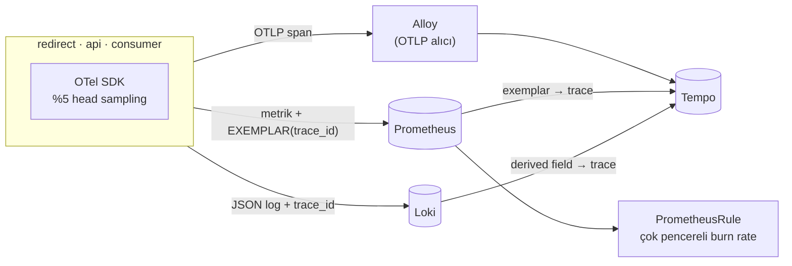

# 11 — observability-deep · "Neden yavaş?"

> **Bu seviyede ne yaşayacaksın?**
> - "p99 yüksek — ama nerede?" sorusunu cevaplamak: gecikme panelinde bir noktaya (exemplar) tıklayıp o isteğin trace'ine gitmek (P11-01)
> - Tuzak: trace'in Kafka sınırında kopması (P11-02); sampling'in maliyet ile kapsama arasındaki takası (P11-03)
> - Eşik alarmı ile hata bütçesine dayalı burn-rate alarmının farkı (P11-04); gözlemlenebilirlik yığınının kendi kapasitesi (P11-05)
> - Tuzak: kardinalite (P11-06); dashboard drift'i (P11-07); tuzak: profil olmadan görünmeyen sıcak nokta — pprof ile hangi satır (P11-08)
>
> **Bu seviye olmasa ne olur?** Metrik "yavaş" der ama "nerede"yi söylemez; optimizasyon tahminle yapılır, alarmlar ya gürültü ya sessizlik olur.
>
> **Yeni gelen teknolojiler:** OpenTelemetry, Tempo, Alloy (OTLP), Loki, exemplar, SLO kayıt kuralları + Alertmanager, pprof, `12 · SLO` paneli ([her biri tek cümleyle](../README.md#kullanılan-teknolojiler)).

## 1. Bu seviye ne?

10 seviye boyunca metrik topladık ve her seferinde aynı duvara çarptık: *"p99 yüksek — ama nerede?"*
Bu seviye o soruyu cevaplanabilir kılıyor. Dört ayak bir araya geliyor: **metrik** (ne kadar),
**trace** (nerede), **log** (neden) ve **profil** (hangi satır) — ve hepsini birbirine bağlayan
tek bir kimlik: `trace_id`. Ayrıca alarmlar eşiklerden **hata bütçesine** taşınıyor.

## 2. Mimari



Kritik nokta: **korelasyon araçların bir özelliği değil, koddaki bir disiplindir.** Exemplar'ı
histograma iliştiren, `trace_id`'yi log satırına koyan ve bağlamı Kafka header'ına yazan kod.

Bir redirect'in trace'i (örneklenmişse):

```
GET /{code}                  ← sunucu span'i: middleware açar, log + exemplar bunu okur
├─ cache.get                 ← cache.result = hit / miss / negative_hit / redis_error
│  ├─ guard.redis            ← Redis çağrısı (kendi devre kesicisi, dep="redis")
│  └─ guard.postgres         ← yalnızca ıskada · retry'lar ayrı db.* çocukları olarak görünür
│     └─ db.get              ← "pool.acquire" olayı: havuzda ne kadar beklendi
└─ kafka.produce             ← broker onaylayınca biter (istekten SONRA) · bağlam header'a yazılır
   └─ consume-batch          ← linkly-analytics: kuyruğun öbür yakası
      └─ db.write_clicks_idem
```

Tek bir kimlik hepsini birbirine bağlar — ama yalnızca **örneklenen** (%5) isteklerde: log satırındaki
`trace_id` ve exemplar, Tempo'da gerçekten bulunan bir trace'e işaret etmeyecekse hiç yazılmaz.

## 3. Önceki seviyeden çözülenler

| ID | Sorun | Nasıl çözüldü |
|---|---|---|
| — | 10'un sorunlarından hiçbiri **çözülmüyor** | 11'in 10'a göre farkı `internal/tracing` ve span'ler: timeout bütçesine, bulkhead'e ya da retry'a dokunmuyor. P10-03 burada da reproduce olur (bkz. `problems/SOLVES`) |

Bu seviyenin kazancı bir sorunu kapatmak değil: **önceki on seviyedeki her sorunun teşhis süresini
kısaltmak.** P10-03'ün "nerede beklendi?" sorusu artık tek bir trace'te okunur (`guard.postgres`
içindeki `db.*` denemeleri ve `pool.acquire` olayı); P02-06, P04-03, P07-03, P10-05 de öyle.

## 4. Ayağa kaldırma

İlk kez mi? Önce kök README'deki [Sıfırdan başlangıç](../README.md#sıfırdan-başlangıç) — platform bir kez kurulur (`cd platform && make full`).
Bu seviyenin platformdan istediği: **temel yığın (kind, ingress, Prometheus, Grafana) + Chaos Mesh, KEDA, CloudNativePG, Tempo + Loki (yalnızca bu seviyede açılır)**. `make up` ilk adımda (profil) bunları açar ve kullanılmayanları kapatır; bir bileşen kurulu değilse hangi komutla kurulacağını söyleyip durur.

```bash
make up            # profil → build → push → deploy → rollout wait → smoke
code=$(curl -s -XPOST http://lvl11.localtest.me/api/links -H 'Content-Type: application/json' -d '{"url":"https://example.com"}' | jq -r .code); echo "$code"
curl -s -o /dev/null -w '%{http_code} → %{redirect_url}\n' http://lvl11.localtest.me/$code   # 302 → https://example.com
make grafana       # Ladder klasörü, level=lvl11 — giriş: admin / ladder
make load S=mixed  # aynı senaryolar her seviyede: create redirect mixed hot-key burst abuser read-your-writes stairs scan
make repro P=P11-01   # §6'daki bir sorunu otomatik üret → REPRODUCED / NOT-REPRODUCED
make env           # açık ayar/tuzaklar · değiştir: make set E="KEY=değer" · hepsini geri al: make reset (§7)
make down          # seviyeyi kaldır · kümeyi durdurmak için: make -C ../platform stop
```

Trace'e bakmak için: Grafana → Explore → Tempo (ya da `kubectl -n monitoring port-forward svc/tempo 3200:3200`).

## 5. API

Her seviyede aynı: [docs/API.md](../docs/API.md). Dışarıdan değişiklik yok; yalnızca gelen
`traceparent` header'ı artık **onurlandırılıyor**: client bir trace başlattıysa sunucu span'i onun
çocuğu olur ve client'ın örnekleme kararı (`-01` = örneklendi) %5'in önüne geçer. Denemek için:
`curl -H 'traceparent: 00-4bf92f3577b34da6a3ce929d0e0e4736-00f067aa0ba902b7-01' http://lvl11.localtest.me/$code`
→ Tempo'da `4bf92f3577b34da6a3ce929d0e0e4736`.

## 6. Reproduce edilebilir sorunlar

| ID | Sorun | Reproduce | Grafana'da | Çözüm |
|---|---|---|---|---|
| P11-01 | "p99 yüksek — nerede?" | `make repro P=P11-01` | [02 · App RED](http://grafana.localtest.me/d/ladder-app-red?var-level=lvl11&from=now-15m&to=now&refresh=10s) · [11 · Resilience](http://grafana.localtest.me/d/ladder-resilience?var-level=lvl11&from=now-15m&to=now&refresh=10s) → "p99 süre (uç noktaya göre)" | seviye içi |
| P11-02 | **TRAP** trace kuyrukta kopuyor | `make repro P=P11-02` | [08 · Stream (Redpanda)](http://grafana.localtest.me/d/ladder-stream?var-level=lvl11&from=now-15m&to=now&refresh=10s) → "Tüketilen kayıtlar (sonuca göre)" | seviye içi |
| P11-03 | Sampling: maliyet ↔ kapsama | `make repro P=P11-03` | [15 · k6](http://grafana.localtest.me/d/ladder-k6?var-level=lvl11&from=now-15m&to=now&refresh=10s) → "Gönderilen istek / sn" | tail sampling (tartışma) |
| P11-04 | Eşik alarmı vs burn rate | `make repro P=P11-04` | [02 · App RED](http://grafana.localtest.me/d/ladder-app-red?var-level=lvl11&from=now-15m&to=now&refresh=10s) · [12 · SLO](http://grafana.localtest.me/d/ladder-slo?var-level=lvl11&from=now-15m&to=now&refresh=10s) → "5xx (uç noktaya göre)" | seviye içi |
| P11-05 | Debug log Loki'yi limitler | `make repro P=P11-05` | [15 · k6](http://grafana.localtest.me/d/ladder-k6?var-level=lvl11&from=now-15m&to=now&refresh=10s) → "Gönderilen istek / sn" | seviye içi |
| P11-06 | **TRAP** tenant label'ı → kardinalite | `make repro P=P11-06` | [03 · App Business](http://grafana.localtest.me/d/ladder-app-business?var-level=lvl11&from=now-15m&to=now&refresh=10s) → "İstek / kiracı" | seviye içi |
| P11-07 | Dashboard drift'i | `make repro P=P11-07` | [02 · App RED](http://grafana.localtest.me/d/ladder-app-red?var-level=lvl11&from=now-15m&to=now&refresh=10s) → "Saniyedeki istek" | seviye içi (kod) |
| P11-08 | **TRAP** profilsiz görünmeyen hot spot | `make repro P=P11-08` | [01 · Pods & Resources](http://grafana.localtest.me/d/ladder-pods?var-level=lvl11&from=now-15m&to=now&refresh=10s) · [02 · App RED](http://grafana.localtest.me/d/ladder-app-red?var-level=lvl11&from=now-15m&to=now&refresh=10s) → "CPU kullanımı (çekirdek)" | profil (14) |

---

### P11-01 · "p99 yüksek — nerede?"

**Belirti:** Gecikme yükseliyor; metrik bunu gösteriyor ama **hangi bağımlılık** olduğunu söylemiyor.
**Neden:** Metrikler toplamdır. Tek bir isteğin içinde neyin ne kadar sürdüğünü ancak trace bilir.
[Topic · Konu: Metrik/trace/log korelasyonu]

**Reproduce:** `make repro P=P11-01` — gizli bir gecikme enjekte eder (hangi bağımlılık olduğunu
söylemeden), önce metrikle tahmin ettirir, sonra exemplar'dan trace'e atlar.

**Grafana'da gör:** [`02 · App RED`](http://grafana.localtest.me/d/ladder-app-red?var-level=lvl11&from=now-15m&to=now&refresh=10s) ve [`11 · Resilience`](http://grafana.localtest.me/d/ladder-resilience?var-level=lvl11&from=now-15m&to=now&refresh=10s) — scripti başlatınca aç; önce 30 sn temiz taban, sonra gizli gecikmeyle 40 sn (giriş: admin / ladder)
- "p99 süre (uç noktaya göre)" → `/{code}` çizgisi tabanda alçak; gizli gecikme başlayınca **~200 ms'nin üstüne sıçrar**. Metrik "yavaşladı" der — hepsi bu.
- "Bağımlılık gecikmesi p99" (Resilience) → `redis` çizgisi ~200 ms'ye çıkar, `postgres` alçak kalır: bağımlılık metriği **kapıyı** gösteriyor — çünkü her bağımlılık kendi guard'ıyla ayrı ölçülüyor (10'dan beri). Ama yalnızca önceden ölçmeyi düşündüğün kapıları gösterir ve tek bir isteğin hangi adımda beklediğini söylemez.
- "p99 süre (uç noktaya göre)" üzerindeki **noktalar** (exemplar) → her biri örneklenmiş (%5) gerçek bir isteğin `trace_id`'si. Gecikme platosundaki bir noktanın üzerine gel, **Trace'i aç (Tempo)** linkine tıkla: o isteğin trace'i açılır. Aynı noktalar "Gecikme (p50 / p95 / p99)" panelinde de var. Nokta görünmüyorsa o aralıkta örneklenmiş istek yoktur — gecikme sürerken birkaç saniye bekle.
- Explore'da: `{ resource.service.name = "linkly-redirect" && duration > 100ms }` ya da exemplar'daki `trace_id` → veri kaynağı **Tempo**: yavaş `GET /{code}` trace'leri. Birini aç: sürenin neredeyse tamamı `cache.get` → `guard.redis` span'inde; `kafka.produce` istekten sonra biter (asenkron). Script aynı trace'i Tempo'dan çekip span'leri süreye göre basar.
- Explore'da: `{namespace="lvl11", app="redirect"} | json | trace_id != ""` → veri kaynağı **Loki**: yalnızca örneklenmiş isteklerin erişim satırları `trace_id` taşır; satırdaki `trace_id` alanının yanındaki link (derived field) aynı trace'i Tempo'da açar.

**Zincir:** metrik **ölçer** → exemplar **işaret eder** → trace **açıklar** → log **kanıtlar**.
Her adım bir öncekinin bıraktığı soruyu cevaplıyor.

---

### P11-02 · TRAP · Trace asenkron sınırda kopuyor

**Belirti:** Redirect trace'i producer'da bitiyor; tüketici span'leri ayrı, **yetim** trace'ler
olarak görünüyor.
**Neden:** HTTP'de bağlam otomatik taşınır (`traceparent`). Kuyrukta taşınmaz — **sen koymazsan**.
[Topic · Konu: Bağlam yayılımı]

**Reproduce:** `make repro P=P11-02` — propagation açık/kapalı iki faz; her fazın zaman penceresinde
Tempo'da `consume-batch` span'i taşıyan trace'lerin **kökünü** sayar: kök `linkly-redirect` ise
tüketici redirect'in trace'ine bağlı, kök `linkly-analytics` ise yetim. Hüküm iki modu karşılaştırır
(açıkken bağlı > yetim, tuzakla yetim > bağlı). Tuzak yalnızca header'a yazmayı kapatır; span'ler,
metrikler ve tıklamaların kendisi aynı kalır.

**Grafana'da gör:** [`08 · Stream (Redpanda)`](http://grafana.localtest.me/d/ladder-stream?var-level=lvl11&from=now-15m&to=now&refresh=10s) — scripti başlatınca aç; iki faz 30'ar sn, her fazdan sonra 20 sn beklenir (giriş: admin / ladder)
- "Tüketilen kayıtlar (sonuca göre)" → iki fazda da `ok` akar: tıklamalar işleniyor. Kopan şey veri değil, **bağlam**.
- Explore'da: `{ resource.service.name = "linkly-analytics" && name = "consume-batch" }` → veri kaynağı **Tempo**, zaman aralığı bir fazı kapsasın. Sonuç listesinde her trace'in **kök** servisine ve adına bak: birinci fazda kök `linkly-redirect` / `GET /{code}` — birini aç, `GET /{code}` → `kafka.produce` → `consume-batch` → `db.write_clicks_idem` kuyruğun iki yakasını **tek ağaçta** gösterir. İkinci fazda kök `linkly-analytics` / `consume-batch`: kendi başına, **yetim** bir trace.
- Bir parti çok sayıda tıklama taşır, bir span'in tek ebeveyni olur: `consume-batch`, üreticisi örneklenmiş **ilk** kayda bağlanır (`stream.batchParent`). Partinin diğer isteklerine bağ yok — tam cevap span link'leridir; burada bilerek eklenmedi.

**Ders:** *Bağlam yayılımı bir kütüphane ayarı değil, bir sözleşmedir.* HTTP'de header, Kafka'da
message header, cron'da ise hiçbir yerde — asenkron sınırları kendin bağlarsın. Ve tam da asenkron
yaptığın için görünmez olan yer, en çok trace gereken yerdir.

---

### P11-03 · Sampling: maliyet ile kapsama arasındaki takas

**Belirti:** %100 sampling collector'ın CPU ve belleğini katlar; %5 ise nadir hataları kaçırır.
**Neden:** Head sampling kararı trace'in **başında** verilir — yavaş mı, hatalı mı bilinmeden.
[Topic · Konu: Sampling stratejileri]

**Reproduce:** `make repro P=P11-03` — %5 ve %100 ile Alloy'un CPU/bellek tepesini karşılaştırır.

**Grafana'da gör:** [`15 · k6`](http://grafana.localtest.me/d/ladder-k6?var-level=lvl11&from=now-15m&to=now&refresh=10s) — scripti başlatınca aç; iki faz 40'ar sn, arada redirect rollout'u (giriş: admin / ladder)
- "Gönderilen istek / sn" → iki eşit yük fazı (30 VU): karşılaştırma aynı trafik altında yapılıyor.
- Explore'da: `sum(rate(otelcol_receiver_accepted_spans_total{namespace="monitoring"}[1m]))` → Alloy'un kabul ettiği span/s. %100 fazında **katlanır** (%5 → %100: redirect span'lerinde teorik üst sınır 20×). Sampling'in kontrol ettiği asıl değişken bu.
- Explore'da: `sum(rate(container_cpu_usage_seconds_total{namespace="monitoring",pod=~"alloy.*",image!="",image!~".*pause.*"}[1m]))` → Alloy'un CPU'su. Artış span artışından küçük ve gürültülü olabilir: Alloy aynı anda log da taşıyor. Belleği: `sum(container_memory_working_set_bytes{namespace="monitoring",pod=~"alloy.*",image!="",image!~".*pause.*"})`.
- `01 · Pods & Resources` Alloy'u gösteremez: `level` seçicisi yalnızca `lvl*` namespace'lerini listeliyor, Alloy ise `monitoring`'de.

**Ders:** Teşhis için gereken "tüm trace'ler" değil, **doğru trace**. Exemplar zaten yavaş bir
isteği işaret ettiği için %5 yeterlidir. Head sampling'in gerçek zayıflığı nadir **hatalardır**;
çözümü tail sampling'dir ve bedeli collector'da her span'i tamponlamaktır.

---

### P11-04 · Eşik alarmı vs burn-rate alarmı

**Belirti:** 30 saniyelik bir sıçrama: eşik alarmı çalar (ve seni uyandırır), burn-rate susar.
Günlerce süren %0.2'lik kanama: eşik susar, burn-rate ticket açar.
**Neden:** SLO bir hedef değil, harcamana izin verilen bir **bütçedir**. Alarm, bütçenin **tükenme
hızına** bakmalı. [Topic · Konu: SLO, error budget, burn rate]

**Reproduce:** `make repro P=P11-04` — kısa bir hata sıçraması üretip hangi alarmların ateşlediğini
karşılaştırır (`deploy/slo.yaml` içinde bilerek bir de **naive eşik alarmı** var).

**Grafana'da gör:** [`02 · App RED`](http://grafana.localtest.me/d/ladder-app-red?var-level=lvl11&from=now-15m&to=now&refresh=10s) ve [`12 · SLO`](http://grafana.localtest.me/d/ladder-slo?var-level=lvl11&from=now-15m&to=now&refresh=10s) — scripti başlatınca aç; sıçrama ~90 sn, ardından alarmlar için 75 sn beklenir (giriş: admin / ladder)
- "5xx (uç noktaya göre)" (App RED) → `/{code}` için ~90 sn'lik bir 5xx tepesi: alarmların tepki verdiği olay bu. (Postgres guard'ı önbelleğin altında: isabetler cevaplanmaya devam eder, hata yalnızca ıskalardan gelir.)
- "Hata oranı (son 5 dk)" (SLO) → sıçramayla hızla yükselir, pencere kayınca birkaç dakikada söner. Naive alarmın baktığı tek sayı bu (eşik `0.01`).
- "Bütçe yanma hızı (1 sa / 6 sa)" (SLO) → 1 sa çizgisi sıçrar, 6 sa çizgisi küçük bir basamak yapar. Hızlı alarm 1 sa **ve** 5 dk yanma hızının birlikte 14.4'ü aşmasını ve bunun `for: 2m` sürmesini ister.
- "Kalan hata bütçesi" (SLO) → sıçramayla aşağı iner. Prometheus burada yalnızca **6 saat** sakladığı için kuraldaki `[30d]` fiilen son 6 saatin trafiğidir: az trafikli bir laboratuvarda tek bir sıçrama bütçeyi büyük ölçüde yiyebilir, sıfırın altına bile indirebilir. Üretimde aynı sıçrama 30 günlük bütçenin kırıntısıdır.
- "Çalan alarmlar" (SLO) → naive eşik alarmı (`LinklyNaiveErrorRateThreshold`, `for:` yok) sıçrama sırasında **hemen** belirir; burn-rate alarmları `for:` süreleri (2 dk / 15 dk / 1 sa) dolmadan firing olmaz — kısa bir sıçramada genellikle hiç görünmezler.
- Explore'da: `ALERTS{namespace="lvl11",alertname=~"Linkly.*"}` → `pending` durumunu da gösterir (panel yalnızca firing'i): hangi burn-rate alarmının `for:` süresini beklediğini buradan görürsün.

**Neden iki pencere?** Uzun pencere *"yeterince büyük mü?"*, kısa pencere *"hâlâ oluyor mu?"* diye
sorar. Kısa olmadan alarm düzeldikten sonra da çalar; uzun olmadan her blip'te çalar.
*Alarm yorgunluğu bir insan sorunu değil, bir matematik seçimi sorunudur.*
Kurallar **elle yazıldı** (Sloth kullanılmadı) — çünkü aritmetiğin kendisi dersin ta kendisi.

---

### P11-05 · Gözlemlenebilirliğin de bir kapasitesi vardır

**Belirti:** "Sorun var, log seviyesini debug yapalım" → Loki limitine takılır → **araştırdığın
loglar kaybolur.**
**Neden:** Log boru hattı sonsuz değil (`ingestion_rate_mb: 8`).
[Topic · Konu: Gözlemlenebilirlik kapasitesi]

**Reproduce:** `make repro P=P11-05` — info ve debug seviyelerinde log hacmini ve Loki reddini ölçer.

**Grafana'da gör:** [`15 · k6`](http://grafana.localtest.me/d/ladder-k6?var-level=lvl11&from=now-15m&to=now&refresh=10s) — scripti başlatınca aç; iki faz 40'ar sn, arada redirect rollout'u (giriş: admin / ladder)
- "Gönderilen istek / sn" → iki eşit yük fazı (30 VU): log hacmindeki fark trafikten değil, log seviyesinden.
- Explore'da: `sum(bytes_over_time({namespace="lvl11", app="redirect"}[1m]))` → veri kaynağı **Loki**: dakikalık log baytı debug fazında belirgin yükselir — her redirect'e bir satır daha ekleniyor.
- Explore'da: `{namespace="lvl11", app="redirect"} |= "redirect isteği"` → veri kaynağı **Loki**: bu debug satırları yalnızca ikinci fazda döner.
- Explore'da: `sum(rate(loki_distributor_bytes_received_total[1m]))` → veri kaynağı **Prometheus**: Loki'ye giren bayt/s aynı biçimde artar (script'in karşılaştırdığı sayı). `sum(rate(loki_discarded_samples_total[1m])) by (reason)` sıfırdan ayrılırsa limit (`ingestion_rate_mb: 8`) aşılmış ve satırlar **düşmüştür**; bu yük limite yetmediyse 0 kalır — hacim artışı yine de faturadır.

**Ders:** *Teşhis araçların, teşhis ettiğin olay sırasında çalışmaya devam etmeli.*
Araçlar: çalışırken seviye değiştirebilmek · log **sampling** · yüksek hacimli detayı log'dan
**trace'e** taşımak (tek istek detayı log'un değil trace'in işidir).

---

### P11-06 · TRAP · Kardinalite, üçüncü kez

**Belirti:** `tenant` label'ı açılınca seri sayısı tenant sayısıyla birlikte büyür.
**Neden:** P01-06'nın (kısa kod label'ı) daha makul görünen kılığı. *Kardinalite, bir label'ın
değer sayısı kadar büyür ve bu sayı genelde **iş büyüdükçe** artar.* [Topic · Konu: Kardinalite]

**Reproduce:** `make repro P=P11-06` — 500 farklı tenant'tan istek gönderip seri artışını ölçer.

**Grafana'da gör:** [`03 · App Business`](http://grafana.localtest.me/d/ladder-app-business?var-level=lvl11&from=now-15m&to=now&refresh=10s) — script çalışırken ya da hemen sonra aç; 500 istek tek tek gönderilir (giriş: admin / ladder)
- "İstek / kiracı" → tuzak kapalıyken tek (etiketsiz) seri; tuzak açılınca **yüzlerce ayrı çizgi** (`tenant-1` … `tenant-500`) ve lejant taşar: her tenant kendi zaman serisi. Script sonunda tuzağı kapatınca çizgiler kesilir — ama seriler Prometheus'un belleğinde bir süre daha durur.
- Explore'da: `count(count by (tenant) (http_requests_total{namespace="lvl11"}))` → tuzakla ~500'e sıçrar (script'in `N` değeri) — hüküm bu sayıya bakar.
- Explore'da: `prometheus_tsdb_head_series` → aynı anda yukarı basamak: faturayı Prometheus ödüyor.

**"Tenant'a göre görmek istiyorum" meşru bir istektir; cevabı metrik değildir:**
en çok trafik üreten 10 tenant → log/analitik sorgusu · tek bir yavaş istek → **exemplar + trace**
(kardinalite ödemeden) · faturalama → veritabanı.

---

### P11-07 · Dashboard drift'i

**Belirti:** Grafana'da elle yapılan bir düzeltme hiçbir yerde kayıtlı değildir ve bir sonraki
`make dashboards` onu siler.
**Neden:** Dashboard'lar kod değilse, gözlemlenebilirliğin sürüm kontrolü yok demektir.
[Topic · Konu: Dashboards as code]

**Reproduce:** `make repro P=P11-07` — API üzerinden değiştirmeyi dener, sonra kaynaktan yeniden
uygulayıp drift'in kaybolduğunu gösterir.

**Grafana'da gör:** [`02 · App RED`](http://grafana.localtest.me/d/ladder-app-red?var-level=lvl11&from=now-15m&to=now&refresh=10s) — script bittikten sonra aç; deneyin hedefi bu dashboard'un kendisi (giriş: admin / ladder)
- "Saniyedeki istek" → panel ve dashboard'un geri kalanı **yerinde**, başlık hâlâ "Ladder / 02 · App RED". Script API'den başlığı "(ELLE DEĞİŞTİRİLDİ)" olan panelsiz bir sürüm göndermeyi dener; Grafana dosyadan yüklenen (provisioned) bu dashboard'u kaydetmez ya da `make dashboards` onu kaynaktan geri yazar — drift kalıcı olamaz.
- Bir paneli elle düzenleyip kaydetmeyi dene: dashboard'lar `editable: false`; Grafana kaydı reddeder. Değişikliğin tek yolu `platform/dashboards/gen.py` → `make dashboards`.

**Bedeli:** bir paneli düzeltmek 30 saniye yerine 3 dakika. **Kazancı:** gözden geçirilebilir,
geri alınabilir ve yeniden üretilebilir gözlemlenebilirlik. Aynı fikir 12'de uygulamaya uygulanıyor.

---

### P11-08 · TRAP · Profilsiz görünmeyen hot spot

**Belirti:** İstek başına CPU artıyor, p99 hafif yükseliyor — ve hiçbir metrik *"regex derleniyor"*
demiyor.
**Neden:** Metrikler **ne kadar**, trace **nerede**, log **neden** der. *"Hangi satır"* sorusunun
cevabı profildir. [Topic · Konu: Sürekli profil]

**Reproduce:** `make repro P=P11-08` — `TRAP_REGEX_PER_REQUEST` açık/kapalı **istek başına CPU**'yu
karşılaştırır, sonra tuzak açıkken redirect pod'unun **iç portundan (6060)** bir CPU profili alır.
Hüküm metrik farkına değil profile bakar: `regexp` kareleri profilde görünüyorsa REPRODUCED;
profil alınamazsa hüküm yok (çıkış 2). Uç, deploy edilen sürecin kendi iç dinleyicisindedir:
servislerin hiç kullanmadığı bir handler'a kaydedilmiş bir uçtan profil alınamaz ve deney her
koşuda "profil yok" der.

**Grafana'da gör:** [`01 · Pods & Resources`](http://grafana.localtest.me/d/ladder-pods?var-level=lvl11&from=now-15m&to=now&refresh=10s) ve [`02 · App RED`](http://grafana.localtest.me/d/ladder-app-red?var-level=lvl11&from=now-15m&to=now&refresh=10s) — scripti başlatınca aç; iki faz 40'ar sn, arada redirect rollout'u (giriş: admin / ladder)
- "CPU kullanımı (çekirdek)" → `redirect-…` pod'larında iki faz **neredeyse aynı**: istek başına regex derlemenin maliyeti konteyner CPU'sunun gürültüsünün altında. Görmemen, sorunun kendisi.
- "p99 süre (uç noktaya göre)" → `/{code}` en fazla hafifçe kıpırdar; sebebe dair hiçbir şey söylemez.
- Explore'da: `sum(rate(container_cpu_usage_seconds_total{namespace="lvl11",pod=~"redirect.*",image!="",image!~".*pause.*"}[2m])) / sum(rate(http_requests_total{namespace="lvl11",route="/{code}"}[2m]))` → istek başına CPU (saniye); iki faz arasındaki fark küçük — script'in "istek başına CPU" satırının aynısı.
- Sebebin kendisi — *hangi satır?* — hiçbir panelde yok: o yalnızca profilde görünür. Script tuzak açıkken redirect pod'undan 20 sn'lik bir CPU profili alır (iç port **6060**, `kubectl get --raw …/pods/<pod>:6060/proxy/debug/pprof/profile`) ve `regexp` karelerini terminale basar. Elle: `kubectl -n lvl11 port-forward deploy/redirect 6060:6060` → `go tool pprof -http=: http://localhost:6060/debug/pprof/profile?seconds=30`.

**Araçlar:** `net/http/pprof` (bu seviyede iç port 6060'ta — ingress'e açık servis portunda değil) + `go tool pprof`; üretimde sürekli profil (Pyroscope).
*"Dün gece CPU neden yükseldi?" sorusunun cevabı, o gece profil toplanmadıysa kaybolur.*
Bu merdivende Pyroscope kaynak nedeniyle opsiyonel — 14'te kapasite modeliyle birlikte.

## 7. Seviye içi alıştırmalar (TRAP_ bayrakları)

> **Nasıl uygulanır:** aç `make set E="TRAP_X=true"` · ne açık? `make env` · hepsini geri al `make reset` (ortamı `deploy/`'daki hâline döndürür; `make unset E=TRAP_X` yalnızca siler). Tablodaki diğer ayarlar da aynı yolla (`make set E="CACHE_TTL=1h"`). Pod'lar yeni değerle yeniden başlar; komut hazır olunca döner. Varsayılan olarak seviyenin TÜM uygulama servislerine uygulanır (tek servis: `W=redirect`); 12'den itibaren Argo Rollout'larda da çalışır — `kubectl set env` orada çalışmaz. `make repro` scriptleri tuzağı KENDİLERİ açıp kapatır ve bitince ortamı eski hâline getirir (senin açtıkların dahil): elle alıştırma için `make set` + `make load`, otomatik ölçüm için `make repro`. Bitirince `make reset`: açık kalan bir tuzak sonraki deneyi sessizce bozar.

| Bayrak | Ne yapar | Reproduce | Düzeltme |
|---|---|---|---|
| `TRAP_NO_KAFKA_PROPAGATION` | Bağlamı Kafka header'ına koymaz | `make repro P=P11-02` | Bayrağı kapat |
| `TRAP_TENANT_LABEL` | tenant'ı metrik label'ı yapar | `make repro P=P11-06` | Bayrağı kapat |
| `TRAP_REGEX_PER_REQUEST` | İstek başına regex derler | `make repro P=P11-08` | Bayrağı kapat |
| `TRACE_SAMPLE_PCT` / `LOG_LEVEL` | Tuzak değil, **ayar düğmesi** | P11-03 / P11-05 | Ölç, sonra karar ver |

Elle denemeye değer:
- Bir trace'i Grafana'da aç ve span'leri say: `GET /{code}` → `cache.get` → `guard.redis` /
  (ıskada) `guard.postgres` → `db.get` → `kafka.produce` → `consume-batch`. Toplam süre ile span
  sürelerinin toplamı arasındaki fark **beklemedir** (kuyruk, GC, zamanlayıcı); havuz beklemesi
  `db.*` span'indeki `pool.acquire` olayında ayrıca yazıyor.
- `TRACE_SAMPLE_PCT=100` + `make load S=stairs` ile Alloy'u zorla: gözlemlenebilirlik yığınının
  kendi SLO'su olmalı mı? (Cevap: evet, ve 14'teki game day'de test edilir.)
- `deploy/slo.yaml`'daki hedefi %99.9'dan %99.99'a çek (kurallardaki `0.001`'leri `0.0001` yap):
  hata bütçesi 43 dakikadan 4 dakikaya iner ve aynı hata oranı artık **page** üretir. *SLO'yu sıkılaştırmak bir hedef değişikliği değil, bir
  NÖBET YÜKÜ değişikliğidir.*
- Loki'de `{namespace="lvl11"} | json | trace_id != ""` sorgusuyla bir trace_id bul, Tempo'ya
  yapıştır: log → trace geçişini elle yap, sonra derived field'ın aynısını tek tıkla yaptığını gör.
  (`trace_id` yalnızca örneklenen isteklerde dolu; örneklenmeyenleri `request_id` birbirine bağlar.)
- `curl -H 'traceparent: 00-<32 hex>-<16 hex>-01' …` ile kendi trace'ini başlat: `-01` bayrağı
  %5'i atlar — ParentBased sampler çağıranın kararına uyar. Bedelini düşün: herkese açık bir uçta
  her client örneklemeyi zorlayabilir.

## 8. Gözlemlenebilirlik: hangi paneller dolu, hangileri boş

| Dashboard | Durum | Neden |
|---|---|---|
| [`12 · SLO`](http://grafana.localtest.me/d/ladder-slo?var-level=lvl11&from=now-15m&to=now) | **Dolu** ✨ | Hata oranı, bütçe yanma hızı, kalan bütçe, çalan alarmlar — kurallar `namespace` taşıyor. Kalan bütçe Prometheus'un 6 saatlik saklamasıyla sınırlı: "30 gün" fiilen son 6 saat |
| [`02 · App RED`](http://grafana.localtest.me/d/ladder-app-red?var-level=lvl11&from=now-15m&to=now) | **Dolu** (exemplar'lı) ✨ | "Gecikme (p50 / p95 / p99)", "p99 süre (uç noktaya göre)" ve "p99 süre (pod'a göre)" exemplar noktalarını çizer: her nokta örneklenmiş bir isteğin `trace_id`'si, üzerine gelince **Trace'i aç (Tempo)** linki (Prometheus veri kaynağında `trace_id` → Tempo bağlantısı tanımlı) |
| [`06 · Redis`](http://grafana.localtest.me/d/ladder-redis?var-level=lvl11&from=now-15m&to=now) | Dolu | "Uygulama → Redis gecikmesi (p99)" Redis'in kendi guard'ından (`dep="redis"`) |
| [`11 · Resilience`](http://grafana.localtest.me/d/ladder-resilience?var-level=lvl11&from=now-15m&to=now) · [`05 · Postgres`](http://grafana.localtest.me/d/ladder-postgres?var-level=lvl11&from=now-15m&to=now) · [`08 · Stream`](http://grafana.localtest.me/d/ladder-stream?var-level=lvl11&from=now-15m&to=now) | Dolu | Trace'ler bunların hikâyesini birleştiriyor |
| [`13 · Rollout`](http://grafana.localtest.me/d/ladder-rollout?var-level=lvl11&from=now-15m&to=now) | Boş | 12'de |

Yeni araçlar dashboard değil: **Explore → Tempo** (trace arama), **Explore → Loki** (derived
field ile trace'e link) ve iç porttaki **pprof** (`:6060`, P11-08). Bu seviyeden itibaren teşhis, tek bir panele bakmak değil **üç aracı
zincirlemek**.

## 9. Bilerek bırakılanlar

- **Tail sampling yok** — head sampling %5 (P11-03'te gerekçesi ölçülüyor).
- **Sürekli profil (Pyroscope) yok** — kaynak nedeniyle. İsteğe bağlı profil var: `net/http/pprof`
  redirect-svc ve api-svc'de **iç port 6060**'ta (ingress'e açık 8080'de değil). Geçmişe dönük
  profil yok: "dün gece" sorusunun cevabı hâlâ kayıp (P11-08).
- **Alertmanager hedefi yok**: alarmlar ateşliyor ama kimseye gitmiyor. Yönlendirme/susturma
  politikası bilinçli olarak kapsam dışı — *alarmın nereye gittiği bir organizasyon kararıdır.*
- **Tek SLO ailesi** (redirect availability + latency). api-svc ve consumer için SLO yok:
  *her servis için SLO yazmak, her servisi eşit önemli ilan etmektir — ve bu genelde yanlıştır.*
- **Span metrikleri (RED from traces) kapalı** — Tempo metrics-generator kaynak yiyor.
- **Log sampling yok** (P11-05'in azaltması).
- **10'dan devreden**: statement_timeout, tek Redis, kimlik yok.

## 10. `make diff-prev` okuma rehberi

`make diff-prev` 10 ile farkı gösterir:

1. **`internal/tracing/tracing.go`** (yeni): kurulum 40 satır + `HTTPServer` middleware'i. Asıl
   içerik yorumlarda: **sampling kararı** (neden %5, neden head, tail'in bedeli) ve `SpanIDs`'in
   neden yalnızca örneklenmiş span'lerde kimlik döndürdüğü.
2. **`internal/httpapi/middleware.go` → `Chain`**: tek satır — `tracing.HTTPServer`, `accessLog`'un
   **dışında**: span, erişim log'u ve exemplar ondan okumadan ÖNCE açılır. Span handler'ın içinde
   açılsa log satırı ve exemplar isteği span'siz okur ve üç ayak da boş kalır. *Korelasyonu
   middleware SIRASI belirler.*
3. **`internal/metrics` → `ObserveDurationWithExemplar`**: 10 satır. Exemplar, trace ID'yi bir
   **label yapmadan** örneğe iliştiriyor — P01-06/P11-06'nın cevabı tam olarak bu.
4. **Span'ler doğal sınırlarda**: `resilience.Guard.Do` (`guard.<dep>`), `cache.Redis.GetOrLoad`
   (`cache.get`), `store.Postgres.track` (`db.<op>` + `pool.acquire` olayı). Her biri üç-beş satır;
   yeni bir katman değil, var olan sınırın adı.
5. **`internal/stream/producer.go` + `consumer.go`**: `kafkaHeaderCarrier`, `Record(ctx, code)` ve
   `batchParent`. Bağlam, API sınırını `ctx` olarak geçmezse kuyruğu da geçemez — bağlamsız bir
   `Record(code)` ile P11-02'nin tuzağının kapatacak bir şeyi olmazdı.
6. **`deploy/slo.yaml`** (yeni): burn-rate matematiği **elle** yazıldı. İçinde bilerek bir de
   *kötü* alarm var (`LinklyNaiveErrorRateThreshold`) — iki yaklaşımı aynı olayda yan yana görmek için.
7. **`cmd/*/main.go`**: tracing kurulamazsa uygulama **durmuyor**, uyarıp devam ediyor; pprof ayrı
   bir iç portta (`PPROF_ADDR`, `:6060`). *Gözlemlenebilirlik, gözlemlediği şeyi düşürmemeli —
   ve internete açılmamalı.*
