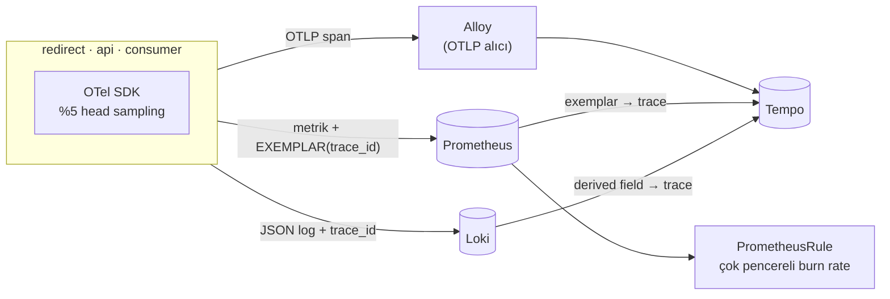

# 11 — observability-deep · "Neden yavaş?"

> **Bu seviyede ne yaşayacaksın?**
> - "p99 yüksek — ama nerede?" sorusunu cevaplamak: gecikme panelindeki bir noktadan (exemplar) o isteğin trace'ine gitmek (P11-01)
> - Tuzak: trace'in Kafka sınırında kopması (P11-02); sampling'in maliyet ile kapsama arasındaki takası (P11-03)
> - Eşik alarmı ile hata bütçesine dayalı burn-rate alarmının farkı (P11-04); gözlemlenebilirlik yığınının kendi kapasitesi (P11-05)
> - Tuzak: kardinalite (P11-06); dashboard drift'i (P11-07); tuzak: yalnızca profilde görünen sıcak nokta — pprof ile hangi satır (P11-08)
>
> **Bu seviye olmasa ne olur?** Metrik "yavaş" der ama "nerede"yi söylemez; optimizasyon tahminle yapılır, alarmlar ya gürültü ya sessizlik olur.
>
> **Yeni gelen teknolojiler:** OpenTelemetry, Tempo, Alloy (OTLP), Loki, exemplar, SLO kayıt kuralları + Alertmanager, pprof, `12 · SLO` paneli ([her biri tek cümleyle](../README.md#kullanılan-teknolojiler)).

## 1. Bu seviye ne?

"p99 yüksek — ama nerede?" sorusunu cevaplanabilir kılar. Dört araç tek bir kimlikle (`trace_id`) birbirine bağlanır:
**metrik** (ne kadar), **trace** (nerede — bir isteğin adım adım yolculuğu), **log** (neden) ve **profil** (hangi
satır). Alarmlar da sabit eşiklerden **hata bütçesine** taşınır.

## 2. Mimari



İsteklerin %5'i örneklenir (trace'i kaydedilir); log satırındaki `trace_id` ve exemplar yalnızca bu isteklerde yazılır.
Bir redirect'in trace'i (her satır bir span, yani isteğin bir adımı):

```
GET /{code}                  ← sunucu span'i: middleware açar, log + exemplar bunu okur
├─ cache.get                 ← cache.result = hit / miss / negative_hit / redis_error
│  ├─ guard.redis            ← Redis çağrısı (kendi devre kesicisi, dep="redis")
│  └─ guard.postgres         ← yalnızca ıskada · retry'lar ayrı db.* çocukları olarak görünür
│     └─ db.get              ← "pool.acquire" olayı: havuzda ne kadar beklendi
└─ kafka.produce             ← broker onaylayınca biter (istekten SONRA) · bağlam header'a yazılır
   └─ consume-batch          ← linkly-analytics: kuyruğun öbür yakası
      └─ db.write_clicks_idem
```

## 3. Önceki seviyeden çözülenler

| ID | Sorun | Nasıl çözüldü |
|---|---|---|
| — | 10'un sorunlarından hiçbiri **çözülmüyor** | 11 yalnızca izleme ekler (trace, exemplar, SLO alarmları, profil); zaman aşımı (timeout), bölmeleme (bulkhead) ve yeniden deneme (retry) ayarlarına dokunmaz. Bu yüzden P10-03 burada da ortaya çıkar (`problems/SOLVES`) |

Kazanç bir sorunu kapatmak değil, her sorunun teşhisini kısaltmak: P10-03'ün "nerede beklendi?" sorusu artık tek bir trace'te okunur.

## 4. Ayağa kaldırma

İlk kez mi? Önce kök README'deki [Sıfırdan başlangıç](../README.md#sıfırdan-başlangıç): platform bir kez kurulur ve
`LADDER` (repo kökü) tanımlanır. Her komut bloğu `cd "$LADDER/…"` ile başlar; olduğu gibi yapıştır.
Bu seviyenin platformdan istediği: **temel yığın (kind, ingress, Prometheus, Grafana) + Chaos Mesh, KEDA, CloudNativePG, Tempo + Loki (yalnızca bu seviyede açılır)**; `make up` açar.

Hızlı başvuru (komutları tek tek kullan; satır sonu açıklamaları için zsh'da `setopt interactivecomments` gerekir):

```bash
cd "$LADDER/11-observability-deep"
make up            # profil → Grafana'yı temizle → build → push → deploy → rollout wait → smoke
make link          # example.com'a kısa link oluştur, yönlendirmeyi dene → 302 · başka adres: make link URL=https://…
make grafana       # Ladder klasörü, level=lvl11 — giriş: admin / ladder
make load S=mixed  # aynı senaryolar her seviyede: create redirect mixed hot-key burst abuser read-your-writes stairs scan
make repro P=P11-01   # §6'daki bir sorunu otomatik üret → REPRODUCED / NOT-REPRODUCED
make env           # açık ayar/tuzaklar · değiştir: make set E="KEY=değer" · hepsini geri al: make reset (§7)
make down          # seviyeyi kaldır · kümeyi durdurmak için: cd "$LADDER/platform" && make stop
```

Trace'e bakmak için: Grafana → Explore → Tempo (ya da `kubectl -n monitoring port-forward svc/tempo 3200:3200`).

**Rehber — bu seviyeyi baştan sona, sırayla.**

1. Önceki seviyeyi kapat (aynı anda tek seviye), bu seviyeyi kur. `make up` Grafana'yı da temizler; sonunda
   `✔ lvl11 ayakta` yazar:
```bash
cd "$LADDER/10-resilience"
make down
cd "$LADDER/11-observability-deep"
make up
```

**Verileri temizleyip sıfırdan koşmak istersen** 1. adımın yerine bunu kullan: bütün seviyelerin verisi
(linkler, veritabanı, önbellek, kuyruk) ve Grafana'nın gösterdiği metrik, trace, log silinir; küme ve kurulum
kalır (~2-3 dk). Ardından bu seviye temiz kurulur. Yalnızca Grafana çizgilerini temizlemek için (veri kalır)
seviye klasöründe `make fresh` yeter; her deneyin ilk komutu zaten bu.
```bash
cd "$LADDER"
make wipe CONFIRM=1
cd "$LADDER/11-observability-deep"
make up
```
2. 10'un sorunlarını burada koş (koşarken başka komut çalıştırma). 11 bunların hiçbirini çözmez: `BEKLENEN` sütunu her
   satırda `(açık kalabilir)` der, P10-03 burada da `REPRODUCED` çıkar. Onay isteyen P10-02 `SKIPPED` görünür; onu da
   koşmak için `CONFIRM=1 make verify-prev`:
```bash
cd "$LADDER/11-observability-deep"
make verify-prev
```
3. §6'daki sorunları sırayla yaşa (P11-01 → P11-08): adımları yapıştır → **Terminalde ne görmelisin** ile
   karşılaştır → **Grafana'da gör** linklerini aç. Tempo'ya terminalden bakan adımlar ikinci bir terminalde
   `kubectl port-forward` açar; adım bitince onu Ctrl+C ile durdur.
4. Bitince kalan arızaları ve ayarları geri al, seviyeyi kapat:
```bash
cd "$LADDER/11-observability-deep"
make unchaos
make reset
make down
```

## 5. API

Her seviyede aynı: [docs/API.md](../docs/API.md).

Tek fark: gelen `traceparent` header'ı dikkate alınır — istemci bir trace başlattıysa sunucu span'i onun çocuğu olur ve
istemcinin örnekleme kararı (`-01` = örneklendi) %5'in önüne geçer. Deneme:
`curl -H 'traceparent: 00-4bf92f3577b34da6a3ce929d0e0e4736-00f067aa0ba902b7-01' http://lvl11.localtest.me/$code`
→ Tempo'da `4bf92f3577b34da6a3ce929d0e0e4736`.

## 6. Reproduce edilebilir sorunlar

Bu seviyede yaşayacağın 8 sorun. Her birini iki yoldan görebilirsin: **Otomatik** — `make repro P=<ID>` deneyi
kendisi yapar, ölçer ve hükmünü basar (`REPRODUCED` = sorun var · `NOT-REPRODUCED` = yok · `SKIPPED` =
ölçülemedi); **Elle** — adımları sırayla yapıştırıp sonucu kendi gözünle görürsün. Her sorunun bölümü aynı
düzende: **Ne oluyor** → **Neden oluyor** → **Bu deney** → adımlar → **Terminalde ne görmelisin** →
**Grafana'da gör** (giriş: admin / ladder) → **Nasıl çözülüyor**.

**Kısa komut** deneyi otomatik başlatır; seviyenin klasöründe çalıştır (önce `cd "$LADDER/11-observability-deep"`).

| ID | Kısa komut | Ne olur? | Neden olur? | Nasıl çözülür? |
|---|---|---|---|---|
| P11-01 | `make repro P=P11-01` | Uygulama yavaşlar; grafik "yavaş" der ama hangi bağımlılığın (Redis mi, Postgres mi) beklettiğini söylemez | Metrikler bütün isteklerin toplamıdır; tek bir isteğin adım adım süresini yalnızca trace (isteğin zaman çizelgesi) gösterir | **11:** grafikteki yavaş noktadan (exemplar) o isteğin trace'ine ve loguna atlanır |
| P11-02 | `make repro P=P11-02` | Bir tıklamanın izi kuyrukta (Kafka) kopar; tüketicinin işi ayrı, sahipsiz bir trace olarak görünür | HTTP'de trace kimliği kendiliğinden taşınır; kuyruk mesajına kod koymazsa taşınmaz | **11:** kimlik mesaj başlığına yazılır (tuzak: `TRAP_NO_KAFKA_PROPAGATION`) |
| P11-03 | `make repro P=P11-03` | Bütün trace'leri kaydetmek toplayıcıyı (Alloy) yorar; yalnızca %5'ini kaydetmek nadir hataları kaçırır | Kaydetme kararı isteğin başında, yavaş ya da hatalı olacağı bilinmeden verilir (head sampling) | Takas: doğru trace'i exemplar zaten gösterir; nadir hatalar için tail sampling |
| P11-04 | `make repro P=P11-04` | Kısa bir hata sıçramasında basit eşik alarmı gereksiz yere çalar; uzun süren küçük bir hatada ise susar | Alarm "şu an hata var mı?" diye soruyor; doğru soru hata bütçesinin ne hızla bittiği (burn rate) | **11:** birden çok pencereli burn-rate alarmları |
| P11-05 | `make repro P=P11-05` | Log seviyesi `debug` yapılınca log hattı (Loki) sınırına takılabilir; tam araştırdığın anın logları düşer | Loki saniyede en fazla 8 MB kabul eder; `debug` her isteğe bir satır daha ekler | **11:** ayrıntılı logu kısa süre ve yerinde açmak, örneklemek, ayrıntıyı trace'e taşımak |
| P11-06 | `make repro P=P11-06` | Kiracı (tenant) metrik etiketi yapılınca Prometheus'taki seri sayısı kiracı sayısıyla birlikte büyür | Her farklı etiket değeri ayrı bir seri, yani ayrı bellek; kiracı sayısı iş büyüdükçe sınırsız artar | **11:** metriklerde kiracı etiketi yok (tuzak: `TRAP_TENANT_LABEL`); kiracı analizi log, trace ve veritabanında |
| P11-07 | `make repro P=P11-07` | Grafana'da elle yapılan bir düzeltme hiçbir yerde kayıtlı değildir ve bir sonraki yüklemede silinir | Panolar kod olarak tutulmazsa sürüm kontrolleri yoktur | **11:** panolar kod (`gen.py` + `make dashboards`), Grafana'da elle düzenlenemez |
| P11-08 | `make repro P=P11-08` | Her istekte gereksiz yere regex derlemek CPU'yu artırır ama hiçbir metrik sebebi söylemez | "CPU'yu hangi satır yiyor?" sorusunu yalnızca CPU profili cevaplar | **11:** `pprof` ile profil alınır (tuzak: `TRAP_REGEX_PER_REQUEST`) |

---

### P11-01 · "p99 yüksek — nerede?"

**Ne oluyor:** Uygulama yavaşlar; `02 · App RED`'deki p99 (en yavaş %1'in süresi) yükselir ama grafik hangi
bağımlılığın — Redis mi, Postgres mi — beklettiğini söylemez. Gerçek bir olayda bu, tahminle yanlış yeri
"düzeltmek" demek.
**Neden oluyor:** Metrikler bütün isteklerin toplamı ya da ortalamasıdır; tek bir isteğin içinde hangi adımın ne kadar
sürdüğünü bilmez. Bunu yalnızca trace — bir isteğin servisler ve bağımlılıklar boyunca adım adım zaman çizelgesi —
gösterir.
**Bu deney:** Önce temiz, sonra Redis'e 200 ms gecikme eklenmiş hâlde aynı yükü verir ve her fazın p99'unu okur;
grafikteki yavaş bir noktadan (exemplar) o isteğin trace'ine atlayıp adımları süreye göre sıralar.

**Reproduce (adım adım):** Otomatik: `make repro P=P11-01` (temiz taban ve gizli bir gecikmeyle aynı yükü koşar, her
fazın p99'unu okur, exemplar'dan trace'e atlayıp span'leri süreye göre basar). Elle:

1. Temiz başla; tabanda 30 sn yük ver ve `/{code}` p99'unu oku (son 1 dakika: yalnızca bu yük):
```bash
cd "$LADDER/11-observability-deep"
make fresh
make load S=redirect K6_ARGS="--vus 20 --duration 30s"
sleep 10
curl -s 'http://prometheus.localtest.me/api/v1/query' --data-urlencode 'query=histogram_quantile(0.99, sum(rate(http_request_duration_seconds_bucket{namespace="lvl11",route="/{code}"}[1m])) by (le))' | jq -r '"taban p99 (sn): " + .data.result[0].value[1]'
```
2. Redis'e 200 ms gecikme ekle, aynı yükü 40 sn ver; toplam p99'u ve bağımlılık başına p99'u oku (metriğin söyleyebildiği kadarı):
```bash
cd "$LADDER/11-observability-deep"
make chaos C=redis-delay-200ms
sleep 5
make load S=redirect K6_ARGS="--vus 20 --duration 40s"
sleep 12
curl -s 'http://prometheus.localtest.me/api/v1/query' --data-urlencode 'query=histogram_quantile(0.99, sum(rate(http_request_duration_seconds_bucket{namespace="lvl11",route="/{code}"}[1m])) by (le))' | jq -r '"şimdi p99 (sn): " + .data.result[0].value[1]'
curl -s 'http://prometheus.localtest.me/api/v1/query' --data-urlencode 'query=histogram_quantile(0.99, sum(rate(dependency_request_duration_seconds_bucket{namespace="lvl11"}[1m])) by (le, dep))' | jq -r '.data.result[] | "\(.metric.dep): \(.value[1]) sn"'
```
3. Son 5 dakikanın exemplar'larından yavaş (> 100 ms) bir isteğin `trace_id`'sini al:
```bash
cd "$LADDER/11-observability-deep"
tid=$(curl -sG 'http://prometheus.localtest.me/api/v1/query_exemplars' --data-urlencode 'query=http_request_duration_seconds_bucket{namespace="lvl11",route="/{code}"}' --data-urlencode "start=$(( $(date +%s) - 300 ))" --data-urlencode "end=$(date +%s)" | jq -r '[.data[]?.exemplars[]? | select((.value|tonumber) > 0.1) | .labels.trace_id] | .[0] // empty'); echo "trace_id: $tid"
```
4. İkinci bir terminalde Tempo'ya tünel aç, açık bırak:
```bash
cd "$LADDER/11-observability-deep"
kubectl -n monitoring port-forward svc/tempo 13201:3200
```
5. İlk terminalde o trace'in en uzun span'lerini süreye göre bas:
```bash
cd "$LADDER/11-observability-deep"
curl -s "http://127.0.0.1:13201/api/traces/$tid" | jq -r '[(.batches // .resourceSpans // [])[] | ([.resource.attributes[]? | select(.key=="service.name") | .value.stringValue][0]) as $svc | (.scopeSpans // .instrumentationLibrarySpans // [])[] | .spans[]? | {s: $svc, n: .name, d: (((.endTimeUnixNano|tonumber) - (.startTimeUnixNano|tonumber)) / 1e6)}] | sort_by(-.d) | .[:6][] | "\(.d|floor) ms  \(.n)  (\(.s))"'
```
6. Tüneli Ctrl+C ile durdur, gecikmeyi kaldır:
```bash
cd "$LADDER/11-observability-deep"
make unchaos
```

**Terminalde ne görmelisin:** taban p99 birkaç milisaniye (`0.00…` sn), gecikmeyle `0.2`'nin üstü. Bağımlılık
satırlarında `redis` ~0,2 sn, `postgres` alçak: metrik hangi bağımlılığın yavaşladığını gösterir ama tek bir isteğin
nerede beklediğini söylemez. 3. adım 32 haneli bir `trace_id` basar (boşsa o aralıkta örneklenmiş yavaş istek yok:
2. adımı tekrarla). 5. adımda en üstte `GET /{code}`, altında sürenin neredeyse tamamını taşıyan `cache.get` ve
`guard.redis` — süre Redis çağrısında gidiyor. Aynı `trace_id`'yi Explore → Loki'de `{namespace="lvl11"} |= "<trace_id>"`
ile ararsan o isteğin log satırı çıkar.

**Grafana'da gör:** [`02 · App RED`](http://grafana.localtest.me/d/ladder-app-red?var-level=lvl11&from=now-15m&to=now&refresh=10s) ve [`11 · Resilience`](http://grafana.localtest.me/d/ladder-resilience?var-level=lvl11&from=now-15m&to=now&refresh=10s) — deney başlayınca aç; 30 sn taban, sonra gecikmeyle 40 sn
- "p99 süre (uç noktaya göre)" → `/{code}` tabanda alçak, gecikmeyle ~200 ms'nin üstüne sıçrar: metrik yalnızca "yavaşladı" der.
- "Bağımlılık gecikmesi p99" → `redis` ~200 ms'ye çıkar, `postgres` alçak kalır: hangi bağımlılık olduğunu gösterir, tek isteğin adımlarını değil.
- "p99 süre (uç noktaya göre)" üzerindeki **noktalar** (exemplar) → her biri örneklenmiş bir isteğin `trace_id`'si; plato üzerindeki bir noktada **Trace'i aç (Tempo)**'ya tıkla, o isteğin trace'i açılır.
- Explore'da: `{ resource.service.name = "linkly-redirect" && duration > 100ms }` → veri kaynağı **Tempo**: yavaş `GET /{code}` trace'leri; sürenin neredeyse tamamı `cache.get` → `guard.redis`'te.
- Explore'da: `{namespace="lvl11", app="redirect"} | json | trace_id != ""` → veri kaynağı **Loki**: örneklenmiş isteklerin log satırları; `trace_id` yanındaki link aynı trace'i Tempo'da açar.

**Nasıl çözülüyor:** Bu seviyede parçalar birbirine bağlı: metrik yavaşlığı **ölçer**, grafikteki örnek nokta (exemplar) o yavaş isteğin trace'ini **işaret eder**, trace hangi adımın beklettiğini **açıklar**, aynı `trace_id`'yi taşıyan log satırı **kanıtlar**. Tahmin yerine birkaç tıklamayla doğru bağımlılığa gidilir.

---

### P11-02 · TRAP · Trace asenkron sınırda kopuyor

**Ne oluyor:** Bir redirect isteğinin trace'i, tıklama olayı kuyruğa (Kafka/Redpanda) yazıldığı yerde biter; olayı
işleyen tüketicinin yaptığı iş ayrı, sahipsiz (yetim) trace'ler olarak görünür. "Bu tıklama neden geç işlendi?"
sorusunu tek bir trace'te takip edemezsin.
**Neden oluyor:** HTTP çağrılarında trace kimliği bir başlıkla (`traceparent`) kendiliğinden taşınır. Kuyruğa yazılan
mesajda böyle bir otomatik taşıma yok; kimliği mesaj başlığına kod koymazsa tüketici yepyeni bir trace başlatır.
**Bu deney:** Bağlam taşıma açık ve kapalı iki fazda aynı yükü verir; her fazda tüketici adımını (`consume-batch`)
taşıyan trace'lerin hangi servisle başladığını sayar — `linkly-redirect` ise bağlı, `linkly-analytics` ise yetim.

**Reproduce (adım adım):** Otomatik: `make repro P=P11-02` (bağlam taşıma açık/kapalı iki faz; her fazda tüketici
span'i `consume-batch` taşıyan trace'lerin kök servisini sayar — kök `linkly-redirect` ise bağlı, `linkly-analytics` ise yetim). Elle:

1. Temiz başla:
```bash
cd "$LADDER/11-observability-deep"
make fresh
```
2. İkinci bir terminalde Tempo'ya tünel aç, deney boyunca açık bırak:
```bash
cd "$LADDER/11-observability-deep"
kubectl -n monitoring port-forward svc/tempo 13200:3200
```
3. İlk terminalde bağlam taşıma açıkken (varsayılan) 30 sn yük ver, span'lerin Tempo'ya ulaşması için 20 sn bekle,
   `consume-batch` taşıyan trace'leri kök servislerine göre say:
```bash
cd "$LADDER/11-observability-deep"
t0=$(date +%s)
make load S=redirect K6_ARGS="--vus 10 --duration 30s"
sleep 20
t1=$(date +%s)
curl -sG 'http://127.0.0.1:13200/api/search' --data-urlencode 'q={ resource.service.name = "linkly-analytics" && name = "consume-batch" }' --data-urlencode "start=$t0" --data-urlencode "end=$t1" --data-urlencode 'limit=500' | jq -r '[.traces[]?.rootServiceName] | group_by(.) | map("\(.[0]): \(length)") | .[]'
```
4. Tuzağı aç (bağlam Kafka header'ına konmaz; redirect pod'ları yeniden başlar), aynı fazı tekrarla:
```bash
cd "$LADDER/11-observability-deep"
make set E="TRAP_NO_KAFKA_PROPAGATION=true" W=redirect
t0=$(date +%s)
make load S=redirect K6_ARGS="--vus 10 --duration 30s"
sleep 20
t1=$(date +%s)
curl -sG 'http://127.0.0.1:13200/api/search' --data-urlencode 'q={ resource.service.name = "linkly-analytics" && name = "consume-batch" }' --data-urlencode "start=$t0" --data-urlencode "end=$t1" --data-urlencode 'limit=500' | jq -r '[.traces[]?.rootServiceName] | group_by(.) | map("\(.[0]): \(length)") | .[]'
```
5. Tüneli Ctrl+C ile durdur, tuzağı kapat:
```bash
cd "$LADDER/11-observability-deep"
make reset
```

**Terminalde ne görmelisin:** her satır `<kök servis>: <trace sayısı>`. 3. adımda `linkly-redirect` baskın: tüketici
span'i redirect isteğinin trace'inin bir dalı. 4. adımda `linkly-analytics` baskın: aynı span'ler artık yetim kök.
Kökü henüz Tempo'ya ulaşmamış trace'ler üçüncü bir ad altında görünebilir. İki adımda da sayım boşsa tracing ya da
Alloy çalışmıyor.

**Grafana'da gör:** [`08 · Stream (Redpanda)`](http://grafana.localtest.me/d/ladder-stream?var-level=lvl11&from=now-15m&to=now&refresh=10s) — deney başlayınca aç; iki faz 30'ar sn + 20'şer sn bekleme
- "Tüketilen kayıtlar (sonuca göre)" → iki fazda da `ok` akar: tıklamalar işleniyor; kopan şey veri değil, bağlam.
- Explore'da: `{ resource.service.name = "linkly-analytics" && name = "consume-batch" }` → veri kaynağı **Tempo**: ilk fazda kök `linkly-redirect` / `GET /{code}` (tek ağaç: `kafka.produce` → `consume-batch` → `db.write_clicks_idem`), ikinci fazda kök `linkly-analytics` / `consume-batch` (yetim).

**Nasıl çözülüyor:** Bu seviyede üretici trace kimliğini Kafka mesaj başlığına yazar, tüketici oradan okuyup aynı trace'e devam eder. Bu seviyenin kendi tuzağı: `TRAP_NO_KAFKA_PROPAGATION=true` açıkken kimlik başlığa konmaz ve kopukluk geri gelir — asenkron sınırları kendiliğinden bağlayan bir şey yok, kodun bağlaması gerekir.

---

### P11-03 · Sampling: maliyet ile kapsama arasındaki takas

**Ne oluyor:** Trace'lerin tamamını kaydetmek toplayıcının (Alloy) işini katlar; yalnızca %5'ini kaydetmek ise nadir
görülen yavaş ya da hatalı istekleri çoğu zaman kaçırır. İkisi arasında bir seçim yapmak zorundasın.
**Neden oluyor:** Burada kullanılan "head sampling", bir trace'in kaydedilip kaydedilmeyeceğine isteğin **başında**
karar verir — isteğin yavaş ya da hatalı olacağını henüz bilmeden. Kaydetme oranı arttıkça toplayıcıya giden veri de
aynı oranda artar.
**Bu deney:** Aynı yükü önce %5, sonra %100 kaydetme oranıyla verir; Alloy'un kabul ettiği span (trace'in tek bir
adımı) sayısını ve CPU/bellek tepesini karşılaştırır, sonra %5'e döner.

**Reproduce (adım adım):** Otomatik: `make repro P=P11-03` (aynı yükte %5 ve %100 ile Alloy'un kabul ettiği span
sayısını ve CPU/bellek tepesini karşılaştırır, sonra %5'e döner; span sayısı iki fazda da 0 ise hüküm vermez). Elle:

1. Temiz başla; %5 ile (varsayılan) 40 sn yük ver, Alloy'un kabul ettiği span sayısını ve CPU/bellek tepesini oku:
```bash
cd "$LADDER/11-observability-deep"
make fresh
make load S=redirect K6_ARGS="--vus 30 --duration 40s"
sleep 15
curl -s 'http://prometheus.localtest.me/api/v1/query' --data-urlencode 'query=sum(increase(otelcol_receiver_accepted_spans_total{namespace="monitoring"}[3m]))' | jq -r '"kabul edilen span: " + .data.result[0].value[1]'
curl -s 'http://prometheus.localtest.me/api/v1/query' --data-urlencode 'query=max_over_time(sum(rate(container_cpu_usage_seconds_total{namespace="monitoring",pod=~"alloy.*",image!="",image!~".*pause.*"}[30s]))[3m:15s])' | jq -r '"Alloy CPU tepe (çekirdek): " + .data.result[0].value[1]'
curl -s 'http://prometheus.localtest.me/api/v1/query' --data-urlencode 'query=max_over_time(sum(container_memory_working_set_bytes{namespace="monitoring",pod=~"alloy.*",image!="",image!~".*pause.*"})[3m:15s])' | jq -r '"Alloy bellek tepe (bayt): " + .data.result[0].value[1]'
```
2. Sampling'i %100'e çıkar (redirect pod'ları yeniden başlar), aynı yükü ver, aynı üç ölçümü al:
```bash
cd "$LADDER/11-observability-deep"
make set E="TRACE_SAMPLE_PCT=100" W=redirect
make load S=redirect K6_ARGS="--vus 30 --duration 40s"
sleep 15
curl -s 'http://prometheus.localtest.me/api/v1/query' --data-urlencode 'query=sum(increase(otelcol_receiver_accepted_spans_total{namespace="monitoring"}[3m]))' | jq -r '"kabul edilen span: " + .data.result[0].value[1]'
curl -s 'http://prometheus.localtest.me/api/v1/query' --data-urlencode 'query=max_over_time(sum(rate(container_cpu_usage_seconds_total{namespace="monitoring",pod=~"alloy.*",image!="",image!~".*pause.*"}[30s]))[3m:15s])' | jq -r '"Alloy CPU tepe (çekirdek): " + .data.result[0].value[1]'
curl -s 'http://prometheus.localtest.me/api/v1/query' --data-urlencode 'query=max_over_time(sum(container_memory_working_set_bytes{namespace="monitoring",pod=~"alloy.*",image!="",image!~".*pause.*"})[3m:15s])' | jq -r '"Alloy bellek tepe (bayt): " + .data.result[0].value[1]'
```
3. %5'e geri dön:
```bash
cd "$LADDER/11-observability-deep"
make reset
```

**Terminalde ne görmelisin:** iki yükün özet satırı (`k6 lvl11: reqs=…`) yakın: aynı trafik. 2. adımda `kabul edilen span`
1. adımın birkaç katı (script 3 katından fazlasını bekler; teorik üst sınır 20×). Alloy'un CPU ve belleği de artar ama
daha az ve gürültülü: Alloy aynı anda log da taşıyor.

**Grafana'da gör:** [`15 · k6`](http://grafana.localtest.me/d/ladder-k6?var-level=lvl11&from=now-15m&to=now&refresh=10s) — deney başlayınca aç; iki faz 40'ar sn, arada redirect yeniden başlar
- "Gönderilen istek / sn" → iki eşit yük fazı: karşılaştırma aynı trafik altında.
- Explore'da: `sum(rate(otelcol_receiver_accepted_spans_total{namespace="monitoring"}[1m]))` → Alloy'un kabul ettiği span/s; %100 fazında katlanır.
- Explore'da: `sum(rate(container_cpu_usage_seconds_total{namespace="monitoring",pod=~"alloy.*",image!="",image!~".*pause.*"}[1m]))` → Alloy'un CPU'su; artış span artışından küçük.

**Nasıl çözülüyor:** Tek doğru oran yok; bu bir takas. Teşhis için bütün trace'ler değil doğru trace gerekir — grafikteki yavaş nokta (exemplar) ilgili trace'i zaten gösterir. Nadir hataları kaçırmamanın yolu "tail sampling"dir (karar istek bittikten sonra verilir); bedeli, toplayıcının her span'i karar anına kadar bellekte tutmasıdır.

---

### P11-04 · Eşik alarmı vs burn-rate alarmı

**Ne oluyor:** 30 sn'lik kısa bir hata sıçramasında basit eşik alarmı hemen çalar (ve gece seni uyandırır); günlerce
süren küçük ama sürekli bir hata ise eşiğin altında kalıp hiç alarm üretmez. Alarm ya gereksiz yere çalar ya
gerektiğinde susar.
**Neden oluyor:** SLO (hizmet hedefi, ör. isteklerin %99.9'u başarılı) aslında harcanmasına izin verilen bir hata
**bütçesidir**. Doğru soru "şu an hata var mı?" değil, "bu hızla gidersek bütçe ne zaman biter?"dir (burn rate —
bütçenin yanma hızı). `deploy/slo.yaml`'da karşılaştırma için bilerek bir basit eşik alarmı da tanımlı.
**Bu deney:** Postgres'e %50 paket kaybı vererek ~90 sn'lik bir hata sıçraması üretir, sonra hangi alarmların
çaldığını ve hata bütçesinden ne kaldığını okur.

**Reproduce (adım adım):** Otomatik: `make repro P=P11-04` (kısa bir hata sıçraması üretip hangi alarmların
ateşlediğini karşılaştırır; hiçbiri ateşlemezse `SPIKE=180 make repro P=P11-04`. Seviye yeni kurulduysa uzun pencerede
sıçramayı seyreltecek trafik yoktur ve hızlı burn-rate de haklı olarak ateşler — script o durumda hüküm vermez; diğer
sorunlardan sonra tekrar koş). Elle:

1. Temiz başla; tanımlı alarmları listele:
```bash
cd "$LADDER/11-observability-deep"
make fresh
curl -s 'http://prometheus.localtest.me/api/v1/rules' | jq -r '.data.groups[]?.rules[]? | select(.type=="alerting") | select(.name|test("Linkly")) | "\(.name) [\(.labels.severity // "-")]"' | sort -u
```
2. Postgres'e %50 paket kaybı ver, ~90 sn yükle hata sıçraması üret, arızayı kaldır, alarmların değerlendirilmesi için 75 sn bekle:
```bash
cd "$LADDER/11-observability-deep"
make chaos C=pg-loss-50
make load S=mixed K6_ARGS="--vus 20 --duration 90s"
make unchaos
sleep 75
```
3. Bu seviyenin hangi alarmları ateşledi, hata bütçesinden ne kaldı:
```bash
cd "$LADDER/11-observability-deep"
curl -s 'http://prometheus.localtest.me/api/v1/alerts' | jq -r '.data.alerts[]? | select((.labels.alertname|test("Linkly")) and .labels.namespace == "lvl11") | "\(.labels.alertname) → \(.state) [\(.labels.severity // "-")]"' | sort -u
curl -s 'http://prometheus.localtest.me/api/v1/query' --data-urlencode 'query=slo:period_error_budget_remaining:ratio{sloth_slo="redirect-availability",namespace="lvl11"}' | jq -r '"kalan hata bütçesi (oran): " + .data.result[0].value[1]'
```

**Terminalde ne görmelisin:** 1. adım dört alarm listeler: `LinklyNaiveErrorRateThreshold [none]`,
`LinklyRedirectErrorBudgetBurnFast [page]`, `LinklyRedirectErrorBudgetBurnMedium [page]`,
`LinklyRedirectErrorBudgetBurnSlow [ticket]`. Yük özetinde `5xx` > 0: sıçrama bu. 3. adımda
`LinklyNaiveErrorRateThreshold → firing` (bekleme süresi yok, hemen çalar); burn-rate alarmları ya yok ya `pending`
(`for:` süreleri 2 dk / 15 dk / 1 sa dolmadı). Kalan bütçe 1'in altında (48 saatlik saklama yüzünden sıfırın altına bile
inebilir). Hiç alarm yoksa sıçrama yetmedi: 2. adımı `--duration 180s` ile tekrarla.

**Grafana'da gör:** [`02 · App RED`](http://grafana.localtest.me/d/ladder-app-red?var-level=lvl11&from=now-15m&to=now&refresh=10s) ve [`12 · SLO`](http://grafana.localtest.me/d/ladder-slo?var-level=lvl11&from=now-15m&to=now&refresh=10s) — deney başlayınca aç; sıçrama ~90 sn, sonra 75 sn bekleme
- "5xx (uç noktaya göre)" → `/{code}` için ~90 sn'lik 5xx tepesi (hata yalnızca önbellek ıskalarından): alarmların tepki verdiği olay.
- "Hata oranı (son 5 dk)" → hızla yükselir, birkaç dakikada söner; naive alarmın baktığı tek sayı bu (eşik `0.01`).
- "Bütçe yanma hızı (1 sa / 6 sa)" → 1 sa çizgisi sıçrar, 6 sa küçük bir basamak yapar; hızlı alarm ikisinin birlikte 14.4'ü aşmasını ve 2 dk sürmesini ister.
- "Kalan hata bütçesi" → aşağı iner; bu laboratuvarda "30 gün" fiilen son 48 saat olduğu için tek sıçrama bütçenin büyük kısmını yiyebilir.
- "Çalan alarmlar" → naive alarm hemen belirir; burn-rate alarmları kısa bir sıçramada genellikle hiç görünmez.
- Explore'da: `ALERTS{namespace="lvl11",alertname=~"Linkly.*"}` → `pending` durumunu da gösterir (panel yalnızca firing'i).

**Nasıl çözülüyor:** Bu seviyede birden çok pencereli burn-rate alarmları var (elle yazılmış kurallar): uzun pencere "hata yeterince büyük mü?", kısa pencere "hâlâ oluyor mu?" diye sorar ve alarm ikisi birden evet deyince çalar. Kısa bir sıçrama bütçeyi az yaktığı için seni uyandırmaz; yavaş ama sürekli bir kanama ise bir iş kaydı (ticket) açar.

---

### P11-05 · Gözlemlenebilirliğin de bir kapasitesi vardır

**Ne oluyor:** Bir sorunu araştırırken log seviyesini `debug` yapmak log hacmini büyütür; log hattı (Loki) sınırına
takılırsa tam araştırdığın anın logları düşer. Teşhis aracı, en çok gerektiği anda seni bırakır.
**Neden oluyor:** Log boru hattının bir kapasitesi var: Loki saniyede en fazla 8 MB kabul eder
(`ingestion_rate_mb: 8`), fazlasını reddeder. `debug` her redirect'e bir log satırı daha ekler; trafik yüksekse
hacim sınırı aşar.
**Bu deney:** Aynı yükü `info` ve `debug` log seviyeleriyle verir; Loki'ye giren baytı, istek başına düşen log
baytını ve Loki'nin reddettiği kayıtları karşılaştırır, sonra `info`'ya döner.

**Reproduce (adım adım):** Otomatik: `make repro P=P11-05` (aynı yükte `info` ve `debug` ile Loki'ye giren baytı,
**istek başına** log baytını ve Loki'nin reddettiği kayıtları ölçer, sonra `info`'ya döner; hüküm istek başına bayta
bakar). Elle:

1. Temiz başla; `info` seviyesinde (varsayılan) 40 sn yük ver, Loki'ye giren bayt/s'i, istek başına log baytını,
   Loki reddini ve son 200 satırdaki debug satırı sayısını oku:
```bash
cd "$LADDER/11-observability-deep"
make fresh
t0=$(date +%s)
make load S=redirect K6_ARGS="--vus 30 --duration 40s"
sleep 15
w=$(( $(date +%s) - t0 ))
curl -s 'http://prometheus.localtest.me/api/v1/query' --data-urlencode "query=sum(increase(loki_distributor_bytes_received_total[${w}s])) / ${w}" | jq -r '"Loki bayt/s: " + .data.result[0].value[1]'
curl -s 'http://prometheus.localtest.me/api/v1/query' --data-urlencode "query=sum(increase(loki_distributor_bytes_received_total[${w}s])) / sum(increase(http_requests_total{namespace=\"lvl11\"}[${w}s]))" | jq -r '"istek başına log (bayt): " + .data.result[0].value[1]'
curl -s 'http://prometheus.localtest.me/api/v1/query' --data-urlencode 'query=sum(increase(loki_discarded_samples_total[3m])) or sum(increase(loki_request_duration_seconds_count{status_code="429"}[3m])) or vector(0)' | jq -r '"Loki reddi: " + .data.result[0].value[1]'
kubectl -n lvl11 logs deploy/redirect --tail=200 | grep -c 'redirect isteği'
```
2. Seviyeyi `debug` yap (redirect pod'ları yeniden başlar), aynı yükü ver, aynı dört ölçümü al:
```bash
cd "$LADDER/11-observability-deep"
make set E="LOG_LEVEL=debug" W=redirect
t0=$(date +%s)
make load S=redirect K6_ARGS="--vus 30 --duration 40s"
sleep 15
w=$(( $(date +%s) - t0 ))
curl -s 'http://prometheus.localtest.me/api/v1/query' --data-urlencode "query=sum(increase(loki_distributor_bytes_received_total[${w}s])) / ${w}" | jq -r '"Loki bayt/s: " + .data.result[0].value[1]'
curl -s 'http://prometheus.localtest.me/api/v1/query' --data-urlencode "query=sum(increase(loki_distributor_bytes_received_total[${w}s])) / sum(increase(http_requests_total{namespace=\"lvl11\"}[${w}s]))" | jq -r '"istek başına log (bayt): " + .data.result[0].value[1]'
curl -s 'http://prometheus.localtest.me/api/v1/query' --data-urlencode 'query=sum(increase(loki_discarded_samples_total[3m])) or sum(increase(loki_request_duration_seconds_count{status_code="429"}[3m])) or vector(0)' | jq -r '"Loki reddi: " + .data.result[0].value[1]'
kubectl -n lvl11 logs deploy/redirect --tail=200 | grep -c 'redirect isteği'
```
3. `info`'ya geri dön:
```bash
cd "$LADDER/11-observability-deep"
make reset
```

**Terminalde ne görmelisin:** 1. adımda debug satırı `0`. 2. adımda `istek başına log` belirgin büyük (her redirect'e
bir satır daha; ölçülen örnekte ~1800 → ~2200 bayt) ve son 200 satırın çoğu `redirect isteği`. `Loki bayt/s` yakın,
hatta düşük çıkabilir: yeni kalkan pod'lar fazın başında daha az istek cevaplar — bu yüzden istek başına hacme
bakılır. `Loki reddi` sıfırdan ayrılırsa sınır aşılmış ve satırlar **düşmüştür**; bu yük yetmediyse `0` kalır.

**Grafana'da gör:** [`15 · k6`](http://grafana.localtest.me/d/ladder-k6?var-level=lvl11&from=now-15m&to=now&refresh=10s) — deney başlayınca aç; iki faz 40'ar sn, arada redirect yeniden başlar
- "Gönderilen istek / sn" → iki eşit yük fazı: log hacmindeki fark trafikten değil, log seviyesinden.
- Explore'da: `sum(bytes_over_time({namespace="lvl11", app="redirect"}[1m]))` → veri kaynağı **Loki**: dakikalık log baytı debug fazında yükselir.
- Explore'da: `{namespace="lvl11", app="redirect"} |= "redirect isteği"` → veri kaynağı **Loki**: debug satırları yalnızca ikinci fazda.
- Explore'da: `sum(rate(loki_discarded_samples_total[1m])) by (reason)` → sıfırdan ayrılırsa Loki satır düşürüyor.

**Nasıl çözülüyor:** Bu seviyenin dersi teşhis araçlarını da kapasite planına katmak: ayrıntılı logu yalnızca gereken yerde ve kısa süre açmak (seviyeyi çalışırken değiştirerek), logları örneklemek (sampling) ve tek bir isteğin ayrıntısını log yerine trace'e taşımak.

---

### P11-06 · TRAP · Kardinalite, üçüncü kez

**Ne oluyor:** Kiracı (tenant) kimliği metrik etiketi yapılınca Prometheus'taki seri sayısı kiracı sayısıyla birlikte
büyür; müşteri arttıkça Prometheus'un belleği ve sorgu süresi de artar. Sonunda izleme sisteminin kendisi yavaşlar
ya da çöker.
**Neden oluyor:** Her farklı etiket değeri ayrı bir zaman serisi, yani ayrı bellek demektir (kardinalite). Kiracı
sayısı iş büyüdükçe artan bir sayı olduğu için etiket masum görünür ama sınırsızdır — 01'deki kısa kod etiketinin
(P01-06) daha makul görünen hali.
**Bu deney:** `TRAP_TENANT_LABEL`'ı açar, 500 farklı kiracıdan istek gönderir, `tenant` etiketinin kaç farklı değer
aldığını ve toplam seri artışını ölçer, sonra tuzağı kapatır.

**Reproduce (adım adım):** Otomatik: `make repro P=P11-06` (`TRAP_TENANT_LABEL`'ı açar, 500 farklı kiracıdan istek
gönderir, `tenant` etiketinin kaç değer aldığını ve toplam seri artışını ölçer, tuzağı kapatır; kiracı sayısı:
`N=2000 make repro P=P11-06`). Elle:

1. Temiz başla; Prometheus'un şu anki toplam seri sayısına bak:
```bash
cd "$LADDER/11-observability-deep"
make fresh
curl -s 'http://prometheus.localtest.me/api/v1/query' --data-urlencode 'query=prometheus_tsdb_head_series' | jq -r '"toplam seri (öncesi): " + .data.result[0].value[1]'
```
2. Tuzağı aç (redirect pod'ları yeniden başlar), eski pod'lar trafikten çıksın diye 10 sn bekle, bir linki 500 farklı kiracı adına iste:
```bash
cd "$LADDER/11-observability-deep"
make set E="TRAP_TENANT_LABEL=true" W=redirect
sleep 10
code=$(curl -s -XPOST http://lvl11.localtest.me/api/links -H 'Content-Type: application/json' -d '{"url":"https://example.com/card"}' | jq -r .code); echo "kod: $code"
for i in $(seq 1 500); do curl -s -o /dev/null -H "X-Tenant-ID: tenant-$i" http://lvl11.localtest.me/$code; done
```
3. Kazımanın yetişmesini bekle, `tenant` etiketinin kaç değer aldığını ve toplam seri sayısını oku:
```bash
cd "$LADDER/11-observability-deep"
sleep 20
curl -s 'http://prometheus.localtest.me/api/v1/query' --data-urlencode 'query=count(count by (tenant) (http_requests_total{namespace="lvl11"}))' | jq -r '"farklı tenant değeri: " + .data.result[0].value[1]'
curl -s 'http://prometheus.localtest.me/api/v1/query' --data-urlencode 'query=prometheus_tsdb_head_series' | jq -r '"toplam seri (sonrası): " + .data.result[0].value[1]'
```
4. Tuzağı kapat:
```bash
cd "$LADDER/11-observability-deep"
make reset
```

**Terminalde ne görmelisin:** 3. adımda `farklı tenant değeri` ~500 ve `toplam seri (sonrası)` öncesinden yüzlerce
fazla: her kiracı ayrı bir seri açtı. Hüküm yalnızca kiracı değer sayısına bakar (toplam seri kendi başına da oynar).
Tuzak kapandıktan sonra seriler Prometheus belleğinde bir süre daha durur.

**Grafana'da gör:** [`03 · App Business`](http://grafana.localtest.me/d/ladder-app-business?var-level=lvl11&from=now-15m&to=now&refresh=10s) — deney sırasında ya da hemen sonra aç
- "İstek / kiracı" → tuzak kapalıyken boş; açılınca **yüzlerce ayrı çizgi** (`tenant-1` … `tenant-500`): her kiracı kendi serisi.
- Explore'da: `count(count by (tenant) (http_requests_total{namespace="lvl11"}))` → tuzakla ~500'e sıçrar; hüküm bu sayıya bakar.
- Explore'da: `prometheus_tsdb_head_series` → aynı anda yukarı basamak: faturayı Prometheus ödüyor.

**Nasıl çözülüyor:** Bu seviyenin kendi tuzağı: `TRAP_TENANT_LABEL` kapalıyken metriklerde kiracı etiketi yok. "Kiracıya göre görmek" meşru bir istek ama cevabı metrik değil: en çok trafik üretenler için log/analitik sorgusu, tek bir yavaş istek için exemplar + trace, faturalama için veritabanı.

---

### P11-07 · Dashboard drift'i

**Ne oluyor:** Grafana'da bir paneli elle düzeltirsin; düzeltme hiçbir yerde kayıtlı değildir, kimin neden yaptığı
bilinmez ve panolar bir sonraki yüklemede (`make dashboards`) onu siler.
**Neden oluyor:** Panolar kod olarak tutulmazsa sürüm kontrolleri olmaz: değişiklik gözden geçirilemez, geri
alınamaz, başka bir kurulumda tekrar edilemez.
**Bu deney:** `02 · App RED` panosunun elle düzenlenebilir olup olmadığına bakar, Grafana API'siyle başlığını
değiştirmeyi dener, sonra panoları kaynaktan yeniden yükleyip değişikliğin kaybolduğunu gösterir.

**Reproduce (adım adım):** Otomatik: `make repro P=P11-07` (dashboard'ların düzenlenebilirliğini okur, API'den
değiştirmeyi dener, sonra kaynaktan yeniden uygulayıp değişikliğin kaybolduğunu gösterir). Elle (yük yok; hedef Grafana'nın kendisi):

1. Temiz başla; `02 · App RED` düzenlenebilir mi, başlığı ne:
```bash
cd "$LADDER/11-observability-deep"
make fresh
curl -s -u admin:ladder http://grafana.localtest.me/api/dashboards/uid/ladder-app-red | jq -r '.dashboard.editable, .dashboard.title'
```
2. API'den panelsiz ve başlığı değişmiş bir sürümle ezmeyi dene, başlığa tekrar bak:
```bash
cd "$LADDER/11-observability-deep"
curl -s -u admin:ladder -XPOST http://grafana.localtest.me/api/dashboards/db -H 'Content-Type: application/json' -d '{"dashboard":{"uid":"ladder-app-red","title":"Ladder / 02 · App RED (ELLE DEĞİŞTİRİLDİ)","panels":[],"schemaVersion":39},"overwrite":true}'; echo
curl -s -u admin:ladder http://grafana.localtest.me/api/dashboards/uid/ladder-app-red | jq -r '.dashboard.title'
```
3. Dashboard'ları kaynaktan (`platform/dashboards/gen.py`) yeniden uygula, yüklenmesini bekle, başlığa son kez bak:
```bash
cd "$LADDER/platform"
make dashboards
cd "$LADDER/11-observability-deep"
sleep 25
curl -s -u admin:ladder http://grafana.localtest.me/api/dashboards/uid/ladder-app-red | jq -r '.dashboard.title'
```

**Terminalde ne görmelisin:** 1. adım `false` ve `Ladder / 02 · App RED`: dashboard koddan geliyor, elle düzenlenemez.
2. adımdaki cevap ya ret (dosyadan yüklenen dashboard kaydedilmez, başlık değişmez) ya da kabul (başlık bir süre
`… (ELLE DEĞİŞTİRİLDİ)`). 3. adımda `✔ dashboards (… adet)` ve başlık yine `Ladder / 02 · App RED`: değişiklik kalıcı olamaz.

**Grafana'da gör:** [`02 · App RED`](http://grafana.localtest.me/d/ladder-app-red?var-level=lvl11&from=now-15m&to=now&refresh=10s) — deney bittikten sonra aç; deneyin hedefi bu dashboard
- "Saniyedeki istek" → panel ve dashboard yerinde, başlık hâlâ "Ladder / 02 · App RED": elle yapılan değişiklik ya kaydedilmedi ya kaynaktan geri yazıldı.

**Nasıl çözülüyor:** Bu seviyede panolar kod: `platform/dashboards/gen.py` üretir, `make dashboards` yükler ve Grafana'da elle düzenlenemezler. Bir paneli düzeltmek biraz daha uzun sürer ama değişiklik gözden geçirilebilir ve geri alınabilir olur; 12 aynı fikri uygulamanın kendisine uygular (P12-03).

---

### P11-08 · TRAP · Profilsiz görünmeyen hot spot

**Ne oluyor:** Her istekte gereksiz yere bir düzenli ifade (regex) derlenince istek başına CPU artar ve gecikme
hafifçe yükselir; ama hiçbir metrik "regex derleniyor" demez. Sebebi bilinmeyen bir yavaşlık tahminle optimize
edilir.
**Neden oluyor:** Metrik **ne kadar**, trace **nerede**, log **neden** sorusunu cevaplar; "CPU'yu **hangi satır**
yiyor?" sorusunun cevabı yalnızca CPU profilidir (hangi fonksiyonun ne kadar CPU harcadığının dökümü).
**Bu deney:** `TRAP_REGEX_PER_REQUEST` kapalı ve açıkken istek başına CPU'yu karşılaştırır, sonra redirect pod'unun
iç portundan (6060) CPU profili alıp içinde `regexp` fonksiyonlarını arar.

**Reproduce (adım adım):** Otomatik: `make repro P=P11-08` (`TRAP_REGEX_PER_REQUEST` açık/kapalı istek başına CPU'yu
karşılaştırır, sonra redirect pod'unun iç portundan (6060) CPU profili alır; hüküm profilde `regexp` görünmesine bakar,
profil alınamazsa hüküm yok). Elle (profil adımları yerelde `go` ister):

1. Temiz başla; regex bir kez derlenmişken (varsayılan) 40 sn yük ver, istek başına CPU'yu ve `/{code}` p99'unu oku:
```bash
cd "$LADDER/11-observability-deep"
make fresh
make load S=redirect K6_ARGS="--vus 30 --duration 40s"
sleep 12
curl -s 'http://prometheus.localtest.me/api/v1/query' --data-urlencode 'query=sum(rate(container_cpu_usage_seconds_total{namespace="lvl11",pod=~"redirect.*",image!="",image!~".*pause.*"}[2m])) / sum(rate(http_requests_total{namespace="lvl11",route="/{code}"}[2m]))' | jq -r '"istek başına CPU (ms): " + ((.data.result[0].value[1] // "0") | tonumber * 1000 | tostring)'
curl -s 'http://prometheus.localtest.me/api/v1/query' --data-urlencode 'query=histogram_quantile(0.99, sum(rate(http_request_duration_seconds_bucket{namespace="lvl11",route="/{code}"}[2m])) by (le))' | jq -r '"p99 (sn): " + .data.result[0].value[1]'
```
2. Tuzağı aç (her istekte regex yeniden derlenir; redirect pod'ları yeniden başlar), aynı yükü ver, aynı iki ölçümü al:
```bash
cd "$LADDER/11-observability-deep"
make set E="TRAP_REGEX_PER_REQUEST=true" W=redirect
make load S=redirect K6_ARGS="--vus 30 --duration 40s"
sleep 12
curl -s 'http://prometheus.localtest.me/api/v1/query' --data-urlencode 'query=sum(rate(container_cpu_usage_seconds_total{namespace="lvl11",pod=~"redirect.*",image!="",image!~".*pause.*"}[2m])) / sum(rate(http_requests_total{namespace="lvl11",route="/{code}"}[2m]))' | jq -r '"istek başına CPU (ms): " + ((.data.result[0].value[1] // "0") | tonumber * 1000 | tostring)'
curl -s 'http://prometheus.localtest.me/api/v1/query' --data-urlencode 'query=histogram_quantile(0.99, sum(rate(http_request_duration_seconds_bucket{namespace="lvl11",route="/{code}"}[2m])) by (le))' | jq -r '"p99 (sn): " + .data.result[0].value[1]'
```
3. Profil yük altında alınmalı: ikinci bir terminalde 30 sn yük başlat:
```bash
cd "$LADDER/11-observability-deep"
make load S=redirect K6_ARGS="--vus 30 --duration 30s"
```
4. Hemen ardından ilk terminalde hazır bir redirect pod'undan 20 sn'lik CPU profili al ve `regexp` karelerini ara:
```bash
cd "$LADDER/11-observability-deep"
pod=$(kubectl -n lvl11 get pod -l app.kubernetes.io/name=redirect -o json | jq -r '[.items[] | select(.metadata.deletionTimestamp == null) | select(any(.status.containerStatuses[]?; .ready)) | .metadata.name][0] // empty'); echo "pod: $pod"
kubectl --request-timeout=60s -n lvl11 get --raw "/api/v1/namespaces/lvl11/pods/${pod}:6060/proxy/debug/pprof/profile?seconds=20" > /tmp/p1108.prof
go tool pprof -top -nodecount=40 /tmp/p1108.prof | grep -iE 'regexp|onepass|syntax|Compile|MatchString'
go tool pprof -top -cum -nodecount=40 /tmp/p1108.prof | grep -iE 'regexp|onepass|syntax|Compile|MatchString'
```
5. İstersen profili tarayıcıda (flame graph) aç; bitince Ctrl+C:
```bash
cd "$LADDER/11-observability-deep"
go tool pprof -http=: /tmp/p1108.prof
```
6. Tuzağı kapat, profil dosyasını sil:
```bash
cd "$LADDER/11-observability-deep"
make reset
rm -f /tmp/p1108.prof
```

**Terminalde ne görmelisin:** 1. ve 2. adımın `istek başına CPU (ms)` değerleri yakın (ölçülen: 0.613 → 0.680 ms, ~%11)
ve p99 en fazla hafifçe kıpırdar — metrik sebebi göstermiyor. 4. adımda `grep` satırlarında `regexp` / `regexp/syntax`
fonksiyonları (`Compile`, `onepass` …) ve paylarını görürsün: "hangi satır" yalnızca profilde. `unrecognized profile
format` profil alınamadı demektir; `grep` boş kalırsa regexp kareleri ilk 40 düğümde değil (scriptin NOT-REPRODUCED durumu).

**Grafana'da gör:** [`01 · Pods & Resources`](http://grafana.localtest.me/d/ladder-pods?var-level=lvl11&from=now-15m&to=now&refresh=10s) ve [`02 · App RED`](http://grafana.localtest.me/d/ladder-app-red?var-level=lvl11&from=now-15m&to=now&refresh=10s) — deney başlayınca aç; iki faz 40'ar sn, arada redirect yeniden başlar
- "CPU kullanımı (bir çekirdeğin %'si)" → `redirect-…` pod'larında iki faz neredeyse aynı: maliyet CPU gürültüsünün altında. Görmemen sorunun kendisi.
- "p99 süre (uç noktaya göre)" → `/{code}` en fazla hafifçe kıpırdar; sebebe dair bir şey söylemez.
- Explore'da: `sum(rate(container_cpu_usage_seconds_total{namespace="lvl11",pod=~"redirect.*",image!="",image!~".*pause.*"}[2m])) / sum(rate(http_requests_total{namespace="lvl11",route="/{code}"}[2m]))` → istek başına CPU (sn); iki faz arasındaki fark küçük.

**Nasıl çözülüyor:** Bu seviyenin kendi tuzağı: `TRAP_REGEX_PER_REQUEST` kapalıyken regex yalnızca bir kez derlenir. Sebebi bulan araç profildir: Go'nun `net/http/pprof`'u iç port 6060'ta açık (dışarıya açık değil) ve `go tool pprof` ile okunur; sürekli profil (Pyroscope) 14'te, isteğe bağlı.

## 7. Seviye içi alıştırmalar (TRAP_ bayrakları)

> **Nasıl uygulanır:** aç `make set E="TRAP_X=true"` · ne açık? `make env` · hepsini geri al `make reset` (`make unset E=TRAP_X` yalnızca siler). Diğer ayarlar da aynı yolla (`make set E="CACHE_TTL=1h"`). Pod'lar yeni değerle yeniden başlar, komut hazır olunca döner; tek servis için `W=redirect`. `make repro` tuzakları kendisi açıp kapatır. Bitirince `make reset`: açık kalan bir tuzak sonraki deneyi sessizce bozar.

| Bayrak | Ne yapar | Reproduce | Düzeltme |
|---|---|---|---|
| `TRAP_NO_KAFKA_PROPAGATION` | Bağlamı Kafka header'ına koymaz | `make repro P=P11-02` | Bayrağı kapat |
| `TRAP_TENANT_LABEL` | tenant'ı metrik label'ı yapar | `make repro P=P11-06` | Bayrağı kapat |
| `TRAP_REGEX_PER_REQUEST` | İstek başına regex derler | `make repro P=P11-08` | Bayrağı kapat |
| `TRACE_SAMPLE_PCT` / `LOG_LEVEL` | Tuzak değil, **ayar düğmesi** | P11-03 / P11-05 | Ölç, sonra karar ver |

Elle denemeye değer:
- Bir trace'i Grafana'da aç ve span'leri takip et (`GET /{code}` → `cache.get` → `guard.redis` / `guard.postgres` →
  `db.get` → `kafka.produce` → `consume-batch`); toplam süre ile span sürelerinin toplamı arasındaki fark beklemedir.
- `TRACE_SAMPLE_PCT=100` + `make load S=stairs` ile Alloy'u zorla: gözlemlenebilirlik yığınının da SLO'su olmalı mı?
- `deploy/slo.yaml`'daki hedefi %99.9'dan %99.99'a çek (`0.001` → `0.0001`): bütçe 43 dakikadan 4 dakikaya iner, aynı hata artık page üretir.
- Loki'de `{namespace="lvl11"} | json | trace_id != ""` ile bir `trace_id` bul, Tempo'ya yapıştır; sonra aynısını derived field'ın tek tıkla yaptığını gör.
- `curl -H 'traceparent: 00-<32 hex>-<16 hex>-01' …` ile kendi trace'ini başlat: `-01` %5'i atlar — herkese açık bir uçta her istemci örneklemeyi zorlayabilir.

## 8. Gözlemlenebilirlik: hangi paneller dolu, hangileri boş

| Dashboard | Durum | Neden |
|---|---|---|
| [`12 · SLO`](http://grafana.localtest.me/d/ladder-slo?var-level=lvl11&from=now-15m&to=now) | **Dolu** ✨ | Hata oranı, bütçe yanma hızı, kalan bütçe, çalan alarmlar; "30 gün" fiilen son 48 saat (Prometheus saklaması) |
| [`02 · App RED`](http://grafana.localtest.me/d/ladder-app-red?var-level=lvl11&from=now-15m&to=now) | **Dolu** (exemplar'lı) ✨ | Gecikme panellerindeki noktalar örneklenmiş isteklerin `trace_id`'si; üzerine gelince **Trace'i aç (Tempo)** |
| [`06 · Redis`](http://grafana.localtest.me/d/ladder-redis?var-level=lvl11&from=now-15m&to=now) | Dolu | "Uygulama → Redis gecikmesi (p99)" Redis'in kendi guard'ından |
| [`11 · Resilience`](http://grafana.localtest.me/d/ladder-resilience?var-level=lvl11&from=now-15m&to=now) · [`05 · Postgres`](http://grafana.localtest.me/d/ladder-postgres?var-level=lvl11&from=now-15m&to=now) · [`08 · Stream`](http://grafana.localtest.me/d/ladder-stream?var-level=lvl11&from=now-15m&to=now) | Dolu | Trace'ler bunların hikâyesini birleştirir |
| [`13 · Rollout`](http://grafana.localtest.me/d/ladder-rollout?var-level=lvl11&from=now-15m&to=now) | Boş | 12'de |

Yeni araçlar dashboard değil: **Explore → Tempo** (trace), **Explore → Loki** (log, trace'e linkli) ve iç porttaki
**pprof** (`:6060`). Teşhis artık üç aracı zincirlemek.

## 9. Bilerek bırakılanlar

- Tail sampling yok; head sampling %5 (P11-03).
- Sürekli profil (Pyroscope) yok; isteğe bağlı pprof iç port 6060'ta. "Dün gece neden?" sorusunun profili kayıp.
- Alertmanager hedefi yok: alarmlar ateşler ama kimseye gitmez (yönlendirme bir organizasyon kararı).
- Tek SLO ailesi (redirect erişilebilirlik + gecikme); api-svc ve tüketici için SLO yok.
- Span metrikleri (trace'ten RED) kapalı — Tempo metrics-generator kaynak yiyor.
- Log sampling yok (P11-05'in azaltması).
- 10'dan devreden: statement_timeout, tek Redis, kimlik yok.

## 10. `make diff-prev` okuma rehberi

`make diff-prev` 10 ile farkı gösterir:

1. `internal/tracing/tracing.go` (yeni): kurulum + `HTTPServer` middleware'i; yorumlarda sampling kararının gerekçesi.
2. `internal/httpapi/middleware.go` → `Chain`: `tracing.HTTPServer` `accessLog`'un dışında — span, log ve exemplar
   ondan önce açılır; korelasyonu middleware sırası belirler.
3. `internal/metrics` → `ObserveDurationWithExemplar`: trace kimliğini etiket yapmadan örneğe iliştirir (P11-06'nın cevabı).
4. Span'ler doğal sınırlarda: `guard.<dep>`, `cache.get`, `db.<op>` + `pool.acquire` olayı.
5. `internal/stream/producer.go` + `consumer.go`: bağlamı Kafka header'ına yazan/okuyan kod ve `batchParent`.
6. `deploy/slo.yaml` (yeni): burn-rate kuralları elle; karşılaştırma için bilerek bir kötü alarm (`LinklyNaiveErrorRateThreshold`).
7. `cmd/*/main.go`: tracing kurulamazsa uygulama durmaz, uyarıp devam eder; pprof ayrı iç portta (`PPROF_ADDR`, `:6060`).
