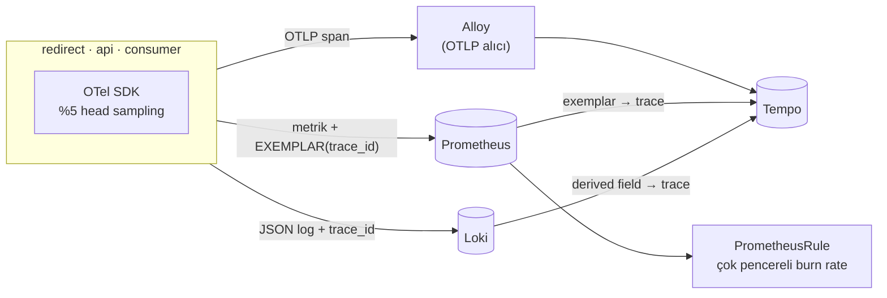

# 11 — observability-deep · "Neden yavaş?"

## 1. Bu seviye ne?

10 seviye boyunca metrik topladık ve her seferinde aynı duvara çarptık: *"p99 yüksek — ama nerede?"*
Bu seviye o soruyu cevaplanabilir kılıyor. Dört ayak bir araya geliyor: **metrik** (ne kadar),
**trace** (nerede), **log** (neden) ve **profil** (hangi satır) — ve hepsini birbirine bağlayan
tek bir kimlik: `trace_id`. Ayrıca alarmlar eşiklerden **hata bütçesine** taşınıyor.

## 2. Mimari



Kritik nokta: **korelasyon araçların bir özelliği değil, koddaki bir disiplindir.** Exemplar'ı
histograma iliştiren, `trace_id`'yi her log satırına koyan ve bağlamı Kafka header'ına yazan kod.

## 3. Önceki seviyeden çözülenler

| ID | Sorun | Nasıl çözüldü |
|---|---|---|
| P10-03 | Timeout hizasızlığı: nerede beklendiği görünmüyordu | Trace, isteğin her adımını (handler → guard → DB/Redis/Kafka) ayrı span olarak gösteriyor; bütçenin hangi katmanda tükendiği artık ölçülebilir |

Tek madde, ama bu seviyenin asıl kazancı bir sorunu kapatmak değil: **önceki on seviyedeki her
sorunun teşhis süresini kısaltmak.** P02-06, P04-03, P07-03, P10-05 — hepsi bir trace'le
dakikalar yerine saniyeler içinde bulunur.

## 4. Ayağa kaldırma

Platform: `cd platform && make minimal && make keda && make cnpg && make chaos && make tempo`.

```bash
make up            # build → push → deploy → rollout wait → smoke
curl -s -XPOST http://lvl11.localtest.me/api/links -H 'Content-Type: application/json' -d '{"url":"https://example.com"}'
curl -I http://lvl11.localtest.me/<code>
make grafana       # Ladder klasörü, level=lvl11
make load S=mixed  # aynı senaryolar her seviyede: create redirect mixed hot-key burst abuser read-your-writes stairs scan
make down
```

Trace'e bakmak için: Grafana → Explore → Tempo (ya da `kubectl -n monitoring port-forward svc/tempo 3200:3200`).

## 5. API

Her seviyede aynı: [docs/API.md](../docs/API.md). Dışarıdan değişiklik yok; yalnızca gelen
`traceparent` header'ı artık **onurlandırılıyor** (client bir trace başlattıysa ona bağlanıyoruz).

## 6. Reproduce edilebilir sorunlar

| ID | Sorun | Reproduce | Grafana'da | Çözüm |
|---|---|---|---|---|
| P11-01 | "p99 yüksek — nerede?" | `make repro P=P11-01` | App RED → exemplar → Tempo | seviye içi |
| P11-02 | **TRAP** trace kuyrukta kopuyor | `make repro P=P11-02` | Explore → Tempo | seviye içi |
| P11-03 | Sampling: maliyet ↔ kapsama | `make repro P=P11-03` | Alloy CPU/bellek | tail sampling (tartışma) |
| P11-04 | Eşik alarmı vs burn rate | `make repro P=P11-04` | SLO → burn rate, alarmlar | seviye içi |
| P11-05 | Debug log Loki'yi limitler | `make repro P=P11-05` | Loki ingest | seviye içi |
| P11-06 | **TRAP** tenant label'ı → kardinalite | `make repro P=P11-06` | seri sayısı | seviye içi |
| P11-07 | Dashboard drift'i | `make repro P=P11-07` | Ladder klasörü | seviye içi (kod) |
| P11-08 | **TRAP** profilsiz görünmeyen hot spot | `make repro P=P11-08` | Pods → CPU | profil (14) |

---

### P11-01 · "p99 yüksek — nerede?"

**Belirti:** Gecikme yükseliyor; metrik bunu gösteriyor ama **hangi bağımlılık** olduğunu söylemiyor.
**Neden:** Metrikler toplamdır. Tek bir isteğin içinde neyin ne kadar sürdüğünü ancak trace bilir.
[Topic · Konu: Metrik/trace/log korelasyonu]

**Reproduce:** `make repro P=P11-01` — gizli bir gecikme enjekte eder (hangi bağımlılık olduğunu
söylemeden), önce metrikle tahmin ettirir, sonra exemplar'dan trace'e atlar.

**Grafana:** `02 · App RED` → "latency p99" üzerindeki **exemplar noktaları**; tıkla → Tempo.
**Zincir:** metrik **ölçer** → exemplar **işaret eder** → trace **açıklar** → log **kanıtlar**.
Her adım bir öncekinin bıraktığı soruyu cevaplıyor.

---

### P11-02 · TRAP · Trace asenkron sınırda kopuyor

**Belirti:** Redirect trace'i producer'da bitiyor; tüketici span'leri ayrı, **yetim** trace'ler
olarak görünüyor.
**Neden:** HTTP'de bağlam otomatik taşınır (`traceparent`). Kuyrukta taşınmaz — **sen koymazsan**.
[Topic · Konu: Bağlam yayılımı]

**Reproduce:** `make repro P=P11-02` — propagation açık/kapalı Tempo'daki trace yapısını karşılaştırır.

**Ders:** *Bağlam yayılımı bir kütüphane ayarı değil, bir sözleşmedir.* HTTP'de header, Kafka'da
message header, cron'da ise hiçbir yerde — asenkron sınırları kendin bağlarsın. Ve tam da asenkron
yaptığın için görünmez olan yer, en çok trace gereken yerdir.

---

### P11-03 · Sampling: maliyet ile kapsama arasındaki takas

**Belirti:** %100 sampling collector'ın CPU ve belleğini katlar; %5 ise nadir hataları kaçırır.
**Neden:** Head sampling kararı trace'in **başında** verilir — yavaş mı, hatalı mı bilinmeden.
[Topic · Konu: Sampling stratejileri]

**Reproduce:** `make repro P=P11-03` — %5 ve %100 ile Alloy'un CPU/bellek tepesini karşılaştırır.

**Ders:** Teşhis için gereken "tüm trace'ler" değil, **doğru trace**. Exemplar zaten yavaş bir
isteği işaret ettiği için %5 yeterlidir. Head sampling'in gerçek zayıflığı nadir **hatalardır**;
çözümü tail sampling'dir ve bedeli collector'da her span'i tamponlamaktır.

---

### P11-04 · Eşik alarmı vs burn-rate alarmı

**Belirti:** 30 saniyelik bir sıçrama: eşik alarmı çalar (ve seni uyandırır), burn-rate susar.
Günlerce süren %0.2'lik kanama: eşik susar, burn-rate ticket açar.
**Neden:** SLO bir hedef değil, harcamana izin verilen bir **bütçedir**. Alarm, bütçenin **tükenme
hızına** bakmalı. [Topic · Konu: SLO, error budget, burn rate]

**Reproduce:** `make repro P=P11-04` — kısa bir hata sıçraması üretip hangi alarmların ateşlediğini
karşılaştırır (`deploy/slo.yaml` içinde bilerek bir de **naive eşik alarmı** var).

**Grafana:** `12 · SLO` → "burn rate 1h/6h", "error budget remaining", "Alarmlar".
**Neden iki pencere?** Uzun pencere *"yeterince büyük mü?"*, kısa pencere *"hâlâ oluyor mu?"* diye
sorar. Kısa olmadan alarm düzeldikten sonra da çalar; uzun olmadan her blip'te çalar.
*Alarm yorgunluğu bir insan sorunu değil, bir matematik seçimi sorunudur.*
Kurallar **elle yazıldı** (Sloth kullanılmadı) — çünkü aritmetiğin kendisi dersin ta kendisi.

---

### P11-05 · Gözlemlenebilirliğin de bir kapasitesi vardır

**Belirti:** "Sorun var, log seviyesini debug yapalım" → Loki limitine takılır → **araştırdığın
loglar kaybolur.**
**Neden:** Log boru hattı sonsuz değil (`ingestion_rate_mb: 8`).
[Topic · Konu: Gözlemlenebilirlik kapasitesi]

**Reproduce:** `make repro P=P11-05` — info ve debug seviyelerinde log hacmini ve Loki reddini ölçer.

**Ders:** *Teşhis araçların, teşhis ettiğin olay sırasında çalışmaya devam etmeli.*
Araçlar: çalışırken seviye değiştirebilmek · log **sampling** · yüksek hacimli detayı log'dan
**trace'e** taşımak (tek istek detayı log'un değil trace'in işidir).

---

### P11-06 · TRAP · Kardinalite, üçüncü kez

**Belirti:** `tenant` label'ı açılınca seri sayısı tenant sayısıyla birlikte büyür.
**Neden:** P01-06'nın (kısa kod label'ı) daha makul görünen kılığı. *Kardinalite, bir label'ın
değer sayısı kadar büyür ve bu sayı genelde **iş büyüdükçe** artar.* [Topic · Konu: Kardinalite]

**Reproduce:** `make repro P=P11-06` — 500 farklı tenant'tan istek gönderip seri artışını ölçer.

**"Tenant'a göre görmek istiyorum" meşru bir istektir; cevabı metrik değildir:**
en çok trafik üreten 10 tenant → log/analitik sorgusu · tek bir yavaş istek → **exemplar + trace**
(kardinalite ödemeden) · faturalama → veritabanı.

---

### P11-07 · Dashboard drift'i

**Belirti:** Grafana'da elle yapılan bir düzeltme hiçbir yerde kayıtlı değildir ve bir sonraki
`make dashboards` onu siler.
**Neden:** Dashboard'lar kod değilse, gözlemlenebilirliğin sürüm kontrolü yok demektir.
[Topic · Konu: Dashboards as code]

**Reproduce:** `make repro P=P11-07` — API üzerinden değiştirmeyi dener, sonra kaynaktan yeniden
uygulayıp drift'in kaybolduğunu gösterir.

**Bedeli:** bir paneli düzeltmek 30 saniye yerine 3 dakika. **Kazancı:** gözden geçirilebilir,
geri alınabilir ve yeniden üretilebilir gözlemlenebilirlik. Aynı fikir 12'de uygulamaya uygulanıyor.

---

### P11-08 · TRAP · Profilsiz görünmeyen hot spot

**Belirti:** İstek başına CPU artıyor, p99 hafif yükseliyor — ve hiçbir metrik *"regex derleniyor"*
demiyor.
**Neden:** Metrikler **ne kadar**, trace **nerede**, log **neden** der. *"Hangi satır"* sorusunun
cevabı profildir. [Topic · Konu: Sürekli profil]

**Reproduce:** `make repro P=P11-08` — `TRAP_REGEX_PER_REQUEST` açık/kapalı **istek başına CPU**'yu
karşılaştırır.

**Araçlar:** `net/http/pprof` + `go tool pprof`; üretimde sürekli profil (Pyroscope).
*"Dün gece CPU neden yükseldi?" sorusunun cevabı, o gece profil toplanmadıysa kaybolur.*
Bu merdivende Pyroscope kaynak nedeniyle opsiyonel — 14'te kapasite modeliyle birlikte.

## 7. Seviye içi alıştırmalar (TRAP_ bayrakları)

| Bayrak | Ne yapar | Reproduce | Düzeltme |
|---|---|---|---|
| `TRAP_NO_KAFKA_PROPAGATION` | Bağlamı Kafka header'ına koymaz | `make repro P=P11-02` | Bayrağı kapat |
| `TRAP_TENANT_LABEL` | tenant'ı metrik label'ı yapar | `make repro P=P11-06` | Bayrağı kapat |
| `TRAP_REGEX_PER_REQUEST` | İstek başına regex derler | `make repro P=P11-08` | Bayrağı kapat |
| `TRACE_SAMPLE_PCT` / `LOG_LEVEL` | Tuzak değil, **ayar düğmesi** | P11-03 / P11-05 | Ölç, sonra karar ver |

Elle denemeye değer:
- Bir trace'i Grafana'da aç ve span'leri say: redirect → guard → cache → DB → producer → consumer.
  Toplam süre ile span sürelerinin toplamı arasındaki fark **beklemedir** (kuyruk, havuz, GC).
- `TRACE_SAMPLE_PCT=100` + `make load S=stairs` ile Alloy'u zorla: gözlemlenebilirlik yığınının
  kendi SLO'su olmalı mı? (Cevap: evet, ve 14'teki game day'de test edilir.)
- `deploy/slo.yaml`'daki `objective`'i 99.99 yap: hata bütçesi 43 dakikadan 4 dakikaya iner ve
  aynı hata oranı artık **page** üretir. *SLO'yu sıkılaştırmak bir hedef değişikliği değil, bir
  NÖBET YÜKÜ değişikliğidir.*
- Loki'de `{namespace="lvl11"} | json | trace_id != ""` sorgusuyla bir trace_id bul, Tempo'ya
  yapıştır: log → trace geçişini elle yap, sonra derived field'ın aynısını tek tıkla yaptığını gör.

## 8. Gözlemlenebilirlik: hangi paneller dolu, hangileri boş

| Dashboard | Durum | Neden |
|---|---|---|
| `12 · SLO` | **Dolu** ✨ | SLI kayıt kuralları, burn rate, kalan bütçe, alarm timeline |
| `02 · App RED` | **Zenginleşti** | Histogramlarda exemplar noktaları — tıklayınca Tempo |
| `11 · Resilience` · `05 · Postgres` · `08 · Stream` | Dolu | Trace'ler bunların hikâyesini birleştiriyor |
| `13 · Rollout` | Boş | 12'de |

Yeni araçlar dashboard değil: **Explore → Tempo** (trace arama) ve **Explore → Loki** (derived
field ile trace'e link). Bu seviyeden itibaren teşhis, tek bir panele bakmak değil **üç aracı
zincirlemek**.

## 9. Bilerek bırakılanlar

- **Tail sampling yok** — head sampling %5 (P11-03'te gerekçesi ölçülüyor).
- **Sürekli profil (Pyroscope) yok** — kaynak nedeniyle; `net/http/pprof` de eklenmedi (P11-08).
- **Alertmanager hedefi yok**: alarmlar ateşliyor ama kimseye gitmiyor. Yönlendirme/susturma
  politikası bilinçli olarak kapsam dışı — *alarmın nereye gittiği bir organizasyon kararıdır.*
- **Tek SLO ailesi** (redirect availability + latency). api-svc ve consumer için SLO yok:
  *her servis için SLO yazmak, her servisi eşit önemli ilan etmektir — ve bu genelde yanlıştır.*
- **Span metrikleri (RED from traces) kapalı** — Tempo metrics-generator kaynak yiyor.
- **Log sampling yok** (P11-05'in azaltması).
- **10'dan devreden**: statement_timeout, tek Redis, kimlik yok.

## 10. `make diff-prev` okuma rehberi

`make diff-prev` 10 ile farkı gösterir:

1. **`internal/tracing/tracing.go`** (yeni): kurulum 40 satır. Asıl içerik yorumlardaki
   **sampling kararı** — neden %5, neden head, tail'in bedeli ne.
2. **`internal/metrics` → `ObserveDurationWithExemplar`**: 10 satır. Exemplar, trace ID'yi bir
   **label yapmadan** örneğe iliştiriyor — P01-06/P11-06'nın cevabı tam olarak bu.
3. **`internal/httpapi/middleware.go`**: her log satırına `trace_id`, her histograma exemplar.
   *İki satır kod, üç aracı birbirine bağlıyor.*
4. **`internal/stream/producer.go` + `consumer.go`**: `kafkaHeaderCarrier`. Trace'in kuyruktan
   geçmesi otomatik değil — 30 satır elle taşıma.
5. **`deploy/slo.yaml`** (yeni): burn-rate matematiği **elle** yazıldı. İçinde bilerek bir de
   *kötü* alarm var (`LinklyNaiveErrorRateThreshold`) — iki yaklaşımı aynı olayda yan yana görmek için.
6. **`cmd/*/main.go`**: tracing kurulamazsa uygulama **durmuyor**, uyarıp devam ediyor.
   *Gözlemlenebilirlik, gözlemlediği şeyi düşürmemeli.*
