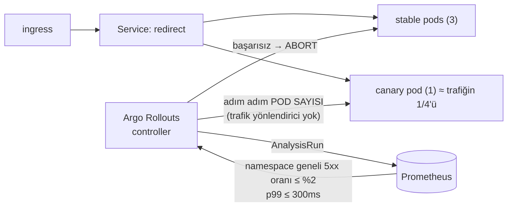

# 12 — delivery · "Güvenli dağıtım"

> **Bu seviyede ne yaşayacaksın?**
> - Kötü bir sürümün canary'de — 4 pod'dan birindeyken, trafiğin ~1/4'ünde — Prometheus analiziyle yakalanıp otomatik geri alınması (P12-01)
> - Tuzak: eski kodu kıran bir migration (P12-02); elle yapılan bir değişikliğin (drift) kimseye görünmemesi (P12-03)
> - `:latest` etiketin belirsiz ve geri alınamaz olması (P12-04); canary ile stable'ın aynı Redis'e farklı formatta yazması (P12-05)
> - Uygulama geri alınınca şemanın geri alınmaması ve expand/contract'ın bunu nasıl önlediği (P12-06)
>
> **Bu seviye olmasa ne olur?** Her dağıtım "pod'ları değiştir ve umut et"tir; kötü bir sürüm trafiğin tamamına ulaşır ve geri alma elle yapılır.
>
> **Yeni gelen teknolojiler:** Argo Rollouts (canary + AnalysisTemplate), Argo CD, expand/contract migration, `13 · Rollout` paneli ([her biri tek cümleyle](../README.md#kullanılan-teknolojiler)).

## 1. Bu seviye ne?

redirect-svc artık bir **Argo Rollout**: yeni sürüm önce tek bir **canary** pod'una (4 pod'dan biri, trafiğin ~1/4'ü)
gider ve adımlar arasında Prometheus'a bakan **otomatik analiz** kötü sürümü geri alır. Yanında şemanın dağıtımla uyumlu
kalması (**expand/contract**) ve kümenin manifest'ten sapması (**drift**) soruları var.

## 2. Mimari



Kararı bir makine verir: analiz 30–60 sn'de karar verir. Trafik yönlendirici olmadığı için `setWeight: 10` pod sayısıyla
yaklaşık tutulur (3 stable + 1 canary, Service trafiği 4 pod'a eşit böler); sayılar bu yüzden "%10" değil "~%25".

## 3. Önceki seviyeden çözülenler

**Hiçbiri** — `problems/SOLVES` gerekçesini yazar: 12 canary ve GitOps getirir, 11'in sorunlarından birini kaldırmaz.
P11-07'nin (dashboard drift'i) disiplini uygulamaya genişler: manifest'ler kaynakta, elle yapılan değişiklik kalıcı olamaz (P12-03).

## 4. Ayağa kaldırma

İlk kez mi? Önce kök README'deki [Sıfırdan başlangıç](../README.md#sıfırdan-başlangıç): platform bir kez kurulur ve
`LADDER` (repo kökü) tanımlanır. Her komut bloğu `cd "$LADDER/…"` ile başlar; olduğu gibi yapıştır.
Bu seviyenin platformdan istediği: **temel yığın (kind, ingress, Prometheus, Grafana) + Chaos Mesh, KEDA, CloudNativePG, Argo CD + Argo Rollouts**; `make up` açar.

Hızlı başvuru (komutları tek tek kullan; satır sonu açıklamaları için zsh'da `setopt interactivecomments` gerekir):

```bash
cd "$LADDER/12-delivery"
make up            # profil → Grafana'yı temizle → build → push → deploy → rollout wait → smoke
make link          # example.com'a kısa link oluştur, yönlendirmeyi dene → 302 · başka adres: make link URL=https://…
make grafana       # Ladder klasörü, level=lvl12 — giriş: admin / ladder
make load S=mixed  # aynı senaryolar her seviyede: create redirect mixed hot-key burst abuser read-your-writes stairs scan
make repro P=P12-01   # §6'daki bir sorunu otomatik üret → REPRODUCED / NOT-REPRODUCED
make env           # açık ayar/tuzaklar · değiştir: make set E="KEY=değer" · hepsini geri al: make reset (§7)
make down          # seviyeyi kaldır · kümeyi durdurmak için: cd "$LADDER/platform" && make stop
```

Rollout'u izlemek için (komutları tek tek kullan; sonuncusu yalnızca `kubectl argo rollouts` eklentisi kuruluysa
çalışır, scriptler eklentiye dayanmaz):
```bash
cd "$LADDER/12-delivery"
kubectl -n lvl12 get rollout redirect -w
kubectl -n lvl12 get analysisrun
kubectl argo rollouts get rollout redirect -n lvl12 --watch
```

**Rehber — bu seviyeyi baştan sona, sırayla.**

1. Önceki seviyeyi kapat (aynı anda tek seviye), bu seviyeyi kur. `make up` Grafana'yı da temizler ve redirect
   Rollout'u `Healthy` olana kadar bekler; sonunda `✔ lvl12 ayakta` yazar:
```bash
cd "$LADDER/11-observability-deep"
make down
cd "$LADDER/12-delivery"
make up
```

**Verileri temizleyip sıfırdan koşmak istersen** 1. adımın yerine bunu kullan: bütün seviyelerin verisi
(linkler, veritabanı, önbellek, kuyruk) ve Grafana'nın gösterdiği metrik, trace, log silinir; küme ve kurulum
kalır (~2-3 dk). Ardından bu seviye temiz kurulur. Yalnızca Grafana çizgilerini temizlemek için (veri kalır)
seviye klasöründe `make fresh` yeter; her deneyin ilk komutu zaten bu.
```bash
cd "$LADDER"
make wipe CONFIRM=1
cd "$LADDER/12-delivery"
make up
```
2. 11'in sorunlarını burada koş (koşarken başka komut çalıştırma). 12 bunların hiçbirini çözmez: `BEKLENEN` sütunu her
   satırda `(açık kalabilir)` der:
```bash
cd "$LADDER/12-delivery"
make verify-prev
```
3. §6'daki sorunları sırayla yaşa (P12-01 → P12-06): adımları yapıştır → **Terminalde ne görmelisin** ile
   karşılaştır → **Grafana'da gör** linklerini aç. Redirect bir Argo Rollout: ortamını `make set … W=redirect` /
   `make reset` değiştirir (`kubectl set env` Rollout'ta çalışmaz), ölçeğini
   `kubectl -n lvl12 scale rollout/redirect --replicas=N`, fazını
   `kubectl -n lvl12 get rollout redirect -o jsonpath='{.status.phase}'` söyler.
4. Bitince ayarları geri al, Rollout'un `Healthy` olduğunu gör, seviyeyi kapat:
```bash
cd "$LADDER/12-delivery"
make reset
kubectl -n lvl12 get rollout redirect -o jsonpath='{.status.phase}'; echo
make down
```

## 5. API

Her seviyede aynı: [docs/API.md](../docs/API.md).

Yeni bir operasyonel ayar: `BAD_VERSION_ERROR_PCT` kasıtlı bozuk bir sürüm üretir (varsayılan 0) — dağıtım güvenliğini
sınamak için gerçekten bozuk bir sürüm gerekir.

## 6. Reproduce edilebilir sorunlar

Bu seviyede yaşayacağın 6 sorun. Her birini iki yoldan görebilirsin: **Otomatik** — `make repro P=<ID>` deneyi
kendisi yapar, ölçer ve hükmünü basar (`REPRODUCED` = sorun var · `NOT-REPRODUCED` = yok · `SKIPPED` =
ölçülemedi); **Elle** — adımları sırayla yapıştırıp sonucu kendi gözünle görürsün. Her sorunun bölümü aynı
düzende: **Ne oluyor** → **Neden oluyor** → **Bu deney** → adımlar → **Terminalde ne görmelisin** →
**Grafana'da gör** (giriş: admin / ladder) → **Nasıl çözülüyor**.

**Kısa komut** deneyi otomatik başlatır; seviyenin klasöründe çalıştır (önce `cd "$LADDER/12-delivery"`). Başında
`CONFIRM=1` olanlar yıkıcı bir adım içerir (pod silmek, yeniden başlatmak, arıza enjekte etmek gibi); bu onay
olmadan script o adımı yapmaz ve `SKIPPED` basar.

| ID | Kısa komut | Ne olur? | Neden olur? | Nasıl çözülür? |
|---|---|---|---|---|
| P12-01 | `make repro P=P12-01` | Hatalı bir sürüm dağıtılınca kısa sürede bütün kullanıcılara ulaşır | Klasik dağıtım yalnızca "süreç ayakta mı?"ya bakar, "istekler başarılı mı?"ya bakmaz | **12:** yeni sürüm önce trafiğin ~1/4'üne verilir (canary); hata oranı eşiği aşarsa otomatik geri alınır |
| P12-02 | `CONFIRM=1 make repro P=P12-02` | Yük altında bir sütunun adı değiştirilince çalışan pod'lar link oluşturamaz (503) | Dağıtım sırasında eski kod hâlâ eski sütun adını kullanır; ad değişikliği ona uyumsuz | **12:** genişlet → taşı → daralt (expand/contract): her adım eski kodla da çalışır |
| P12-03 | `make repro P=P12-03` | Kümede elle yapılan bir değişiklik (`kubectl scale`) kayıtsızdır; sonraki dağıtım onu sessizce geri alır | Kaynaktaki manifest ile küme sürekli karşılaştırılmıyor | Argo CD: sürekli karşılaştırma + otomatik düzeltme (kurulu, bu seviyeye bilerek bağlı değil) |
| P12-04 | `make repro P=P12-04` | `:latest` gibi değişebilen bir etiketle hangi sürümün çalıştığı bilinmez, geri almak işe yaramaz | Aynı etiket her yeni imajda başka bir içeriği gösterir | Bu merdivende etiket `<git-sha>-<kaynak-hash>` (deney bunu doğrular) · **13:** Kyverno `:latest`'i yasaklar |
| P12-05 | `make repro P=P12-05` | Yeni sürüm önbellek anahtar biçimini değiştirirse canary ile eski sürüm birbirinin yazdığını bulamaz, sistem önbelleksiz kalır | Canary iki sürümün yan yana çalışabileceğini varsayar; paylaşılan önbellek bu varsayımı kırar | Tartışma: geriye uyumlu biçim, iki biçimi birden okumak ya da canary'ye ayrı önbellek |
| P12-06 | `make repro P=P12-06` | Uygulamayı geri almak veritabanı şemasını geri almaz; şemayı geri almak ise veri kaybettirebilir | Geri alma iki ayrı iştir ve yalnızca uygulamanınki otomatiktir | Disiplin: yalnızca geriye uyumlu şema değişikliği ("N−1 sürümü N şemasıyla çalışır") |

---

### P12-01 · Kötü sürüm canary'de yakalanıyor

**Ne oluyor:** Hatalı bir sürüm klasik dağıtımla (rolling update) çıkınca kısa sürede bütün kullanıcılara ulaşır.
Burada redirect'lerin %25'inde hata veren bir sürüm dağıtılıyor; soru, bu sürümün herkese ulaşmadan durdurulup
durdurulmadığı.
**Neden oluyor:** Klasik dağıtım yeni sürümü sağlık kontrollerinden (probe) geçtiği sürece yayar; probe'lar "süreç
ayakta mı?" diye sorar, "istekler başarılı mı?" diye sormaz. Bu seviyede yeni sürüm önce küçük bir paya verilir
(canary: 1 yeni + 3 eski pod ≈ trafiğin 1/4'ü) ve otomatik analiz 30 sn sonra bütün redirect trafiğinin 5xx oranını
%2 eşiğiyle karşılaştırır — canary'nin kendi %25'ini değil, toplamdaki ~%6'yı (%25 × 1/4) görür.
**Bu deney:** Yük altındayken `BAD_VERSION_ERROR_PCT=25` ile yeni sürüm dağıtır; dağıtımın aşamasını, canary payını ve
hata oranlarını izler, analizin metrikle mi yoksa altyapı hatasıyla mı durduğunu ayırır, sonunda kötü sürümü geri alır.

**Reproduce (adım adım):** Otomatik: `make repro P=P12-01` (yük altında `BAD_VERSION_ERROR_PCT=25` ile dağıtır; fazı,
canary payını, canary'nin ve toplamın hata oranını basar; analizin metrikle mi altyapı hatasıyla mı durduğunu ayırır,
sonunda kötü sürümü geri alır). Elle:

1. Temiz başla; mevcut sürüm sağlıklı mı, stable pod şablonu hash'i ne:
```bash
cd "$LADDER/12-delivery"
make fresh
kubectl -n lvl12 get rollout redirect -o custom-columns=AŞAMA:.status.phase,HAZIR:.status.readyReplicas,GÜNCEL:.status.updatedReplicas
kubectl -n lvl12 get rollout redirect -o jsonpath='{.status.stableRS}'; echo
```
2. İkinci bir terminalde 3 dk yük başlat (analiz ancak trafik varken bir şey ölçer):
```bash
cd "$LADDER/12-delivery"
make load S=redirect K6_ARGS="--vus 15 --duration 180s"
```
3. Yük başladıktan ~15 sn sonra ilk terminalde kötü sürümü dağıt (3 stable pod'un yanına 1 canary eklenir) ve fazı 4 sn'de
   bir bas; `Degraded` görünce döngü durur:
```bash
cd "$LADDER/12-delivery"
make set E="BAD_VERSION_ERROR_PCT=25" W=redirect
for i in $(seq 1 45); do p=$(kubectl -n lvl12 get rollout redirect -o jsonpath='{.status.phase}'); echo "$((i*4)) sn: $p"; if [ "$p" = Degraded ]; then break; fi; sleep 4; done
```
4. Analizin kararını ve gerekçesini oku, canary süresince toplam 5xx oranının tepesine bak:
```bash
cd "$LADDER/12-delivery"
kubectl -n lvl12 get analysisrun
kubectl -n lvl12 get rollout redirect -o jsonpath='{.status.message}'; echo
curl -s 'http://prometheus.localtest.me/api/v1/query' --data-urlencode 'query=max_over_time((sum(rate(http_requests_total{namespace="lvl12",route="/{code}",code=~"5.."}[30s])) / sum(rate(http_requests_total{namespace="lvl12",route="/{code}"}[30s])))[5m:10s])' | jq -r '"toplam 5xx oranı (tepe): " + .data.result[0].value[1]'
```
5. Yük bitince (özet satırı `k6 lvl12: …`) kötü sürümü geri al ve fazın `Healthy`'ye döndüğünü gör:
```bash
cd "$LADDER/12-delivery"
make reset
sleep 10
kubectl -n lvl12 get rollout redirect -o jsonpath='{.status.phase}'; echo
```

**Terminalde ne görmelisin:** 1. adımda `Healthy 3 3` ve kısa bir hex hash. 3. adımda
`✔ rollout/redirect: BAD_VERSION_ERROR_PCT=25`, döngü önce `… sn: Progressing`, 30–60 sn sonra `… sn: Degraded`: kötü
sürüm canary'deyken durduruldu. `get analysisrun`'da en yeni koşu `Failed`, rollout mesajı `error-rate` metriğinin
başarısız olduğunu söyler (mesajda `unreachable` / `dial tcp` varsa analiz metrik okuyamadan düşmüştür — kötü sürümün
yakalandığı anlamına gelmez). Toplam 5xx tepesi ~`0.06`; özet satırındaki oran daha da düşük (kötü sürüm yalnızca abort'a
kadar trafikteydi). 5. adımdan sonra `Healthy`.

**Grafana'da gör:** [`13 · Rollout`](http://grafana.localtest.me/d/ladder-rollout?var-level=lvl12&from=now-30m&to=now&refresh=10s) ve [`02 · App RED`](http://grafana.localtest.me/d/ladder-app-red?var-level=lvl12&from=now-30m&to=now&refresh=10s) — deney başlayınca aç; kötü sürüm ~15 sn sonra, karar 30–60 sn içinde
- "İstek / sn (sürüme göre)" → her çizgi bir pod şablonu hash'i: canary başlayınca yeni bir hash belirir ve toplamın ~1/4'ünü alır, abort'tan sonra kaybolur (stable hash: `kubectl -n lvl12 get rollout redirect -o jsonpath='{.status.stableRS}'`).
- "Hata oranı (sürüme göre)" → canary hash'i ~%25'e çıkar, stable 0'da kalır; analizin karar verdiği sayı bu değil, toplam.
- "Sunucu hatası oranı (5xx)" → canary süresince ~%6, abort'la sıfır: analizin %2 eşiğiyle karşılaştırdığı namespace geneli oran.
- "p99 süre (sürüme göre)" → iki hash yakın: kötü sürüm hızlı hata veriyor, gecikme analizi geçer; abort'u hata oranı tetikler.
- "Hazır pod (sürüme göre)" → yeni hash 1 pod'la belirir, stable 3'te kalır; abort'tan sonra yeni hash kaybolur.
- "İstek / saniye (durum koduna göre)" → `302`'nin yanında kısa ömürlü bir `500` çizgisi: kötü sürümün hatası.

**Nasıl çözülüyor:** Bu seviyede Argo Rollouts canary + otomatik analiz yapar: hata oranı eşiği aşınca dağıtım durdurulur (abort) ve eski sürüme dönülür; kötü sürüm trafiğin yalnızca ~1/4'ünü, yalnızca birkaç dakika görür. Bedeli her dağıtımın birkaç dakika sürmesi; analiz ilk 30 sn'yi bekler (henüz veri yokken karar vermesin, `initialDelay`) ve tek bir gürültülü ölçümle sağlıklı sürümü geri almaz (`failureLimit`).

---

### P12-02 · Kırıcı migration

**Ne oluyor:** Yük altındayken veritabanında bir sütunun adı değiştirilince (`RENAME COLUMN`) çalışan pod'lar link
oluşturamaz ve kullanıcılar 503 alır. Tek bir şema değişikliği kesinti yaratır.
**Neden oluyor:** Dağıtım sırasında eski ve yeni kod bir süre birlikte çalışır; eski kod hâlâ eski sütun adını
kullanır. Bu yüzden her şema değişikliği hem eski hem yeni kodla uyumlu olmak zorundadır — ad değiştirmek uyumlu değildir.
**Bu deney:** Yük altındayken primary veritabanında sütunun adını `psql` ile değiştirir, oluşturma isteklerinin hata
verdiği pencereyi ölçer, sonra sütunu eski adına döndürür (`CONFIRM=1`: şemaya dokunan yıkıcı deney onayı).

**Reproduce (adım adım):** Otomatik: `CONFIRM=1 make repro P=P12-02` (yük altında primary'de `psql` ile
`ALTER TABLE links RENAME COLUMN url TO url_old` koşar, hata penceresini ölçer, sütunu eski adına döndürür; `CONFIRM=1`
şemaya dokunan yıkıcı deney onayı). Elle — **dikkat:** 3. adım canlı şemayı bozar, 4. adımı atlama (atlanırsa her link
oluşturma `503` dönmeye devam eder):

1. Temiz başla; Postgres primary pod'unu bul, `links` tablosunun sütunlarına bak:
```bash
cd "$LADDER/12-delivery"
make fresh
prim=$(kubectl -n lvl12 get pod -l cnpg.io/cluster=pg,cnpg.io/instanceRole=primary -o json | jq -r '[.items[] | select(.metadata.deletionTimestamp == null) | select(any(.status.containerStatuses[]?; .ready)) | .metadata.name][0] // empty'); echo "primary: $prim"
kubectl -n lvl12 exec "$prim" -c postgres -- psql -U postgres -d linkly -tAc "SELECT string_agg(column_name, ', ' ORDER BY ordinal_position) FROM information_schema.columns WHERE table_name='links'"
```
2. İkinci bir terminalde 90 sn karışık yük (okuma + oluşturma) başlat:
```bash
cd "$LADDER/12-delivery"
make load S=mixed K6_ARGS="--vus 15 --duration 90s"
```
3. Yük başladıktan ~15 sn sonra ilk terminalde kırıcı migration'ı uygula, bir link oluşturmayı dene, ~20 sn sonra DB hatalarını oku:
```bash
cd "$LADDER/12-delivery"
kubectl -n lvl12 exec "$prim" -c postgres -- psql -U postgres -d linkly -tAc 'ALTER TABLE links RENAME COLUMN url TO url_old'
curl -s -XPOST http://lvl12.localtest.me/api/links -H 'Content-Type: application/json' -d '{"url":"https://example.com/p1202"}' -w ' → %{http_code}\n'
sleep 20
curl -s 'http://prometheus.localtest.me/api/v1/query' --data-urlencode 'query=sum by (op) (increase(db_queries_total{namespace="lvl12",result="error"}[3m]))' | jq -r '.data.result[] | "\(.metric.op): \(.value[1])"'
```
4. Geri al: sütunu eski adına döndür, şemaya ve oluşturmaya tekrar bak:
```bash
cd "$LADDER/12-delivery"
kubectl -n lvl12 exec "$prim" -c postgres -- psql -U postgres -d linkly -tAc 'ALTER TABLE links RENAME COLUMN url_old TO url'
kubectl -n lvl12 exec "$prim" -c postgres -- psql -U postgres -d linkly -tAc "SELECT string_agg(column_name, ', ' ORDER BY ordinal_position) FROM information_schema.columns WHERE table_name='links'"
curl -s -XPOST http://lvl12.localtest.me/api/links -H 'Content-Type: application/json' -d '{"url":"https://example.com/p1202"}' -w ' → %{http_code}\n'
```

**Terminalde ne görmelisin:** 1. adımda hem `url` hem `target_url` var (expand uygulanmış). 3. adımda `ALTER TABLE`,
ardından oluşturma `{"error":"store_error",…} → 503`: çalışan pod'lar hâlâ `url` sütununa yazıyor. DB hataları `create`
ve `get` için sıfırdan büyük; yük özetinde `5xx` > 0. 4. adımdan sonra yine `url`, oluşturma `{"code":"…",…} → 201`.

**Grafana'da gör:** [`02 · App RED`](http://grafana.localtest.me/d/ladder-app-red?var-level=lvl12&from=now-15m&to=now&refresh=10s) ve [`03 · App Business`](http://grafana.localtest.me/d/ladder-app-business?var-level=lvl12&from=now-15m&to=now&refresh=10s) — sütun yeniden adlandırılınca aç; kırık pencere ~25 sn
- "İstek / saniye (durum koduna göre)" → pencere boyunca bir `503` çizgisi; sütun geri dönünce kaybolur.
- "5xx (uç noktaya göre)" → hata çoğunlukla `/api/links`'te; önbellekte olmayan `/{code}` okumaları da düşer.
- "Oluşturma sonuçları" → pencere boyunca `ok`'un yerini `error` alır.
- Explore'da: `sum by (op) (rate(db_queries_total{namespace="lvl12",result="error"}[1m]))` → `create` ve `get` için aynı pencerede tepe.

**Nasıl çözülüyor:** Bu seviyede şema değişikliği üç ayrı dağıtımla yapılır (expand/contract, `migrations/006_expand.sql`): **genişlet** (yeni sütunu ekle, ikisine de yaz) → **taşı** (eski veriyi kopyala, okumayı yeniye çevir) → **daralt** (eskiye yazmayı bırak, sonra sil). Her adımda eski ve yeni kod birlikte çalışabilir ve her adım ayrı geri alınabilir.

---

### P12-03 · Drift: elle yapılan değişiklik

**Ne oluyor:** Kümede elle yapılan bir değişiklik (ör. `kubectl scale` ile replika sayısını 5'e çıkarmak) çalışır ama
hiçbir yerde kaydı yoktur ve bir sonraki dağıtım onu sessizce geri alır. Kimin, neden yaptığı bilinmez.
**Neden oluyor:** İstenen durum kaynaktaki manifest'lerde, gerçek durum kümede. İkisini sürekli karşılaştıran bir şey
yoksa aradaki sapma (drift) görünmez.
**Bu deney:** Argo CD'nin bu seviyeyi yönetip yönetmediğine bakar, Rollout'u elle 5 replikaya çıkarıp ~65 sn tutar,
sonra manifest'teki sayıyı yeniden uygulayıp değişikliğin iz bırakmadan kaybolduğunu gösterir.

**Reproduce (adım adım):** Otomatik: `make repro P=P12-03` (Argo CD bu namespace'i yönetiyor mu bakar, Rollout'u elle 5
replikaya çıkarıp ~65 sn tutar, sonra manifest'teki replika sayısını yamalayıp drift'in sessizce kaybolduğunu gösterir). Elle:

1. Temiz başla; Argo CD'nin bir Application'ı var mı, manifest ve küme kaç replika diyor:
```bash
cd "$LADDER/12-delivery"
make fresh
kubectl -n argocd get applications
kubectl kustomize deploy | awk '/^kind: Rollout$/{r=1} r&&/^  replicas:/{print $2; exit}'
kubectl -n lvl12 get rollout redirect -o jsonpath='{.spec.replicas}'; echo
```
2. İkinci bir terminalde Rollout'u izle, açık bırak:
```bash
cd "$LADDER/12-delivery"
kubectl -n lvl12 get rollout redirect -w
```
3. İlk terminalde drift üret: elle 5 replikaya çık, ~65 sn tut:
```bash
cd "$LADDER/12-delivery"
kubectl -n lvl12 scale rollout/redirect --replicas=5
sleep 65
kubectl -n lvl12 get rollout redirect -o jsonpath='{.spec.replicas}'; echo
```
4. Manifest'teki değeri yeniden uygula — drift sessizce kaybolur (sonra izlemeyi Ctrl+C ile durdur):
```bash
cd "$LADDER/12-delivery"
kubectl -n lvl12 patch rollout/redirect --type=merge -p '{"spec":{"replicas":3}}'
sleep 8
kubectl -n lvl12 get rollout redirect -o jsonpath='{.spec.replicas}'; echo
```

**Terminalde ne görmelisin:** 1. adımda `No resources found in argocd namespace.` (kümeyi manifest'le karşılaştıran kimse
yok), sonra `3` ve `3`. 3. adımdan sonra küme `5`, manifest hâlâ `3`; izlemede `DESIRED` 3 → 5. 4. adımdan sonra yine
`3`, izlemede 5 → 3: değişiklik de geri alınması da hiçbir yerde kayıt bırakmadı.

**Grafana'da gör:** Grafana'da görünmez — drift bir metrik değil, manifest ile kümenin farkı; bu seviyede o farkı ölçen yok (Argo CD kurulu ama lvl12 için Application tanımlı değil). `13 · Rollout` → "Hazır pod (sürüme göre)" 3 → 5 → 3 basamağını çizer ama bunun bir sapma olduğunu, kimin yaptığını göstermez. Kanıt terminalde:
- `kubectl -n lvl12 get rollout redirect -w` (ikinci terminalde) → `DESIRED` 3 → 5 → 3; kaydı kalmaz.
- `kubectl -n argocd get applications` → `No resources found`: sürekli karşılaştıran bir şey yok.

**Nasıl çözülüyor:** Çözüm Argo CD (GitOps): kümeyi kaynakla sürekli karşılaştırır, hangi kaynağın neden farklı olduğunu gösterir ve istenirse farkı otomatik düzeltir (self-heal). Kurulu, ama bu seviyenin uygulaması ona bilerek bağlanmamış — sorunun görülebilmesi için.

---

### P12-04 · `:latest` = belirsiz ve geri alınamaz sürüm

**Ne oluyor:** `:latest` gibi değişebilen bir imaj etiketiyle "hangi sürüm çalışıyor?" sorusunun cevabı yoktur ve
önceki sürüme dönmek hiçbir şeyi değiştirmez — iki sürüm de aynı etiketi taşır. Bu merdivende böyle bir etiket
kullanılmıyor; deney bunu doğrular.
**Neden oluyor:** Değişebilen etiket her yeni imajla başka bir içeriği gösterir; "dağıttım ama değişmedi" ve "geri
aldım ama değişmedi" sorunları buradan çıkar. Bu merdivende her etiket `<git-sha>-<kaynak-hash>`: kaynak değişmezse
etiket de değişmez.
**Bu deney:** Çalışan imaj etiketlerini listeler, `:latest` kullanan imajları sayar ve ReplicaSet geçmişinden önceki
sürümlere dönülebildiğini gösterir.

**Reproduce (adım adım):** Otomatik: `make repro P=P12-04` (çalışan etiketleri listeler, ReplicaSet geçmişinden geri
dönülebilirliği gösterir; hüküm `:latest` kullanan imaj sayısına bakar — bu merdivende `NOT-REPRODUCED` beklenir). Elle
(yük yok; durum incelemesi):

1. Temiz başla; redirect pod'larının imaj etiketleri ve kaçının `:latest` olduğu:
```bash
cd "$LADDER/12-delivery"
make fresh
kubectl -n lvl12 get pods -l app.kubernetes.io/name=redirect -o jsonpath='{range .items[*]}{.spec.containers[0].image}{"\n"}{end}' | sort -u
kubectl -n lvl12 get pods -l app.kubernetes.io/name=redirect -o jsonpath='{range .items[*]}{.spec.containers[0].image}{"\n"}{end}' | grep -c ':latest'
```
2. Etiketin nasıl üretildiği:
```bash
cd "$LADDER/12-delivery"
grep -nE '^(SHA|SRCHASH|TAG) ' ../ladder.mk
```
3. Geri dönülebilirlik: ReplicaSet geçmişi (eskiden yeniye) ve imajları:
```bash
cd "$LADDER/12-delivery"
kubectl -n lvl12 get replicaset -l app.kubernetes.io/name=redirect --sort-by=.metadata.creationTimestamp -o jsonpath='{range .items[*]}{.metadata.name}{" → "}{.spec.template.spec.containers[0].image}{"\n"}{end}'
```

**Terminalde ne görmelisin:** 1. adımda tek satır `localhost:5001/linkly-ladder/12-redirect-svc:<git-sha>-<kaynak-hash>`
(git deposu yoksa `dev-<kaynak-hash>`), sonra `0`. 2. adımda `TAG` `$(SHA)-$(SRCHASH)`: kaynak değişmezse etiket de
değişmez. 3. adımda en fazla 4 `redirect-<hash> → …:<etiket>` satırı (güncel + `revisionHistoryLimit: 3`). P12-01'i
koştuysan aynı imajlı ikinci bir ReplicaSet görürsün (fark yalnızca ortam değişkeni). `:latest` olsaydı bütün satırlar
aynı etiketi gösterir, geri alma hiçbir şey değiştirmezdi.

**Grafana'da gör:** [`13 · Rollout`](http://grafana.localtest.me/d/ladder-rollout?var-level=lvl12&from=now-15m&to=now&refresh=10s) — istediğin an aç; bu bir yük değil, bir durum
- "İstek / sn (sürüme göre)" → tek hash çizgisi: tek ReplicaSet çalışıyor. `:latest` ile yeni imaj itilseydi pod şablonu değişmez, yeni hash ve rollout olmazdı.
- Explore'da: `count by (image) (kube_pod_container_info{namespace="lvl12",container="redirect"})` → tek satır, etiket `…/12-redirect-svc:<git-sha>-<kaynak-hash>`; `:latest` yok.

**Nasıl çözülüyor:** Etiketler zaten değişmez (`<git-sha>-<kaynak-hash>`); 13'te Kyverno bunu kural yapar ve `:latest` kullanan manifest kümeye hiç giremez. Zaman damgalı etiket de yanlış olurdu: `make push` ile `make deploy` ayrı çağrılınca farklı etiket üretir ve pod imajı bulamaz (`ImagePullBackOff`).

---

### P12-05 · Canary + paylaşılan durum uyumsuzluğu

**Ne oluyor:** Yeni sürüm önbellek anahtarlarının biçimini değiştirirse canary ile eski sürüm aynı Redis'e farklı
biçimde yazar; ikisi de birbirinin yazdığını bulamaz, sistem birden önbelleksiz kalır ve yük veritabanına biner.
Bu bir senaryo hesabı: biçim değişikliği gerçekten dağıtılmaz.
**Neden oluyor:** Canary, iki sürümün yan yana çalışabileceğini varsayar. Paylaşılan durum (önbellek, kuyruk, şema) bu
varsayımı kırar: iki sürüm aynı veriyi farklı biçimde okur ve yazar.
**Bu deney:** Redis'teki mevcut anahtar biçimini ve önbellek isabet oranını gösterir; biçim değişseydi isabetin ve
veritabanı yükünün ne kadar değişeceğini hesaplar.

**Reproduce (adım adım):** Otomatik: `make repro P=P12-05` (mevcut anahtar formatını ve isabet oranını gösterir, format
değişiminin etkisini hesaplar; format değişimi gerçekten dağıtılmaz, bu bir senaryo hesabı). Elle:

1. Temiz başla; Redis pod'unu bul, örnek anahtarlara ve anahtar öneklerine bak:
```bash
cd "$LADDER/12-delivery"
make fresh
rpod=$(kubectl -n lvl12 get pod -l app.kubernetes.io/name=redis -o json | jq -r '[.items[] | select(.metadata.deletionTimestamp == null) | select(any(.status.containerStatuses[]?; .ready)) | .metadata.name][0] // empty'); echo "redis: $rpod"
kubectl -n lvl12 exec "$rpod" -c redis -- redis-cli --scan --pattern 'linkly:link:*' | head -3
kubectl -n lvl12 exec "$rpod" -c redis -- redis-cli --scan --pattern 'linkly:*' | sed 's/:[^:]*$//' | sort -u | head -5
```
2. 30 sn redirect yükü ver, Redis katmanının (L2) isabet oranını oku:
```bash
cd "$LADDER/12-delivery"
make load S=redirect K6_ARGS="--vus 20 --duration 30s"
sleep 10
curl -s 'http://prometheus.localtest.me/api/v1/query' --data-urlencode 'query=sum(rate(cache_ops_total{namespace="lvl12",layer="l2",result="hit"}[2m])) / clamp_min(sum(rate(cache_ops_total{namespace="lvl12",layer="l2"}[2m])),0.001)' | jq -r '"L2 isabet oranı: " + .data.result[0].value[1]'
```

**Terminalde ne görmelisin:** 1. adımda `linkly:link:<kod>` anahtarları (boşsa 2. adımdan sonra tekrar bak) ve öneklerde
`linkly:link` (varsa `linkly:ryw`): tek format, her pod diğerlerinin yazdığını okuyabiliyor. 2. adımda isabet oranı
yüksek (0–1 arası). Canary öneki `linkly:link:v2:` yapsaydı bu oran canary payıyla (~1/4) orantılı düşer, DB yükü aynı
oranda artardı.

**Grafana'da gör:** [`04 · Cache`](http://grafana.localtest.me/d/ladder-cache?var-level=lvl12&from=now-15m&to=now&refresh=10s) — 30 sn'lik yük başlayınca aç
- "İsabet oranı (pod'a göre)" → her pod'da yüksek ve birbirine yakın: tek anahtar formatı. Format değişimi dağıtılmadığı için düşüş görmezsin; gerçek bir değişiklikte canary payıyla orantılı düşerdi.
- "Önbellek ıskası ve veritabanı sorguları" → iki çizgi alçak ve birlikte hareket eder; format değişiminde ikisi birlikte yükselirdi.

**Nasıl çözülüyor:** Tartışma — üç seçenek var: geriye uyumlu anahtar biçimi, geçiş süresince iki biçimi de okumak ya da canary'ye ayrı (soğuk) bir önbellek vermek. Canary, paylaşılan her durum için bir uyumluluk sözleşmesi ister (kuyruk biçimi P06-07, şema P12-02).

---

### P12-06 · Uygulama geri alındı, şema alınmadı

**Ne oluyor:** Kötü bir sürümü geri almak uygulamayı eski hâline döndürür ama veritabanı şemasını döndürmez. "Geri
aldık" denir, oysa şema hâlâ yeni sürümündedir; şemayı geri almak ise veri kaybettirebilir.
**Neden oluyor:** Geri alma iki ayrı iştir ve yalnızca uygulamanınki otomatiktir. Şemayı geri almak aslında ileri
yönde yeni bir migration'dır; bu seviyede 6 migration'ın 5'inin geri alması sonradan yazılan veriyi siler.
**Bu deney:** Şema sürümünü ve uygulama imajını yan yana gösterir (ikisi birbirine bağlı değil), her migration'ın
geri alma (`Down`) bloğunu kontrol eder ve veri kaybettiren geri almaları sayar.

**Reproduce (adım adım):** Otomatik: `make repro P=P12-06` (şema sürümü ile uygulama etiketini yan yana gösterir, her
migration'ın geri alma (`Down`) bloğunu kontrol eder, veri kaybettiren geri almaları sayar). Elle (yük yok; şemaya yalnızca okuma):

1. Temiz başla; primary'den şema sürümünü, Rollout'tan uygulama imajını oku:
```bash
cd "$LADDER/12-delivery"
make fresh
prim=$(kubectl -n lvl12 get pod -l cnpg.io/cluster=pg,cnpg.io/instanceRole=primary -o json | jq -r '[.items[] | select(.metadata.deletionTimestamp == null) | select(any(.status.containerStatuses[]?; .ready)) | .metadata.name][0] // empty'); echo "primary: $prim"
kubectl -n lvl12 exec "$prim" -c postgres -- psql -U postgres -d linkly -tAc 'SELECT max(version_id) FROM goose_db_version'
kubectl -n lvl12 get rollout redirect -o jsonpath='{.spec.template.spec.containers[0].image}'; echo
```
2. Her migration'ın `Down` bloğuna bak, geri almanın veri silip silmediğini say (`DROP TABLE` / `DROP COLUMN` / `TRUNCATE` → 1):
```bash
cd "$LADDER/12-delivery"
grep -A2 '+goose Down' internal/store/migrations/*.sql
for f in internal/store/migrations/*.sql; do printf '%-28s ' "$(basename "$f")"; sed -n '/+goose Down/,$p' "$f" | grep -icE 'drop +(column|table)|truncate'; done
```

**Terminalde ne görmelisin:** 1. adımda şema sürümü `6` ve uygulama imajı `…/12-redirect-svc:<etiket>`: iki sayı
birbirinden bağımsız, hiçbir yerde bağlı değil. 2. adımda her Down bloğu dolu; sayım `001_links.sql`,
`003_clicks.sql`, `004_event_dedup.sql`, `005_clicks_partition.sql` ve `006_expand.sql` için `1` (geri alma, sonradan
yazılan veriyi siler), yalnızca `002_tenant_index.sql` için `0` (indeks yeniden kurulur). Script:
`6 migration · geri alma bloğu olmayan: 0 · geri alması veri kaybettiren: 5`.

**Grafana'da gör:** Grafana'da görünmez — şema sürümü ile uygulama sürümü hiçbir metrikte yan yana durmuyor; sorun da bu: ikisini bağlayan kayıt yok. Kanıt terminalde:
- `kubectl -n lvl12 get rollout redirect -o jsonpath='{.spec.template.spec.containers[0].image}'` → uygulama etiketi; şema sürümüyle bağı yok.
- `grep -A2 '+goose Down' internal/store/migrations/*.sql` → Down bloklarında `DROP TABLE` / `DROP COLUMN`: geri alma veri siler.

**Nasıl çözülüyor:** Disiplin: bir sürümde yalnızca geriye uyumlu şema değişikliği yapmak. Böylece uygulamayı geri almak şemayı geri almayı gerektirmez — bir önceki uygulama sürümü yeni şemayla da çalışır ("N−1 sürümü N şemasıyla çalışır").

## 7. Seviye içi alıştırmalar (TRAP_ bayrakları)

> **Nasıl uygulanır:** aç `make set E="TRAP_X=true"` · ne açık? `make env` · hepsini geri al `make reset` (`make unset E=TRAP_X` yalnızca siler). Diğer ayarlar da aynı yolla (`make set E="CACHE_TTL=1h"`). Pod'lar yeni değerle yeniden başlar, komut hazır olunca döner; tek servis için `W=redirect`. `make repro` tuzakları kendisi açıp kapatır. Bitirince `make reset`: açık kalan bir tuzak sonraki deneyi sessizce bozar.

| Bayrak | Ne yapar | Reproduce | Düzeltme |
|---|---|---|---|
| `BAD_VERSION_ERROR_PCT` | Kasıtlı bozuk sürüm üretir | `make repro P=P12-01` | 0'a döndür |
| *(bayrak yok — deneyin kendisi)* | Kırıcı `RENAME COLUMN` doğrudan `psql` ile uygulanır ve geri alınır: rename kodun değil şemanın işi; migration dosyası olsaydı 13/14 onu da uygulardı | `CONFIRM=1 make repro P=P12-02` | expand/contract |
| `TRAP_TENANT_LABEL` · `TRAP_REGEX_PER_REQUEST` | (11'den devam) | 11'de | — |

Elle denemeye değer:
- `AnalysisTemplate`'teki `successCondition`'ı `<= 0.5` yap, P12-01'i tekrar koş: analiz kötü sürümü geçirir — eşiği yanlış bir güvenlik mekanizması yok hükmündedir.
- `initialDelay`'i kaldır: analiz veri yokken çalışır ve ya hep geçer ya hep düşer.
- `steps` listesine `pause: {}` ekle: manuel onay kapısı; otomatik analizle hız ve güvenliği karşılaştır.
- Rename'i `007_…sql` migration'ı olarak yaz, `MIGRATE_TARGET=7` ile uygula ve P12-02'yi tekrar koş; bitince dosyayı sil (13/14 onu da uygular).

## 8. Gözlemlenebilirlik: hangi paneller dolu, hangileri boş

| Dashboard | Durum | Neden |
|---|---|---|
| [`13 · Rollout`](http://grafana.localtest.me/d/ladder-rollout?var-level=lvl12&from=now-15m&to=now) | **Dolu** ✨ | Sürüme (pod şablonu hash'ine) göre istek, hata oranı, p99 ve hazır pod; stable ve canary ayrı çizgi. api-svc sürümsüz, bu panellerde yok |
| [`12 · SLO`](http://grafana.localtest.me/d/ladder-slo?var-level=lvl12&from=now-15m&to=now) | Dolu | Canary hatası burn-rate'e de yansır |
| [`02 · App RED`](http://grafana.localtest.me/d/ladder-app-red?var-level=lvl12&from=now-15m&to=now) | Dolu | Sürüme göre ayrılmaz; sürüm ayrımı `13 · Rollout`'ta |
| [`06 · Redis`](http://grafana.localtest.me/d/ladder-redis?var-level=lvl12&from=now-15m&to=now) · [`11 · Resilience`](http://grafana.localtest.me/d/ladder-resilience?var-level=lvl12&from=now-15m&to=now) | Dolu | Redis ve Postgres guard'ları ayrı çizilir |
| [`14 · Security`](http://grafana.localtest.me/d/ladder-security?var-level=lvl12&from=now-15m&to=now) | Kısmen | 13'te dolar |

Okuma kuralı: canary kararında tek metriğe bakma — hata oranı düşük ama p99 iki katıysa sürüm yine kötüdür; bu yüzden
analiz iki metrik içerir.

## 9. Bilerek bırakılanlar

- Argo CD Application tanımlı değil (P12-03): kurulum hazır, bağlamak bir adım.
- Küme içi git deposu (Gitea) yok; GitOps kaynağı yerel manifest'ler.
- api-svc hâlâ Deployment; yalnızca trafiğin çoğunu taşıyan redirect canary'li.
- Blue/green yok; canary kademeli ölçüm sağladığı için seçildi.
- Trafik yönlendirici yok: canary payı pod sayısıyla (~%25); kesin yüzde için nginx canary ingress ya da service mesh gerekir.
- `/metrics` ingress'in gittiği 8080'de; pprof ayrı iç portta (`:6060`, yalnızca port-forward ile).
- CI imaj yayınlamıyor; derleme/test `make` ile elle.
- CONTRACT adımı uygulanmadı: `url` sütunu duruyor (sonraki sürümde düşer).

## 10. `make diff-prev` okuma rehberi

`make diff-prev` 11 ile farkı gösterir:

1. `deploy/rollout.yaml` (yeni): `Deployment` → `Rollout`; asıl içerik `AnalysisTemplate` (iki metrik, `initialDelay`, `failureLimit`).
2. `deploy/redirect-svc.yaml`: yalnızca Service + ServiceMonitor + PDB; Service değişmedi, trafik controller'ın işi.
3. `internal/store/migrations/006_expand.sql`: 2 satır kod, 20 satır gerekçe — expand/contract bir dağıtım disiplini.
4. Kırıcı rename bir migration değil, deneyin kendisi (`problems/P12-02.sh`): sırada dursaydı 13/14 da uygular ve seviye açılmazdı.
5. `internal/httpapi/handlers.go`: `BAD_VERSION_ERROR_PCT`.
