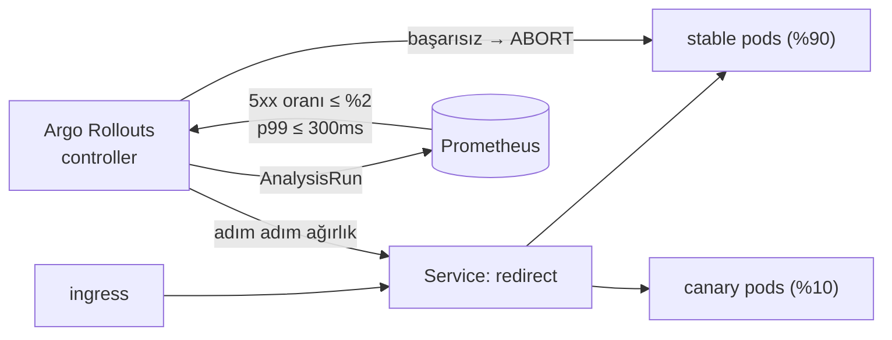

# 12 — delivery · "Güvenli dağıtım"

## 1. Bu seviye ne?

Şimdiye kadar her dağıtım "pod'ları değiştir ve umut et"ti. Bu seviye o umudu **ölçümle**
değiştiriyor: redirect-svc artık bir **Argo Rollout** ve canary adımları arasında Prometheus'a
bakan **otomatik analiz** var — kötü bir sürüm %10 trafikte yakalanıp geri alınıyor. Yanında
şemanın dağıtımla nasıl uyumlu kalacağı (**expand/contract**) ve cluster durumunun git'ten nasıl
sapmadığı soruları var.

## 2. Mimari



Kritik nokta: **kararı bir makine veriyor.** İnsanın dashboard'a bakıp fark etmesi dakikalar
sürer; analiz 30–60 saniyede karar verir.

## 3. Önceki seviyeden çözülenler

| ID | Sorun | Nasıl çözüldü |
|---|---|---|
| P11-07 | Dashboard drift'i | Aynı disiplin uygulamaya genişledi: manifest'ler kaynakta, `make deploy` yeniden uygular, elle yapılan değişiklik kalıcı olamaz (P12-03 bunu ölçüyor ve **Argo CD'nin ne eklediğini** söylüyor) |

## 4. Ayağa kaldırma

Platform: `cd platform && make minimal && make keda && make cnpg && make chaos && make tempo && make argo`.

```bash
make up            # build → push → deploy → rollout wait → smoke
curl -s -XPOST http://lvl12.localtest.me/api/links -H 'Content-Type: application/json' -d '{"url":"https://example.com"}'
curl -I http://lvl12.localtest.me/<code>
make grafana       # Ladder klasörü, level=lvl12
make load S=mixed  # aynı senaryolar her seviyede: create redirect mixed hot-key burst abuser read-your-writes stairs scan
make down
```

Rollout'u izlemek için:
```bash
kubectl -n lvl12 get rollout redirect -w
kubectl -n lvl12 get analysisrun
kubectl argo rollouts get rollout redirect -n lvl12 --watch   # plugin varsa
```

## 5. API

Her seviyede aynı: [docs/API.md](../docs/API.md).

Yeni bir **operasyonel** davranış var: `BAD_VERSION_ERROR_PCT` ile kasıtlı bozuk bir sürüm
üretilebiliyor (varsayılan 0). *Dağıtım güvenliğini test etmek için gerçekten bozuk bir sürüme
ihtiyacın var; kasıtlı bir bug, yeniden üretilebilir bir bug'dır.*

## 6. Reproduce edilebilir sorunlar

| ID | Sorun | Reproduce | Grafana'da | Çözüm |
|---|---|---|---|---|
| P12-01 | Kötü sürüm %100'e gider | `make repro P=P12-01` | Rollout → 5xx by version | seviye içi (canary+analiz) |
| P12-02 | **TRAP** kırıcı migration | `CONFIRM=1 make repro P=P12-02` | Postgres → result=error | seviye içi (expand/contract) |
| P12-03 | Drift: elle yapılan değişiklik | `make repro P=P12-03` | Rollout → Argo sync | Argo CD (kurulu) |
| P12-04 | `:latest` = belirsiz, geri alınamaz sürüm | `make repro P=P12-04` | Rollout → rps by version | 13 (Kyverno) |
| P12-05 | Canary + paylaşılan durum uyumsuzluğu | `make repro P=P12-05` | Cache → hit ratio | tartışma |
| P12-06 | Uygulama geri alındı, şema alınmadı | `make repro P=P12-06` | Rollout → faz | disiplin |

---

### P12-01 · Kötü sürüm canary'de yakalanıyor

**Belirti/Beklenti:** `%25` hata üreten bir sürüm dağıtıldığında, toplam etki ~%2.5 ile sınırlı
kalır ve rollout **Degraded** olup geri alınır.
**Neden:** Canary trafiğin %10'unu alır, analiz 30 sn sonra ölçer, eşiği aşarsa **abort** eder.
[Topic · Konu: Canary, progressive delivery, otomatik geri alma]

**Reproduce:** `make repro P=P12-01` — yük altında `BAD_VERSION_ERROR_PCT=25` ile dağıtır,
rollout fazını ve toplam hata oranını ölçer.

**Grafana:** `13 · Rollout` → "5xx oranı by version" (stable vs canary yan yana).
**Bedeli:** dağıtım 30 saniye yerine birkaç dakika sürer. **Bu, sigorta primidir.**
**Analizin iki ayarı da önemli:** `initialDelay: 30s` olmadan analiz *henüz veri yokken* karar
verir; `failureLimit` olmadan tek bir gürültülü ölçüm sağlıklı bir sürümü geri aldırır.

---

### P12-02 · TRAP · Kırıcı migration

**Belirti:** Yük altında `ALTER TABLE ... RENAME COLUMN` uygulandığında eski pod'lar 500 döner.
**Neden:** Rolling update, iki sürümün **bir arada** yaşayacağını garanti eder. Dolayısıyla her
migration, dağıtımın **her iki yanındaki** kodla uyumlu olmak zorundadır.
[Topic · Konu: Expand/contract, sıfır kesintili şema değişikliği]

**Reproduce:** `CONFIRM=1 make repro P=P12-02` — yük altında sütunu yeniden adlandırır, hata
penceresini ölçer, sonra geri alır.

**Güvenli biçim üç dağıtımdır** (`migrations/006_expand.sql` yorumunda tam olarak yazıyor):
1. **EXPAND** — yeni sütunu ekle, her ikisine de yaz
2. **MIGRATE** — geriye doldur, okumayı yeniye çevir
3. **CONTRACT** — eskiye yazmayı bırak, sonra düşür

*Her adım bağımsız geri alınabilir. "Üç dağıtım fazla" diyorsan, bu deneyin 5xx sayısına bak.*

---

### P12-03 · Drift: elle yapılan değişiklik

**Belirti:** `kubectl scale` ile yapılan değişiklik çalışır, sonra bir sonraki `make deploy` onu
**sessizce** geri alır. Kim yaptı, neden yaptı — kayıt yok.
**Neden:** Manifest kaynaktadır; cluster ise canlı durumdur. İkisi arasında sürekli bir
karşılaştırma yoksa sapma görünmez. [Topic · Konu: GitOps, drift, self-heal]

**Reproduce:** `make repro P=P12-03` — drift üretir, yeniden uygular ve kaybolduğunu gösterir.

**Argo CD kurulu ama Application tanımlı değil — bilerek.** Elde bir GitOps zaten var
(manifest + `make up`). Argo'nun eklediği **üç şey**: (1) sürekli karşılaştırma (sen uygulamasan
da), (2) otomatik self-heal, (3) **görünürlük** — hangi kaynak neden farklı. Bu seviye üçünün de
yokluğunu ölçüyor; kurmak bir sonraki adım.

---

### P12-04 · `:latest` = belirsiz ve geri alınamaz sürüm

**Belirti/Beklenti:** Bu merdivende hiçbir imaj `:latest` kullanmıyor; her etiket
`<git-sha>-<kaynak-hash>`.
**Neden:** Mutable etiket, "deploy ettim değişmedi" ve "önceki sürüme dön" sorunlarını üretir.
[Topic · Konu: Değişmez artefakt]

**Reproduce:** `make repro P=P12-04` — çalışan etiketleri listeler, ReplicaSet geçmişinden geri
dönülebilirliği gösterir.

**Bu bir tercih değil, bir zorunluluk:** ilk denemede **zaman damgalı** etiket kullanmıştık ve
`make push` ile `make deploy` ayrı çağrıldığında farklı etiket üretip `ImagePullBackOff` verdi
(`ladder.mk` yorumunda kayıtlı). **13'te Kyverno bunu policy hâline getirecek.**

---

### P12-05 · Canary + paylaşılan durum uyumsuzluğu

**Belirti (senaryo):** Yeni sürüm önbellek anahtar formatını değiştirirse, canary ve stable aynı
Redis'e farklı formatlarda yazar; iki taraf da ıska alır ve sistem aniden önbelleksiz davranır.
**Neden:** Canary'nin sessiz varsayımı iki sürümün yan yana çalışabilmesidir — paylaşılan durum
bu varsayımı kırar. [Topic · Konu: Uyumluluk sözleşmesi]

**Reproduce:** `make repro P=P12-05` — mevcut anahtar formatını ve hit oranını gösterir, format
değişiminin etkisini hesaplatır.

**Üç seçenek:** geriye uyumlu format · geçiş döneminde iki formatı da okuma · canary'ye ayrı
önbellek (izole ama soğuk, P03-02'nin bedeli).
***Canary, paylaşılan her durum için bir uyumluluk sözleşmesi gerektirir*** — aynı akıl yürütme
kuyruk mesaj formatı (P06-07) ve DB şeması (P12-02) için de geçerli.

---

### P12-06 · Uygulama geri alındı, şema alınmadı

**Belirti:** "Rollback" tek bir şeymiş gibi konuşulur; aslında ikidir ve yalnızca biri otomatiktir.
**Neden:** Şemayı geri almak **ileri** bir işlemdir (yeni bir migration) ve veri kaybettirebilir.
[Topic · Konu: Sürüm uyumluluğu, runbook]

**Reproduce:** `make repro P=P12-06` — şema sürümü ile uygulama etiketini yan yana gösterir, her
migration'ın `Down` bloğunu kontrol eder, geri alınamayan değişiklik türlerini sayar.

**Pratik kural:** Bir sürümde yalnızca **geriye uyumlu** şema değişikliği yap; böylece uygulamayı
geri almak şemayı geri almayı **gerektirmez**.
**Runbook'a yazılacak cümle:** *"Uygulama geri alındığında şema ileri kalır ve bu sorun değildir,
çünkü N−1 sürümü N şemasıyla çalışabilir."* Bu cümleyi yazamıyorsan, migration'ın güvenli değil.

## 7. Seviye içi alıştırmalar (TRAP_ bayrakları)

| Bayrak | Ne yapar | Reproduce | Düzeltme |
|---|---|---|---|
| `BAD_VERSION_ERROR_PCT` | Kasıtlı bozuk sürüm üretir | `make repro P=P12-01` | 0'a döndür |
| `TRAP_BREAKING_MIGRATION` / migration 007 | Kırıcı `RENAME COLUMN` | `CONFIRM=1 make repro P=P12-02` | expand/contract |
| `TRAP_TENANT_LABEL` · `TRAP_REGEX_PER_REQUEST` | (11'den devam) | 11'de | — |

Elle denemeye değer:
- `AnalysisTemplate`'teki `successCondition`'ı `<= 0.5` yap ve P12-01'i tekrar koş: analiz artık
  kötü sürümü **geçirir**. *Bir güvenlik mekanizmasının eşiği yanlışsa, mekanizma yok demektir —
  hatta daha kötü: var olduğunu sanırsın.*
- `initialDelay`'i kaldır: analiz henüz veri yokken çalışır ve `no data` ile ya hep geçer ya hep
  düşer (provider'a göre). **Ölçüm başlamadan karar veren bir kapı, kapı değildir.**
- `steps` listesine `pause: {}` (süresiz) ekle: manuel onay kapısı. Otomatik analiz ile manuel
  onayı karşılaştır — hangisi daha hızlı, hangisi daha güvenli?
- `MIGRATE_TARGET=7` ile kırıcı migration'ı Job üzerinden uygula (P02-07'nin altyapısıyla) ve
  P12-02'yi tekrar koş: şema değişikliğinin **dağıtım sırasındaki** yeri neden önemli, ölç.

## 8. Gözlemlenebilirlik: hangi paneller dolu, hangileri boş

| Dashboard | Durum | Neden |
|---|---|---|
| `13 · Rollout` | **Dolu** ✨ | stable vs canary RED yan yana, rollout fazı, Argo sync durumu |
| `12 · SLO` | Dolu | Canary hatası burn-rate'e de yansır — *iki mekanizma aynı olayı farklı zaman ölçeğinde görür* |
| `02 · App RED` | Dolu | `version` label'ı ile kırılabilir |
| `14 · Security` | Kısmen | 13'te dolacak |

Bu seviyenin okuma kuralı: **canary kararını verirken tek bir metriğe bakma.** Hata oranı düşük
ama p99 iki katına çıkmışsa sürüm yine kötüdür — bu yüzden `AnalysisTemplate` iki metrik içeriyor.

## 9. Bilerek bırakılanlar

- **Argo CD Application tanımlı değil** (P12-03'te gerekçesi): kurulum hazır, bağlamak bir adım.
- **Gitea kurulmadı**: cluster içi git deposu yok; GitOps kaynağı yerel manifest'ler.
- **api-svc hâlâ Deployment**: yalnızca redirect Rollout'a çevrildi. *Her servisi canary yapmak,
  her dağıtımı yavaşlatmaktır; trafiğin %99'unu taşıyan servis önceliklidir.*
- **Blue/green yok**: canary seçildi çünkü kademeli ölçüm sağlıyor.
- **CI yok**: imaj derleme/tarama/test hattı `make` ile elle. `.github/workflows/ci.yml` var ama
  imaj yayınlamıyor.
- **CONTRACT adımı uygulanmadı**: `url` sütunu duruyor (expand yapıldı, contract sonraki sürümde).
  *Kullanılmayan bir sütun, bir sonraki okuyucunun tuzağıdır — ama erken düşürmek de kesintidir.*

## 10. `make diff-prev` okuma rehberi

`make diff-prev` 11 ile farkı gösterir:

1. **`deploy/rollout.yaml`** (yeni): `Deployment` → `Rollout`. Asıl içerik `AnalysisTemplate`:
   **iki metrik, `initialDelay`, `failureLimit`** — üçü de yorumlarda gerekçelendirilmiş.
2. **`deploy/redirect-svc.yaml`**: artık yalnızca Service + ServiceMonitor + PDB. Rollout,
   Deployment'ın yerini aldı ama **Service değişmedi** — trafik yönlendirmesi controller'ın işi.
3. **`internal/store/migrations/006_expand.sql`**: kodun kendisi 2 satır, yorumu 20 satır.
   *Expand/contract bir SQL tekniği değil, bir dağıtım disiplinidir* — bu yüzden gerekçe kodda.
4. **Kırıcı rename artık migration DEĞİL, deneyin kendisi** (`problems/P12-02.sh` onu `psql` ile
   uygular ve geri alır). Bir süre `007_breaking_rename.sql` olarak migration sırasındaydı ve
   13/14 — RLS adımına kadar koştukları için — yolda onu da uygulayıp `links.url` sütununu
   yeniden adlandırdılar: uygulama ayakta, her yazma `column url does not exist`, seviye hiç
   açılamıyor. **Sıraya konmuş bir deney, deney olmaktan çıkıp herkesin ödediği bir bedele
   dönüşür.** Yanlışı sürüm kontrolünde tutmak doğru; onu herkesin koştuğu yola koymak değil.
5. **`internal/httpapi/handlers.go`**: `BAD_VERSION_ERROR_PCT`. Dağıtım güvenliğini test etmek
   için gerçekten bozuk bir sürüme ihtiyacın var.
