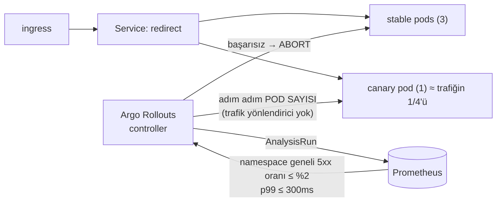

# 12 — delivery · "Güvenli dağıtım"

> **Bu seviyede ne yaşayacaksın?**
> - Kötü bir sürümün canary'de — 4 pod'dan birindeyken, trafiğin ~1/4'ünde — Prometheus analiziyle yakalanıp otomatik geri alınması (P12-01)
> - Tuzak: eski kodu kıran bir migration (P12-02); elle yapılan bir değişikliğin (drift) kimseye görünmemesi (P12-03)
> - `:latest` etiketin belirsiz ve geri alınamaz olması (P12-04); canary ile stable'ın aynı Redis'e farklı formatta yazması (P12-05)
> - Uygulama geri alınınca şemanın geri alınmaması ve expand/contract'ın bunu nasıl önlediği (P12-06)
>
> **Bu seviye olmasa ne olur?** Her dağıtım "pod'ları değiştir ve umut et"tir; kötü bir sürüm trafiğin tamamına ulaşır ve geri alma elle yapılır.
>
> **Yeni gelen teknolojiler:** Argo Rollouts (canary + AnalysisTemplate), Argo CD, expand/contract migration, `13 · Rollout` paneli ([her biri tek cümleyle](../README.md#kullanılan-teknolojiler)).

## 1. Bu seviye ne?

Şimdiye kadar her dağıtım "pod'ları değiştir ve umut et"ti. Bu seviye o umudu **ölçümle**
değiştiriyor: redirect-svc artık bir **Argo Rollout** ve canary adımları arasında Prometheus'a
bakan **otomatik analiz** var — kötü bir sürüm yalnızca canary pod'undayken (4 pod'dan biri,
trafiğin ~1/4'ü) yakalanıp geri alınıyor. Yanında şemanın dağıtımla nasıl uyumlu kalacağı
(**expand/contract**) ve cluster durumunun git'ten nasıl sapmadığı soruları var.

## 2. Mimari



Kritik nokta: **kararı bir makine veriyor.** İnsanın dashboard'a bakıp fark etmesi dakikalar
sürer; analiz 30–60 saniyede karar verir.

**Ağırlık bir trafik yüzdesi değil:** Rollout'ta trafik yönlendirici (nginx canary ingress, service
mesh) tanımlı olmadığı için Argo `setWeight: 10`u pod sayısıyla yaklaşık tutar — 3 replikada 1 canary
pod eklenir, stable 3'te kalır ve Service trafiği 4 pod'a eşit böler. Sayılar bu yüzden "%10" değil
"~%25" (P12-01, §9).

## 3. Önceki seviyeden çözülenler

**Hiçbiri** — `problems/SOLVES` bunu gerekçesiyle yazar. 12 canary ve GitOps getiriyor; 11'in
sorunlarından birini ortadan kaldırmıyor.

**Kapatılan borçlar** (`SOLVES` kontratına girmedikleri için burada): P11-07'nin (dashboard drift'i)
disiplini uygulamaya genişliyor — manifest'ler kaynakta, `make deploy` yeniden uygular, elle yapılan
değişiklik kalıcı olamaz (P12-03 bunu ölçüyor ve **Argo CD'nin ne eklediğini** söylüyor). P11-07'nin
kendisi 11'de "kod olarak dashboard" ile zaten çözülü; 12 onu çözmüyor, aynı dersi uygulamaya taşıyor.

## 4. Ayağa kaldırma

İlk kez mi? Önce kök README'deki [Sıfırdan başlangıç](../README.md#sıfırdan-başlangıç) — platform bir kez kurulur (`cd platform && make full`).
Bu seviyenin platformdan istediği: **temel yığın (kind, ingress, Prometheus, Grafana) + Chaos Mesh, KEDA, CloudNativePG, Argo CD + Argo Rollouts**. `make up` ilk adımda (profil) bunları açar ve kullanılmayanları kapatır; bir bileşen kurulu değilse hangi komutla kurulacağını söyleyip durur.

```bash
make up            # profil → build → push → deploy → rollout wait → smoke
code=$(curl -s -XPOST http://lvl12.localtest.me/api/links -H 'Content-Type: application/json' -d '{"url":"https://example.com"}' | jq -r .code); echo "$code"
curl -s -o /dev/null -w '%{http_code} → %{redirect_url}\n' http://lvl12.localtest.me/$code   # 302 → https://example.com
make grafana       # Ladder klasörü, level=lvl12 — giriş: admin / ladder
make load S=mixed  # aynı senaryolar her seviyede: create redirect mixed hot-key burst abuser read-your-writes stairs scan
make repro P=P12-01   # §6'daki bir sorunu otomatik üret → REPRODUCED / NOT-REPRODUCED
make env           # açık ayar/tuzaklar · değiştir: make set E="KEY=değer" · hepsini geri al: make reset (§7)
make down          # seviyeyi kaldır · kümeyi durdurmak için: make -C ../platform stop
```

Rollout'u izlemek için:
```bash
kubectl -n lvl12 get rollout redirect -w
kubectl -n lvl12 get analysisrun
kubectl argo rollouts get rollout redirect -n lvl12 --watch   # plugin varsa
```

## 5. API

Her seviyede aynı: [docs/API.md](../docs/API.md).

Yeni bir **operasyonel** davranış var: `BAD_VERSION_ERROR_PCT` ile kasıtlı bozuk bir sürüm
üretilebiliyor (varsayılan 0). *Dağıtım güvenliğini test etmek için gerçekten bozuk bir sürüme
ihtiyacın var; kasıtlı bir bug, yeniden üretilebilir bir bug'dır.*

## 6. Reproduce edilebilir sorunlar

| ID | Sorun | Reproduce | Grafana'da | Çözüm |
|---|---|---|---|---|
| P12-01 | Kötü sürüm %100'e gider | `make repro P=P12-01` | [13 · Rollout](http://grafana.localtest.me/d/ladder-rollout?var-level=lvl12&from=now-30m&to=now&refresh=10s) · [02 · App RED](http://grafana.localtest.me/d/ladder-app-red?var-level=lvl12&from=now-30m&to=now&refresh=10s) → "İstek / sn (sürüme göre)" | seviye içi (canary+analiz) |
| P12-02 | Kırıcı migration (yük altında `psql` ile `RENAME COLUMN`) | `CONFIRM=1 make repro P=P12-02` | [02 · App RED](http://grafana.localtest.me/d/ladder-app-red?var-level=lvl12&from=now-15m&to=now&refresh=10s) · [03 · App Business](http://grafana.localtest.me/d/ladder-app-business?var-level=lvl12&from=now-15m&to=now&refresh=10s) → "İstek / saniye (durum koduna göre)" | seviye içi (expand/contract) |
| P12-03 | Drift: elle yapılan değişiklik | `make repro P=P12-03` | görünmez — kanıt terminalde ↓ | Argo CD (kurulu) |
| P12-04 | `:latest` = belirsiz, geri alınamaz sürüm | `make repro P=P12-04` | [13 · Rollout](http://grafana.localtest.me/d/ladder-rollout?var-level=lvl12&from=now-15m&to=now&refresh=10s) → "İstek / sn (sürüme göre)" | 13 (Kyverno) |
| P12-05 | Canary + paylaşılan durum uyumsuzluğu | `make repro P=P12-05` | [04 · Cache](http://grafana.localtest.me/d/ladder-cache?var-level=lvl12&from=now-15m&to=now&refresh=10s) → "İsabet oranı (pod'a göre)" | tartışma |
| P12-06 | Uygulama geri alındı, şema alınmadı | `make repro P=P12-06` | görünmez — kanıt terminalde ↓ | disiplin |

---

### P12-01 · Kötü sürüm canary'de yakalanıyor

**Belirti/Beklenti:** `%25` hata üreten bir sürüm dağıtıldığında canary pod'u trafiğin ~1/4'ünü alır;
o süre boyunca toplam hata oranı ~%6'ya (%25 × 1/4) çıkar, analiz bunu 30–60 sn içinde görür, rollout
**Degraded** olur ve geri alınır. 3 dakikalık yük koşusunun ortalaması daha da düşüktür (kötü sürüm
yalnızca abort'a kadar trafikteydi). Rolling update'te aynı oran %25'e kadar çıkardı.
**Neden:** Analiz 30 sn sonra ölçer, eşiği aşarsa **abort** eder. İki ayrıntı sayıları belirliyor:
(1) trafik yönlendirici olmadığı için canary payı `setWeight: 10` değil **pod sayısıdır** (1 canary + 3
stable); (2) analiz canary'yi ayrı ölçmez, **namespace'in bütün `/{code}` trafiğinin** 5xx oranını
%2 eşiğiyle karşılaştırır (`deploy/rollout.yaml`) — canary'nin kendi %25'i değil, toplamdaki ~%6 görülür.
[Topic · Konu: Canary, progressive delivery, otomatik geri alma]

**Reproduce:** `make repro P=P12-01` — yük altında `BAD_VERSION_ERROR_PCT=25` ile dağıtır; rollout
fazını, sürüm etiketinden ölçülen canary payını, canary'nin kendi hata oranını ve toplam oranı basar.

**Grafana'da gör:** [`13 · Rollout`](http://grafana.localtest.me/d/ladder-rollout?var-level=lvl12&from=now-30m&to=now&refresh=10s) ve [`02 · App RED`](http://grafana.localtest.me/d/ladder-app-red?var-level=lvl12&from=now-30m&to=now&refresh=10s) — `make repro`'yu başlatınca aç; kötü sürüm ~15 sn sonra dağıtılır, analiz 30–60 sn içinde karar verir (giriş: admin / ladder)
- "İstek / sn (sürüme göre)" → çizgi başına bir **pod şablonu hash'i** (`rollouts_pod_template_hash`): canary başlayınca yeni bir hash belirir ve toplamın ~1/4'ünü alır, abort'tan sonra kaybolur. Hangisi stable? `kubectl -n lvl12 get rollout redirect -o jsonpath='{.status.stableRS}'` stable hash'i verir, diğeri canary'dir (canary sürerken `{.status.currentPodHash}` onu verir). Etiketsiz çizgi api-svc'dir: Deployment olduğu için sürüm etiketi yok.
- "Hata oranı (sürüme göre)" → canary hash'inin çizgisi ~%25'e çıkar (kötü sürümün kendi oranı), stable hash'i 0'da kalır. Analizin karar verdiği sayı bu çizgi değil, toplamdır ↓
- "Sunucu hatası oranı (5xx)" → canary süresince ~%6 (%25 × 1/4) ve abort'la sıfıra döner: analizin %2 eşiğiyle karşılaştırdığı namespace geneli oran budur.
- "p99 süre (sürüme göre)" → iki hash birbirine yakın: kötü sürüm hızlı hata veriyor, gecikme analizi (≤ 300 ms) geçer; abort'u hata oranı tetikler.
- "Dağıtım aşaması (Argo Rollouts)" → `redirect: Progressing`, abort'tan sonra `redirect: Degraded`; `istenen replika` 3'te sabit kalır (canary pod'u bunun üstüne eklenir). Panel boşsa Argo Rollouts metrikleri kazınmıyor (`make -C ../platform argo`); faz her durumda terminalde: `kubectl -n lvl12 get rollout redirect -o jsonpath='{.status.phase}'` → `Degraded`, `kubectl -n lvl12 get analysisrun` → en yeni koşu `Failed`.
- "İstek / saniye (durum koduna göre)" → `302`'nin yanında kısa ömürlü bir `500` çizgisi: kötü sürümün `BAD_VERSION_ERROR_PCT` ile ürettiği hata.

**Bedeli:** dağıtım 30 saniye yerine birkaç dakika sürer. **Bu, sigorta primidir.**
**Analizin iki ayarı da önemli:** `initialDelay: 30s` olmadan analiz *henüz veri yokken* karar
verir; `failureLimit` olmadan tek bir gürültülü ölçüm sağlıklı bir sürümü geri aldırır.

---

### P12-02 · Kırıcı migration

**Belirti:** Yük altında `ALTER TABLE ... RENAME COLUMN` uygulandığında eski pod'lar 500 döner.
**Neden:** Rolling update, iki sürümün **bir arada** yaşayacağını garanti eder. Dolayısıyla her
migration, dağıtımın **her iki yanındaki** kodla uyumlu olmak zorundadır.
[Topic · Konu: Expand/contract, sıfır kesintili şema değişikliği]

**Reproduce:** `CONFIRM=1 make repro P=P12-02` — bir `TRAP_` bayrağı yok: script yük altında primary'de
`psql` ile `ALTER TABLE links RENAME COLUMN url TO url_old` koşar, hata penceresini ölçer, sonra sütunu
eski adına döndürür (script yarıda kalsa da temizlik adımı geri alır). `CONFIRM=1`, şemaya dokunan yıkıcı bir deney olduğunu işaretler.

**Grafana'da gör:** [`02 · App RED`](http://grafana.localtest.me/d/ladder-app-red?var-level=lvl12&from=now-15m&to=now&refresh=10s) ve [`03 · App Business`](http://grafana.localtest.me/d/ladder-app-business?var-level=lvl12&from=now-15m&to=now&refresh=10s) — script "sütun yeniden adlandırıldı" dediği anda aç; kırık pencere ~25 sn sürer (giriş: admin / ladder)
- "İstek / saniye (durum koduna göre)" → pencere boyunca bir `503` çizgisi (uygulamanın `store_error` cevabı); sütun eski adına dönünce kaybolur.
- "5xx (uç noktaya göre)" → hata ağırlıkla `/api/links` rotasında (INSERT var olmayan `url` sütununa yazıyor); önbellekte olmayan kodlara yapılan `/{code}` okumaları da düşer.
- "Oluşturma sonuçları" → pencere boyunca `ok`'un yerini `error` alır; "Yönlendirme sonuçları"nda da `error` serisi belirir.
- Explore'da: `sum by (op) (rate(db_queries_total{namespace="lvl12",result="error"}[1m]))` → `create` ve `get` için aynı pencerede tepe. `05 · Postgres` → "Veritabanı sorguları (türe göre)" başarı ile hatayı toplar (`result`'a göre ayırmaz); hatayı bu sorguyla görürsün.

**Güvenli biçim üç dağıtımdır** (`migrations/006_expand.sql` yorumunda tam olarak yazıyor):
1. **EXPAND** — yeni sütunu ekle, her ikisine de yaz
2. **MIGRATE** — geriye doldur, okumayı yeniye çevir
3. **CONTRACT** — eskiye yazmayı bırak, sonra düşür

*Her adım bağımsız geri alınabilir. "Üç dağıtım fazla" diyorsan, bu deneyin 5xx sayısına bak.*

---

### P12-03 · Drift: elle yapılan değişiklik

**Belirti:** `kubectl scale` ile yapılan değişiklik çalışır, sonra bir sonraki `make deploy` onu
**sessizce** geri alır. Kim yaptı, neden yaptı — kayıt yok.
**Neden:** Manifest kaynaktadır; cluster ise canlı durumdur. İkisi arasında sürekli bir
karşılaştırma yoksa sapma görünmez. [Topic · Konu: GitOps, drift, self-heal]

**Reproduce:** `make repro P=P12-03` — drift üretir, yeniden uygular ve kaybolduğunu gösterir.

**Grafana'da gör:** Grafana'da görünmez — drift bir metrik değil, iki kaynağın (manifest ↔ küme) farkıdır ve bu seviyede o farkı ölçen hiçbir şey yok. `13 · Rollout` → "Git ile uyumsuz uygulamalar (Argo CD)" **boş** kalır: Argo CD'nin metrikleri kazınıyor ama lvl12 için Application tanımlı değil — boş panel burada "her şey Git'teki gibi" değil, "karşılaştıran kimse yok" demektir. "Dağıtım aşaması (Argo Rollouts)" → `istenen replika` çizgisi script drift'i tutarken (~65 sn) 3 → 5 → 3 basamağı çizer: değişikliğin kendisi görünür, ama manifest'ten bir sapma olduğu, kimin yaptığı ve sessizce geri alındığı görünmez. Argo CD arayüzü (http://argocd.localtest.me, kullanıcı `admin`, şifre: `kubectl -n argocd get secret argocd-initial-admin-secret -o jsonpath='{.data.password}' | base64 -d`) da lvl12 için bir uygulama göstermez — ölçülen eksik tam olarak bu görünürlük. Kanıt terminalde:
- `kubectl -n lvl12 get rollout redirect -w` (script koşarken, ikinci terminalde) → `DESIRED` 3 → 5 → 3: elle yapılan değişiklik ve sessizce geri alınması; hiçbir yerde kaydı kalmaz.
- `kubectl -n argocd get applications` → `No resources found`: kümeyi manifest'le sürekli karşılaştıran bir şey yok.

**Argo CD kurulu ama Application tanımlı değil — bilerek.** Elde bir GitOps zaten var
(manifest + `make up`). Argo'nun eklediği **üç şey**: (1) sürekli karşılaştırma (sen uygulamasan
da), (2) otomatik self-heal, (3) **görünürlük** — hangi kaynak neden farklı. Bu seviye üçünün de
yokluğunu ölçüyor; kurmak bir sonraki adım.

---

### P12-04 · `:latest` = belirsiz ve geri alınamaz sürüm

**Belirti/Beklenti:** Bu merdivende hiçbir imaj `:latest` kullanmıyor; her etiket
`<git-sha>-<kaynak-hash>`.
**Neden:** Mutable etiket, "deploy ettim değişmedi" ve "önceki sürüme dön" sorunlarını üretir.
[Topic · Konu: Değişmez artefakt]

**Reproduce:** `make repro P=P12-04` — çalışan etiketleri listeler, ReplicaSet geçmişinden geri
dönülebilirliği gösterir.

**Grafana'da gör:** [`13 · Rollout`](http://grafana.localtest.me/d/ladder-rollout?var-level=lvl12&from=now-15m&to=now&refresh=10s) — istediğin an aç; bu sorun bir yük değil, bir durum (giriş: admin / ladder)
- "İstek / sn (sürüme göre)" → redirect için **tek bir hash çizgisi** (bir de api-svc'nin etiketsiz çizgisi): şu an tek ReplicaSet çalışıyor. Hash pod şablonunun özetidir ve imaj etiketini içerir; yeni bir etiketle dağıtımda geçiş boyunca iki hash görünür. `:latest` ile yeni imaj itilseydi şablon DEĞİŞMEZDİ: yeni hash yok, rollout yok — "deploy ettim değişmedi"nin panel hâli. Hangi imajın çalıştığını ise panel değil imaj etiketi söyler ↓
- Explore'da: `count by (image) (kube_pod_container_info{namespace="lvl12",container="redirect"})` → tek satır, etiket `…/12-redirect-svc:<git-sha>-<kaynak-hash>` biçiminde; `:latest` yok (bu yüzden script NOT-REPRODUCED der). Yeni bir imajla dağıtım sırasında aynı sorgu geçiş boyunca iki satır gösterir.
- Geri dönülebilirlik terminalde: `kubectl -n lvl12 get rs -l app.kubernetes.io/name=redirect -o custom-columns=RS:.metadata.name,IMAGE:.spec.template.spec.containers[0].image` → önceki ReplicaSet'ler ve imajları; `:latest` olsaydı hepsi aynı etiketi gösterirdi ve `undo` hiçbir şey değiştirmezdi.

**Bu bir tercih değil, bir zorunluluk:** **zaman damgalı** bir etiket, `make push` ile
`make deploy` ayrı çağrıldığında farklı etiket üretir ve pod `ImagePullBackOff`'a düşer
(`ladder.mk` yorumunda). **13'te Kyverno bunu policy hâline getirecek.**

---

### P12-05 · Canary + paylaşılan durum uyumsuzluğu

**Belirti (senaryo):** Yeni sürüm önbellek anahtar formatını değiştirirse, canary ve stable aynı
Redis'e farklı formatlarda yazar; iki taraf da ıska alır ve sistem aniden önbelleksiz davranır.
**Neden:** Canary'nin sessiz varsayımı iki sürümün yan yana çalışabilmesidir — paylaşılan durum
bu varsayımı kırar. [Topic · Konu: Uyumluluk sözleşmesi]

**Reproduce:** `make repro P=P12-05` — mevcut anahtar formatını ve hit oranını gösterir, format
değişiminin etkisini hesaplatır.

**Grafana'da gör:** [`04 · Cache`](http://grafana.localtest.me/d/ladder-cache?var-level=lvl12&from=now-15m&to=now&refresh=10s) — scriptin 30 sn'lik redirect yükü başlayınca aç (giriş: admin / ladder)
- "İsabet oranı (pod'a göre)" → yük boyunca her pod'da yüksek ve birbirine yakın: tek anahtar formatı (`linkly:link:*`), her pod diğerlerinin yazdığını okuyabiliyor. Format değişimi bu deneyde gerçekten dağıtılmıyor, yani düşüş **görmezsin** — gerçek bir format değişikliğinde bu çizgiler canary payıyla (burada pod sayısı: ~1/4) orantılı düşerdi.
- "Önbellek ıskası ve veritabanı sorguları" → iki çizgi de alçak ve birlikte hareket eder. Format değişiminde ikisi birlikte yükselir: aradaki fark, önbelleksiz kalan sistemin DB'ye bindirdiği yük.

**Üç seçenek:** geriye uyumlu format · geçiş döneminde iki formatı da okuma · canary'ye ayrı
önbellek (izole ama soğuk, P03-02'nin bedeli).
***Canary, paylaşılan her durum için bir uyumluluk sözleşmesi gerektirir*** — aynı akıl yürütme
kuyruk mesaj formatı (P06-07) ve DB şeması (P12-02) için de geçerli.

---

### P12-06 · Uygulama geri alındı, şema alınmadı

**Belirti:** "Rollback" tek bir şeymiş gibi konuşulur; aslında ikidir ve yalnızca biri otomatiktir.
**Neden:** Şemayı geri almak **ileri** bir işlemdir (yeni bir migration) ve veri kaybettirebilir.
[Topic · Konu: Sürüm uyumluluğu, runbook]

**Reproduce:** `make repro P=P12-06` — şema sürümü ile uygulama etiketini yan yana gösterir, her
migration'ın `Down` bloğunu kontrol eder, geri alınamayan değişiklik türlerini sayar.

**Grafana'da gör:** Grafana'da görünmez — şema sürümü ile uygulama sürümü hiçbir metrikte yan yana durmuyor; sorunun kendisi de bu: ikisini bağlayan bir kayıt yok. (`13 · Rollout` → "Dağıtım aşaması (Argo Rollouts)" uygulamanın fazını gösterir, şemanınkini değil.) Kanıt terminalde:
- `kubectl -n lvl12 exec $(kubectl -n lvl12 get pod -l cnpg.io/cluster=pg,cnpg.io/instanceRole=primary -o name) -c postgres -- psql -U postgres -d linkly -tAc 'SELECT max(version_id) FROM goose_db_version'` → şema sürümü: tek bir sayı.
- `kubectl -n lvl12 get rollout redirect -o jsonpath='{.spec.template.spec.containers[0].image}'` → uygulama etiketi `<git-sha>-<kaynak-hash>`: şema sürümüyle hiçbir bağı yok.
- `grep -A2 '+goose Down' internal/store/migrations/*.sql` → Down bloklarında `DROP TABLE` / `DROP COLUMN`: "geri alma", Up'tan bu yana yazılan veriyi siler.

**Pratik kural:** Bir sürümde yalnızca **geriye uyumlu** şema değişikliği yap; böylece uygulamayı
geri almak şemayı geri almayı **gerektirmez**.
**Runbook'a yazılacak cümle:** *"Uygulama geri alındığında şema ileri kalır ve bu sorun değildir,
çünkü N−1 sürümü N şemasıyla çalışabilir."* Bu cümleyi yazamıyorsan, migration'ın güvenli değil.

## 7. Seviye içi alıştırmalar (TRAP_ bayrakları)

> **Nasıl uygulanır:** aç `make set E="TRAP_X=true"` · ne açık? `make env` · hepsini geri al `make reset` (ortamı `deploy/`'daki hâline döndürür; `make unset E=TRAP_X` yalnızca siler). Tablodaki diğer ayarlar da aynı yolla (`make set E="CACHE_TTL=1h"`). Pod'lar yeni değerle yeniden başlar; komut hazır olunca döner. Varsayılan olarak seviyenin TÜM uygulama servislerine uygulanır (tek servis: `W=redirect`); 12'den itibaren Argo Rollout'larda da çalışır — `kubectl set env` orada çalışmaz. `make repro` scriptleri tuzağı KENDİLERİ açıp kapatır ve bitince ortamı eski hâline getirir (senin açtıkların dahil): elle alıştırma için `make set` + `make load`, otomatik ölçüm için `make repro`. Bitirince `make reset`: açık kalan bir tuzak sonraki deneyi sessizce bozar.

| Bayrak | Ne yapar | Reproduce | Düzeltme |
|---|---|---|---|
| `BAD_VERSION_ERROR_PCT` | Kasıtlı bozuk sürüm üretir | `make repro P=P12-01` | 0'a döndür |
| *(bayrak yok — deneyin kendisi)* | Kırıcı `RENAME COLUMN` **doğrudan `psql` ile** uygulanır ve geri alınır. Bayrak değil, çünkü onu okuyabilecek bir kod yolu yok: rename uygulamanın değil şemanın işi. Migration dosyası da değil, çünkü sıradaki bir migration'ı 13/14 RLS adımına giderken yolda uygular ve kendi şemalarını bozar. | `CONFIRM=1 make repro P=P12-02` | expand/contract |
| `TRAP_TENANT_LABEL` · `TRAP_REGEX_PER_REQUEST` | (11'den devam) | 11'de | — |

Elle denemeye değer:
- `AnalysisTemplate`'teki `successCondition`'ı `<= 0.5` yap ve P12-01'i tekrar koş: analiz artık
  kötü sürümü **geçirir**. *Bir güvenlik mekanizmasının eşiği yanlışsa, mekanizma yok demektir —
  hatta daha kötü: var olduğunu sanırsın.*
- `initialDelay`'i kaldır: analiz henüz veri yokken çalışır ve `no data` ile ya hep geçer ya hep
  düşer (provider'a göre). **Ölçüm başlamadan karar veren bir kapı, kapı değildir.**
- `steps` listesine `pause: {}` (süresiz) ekle: manuel onay kapısı. Otomatik analiz ile manuel
  onayı karşılaştır — hangisi daha hızlı, hangisi daha güvenli?
- Rename'i `007_…sql` adlı bir migration olarak yaz, `MIGRATE_TARGET=7` ile Job üzerinden uygula
  (P02-07'nin altyapısıyla) ve P12-02'yi tekrar koş: şema değişikliğinin **dağıtım sırasındaki** yeri
  neden önemli, ölç. Bitince dosyayı sil — sırada kalırsa 13/14 onu da uygular.

## 8. Gözlemlenebilirlik: hangi paneller dolu, hangileri boş

| Dashboard | Durum | Neden |
|---|---|---|
| [`13 · Rollout`](http://grafana.localtest.me/d/ladder-rollout?var-level=lvl12&from=now-15m&to=now) | **Dolu** ✨ | "İstek / sn", "Hata oranı", "p99 süre" (sürüme göre): redirect'in ServiceMonitor'ü pod'un `rollouts-pod-template-hash` etiketini her seriye taşıyor (`podTargetLabels`), stable ve canary ayrı çizgi. Stable hash: `kubectl -n lvl12 get rollout redirect -o jsonpath='{.status.stableRS}'`, diğeri canary; etiketsiz çizgi api-svc. "Dağıtım aşaması (Argo Rollouts)" Argo'nun kendi metriğinden (`rollout_info`). "Git ile uyumsuz uygulamalar (Argo CD)" **boş**: Application tanımlı değil (P12-03) |
| [`12 · SLO`](http://grafana.localtest.me/d/ladder-slo?var-level=lvl12&from=now-15m&to=now) | Dolu | Canary hatası burn-rate'e de yansır — *iki mekanizma aynı olayı farklı zaman ölçeğinde görür* |
| [`02 · App RED`](http://grafana.localtest.me/d/ladder-app-red?var-level=lvl12&from=now-15m&to=now) | Dolu | Sürüme göre **kırılmaz** (uygulama metriklerinde `version` etiketi yok); sürüm ayrımı `13 · Rollout`'ta, pod şablonu hash'iyle |
| [`06 · Redis`](http://grafana.localtest.me/d/ladder-redis?var-level=lvl12&from=now-15m&to=now) · [`11 · Resilience`](http://grafana.localtest.me/d/ladder-resilience?var-level=lvl12&from=now-15m&to=now) | Dolu | Önbelleğin Redis çağrıları Redis'in kendi guard'ından geçer (`dep="redis"`): "Uygulama → Redis gecikmesi (p99)" dolu, "Bağımlılık gecikmesi p99" `postgres` ve `redis`'i ayrı çizer; Redis kesintisinde "Azaltılmış mod (degrade)" `no_cache` gösterir, Postgres'inkinde `cache_only` |
| [`14 · Security`](http://grafana.localtest.me/d/ladder-security?var-level=lvl12&from=now-15m&to=now) | Kısmen | 13'te dolacak |

Bu seviyenin okuma kuralı: **canary kararını verirken tek bir metriğe bakma.** Hata oranı düşük
ama p99 iki katına çıkmışsa sürüm yine kötüdür — bu yüzden `AnalysisTemplate` iki metrik içeriyor.

## 9. Bilerek bırakılanlar

- **Argo CD Application tanımlı değil** (P12-03'te gerekçesi): kurulum hazır, bağlamak bir adım.
- **Gitea kurulmadı**: cluster içi git deposu yok; GitOps kaynağı yerel manifest'ler.
- **api-svc hâlâ Deployment**: yalnızca redirect Rollout'a çevrildi. *Her servisi canary yapmak,
  her dağıtımı yavaşlatmaktır; trafiğin %99'unu taşıyan servis önceliklidir.*
- **Blue/green yok**: canary seçildi çünkü kademeli ölçüm sağlıyor.
- **Trafik yönlendirici yok**: canary payı pod sayısıyla belirleniyor (3 replikada 1 canary ≈ %25, `setWeight: 10`
  değil). Kesin yüzde için nginx canary ingress ya da service mesh gerekir: ikinci bir Service
  (`canaryService`/`stableService`), Argo'nun yönettiği canary Ingress, yük girişinin (`linkly-load`) de
  bağlanması ve analizin canary'ye özel sorguya çevrilmesi. Tek satırlık bir iş değil; bu seviye pod
  sayısıyla yetiniyor ve sayıları buna göre söylüyor (P12-01).
- **`/metrics` ingress arkasındaki portta**: redirect'in 8080'inde, ingress'in `/` yolunun gittiği yerde —
  dışarıdan erişilebilir. Profil uçları (`/debug/pprof`) bu yüzden ayrı bir iç portta (`:6060`,
  `PPROF_ADDR`): hiçbir Service/Ingress onu göstermiyor, yalnızca `kubectl port-forward` ya da API
  sunucusunun pod proxy'si ulaşır (`internal/httpapi/server.go` → `PprofHandler`). Üretimde `/metrics`
  de böyle bir yönetim portuna taşınır.
- **CI yok**: imaj derleme/tarama/test hattı `make` ile elle. `.github/workflows/ci.yml` var ama
  imaj yayınlamıyor.
- **CONTRACT adımı uygulanmadı**: `url` sütunu duruyor (expand yapıldı, contract sonraki sürümde).
  *Kullanılmayan bir sütun, bir sonraki okuyucunun tuzağıdır — ama erken düşürmek de kesintidir.*

## 10. `make diff-prev` okuma rehberi

`make diff-prev` 11 ile farkı gösterir:

1. **`deploy/rollout.yaml`** (yeni): `Deployment` → `Rollout`. Asıl içerik `AnalysisTemplate`:
   **iki metrik, `initialDelay`, `failureLimit`** — üçü de yorumlarda gerekçelendirilmiş.
2. **`deploy/redirect-svc.yaml`**: artık yalnızca Service + ServiceMonitor + PDB. Rollout,
   Deployment'ın yerini aldı ama **Service değişmedi** — trafik yönlendirmesi controller'ın işi.
3. **`internal/store/migrations/006_expand.sql`**: kodun kendisi 2 satır, yorumu 20 satır.
   *Expand/contract bir SQL tekniği değil, bir dağıtım disiplinidir* — bu yüzden gerekçe kodda.
4. **Kırıcı rename bir migration DEĞİL, deneyin kendisi** (`problems/P12-02.sh` onu `psql` ile
   uygular ve geri alır). Migration sırasında dursaydı 13/14 — RLS adımına kadar koştukları için —
   yolda onu da uygulayıp `links.url` sütununu yeniden adlandırırdı: uygulama ayakta, her yazma
   `column url does not exist`, seviye hiç açılamaz. **Sıraya konmuş bir deney, deney olmaktan
   çıkıp herkesin ödediği bir bedele dönüşür.** Yanlışı sürüm kontrolünde tutmak doğru; onu
   herkesin koştuğu yola koymak değil.
5. **`internal/httpapi/handlers.go`**: `BAD_VERSION_ERROR_PCT`. Dağıtım güvenliğini test etmek
   için gerçekten bozuk bir sürüme ihtiyacın var.
