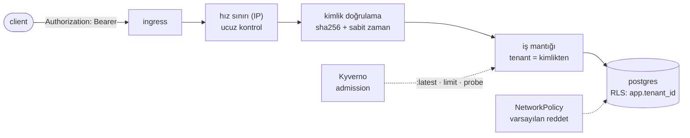

# 13 — security-tenancy · "Kim, neye, ne kadar"

> **Bu seviyede ne yaşayacaksın?**
> - Kiracının başlıktan değil hash'lenmiş bir API anahtarından türemesi; tuzak: `X-Tenant-ID` başlığıyla başka kiracı olmak (P13-01)
> - Unutulan bir tenant filtresinin sessiz sızıntısı ve Postgres RLS'nin bunu veritabanında durdurması (P13-02)
> - Varsayılan-reddet ağ: yetkisiz pod'un veritabanına ulaşamaması (P13-03); sırların hâlâ git'te düz metin olması (P13-04)
> - Tuzak: iç adrese çözülen bir alan adının kısaltılması (P13-05); link kodlarını taramanın maliyeti (P13-06)
> - README'de yazan kuralın garanti olmaması ve Kyverno ile kapıya dönüşmesi (P13-07); konteyner ve tedarik zinciri sertleştirme (P13-08)
>
> **Bu seviye olmasa ne olur?** `X-Tenant-ID` yazan herkes başka kiracı olur, unutulan bir filtre bütün kiracıların verisini sızdırır ve kümedeki herhangi bir pod veritabanına bağlanabilir.
>
> **Yeni gelen teknolojiler:** API anahtarı (sha256, sabit zamanlı karşılaştırma), Postgres RLS, NetworkPolicy (Calico), Kyverno, sealed-secrets, cert-manager, `14 · Security` paneli ([her biri tek cümleyle](../README.md#kullanılan-teknolojiler)).

## 1. Bu seviye ne?

On iki seviye boyunca her README aynı cümleyi büyük harflerle yazdı: **`X-Tenant-ID` kimlik
doğrulama değildir.** Burada nihayet oluyor. Kiracı artık hash'lenmiş bir API anahtarından
türüyor; veritabanı kiracı sınırını **kendisi** de biliyor (RLS); ağ varsayılan olarak kapalı;
merdivende öğrenilen kurallar README'den **admission policy**'ye taşınıyor.

## 2. Mimari



Sıra bilinçli: **ucuz kontroller önce** (IP limiti), pahalı olanlar sonra (hash + arama).
Kimliksiz bir sel, hash maliyeti ödemeden reddedilmeli.

## 3. Önceki seviyeden çözülenler

**Hiçbiri** — `problems/SOLVES` bunu gerekçesiyle yazar. P12-04 (`:latest`) bir sorun üretme değil
bir doğrulama scriptidir ve 12'de de `NOT-REPRODUCED` döner: hiç üretilmemiş bir sorunu "çözdüm" diye
listelemek `verify-prev`'i yeşil gösterir ama hiçbir şey kanıtlamaz.

**Kapatılan borçlar** (`SOLVES` kontratına girmedikleri için burada): `:latest` / eksik limit / eksik
probe kuralları artık yalnızca README'de değil — Kyverno `ClusterPolicy`: üç kural da admission'da
**zorunlu** (`Enforce`, P13-07). *README bir temennidir; admission policy bir garantidir.* Bu,
sorunu çözmek değil, geri gelmesini engellemektir.

Ayrıca **12 seviyelik borç** kapanıyor: P02-09 (düz metin sır) kısmen, P00-06/P13-05 (URL güvenliği)
DNS çözümüyle derinleşti ve `X-Tenant-ID` sahteciliği tamamen bitti.

## 4. Ayağa kaldırma

İlk kez mi? Önce kök README'deki [Sıfırdan başlangıç](../README.md#sıfırdan-başlangıç) — platform bir kez kurulur (`cd platform && make full`).
Bu seviyenin platformdan istediği: **temel yığın (kind, ingress, Prometheus, Grafana) + Chaos Mesh, KEDA, CloudNativePG, Argo CD + Argo Rollouts, cert-manager + Kyverno**. `make up` ilk adımda (profil) bunları açar ve kullanılmayanları kapatır; bir bileşen kurulu değilse hangi komutla kurulacağını söyleyip durur.

```bash
make up            # profil → build → push → deploy → rollout wait → smoke
code=$(curl -s -XPOST http://lvl13.localtest.me/api/links -H 'Content-Type: application/json' -H 'Authorization: Bearer acme-key-9f2c' -d '{"url":"https://example.com"}' | jq -r .code); echo "$code"
curl -s -o /dev/null -w '%{http_code} → %{redirect_url}\n' http://lvl13.localtest.me/$code   # 302 → https://example.com
make grafana       # Ladder klasörü, level=lvl13 — giriş: admin / ladder
make load S=mixed  # aynı senaryolar her seviyede: create redirect mixed hot-key burst abuser read-your-writes stairs scan
make repro P=P13-01   # §6'daki bir sorunu otomatik üret → REPRODUCED / NOT-REPRODUCED
make env           # açık ayar/tuzaklar · değiştir: make set E="KEY=değer" · hepsini geri al: make reset (§7)
make down          # seviyeyi kaldır · kümeyi durdurmak için: make -C ../platform stop
```

**Dikkat:** 13'ten itibaren yönetim uçları (`/api/...`) `Authorization: Bearer <anahtar>` ister — yukarıdaki POST bu yüzden anahtarlı (anahtarlar: `deploy/api-keys.yaml`). `GET /{code}` **public** kalır — kısa linke tıklayanın API anahtarı olmaz.

## 5. API

Her seviyede aynı: [docs/API.md](../docs/API.md).

Bu seviyenin değişikliği: **`Authorization: Bearer <key>`**.

| Uç | Kimlik |
|---|---|
| `GET /{code}` | **Public** (anahtar varsa kiracı/tier çözülür) |
| `POST/GET/DELETE /api/links*` | **Zorunlu** → yoksa `401` + `WWW-Authenticate` |

`X-Tenant-ID` artık **yok sayılır**. 401 ile 403 ayrımı: *401 = "kim olduğunu bilmiyorum",
403 = "biliyorum ama yetkin yok"*. Geçersiz anahtar birincisidir. **Bu seviyede 403 üreten bir yol
yok:** rol/izin kavramı yok ve başka kiracının linkine erişim `404` döner (linkin varlığını bile
sızdırmamak için) — "Kimlik reddi / sn (401 / 403)" panelinde yalnızca `401` çizgisi görürsün.

## 6. Reproduce edilebilir sorunlar

| ID | Sorun | Reproduce | Grafana'da | Çözüm |
|---|---|---|---|---|
| P13-01 | **TRAP** header ile kiracı taklidi | `make repro P=P13-01` | [14 · Security](http://grafana.localtest.me/d/ladder-security?var-level=lvl13&from=now-15m&to=now&refresh=10s) · [02 · App RED](http://grafana.localtest.me/d/ladder-app-red?var-level=lvl13&from=now-15m&to=now&refresh=10s) → "Kimlik reddi / sn (401 / 403)" | seviye içi (kimlik) |
| P13-02 | Unutulan tenant filtresi = sessiz sızıntı | `make repro P=P13-02` | [02 · App RED](http://grafana.localtest.me/d/ladder-app-red?var-level=lvl13&from=now-15m&to=now&refresh=10s) → "5xx (uç noktaya göre)" | seviye içi (RLS) |
| P13-03 | Her pod veritabanına ulaşabiliyor | `make repro P=P13-03` | görünmez — kanıt terminalde ↓ | seviye içi (NetworkPolicy) |
| P13-04 | Sırlar git'te düz metin | `make repro P=P13-04` | görünmez — kanıt terminalde ↓ | kısmen (sealed-secrets hazır) |
| P13-05 | **TRAP** DNS ile gizlenen iç adres | `make repro P=P13-05` | [14 · Security](http://grafana.localtest.me/d/ladder-security?var-level=lvl13&from=now-15m&to=now&refresh=10s) · [03 · App Business](http://grafana.localtest.me/d/ladder-app-business?var-level=lvl13&from=now-15m&to=now&refresh=10s) → "Tehlikeli URL reddi (sebebe göre)" | seviye içi + TOCTOU kalır |
| P13-06 | Enumeration maliyeti | `make repro P=P13-06` | [14 · Security](http://grafana.localtest.me/d/ladder-security?var-level=lvl13&from=now-15m&to=now&refresh=10s) · [10 · Rate limit](http://grafana.localtest.me/d/ladder-ratelimit?var-level=lvl13&from=now-15m&to=now&refresh=10s) → "Var olmayan kod istekleri / sn (tarama)" | kısmen (404 limiti yok) |
| P13-07 | README ≠ garanti | `make repro P=P13-07` | [14 · Security](http://grafana.localtest.me/d/ladder-security?var-level=lvl13&from=now-15m&to=now&refresh=10s) → "Politika ihlalleri (Kyverno)" | seviye içi |
| P13-08 | Konteyner/tedarik zinciri sertleştirme | `make repro P=P13-08` | görünmez — kanıt terminalde ↓ | kısmen |

---

### P13-01 · TRAP · Header ile kiracı taklidi

**Belirti:** `TRAP_HEADER_TENANT` açıkken, hiç anahtar göndermeden `X-Tenant-ID: acme` diyerek
acme'nin linki silinebiliyor. Kapalıyken aynı istek `401`/`404`.
**Neden:** Kimlik doğrulama **kodu** tuzakta da duruyor — değişen tek şey **kararın neye
dayandığı**. [Topic · Konu: Güven sınırı, kimlik]

**Reproduce:** `make repro P=P13-01`.

**Grafana'da gör:** [`14 · Security`](http://grafana.localtest.me/d/ladder-security?var-level=lvl13&from=now-15m&to=now&refresh=10s) ve [`02 · App RED`](http://grafana.localtest.me/d/ladder-app-red?var-level=lvl13&from=now-15m&to=now&refresh=10s) — script bittikten sonra aç; deney tek tek `curl` istekleriyle yapılır, tepeler küçüktür (giriş: admin / ladder)
- "Kimlik reddi / sn (401 / 403)" → kimliksiz `DELETE` denemesinden kısa, alçak bir `401` tepesi. `403` çizgisi hiç çıkmaz: bu seviyede geçersiz anahtar da `401`dir (§5), `403` üreten bir yol yok.
- "4xx (koda göre)" → globex anahtarı + `X-Tenant-ID: acme` denemesi `404` olarak görünür: kiracı anahtardan geldiği için globex, acme'nin linkini bulamaz.
- Tuzak açıkken başarılı taklit (`204`) **hiçbir hata panelinde görünmez** — sıradan bir başarılı silme gibi sayılır. Sınırın delindiği an, metrikte "her şey yolunda" gibi görünür.
- Explore'da: `sum by (result) (increase(auth_attempts_total{namespace="lvl13"}[5m]))` → `ok` (anahtarlı istekler) ve `missing` (anahtarsız istekler, public redirect'ler dahil). Tuzaklı istek hiçbir sonuca eklenmez: kimlik doğrulamaya hiç uğramaz.

**Ders:** *Bir sınır, karşılaştırdığı değeri ayarlayabilen en zayıf şey kadar güçlüdür.*
Bu yüzden "kiracıyı nereden alıyoruz?" bir uygulama detayı değil, bir **güvenlik sınırıdır**.

---

### P13-02 · Unutulan tenant filtresi = sessiz sızıntı

**Belirti:** RLS etkinken `app.tenant_id` ayarlanmamış bir sorgu **0 satır** döner; ayarlıyken
yalnızca o kiracının satırları.
**Neden:** Uygulama filtreleri, biri `WHERE`'i unutana kadar doğrudur — ve o hata **hiçbir hata
üretmez**. [Topic · Konu: RLS, katmanlı savunma]

**Reproduce:** `make repro P=P13-02`.

**Grafana'da gör:** [`02 · App RED`](http://grafana.localtest.me/d/ladder-app-red?var-level=lvl13&from=now-15m&to=now&refresh=10s) — script bittikten sonra aç (giriş: admin / ladder)
- Sızıntının kendisi (filtresiz sorgunun başka kiracının satırlarını döndürmesi) **hiçbir panelde görünmez**: hata yok, log yok, alarm yok. Kanıt, scriptin bastığı satır sayılarıdır (RLS'siz N satır → RLS ile, `app.tenant_id` ayarsız 0).
- "5xx (uç noktaya göre)" → RLS açıkken yapılan 3 yazma `/api/links` rotasında küçük bir tepe olarak görünür (Postgres `42501` → uygulama `503`): RLS'in bedeli, sızıntının tersine, gürültülüdür.
- Explore'da: `sum by (op) (increase(db_queries_total{namespace="lvl13",result="error"}[5m]))` → `create` işleminde aynı yazmalar kadar hata.

**İki kritik detay:**
- **`FORCE ROW LEVEL SECURITY`** olmadan tablo **sahibi** politikayı atlar → politika yazılmış ama
  hiç uygulanmamış olur. RLS'in en sık atlanan detayı.
- Transaction havuzlaması ile ayar **işlem başına** (`SET LOCAL`) yapılmalı; oturum başına
  yapılırsa bir sonraki kiracı öncekinin ayarını devralır — **P09-03'teki aynı fizik**.

---

### P13-03 · Varsayılan-reddet ağ

**Belirti:** Yetkisiz bir pod'dan `nc -z pg-pooler-rw 5432` **engellenir**.
**Neden:** Kubernetes'in varsayılanı "herkes herkesle konuşabilir"dir.
[Topic · Konu: NetworkPolicy, en az yetki]

**Reproduce:** `make repro P=P13-03`.

**Grafana'da gör:** Grafana'da görünmez — NetworkPolicy paketi CNI seviyesinde (Calico) düşürür; uygulama bunu hiç görmez ve bir metrik üretmez. `14 · Security` → "Ağ politikası hataları (Calico)" paneli bu kümede **boş** kalır: Calico'nun (felix) metrikleri Prometheus'a kazınmıyor — üstelik panelin sorguladığı `felix_int_dataplane_failures` düşürülen paketleri değil dataplane hatalarını sayar. Kanıt terminalde:
- `kubectl -n lvl13 get networkpolicy` → `default-deny-ingress` ve izin listesi (`allow-postgres-from-apps`, `allow-redis-from-apps`, …): kim kiminle konuşuyor, tek bakışta.
- `make repro P=P13-03` → yetkisiz `netcheck` pod'undan `POSTGRES_ENGELLENDI` ve `REDIS_ENGELLENDI`.

**Ders:** Varsayılan-reddet, soruyu *"neyi engellemeliyim?"*den (sonsuz) *"ne neyle konuşmalı?"*ya
(sonlu, gözden geçirilebilir, **mimariyi belgeler**) çevirir.
**Uyarı:** NetworkPolicy yalnızca CNI destekliyorsa çalışır (burada Calico). Desteklemeyen bir
cluster'da politika yazmak **güvenlik yanılsamasıdır**. **Eksik:** egress kuralları.

---

### P13-04 · Sırlar hâlâ git'te düz metin

**Belirti:** `deploy/api-keys.yaml` ve `cnpg.yaml` düz metin sır içeriyor; sealed-secrets kurulu
ama kullanılmıyor.
**Neden (dürüst hâli):** SealedSecret üretmek cluster'ın anahtarını gerektirir ve depoyu taze bir
cluster'da kullanılamaz kılardı. *Bir sırrın güvenli olduğunu varsaymak, olmadığını kabul etmekten
kötüdür* — bu yüzden düz Secret duruyor ve script çözümü tek komuta indiriyor.
[Topic · Konu: Sır yönetimi]

**Reproduce:** `make repro P=P13-04` — durumu ölçer ve `kubeseal` komutunu yazar.

**Grafana'da gör:** Grafana'da görünmez — sır git'teki bir dosyada duruyor; hiçbir metrik bir dosyanın içeriğini ölçmez. Kanıt terminalde:
- `grep -n 'API_KEYS:\|POSTGRES_PASSWORD:' deploy/api-keys.yaml deploy/cnpg.yaml` → `API_KEYS: "acme:pro:acme-key-9f2c,…"` ve `POSTGRES_PASSWORD: linkly`: git'e commit edilmiş düz metin.
- `kubectl get crd sealedsecrets.bitnami.com` → CRD var: araç kurulu, kullanılmıyor.

**Sealed-secrets'ın çözmediği:** sır pod'un **env**'inde hâlâ düz metin.
*Sır yönetimi bir araç seçimi değil, bir zincir: git → cluster → pod → süreç → log → yedek.*

---

### P13-05 · TRAP · DNS ile gizlenen iç adresler

**Belirti:** `http://localtest.me/` (127.0.0.1'e çözülür) DNS kontrolü açıkken **reddedilir**,
kapalıyken **kabul edilir**.
**Neden:** 01'deki kontrol yalnızca düz IP'lere bakıyordu; saldırgan bir alan adı kaydeder.
[Topic · Konu: SSRF/open redirect, DNS rebinding]

**Reproduce:** `make repro P=P13-05`.

**Grafana'da gör:** [`14 · Security`](http://grafana.localtest.me/d/ladder-security?var-level=lvl13&from=now-15m&to=now&refresh=10s) ve [`03 · App Business`](http://grafana.localtest.me/d/ladder-app-business?var-level=lvl13&from=now-15m&to=now&refresh=10s) — script bittikten sonra aç; her deneme tek istek olduğu için tepeler alçaktır (giriş: admin / ladder)
- "Tehlikeli URL reddi (sebebe göre)" → DNS kontrolü açıkken iki seri: `private_address` (düz IP `169.254.169.254` ve `localhost`) ve `private_address_resolved` (`localtest.me` → 127.0.0.1 — yalnızca DNS çözümünün yakalayabildiği). Tuzak açıldıktan sonra aynı `localtest.me` isteği reddedilmez: `private_address_resolved` yeni bir tepe yapmaz.
- "Oluşturma sonuçları" → ilk fazda `invalid`; tuzaklı fazda aynı adres `ok` sayılır — atlatılan kontrol, metrikte başarı olarak görünür.

**Kapatılamayan boşluk (TOCTOU):** biz oluşturma anında çözüyoruz, tarayıcı tıklama anında
çözecek. Azaltmalar: çözülen IP'yi sabitle (CDN'i kırar) · redirect anında yeniden kontrol
(her redirect'e bir DNS sorgusu) · egress politikası.
*"Riski azalttık" demek, "yok ettik" demekten dürüsttür. Bir kontrolün sınırını bilmemek, onu hiç
yapmamaktan tehlikelidir — çünkü yanlış bir güven duygusu üretir.*

---

### P13-06 · Enumeration maliyeti

**Belirti:** Rastgele kod taraması 404 üretir; hız sınırı taramanın hızını, negatif önbellek ise
**tekrar sorulan** yok-olan kodların DB maliyetini düşürür — ama **404 oranına özel bir kural yoktur**.
**Neden:** Kod uzayı 62⁷ = 3.5×10¹² — tahmin pratikte imkânsız. Asıl mesele taramanın **maliyeti
ve görünürlüğü**. Negatif önbellek her istekte **yeni** kod üreten saf bir taramaya karşı hiçbir şey
yapamaz (tekrar edecek bir "yok" cevabı yok); faydası aynı yok-olan kodlar tekrar sorulduğunda
görünür. [Topic · Konu: Enumeration]

**Reproduce:** `make repro P=P13-06` — iki faz, her biri 40 sn `scan` yükü (limiter devrede):
(1) her istek yeni bir kod (enumeration) → negatif isabet ~0, izin verilen her istek DB'ye iner;
(2) aynı 60 yok-olan kod tekrar tekrar (`KEYS=60`, `scan.js`) → negatif önbellek cevaplar, 404 başına
DB okuması düşer. Script iki fazın "404 başına DB okuması"nı yan yana basar; 2. fazda negatif isabet
yoksa ölçemediğini söyler (exit 2).

**Grafana'da gör:** [`14 · Security`](http://grafana.localtest.me/d/ladder-security?var-level=lvl13&from=now-15m&to=now&refresh=10s), [`10 · Rate limit`](http://grafana.localtest.me/d/ladder-ratelimit?var-level=lvl13&from=now-15m&to=now&refresh=10s) ve [`04 · Cache`](http://grafana.localtest.me/d/ladder-cache?var-level=lvl13&from=now-15m&to=now&refresh=10s) — ilk tarama başlayınca aç; iki faz arka arkaya ~2 dk sürer (giriş: admin / ladder)
- "Var olmayan kod istekleri / sn (tarama)" → iki faz boyunca iki plato, sonra sıfır; platonun yüksekliği limiter'ın izin verdiği hızdır (iki fazda da aynı). Normal trafikte bu çizgi sıfıra yakındır — eksik olan "404 oranı" kuralının eşiği bu çizgiden okunur.
- "Kararlar (anahtar türüne göre)" → `ip` anahtarlı `reject` çizgisi `allow`'u ezer: tek IP'den gelen taramanın çoğu önbelleğe bile ulaşmadan `429` ile döner (script limiter'ı bilerek devrede tutar).
- "Önbellek işlemleri (katman ve sonuca göre)" → 1. fazda `l2` `miss` yükselir, `negative_hit` düz kalır: her kod yeni, önbellekte tekrar edecek bir cevap yok. 2. fazda `negative_hit` baskın olur ve `miss` anahtar başına ~10 sn'de bire iner (`CACHE_NEGATIVE_TTL`).
- "Önbellek ıskası ve veritabanı sorguları" → 1. fazda iki çizgi birlikte, izin verilen tarama hızında; 2. fazda ikisi de belirgin düşer: negatif önbelleğin kurtardığı DB okuması aradaki farktır.

**Üç katman zaten var:** rastgele 7 karakter (01) · negatif önbellek (03) · hız sınırı (08).
**Eksik dördüncü:** 404 **oranına** göre limit — normal client'ın oranı düşüktür, tarayanınki
~%100. `NOT_FOUND_LIMIT` bunun için ayrıldı ama **uygulanmadı**.
*Enumeration'ı tamamen engellemek genelde mümkün değildir; amaç onu pahalı ve görünür kılmaktır.*

---

### P13-07 · README ≠ garanti

**Belirti:** `:latest`, bellek limitsiz ya da probe'suz bir pod **admission'da reddedilir**.
**Neden:** Bu kurallar şimdiye kadar yalnızca README'lerde yazıyordu.
[Topic · Konu: Policy as code]

**Reproduce:** `make repro P=P13-07` — üç ihlali `--dry-run=server` ile dener.

**Grafana'da gör:** [`14 · Security`](http://grafana.localtest.me/d/ladder-security?var-level=lvl13&from=now-15m&to=now&refresh=10s) — script bittikten sonra aç (giriş: admin / ladder)
- "Politika ihlalleri (Kyverno)" → `linkly-ladder-baseline` adında kısa, alçak bir `fail` tepesi: reddedilen üç deneme (panel 5 dk'lık `rate` çizdiği için tepe yayvan). Panel küme geneli sayar, namespace filtresi yok.
- Çizgi hiç yoksa önce Kyverno'nun kazındığını doğrula (Explore'da `up{namespace="kyverno"}` → `1`). Kanıt her durumda terminalde: `kubectl -n lvl13 run policy-test --image=busybox:latest --restart=Never --dry-run=server` → `admission webhook … denied the request` ve ihlal edilen kural adları.

**Politikaların kaynağı bu merdivenin kendi geçmişi:** P12-04 (`:latest`), P00-08 (bellek limiti),
P00-04 + P07-08 (probe). *Her kural, bir kez ölçülmüş bir arızanın kalıcı karşılığı.*
**İki operasyonel not:** yeni politikayı önce `Audit` ile açmak standarttır; politika **admission**
anında çalışır, zaten çalışan ihlalleri **silmez**.

**Kapsam notu — politikanın patlama yarıçapı:** Bu politikalar bilerek yalnızca `lvl13`
namespace'ine kapsandı. `ClusterPolicy` **küme kapsamlıdır** ve `make down` onu silmez (yalnızca
namespace gider). Kapsam `lvl*` + `Enforce` olsaydı, bu seviyeyi bir kez çalıştırdıktan sonra
**00'ı bir daha ayağa kaldıramazdın**: orada bellek limiti bilerek yok (P00-08). Yani politika,
onu kuran şeyden daha uzun yaşar ve geçmişi de kapsar. Üretimde istediğin tam olarak budur;
bir öğrenme merdiveninde ise kendi kendini kilitlemektir. *Bir kuralı yazmadan önce "kimleri
kapsıyor ve ne zaman kaldırılacak?" sorusunun cevabını yaz.*

---

### P13-08 · Konteyner ve tedarik zinciri sertleştirme

**Belirti/Doğrulama:** İmajda shell **yok** (distroless), `readOnlyRootFilesystem: true`,
`capabilities: drop ALL`, non-root.
**Neden:** *Kod güvenliği, çalıştırdığın imajın güvenliğiyle sınırlıdır.*
[Topic · Konu: Saldırı yüzeyi, tedarik zinciri]

**Reproduce:** `make repro P=P13-08`.

**Grafana'da gör:** Grafana'da görünmez — sertleştirme bir çalışma zamanı olayı değil, pod tanımının ve imajın bir özelliği; hiçbir panel onu çizmez (`14 · Security` → "Politika ihlalleri (Kyverno)" da göstermez: bu alanları zorunlu kılan bir kural yok). Kanıt terminalde:
- `kubectl -n lvl13 get pod -l app.kubernetes.io/name=redirect -o jsonpath='{.items[0].spec.containers[0].securityContext}'` → `"readOnlyRootFilesystem":true`, `"runAsNonRoot":true` ve `"capabilities":{"drop":["ALL"]}` içeren bir JSON.
- `kubectl -n lvl13 exec $(kubectl -n lvl13 get pod -l app.kubernetes.io/name=redirect -o name | head -1) -- /bin/sh -c 'echo VAR'` → `VAR` yerine `/bin/sh` bulunamadı hatası: imajda shell yok (distroless).

**Distroless'ın verdiği:** içeride shell yoksa uzaktan kod çalıştırma bir `curl | sh` zincirine
dönüşemez. **Bedeli 00'da yaşandı:** `HEALTHCHECK`'in çağıracağı araç yok, bu yüzden binary
kendini yokluyor.
**Eksik kalanlar:** imaj tarama (Trivy) · imza (cosign) + `verifyImages` politikası · SBOM ·
base imaj güncelleme otomasyonu.

> **Belgeyi ölçümle doğrula.** Yukarıdaki `readOnlyRootFilesystem: true` / `drop ALL` / non-root
> satırları README'de yazması yetmez; P13-08 onları çalışan pod'un `securityContext`'inden okur ve
> manifest'te yoksa `NOT-REPRODUCED` der. README bir iddiadır, `kubectl get pod -o jsonpath` bir
> kanıttır. ("İmaj nonroot koşuyor" imaj hakkında bir iddiadır; `runAsNonRoot` API sunucusunun
> kontrol ettiği bir iddiadır — ikisi aynı şey değil.)

## 7. Seviye içi alıştırmalar (TRAP_ bayrakları)

> **Nasıl uygulanır:** aç `make set E="TRAP_X=true"` · ne açık? `make env` · hepsini geri al `make reset` (ortamı `deploy/`'daki hâline döndürür; `make unset E=TRAP_X` yalnızca siler). Tablodaki diğer ayarlar da aynı yolla (`make set E="CACHE_TTL=1h"`). Pod'lar yeni değerle yeniden başlar; komut hazır olunca döner. Varsayılan olarak seviyenin TÜM uygulama servislerine uygulanır (tek servis: `W=redirect`); 12'den itibaren Argo Rollout'larda da çalışır — `kubectl set env` orada çalışmaz. `make repro` scriptleri tuzağı KENDİLERİ açıp kapatır ve bitince ortamı eski hâline getirir (senin açtıkların dahil): elle alıştırma için `make set` + `make load`, otomatik ölçüm için `make repro`. Bitirince `make reset`: açık kalan bir tuzak sonraki deneyi sessizce bozar.

| Bayrak | Ne yapar | Reproduce | Düzeltme |
|---|---|---|---|
| `TRAP_HEADER_TENANT` | Kiracıyı yine header'dan alır | `make repro P=P13-01` | Bayrağı kapat |
| *(bayrak yok — script SQL'i doğrudan koşar)* | "Unutulmuş `WHERE tenant = …`" filtresiz bir sorgu olarak koşulur; sonra RLS açılıp aynı sorgu tekrarlanır. Bayrak değil: "unutulmuş filtre" bir kod yolu değil tek bir sorgudur; script onu uygulamanın rolüyle kendisi koşar ve ölçülen şey RLS'in o sorguya ne yaptığıdır. | `CONFIRM=1 make repro P=P13-02` | RLS yakalar |
| `TRAP_NO_DNS_CHECK` | DNS çözümü yapmaz | `make repro P=P13-05` | Bayrağı kapat |

Elle denemeye değer:
- `AUTH_REQUIRED=true` yapıp `GET /{code}`'u dene: **public bir ucu kimliğe bağlamak** ürünü bozar.
  *Her ucu korumak, korumanın değerini artırmaz — hangi ucun neden açık olduğunu bilmek artırır.*
- Kyverno politikasını `Audit`'e çevir ve ihlalli pod'u dağıt: rapor var, engel yok.
  Hangi modun ne zaman doğru olduğunu ölç.
- `TIER_LIMITS`'i kullanacak şekilde limiti kimliğe bağla (şu an sabit): `free` bir anahtarla
  ve `enterprise` bir anahtarla `make load S=abuser` koş. **08'de eksik bıraktığımız tier
  kotaları için gereken kimlik artık var.**
- RLS'i `NO FORCE` yap ve P13-02'yi tekrar koş: politika duruyor ama sahip atlıyor —
  *var olan ama uygulanmayan bir kontrolün nasıl göründüğünü gör.*

## 8. Gözlemlenebilirlik: hangi paneller dolu, hangileri boş

| Dashboard | Durum | Neden |
|---|---|---|
| [`14 · Security`](http://grafana.localtest.me/d/ladder-security?var-level=lvl13&from=now-15m&to=now) | **Dolu** ✨ | Kimlik reddi (yalnızca `401`: bu seviyede `403` üreten yol yok, §5), tehlikeli URL reddi (`private_address_resolved` dahil), Kyverno ihlalleri, 404 taraması. "Ağ politikası hataları (Calico)" boş (felix kazınmıyor) |
| [`10 · Rate limit`](http://grafana.localtest.me/d/ladder-ratelimit?var-level=lvl13&from=now-15m&to=now) | Dolu — **artık kimlikli** | `key_type=tenant` değerleri gerçek kiracılar |
| [`13 · Rollout`](http://grafana.localtest.me/d/ladder-rollout?var-level=lvl13&from=now-15m&to=now) | Dolu | Sürüme göre paneller pod şablonu hash'iyle ayrılır (12'deki gibi); stable hash: `kubectl -n lvl13 get rollout redirect -o jsonpath='{.status.stableRS}'`. "Git ile uyumsuz uygulamalar (Argo CD)" boş: Application yok |
| [`12 · SLO`](http://grafana.localtest.me/d/ladder-slo?var-level=lvl13&from=now-15m&to=now) · [`11 · Resilience`](http://grafana.localtest.me/d/ladder-resilience?var-level=lvl13&from=now-15m&to=now) | Dolu | "Bağımlılık gecikmesi p99" `postgres` ve `redis`'i ayrı çizer (Redis çağrıları kendi etiketiyle, `dep="redis"`) |

Yeni metrik: `auth_attempts_total{result}` (panel yok — Explore'da). **`invalid` oranındaki ani
artış bir saldırı sinyalidir** — ve bu, bir SLO'dan değil bir güvenlik kuralından alarm üretmesi
gereken nadir durumlardan biri.

## 9. Bilerek bırakılanlar

- **OIDC/JWT yok**: API anahtarı seçildi. JWT, imza doğrulama + anahtar rotasyonu + iptal listesi
  getirir; *ders kimlik doğrulamanın kendisiydi, protokol seçimi değil.*
- **Sırlar düz metin** (P13-04): sealed-secrets kurulu, kullanılmıyor — gerekçesi yazılı.
- **Egress NetworkPolicy yok**: pod'lar internete serbest çıkıyor.
- **404 oranına özel limit yok** (P13-06): `NOT_FOUND_LIMIT` ayrıldı, uygulanmadı.
- **Tier kotaları bağlanmadı**: `TIER_LIMITS` tanımlı ama limiter sabit kota kullanıyor.
- **TLS yok**: cert-manager kurulu ama ingress hâlâ HTTP. *localtest.me için sertifika üretmek
  self-signed olurdu ve tarayıcı uyarısı dersi gölgelerdi.*
- **Audit log yok**: kim neyi sildi kaydı tutulmuyor (erişim log'u var, **eylem** log'u yok).
- **İmaj tarama/imza yok** (P13-08).
- **`/metrics` herkese açık**: redirect'in 8080 portunda, ingress'in `/` yolunun gittiği yerde —
  `http://lvl13.localtest.me/metrics` dışarıdan okunur. Profil uçları bu yüzden ayrı bir iç portta
  (`:6060`, hiçbir Service/Ingress göstermiyor; CPU profili bir isteğe 30 sn CPU yaktırır ve
  internette durmamalı). `/metrics` de üretimde böyle bir yönetim portuna taşınır.
- **Kyverno fail-OPEN** (`forceFailurePolicyIgnore`, `platform/Makefile`): Kyverno ayakta değilken
  politikalar uygulanmaz. Varsayılan `failurePolicy: Fail` ile Kyverno her yeniden başladığında **tüm
  kümenin yazmaları** reddedilir (PVC oluşmaz, `make up` düşer). P08-01'deki limiter seçiminin
  aynısı: korumayı kaybetmek telafi edilebilir, hizmeti kaybetmek edilemez. Üretimde karşılığı
  Kyverno'yu 3 replika + PodDisruptionBudget ile çalıştırıp Fail'de tutmaktır.
- **Yük testi muafiyeti** (`deploy/loadtest.yaml`, 08'den beri): jetonlu, hız sınırı olmayan ikinci
  giriş. Tek IP'li yük üreteci herkese açık girişte sistemi değil limiter'ları ölçer. Üretimde
  bu giriş internetten erişilemez ve jeton mühürlü olur.

## 10. `make diff-prev` okuma rehberi

`make diff-prev` 12 ile farkı gösterir:

1. **`internal/auth/apikey.go`** (yeni): hash'li saklama + **sabit zamanlı** karşılaştırma.
   *Zamanlama yan kanalı küçüktür ama kapatması bedavadır.*
2. **`internal/httpapi/server.go` → `tenantOf`**: gövde neredeyse aynı, **değerin kaynağı** farklı.
   Bu seviyenin bütün güvenlik dersi o üç satırda.
3. **`internal/httpapi/auth_mw.go`**: zincirdeki **yeri** yorumda gerekçelendirilmiş —
   hız sınırından sonra, iş mantığından önce.
4. **`migrations/007_rls.sql`**: `FORCE ROW LEVEL SECURITY` satırı olmadan politika **dekoratif**
   olurdu. Yorumda bu ve transaction-pooling tuzağı yazılı. Migration hedefi (`deploy/migrate-job.yaml`)
   onu bilerek uygulamaz: RLS'i P13-02 açar ve kapatır.
5. **`deploy/security.yaml`**: varsayılan-reddet + izin listesi. Liste, **mimarinin kendisinin
   dokümantasyonu**: kim kiminle konuşuyor, tek bakışta.
6. **`deploy/kyverno-policies.yaml`**: merdivenin README'lerinden **kapıya** taşınan üç kural.
7. **`internal/httpapi/api_test.go`**: testler `X-Tenant-ID`'den Bearer token'a taşındı.
   *"Testi değiştirmek zorunda kaldım" bazen bir sinyal, bazen de sözleşmenin gerçekten
   değiştiğinin kanıtıdır.*
