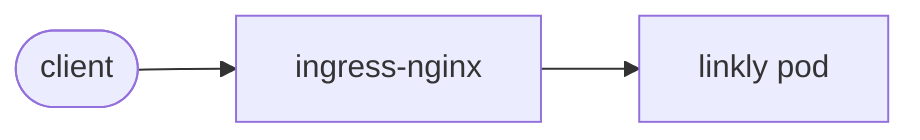

# NN — <ad> · "<slogan>"

<!-- Her seviyenin README'si bu 10 başlığı bu sırada taşır. 4 ve 5 SABİT METİN: kelimesi kelimesine aynı. -->

## 1. Bu seviye ne?

Üç cümle: ne var, ne yok, neden.

## 2. Mimari



## 3. Önceki seviyeden çözülenler

| ID | Sorun | Nasıl çözüldü |
|---|---|---|
| Pxx-yy | … | … |

`problems/SOLVES` dosyası aynı listeyi makine-okunur tutar; `make verify-prev` bunu kullanır.

## 4. Ayağa kaldırma

<!-- SABİT METİN — değiştirme -->
Platform bir kere kurulur (`cd platform && make minimal`). Sonra bu klasörde:

```bash
make up            # build → push → deploy → rollout wait → smoke
curl -s -XPOST http://lvlNN.localtest.me/api/links -H 'Content-Type: application/json' -d '{"url":"https://example.com"}'
curl -I http://lvlNN.localtest.me/<code>
make grafana       # Ladder klasörü, level=lvlNN
make load S=mixed  # aynı senaryolar her seviyede: create redirect mixed hot-key burst abuser read-your-writes stairs scan
make down
```

## 5. API

<!-- SABİT METİN — değiştirme -->
Her seviyede aynı: [docs/API.md](../docs/API.md).

## 6. Reproduce edilebilir sorunlar

| ID | Sorun | Reproduce | Grafana'da | Çözüm |
|---|---|---|---|---|
| PNN-01 | … | `make repro P=PNN-01` | dashboard → panel | seviye |

Her sorun için alt bölüm (docs/PROBLEM-TEMPLATE.md kalıbı):

### PNN-01 · <başlık>
**Belirti:** …
**Neden:** …
**Reproduce (adım adım):**
  1. …
  2. …
**Grafana:** `<dashboard>` → "<panel>"; PromQL: `…`
**Nerede çözülüyor:** NN+1 (…). Geçici çare: …

## 7. Seviye içi alıştırmalar (TRAP_ bayrakları)

| Bayrak | Ne yapar | Reproduce | Düzeltme |
|---|---|---|---|

## 8. Gözlemlenebilirlik: hangi paneller dolu, hangileri boş

| Dashboard | Durum | Neden |
|---|---|---|

## 9. Bilerek bırakılanlar

- …

## 10. `make diff-prev` okuma rehberi

Diff'te neye bak: …
